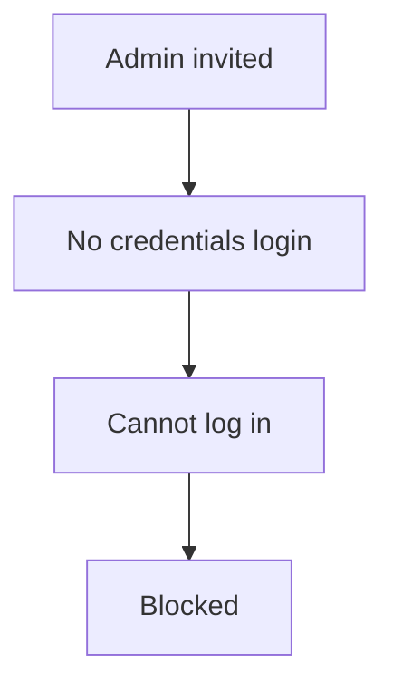
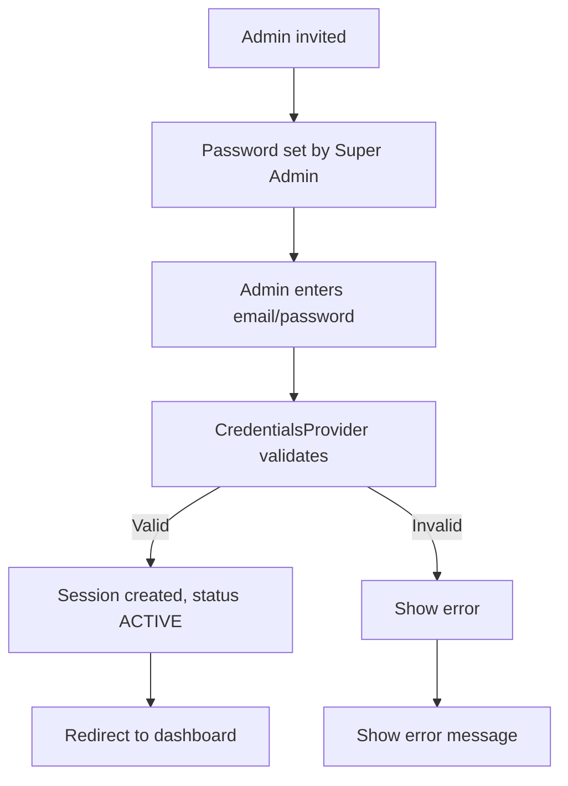

# Flow Overview / Tổng quan Luồng

## Current Flow / Luồng Hiện tại

## Proposed Flow / Luồng Đề xuất

## Changes Highlighted / Thay đổi Nổi bật
- Added: CredentialsProvider for Admin login
- Modified: LoginForm to support Admin credentials
- Removed: Blocked login for Admins without Google account
