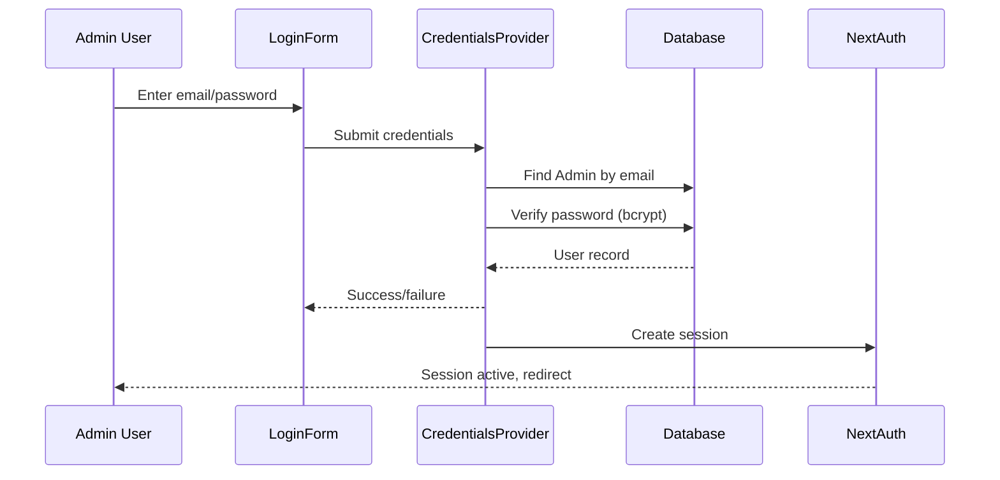

# Sequence: Admin Credentials Login

## Notes / Ghi chú
- Step 1: Admin enters credentials
- Step 2: LoginForm submits to CredentialsProvider
- Step 3: Provider validates against database
- Step 4: Session created, user redirected
- Step 5: Errors handled with generic messages
