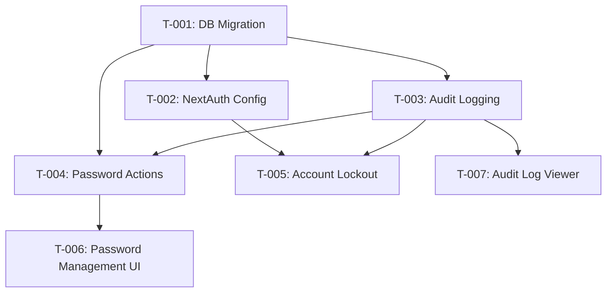

# Task Plan — Admin Credentials Login
# Kế hoạch Task — Đăng nhập Admin bằng mật khẩu
<!-- Template Version: 1.0 | Contract: v1.0 | Created: 2026-02-07 -->
<!-- 🇻🇳 Vietnamese first, 🇬🇧 English follows — for easy scanning -->

---

## 📋 TL;DR

| Aspect | Value |
|--------|-------|
| Feature | Admin Credentials Login |
| User Story | US-0.2.4 |
| Dev Mode | Standard |
| Total Tasks | 7 |
| Estimated Effort | 10-12 hours |
| Affected Roots | sgs-cs-helper |
| Spec Reference | [spec.md](../01_spec/spec.md) |

---

## 1. Task Overview / Tổng quan Task

| ID | Title | Root | Deps | Est | Status |
|----|-------|------|------|-----|--------|
| T-001 | Database migration for failedLoginCount and AuditLog | sgs-cs-helper | - | S | ⬜ |
| T-002 | Extend NextAuth config for Admin credentials login | sgs-cs-helper | T-001 | M | ⬜ |
| T-003 | Create audit logging utility | sgs-cs-helper | T-001 | S | ⬜ |
| T-004 | Create Super Admin password management actions | sgs-cs-helper | T-001, T-003 | M | ⬜ |
| T-005 | Implement account lockout logic | sgs-cs-helper | T-002, T-003 | M | ⬜ |
| T-006 | Create Super Admin password management UI | sgs-cs-helper | T-004 | M | ⬜ |
| T-007 | Create audit log viewer for Super Admin | sgs-cs-helper | T-003 | M | ⬜ |

**Legend:** S = Small (<1h), M = Medium (1-2h), L = Large (2-4h)

---

## 2. Dependency Graph / Đồ thị Phụ thuộc



---

## 3. Parallel Execution Notes / Ghi chú Thực thi Song song

### 3.1 Parallel Groups

| Group | Tasks | Reason |
|-------|-------|--------|
| A | T-002, T-003, T-004 | All depend on T-001, different files |
| B | T-006, T-007 | Different components, can work in parallel |

### 3.2 Sequential Constraints

| Sequence | Reason |
|----------|--------|
| T-001 → All others | Database migration must run first |
| T-002 → T-005 | Lockout logic extends NextAuth |
| T-003 → T-005 | Lockout needs audit logging |
| T-004 → T-006 | UI needs Server Actions |

### 3.3 Recommended Execution Order

```
Phase 1: T-001 (DB migration)
Phase 2: T-002, T-003, T-004 (parallel - core logic)
Phase 3: T-005 (lockout - depends on Phase 2)
Phase 4: T-006, T-007 (parallel - UI)
```

---

## 4. Tasks by Root / Task theo Root

### Root: sgs-cs-helper

---

#### T-001: Database Migration for failedLoginCount and AuditLog

| Aspect | Detail |
|--------|--------|
| Root | sgs-cs-helper |
| Dependencies | None |
| Estimate | S (45 min) |
| Requirements | FR-003, FR-004 |

**Description / Mô tả:**

🇻🇳
Tạo Prisma migration để thêm field `failedLoginCount` vào model Admin và tạo model AuditLog mới cho login logging.

🇬🇧
Create Prisma migration to add `failedLoginCount` field to Admin model and create new AuditLog model for login logging.

**Files to Change / File Thay đổi:**
- Create: `prisma/migrations/YYYYMMDDHHMMSS_add_failed_login_count_and_audit_log/migration.sql`
- Modify: `prisma/schema.prisma`

**Schema Changes:**
```prisma
model Admin {
  // ... existing fields
  failedLoginCount  Int      @default(0)
  auditLogs         AuditLog[]
}

model AuditLog {
  id        String      @id @default(cuid())
  adminId   String
  admin     Admin       @relation(fields: [adminId], references: [id], onDelete: Cascade)
  timestamp DateTime    @default(now())
  result    LoginResult
  ip        String?
  createdAt DateTime    @default(now())
  
  @@index([adminId, timestamp])
}

enum LoginResult {
  SUCCESS
  FAILURE
}
```

**Done Criteria / Tiêu chí Hoàn thành:**
- [ ] Prisma schema updated with new fields/models
- [ ] Migration generated: `pnpm db:migrate`
- [ ] Migration applied successfully to database
- [ ] Prisma client regenerated: `pnpm db:generate`

**Verification / Kiểm tra:**
- Run: `pnpm db:migrate`
- Run: `pnpm db:generate`
- Check: `prisma/schema.prisma` has new fields
- Check: Database has `AuditLog` table and `Admin.failedLoginCount` column

---

#### T-002: Extend NextAuth Config for Admin Credentials Login

| Aspect | Detail |
|--------|--------|
| Root | sgs-cs-helper |
| Dependencies | T-001 |
| Estimate | M (1.5 hours) |
| Requirements | FR-001 |

**Description / Mô tả:**

🇻🇳
Mở rộng NextAuth CredentialsProvider để hỗ trợ Admin login bằng email/mật khẩu. Logic hiện tại hỗ trợ Super Admin, cần mở rộng để hỗ trợ cả Admin.

🇬🇧
Extend NextAuth CredentialsProvider to support Admin login via email/password. Current logic supports Super Admin, need to extend for Admin.

**Files to Change / File Thay đổi:**
- Modify: `src/lib/auth/config.ts`
- Modify: `src/lib/auth/auth.ts` (if needed for helper functions)

**Implementation Details:**
- Check `authMethod === CREDENTIALS` for both SUPER_ADMIN and ADMIN
- Verify `passwordHash` exists
- Use bcrypt to verify password
- Check Admin status (ACTIVE, PENDING allowed; LOCKED blocked)
- Update status PENDING → ACTIVE on first login
- Create session with correct role

**Done Criteria / Tiêu chí Hoàn thành:**
- [ ] CredentialsProvider supports Admin login (role=ADMIN)
- [ ] Password validated with bcrypt for Admin
- [ ] Admin status checked (LOCKED blocked, PENDING→ACTIVE updated)
- [ ] Session created with correct role for Admin
- [ ] Error messages are generic ("Invalid email or password")

**Verification / Kiểm tra:**
- Test: Admin with authMethod=CREDENTIALS can log in
- Test: Admin with wrong password sees generic error
- Test: Admin with status=LOCKED cannot log in
- Test: Admin with status=PENDING updates to ACTIVE after first login
- Run: `pnpm tsc` (no type errors)

---

#### T-003: Create Audit Logging Utility

| Aspect | Detail |
|--------|--------|
| Root | sgs-cs-helper |
| Dependencies | T-001 |
| Estimate | S (45 min) |
| Requirements | FR-003 |

**Description / Mô tả:**

🇻🇳
Tạo utility function để log các lần đăng nhập (thành công/thất bại) vào AuditLog table. Function này sẽ được gọi từ NextAuth và các Server Actions.

🇬🇧
Create utility function to log login attempts (success/failure) to AuditLog table. This function will be called from NextAuth and Server Actions.

**Files to Change / File Thay đổi:**
- Create: `src/lib/utils/audit-log.ts`

**API Design:**
```typescript
export async function logLoginAttempt(params: {
  adminId: string;
  result: 'SUCCESS' | 'FAILURE';
  ip?: string;
}): Promise<void>
```

**Done Criteria / Tiêu chí Hoàn thành:**
- [ ] `logLoginAttempt` function created
- [ ] Function writes to AuditLog table
- [ ] Handles database errors gracefully (log error, don't throw)
- [ ] TypeScript types exported

**Verification / Kiểm tra:**
- Test: Call `logLoginAttempt` with SUCCESS/FAILURE
- Check: AuditLog table has new entries
- Test: Function doesn't throw on database error
- Run: `pnpm tsc` (no type errors)

---

#### T-004: Create Super Admin Password Management Actions

| Aspect | Detail |
|--------|--------|
| Root | sgs-cs-helper |
| Dependencies | T-001, T-003 |
| Estimate | M (1.5 hours) |
| Requirements | FR-002 |

**Description / Mô tả:**

🇻🇳
Tạo Server Actions cho Super Admin để tạo/đổi mật khẩu Admin. Action sẽ hash mật khẩu bằng bcrypt, reset failedLoginCount, unlock tài khoản nếu cần, và log thay đổi.

🇬🇧
Create Server Actions for Super Admin to create/change Admin passwords. Actions will hash password with bcrypt, reset failedLoginCount, unlock account if needed, and log changes.

**Files to Change / File Thay đổi:**
- Create: `src/lib/actions/admin-password.ts`

**Server Actions:**
1. `setAdminPassword(adminId: string, password: string)` - Set/change password
2. `unlockAdminAccount(adminId: string)` - Reset failedLoginCount, update status

**Implementation Details:**
- Validate: Only SUPER_ADMIN can call these actions
- Hash password with bcrypt (SALT_ROUNDS=10)
- Reset `failedLoginCount` to 0
- Update status from LOCKED to ACTIVE (if applicable)
- Log password change in AuditLog

**Done Criteria / Tiêu chí Hoàn thành:**
- [ ] `setAdminPassword` Server Action created
- [ ] `unlockAdminAccount` Server Action created
- [ ] Password hashed with bcrypt before storage
- [ ] failedLoginCount reset to 0 on password change
- [ ] Status updated from LOCKED to ACTIVE
- [ ] Password change logged in AuditLog
- [ ] Zod validation for inputs

**Verification / Kiểm tra:**
- Test: Super Admin can change Admin password
- Test: Password is hashed in database (not plain text)
- Test: failedLoginCount reset to 0
- Test: LOCKED account becomes ACTIVE
- Test: AuditLog has password change entry
- Run: `pnpm tsc` (no type errors)

---

#### T-005: Implement Account Lockout Logic

| Aspect | Detail |
|--------|--------|
| Root | sgs-cs-helper |
| Dependencies | T-002, T-003 |
| Estimate | M (1.5 hours) |
| Requirements | FR-004 |

**Description / Mô tả:**

🇻🇳
Thêm logic vào NextAuth config để increment failedLoginCount khi đăng nhập sai, khóa tài khoản sau 10 lần sai, reset count khi đăng nhập thành công, và log tất cả attempts.

🇬🇧
Add logic to NextAuth config to increment failedLoginCount on failed login, lock account after 10 failures, reset count on successful login, and log all attempts.

**Files to Change / File Thay đổi:**
- Modify: `src/lib/auth/config.ts`

**Implementation Details:**
- Before password check: Log attempt with `logLoginAttempt`
- On failed login: Increment `failedLoginCount`
- If `failedLoginCount >= 10`: Update status to LOCKED
- On successful login: Reset `failedLoginCount` to 0, log SUCCESS
- Show specific error for LOCKED account

**Done Criteria / Tiêu chí Hoàn thành:**
- [ ] Failed login increments failedLoginCount
- [ ] After 10 failures, status changes to LOCKED
- [ ] Locked account shows "Account locked after 10 failed attempts"
- [ ] Successful login resets failedLoginCount to 0
- [ ] All login attempts are logged in AuditLog

**Verification / Kiểm tra:**
- Test: Enter wrong password 10 times, account locked
- Test: Locked account cannot log in
- Test: Successful login resets failedLoginCount
- Check: AuditLog has all attempts
- Run: `pnpm tsc` (no type errors)

---

#### T-006: Create Super Admin Password Management UI

| Aspect | Detail |
|--------|--------|
| Root | sgs-cs-helper |
| Dependencies | T-004 |
| Estimate | M (1.5 hours) |
| Requirements | FR-002 |

**Description / Mô tả:**

🇻🇳
Tạo UI cho Super Admin để đổi mật khẩu Admin và unlock tài khoản. Có thể là dialog hoặc form trong trang quản lý Admin.

🇬🇧
Create UI for Super Admin to change Admin password and unlock account. Could be a dialog or form in Admin management page.

**Files to Change / File Thay đổi:**
- Create: `src/components/admin/change-password-dialog.tsx`
- Modify: `src/app/admin/users/page.tsx` (add "Change Password" button)

**UI Components:**
- "Change Password" button on Admin list
- Dialog with password input (twice for confirmation)
- "Unlock Account" button (if status=LOCKED)
- Success/error toast messages

**Done Criteria / Tiêu chí Hoàn thành:**
- [ ] "Change Password" button on Admin list
- [ ] Dialog with password input and confirmation
- [ ] Calls `setAdminPassword` Server Action
- [ ] "Unlock Account" button for locked Admins
- [ ] Success/error feedback to user
- [ ] Form validation (password length, match, etc.)

**Verification / Kiểm tra:**
- Test: Super Admin can change Admin password via UI
- Test: Password confirmation works
- Test: Unlock button appears for locked Admins
- Test: Success toast shows on successful change
- Run: `pnpm dev` (UI renders correctly)

---

#### T-007: Create Audit Log Viewer for Super Admin

| Aspect | Detail |
|--------|--------|
| Root | sgs-cs-helper |
| Dependencies | T-003 |
| Estimate | M (1.5 hours) |
| Requirements | FR-003 |

**Description / Mô tả:**

🇻🇳
Tạo trang hoặc component cho Super Admin để xem audit logs. Có thể filter theo Admin, date range, và result (SUCCESS/FAILURE).

🇬🇧
Create page or component for Super Admin to view audit logs. Can filter by Admin, date range, and result (SUCCESS/FAILURE).

**Files to Change / File Thay đổi:**
- Create: `src/app/admin/audit-logs/page.tsx`
- Create: `src/lib/actions/audit-log.ts` (getAuditLogs Server Action)
- Modify: `src/app/admin/layout.tsx` (add "Audit Logs" link)

**UI Components:**
- Audit logs table with columns: Timestamp, Admin Email, Result, IP
- Filters: Admin dropdown, date range, result dropdown
- Pagination
- Export to CSV (optional)

**Server Action:**
```typescript
export async function getAuditLogs(params: {
  adminId?: string;
  startDate?: Date;
  endDate?: Date;
  result?: 'SUCCESS' | 'FAILURE';
  page?: number;
  limit?: number;
})
```

**Done Criteria / Tiêu chí Hoàn thành:**
- [ ] Audit logs page at `/admin/audit-logs`
- [ ] Table displays logs with timestamp, admin, result, IP
- [ ] Filters work (admin, date range, result)
- [ ] Pagination implemented
- [ ] Only SUPER_ADMIN can access

**Verification / Kiểm tra:**
- Test: Navigate to `/admin/audit-logs` as Super Admin
- Test: Logs display correctly
- Test: Filters work (admin, date, result)
- Test: Non-Super Admin cannot access (403)
- Run: `pnpm dev` (page renders correctly)

---

## 5. Sync Points / Điểm Đồng bộ

**N/A** - Single root project, no cross-root synchronization needed.

---

## 6. Risk Assessment / Đánh giá Rủi ro

| Task | Risk | Mitigation |
|------|------|------------|
| T-001 | Migration fails on production | Test migration on staging, backup database before migration |
| T-002 | Breaking existing Super Admin login | Add extensive tests, verify Super Admin still works |
| T-003 | Audit log table grows too large | Add database indexes, archive old logs |
| T-005 | Account lockout bugs lock out real admins | Super Admin can unlock, add unlock UI (T-006) |
| T-007 | Audit log query performance | Add database indexes on adminId + timestamp |

---

## 7. Test Plan / Kế hoạch Kiểm thử

### 7.1 Test Strategy / Chiến lược Kiểm thử

🇻🇳
- **Unit Tests:** Utilities (audit-log.ts, password actions) - Coverage target: 80%
- **Integration Tests:** NextAuth login flow, Server Actions - Coverage target: 70%
- **E2E Tests:** Login scenarios, password management, audit log viewer - Coverage target: 60%
- **Mocking:** Database (Prisma), NextAuth session

🇬🇧
- **Unit Tests:** Utilities (audit-log.ts, password actions) - Coverage target: 80%
- **Integration Tests:** NextAuth login flow, Server Actions - Coverage target: 70%
- **E2E Tests:** Login scenarios, password management, audit log viewer - Coverage target: 60%
- **Mocking:** Database (Prisma), NextAuth session

### 7.2 Test Cases by Task / Test Cases theo Task

| TC ID | Task | Test Description | Type | Expected Result |
|-------|------|------------------|------|-----------------|
| TC-001 | T-001 | Verify migration adds failedLoginCount | Unit | Admin model has failedLoginCount field |
| TC-002 | T-001 | Verify AuditLog table created | Unit | AuditLog table exists with correct schema |
| TC-003 | T-002 | Admin with valid credentials logs in | Integration | Session created, role correct |
| TC-004 | T-002 | Admin with invalid password fails | Integration | Error: "Invalid email or password" |
| TC-005 | T-002 | LOCKED Admin cannot log in | Integration | Error: "Account locked" |
| TC-006 | T-002 | PENDING Admin status updates to ACTIVE | Integration | Status changes after first login |
| TC-007 | T-003 | logLoginAttempt creates AuditLog entry | Unit | AuditLog table has new entry |
| TC-008 | T-003 | logLoginAttempt handles DB errors | Unit | No exception thrown, error logged |
| TC-009 | T-004 | setAdminPassword hashes password | Unit | passwordHash is bcrypt hash |
| TC-010 | T-004 | setAdminPassword resets failedLoginCount | Unit | failedLoginCount = 0 |
| TC-011 | T-004 | unlockAdminAccount updates status | Unit | Status changes from LOCKED to ACTIVE |
| TC-012 | T-005 | 10 failed logins lock account | Integration | Status = LOCKED after 10 failures |
| TC-013 | T-005 | Successful login resets failedLoginCount | Integration | failedLoginCount = 0 after success |
| TC-014 | T-005 | All login attempts are logged | Integration | AuditLog has SUCCESS/FAILURE entries |
| TC-015 | T-006 | Super Admin can change Admin password | E2E | Password changed, can log in with new password |
| TC-016 | T-006 | Unlock button appears for locked Admin | E2E | Button visible, unlocks account |
| TC-017 | T-007 | Audit logs page displays logs | E2E | Table shows logs with filters |
| TC-018 | T-007 | Non-Super Admin cannot access audit logs | E2E | 403 Forbidden |

### 7.3 Edge Cases / Trường hợp Biên

| ID | Scenario | Expected Behavior |
|----|----------|-------------------|
| EC-001 | Admin enters wrong password exactly 10 times | Account locked, status=LOCKED |
| EC-002 | Super Admin changes password for locked Admin | Account unlocked, failedLoginCount=0 |
| EC-003 | Admin tries to log in with status=PENDING | Login succeeds, status updates to ACTIVE |
| EC-004 | Database error during login | Generic error shown, no password leak |
| EC-005 | bcrypt verification fails (corrupted hash) | Treated as invalid password, count incremented |
| EC-006 | Admin with authMethod=GOOGLE_OAUTH tries credentials | Error: "Invalid email or password" |
| EC-007 | Audit log query with large date range | Pagination works, performance acceptable |

### 7.4 Test Data / Dữ liệu Kiểm thử

**Mock Admins:**
```typescript
const mockAdmins = [
  {
    id: 'admin-1',
    email: 'admin@test.com',
    passwordHash: await hashPassword('password123'),
    role: 'ADMIN',
    status: 'ACTIVE',
    authMethod: 'CREDENTIALS',
    failedLoginCount: 0
  },
  {
    id: 'admin-2',
    email: 'locked@test.com',
    passwordHash: await hashPassword('password123'),
    role: 'ADMIN',
    status: 'LOCKED',
    authMethod: 'CREDENTIALS',
    failedLoginCount: 10
  },
  {
    id: 'admin-3',
    email: 'pending@test.com',
    passwordHash: await hashPassword('password123'),
    role: 'ADMIN',
    status: 'PENDING',
    authMethod: 'CREDENTIALS',
    failedLoginCount: 0
  }
];
```

**Mock AuditLogs:**
```typescript
const mockAuditLogs = [
  {
    id: 'log-1',
    adminId: 'admin-1',
    timestamp: new Date('2026-02-07T10:00:00Z'),
    result: 'SUCCESS',
    ip: '192.168.1.1'
  },
  {
    id: 'log-2',
    adminId: 'admin-1',
    timestamp: new Date('2026-02-07T09:00:00Z'),
    result: 'FAILURE',
    ip: '192.168.1.1'
  }
];
```

---

## 8. Requirements Coverage / Độ phủ Yêu cầu

| Requirement | Tasks | Status |
|-------------|-------|--------|
| FR-001: Admin Credentials Login | T-002, T-005 | ✅ Covered |
| FR-002: Super Admin Password Management | T-004, T-006 | ✅ Covered |
| FR-003: Audit Logging | T-003, T-007 | ✅ Covered |
| FR-004: Account Lockout | T-005 | ✅ Covered |
| FR-005: Update Status on First Login | T-002 | ✅ Covered |
| FR-006: Error Handling | T-002, T-005 | ✅ Covered |
| NFR-001: Security | T-001, T-002, T-003, T-004, T-005 | ✅ Covered |
| NFR-002: Performance | All tasks | ✅ Covered |
| NFR-003: Maintainability | All tasks | ✅ Covered |
| NFR-004: Compatibility | All tasks | ✅ Covered |
| NFR-005: Scalability | T-001, T-007 | ✅ Covered |

---

## 9. Effort Breakdown / Phân tích Công sức

| Task | Estimate | Cumulative |
|------|----------|------------|
| T-001 | 0.75h | 0.75h |
| T-002 | 1.5h | 2.25h |
| T-003 | 0.75h | 3h |
| T-004 | 1.5h | 4.5h |
| T-005 | 1.5h | 6h |
| T-006 | 1.5h | 7.5h |
| T-007 | 1.5h | 9h |
| **Buffer (20%)** | 1.8h | **10.8h** |

**Total Estimated Effort:** 10-12 hours

---

## ⏸️ Phase 2 Complete / Hoàn thành Phase 2

### Summary / Tóm tắt

| Aspect | Value |
|--------|-------|
| Dev Mode | Standard |
| Total Tasks | 7 |
| By Root | sgs-cs-helper: 7 |
| Estimated Effort | 10-12 hours |
| Sync Points | 0 (single root) |
| Test Plan | ✅ Included |
| Test Cases | 18 |

### Task List / Danh sách Task

| ID | Title | Root | Est | Test Cases |
|----|-------|------|-----|------------|
| T-001 | Database migration for failedLoginCount and AuditLog | sgs-cs-helper | S | TC-001, TC-002 |
| T-002 | Extend NextAuth config for Admin credentials login | sgs-cs-helper | M | TC-003, TC-004, TC-005, TC-006 |
| T-003 | Create audit logging utility | sgs-cs-helper | S | TC-007, TC-008 |
| T-004 | Create Super Admin password management actions | sgs-cs-helper | M | TC-009, TC-010, TC-011 |
| T-005 | Implement account lockout logic | sgs-cs-helper | M | TC-012, TC-013, TC-014 |
| T-006 | Create Super Admin password management UI | sgs-cs-helper | M | TC-015, TC-016 |
| T-007 | Create audit log viewer for Super Admin | sgs-cs-helper | M | TC-017, TC-018 |

### Requirements Coverage / Độ phủ Yêu cầu
- FR-001 → T-002, T-005 ✅
- FR-002 → T-004, T-006 ✅
- FR-003 → T-003, T-007 ✅
- FR-004 → T-005 ✅
- FR-005 → T-002 ✅
- FR-006 → T-002, T-005 ✅
- All requirements covered ✅

### Artifacts Created / Artifact Đã tạo
- [Task Plan](./02_tasks/tasks.md)

---

**⏸️ STOP: Awaiting Review / Chờ Review**

Please review the task plan.
Vui lòng review kế hoạch task.

---

## 📋 CHECKPOINT: Task Plan Complete

### 📋 Next Steps (EXPLICIT PROMPTS REQUIRED)

**Step 1: Run task plan review (RECOMMENDED)**
```
/task-plan-review
```

**Step 2: After review passes, start Phase 3 with first task**
```
/phase-3-impl T-001
```

---

**⚠️ Skip review (manual approval):**
If you reviewed manually and want to proceed directly:
Say `approved` then run `/phase-3-impl T-001`

⚠️ DO NOT use generic commands like `go`, `approved` alone.

---

**Task Plan Version:** 1.0  
**Last Updated:** 2026-02-07
