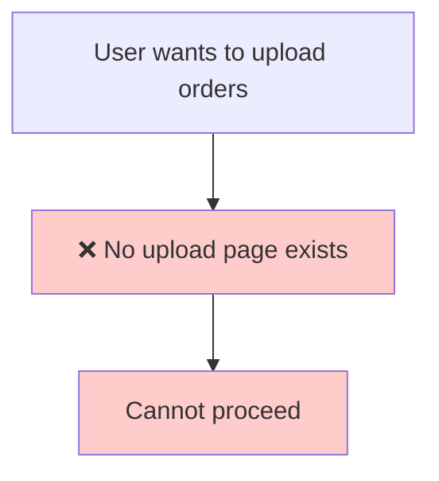
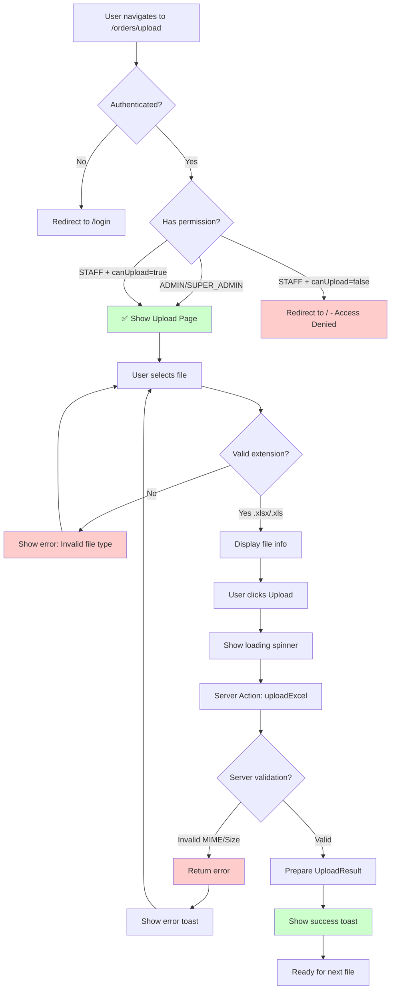

# Flow Overview: Upload Excel Files
<!-- US-1.1.1 | Created: 2026-02-07 -->

## Current Flow / Luồng Hiện tại



**Current State:** No upload mechanism exists in the application.

---

## Proposed Flow / Luồng Đề xuất



---

## Auth Flow Detail / Chi tiết Luồng Auth

```mermaid
flowchart LR
    subgraph Layout ["layout.tsx (Server)"]
        A[auth()] --> B{session?}
        B -->|No| C[redirect /login]
        B -->|Yes| D{Check role}
        D -->|SUPER_ADMIN| E[✅ Allow]
        D -->|ADMIN| E
        D -->|STAFF| F{canUpload?}
        F -->|true| E
        F -->|false| G[redirect /]
    end
    
    E --> H[Render children]
```

---

## Changes Highlighted / Thay đổi Nổi bật

### Added / Thêm mới
- ✅ `/orders/upload` route with auth protection
- ✅ `UploadForm` client component
- ✅ `uploadExcel` server action
- ✅ File validation utilities
- ✅ Permission check: ADMIN/SUPER_ADMIN full access, STAFF needs canUpload

### Modified / Thay đổi
- None (new feature)

### Removed / Xóa
- None

---

## File Structure / Cấu trúc File

```
src/
├── app/
│   └── (orders)/
│       └── upload/
│           ├── layout.tsx      ← NEW: Auth protection
│           └── page.tsx        ← NEW: Upload page
├── components/
│   └── orders/
│       └── upload-form.tsx     ← NEW: Upload form component
└── lib/
    ├── actions/
    │   └── upload.ts           ← NEW: Server action
    └── upload/
        └── validation.ts       ← NEW: File validation
```
