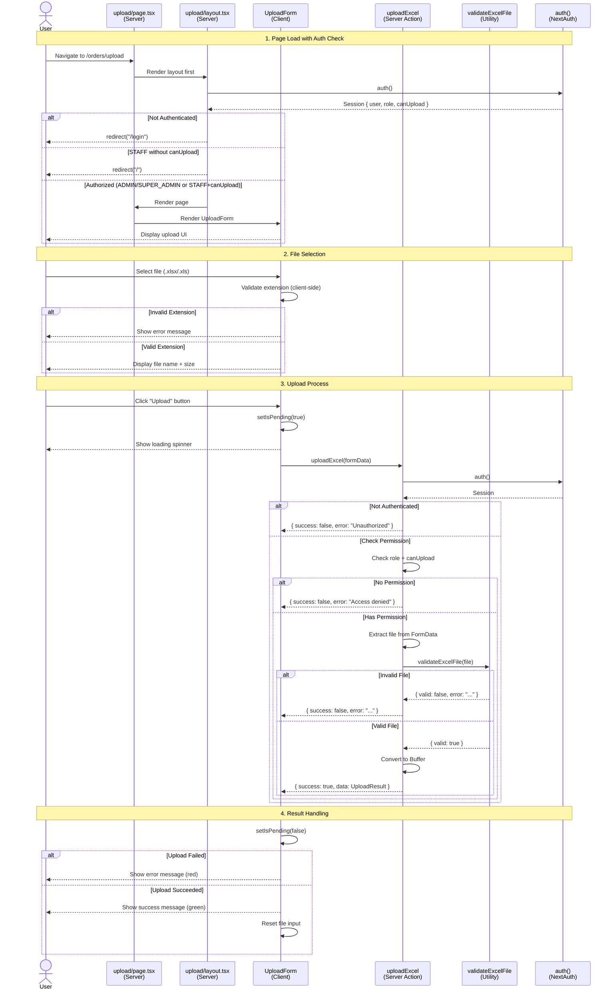
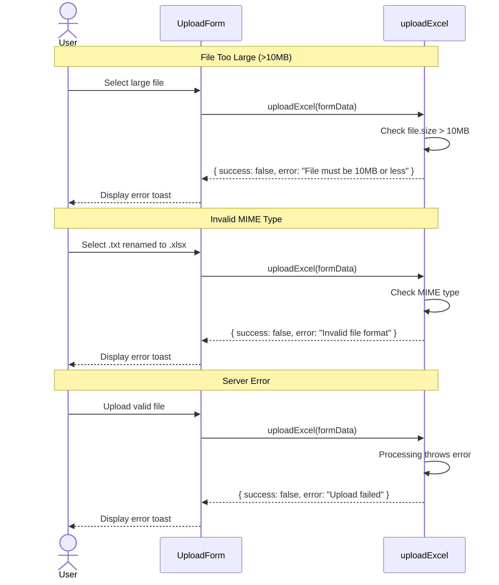

# Sequence Diagram: Upload Excel File
<!-- US-1.1.1 | Created: 2026-02-07 -->

## Main Upload Sequence / Luồng Tải lên Chính



---

## Error Handling Sequence / Luồng Xử lý Lỗi



---

## Notes / Ghi chú

### Authentication Flow
1. `layout.tsx` runs first on every request
2. Calls `auth()` to get session
3. Checks role and permissions before rendering page
4. This ensures page never loads for unauthorized users

### Permission Logic
```
SUPER_ADMIN → Always allowed (no permission check)
ADMIN → Always allowed (no permission check)  
STAFF → Check user.canUpload === true
```

### File Validation Layers
1. **Client-side (UX):** Check file extension before enabling upload
2. **Server-side (Security):** Check MIME type + extension + size

### UploadResult Interface
```typescript
interface UploadResult {
  fileName: string;   // Original file name
  fileSize: number;   // File size in bytes
  buffer: Buffer;     // File content for US-1.1.2 parser
}
```
