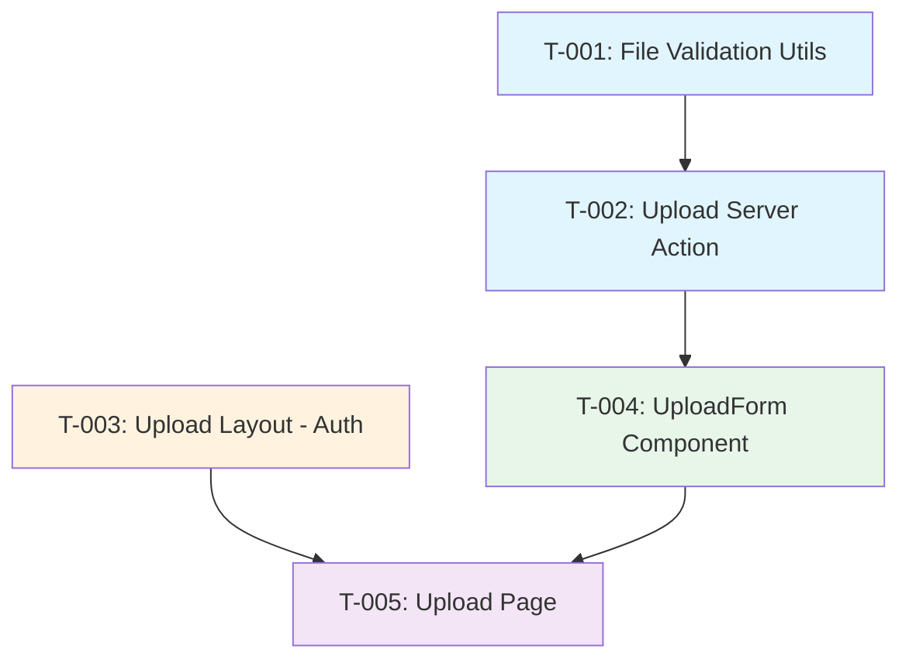

# Task Plan: Upload Excel Files UI
# Kế hoạch Task: Giao diện Tải lên Tệp Excel
<!-- US-1.1.1 | Phase 2 | Created: 2026-02-07 -->

---

## 📋 TL;DR

| Aspect | Value |
|--------|-------|
| Feature | Upload Excel Files UI |
| User Story | US-1.1.1 |
| Dev Mode | Standard |
| Total Tasks | 5 |
| Estimated Effort | 4-5 hours |
| Affected Roots | sgs-cs-helper |
| Spec Reference | [spec.md](../01_spec/spec.md) |
| Test Plan | ✅ Included |

---

## 1. Task Overview / Tổng quan Task

| ID | Title | Root | Deps | Est | Status |
|----|-------|------|------|-----|--------|
| T-001 | Create file validation utilities | sgs-cs-helper | - | S | ⬜ |
| T-002 | Create upload Server Action | sgs-cs-helper | T-001 | M | ⬜ |
| T-003 | Create upload page layout (auth) | sgs-cs-helper | - | S | ⬜ |
| T-004 | Create UploadForm component | sgs-cs-helper | T-002 | M | ⬜ |
| T-005 | Create upload page and integrate | sgs-cs-helper | T-003, T-004 | S | ⬜ |

**Legend:** S = Small (<1h), M = Medium (1-2h), L = Large (2-4h)

---

## 2. Dependency Graph / Đồ thị Phụ thuộc



**Parallel Opportunities:**
- T-001 and T-003 can be done in parallel (no dependencies)
- T-002 and T-003 can be done in parallel after T-001

---

## 3. Tasks by Root / Task theo Root

### Root: sgs-cs-helper

---

#### T-001: Create file validation utilities

| Aspect | Detail |
|--------|--------|
| Root | `sgs-cs-helper` |
| Dependencies | None |
| Estimate | S (30 min) |
| Requirements | FR-004 |

**Description / Mô tả:**
- **EN:** Create file validation utilities for Excel files including MIME type, extension, and size validation.
- **VI:** Tạo các tiện ích xác thực tệp cho tệp Excel bao gồm xác thực MIME type, extension và size.

**Files to Change / File Thay đổi:**
- Create: `src/lib/upload/validation.ts`

**Implementation Details / Chi tiết Triển khai:**
```typescript
// Constants
const MAX_FILE_SIZE = 10 * 1024 * 1024; // 10MB
const ALLOWED_MIME_TYPES = [
  'application/vnd.openxmlformats-officedocument.spreadsheetml.sheet', // .xlsx
  'application/vnd.ms-excel', // .xls
];
const ALLOWED_EXTENSIONS = ['.xlsx', '.xls'];

// Functions
- validateExcelFile(file: File): ValidationResult
- formatFileSize(bytes: number): string
```

**Done Criteria / Tiêu chí Hoàn thành:**
- [ ] `validation.ts` file created with constants and functions
- [ ] `validateExcelFile()` validates MIME type, extension, and size
- [ ] Returns typed result: `{ valid: true } | { valid: false, error: string }`
- [ ] `formatFileSize()` formats bytes to KB/MB string
- [ ] TypeScript compiles without errors

**Verification / Kiểm tra:**
- Run: `pnpm build` - No errors
- Run: `pnpm lint` - No errors

---

#### T-002: Create upload Server Action

| Aspect | Detail |
|--------|--------|
| Root | `sgs-cs-helper` |
| Dependencies | T-001 |
| Estimate | M (1-1.5 hours) |
| Requirements | FR-002, FR-004, FR-005 |

**Description / Mô tả:**
- **EN:** Create Server Action to handle file upload, including auth check, permission validation, and file validation.
- **VI:** Tạo Server Action để xử lý tải lên tệp, bao gồm kiểm tra auth, xác thực quyền và xác thực tệp.

**Files to Change / File Thay đổi:**
- Create: `src/lib/actions/upload.ts`

**Implementation Details / Chi tiết Triển khai:**
```typescript
// Interfaces
interface UploadResult {
  fileName: string;
  fileSize: number;
  buffer: Buffer;
}

type UploadActionResult = 
  | { success: true; data: UploadResult }
  | { success: false; error: string };

// Server Action
async function uploadExcel(formData: FormData): Promise<UploadActionResult>

// Helper
async function requireUploadPermission(): Promise<Session>
```

**Auth Logic:**
- SUPER_ADMIN / ADMIN → Always allowed
- STAFF → Check `user.canUpload === true`

**Done Criteria / Tiêu chí Hoàn thành:**
- [ ] `upload.ts` file created with "use server" directive
- [ ] `requireUploadPermission()` helper checks role and permission
- [ ] `uploadExcel()` extracts file from FormData
- [ ] Validates file using `validateExcelFile()` from T-001
- [ ] Converts file to Buffer
- [ ] Returns typed `UploadActionResult`
- [ ] Error messages are user-friendly

**Verification / Kiểm tra:**
- Run: `pnpm build` - No errors
- Run: `pnpm lint` - No errors

---

#### T-003: Create upload page layout (auth protection)

| Aspect | Detail |
|--------|--------|
| Root | `sgs-cs-helper` |
| Dependencies | None |
| Estimate | S (30 min) |
| Requirements | FR-001, FR-002 |

**Description / Mô tả:**
- **EN:** Create layout for upload route with role-based access control. ADMIN/SUPER_ADMIN have full access, STAFF needs canUpload permission.
- **VI:** Tạo layout cho route upload với kiểm soát truy cập dựa trên vai trò. ADMIN/SUPER_ADMIN có toàn quyền, STAFF cần quyền canUpload.

**Files to Change / File Thay đổi:**
- Create: `src/app/(orders)/upload/layout.tsx`

**Implementation Details / Chi tiết Triển khai:**
```typescript
// Follow pattern from src/app/admin/layout.tsx
// Auth check:
// 1. Not authenticated → redirect /login
// 2. SUPER_ADMIN or ADMIN → allow
// 3. STAFF with canUpload=true → allow
// 4. STAFF with canUpload=false → redirect /
```

**Done Criteria / Tiêu chí Hoàn thành:**
- [ ] `layout.tsx` created at correct path
- [ ] Uses `auth()` from `@/lib/auth`
- [ ] Redirects unauthenticated users to `/login`
- [ ] Allows SUPER_ADMIN and ADMIN regardless of canUpload
- [ ] Checks canUpload for STAFF role
- [ ] Redirects unauthorized STAFF to `/`
- [ ] Renders children when authorized

**Verification / Kiểm tra:**
- Run: `pnpm build` - No errors
- Manual: Access `/orders/upload` as each role

---

#### T-004: Create UploadForm component

| Aspect | Detail |
|--------|--------|
| Root | `sgs-cs-helper` |
| Dependencies | T-002 |
| Estimate | M (1-1.5 hours) |
| Requirements | FR-003, FR-005, FR-006 |

**Description / Mô tả:**
- **EN:** Create client component for file selection and upload with loading state, success/error feedback, and sequential upload support.
- **VI:** Tạo client component để chọn và tải lên tệp với trạng thái loading, phản hồi thành công/lỗi và hỗ trợ tải lên tuần tự.

**Files to Change / File Thay đổi:**
- Create: `src/components/orders/upload-form.tsx`

**Implementation Details / Chi tiết Triển khai:**
```typescript
"use client";

// State
- file: File | null
- message: { type: 'success' | 'error', text: string } | null
- isPending: boolean (from useTransition)

// Features
- File input with accept=".xlsx,.xls"
- Display selected file name and size
- Upload button (disabled when no file or pending)
- Loading spinner during upload
- Success/error message display
- Reset file input after success

// Follow pattern from src/components/admin/create-staff-form.tsx
```

**Done Criteria / Tiêu chí Hoàn thành:**
- [ ] `upload-form.tsx` created with "use client" directive
- [ ] File input accepts only .xlsx and .xls
- [ ] Displays file name and formatted size after selection
- [ ] Upload button disabled when no file selected
- [ ] Upload button disabled during upload (prevents double-submit)
- [ ] Shows loading spinner during upload
- [ ] Shows success message (green) on success
- [ ] Shows error message (red) on failure
- [ ] Resets file input after successful upload
- [ ] Clears previous message when new file selected

**Verification / Kiểm tra:**
- Run: `pnpm build` - No errors
- Run: `pnpm lint` - No errors

---

#### T-005: Create upload page and integrate

| Aspect | Detail |
|--------|--------|
| Root | `sgs-cs-helper` |
| Dependencies | T-003, T-004 |
| Estimate | S (30 min) |
| Requirements | FR-001, FR-003 |

**Description / Mô tả:**
- **EN:** Create the upload page Server Component that renders the UploadForm and add navigation link from dashboard.
- **VI:** Tạo trang upload Server Component để render UploadForm và thêm link điều hướng từ dashboard.

**Files to Change / File Thay đổi:**
- Create: `src/app/(orders)/upload/page.tsx`
- Modify: `src/app/(dashboard)/page.tsx` (add navigation link)

**Implementation Details / Chi tiết Triển khai:**
```typescript
// page.tsx
import { UploadForm } from "@/components/orders/upload-form";
// Simple page with title and UploadForm component

// dashboard/page.tsx - Add link to upload page
// Under "Admin Actions" section for Admin/Super Admin
// Under new "Staff Actions" section for Staff with canUpload
```

**Done Criteria / Tiêu chí Hoàn thành:**
- [ ] `page.tsx` created at correct path
- [ ] Page has appropriate title and description
- [ ] Renders `UploadForm` component
- [ ] Dashboard has link to `/orders/upload` for authorized users
- [ ] Link only visible to users who can upload

**Verification / Kiểm tra:**
- Run: `pnpm build` - No errors
- Run: `pnpm dev` - Page accessible at `/orders/upload`
- Manual: Navigate from dashboard to upload page

---

## 4. Sync Points / Điểm Đồng bộ

| After Task | Action | Before Task |
|------------|--------|-------------|
| N/A | Single root - no sync needed | N/A |

---

## 5. Parallel Execution Notes / Ghi chú Thực thi Song song

| Group | Tasks | Reason |
|-------|-------|--------|
| A | T-001, T-003 | No dependencies between them |
| B | T-002, T-003 | After T-001, these can run in parallel |

**Sequential Constraints:**
- T-002 → T-004 (action needed for form)
- T-003, T-004 → T-005 (layout and form needed for page)

---

## 6. Requirements Coverage / Độ phủ Yêu cầu

| Requirement | Tasks | Covered |
|-------------|-------|---------|
| FR-001: Upload Page Route | T-003, T-005 | ✅ |
| FR-002: Role-Based Access Control | T-002, T-003 | ✅ |
| FR-003: File Selection UI | T-004, T-005 | ✅ |
| FR-004: File Validation | T-001, T-002 | ✅ |
| FR-005: Upload Process with Feedback | T-002, T-004 | ✅ |
| FR-006: Sequential Upload Support | T-004 | ✅ |
| NFR-001: Performance | All tasks | ✅ |
| NFR-002: Security | T-002, T-003 | ✅ |
| NFR-003: Accessibility | T-004 | ✅ |
| NFR-004: Maintainability | All tasks | ✅ |

**Coverage: 100%** — All requirements mapped to tasks.

---

## 7. Test Plan / Kế hoạch Test

### 7.1 Test Strategy / Chiến lược Test

| Type | Scope | Tool | Target |
|------|-------|------|--------|
| Unit | Validation utilities | Vitest | 100% coverage |
| Unit | Server Action | Vitest | 90% coverage |
| Integration | Full upload flow | Vitest + Testing Library | Happy path + errors |
| Manual | Auth flows | Browser | All roles |

### 7.2 Test Cases by Task / Test Cases theo Task

| TC ID | Task | Test Description | Type | Expected Result |
|-------|------|------------------|------|-----------------|
| TC-001 | T-001 | validateExcelFile accepts .xlsx | Unit | Returns `{ valid: true }` |
| TC-002 | T-001 | validateExcelFile accepts .xls | Unit | Returns `{ valid: true }` |
| TC-003 | T-001 | validateExcelFile rejects .txt | Unit | Returns `{ valid: false, error: "..." }` |
| TC-004 | T-001 | validateExcelFile rejects >10MB | Unit | Returns `{ valid: false, error: "..." }` |
| TC-005 | T-001 | formatFileSize formats KB correctly | Unit | Returns "500 KB" |
| TC-006 | T-001 | formatFileSize formats MB correctly | Unit | Returns "2.5 MB" |
| TC-007 | T-002 | uploadExcel requires auth | Unit | Returns error if no session |
| TC-008 | T-002 | uploadExcel allows SUPER_ADMIN | Unit | Returns success |
| TC-009 | T-002 | uploadExcel allows ADMIN | Unit | Returns success |
| TC-010 | T-002 | uploadExcel allows STAFF with canUpload | Unit | Returns success |
| TC-011 | T-002 | uploadExcel denies STAFF without canUpload | Unit | Returns error |
| TC-012 | T-002 | uploadExcel validates file | Unit | Calls validateExcelFile |
| TC-013 | T-002 | uploadExcel returns UploadResult | Unit | Returns buffer, name, size |
| TC-014 | T-003 | Layout redirects unauthenticated | Integration | Redirects to /login |
| TC-015 | T-003 | Layout allows ADMIN | Integration | Renders children |
| TC-016 | T-003 | Layout denies STAFF without permission | Integration | Redirects to / |
| TC-017 | T-004 | UploadForm shows file input | Integration | Input visible |
| TC-018 | T-004 | UploadForm disables button when no file | Integration | Button disabled |
| TC-019 | T-004 | UploadForm shows file info after select | Integration | Name + size shown |
| TC-020 | T-004 | UploadForm shows spinner during upload | Integration | Spinner visible |
| TC-021 | T-004 | UploadForm shows success message | Integration | Green message shown |
| TC-022 | T-004 | UploadForm shows error message | Integration | Red message shown |
| TC-023 | T-005 | Upload page renders | Integration | Page loads at /orders/upload |
| TC-024 | T-005 | Dashboard has upload link | Integration | Link visible for authorized users |

### 7.3 Edge Cases / Trường hợp Biên

| EC ID | Scenario | Test Approach |
|-------|----------|---------------|
| EC-001 | File exactly 10MB | Unit test with mock file |
| EC-002 | File 10MB + 1 byte | Unit test with mock file |
| EC-003 | Double-click upload | Integration: verify button disabled |
| EC-004 | Session expires during upload | Manual test |
| EC-005 | Wrong MIME but correct extension | Unit test with mock file |

### 7.4 Test Data / Dữ liệu Test

```typescript
// Fixtures needed
const mockValidXlsx = {
  name: 'orders.xlsx',
  type: 'application/vnd.openxmlformats-officedocument.spreadsheetml.sheet',
  size: 1024 * 1024, // 1MB
};

const mockValidXls = {
  name: 'orders.xls',
  type: 'application/vnd.ms-excel',
  size: 512 * 1024, // 512KB
};

const mockInvalidType = {
  name: 'document.txt',
  type: 'text/plain',
  size: 1024,
};

const mockTooLarge = {
  name: 'large.xlsx',
  type: 'application/vnd.openxmlformats-officedocument.spreadsheetml.sheet',
  size: 11 * 1024 * 1024, // 11MB
};
```

---

## 8. Risk Assessment / Đánh giá Rủi ro

| Task | Risk | Impact | Mitigation |
|------|------|--------|------------|
| T-002 | Auth logic complexity | Medium | Follow existing patterns from staff.ts |
| T-004 | Form state management | Low | Use useTransition pattern |
| T-005 | Dashboard modification | Low | Add link only, minimal change |

---

## Approval / Phê duyệt

| Role | Status | Date |
|------|--------|------|
| Task Planner | ✅ Done | 2026-02-07 |
| Reviewer | ⏳ Pending | |

---

**Created:** 2026-02-07  
**Author:** Copilot (Technical Task Planner)
