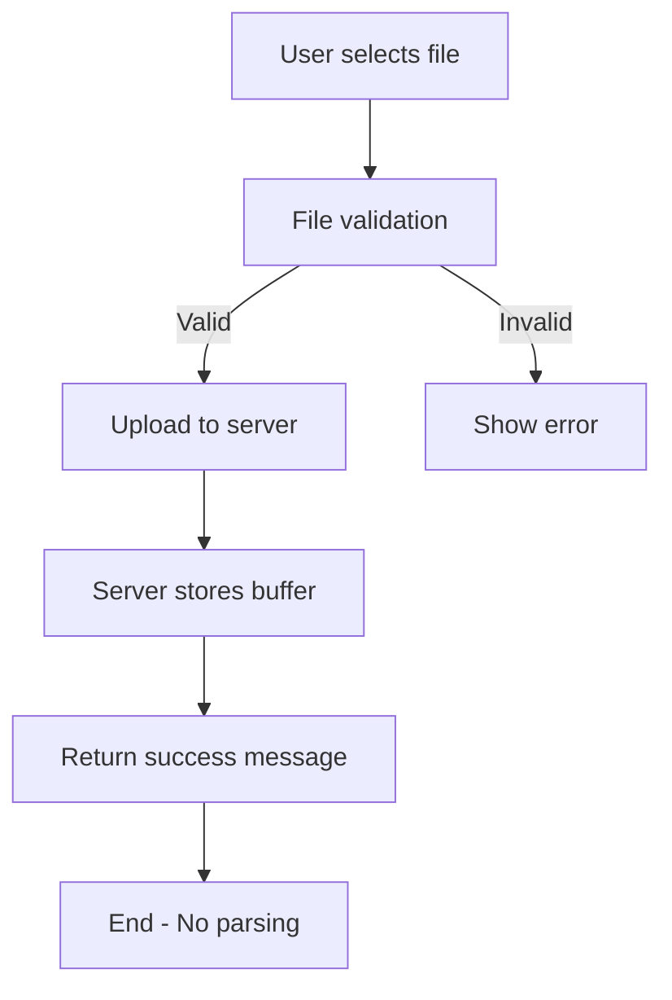
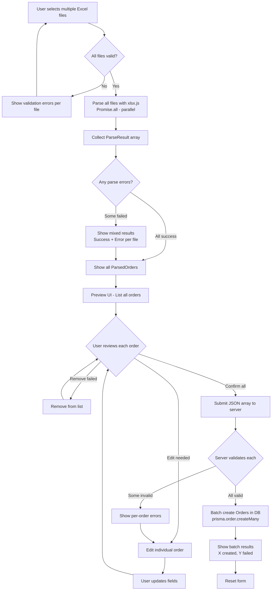
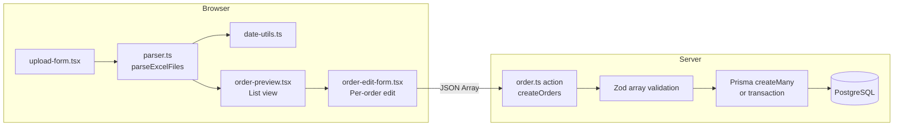

# Flow Overview: US-1.1.2 Parse Excel and Extract Order Data
<!-- Phase 0 Diagram | Generated: 2026-02-07 -->

## Current Flow / Luồng Hiện tại



**EN:** Current flow uploads file to server but doesn't parse or extract data.
**VI:** Flow hiện tại upload file lên server nhưng không parse hay extract data.

---

## Proposed Flow / Luồng Đề xuất



**EN:** New flow parses multiple files in parallel, shows list preview, allows individual editing, then submits JSON array for batch insert.
**VI:** Flow mới parse nhiều file song song, hiển thị preview dạng list, cho phép edit từng order, rồi submit JSON array để batch insert.

---

## Changes Highlighted / Thay đổi Nổi bật

### Added / Thêm mới
- ✅ Client-side Excel parsing with xlsx.js
- ✅ Date serial to JavaScript Date conversion
- ✅ Preview UI for parsed data
- ✅ Editable form before submission
- ✅ JSON submission instead of file upload
- ✅ Server-side Zod validation
- ✅ Order creation in database

### Modified / Chỉnh sửa
- 🔄 `upload-form.tsx`: Add parser integration
- 🔄 Upload page: Add preview/edit steps

### Removed / Loại bỏ
- ❌ File upload to server (for this US)
- ❌ Server-side file handling

---

## Component Flow / Luồng Component



---

## Multi-File Data Structure / Cấu trúc Dữ liệu Nhiều File

```typescript
// Client sends array of orders
interface CreateOrderInput[] {
  jobNumber: string;
  registeredDate: string; // ISO string
  registeredBy?: string;
  receivedDate: string;   // Required
  checkedBy?: string;
  requiredDate: string;
  priority: number;
  note?: string;
  sourceFileName: string; // Track which file
}

// Server returns batch result
interface BatchCreateResult {
  success: boolean;
  created: Order[];
  failed: { order: CreateOrderInput; error: string }[];
}
```
