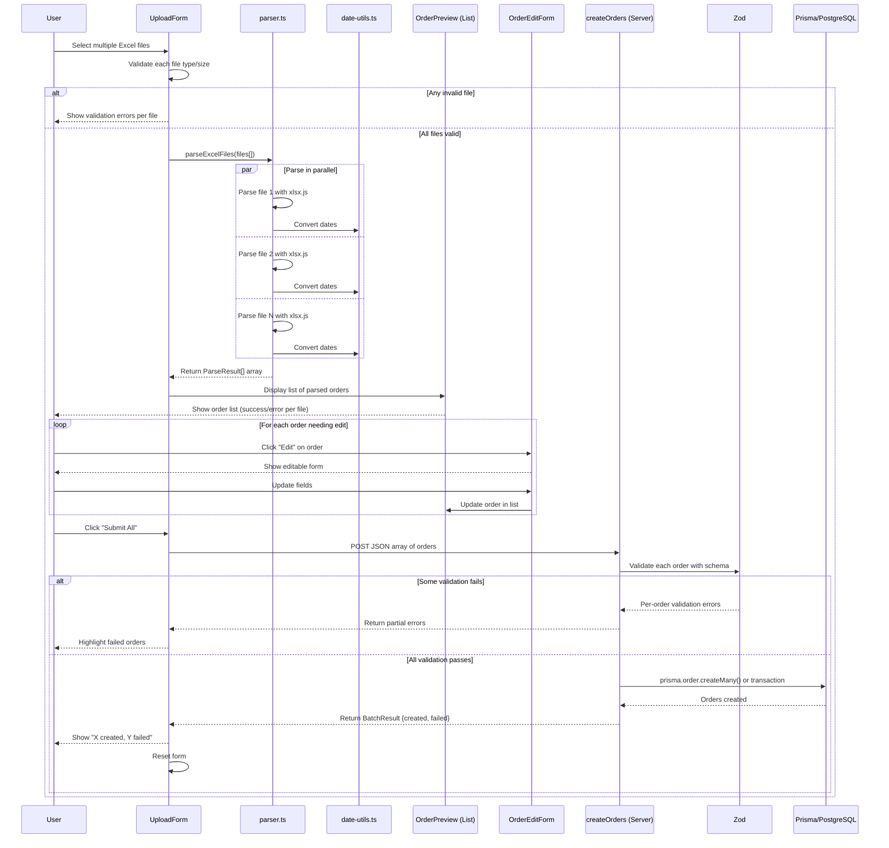
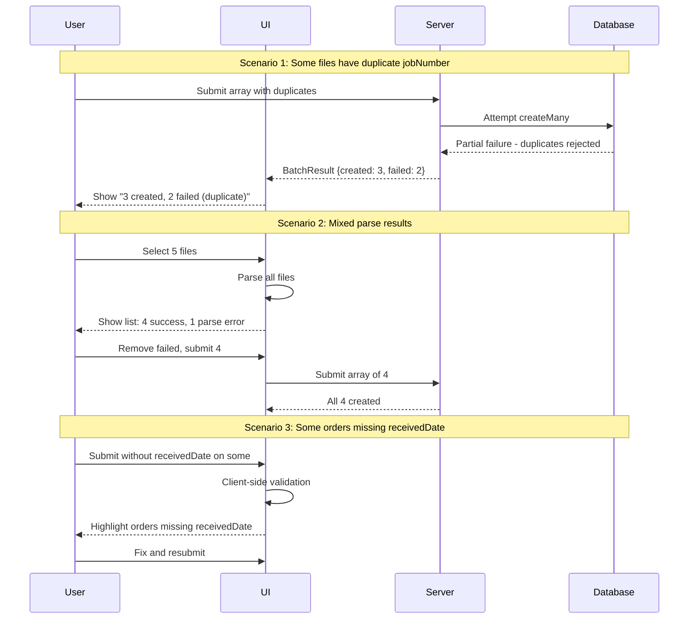

# Sequence Diagram: Parse Excel and Create Order
<!-- Phase 0 Diagram | Generated: 2026-02-07 -->

## Main Flow / Luồng Chính

---

## Notes / Ghi chú

### Step Details / Chi tiết các Bước

| Step | Description EN | Description VI |
|------|----------------|----------------|
| 1 | User selects multiple Excel files | User chọn nhiều file Excel |
| 2 | Client-side file validation (type, size) per file | Validate file ở client (loại, kích thước) từng file |
| 3 | xlsx.js parses all files in parallel | xlsx.js parse tất cả file song song |
| 4 | Extract jobNumber from Row 0 or Row 1 each file | Extract jobNumber từ Row 0/1 mỗi file |
| 5 | Convert Excel date serials to JS Dates | Chuyển Excel date serial sang JS Date |
| 6 | Extract all Row 2 fields per file | Extract tất cả field Row 2 mỗi file |
| 7 | Extract note from Row 3 per file | Extract note từ Row 3 mỗi file |
| 8 | Display list preview with status per file | Hiển thị preview list với status từng file |
| 9 | User optionally edits individual orders | User chỉnh sửa từng order nếu cần |
| 10 | Submit JSON array to server action | Submit JSON array lên server action |
| 11 | Server validates each order with Zod | Server validate từng order với Zod |
| 12 | Batch create Orders in database | Batch tạo Orders trong database |
| 13 | Return batch result (created/failed) | Trả kết quả batch (thành công/thất bại) |

---

## Error Scenarios / Các Trường hợp Lỗi

