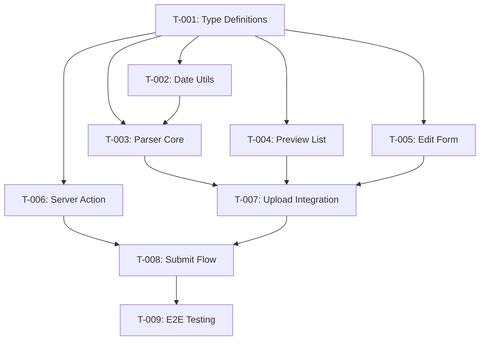

# Task Plan: Parse Excel and Extract Order Data
# Kế hoạch Task: Parse Excel và Trích xuất Dữ liệu Order
<!-- Phase 2 | US-1.1.2 | Generated: 2026-02-07 -->

---

## 📋 TL;DR

| Aspect | Value |
|--------|-------|
| Feature | Parse Excel Client-side and Extract Order Data (Multi-file) |
| Total Tasks | 9 |
| Estimated Effort | 9-11 hours |
| Affected Roots | sgs-cs-helper |
| Spec Reference | [spec.md](../01_spec/spec.md) |
| Dev Mode | standard |

---

## Task Overview / Tổng quan Task

| ID | Title | Root | Deps | Est | Status |
|----|-------|------|------|-----|--------|
| T-001 | Create Excel type definitions | sgs-cs-helper | - | S | ⬜ |
| T-002 | Implement Excel date conversion utility | sgs-cs-helper | T-001 | S | ⬜ |
| T-003 | Implement Excel parser core | sgs-cs-helper | T-001, T-002 | M | ⬜ |
| T-004 | Create order preview list component | sgs-cs-helper | T-001 | M | ⬜ |
| T-005 | Create order edit form component | sgs-cs-helper | T-001 | M | ⬜ |
| T-006 | Create batch order server action | sgs-cs-helper | T-001 | M | ⬜ |
| T-007 | Integrate parser with upload form | sgs-cs-helper | T-003, T-004, T-005 | L | ⬜ |
| T-008 | Connect preview to server action | sgs-cs-helper | T-006, T-007 | M | ⬜ |
| T-009 | End-to-end integration testing | sgs-cs-helper | T-008 | M | ⬜ |

---

## Dependency Graph / Đồ thị Phụ thuộc



---

## Parallel Execution Notes / Ghi chú Thực thi Song song

```yaml
parallel_groups:
  - group: A
    tasks: [T-004, T-005, T-006]
    reason: "Same dependency (T-001), different files - can develop in parallel"
  - group: B
    tasks: [T-002, T-004, T-005, T-006]
    reason: "All depend only on T-001, modify different files"

sequential_constraints:
  - sequence: "T-001 → T-002 → T-003"
    reason: "Parser depends on types and date utils"
  - sequence: "T-007 → T-008 → T-009"
    reason: "Integration flow - each step builds on previous"
```

---

## Tasks by Root / Task theo Root

### Root: sgs-cs-helper

---

#### T-001: Create Excel Type Definitions

| Aspect | Detail |
|--------|--------|
| Root | `sgs-cs-helper` |
| Dependencies | None |
| Estimate | S (30 min) |
| Requirements | FR-001, FR-002, FR-003, FR-004, FR-008 |

**Description / Mô tả:**
- **EN:** Create TypeScript type definitions for Excel parsing: ParsedOrder, ParseError, ParseResult, CreateOrderInput, BatchCreateResult. These types are used across parser, UI, and server action.
- **VI:** Tạo định nghĩa TypeScript types cho Excel parsing: ParsedOrder, ParseError, ParseResult, CreateOrderInput, BatchCreateResult. Các types này được dùng chung trong parser, UI, và server action.

**Files to Change / File Thay đổi:**
- Create: `src/lib/excel/types.ts`

**Done Criteria / Tiêu chí Hoàn thành:**
- [ ] ParsedOrder interface with all fields (jobNumber, dates, people, note, sourceFileName)
- [ ] ParseError interface with field, message, row, column
- [ ] ParseResult discriminated union (success | error)
- [ ] CreateOrderInput with ISO string dates for server
- [ ] BatchCreateResult for server response
- [ ] All types exported

**Verification / Kiểm tra:**
- `pnpm tsc --noEmit` - No type errors
- Import types in other files without errors

---

#### T-002: Implement Excel Date Conversion Utility

| Aspect | Detail |
|--------|--------|
| Root | `sgs-cs-helper` |
| Dependencies | T-001 |
| Estimate | S (45 min) |
| Requirements | FR-005 |

**Description / Mô tả:**
- **EN:** Create utility function to convert Excel date serial numbers to JavaScript Date objects. Handle Excel 1900 date system and Vietnam timezone (Asia/Ho_Chi_Minh).
- **VI:** Tạo utility function để convert số serial date của Excel sang JavaScript Date objects. Xử lý hệ thống ngày 1900 của Excel và múi giờ Việt Nam (Asia/Ho_Chi_Minh).

**Files to Change / File Thay đổi:**
- Create: `src/lib/excel/date-utils.ts`

**Done Criteria / Tiêu chí Hoàn thành:**
- [ ] `excelSerialToDate(serial: number): Date` function
- [ ] Handles Excel 1900 date system (serial 1 = 1900-01-01)
- [ ] Applies Vietnam timezone offset
- [ ] Returns null or throws for invalid serials
- [ ] `isValidExcelSerial(value: unknown): boolean` helper

**Verification / Kiểm tra:**
- Unit test: Serial 45000 → Expected date (verify manually)
- Unit test: Invalid serial → null/error
- `pnpm tsc --noEmit` - No type errors

---

#### T-003: Implement Excel Parser Core

| Aspect | Detail |
|--------|--------|
| Root | `sgs-cs-helper` |
| Dependencies | T-001, T-002 |
| Estimate | M (1.5 hours) |
| Requirements | FR-001, FR-002, FR-003, FR-004 |

**Description / Mô tả:**
- **EN:** Create core Excel parser using xlsx.js. Parse single file → extract jobNumber from Row 0/1, extract fields from Row 2, extract note from Row 3. Support multi-file parallel parsing with Promise.all.
- **VI:** Tạo core Excel parser sử dụng xlsx.js. Parse single file → extract jobNumber từ Row 0/1, extract fields từ Row 2, extract note từ Row 3. Hỗ trợ parse nhiều file song song với Promise.all.

**Files to Change / File Thay đổi:**
- Create: `src/lib/excel/parser.ts`

**Done Criteria / Tiêu chí Hoàn thành:**
- [ ] `parseExcelFile(file: File): Promise<ParseResult>` - single file
- [ ] `parseExcelFiles(files: File[]): Promise<ParseResult[]>` - multi-file
- [ ] Job number extraction from Row 0/1 with pattern matching
- [ ] Row 2 field extraction by column index
- [ ] Excel date serial conversion using date-utils
- [ ] Note extraction from Row 3
- [ ] receivedDate validation (required)
- [ ] Clear error messages for parse failures

**Verification / Kiểm tra:**
- Unit test with mock Excel data
- Manual test with sample file (docs/template/oder.xls)
- `pnpm tsc --noEmit` - No type errors

---

#### T-004: Create Order Preview List Component

| Aspect | Detail |
|--------|--------|
| Root | `sgs-cs-helper` |
| Dependencies | T-001 |
| Estimate | M (1.5 hours) |
| Requirements | FR-006 |

**Description / Mô tả:**
- **EN:** Create React component to display list of parsed orders. Each item shows file name, job number, key dates, success/error status. Items are expandable to show full details. Include remove button per item.
- **VI:** Tạo React component hiển thị danh sách orders đã parse. Mỗi item hiển thị tên file, job number, các ngày quan trọng, trạng thái thành công/lỗi. Items có thể mở rộng để xem chi tiết. Có nút remove cho từng item.

**Files to Change / File Thay đổi:**
- Create: `src/components/orders/order-preview.tsx`

**Done Criteria / Tiêu chí Hoàn thành:**
- [ ] OrderPreviewList component with props: results, onEdit, onRemove
- [ ] OrderPreviewItem sub-component (expandable)
- [ ] Success indicator (green) and error indicator (red)
- [ ] Summary line: file name, job number, received date
- [ ] Expandable details showing all fields
- [ ] Edit and Remove buttons per item
- [ ] Responsive layout

**Verification / Kiểm tra:**
- Storybook or manual render with mock data
- Visual check: expand/collapse works
- Remove button calls onRemove callback

---

#### T-005: Create Order Edit Form Component

| Aspect | Detail |
|--------|--------|
| Root | `sgs-cs-helper` |
| Dependencies | T-001 |
| Estimate | M (1.5 hours) |
| Requirements | FR-007 |

**Description / Mô tả:**
- **EN:** Create editable form for correcting parsed order data. Include all fields with appropriate input types (text, date picker). Validate required fields. Save/Cancel buttons.
- **VI:** Tạo form chỉnh sửa cho order data đã parse. Bao gồm tất cả fields với input types phù hợp (text, date picker). Validate các fields bắt buộc. Nút Save/Cancel.

**Files to Change / File Thay đổi:**
- Create: `src/components/orders/order-edit-form.tsx`

**Done Criteria / Tiêu chí Hoàn thành:**
- [ ] OrderEditForm component with props: order, onSave, onCancel
- [ ] Input fields for all ParsedOrder fields
- [ ] Date picker for date fields (registeredDate, receivedDate, requiredDate)
- [ ] Text input for string fields (jobNumber, registeredBy, checkedBy, note)
- [ ] Number input for priority
- [ ] Required field validation (jobNumber, receivedDate, requiredDate)
- [ ] Save button calls onSave with updated data
- [ ] Cancel button calls onCancel

**Verification / Kiểm tra:**
- Render with mock order data
- Change values and verify onSave receives correct data
- Validation errors show for empty required fields

---

#### T-006: Create Batch Order Server Action

| Aspect | Detail |
|--------|--------|
| Root | `sgs-cs-helper` |
| Dependencies | T-001 |
| Estimate | M (1.5 hours) |
| Requirements | FR-008, NFR-003, NFR-004 |

**Description / Mô tả:**
- **EN:** Create server action to receive JSON array of orders, validate with Zod, batch insert into database. Return per-order success/failure results. Handle partial failures gracefully.
- **VI:** Tạo server action nhận JSON array orders, validate với Zod, batch insert vào database. Trả về kết quả thành công/thất bại từng order. Xử lý partial failures gracefully.

**Files to Change / File Thay đổi:**
- Create: `src/lib/actions/order.ts`

**Done Criteria / Tiêu chí Hoàn thành:**
- [ ] Zod schema for CreateOrderInput
- [ ] Zod schema for array validation
- [ ] `createOrders(orders: CreateOrderInput[]): Promise<BatchCreateResult>` action
- [ ] Auth check (user must be logged in)
- [ ] Per-order validation with error collection
- [ ] Prisma createMany or transaction for batch insert
- [ ] Return created orders and failed orders with reasons
- [ ] Partial failure handling (don't rollback successful inserts)

**Verification / Kiểm tra:**
- Unit test with valid order array → all created
- Unit test with some invalid orders → partial success
- Integration test with database

---

#### T-007: Integrate Parser with Upload Form

| Aspect | Detail |
|--------|--------|
| Root | `sgs-cs-helper` |
| Dependencies | T-003, T-004, T-005 |
| Estimate | L (2 hours) |
| Requirements | FR-001, FR-002, FR-006, FR-007 |

**Description / Mô tả:**
- **EN:** Modify existing upload-form.tsx to integrate Excel parser. After file selection, add "Parse" button. Show preview list with parsed results. Enable edit functionality. Manage state for parsed orders.
- **VI:** Sửa đổi upload-form.tsx hiện tại để tích hợp Excel parser. Sau khi chọn file, thêm nút "Parse". Hiển thị preview list với kết quả parse. Enable chức năng edit. Quản lý state cho parsed orders.

**Files to Change / File Thay đổi:**
- Modify: `src/components/orders/upload-form.tsx`

**Done Criteria / Tiêu chí Hoàn thành:**
- [ ] "Parse Files" button appears after file selection
- [ ] Clicking Parse triggers parseExcelFiles()
- [ ] Loading state during parsing
- [ ] Preview list displays after parsing
- [ ] Edit modal opens when clicking Edit button
- [ ] Remove functionality updates state
- [ ] State management for ParseResult[]
- [ ] Error handling for parse failures

**Verification / Kiểm tra:**
- Manual test: Select files → Parse → Preview shows
- Edit flow: Click Edit → Modal → Save → Preview updates
- Remove flow: Click Remove → Item removed from list

---

#### T-008: Connect Preview to Server Action

| Aspect | Detail |
|--------|--------|
| Root | `sgs-cs-helper` |
| Dependencies | T-006, T-007 |
| Estimate | M (1.5 hours) |
| Requirements | FR-008 |

**Description / Mô tả:**
- **EN:** Add "Submit All" button to preview. On click, filter valid orders, convert to CreateOrderInput[], call server action. Display batch results (X created, Y failed). Handle errors and allow retry.
- **VI:** Thêm nút "Submit All" vào preview. Khi click, lọc orders hợp lệ, convert sang CreateOrderInput[], gọi server action. Hiển thị kết quả batch (X tạo, Y thất bại). Xử lý errors và cho phép retry.

**Files to Change / File Thay đổi:**
- Modify: `src/components/orders/upload-form.tsx`
- Modify: `src/components/orders/order-preview.tsx` (add Submit button)

**Done Criteria / Tiêu chí Hoàn thành:**
- [ ] "Submit All" button in preview header
- [ ] Button disabled if no valid orders
- [ ] Filter out parse-failed orders before submit
- [ ] Convert ParsedOrder to CreateOrderInput (Date → ISO string)
- [ ] Loading state during submit
- [ ] Success toast: "X orders created"
- [ ] Error display for failed orders
- [ ] Reset form after successful submit
- [ ] Retry capability for failed orders

**Verification / Kiểm tra:**
- Manual test: Parse → Submit → Orders in database
- Verify toast shows correct count
- Check database records

---

#### T-009: End-to-End Integration Testing

| Aspect | Detail |
|--------|--------|
| Root | `sgs-cs-helper` |
| Dependencies | T-008 |
| Estimate | M (1.5 hours) |
| Requirements | All FRs, NFRs |

**Description / Mô tả:**
- **EN:** Perform end-to-end testing of the complete flow: file selection → parse → preview → edit → submit → database verification. Test edge cases and error scenarios.
- **VI:** Thực hiện kiểm thử end-to-end toàn bộ flow: chọn file → parse → preview → edit → submit → kiểm tra database. Test các edge cases và error scenarios.

**Files to Change / File Thay đổi:**
- None (testing only)

**Done Criteria / Tiêu chí Hoàn thành:**
- [ ] Happy path works: single file → parse → submit → DB record
- [ ] Multi-file works: 3 files → parse → submit → 3 DB records
- [ ] Edit flow works: parse → edit → save → submit
- [ ] Error file handled: invalid file shows error, doesn't block others
- [ ] Required field validation: missing receivedDate shows error
- [ ] Duplicate jobNumber handled gracefully
- [ ] Performance acceptable: 5 files parse < 3 seconds

**Verification / Kiểm tra:**
- Manual E2E test with sample files
- Prisma Studio verification
- Edge case scenarios documented

---

## Risk Assessment / Đánh giá Rủi ro

| Task | Risk | Mitigation |
|------|------|------------|
| T-003 | Excel format variations | Test with multiple sample files; clear error messages |
| T-002 | Timezone conversion edge cases | Use well-tested date library; thorough testing |
| T-006 | Partial batch failure handling | Design for individual order processing; return detailed results |
| T-007 | State management complexity | Use React hooks pattern; clear state flow |
| T-008 | Network error during submit | Implement retry; preserve order data locally |

---

## Requirements Coverage / Độ phủ Yêu cầu

| Requirement | Tasks | Coverage |
|-------------|-------|----------|
| FR-001: Client-side parsing | T-001, T-003 | ✅ |
| FR-002: Multi-file parallel | T-003 | ✅ |
| FR-003: Job number extraction | T-003 | ✅ |
| FR-004: Row 2 field extraction | T-003 | ✅ |
| FR-005: Date conversion | T-002 | ✅ |
| FR-006: Preview UI | T-004 | ✅ |
| FR-007: Edit form | T-005 | ✅ |
| FR-008: Batch submission | T-006, T-008 | ✅ |
| NFR-001: Parsing performance | T-003, T-009 | ✅ |
| NFR-002: Memory efficiency | T-003, T-009 | ✅ |
| NFR-003: Server validation | T-006 | ✅ |
| NFR-004: Error recovery | T-006, T-008 | ✅ |
| NFR-005: Browser compatibility | T-003 | ✅ |

---

## 7. Test Plan / Kế hoạch Test

### 7.1 Test Strategy

| Test Type | Coverage Target | Focus |
|-----------|-----------------|-------|
| Unit | 80% | Utilities, parser logic, validation |
| Integration | 60% | Server action + DB, component + parser |
| E2E | Critical paths | Full flow: select → parse → submit → verify |

**Mocking Boundaries:**
- xlsx.js workbook creation (mock for unit tests)
- Database (use test DB or mock Prisma for unit tests)
- File API (mock FileReader for unit tests)

### 7.2 Test Cases by Task

| TC ID | Task | Test Description | Type | Expected Result |
|-------|------|------------------|------|-----------------|
| TC-001 | T-001 | Type exports compile | Unit | No TS errors |
| TC-002 | T-002 | Valid serial → Date | Unit | Correct Date object |
| TC-003 | T-002 | Invalid serial → null/error | Unit | null or ParseError |
| TC-004 | T-002 | Serial 45000 → exact date | Unit | Expected date value |
| TC-005 | T-003 | Parse valid Excel | Unit | ParseResult success |
| TC-006 | T-003 | Parse missing receivedDate | Unit | ParseResult error |
| TC-007 | T-003 | Job number pattern *XXX* | Unit | Extracted correctly |
| TC-008 | T-003 | Job number pattern SGS... | Unit | Extracted correctly |
| TC-009 | T-003 | Multi-file parallel | Unit | Array of ParseResult |
| TC-010 | T-004 | Render success item | Unit | Green indicator, data displayed |
| TC-011 | T-004 | Render error item | Unit | Red indicator, error message |
| TC-012 | T-004 | Expand/collapse | Unit | Details show/hide |
| TC-013 | T-005 | Form validation | Unit | Required fields show error |
| TC-014 | T-005 | Save triggers callback | Unit | onSave called with data |
| TC-015 | T-006 | Valid orders → created | Integration | All orders in DB |
| TC-016 | T-006 | Invalid order → error | Integration | Error returned, valid still created |
| TC-017 | T-006 | Auth required | Integration | Unauthorized error |
| TC-018 | T-007 | Parse button triggers parser | Integration | ParseResult state updated |
| TC-019 | T-008 | Submit creates orders | E2E | Orders in database |
| TC-020 | T-009 | Full flow 3 files | E2E | 3 records created |

### 7.3 Edge Cases

| ID | Scenario | Test Approach |
|----|----------|---------------|
| EC-001 | Empty Excel file | Unit test parser with empty workbook |
| EC-002 | Missing Row 2 | Unit test parser with no data rows |
| EC-003 | Invalid date serial | Unit test date-utils with negative/huge numbers |
| EC-004 | No job number | Unit test parser with empty Row 0/1 |
| EC-005 | Duplicate jobNumber | Integration test with existing order |
| EC-006 | All files fail | Integration test UI with all error results |
| EC-007 | Large file | Manual test with >5MB file |
| EC-008 | Network error | Mock fetch failure in E2E |

### 7.4 Test Data

**Fixtures Required:**
- Valid Excel file with all fields populated
- Excel file missing receivedDate
- Excel file with invalid date serials
- Empty Excel file
- Excel file with alternate job number format

**Mock Data:**
```typescript
const mockParsedOrder: ParsedOrder = {
  jobNumber: "SGS-2026-001",
  registeredDate: new Date("2026-02-01"),
  registeredBy: "John Doe",
  receivedDate: new Date("2026-02-05"),
  checkedBy: "Jane Smith",
  requiredDate: new Date("2026-02-10"),
  priority: 1,
  note: "Test order",
  sourceFileName: "test_order.xlsx"
};
```

---

**Created:** 2026-02-07  
**Phase:** 2 - Task Planning
