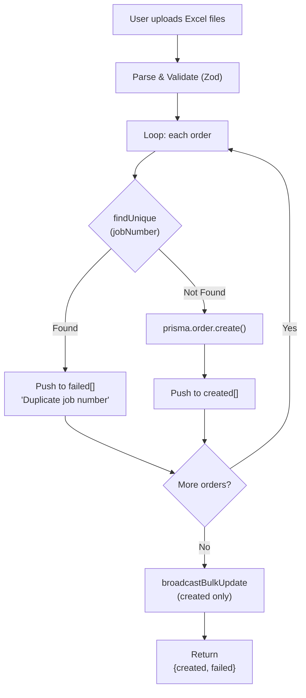
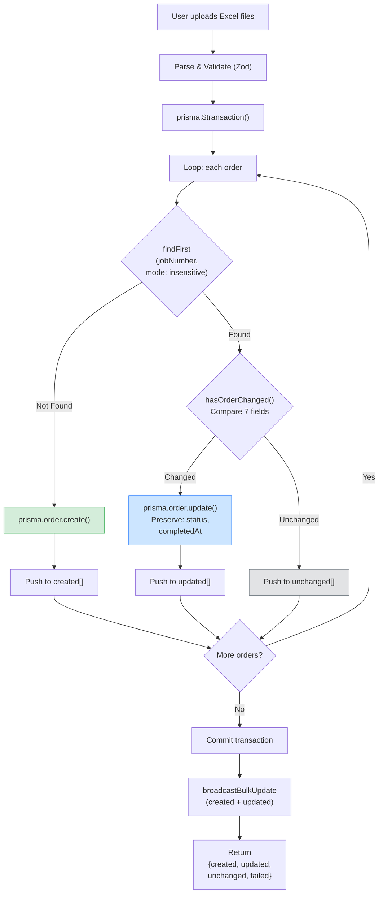
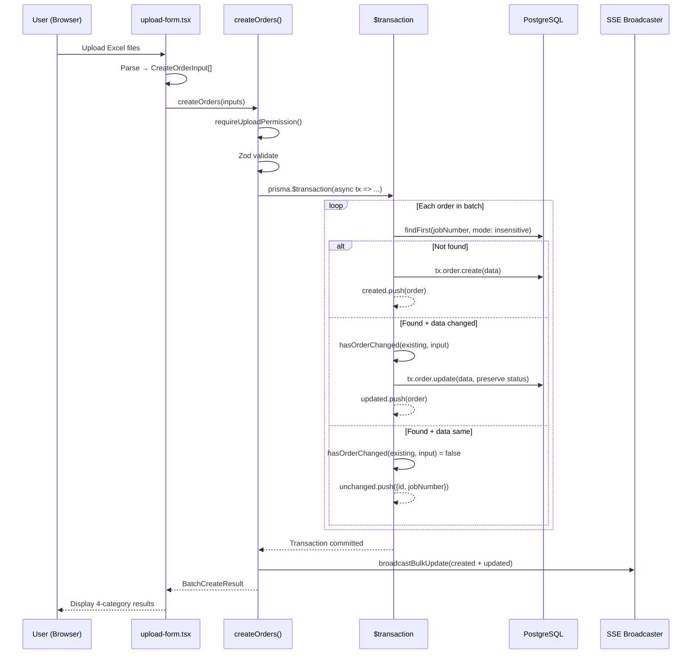
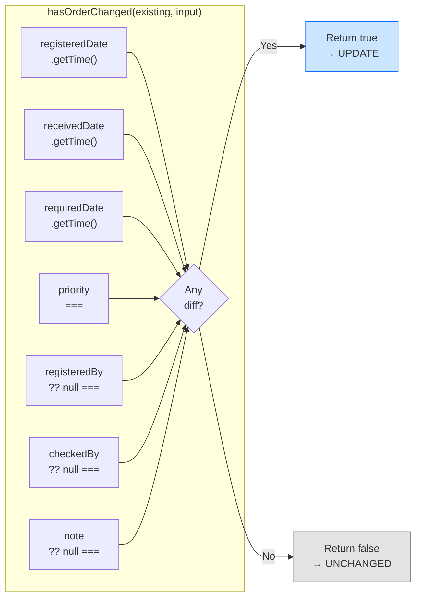

# Flow Overview / Tổng quan Luồng
<!-- US-1.1.3 | Created: 2026-02-09 -->

---

## Current Flow / Luồng Hiện tại

### Issues / Vấn đề
- 🔴 Duplicates treated as failures — confuses users
- 🔴 No way to update existing orders via upload
- 🔴 No distinction between "duplicate/skip" and "real error"
- 🔴 No transaction — partial failures leave inconsistent state

---

## Proposed Flow / Luồng Đề xuất

---

## Changes Highlighted / Thay đổi Nổi bật

### Added / Thêm mới
- 🟢 `hasOrderChanged()` — field comparison helper (7 fields)
- 🟢 `updated[]` array in result — orders with changed data
- 🟢 `unchanged[]` array in result — orders with identical data
- 🟢 `prisma.$transaction()` wrapper — batch integrity
- 🟢 Case-insensitive matching via `findFirst` + `mode: "insensitive"`
- 🟢 Blue (updated) and gray (unchanged) result cards in UI

### Modified / Thay đổi
- 🔵 `createOrders()` — complete logic refactor (skip-duplicate → upsert)
- 🔵 `BatchCreateResult` type — add `updated`, `unchanged` fields
- 🔵 `SubmitResult` in upload-form — add updated/unchanged counts + arrays
- 🔵 Results UI — from 2 categories to 4 categories
- 🔵 SSE broadcast — include both created + updated orders

### Removed / Loại bỏ
- 🔴 "Duplicate job number" error message for existing orders (replaced by update/unchanged)

---

## Sequence Diagram / Sơ đồ Trình tự

---

## Field Comparison Detail / Chi tiết So sánh Fields

---

## Notes / Ghi chú

🇻🇳
- Transaction timeout mặc định Prisma: 5s — đủ cho batch < 100 orders
- `sourceFileName` và `uploadedById` luôn cập nhật khi re-upload (kể cả unchanged detection dùng cho so sánh data)
- Unchanged orders **không** trigger SSE broadcast

🇬🇧
- Default Prisma transaction timeout: 5s — sufficient for batch < 100 orders
- `sourceFileName` and `uploadedById` always updated on re-upload (even though unchanged detection compares data fields only)
- Unchanged orders do **not** trigger SSE broadcast
