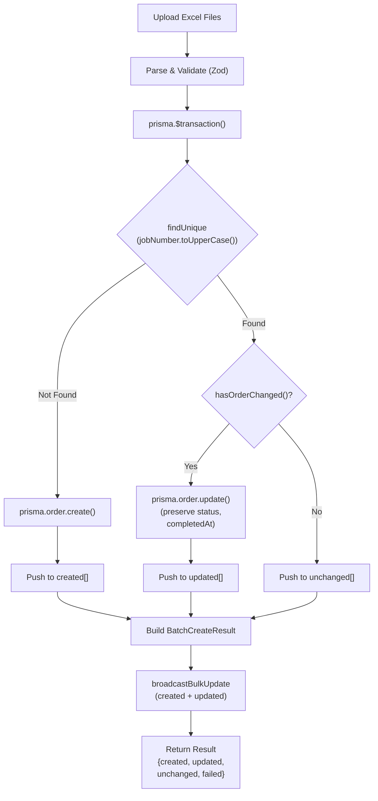
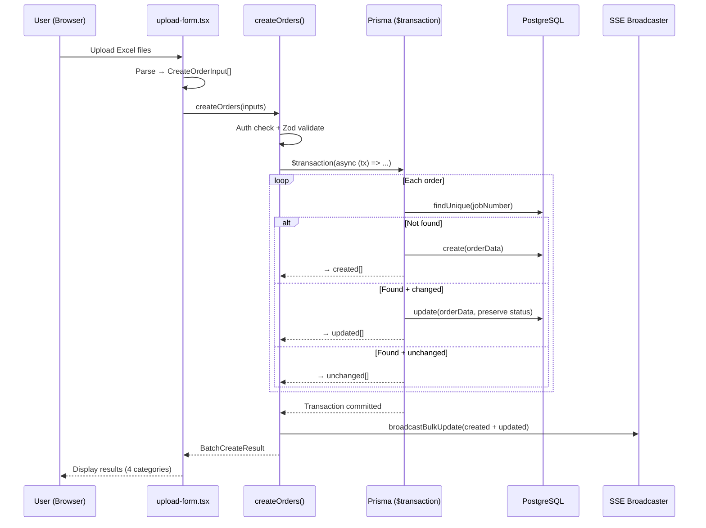

# Analysis & Solution Design — Store Order with Upsert by Job Number
<!-- US-1.1.3 | Created: 2026-02-09 -->

---

## TL;DR

| Aspect | Value |
|--------|-------|
| Feature | Store Order with Upsert by Job Number |
| Status | In Review |
| Affected Roots | `sgs-cs-hepper` |
| Complexity | Medium |
| Estimated Effort | ~4-6 hours |

---

## 1. Problem Statement

### Current Behavior

🇻🇳 `createOrders` action dùng chiến lược **skip-duplicate**: khi `jobNumber` đã tồn tại, đơn hàng bị bỏ qua và đưa vào mảng `failed[]` với message "Duplicate job number: X already exists". Không có cách cập nhật dữ liệu đơn hàng qua upload.

🇬🇧 `createOrders` action uses **skip-duplicate** strategy: when `jobNumber` exists, the order is skipped and pushed to `failed[]` with "Duplicate job number: X already exists". There is no way to update order data through upload.

**Current flow (order.ts lines 127-139):**
```
findUnique(jobNumber) → if exists → failed[] → continue
                      → if not → create() → created[]
```

**Current result type:**
```typescript
BatchCreateResult { success, created: Order[], failed: FailedOrder[], message }
```

### Desired Behavior

🇻🇳 `createOrders` dùng chiến lược **upsert**: Job Number mới → tạo, Job Number tồn tại & dữ liệu thay đổi → cập nhật, Job Number tồn tại & dữ liệu giống → báo unchanged. Kết quả hiển thị 3 loại: Created / Updated / Unchanged.

🇬🇧 `createOrders` uses **upsert** strategy: new jobNumber → create, existing jobNumber with changed data → update, existing jobNumber with same data → report unchanged. Results show 3 categories: Created / Updated / Unchanged.

**Desired flow:**
```
findUnique(jobNumber, case-insensitive)
  → not found → create() → created[]
  → found + data changed → update() → updated[]
  → found + data same → unchanged count++
```

**Desired result type:**
```typescript
BatchCreateResult { success, created, updated, unchanged: UnchangedOrder[], failed, message }
```

### Gap Analysis

🇻🇳 3 khoảng cách chính:
1. **Logic**: Không có upsert — chỉ có create hoặc skip
2. **Types**: `BatchCreateResult` thiếu `updated` và `unchanged`
3. **UI**: Upload form chỉ hiển thị 2 loại (Created/Failed), cần 3+ loại

🇬🇧 3 key gaps:
1. **Logic**: No upsert — only create or skip
2. **Types**: `BatchCreateResult` missing `updated` and `unchanged`
3. **UI**: Upload form shows 2 categories (Created/Failed), needs 3+ categories

---

## 2. Clarifying Questions

| # | Question | Answer | Status |
|---|----------|--------|--------|
| 1 | Which fields trigger "changed" detection? | All uploadable fields: registeredDate, receivedDate, requiredDate, priority, registeredBy, checkedBy, note | Resolved |
| 2 | Should `status` be preserved on update? | Yes — never overwrite existing status (AC6) | Resolved |
| 3 | Should `completedAt` be preserved? | Yes — never overwrite on update | Resolved |
| 4 | Should `uploadedAt` be updated on re-upload? | Yes — reflects latest upload time (AC7) | Resolved |
| 5 | Case-insensitive jobNumber matching? | Yes (AC1) | Resolved |
| 6 | Transaction scope? | Entire batch in one transaction (AC9) | Resolved |
| 7 | What about `sourceFileName`? | Update on re-upload (new file overwrites old) | Resolved |

---

## 3. Assumptions & Constraints

### Assumptions

🇻🇳
- `jobNumber` đã có `@unique` constraint trong Prisma (đã xác nhận)
- Prisma PostgreSQL hỗ trợ case-insensitive lookup qua `.toLowerCase()` + raw query hoặc mode: "insensitive"
- `sampleCount` và `description` chưa được parse từ Excel (không nằm trong `CreateOrderInput`), không so sánh
- Upload form UI (`upload-form.tsx`) đã có cấu trúc results section, chỉ cần mở rộng

🇬🇧
- `jobNumber` already has `@unique` constraint in Prisma (confirmed)
- Prisma PostgreSQL supports case-insensitive lookup via `.toLowerCase()` + raw query or mode: "insensitive"
- `sampleCount` and `description` are not parsed from Excel (not in `CreateOrderInput`), excluded from comparison
- Upload form UI already has results section structure, only needs extension

### Constraints

🇻🇳
- Phải dùng Server Actions pattern (Next.js 16 App Router)
- TypeScript strict mode
- Prisma client — không dùng raw SQL
- SSE broadcaster phải nhận cả created + updated orders
- Không thay đổi Prisma schema

🇬🇧
- Must use Server Actions pattern (Next.js 16 App Router)
- TypeScript strict mode
- Prisma client — no raw SQL
- SSE broadcaster must receive both created + updated orders
- No Prisma schema changes required

---

## 4. Existing Patterns Found

| Location | Pattern | Reusable |
|----------|---------|----------|
| `src/lib/actions/order.ts` | Zod validation → iterate → create pattern | Partial (extend to upsert) |
| `src/lib/actions/order.ts` | `requireUploadPermission()` auth guard | Yes |
| `src/lib/sse/broadcaster.ts` | `broadcastBulkUpdate(orders[])` | Yes (accepts any Order[]) |
| `src/lib/excel/types.ts` | `BatchCreateResult` / `FailedOrder` types | Partial (extend with updated/unchanged) |
| `src/components/orders/upload-form.tsx` | Results display with colored cards | Partial (add new categories) |

---

## 5. Solution Options

### Option A: Prisma `upsert` Native

🇻🇳 Dùng `prisma.order.upsert()` native — tạo nếu không tồn tại, cập nhật nếu tồn tại. Vấn đề: Prisma upsert **không cho biết** record đã create hay update, và **luôn update** kể cả khi dữ liệu giống.

🇬🇧 Use native `prisma.order.upsert()` — creates if not exists, updates if exists. Problem: Prisma upsert **doesn't tell you** whether it created or updated, and **always updates** even when data is identical.

**Pros:** Simple API, one call
**Cons:** Cannot distinguish create/update/unchanged; always writes (wasteful); no way to report 3 categories

### Option B: findUnique → Compare → Create/Update (Chosen ✅)

🇻🇳 Dùng `findUnique` để check tồn tại, so sánh fields nếu tồn tại, rồi quyết định create/update/unchanged. Wrap trong `prisma.$transaction()`.

🇬🇧 Use `findUnique` to check existence, compare fields if exists, then decide create/update/unchanged. Wrap in `prisma.$transaction()`.

**Pros:** Full control over 3-way categorization; only writes when data actually changed; clear audit trail
**Cons:** More code; N+1 queries inside transaction (acceptable for batch sizes < 100)

### Option C: Raw SQL UPSERT with RETURNING

🇻🇳 Dùng PostgreSQL `INSERT ON CONFLICT UPDATE` — hiệu suất cao nhưng mất type safety và khó phân biệt created/updated/unchanged.

🇬🇧 Use PostgreSQL `INSERT ON CONFLICT UPDATE` — high performance but loses type safety and hard to distinguish created/updated/unchanged.

**Pros:** Best performance for large batches
**Cons:** No type safety; constraint says no raw SQL; can't distinguish unchanged

### Comparison Matrix

| Aspect | Option A (upsert) | Option B (find+compare) | Option C (raw SQL) |
|--------|--------------------|-------------------------|--------------------|
| 3-way categorization | ❌ Cannot | ✅ Full control | ❌ Difficult |
| Performance | Good | Acceptable (< 100 orders) | Best |
| Code complexity | Low | Medium | High |
| Type safety | ✅ | ✅ | ❌ |
| Constraint compliance | Partial | ✅ Full | ❌ Violates no-raw-SQL |

### Chosen Solution

**Decision:** `Option B` — findUnique → Compare → Create/Update

🇻🇳 Chọn Option B vì đáp ứng đầy đủ yêu cầu 3 loại kết quả (created/updated/unchanged), có type safety, hiệu suất chấp nhận được cho batch nhỏ (< 100 orders/lần upload), và tuân thủ constraint không dùng raw SQL.

🇬🇧 Chose Option B because it fully supports 3-way categorization (created/updated/unchanged), maintains type safety, has acceptable performance for small batches (< 100 orders per upload), and complies with the no-raw-SQL constraint.

---

## 6. Solution Overview

🇻🇳 Refactor `createOrders` thành 3 bước cho mỗi order trong batch: (1) `findUnique` case-insensitive bằng `jobNumber.toUpperCase()`, (2) nếu tồn tại → so sánh 7 fields với helper function `hasOrderChanged()`, (3) quyết định create/update/unchanged. Toàn bộ batch wrap trong `prisma.$transaction()`. Mở rộng `BatchCreateResult` thêm `updated: Order[]` và `unchanged: UnchangedOrder[]`. Upload form UI thêm section hiển thị updated (màu xanh dương) và unchanged (màu xám).

🇬🇧 Refactor `createOrders` into 3 steps per order in batch: (1) `findUnique` case-insensitive using `jobNumber.toUpperCase()`, (2) if exists → compare 7 fields with `hasOrderChanged()` helper, (3) decide create/update/unchanged. Entire batch wrapped in `prisma.$transaction()`. Extend `BatchCreateResult` with `updated: Order[]` and `unchanged: UnchangedOrder[]`. Upload form UI adds sections for updated (blue) and unchanged (gray).

### Architecture Diagram



---

## 7. Components

| Component | Root | Type | Description |
|-----------|------|------|-------------|
| `BatchCreateResult` | sgs-cs-hepper | Modify | Add `updated`, `unchanged` fields |
| `UnchangedOrder` | sgs-cs-hepper | New | Type for unchanged order info |
| `UpdatedOrder` | sgs-cs-hepper | New | Type for updated order info (optional — may just use `Order`) |
| `hasOrderChanged()` | sgs-cs-hepper | New | Compare function for 7 fields |
| `createOrders()` | sgs-cs-hepper | Modify | Refactor to upsert with transaction |
| `SubmitResult` | sgs-cs-hepper | Modify | Add updated/unchanged to UI type |
| Upload Results UI | sgs-cs-hepper | Modify | Add blue (updated) and gray (unchanged) result cards |

### Component Details

#### `hasOrderChanged()` — Field Comparison Helper

🇻🇳 So sánh 7 fields giữa existing order (từ DB) và input order (từ upload). Return `true` nếu bất kỳ field nào khác nhau. So sánh date bằng `.getTime()` để tránh timezone issues.

🇬🇧 Compares 7 fields between existing order (from DB) and input order (from upload). Returns `true` if any field differs. Compares dates using `.getTime()` to avoid timezone issues.

**Fields compared:**
| Field | Type | Comparison Method |
|-------|------|-------------------|
| `registeredDate` | DateTime | `.getTime()` |
| `receivedDate` | DateTime | `.getTime()` |
| `requiredDate` | DateTime | `.getTime()` |
| `priority` | Int | `===` |
| `registeredBy` | String? | `?? null` then `===` |
| `checkedBy` | String? | `?? null` then `===` |
| `note` | String? | `?? null` then `===` |

**Not compared (preserved on update):**
- `status` — preserved (AC6)
- `completedAt` — preserved
- `sampleCount` — not in CreateOrderInput
- `description` — not in CreateOrderInput
- `id`, `createdAt` — system fields

#### `createOrders()` — Refactored Server Action

🇻🇳 Luồng mới:
1. Auth check (giữ nguyên)
2. Zod validation (giữ nguyên)
3. `prisma.$transaction()` wrapper
4. Trong mỗi order: findUnique → compare → create/update/unchanged
5. Build result với 4 mảng: created, updated, unchanged, failed
6. SSE broadcast cho created + updated
7. Return `BatchCreateResult`

🇬🇧 New flow:
1. Auth check (unchanged)
2. Zod validation (unchanged)
3. `prisma.$transaction()` wrapper
4. For each order: findUnique → compare → create/update/unchanged
5. Build result with 4 arrays: created, updated, unchanged, failed
6. SSE broadcast for created + updated
7. Return `BatchCreateResult`

#### Upload Results UI — 3-Category Display

🇻🇳 Mở rộng results section với 3 cards:
- 🟢 **Created** (green) — đơn mới tạo thành công
- 🔵 **Updated** (blue) — đơn đã cập nhật dữ liệu mới
- ⚪ **Unchanged** (gray) — đơn tồn tại, dữ liệu giống hệt
- 🔴 **Failed** (red) — giữ nguyên cho lỗi thật

🇬🇧 Extend results section with 3 cards:
- 🟢 **Created** (green) — newly created orders
- 🔵 **Updated** (blue) — orders updated with new data
- ⚪ **Unchanged** (gray) — existing orders with identical data
- 🔴 **Failed** (red) — keep for actual errors

---

## 8. Data Flow

| Step | Action | From | To |
|------|--------|------|-----|
| 1 | User selects Excel files | Browser | `upload-form.tsx` |
| 2 | Parse Excel → `ParsedOrder[]` | `upload-form.tsx` | `excel/parser.ts` |
| 3 | Convert → `CreateOrderInput[]` | `upload-form.tsx` | `toCreateOrderInput()` |
| 4 | Call server action | `upload-form.tsx` | `createOrders()` |
| 5 | Validate with Zod | `createOrders()` | Internal |
| 6 | Open `$transaction()` | `createOrders()` | Prisma |
| 7 | For each: `findUnique(jobNumber)` | Transaction | PostgreSQL |
| 8a | Not found → `create()` | Transaction | PostgreSQL |
| 8b | Found + changed → `update()` | Transaction | PostgreSQL |
| 8c | Found + same → push unchanged | Transaction | In-memory |
| 9 | Commit transaction | Prisma | PostgreSQL |
| 10 | `broadcastBulkUpdate(created + updated)` | `createOrders()` | SSE clients |
| 11 | Return `BatchCreateResult` | `createOrders()` | `upload-form.tsx` |
| 12 | Display 4-category results | `upload-form.tsx` | Browser |

### Sequence Diagram



---

## 9. Cross-Root Impact

| Root | Change Type | Sync Required |
|------|-------------|---------------|
| `sgs-cs-hepper` | Code | N/A (single root) |

🇻🇳 Không có cross-root impact. Tất cả thay đổi nằm trong `sgs-cs-hepper`.

🇬🇧 No cross-root impact. All changes are within `sgs-cs-hepper`.

---

## 10. Dependencies

| Package | Version | Status | Notes |
|---------|---------|--------|-------|
| `prisma` | existing | Existing | `$transaction` API already available |
| `zod` | existing | Existing | Validation unchanged |
| `next-auth` | existing | Existing | Auth unchanged |

No new dependencies required.

---

## 11. Risks & Mitigations

| Risk | Likelihood | Impact | Mitigation |
|------|------------|--------|------------|
| Transaction timeout for large batches | Low | Medium | Batch size < 100 per upload; add timeout config if needed |
| Case-insensitive matching edge cases | Low | Low | Normalize to uppercase before comparison; store as-is |
| Race condition on concurrent uploads | Low | Medium | Transaction isolation provides row-level locking on update |
| Breaking existing test mocks | Medium | Low | Update mock structure to include `updated`/`unchanged` |

### Risk 1: Transaction Timeout

🇻🇳
**Bối cảnh:** Prisma interactive transaction mặc định timeout 5s. Với batch 50 orders, mỗi order cần 1-2 queries.
**Giảm thiểu:** Batch size thực tế < 50 orders. Nếu cần, tăng timeout: `prisma.$transaction(fn, { timeout: 10000 })`.

🇬🇧
**Context:** Prisma interactive transaction defaults to 5s timeout. With 50 orders, each needing 1-2 queries.
**Mitigation:** Practical batch size < 50 orders. If needed, increase timeout: `prisma.$transaction(fn, { timeout: 10000 })`.

### Risk 2: Breaking Existing Tests

🇻🇳
**Bối cảnh:** Mock hiện tại (`order.test.ts`) mock `prisma.order.findUnique` và `prisma.order.create`. Cần thêm mock cho `update` và `$transaction`.
**Giảm thiểu:** Cập nhật mock structure trong test refactor task.

🇬🇧
**Context:** Current mocks (`order.test.ts`) mock `prisma.order.findUnique` and `prisma.order.create`. Need to add mocks for `update` and `$transaction`.
**Mitigation:** Update mock structure in test refactor task.

---

## 12. Decision Log

| ID | Date | Decision | Rationale |
|----|------|----------|-----------|
| D1 | 2026-02-09 | Use findUnique + compare instead of Prisma upsert | Need 3-way categorization (create/update/unchanged) |
| D2 | 2026-02-09 | Normalize jobNumber with `.toUpperCase()` for comparison only | Case-insensitive matching without changing stored value |
| D3 | 2026-02-09 | Wrap batch in `$transaction()` | Data integrity for batch operations (AC9) |
| D4 | 2026-02-09 | Compare 7 fields only (exclude status, completedAt, system fields) | Only fields from `CreateOrderInput` that map to Order |
| D5 | 2026-02-09 | Include `unchanged` as a separate array with jobNumber + id | Users need to see which orders were skipped-as-identical vs created/updated |

### Decision D1: findUnique + Compare vs Prisma upsert

🇻🇳
**Bối cảnh:** Prisma có `upsert()` native nhưng không phân biệt create vs update.
**Các lựa chọn:** (A) upsert native, (B) findUnique + compare, (C) raw SQL
**Quyết định:** Option B
**Lý do:** AC4 yêu cầu báo "X created, Y updated, Z unchanged" — chỉ Option B đáp ứng.

🇬🇧
**Context:** Prisma has native `upsert()` but doesn't distinguish create vs update.
**Options:** (A) native upsert, (B) findUnique + compare, (C) raw SQL
**Decision:** Option B
**Rationale:** AC4 requires reporting "X created, Y updated, Z unchanged" — only Option B supports this.

### Decision D2: Case-insensitive via `.toUpperCase()`

🇻🇳
**Bối cảnh:** AC1 yêu cầu case-insensitive matching. Prisma `findFirst` hỗ trợ `mode: "insensitive"` nhưng `findUnique` không hỗ trợ trực tiếp.
**Quyết định:** Dùng `findFirst` với `where: { jobNumber: { equals: input, mode: "insensitive" } }` thay vì `findUnique`.
**Lý do:** Prisma `findFirst` hỗ trợ `mode: "insensitive"` natively trên PostgreSQL.

🇬🇧
**Context:** AC1 requires case-insensitive matching. Prisma `findFirst` supports `mode: "insensitive"` but `findUnique` doesn't directly.
**Decision:** Use `findFirst` with `where: { jobNumber: { equals: input, mode: "insensitive" } }` instead of `findUnique`.
**Rationale:** Prisma `findFirst` supports `mode: "insensitive"` natively on PostgreSQL.

---

## 13. Notes & Concerns

🇻🇳
- `sourceFileName` sẽ được cập nhật khi re-upload (phản ánh file mới nhất)
- `uploadedById` sẽ được cập nhật khi re-upload (phản ánh user mới nhất)
- `uploadedAt` sẽ được cập nhật khi re-upload (phản ánh thời điểm upload mới)
- Unchanged orders vẫn hiển thị trong results nhưng không trigger SSE broadcast
- Transaction rollback toàn bộ batch nếu bất kỳ order nào gặp unexpected error

🇬🇧
- `sourceFileName` will be updated on re-upload (reflects latest file)
- `uploadedById` will be updated on re-upload (reflects latest user)
- `uploadedAt` will be updated on re-upload (reflects latest upload time)
- Unchanged orders still shown in results but don't trigger SSE broadcast
- Transaction rolls back entire batch if any order encounters an unexpected error

---

## Approval

| Role | Name | Status | Date |
|------|------|--------|------|
| Author | Copilot | ✅ Done | 2026-02-09 |
| Reviewer | User | ⏳ Pending | — |

---

## Next Step

🇻🇳 Sau khi phê duyệt, tiến hành **Phase 1: Specification**.

🇬🇧 After approval, proceed to **Phase 1: Specification**.

Reply: `approved` or `revise: <feedback>`
