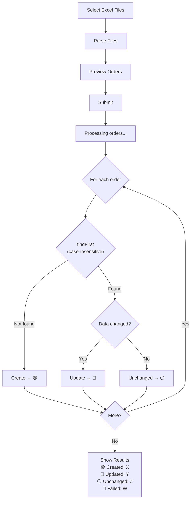

# Specification — Store Order with Upsert by Job Number
# Đặc tả — Lưu Đơn hàng với Upsert theo Job Number
<!-- US-1.1.3 | Created: 2026-02-09 -->

---

## TL;DR

| Aspect | Value |
|--------|-------|
| Feature | Store Order with Upsert by Job Number |
| Status | In Review |
| Phase 0 Analysis | [solution-design.md](../00_analysis/solution-design.md) |
| Functional Requirements | 6 (FR-001 → FR-006) |
| Non-Functional Requirements | 4 (NFR-001 → NFR-004) |
| Affected Roots | `sgs-cs-hepper` |

---

## 1. Overview

🇻🇳 Refactor server action `createOrders` từ chiến lược skip-duplicate sang upsert. Khi upload Excel, hệ thống sẽ: tạo đơn mới (jobNumber mới), cập nhật đơn tồn tại (dữ liệu thay đổi), hoặc báo không đổi (dữ liệu giống). User thấy summary rõ ràng 4 loại: Created / Updated / Unchanged / Failed.

🇬🇧 Refactor the `createOrders` server action from skip-duplicate to upsert strategy. On Excel upload, the system will: create new orders (new jobNumber), update existing orders (data changed), or report unchanged (data identical). Users see a clear 4-category summary: Created / Updated / Unchanged / Failed.

---

## 2. Goals & Non-Goals

### Goals

🇻🇳
1. **Upsert logic**: Upload lại file → đơn hàng hiện tại được cập nhật thay vì bị báo lỗi trùng
2. **3-way reporting**: User biết chính xác bao nhiêu đơn tạo mới / cập nhật / không đổi
3. **Data integrity**: Batch operation trong transaction, không partial state
4. **Status preservation**: Không overwrite status/completedAt khi update

🇬🇧
1. **Upsert logic**: Re-upload files → existing orders are updated instead of reported as duplicate errors
2. **3-way reporting**: Users know exactly how many orders were created / updated / unchanged
3. **Data integrity**: Batch operation within transaction, no partial state
4. **Status preservation**: Never overwrite status/completedAt on update

### Non-Goals

🇻🇳
1. Thay đổi logic parse Excel (US-1.1.2)
2. Thay đổi UI upload file (drag-drop, file selection — US-1.1.1)
3. Conflict resolution UI (manual merge giữa 2 versions)
4. Xóa hoặc archive đơn hàng
5. Thay đổi Prisma schema

🇬🇧
1. Change Excel parsing logic (US-1.1.2)
2. Change upload file UI (drag-drop, file selection — US-1.1.1)
3. Conflict resolution UI (manual merge between 2 versions)
4. Delete or archive orders
5. Prisma schema changes

---

## 3. User Stories

### US-001: Re-upload with Updated Data

🇻🇳 Là **Staff/Admin**, tôi muốn **upload lại file Excel có dữ liệu mới** (ví dụ: ngày yêu cầu thay đổi), để **đơn hàng hiện tại tự động cập nhật** mà không cần sửa DB thủ công.

🇬🇧 As a **Staff/Admin**, I want to **re-upload an Excel file with updated data** (e.g., changed required date), so that **existing orders are automatically updated** without manual DB edits.

### US-002: Clear Upload Feedback

🇻🇳 Là **Staff/Admin**, tôi muốn **thấy rõ kết quả upload** (tạo mới / cập nhật / không đổi / lỗi), để **biết chính xác chuyện gì đã xảy ra** với từng đơn hàng.

🇬🇧 As a **Staff/Admin**, I want to **see clear upload results** (created / updated / unchanged / failed), so that I **know exactly what happened** to each order.

### US-003: Case-insensitive Job Number Matching

🇻🇳 Là **Staff/Admin**, tôi muốn **hệ thống nhận diện jobNumber không phân biệt hoa thường**, để **"ABC-001" và "abc-001" là cùng một đơn** chứ không tạo trùng.

🇬🇧 As a **Staff/Admin**, I want the **system to recognize jobNumber case-insensitively**, so that **"ABC-001" and "abc-001" are the same order** and don't create duplicates.

---

## 4. Requirements Matrix

| ID | Title | Priority | Type | Covered By |
|----|-------|----------|------|------------|
| FR-001 | Upsert by Job Number | Must | Functional | TC-001, TC-002, TC-003 |
| FR-002 | Field Change Detection | Must | Functional | TC-004, TC-005 |
| FR-003 | Status Preservation | Must | Functional | TC-006 |
| FR-004 | Case-insensitive Matching | Must | Functional | TC-007 |
| FR-005 | Extended Result Types | Must | Functional | TC-008 |
| FR-006 | UI Results Display | Must | Functional | TC-009, TC-010 |
| NFR-001 | Batch Transaction | Must | Reliability | TC-011 |
| NFR-002 | Performance | Should | Performance | TC-012 |
| NFR-003 | SSE Broadcast | Must | Real-time | TC-013 |
| NFR-004 | Authorization | Must | Security | TC-014 |

---

## 5. Functional Requirements

### FR-001: Upsert by Job Number

| Aspect | Detail |
|--------|--------|
| Priority | Must |
| Affected Roots | `sgs-cs-hepper` |

#### Description

🇻🇳 Khi `createOrders` nhận mảng orders, mỗi order được xử lý theo logic:
1. Tìm order tồn tại bằng `jobNumber` (case-insensitive)
2. Nếu không tìm thấy → **CREATE** order mới với `status: IN_PROGRESS`
3. Nếu tìm thấy và dữ liệu thay đổi → **UPDATE** order (giữ status, completedAt)
4. Nếu tìm thấy và dữ liệu giống hệt → report **UNCHANGED**

🇬🇧 When `createOrders` receives an array of orders, each order is processed with logic:
1. Find existing order by `jobNumber` (case-insensitive)
2. If not found → **CREATE** new order with `status: IN_PROGRESS`
3. If found and data changed → **UPDATE** order (preserve status, completedAt)
4. If found and data identical → report **UNCHANGED**

#### Acceptance Criteria

- [ ] AC1: New jobNumber → order created with `status: IN_PROGRESS`
- [ ] AC2: Existing jobNumber + different data → order updated
- [ ] AC3: Existing jobNumber + identical data → reported as unchanged, no DB write
- [ ] AC4: `uploadedAt` set to `now()` on both create and update
- [ ] AC5: `uploadedById` set to authenticated user on both create and update
- [ ] AC6: `sourceFileName` updated on both create and update

---

### FR-002: Field Change Detection

| Aspect | Detail |
|--------|--------|
| Priority | Must |
| Affected Roots | `sgs-cs-hepper` |

#### Description

🇻🇳 Helper function `hasOrderChanged(existing, input)` so sánh 7 fields giữa order DB và order upload. Chỉ trigger update khi ít nhất 1 field khác nhau. So sánh date bằng `.getTime()`, nullable fields bằng normalization `?? null`.

🇬🇧 Helper function `hasOrderChanged(existing, input)` compares 7 fields between DB order and uploaded order. Only triggers update when at least 1 field differs. Compares dates via `.getTime()`, nullable fields via normalization `?? null`.

#### Fields Compared

| Field | Type | Comparison Method |
|-------|------|-------------------|
| `registeredDate` | DateTime | `new Date(input).getTime() !== existing.getTime()` |
| `receivedDate` | DateTime | `new Date(input).getTime() !== existing.getTime()` |
| `requiredDate` | DateTime | `new Date(input).getTime() !== existing.getTime()` |
| `priority` | Int | `===` |
| `registeredBy` | String \| null | `(input ?? null) !== (existing ?? null)` |
| `checkedBy` | String \| null | `(input ?? null) !== (existing ?? null)` |
| `note` | String \| null | `(input ?? null) !== (existing ?? null)` |

#### Fields NOT Compared (Preserved)

| Field | Reason |
|-------|--------|
| `status` | Preserved on update (FR-003) |
| `completedAt` | Preserved on update (FR-003) |
| `sampleCount` | Not in CreateOrderInput |
| `description` | Not in CreateOrderInput |
| `id`, `createdAt`, `updatedAt` | System fields |

#### Acceptance Criteria

- [ ] AC1: Function returns `true` when any of the 7 fields differ
- [ ] AC2: Function returns `false` when all 7 fields are identical
- [ ] AC3: Date comparison uses `.getTime()` (not reference equality)
- [ ] AC4: Nullable fields normalized before comparison (`undefined` → `null`)
- [ ] AC5: Function is pure (no side effects)

---

### FR-003: Status Preservation on Update

| Aspect | Detail |
|--------|--------|
| Priority | Must |
| Affected Roots | `sgs-cs-hepper` |

#### Description

🇻🇳 Khi update order tồn tại, các fields sau **KHÔNG BAO GIỜ** bị overwrite:
- `status` — giữ nguyên (IN_PROGRESS, COMPLETED, hoặc OVERDUE)
- `completedAt` — giữ nguyên (nếu đã COMPLETED)
- `id` — immutable
- `createdAt` — immutable

Điều này đặc biệt quan trọng: nếu order đã COMPLETED, upload lại KHÔNG được reset về IN_PROGRESS.

🇬🇧 When updating an existing order, the following fields are **NEVER** overwritten:
- `status` — preserved (IN_PROGRESS, COMPLETED, or OVERDUE)
- `completedAt` — preserved (if already COMPLETED)
- `id` — immutable
- `createdAt` — immutable

This is critical: if an order is already COMPLETED, re-uploading MUST NOT reset it to IN_PROGRESS.

#### Acceptance Criteria

- [ ] AC1: Update an IN_PROGRESS order → status remains IN_PROGRESS
- [ ] AC2: Update a COMPLETED order → status remains COMPLETED
- [ ] AC3: Update a COMPLETED order → completedAt is preserved
- [ ] AC4: Update an OVERDUE order → status remains OVERDUE
- [ ] AC5: `prisma.order.update()` data clause excludes `status`, `completedAt`

---

### FR-004: Case-insensitive Job Number Matching

| Aspect | Detail |
|--------|--------|
| Priority | Must |
| Affected Roots | `sgs-cs-hepper` |

#### Description

🇻🇳 Tìm kiếm order tồn tại bằng `jobNumber` không phân biệt hoa thường. Dùng Prisma `findFirst` với `mode: "insensitive"` trên PostgreSQL. Giá trị `jobNumber` lưu trong DB giữ nguyên case gốc.

🇬🇧 Lookup existing orders by `jobNumber` case-insensitively. Use Prisma `findFirst` with `mode: "insensitive"` on PostgreSQL. The `jobNumber` value stored in DB retains its original case.

#### Acceptance Criteria

- [ ] AC1: Upload "ABC-001" when DB has "abc-001" → matched as existing
- [ ] AC2: Upload "abc-001" when DB has "ABC-001" → matched as existing
- [ ] AC3: Upload "ABC-001" when DB has no matching job → created as new
- [ ] AC4: Stored jobNumber retains the case from the **first** upload (create), not overwritten by subsequent uploads

---

### FR-005: Extended Result Types

| Aspect | Detail |
|--------|--------|
| Priority | Must |
| Affected Roots | `sgs-cs-hepper` |

#### Description

🇻🇳 Mở rộng `BatchCreateResult` với 2 fields mới và thêm type `UnchangedOrder`. Update `SubmitResult` trong upload form tương ứng.

🇬🇧 Extend `BatchCreateResult` with 2 new fields and add `UnchangedOrder` type. Update `SubmitResult` in upload form accordingly.

#### Data Contract — `BatchCreateResult` (Modified)

```typescript
export interface BatchCreateResult {
  success: boolean;
  created: Order[];
  updated: Order[];                    // NEW
  unchanged: UnchangedOrder[];         // NEW
  failed: FailedOrder[];
  message: string;
}
```

#### Data Contract — `UnchangedOrder` (New)

```typescript
export interface UnchangedOrder {
  id: string;
  jobNumber: string;
}
```

#### Data Contract — `SubmitResult` (Modified, in upload-form.tsx)

```typescript
interface SubmitResult {
  success: boolean;
  message: string;
  created: number;
  updated: number;                     // NEW
  unchanged: number;                   // NEW
  failed: number;
  createdOrders: CreatedOrderInfo[];
  updatedOrders: UpdatedOrderInfo[];   // NEW
  unchangedOrders: UnchangedOrderInfo[];  // NEW
  failedOrders: FailedOrderInfo[];
}

interface UpdatedOrderInfo {           // NEW
  jobNumber: string;
}

interface UnchangedOrderInfo {         // NEW
  jobNumber: string;
}
```

#### Acceptance Criteria

- [ ] AC1: `BatchCreateResult` includes `updated: Order[]`
- [ ] AC2: `BatchCreateResult` includes `unchanged: UnchangedOrder[]`
- [ ] AC3: `UnchangedOrder` type has `id` and `jobNumber`
- [ ] AC4: `success` is `true` only when `failed.length === 0`
- [ ] AC5: `message` summarizes all 4 categories (e.g., "Created 3, Updated 2, Unchanged 1")
- [ ] AC6: `SubmitResult` includes `updated`, `unchanged` counts and arrays

---

### FR-006: UI Results Display — 4 Categories

| Aspect | Detail |
|--------|--------|
| Priority | Must |
| Affected Roots | `sgs-cs-hepper` |

#### Description

🇻🇳 Mở rộng results section trong upload form hiển thị 4 loại:
- 🟢 **Created** (green card) — đơn mới tạo thành công, hiển thị danh sách jobNumber
- 🔵 **Updated** (blue card) — đơn đã cập nhật, hiển thị danh sách jobNumber
- ⚪ **Unchanged** (gray card) — đơn tồn tại, dữ liệu giống, hiển thị danh sách jobNumber
- 🔴 **Failed** (red card) — lỗi thật, hiển thị jobNumber + error message

Summary line cập nhật: "Created: X | Updated: Y | Unchanged: Z | Failed: W"

🇬🇧 Extend results section in upload form to display 4 categories:
- 🟢 **Created** (green card) — newly created orders, show jobNumber list
- 🔵 **Updated** (blue card) — updated orders, show jobNumber list
- ⚪ **Unchanged** (gray card) — existing orders with identical data, show jobNumber list
- 🔴 **Failed** (red card) — actual errors, show jobNumber + error message

Summary line updated: "Created: X | Updated: Y | Unchanged: Z | Failed: W"

#### Acceptance Criteria

- [ ] AC1: Green card with header "Đã tạo thành công (N order)" for created
- [ ] AC2: Blue card with header "Đã cập nhật (N order)" for updated
- [ ] AC3: Gray card with header "Không thay đổi (N order)" for unchanged
- [ ] AC4: Red card with header "Không tạo được (N order)" for failed (existing behavior)
- [ ] AC5: Summary line shows all 4 counts
- [ ] AC6: Cards only rendered when count > 0 (no empty cards)
- [ ] AC7: Submitting state text changed from "Creating orders..." to "Processing orders..."

---

## 6. Non-Functional Requirements

### NFR-001: Batch Transaction Integrity

| Aspect | Detail |
|--------|--------|
| Category | Reliability |
| Metric | All-or-nothing batch processing |

#### Description

🇻🇳 Toàn bộ batch order được xử lý trong `prisma.$transaction()`. Nếu bất kỳ order nào gặp unexpected error (không phải validation error), toàn bộ batch rollback — không có partial state.

🇬🇧 The entire batch of orders is processed within `prisma.$transaction()`. If any order encounters an unexpected error (not a validation error), the entire batch rolls back — no partial state.

#### Acceptance Criteria

- [ ] AC1: All DB operations (findFirst, create, update) run inside `$transaction()`
- [ ] AC2: Unexpected error in any order → entire batch rolled back
- [ ] AC3: Transaction timeout set to 10 seconds (configurable)

---

### NFR-002: Performance

| Aspect | Detail |
|--------|--------|
| Category | Performance |
| Metric | < 5s for batch of 50 orders |

#### Description

🇻🇳 Batch upload 50 orders hoàn thành trong < 5 giây. Mỗi order cần 1-2 queries (findFirst + optional create/update).

🇬🇧 Batch upload of 50 orders completes in < 5 seconds. Each order requires 1-2 queries (findFirst + optional create/update).

#### Acceptance Criteria

- [ ] AC1: 50-order batch completes within 5 seconds under normal load
- [ ] AC2: Transaction timeout is 10 seconds to accommodate edge cases

---

### NFR-003: SSE Broadcast for Created + Updated

| Aspect | Detail |
|--------|--------|
| Category | Real-time Updates |
| Metric | All connected clients receive update within 1s |

#### Description

🇻🇳 Sau khi transaction commit, `broadcastBulkUpdate()` gửi mảng gồm cả created + updated orders. Unchanged orders **không** broadcast. SSE failure không block kết quả upload.

🇬🇧 After transaction commits, `broadcastBulkUpdate()` sends an array containing both created + updated orders. Unchanged orders are **not** broadcast. SSE failure does not block the upload result.

#### Acceptance Criteria

- [ ] AC1: `broadcastBulkUpdate` called with `[...created, ...updated]`
- [ ] AC2: Unchanged orders excluded from broadcast
- [ ] AC3: SSE error caught and logged, upload result still returned

---

### NFR-004: Authorization Unchanged

| Aspect | Detail |
|--------|--------|
| Category | Security |
| Metric | Same auth rules as current implementation |

#### Description

🇻🇳 Auth check không thay đổi: SUPER_ADMIN/ADMIN tự động có quyền, STAFF cần `canUpload: true`. Auth check chạy trước transaction.

🇬🇧 Auth check unchanged: SUPER_ADMIN/ADMIN automatically have permission, STAFF needs `canUpload: true`. Auth check runs before transaction.

#### Acceptance Criteria

- [ ] AC1: `requireUploadPermission()` logic unchanged
- [ ] AC2: Unauthenticated → all orders in `failed[]` with "Unauthorized" error
- [ ] AC3: STAFF without `canUpload` → all orders in `failed[]` with "permission" error

---

## 7. User Flow

| Step | Action | System Response | Next Step |
|------|--------|-----------------|-----------|
| 1 | User selects Excel files | Show file list | 2 |
| 2 | User clicks "Parse" | Parse files → show preview | 3 |
| 3 | User reviews preview, clicks "Submit" | Show "Processing orders..." spinner | 4 |
| 4 | — | `createOrders()` runs upsert in transaction | 5 |
| 5 | — | SSE broadcast created + updated | 6 |
| 6 | — | Display 4-category results | End |

### Flow Diagram



---

## 8. Data Models

### Existing Model — Order (No Changes)

```prisma
model Order {
  id              String      @id @default(cuid())
  jobNumber       String      @unique
  registeredDate  DateTime
  receivedDate    DateTime
  requiredDate    DateTime
  priority        Int         @default(0)
  status          OrderStatus @default(IN_PROGRESS)
  registeredBy    String?
  checkedBy       String?
  note            String?
  sampleCount     Int         @default(1)
  description     String?
  completedAt     DateTime?
  uploadedAt      DateTime    @default(now())
  uploadedById    String
  uploadedBy      User        @relation(...)
  createdAt       DateTime    @default(now())
  updatedAt       DateTime    @updatedAt
}
```

### New Type — UnchangedOrder

```typescript
export interface UnchangedOrder {
  id: string;
  jobNumber: string;
}
```

### Modified Type — BatchCreateResult

```typescript
export interface BatchCreateResult {
  success: boolean;
  created: Order[];
  updated: Order[];           // NEW
  unchanged: UnchangedOrder[]; // NEW
  failed: FailedOrder[];
  message: string;
}
```

---

## 9. API Contracts

### Server Action: `createOrders`

```typescript
// Signature (unchanged)
export async function createOrders(
  orders: CreateOrderInput[]
): Promise<BatchCreateResult>

// Input: CreateOrderInput[] (unchanged)
interface CreateOrderInput {
  jobNumber: string;
  registeredDate: string;     // ISO datetime
  registeredBy?: string;
  receivedDate: string;       // ISO datetime
  checkedBy?: string;
  requiredDate: string;       // ISO datetime
  priority: number;
  note?: string;
  sourceFileName: string;
}

// Output: BatchCreateResult (modified — see FR-005)
```

### Internal Helper: `hasOrderChanged`

```typescript
// New function — not exported from "use server" module
// Lives in same file or extracted to utility
function hasOrderChanged(
  existing: Order,
  input: CreateOrderInput
): boolean
```

---

## 10. Edge Cases

| ID | Scenario | Expected Behavior | Priority |
|----|----------|-------------------|----------|
| EC-001 | All orders are new | All in `created[]`, `updated`/`unchanged` empty | Must handle |
| EC-002 | All orders are unchanged | All in `unchanged[]`, `created`/`updated` empty, `success: true` | Must handle |
| EC-003 | Mix of create/update/unchanged/error | Each categorized correctly, `success: false` if any failed | Must handle |
| EC-004 | Batch of 1 order | Works same as batch (transaction still used) | Must handle |
| EC-005 | Empty array input | Caught by Zod validation, return error | Must handle |
| EC-006 | Same jobNumber twice in one batch | First processed normally, second sees first's result | Should handle |
| EC-007 | COMPLETED order re-uploaded with changes | Updated data fields, `status` stays COMPLETED | Must handle |
| EC-008 | jobNumber "ABC-001" vs "abc-001" in same batch | Treated as same order (case-insensitive) | Should handle |
| EC-009 | Null vs undefined in nullable fields | Normalized to null before comparison | Must handle |
| EC-010 | Date with different timezone offset, same instant | `.getTime()` comparison handles correctly | Must handle |

### EC-006: Same jobNumber Twice in One Batch

🇻🇳
**Khi:** Batch chứa 2 orders cùng jobNumber (ví dụ: từ 2 file Excel khác nhau)
**Thì:** Order đầu tiên xử lý bình thường (create nếu mới, update nếu tồn tại). Order thứ hai sẽ thấy order vừa tạo/cập nhật → xử lý như update hoặc unchanged tùy data.
**Lý do:** Transaction đảm bảo sequential processing trong batch.

🇬🇧
**When:** Batch contains 2 orders with same jobNumber (e.g., from 2 different Excel files)
**Then:** First order processes normally (create if new, update if exists). Second order sees the just-created/updated order → processes as update or unchanged depending on data.
**Rationale:** Transaction ensures sequential processing within batch.

### EC-007: COMPLETED Order Re-uploaded

🇻🇳
**Khi:** Order có `status: COMPLETED` và `completedAt: 2026-02-05` được upload lại với ngày yêu cầu mới.
**Thì:** Data fields cập nhật (requiredDate, etc.), nhưng `status` vẫn COMPLETED, `completedAt` vẫn 2026-02-05.
**Lý do:** AC quan trọng nhất — không bao giờ reset trạng thái đơn hàng đã hoàn thành.

🇬🇧
**When:** Order with `status: COMPLETED` and `completedAt: 2026-02-05` is re-uploaded with a new required date.
**Then:** Data fields updated (requiredDate, etc.), but `status` stays COMPLETED, `completedAt` stays 2026-02-05.
**Rationale:** Most critical AC — never reset the state of a completed order.

---

## 11. Error Handling

| Error Condition | User Message | System Action |
|-----------------|--------------|---------------|
| Auth failure | "Unauthorized. Please log in." | Return all orders as `failed[]` |
| Permission denied | "You do not have permission to create orders." | Return all orders as `failed[]` |
| Zod validation failure | "Invalid order data structure" | Return all orders as `failed[]` |
| Individual order Prisma error | Error message from Prisma | That order in `failed[]`, others still processed |
| Transaction unexpected error | "Failed to process orders" | Entire batch rolled back, all in `failed[]` |
| SSE broadcast failure | (not shown to user) | Logged to console, upload result still returned |

---

## 12. Cross-Root Impact

| Root | Changes | Sync Required |
|------|---------|---------------|
| `sgs-cs-hepper` | Server action, types, UI | N/A (single root) |

🇻🇳 Không có cross-root impact. Tất cả thay đổi nằm trong `sgs-cs-hepper`.

🇬🇧 No cross-root impact. All changes are within `sgs-cs-hepper`.

---

## 13. Dependencies

| Dependency | Type | Status |
|------------|------|--------|
| `prisma` (PrismaClient) | Package | Existing — `$transaction`, `findFirst` |
| `zod` | Package | Existing — validation unchanged |
| `next-auth` | Package | Existing — auth unchanged |
| `@/lib/sse/broadcaster` | Internal module | Existing — `broadcastBulkUpdate` |

No new dependencies required.

---

## 14. Risks & Assumptions

### Risks

| Risk | Impact | Mitigation |
|------|--------|------------|
| Transaction timeout for large batches | Medium | Set timeout to 10s; practical batch < 50 |
| Case-insensitive edge cases (Turkish İ, etc.) | Low | PostgreSQL `ILIKE` handles correctly |
| Race condition on concurrent uploads | Low | Transaction provides row-level locking |
| Breaking existing tests | Low | Update mocks to include `updated`/`unchanged` |

### Assumptions

| # | Assumption | Validated |
|---|------------|-----------|
| 1 | `jobNumber` has `@unique` constraint | ✅ Yes — confirmed in schema.prisma |
| 2 | Batch size is < 100 orders per upload | ✅ Yes — practical limit |
| 3 | `sampleCount` and `description` not in CreateOrderInput | ✅ Yes — confirmed in types.ts |
| 4 | `broadcastBulkUpdate` accepts `Order[]` without changes | ✅ Yes — confirmed in broadcaster.ts |
| 5 | `findFirst` with `mode: "insensitive"` works on PostgreSQL | ✅ Yes — Prisma docs confirm |

---

## 15. Open Questions

| # | Question | Status | Answer |
|---|----------|--------|--------|
| — | No open questions | — | All resolved in Phase 0 |

---

## 16. Notes

🇻🇳
- `sourceFileName`, `uploadedById`, `uploadedAt` luôn cập nhật khi re-upload (metadata, không phải data comparison)
- Unchanged orders hiển thị trong UI nhưng **không** trigger SSE broadcast
- `hasOrderChanged` nên đặt cùng file `order.ts` (internal helper, không export từ "use server")
- Error handling trong transaction: validation errors → order vào `failed[]` + tiếp tục; unexpected errors → throw → rollback

🇬🇧
- `sourceFileName`, `uploadedById`, `uploadedAt` always updated on re-upload (metadata, not part of data comparison)
- Unchanged orders shown in UI but do **not** trigger SSE broadcast
- `hasOrderChanged` should live in same file `order.ts` (internal helper, not exported from "use server")
- Error handling in transaction: validation errors → order goes to `failed[]` + continue; unexpected errors → throw → rollback

---

## Approval

| Role | Name | Status | Date |
|------|------|--------|------|
| Spec Author | Copilot | ✅ Done | 2026-02-09 |
| Reviewer | User | ⏳ Pending | — |

---

## Next Step

🇻🇳 Sau khi phê duyệt, tiến hành **Phase 2: Task Planning**.

🇬🇧 After approval, proceed to **Phase 2: Task Planning**.
