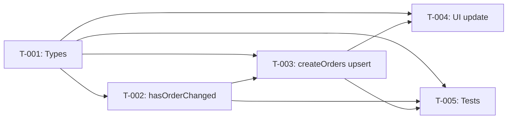

# Task Plan — Store Order with Upsert by Job Number
<!-- Template Version: 1.0 | Contract: v1.0 | Last Updated: 2026-02-09 -->
<!-- 🇻🇳 Vietnamese first, 🇬🇧 English follows — for easy scanning -->

---

## TL;DR

| Aspect | Value |
|--------|-------|
| Feature | US-1.1.3: Store Order with Upsert by Job Number |
| Total Tasks | 5 |
| Estimated Effort | ~5.5 hours |
| Affected Roots | `sgs-cs-hepper` |
| Dev Mode | Standard |
| Spec Reference | [spec.md](../01_spec/spec.md) |

---

## 1. Goal

🇻🇳 Refactor `createOrders` từ skip-duplicate sang upsert pattern (findFirst → compare → create/update/unchanged). Mở rộng types, cập nhật UI hiển thị 4 loại kết quả, và cập nhật tests.

🇬🇧 Refactor `createOrders` from skip-duplicate to upsert pattern (findFirst → compare → create/update/unchanged). Extend types, update UI to display 4-category results, and update tests.

---

## 2. Task Overview

| ID | Title | Root | Type | Est. | Deps | Status |
|----|-------|------|------|------|------|--------|
| T-001 | Extend `BatchCreateResult` & add `UnchangedOrder` type | `sgs-cs-hepper` | Modify | S (30m) | - | ⏳ |
| T-002 | Implement `hasOrderChanged()` helper | `sgs-cs-hepper` | New | M (1h) | T-001 | ⏳ |
| T-003 | Refactor `createOrders()` to upsert with transaction | `sgs-cs-hepper` | Modify | L (2h) | T-001, T-002 | ⏳ |
| T-004 | Update `SubmitResult` & upload results UI | `sgs-cs-hepper` | Modify | M (1h) | T-001, T-003 | ⏳ |
| T-005 | Update tests for upsert behavior | `sgs-cs-hepper` | Modify | M (1h) | T-001, T-002, T-003 | ⏳ |

**Legend:**
- Type: `New` = Create new, `Modify` = Change existing
- Status: ⏳ Pending, 🔄 In Progress, ✅ Done, ❌ Blocked
- Est: S (<1h), M (1-2h), L (2-4h)

---

## 3. Execution Flow



---

## 3.5 Parallel Execution Notes

### Parallel Groups

🇻🇳 Sau khi T-001 xong, T-002 có thể chạy độc lập (file khác).

🇬🇧 After T-001 completes, T-002 can run independently (different file).

| Group | Tasks | Reason |
|-------|-------|--------|
| A | T-002 | Can start once T-001 is done (different file: `order.ts` vs `types.ts`) |

### Sequential Constraints

| Sequence | Reason |
|----------|--------|
| T-001 → T-003 | T-003 uses types defined in T-001 |
| T-002 → T-003 | T-003 calls `hasOrderChanged()` from T-002 |
| T-003 → T-004 | T-004 maps server result to UI — needs T-003 return shape |
| T-003 → T-005 | T-005 tests the refactored `createOrders()` |

### Execution Hint

🇻🇳 Thực tế, flow tuần tự T-001 → T-002 → T-003 → T-004 → T-005 là tối ưu nhất vì mỗi task build trên task trước.

🇬🇧 In practice, sequential flow T-001 → T-002 → T-003 → T-004 → T-005 is optimal since each task builds on the previous.

---

## 4. Task Details

### T-001 — Extend `BatchCreateResult` & add `UnchangedOrder` type

| Aspect | Detail |
|--------|--------|
| Root | `sgs-cs-hepper` |
| Type | Modify |
| Estimated | S (30 min) |
| Dependencies | None |
| FR Covered | FR-005 |

#### Description

🇻🇳 Thêm interface `UnchangedOrder` (id + jobNumber) và mở rộng `BatchCreateResult` thêm `updated: Order[]` và `unchanged: UnchangedOrder[]`. Đây là foundation types cho tất cả tasks sau.

🇬🇧 Add `UnchangedOrder` interface (id + jobNumber) and extend `BatchCreateResult` with `updated: Order[]` and `unchanged: UnchangedOrder[]`. These are the foundation types for all subsequent tasks.

#### Files

| Action | Path |
|--------|------|
| Modify | `src/lib/excel/types.ts` |

#### Implementation

🇻🇳 Thêm `UnchangedOrder` interface trước `BatchCreateResult`. Thêm 2 fields mới vào `BatchCreateResult`. Không thay đổi `FailedOrder`, `CreateOrderInput`, hay các types khác.

🇬🇧 Add `UnchangedOrder` interface before `BatchCreateResult`. Add 2 new fields to `BatchCreateResult`. No changes to `FailedOrder`, `CreateOrderInput`, or other types.

```typescript
// NEW — Add before BatchCreateResult
export interface UnchangedOrder {
  id: string;
  jobNumber: string;
}

// MODIFIED — Add updated + unchanged
export interface BatchCreateResult {
  success: boolean;
  created: Order[];
  updated: Order[];              // NEW
  unchanged: UnchangedOrder[];   // NEW
  failed: FailedOrder[];
  message: string;
}
```

#### Done Criteria

- [ ] `UnchangedOrder` interface exported from `types.ts`
- [ ] `BatchCreateResult` has `updated: Order[]` field
- [ ] `BatchCreateResult` has `unchanged: UnchangedOrder[]` field
- [ ] Existing fields unchanged (`success`, `created`, `failed`, `message`)
- [ ] TypeScript compiles (type errors expected in `order.ts` and `upload-form.tsx` — fixed in T-003/T-004)

#### Verification

```bash
# Type check will show expected errors in consumers (order.ts, upload-form.tsx)
pnpm tsc --noEmit 2>&1 | grep -c "error"
# Should show errors ONLY in order.ts and upload-form.tsx (fixed in T-003/T-004)
```

---

### T-002 — Implement `hasOrderChanged()` helper

| Aspect | Detail |
|--------|--------|
| Root | `sgs-cs-hepper` |
| Type | New |
| Estimated | M (1 hour) |
| Dependencies | T-001 |
| FR Covered | FR-002 |

#### Description

🇻🇳 Tạo function `hasOrderChanged(existing: Order, input: CreateOrderInput): boolean` so sánh 7 fields giữa order trong DB và order từ upload. So sánh date bằng `.getTime()`, string bằng trim + null normalization, number trực tiếp.

🇬🇧 Create function `hasOrderChanged(existing: Order, input: CreateOrderInput): boolean` comparing 7 fields between DB order and upload input. Date comparison via `.getTime()`, string via trim + null normalization, number directly.

#### Files

| Action | Path |
|--------|------|
| Modify | `src/lib/actions/order.ts` |

#### Implementation

🇻🇳 Thêm `hasOrderChanged()` như internal helper function (không export từ "use server"). Đặt trước `createOrders()`. So sánh 7 fields:

🇬🇧 Add `hasOrderChanged()` as internal helper (not exported from "use server"). Place before `createOrders()`. Compare 7 fields:

| Field | Type | Comparison |
|-------|------|------------|
| `registeredDate` | DateTime → string | `existing.registeredDate.getTime() !== new Date(input.registeredDate).getTime()` |
| `receivedDate` | DateTime → string | `.getTime()` comparison |
| `requiredDate` | DateTime → string | `.getTime()` comparison |
| `priority` | number | `existing.priority !== input.priority` |
| `registeredBy` | string \| null | Normalize: `(existing.registeredBy ?? null) !== (input.registeredBy ?? null)` |
| `checkedBy` | string \| null | Same null normalization |
| `note` | string \| null | Same null normalization |

```typescript
/**
 * Compare 7 uploadable fields between existing DB order and new input.
 * Returns true if ANY field differs → order needs update.
 * 
 * Fields NOT compared (preserved on update):
 * - status, completedAt, sampleCount, description (not in CreateOrderInput)
 * - uploadedAt, uploadedById (metadata — always updated)
 */
function hasOrderChanged(
  existing: Order,
  input: CreateOrderInput
): boolean {
  // Date comparisons
  if (existing.registeredDate.getTime() !== new Date(input.registeredDate).getTime()) return true;
  if (existing.receivedDate.getTime() !== new Date(input.receivedDate).getTime()) return true;
  if (existing.requiredDate.getTime() !== new Date(input.requiredDate).getTime()) return true;

  // Number comparison
  if (existing.priority !== input.priority) return true;

  // Nullable string comparisons (normalize undefined → null)
  if ((existing.registeredBy ?? null) !== (input.registeredBy ?? null)) return true;
  if ((existing.checkedBy ?? null) !== (input.checkedBy ?? null)) return true;
  if ((existing.note ?? null) !== (input.note ?? null)) return true;

  return false;
}
```

#### Done Criteria

- [ ] `hasOrderChanged()` function defined in `order.ts` (not exported)
- [ ] Compares exactly 7 fields (registeredDate, receivedDate, requiredDate, priority, registeredBy, checkedBy, note)
- [ ] Date comparison uses `.getTime()` for timezone safety
- [ ] Nullable strings normalized with `?? null`
- [ ] Returns `true` if any field differs, `false` if all match
- [ ] Does NOT compare: status, completedAt, sampleCount, description, uploadedAt, uploadedById

#### Verification

```bash
pnpm tsc --noEmit  # No new errors from this function
```

---

### T-003 — Refactor `createOrders()` to upsert with transaction

| Aspect | Detail |
|--------|--------|
| Root | `sgs-cs-hepper` |
| Type | Modify |
| Estimated | L (2 hours) |
| Dependencies | T-001, T-002 |
| FR Covered | FR-001, FR-003, FR-004, NFR-001, NFR-003 |

#### Description

🇻🇳 Refactor `createOrders()`: (1) wrap batch trong `prisma.$transaction()`, (2) thay `findUnique` bằng `findFirst` với `mode: "insensitive"`, (3) if found → `hasOrderChanged()` → update hoặc unchanged, (4) if not found → create. SSE broadcast `[...created, ...updated]`. Return `BatchCreateResult` với 4 arrays.

🇬🇧 Refactor `createOrders()`: (1) wrap batch in `prisma.$transaction()`, (2) replace `findUnique` with `findFirst` using `mode: "insensitive"`, (3) if found → `hasOrderChanged()` → update or unchanged, (4) if not found → create. SSE broadcasts `[...created, ...updated]`. Return `BatchCreateResult` with 4 arrays.

#### Files

| Action | Path |
|--------|------|
| Modify | `src/lib/actions/order.ts` |

#### Implementation

🇻🇳 Thay thế toàn bộ phần xử lý batch trong `createOrders()`. Import `UnchangedOrder` từ types. Key changes:

🇬🇧 Replace entire batch processing section in `createOrders()`. Import `UnchangedOrder` from types. Key changes:

1. **Import**: Add `UnchangedOrder` to imports from `@/lib/excel/types`
2. **Transaction**: Wrap order processing loop in `prisma.$transaction(async (tx) => { ... })`
3. **Case-insensitive lookup**: `tx.order.findFirst({ where: { jobNumber: { equals: input.jobNumber, mode: "insensitive" } } })`
4. **Branch logic per order**:
   - Not found → `tx.order.create(...)` → push to `created[]`
   - Found + changed → `tx.order.update(...)` → push to `updated[]`
     - Update data fields but EXCLUDE: `status`, `completedAt`, `sampleCount`, `description`
     - ALWAYS update: `uploadedAt: new Date()`, `uploadedById: userId`, `sourceFileName`
   - Found + unchanged → push `{ id, jobNumber }` to `unchanged[]`
     - Still update metadata: `uploadedAt`, `uploadedById`, `sourceFileName`
5. **Error handling**: Individual order try/catch inside transaction → `failed[]`. If unexpected error → throw → rollback.
6. **SSE**: `broadcastBulkUpdate([...created, ...updated])` — exclude unchanged
7. **Message**: `Created X, Updated Y, Unchanged Z, Failed W`
8. **Success**: `failed.length === 0`
9. **Validation error return**: Include `updated: []` and `unchanged: []` in error returns

```typescript
// Key structure (pseudo-code):
const { created, updated, unchanged, failed } = await prisma.$transaction(
  async (tx) => {
    const created: Order[] = [];
    const updated: Order[] = [];
    const unchanged: UnchangedOrder[] = [];
    const failed: FailedOrder[] = [];

    for (const orderInput of validatedOrders) {
      try {
        const existing = await tx.order.findFirst({
          where: { jobNumber: { equals: orderInput.jobNumber, mode: "insensitive" } },
        });

        if (!existing) {
          // CREATE
          const order = await tx.order.create({ data: { ... } });
          created.push(order);
        } else if (hasOrderChanged(existing, orderInput)) {
          // UPDATE (preserve status, completedAt)
          const order = await tx.order.update({
            where: { id: existing.id },
            data: { /* 7 data fields + metadata */ },
          });
          updated.push(order);
        } else {
          // UNCHANGED — still update metadata
          await tx.order.update({
            where: { id: existing.id },
            data: { uploadedAt: new Date(), uploadedById: userId, sourceFileName: orderInput.sourceFileName },
          });
          unchanged.push({ id: existing.id, jobNumber: existing.jobNumber });
        }
      } catch (error) {
        failed.push({ order: orderInput, error: message });
      }
    }

    return { created, updated, unchanged, failed };
  },
  { timeout: 10000 }
);
```

#### Done Criteria

- [ ] `createOrders()` processes orders inside `prisma.$transaction()`
- [ ] Uses `findFirst` with `mode: "insensitive"` (not `findUnique`)
- [ ] New orders → `created[]`
- [ ] Existing + changed → `updated[]` (preserves `status`, `completedAt`, `sampleCount`, `description`)
- [ ] Existing + unchanged → `unchanged[]` (metadata still updated)
- [ ] Errors → `failed[]`
- [ ] SSE broadcasts `[...created, ...updated]` only
- [ ] SSE NOT called when `created.length + updated.length === 0`
- [ ] Transaction timeout set to 10000ms
- [ ] All error return paths include `updated: []` and `unchanged: []`
- [ ] Message format: `Created X, Updated Y, Unchanged Z` (and Failed if any)
- [ ] `success: failed.length === 0`

#### Verification

```bash
pnpm tsc --noEmit        # Should pass (or only UI errors from T-004)
pnpm dev                  # Dev server starts without errors
```

---

### T-004 — Update `SubmitResult` & upload results UI

| Aspect | Detail |
|--------|--------|
| Root | `sgs-cs-hepper` |
| Type | Modify |
| Estimated | M (1 hour) |
| Dependencies | T-001, T-003 |
| FR Covered | FR-005, FR-006 |

#### Description

🇻🇳 Cập nhật `SubmitResult` interface thêm `updated` và `unchanged` counts + arrays. Cập nhật `handleSubmit` để map `BatchCreateResult` mới. Thêm 2 result cards: xanh dương (updated) và xám (unchanged). Cập nhật summary line.

🇬🇧 Update `SubmitResult` interface with `updated` and `unchanged` counts + arrays. Update `handleSubmit` to map new `BatchCreateResult`. Add 2 result cards: blue (updated) and gray (unchanged). Update summary line.

#### Files

| Action | Path |
|--------|------|
| Modify | `src/components/orders/upload-form.tsx` |

#### Implementation

🇻🇳 4 thay đổi chính:

🇬🇧 4 key changes:

**1. Extend `SubmitResult` interface:**
```typescript
interface UpdatedOrderInfo {
  jobNumber: string;
}

interface UnchangedOrderInfo {
  jobNumber: string;
}

interface SubmitResult {
  success: boolean;
  message: string;
  created: number;
  updated: number;           // NEW
  unchanged: number;         // NEW
  failed: number;
  createdOrders: CreatedOrderInfo[];
  updatedOrders: UpdatedOrderInfo[];      // NEW
  unchangedOrders: UnchangedOrderInfo[];  // NEW
  failedOrders: FailedOrderInfo[];
}
```

**2. Update `handleSubmit` mapping:**
```typescript
setSubmitResult({
  // ...existing
  updated: result.updated.length,
  unchanged: result.unchanged.length,
  updatedOrders: result.updated.map((o) => ({ jobNumber: o.jobNumber })),
  unchangedOrders: result.unchanged.map((o) => ({ jobNumber: o.jobNumber })),
});
```

**3. Update summary line:**
```
Created: X | Updated: Y | Unchanged: Z | Failed: W
```

**4. Add result cards:**
- 🔵 Blue card for updated orders (same pattern as green card)
- ⚪ Gray card for unchanged orders (same pattern, gray colors)

#### Done Criteria

- [ ] `SubmitResult` has `updated`, `unchanged` counts and arrays
- [ ] `handleSubmit` maps `result.updated` and `result.unchanged` correctly
- [ ] Error path sets `updated: 0, unchanged: 0, updatedOrders: [], unchangedOrders: []`
- [ ] Summary shows 4 categories: Created | Updated | Unchanged | Failed
- [ ] Blue card renders for updated orders (bg-blue-50, border-blue-200, text-blue-800)
- [ ] Gray card renders for unchanged orders (bg-gray-50, border-gray-200, text-gray-800)
- [ ] Cards only render when array is non-empty
- [ ] Card order: created (green) → updated (blue) → unchanged (gray) → failed (red)

#### Verification

```bash
pnpm tsc --noEmit  # Full compile pass
pnpm dev           # Visual check: upload with mix of new/existing orders
```

---

### T-005 — Update tests for upsert behavior

| Aspect | Detail |
|--------|--------|
| Root | `sgs-cs-hepper` |
| Type | Modify |
| Estimated | M (1 hour) |
| Dependencies | T-001, T-002, T-003 |
| FR Covered | FR-001, FR-002, FR-003, FR-004, NFR-001, NFR-003, NFR-004 |

#### Description

🇻🇳 Cập nhật test mocks cho `$transaction`, `findFirst`, `update`. Thêm test cases cho upsert scenarios: create new, update changed, skip unchanged, preserve status, case-insensitive matching, SSE với created+updated. Cập nhật existing tests cho `BatchCreateResult` mới.

🇬🇧 Update test mocks for `$transaction`, `findFirst`, `update`. Add test cases for upsert scenarios: create new, update changed, skip unchanged, preserve status, case-insensitive matching, SSE with created+updated. Update existing tests for new `BatchCreateResult` shape.

#### Files

| Action | Path |
|--------|------|
| Modify | `src/lib/actions/__tests__/order.test.ts` |

#### Implementation

🇻🇳 3 phần chính:

🇬🇧 3 key parts:

**1. Update mocks:**
```typescript
const mockFindFirst = vi.fn();
const mockCreate = vi.fn();
const mockUpdate = vi.fn();
const mockTransaction = vi.fn();

vi.mock("@/lib/db", () => ({
  prisma: {
    $transaction: (fn: Function, opts?: unknown) => mockTransaction(fn, opts),
    order: {
      findFirst: (args: unknown) => mockFindFirst(args),
      create: (args: unknown) => mockCreate(args),
      update: (args: unknown) => mockUpdate(args),
    },
  },
}));
```

Note: `mockTransaction` should call the function with a `tx` proxy that delegates to `mockFindFirst`, `mockCreate`, `mockUpdate`.

**2. Update existing tests:**
- All existing tests check `result.created` and `result.failed` — update to also expect `result.updated` and `result.unchanged` arrays
- SSE broadcast test: verify `broadcastBulkUpdate([...created, ...updated])`

**3. New test cases:**
- Create new order (not found → create)
- Update changed order (found + data differs → update)
- Skip unchanged order (found + data same → unchanged)
- Preserve status on update (COMPLETED stays COMPLETED)
- Case-insensitive matching ("ABC-001" matches "abc-001")
- Mixed batch (create + update + unchanged in one call)
- SSE broadcasts created + updated only
- Auth unchanged (same permission tests work)

#### Done Criteria

- [ ] Mock setup includes `$transaction`, `findFirst`, `update`
- [ ] Existing SSE tests pass with new `BatchCreateResult` shape
- [ ] Existing permission tests pass unchanged
- [ ] New test: create order when not found
- [ ] New test: update order when found + changed
- [ ] New test: unchanged when found + not changed
- [ ] New test: status preserved on update
- [ ] New test: case-insensitive job number matching
- [ ] New test: SSE broadcasts `[...created, ...updated]`
- [ ] All tests pass: `pnpm test`

#### Verification

```bash
pnpm test                          # All tests pass
pnpm test -- --coverage            # Check coverage
```

---

## 5. Cross-Root Integration Tasks

🇻🇳 Không có cross-root tasks. Tất cả thay đổi nằm trong `sgs-cs-hepper`.

🇬🇧 No cross-root tasks. All changes within `sgs-cs-hepper`.

---

## 6. Requirements Coverage

| Requirement | Tasks | Status |
|-------------|-------|--------|
| FR-001 (Upsert logic) | T-003 | ⬜ |
| FR-002 (Field change detection) | T-002, T-003 | ⬜ |
| FR-003 (Status preservation) | T-003 | ⬜ |
| FR-004 (Case-insensitive) | T-003 | ⬜ |
| FR-005 (Extended result types) | T-001, T-004 | ⬜ |
| FR-006 (UI 4-category display) | T-004 | ⬜ |
| NFR-001 (Transaction) | T-003 | ⬜ |
| NFR-002 (Performance <5s) | T-003 | ⬜ |
| NFR-003 (SSE broadcast) | T-003, T-005 | ⬜ |
| NFR-004 (Auth unchanged) | T-003, T-005 | ⬜ |

✅ All 10 requirements covered.

---

## 7. Test Plan

### 7.1 Test Strategy

🇻🇳 Unit tests cho `createOrders()` server action. Mock Prisma, auth, SSE. Không cần integration tests (Prisma handles DB layer). Không cần E2E (UI changes are visual).

🇬🇧 Unit tests for `createOrders()` server action. Mock Prisma, auth, SSE. No integration tests needed (Prisma handles DB layer). No E2E needed (UI changes are visual).

| Type | Scope | Coverage Target |
|------|-------|-----------------|
| Unit | `createOrders()`, `hasOrderChanged()`, SSE broadcast | 80%+ on `order.ts` |
| Visual | Upload form 4-category display | Manual verification |

### 7.2 Test Cases by Task

| TC ID | Task | Test Description | Type | Expected Result |
|-------|------|------------------|------|-----------------|
| TC-001 | T-003 | Create order when jobNumber not found | Unit | Order in `created[]`, not in `updated`/`unchanged` |
| TC-002 | T-003 | Update order when jobNumber found + data changed | Unit | Order in `updated[]`, status preserved |
| TC-003 | T-003 | Skip unchanged when jobNumber found + data same | Unit | `{ id, jobNumber }` in `unchanged[]` |
| TC-004 | T-003 | Mixed batch: create + update + unchanged | Unit | Each order in correct category |
| TC-005 | T-003 | Preserve COMPLETED status on update | Unit | `status` stays COMPLETED, `completedAt` preserved |
| TC-006 | T-003 | Case-insensitive matching "ABC-001" ↔ "abc-001" | Unit | Treated as same order |
| TC-007 | T-003 | SSE broadcasts `[...created, ...updated]` | Unit | `broadcastBulkUpdate` called with both arrays |
| TC-008 | T-003 | SSE NOT called when only unchanged | Unit | `broadcastBulkUpdate` not called |
| TC-009 | T-003 | SSE failure doesn't block result | Unit | Result still returned, error logged |
| TC-010 | T-003 | Auth rejection (unauthenticated) | Unit | All orders in `failed[]` with auth error |
| TC-011 | T-003 | Auth rejection (STAFF no canUpload) | Unit | All orders in `failed[]` with permission error |
| TC-012 | T-003 | Empty array → Zod validation error | Unit | `success: false`, validation message |
| TC-013 | T-002 | `hasOrderChanged` returns true when date differs | Unit | `true` |
| TC-014 | T-002 | `hasOrderChanged` returns true when priority differs | Unit | `true` |
| TC-015 | T-002 | `hasOrderChanged` returns false when all fields match | Unit | `false` |
| TC-016 | T-002 | `hasOrderChanged` handles null vs undefined in strings | Unit | Normalized correctly |
| TC-017 | T-003 | Transaction timeout set to 10000ms | Unit | Verify options passed |
| TC-018 | T-003 | Metadata updated even for unchanged orders | Unit | `uploadedAt`, `uploadedById` updated |

### 7.3 Edge Cases & Error Scenarios

| TC ID | Scenario | Input | Expected Behavior |
|-------|----------|-------|-------------------|
| TC-E01 | All orders are new | 3 new jobNumbers | All in `created[]`, `updated`/`unchanged` empty |
| TC-E02 | All orders unchanged | 3 existing, same data | All in `unchanged[]`, `success: true` |
| TC-E03 | Individual order Prisma error | One order fails in create | That order in `failed[]`, others still processed |
| TC-E04 | Same jobNumber twice in batch | `["JOB-1", "JOB-1"]` | First creates, second sees first → update/unchanged |

### 7.4 Test Data Requirements

🇻🇳 Test fixtures sử dụng `validOrderInput` và `mockCreatedOrder` hiện có, mở rộng thêm mock cho existing orders.

🇬🇧 Test fixtures use existing `validOrderInput` and `mockCreatedOrder`, extended with mocks for existing orders.

```typescript
// Existing (reuse)
const validOrderInput = { jobNumber: "JOB-001", ... };
const mockCreatedOrder = { id: "order-1", jobNumber: "JOB-001", status: "IN_PROGRESS", ... };

// New fixtures
const mockExistingOrder = {
  ...mockCreatedOrder,
  id: "existing-1",
  jobNumber: "JOB-EXISTING",
  registeredDate: new Date("2026-02-01"),
  receivedDate: new Date("2026-02-01"),
  requiredDate: new Date("2026-02-10"),
  priority: 2,
  registeredBy: "Test User",
  checkedBy: "Checker",
  note: "Test note",
  status: "IN_PROGRESS",
  completedAt: null,
};

const mockCompletedOrder = {
  ...mockExistingOrder,
  status: "COMPLETED",
  completedAt: new Date("2026-02-05"),
};
```

---

## 8. Risk per Task

| Task | Risk | Mitigation |
|------|------|------------|
| T-001 | Type change breaks consumers | Fix in T-003 and T-004 immediately after |
| T-003 | Transaction complexity, edge cases | Comprehensive test plan (TC-001 through TC-018) |
| T-003 | `findFirst` + `mode: "insensitive"` behavior | Verified in Prisma docs for PostgreSQL |
| T-005 | Mock `$transaction` complexity | Use callback pattern: `mockTransaction.mockImplementation((fn) => fn(txProxy))` |

---

## 9. Rollback Plan

| Task | Rollback Action |
|------|-----------------|
| T-001 | Revert `types.ts` to remove `updated`, `unchanged`, `UnchangedOrder` |
| T-002 | Remove `hasOrderChanged()` from `order.ts` |
| T-003 | Revert `createOrders()` to skip-duplicate pattern |
| T-004 | Revert `upload-form.tsx` SubmitResult and result cards |
| T-005 | Revert test file to original mocks |

Full rollback: `git checkout main -- src/lib/excel/types.ts src/lib/actions/order.ts src/components/orders/upload-form.tsx src/lib/actions/__tests__/order.test.ts`

---

## 10. Environment Requirements

🇻🇳 Không cần thêm env vars hay setup. Tất cả dependencies đã có sẵn.

🇬🇧 No additional env vars or setup needed. All dependencies already in place.

---

## 11. Open Questions

🇻🇳 Không có câu hỏi mở. Tất cả đã được giải quyết trong Phase 0 và Phase 1.

🇬🇧 No open questions. All resolved in Phase 0 and Phase 1.

---

## Approval

| Role | Name | Status | Date |
|------|------|--------|------|
| Author | Copilot | ✅ Done | 2026-02-09 |
| Reviewer | User | ⏳ Pending | — |

---

## Next Step

🇻🇳 Sau khi phê duyệt, tiến hành **Phase 3: Implementation**.

🇬🇧 After approval, proceed to **Phase 3: Implementation**.

Reply: `approved` or `revise: <feedback>`
