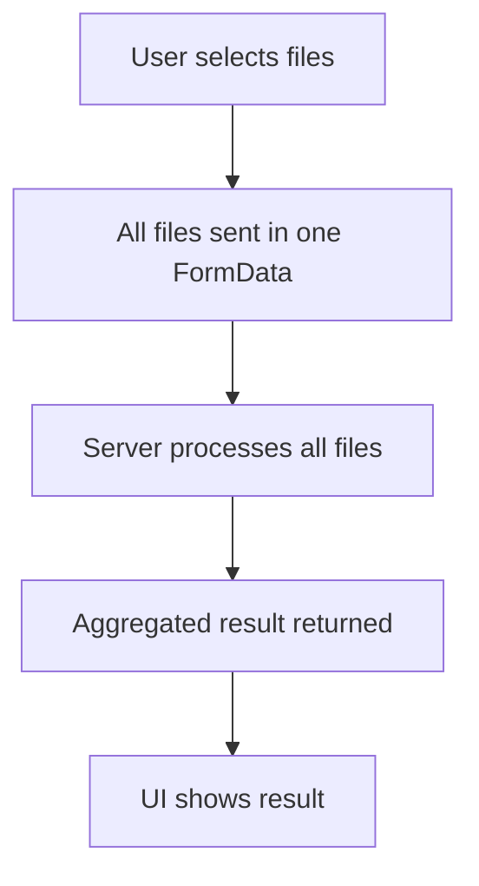

# Flow Overview / Tổng quan Luồng

## Current Flow / Luồng Hiện tại


## Proposed Flow / Luồng Đề xuất
```mermaid
flowchart TD
    A[User selects files] --> B[Split files into batches of 5]
    B --> C[For each batch:]
    C --> D[Send FormData (5 files) to server]
    D --> E[Show batch progress]
    E --> F[If batch fails, show error]
    F --> G[Continue with next batch]
    G --> H[After all batches, aggregate results]
    H --> I[UI shows summary]
```

## Changes Highlighted / Thay đổi Nổi bật
- Added: Client-side batching logic (max 5 files/batch)
- Modified: UploadArea now sends multiple requests sequentially
- Added: Batch progress and error handling per batch
- Added: Aggregated summary after all batches
