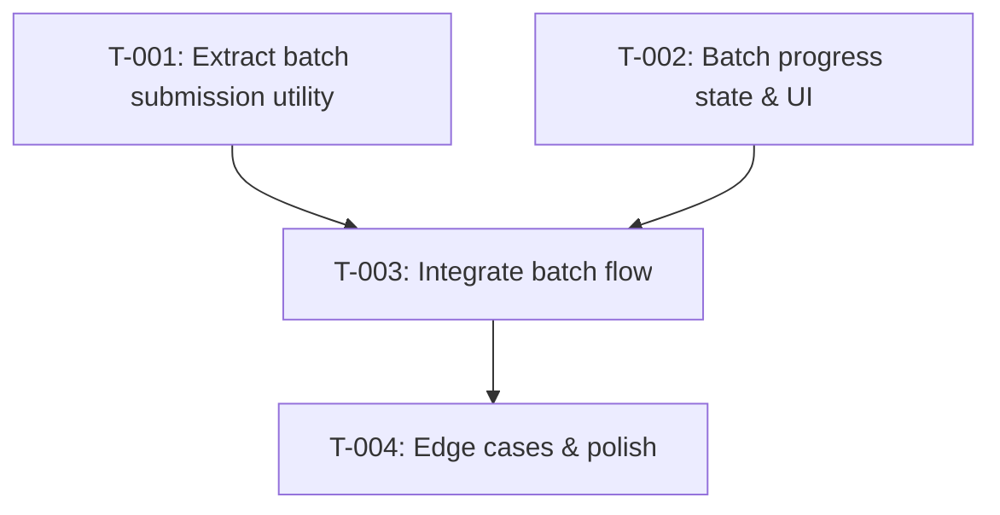

# Task Plan: Batch Upload Processing — Client-Side Chunking
# Kế hoạch Task: Xử lý Upload theo Batch — Chia chunk phía Client

## 📋 TL;DR

| Aspect | Value |
|--------|-------|
| Feature | Batch Upload Processing — Client-Side Chunking |
| Total Tasks | 4 |
| Estimated Effort | ~4 hours |
| Affected Roots | sgs-cs-hepper |
| Spec Reference | [spec.md](../01_spec/spec.md) |
| Dev Mode | standard |

---

## ⚠️ Architecture Clarification

Based on codebase research, the current upload flow is:
1. **File selection** → client state
2. **Client-side parsing** → `xlsx.js` parses all files into `ParsedOrderData[]`
3. **Preview & edit** → user reviews parsed orders
4. **Batch submission** → ALL parsed orders sent in **one** `submitOrdersBatch()` server action call (single Prisma transaction, 10s timeout)
5. **Results** → show created/updated/unchanged/failed

**Batching applies at Step 4** — splitting parsed orders into chunks before calling `submitOrdersBatch()`, NOT at the file selection or parsing stage. Each batch = a separate server action call with up to N orders (derived from max 5 files worth of orders).

---

## Task Overview / Tổng quan Task

| ID | Title | Root | Deps | Est | Status |
|----|-------|------|------|-----|--------|
| T-001 | Extract batch submission utility | sgs-cs-hepper | - | M | ⬜ |
| T-002 | Add batch progress state & UI | sgs-cs-hepper | T-001 | M | ⬜ |
| T-003 | Integrate batch flow into UploadArea | sgs-cs-hepper | T-001, T-002 | M | ⬜ |
| T-004 | Handle edge cases & polish | sgs-cs-hepper | T-003 | S | ⬜ |

---

## Dependency Graph / Đồ thị Phụ thuộc

---

## 3.5 Parallel Execution Notes / Ghi chú Thực thi Song song

| Group | Tasks | Reason |
|-------|-------|--------|
| A | T-001, T-002 | No dependency between them, different concerns (logic vs UI state) |

| Sequential Constraint | Reason |
|----------------------|--------|
| T-001 → T-003 | T-003 uses the batch utility from T-001 |
| T-002 → T-003 | T-003 uses the progress state from T-002 |
| T-003 → T-004 | T-004 polishes the integrated flow from T-003 |

---

## Tasks by Root / Task theo Root

### Root: sgs-cs-hepper

---

#### T-001: Extract batch submission utility

| Aspect | Detail |
|--------|--------|
| Root | sgs-cs-hepper |
| Dependencies | None |
| Estimate | M (1–1.5 hours) |
| Requirements | FR-001 (AC1, AC2, AC3) |

**Description / Mô tả:**
- **EN:** Create a utility function `submitOrdersInBatches()` that takes an array of `OrderInput` items and a batch size (default 5 files worth), splits them into chunks, calls `submitOrdersBatch()` sequentially for each chunk, collects per-batch results (including errors), and returns an aggregated `BatchUploadResult`. The function accepts an `onBatchProgress` callback for progress reporting.
- **VI:** Tạo hàm tiện ích `submitOrdersInBatches()` nhận mảng `OrderInput`, chia thành chunk, gọi `submitOrdersBatch()` tuần tự cho mỗi chunk, thu thập kết quả (kể cả lỗi), trả về `BatchUploadResult` tổng hợp. Hàm nhận callback `onBatchProgress` để báo cáo tiến độ.

**Files to Change / File Thay đổi:**
- Create: `src/lib/upload/batch-upload.ts`
- Create: `src/types/batch-upload.ts`

**Done Criteria / Tiêu chí Hoàn thành:**
- [ ] `chunkArray()` helper splits arrays correctly (including remainder)
- [ ] `submitOrdersInBatches()` calls server action per chunk sequentially
- [ ] If a batch fails (throws), error is captured and next batch continues
- [ ] `onBatchProgress` callback is invoked after each batch with `{ current, total, batchResult }`
- [ ] Aggregated result merges created/updated/unchanged/failed from all batches
- [ ] Types are well-defined: `BatchUploadResult`, `BatchProgressInfo`

**Verification / Kiểm tra:**
- Unit test: `chunkArray()` with various sizes
- Unit test: `submitOrdersInBatches()` with mock server action
- TypeScript compiles without errors

---

#### T-002: Add batch progress state & UI

| Aspect | Detail |
|--------|--------|
| Root | sgs-cs-hepper |
| Dependencies | None |
| Estimate | M (1 hour) |
| Requirements | FR-002 (AC4, AC5, AC6) |

**Description / Mô tả:**
- **EN:** Add batch progress state to the UploadArea component: `batchProgress` (current batch, total batches). Update the "submitting" step UI to show batch progress (e.g., "Processing batch 2/4..."). Ensure the existing result display can handle aggregated batch results.
- **VI:** Thêm state tiến độ batch vào UploadArea: `batchProgress` (batch hiện tại, tổng batch). Cập nhật UI bước "submitting" hiển thị tiến độ batch (vd: "Đang xử lý batch 2/4..."). Đảm bảo hiển thị kết quả hoạt động với kết quả batch tổng hợp.

**Files to Change / File Thay đổi:**
- Modify: `src/components/upload/upload-area.tsx` (add state, update submitting UI)

**Done Criteria / Tiêu chí Hoàn thành:**
- [ ] `batchProgress` state added: `{ current: number; total: number } | null`
- [ ] Submitting step shows "Processing batch X/Y..." when `batchProgress` is set
- [ ] Progress resets when upload completes or user starts new upload
- [ ] UI remains responsive (no blocking render)

**Verification / Kiểm tra:**
- Visual: progress text appears during submission
- State resets correctly on new upload

---

#### T-003: Integrate batch flow into UploadArea

| Aspect | Detail |
|--------|--------|
| Root | sgs-cs-hepper |
| Dependencies | T-001, T-002 |
| Estimate | M (1–1.5 hours) |
| Requirements | FR-001 (AC1, AC2, AC3), FR-002 (AC4, AC5, AC6) |

**Description / Mô tả:**
- **EN:** Replace the current single `submitOrdersBatch()` call in UploadArea's submit handler with `submitOrdersInBatches()` from T-001. Wire the `onBatchProgress` callback to update the `batchProgress` state from T-002. Map the aggregated `BatchUploadResult` to the existing `UploadResult` format for the results step.
- **VI:** Thay thế lời gọi `submitOrdersBatch()` đơn trong handler submit của UploadArea bằng `submitOrdersInBatches()` từ T-001. Kết nối callback `onBatchProgress` với state `batchProgress` từ T-002. Map `BatchUploadResult` tổng hợp sang format `UploadResult` hiện tại cho bước kết quả.

**Files to Change / File Thay đổi:**
- Modify: `src/components/upload/upload-area.tsx` (submit handler, imports, result mapping)

**Done Criteria / Tiêu chí Hoàn thành:**
- [ ] Submit handler uses `submitOrdersInBatches()` instead of direct `submitOrdersBatch()`
- [ ] Progress callback updates `batchProgress` state in real-time
- [ ] Aggregated result maps correctly to existing `UploadResult`
- [ ] Results step shows combined created/updated/unchanged/failed from all batches
- [ ] ≤5 files → single batch (no regression for small uploads)

**Verification / Kiểm tra:**
- Manual test: upload 3 files → 1 batch, works as before
- Manual test: upload 8 files → 2 batches, progress shown, results aggregated
- Manual test: upload 15 files → 3 batches, progress increments correctly

---

#### T-004: Handle edge cases & polish

| Aspect | Detail |
|--------|--------|
| Root | sgs-cs-hepper |
| Dependencies | T-003 |
| Estimate | S (30–45 min) |
| Requirements | FR-001 (AC3), FR-002 (AC5, AC6), Edge Cases |

**Description / Mô tả:**
- **EN:** Handle edge cases: 0 files (no-op), 1 file, exactly 5 files, batch failure mid-way. Ensure partial errors show correctly in results. Polish progress messages and summary text. Verify UI responsiveness with `startTransition` or similar if needed.
- **VI:** Xử lý edge case: 0 file (không làm gì), 1 file, đúng 5 file, batch lỗi giữa chừng. Đảm bảo lỗi từng phần hiển thị đúng. Polish message tiến độ và tổng kết. Kiểm tra UI responsive với `startTransition` nếu cần.

**Files to Change / File Thay đổi:**
- Modify: `src/lib/upload/batch-upload.ts` (edge case guards)
- Modify: `src/components/upload/upload-area.tsx` (polish UI messages)

**Done Criteria / Tiêu chí Hoàn thành:**
- [ ] 0 orders → graceful no-op with appropriate message
- [ ] 1 order → works correctly (single batch)
- [ ] Exactly 5 orders → single batch, no unnecessary chunking
- [ ] Mid-way batch failure → error captured, remaining batches continue, partial results shown
- [ ] Summary text is clear and bilingual-ready

**Verification / Kiểm tra:**
- Manual test each edge case scenario
- Verify error display for partial failures

---

## Sync Points / Điểm Đồng bộ

N/A — single root, no cross-root sync needed.

---

## Risk Assessment / Đánh giá Rủi ro

| Task | Risk | Mitigation |
|------|------|------------|
| T-001 | Batch size based on file count vs order count ambiguity | Clarify: chunk by order count, derived from max 5 files |
| T-003 | Result mapping mismatch | Map carefully from `BatchUploadResult` to existing `UploadResult` |
| T-004 | Edge case with very large file sets | Test with 20+ files to verify |

---

## Requirements Coverage / Độ phủ Yêu cầu

| Requirement | Tasks | Covered |
|-------------|-------|---------|
| FR-001 (AC1: batching) | T-001, T-003 | ✅ |
| FR-001 (AC2: separate requests) | T-001, T-003 | ✅ |
| FR-001 (AC3: error per batch) | T-001, T-004 | ✅ |
| FR-002 (AC4: progress) | T-002, T-003 | ✅ |
| FR-002 (AC5: aggregated summary) | T-001, T-003 | ✅ |
| FR-002 (AC6: responsive UI) | T-002, T-004 | ✅ |
| NFR-001 (Performance) | T-001, T-004 | ✅ |
| NFR-002 (Security) | T-001 | ✅ |
| NFR-003 (Scalability) | T-001, T-004 | ✅ |
| NFR-004 (Maintainability) | T-001, T-002 | ✅ |
| NFR-005 (Compatibility) | All | ✅ |

All requirements covered ✅

---

## 7. Test Plan / Kế hoạch Test

### 7.1 Test Strategy / Chiến lược Test

| Type | Scope | Coverage Target |
|------|-------|-----------------|
| Unit | `chunkArray`, `submitOrdersInBatches` | 90%+ |
| Integration | Full submit flow in UploadArea | Manual verification |

**Mocking Boundaries:**
- Mock `submitOrdersBatch` server action in unit tests
- No E2E tests needed (client-side only change)

### 7.2 Test Cases by Task / Test Case theo Task

| TC ID | Task | Test Description | Type | Expected Result |
|-------|------|------------------|------|-----------------|
| TC-001 | T-001 | `chunkArray` splits [1..12] into chunks of 5 → [[1..5],[6..10],[11,12]] | Unit | 3 chunks, correct items |
| TC-002 | T-001 | `chunkArray` with empty array → [] | Unit | Empty result |
| TC-003 | T-001 | `chunkArray` with <5 items → single chunk | Unit | 1 chunk |
| TC-004 | T-001 | `submitOrdersInBatches` calls server action per chunk sequentially | Unit | N calls for N chunks |
| TC-005 | T-001 | `submitOrdersInBatches` aggregates created/updated/unchanged/failed | Unit | Correct totals |
| TC-006 | T-001 | `submitOrdersInBatches` continues on batch error | Unit | Error captured, next batch called |
| TC-007 | T-001 | `onBatchProgress` called with correct current/total | Unit | Callback receives {1,3}, {2,3}, {3,3} |
| TC-008 | T-004 | 0 orders → returns empty result, no server calls | Unit | No calls, empty result |
| TC-009 | T-004 | Exactly 5 orders → 1 batch | Unit | 1 server call |
| TC-010 | T-003 | Full integration: submit 8 orders → 2 batches, results aggregated | Manual | Progress shown, summary correct |
| TC-011 | T-003 | Upload 3 files → single batch, same behavior as before | Manual | No regression |

### 7.3 Edge Cases / Trường hợp Biên

| Edge Case | Test Approach |
|-----------|---------------|
| Empty input (0 orders) | TC-008 |
| Single order | TC-003 path |
| Exact batch boundary (5, 10, 15) | TC-009 variant |
| All batches fail | TC-006 extended |
| Mixed success/failure | TC-005 + TC-006 |

### 7.4 Test Data / Dữ liệu Test

**Fixtures:**
- `mockOrderInput`: Factory function generating N `OrderInput` items
- `mockBatchResult`: Factory function generating `BatchUploadResult` with configurable counts
- `mockServerAction`: Jest/Vitest mock of `submitOrdersBatch` that returns configurable results or throws

**Setup/Teardown:**
- No DB setup needed (pure client-side logic)
- Reset mocks between tests
