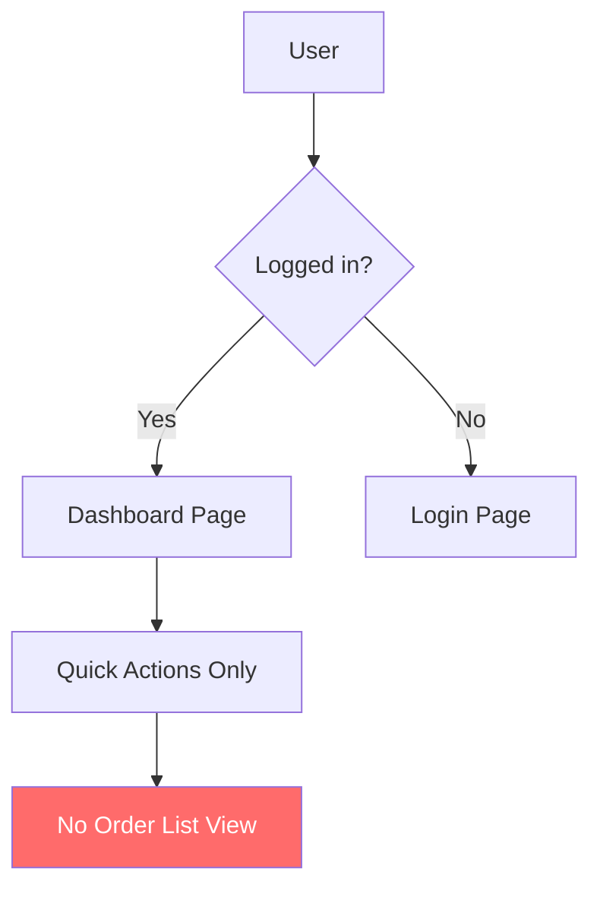
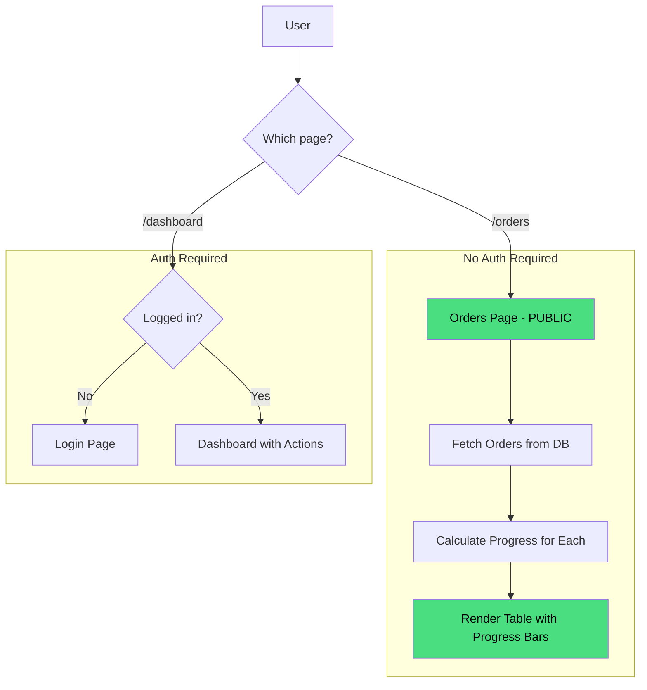
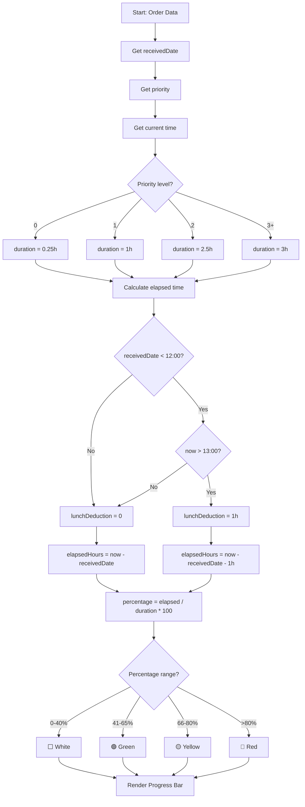

# Flow Overview — Orders List + Progress Bar
<!-- US-1.2.1 | 2026-02-07 -->

## Current Flow / Luồng Hiện tại

**Issue / Vấn đề:**
- 🇻🇳 Không có cách nào xem danh sách orders đã upload
- 🇬🇧 No way to view uploaded orders list

---

## Proposed Flow / Luồng Đề xuất

---

## Progress Calculation Flow / Luồng Tính Progress

---

## Changes Highlighted / Thay đổi Nổi bật

### Added / Thêm mới:
- `/orders` public route (no auth)
- `OrdersTable` component
- `OrderProgressBar` component
- `calculateOrderProgress()` utility
- `getPriorityDuration()` helper
- `getLunchBreakDeduction()` helper

### Modified / Chỉnh sửa:
- `src/lib/actions/order.ts` - Add `getOrders()` function

### Unchanged / Giữ nguyên:
- Dashboard page (auth required)
- Order model
- Existing upload flow
