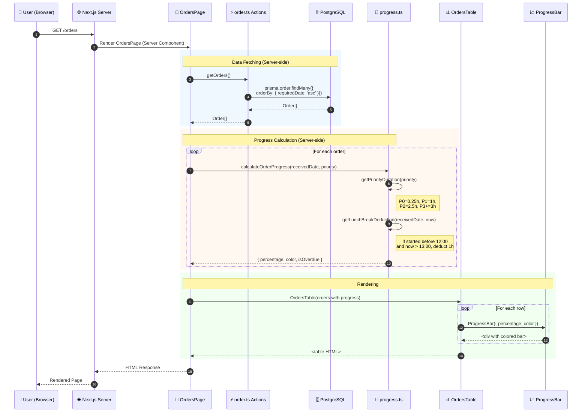
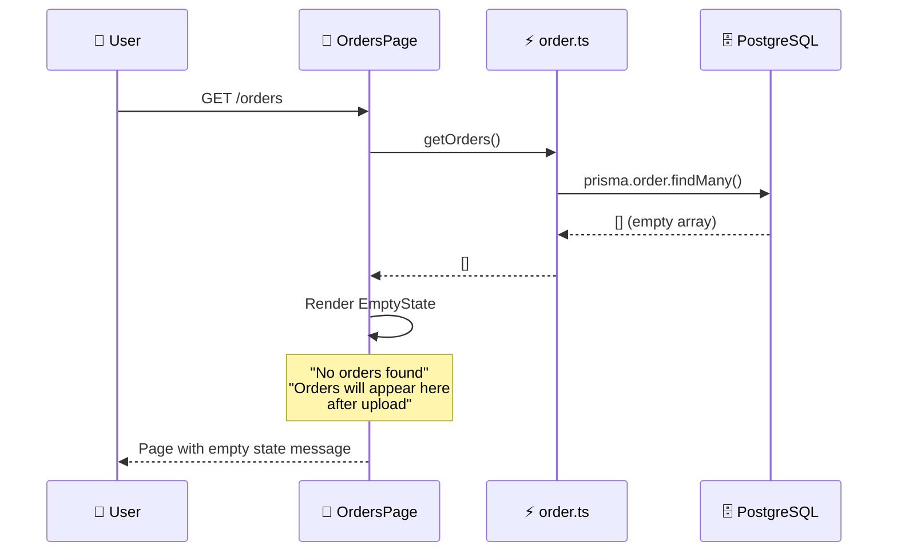
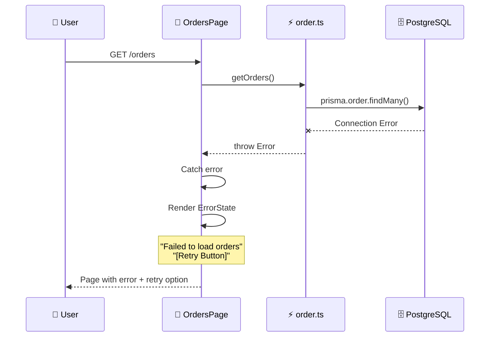

# Sequence Diagram — Orders List Page Load
<!-- US-1.2.1 | 2026-02-07 -->

## Main Sequence / Luồng Chính

---

## Empty State Sequence / Luồng Khi Không Có Data

---

## Error State Sequence / Luồng Khi Có Lỗi

---

## Notes / Ghi chú

1. **No Auth Check**: OrdersPage doesn't check authentication - public access
2. **Server-side Progress**: All progress calculations happen on server for consistency
3. **Sorted by requiredDate**: Most urgent orders appear first
4. **Hydration**: Table is Client Component for potential future interactivity
