# Sequence Diagram — Orders List Page Load
<!-- US-1.2.1 | 2026-02-07 -->

## Main Sequence / Luồng Chính

```mermaid
sequenceDiagram
    autonumber
    participant U as 👤 User (Browser)
    participant N as 🌐 Next.js Server
    participant P as 📄 OrdersPage
    participant A as ⚡ order.ts Actions
    participant DB as 🗄️ PostgreSQL
    participant C as 🧮 progress.ts
    participant T as 📊 OrdersTable
    participant B as 📈 ProgressBar
    
    U->>N: GET /orders
    N->>P: Render OrdersPage (Server Component)
    
    rect rgb(240, 248, 255)
        Note over P,DB: Data Fetching (Server-side)
        P->>A: getOrders()
        A->>DB: prisma.order.findMany({<br/>orderBy: { requiredDate: 'asc' }})
        DB-->>A: Order[]
        A-->>P: Order[]
    end
    
    rect rgb(255, 248, 240)
        Note over P,C: Progress Calculation (Server-side)
        loop For each order
            P->>C: calculateOrderProgress(receivedDate, priority)
            C->>C: getPriorityDuration(priority)
            Note right of C: P0=0.25h, P1=1h,<br/>P2=2.5h, P3+=3h
            C->>C: getLunchBreakDeduction(receivedDate, now)
            Note right of C: If started before 12:00<br/>and now > 13:00, deduct 1h
            C-->>P: { percentage, color, isOverdue }
        end
    end
    
    rect rgb(240, 255, 240)
        Note over P,B: Rendering
        P->>T: OrdersTable(orders with progress)
        loop For each row
            T->>B: ProgressBar({ percentage, color })
            B-->>T: <div with colored bar>
        end
        T-->>P: <table HTML>
    end
    
    P-->>N: HTML Response
    N-->>U: Rendered Page
```

---

## Empty State Sequence / Luồng Khi Không Có Data

---

## Error State Sequence / Luồng Khi Có Lỗi

---

## Notes / Ghi chú

1. **No Auth Check**: OrdersPage doesn't check authentication - public access
2. **Server-side Progress**: All progress calculations happen on server for consistency
3. **Sorted by requiredDate**: Most urgent orders appear first
4. **Hydration**: Table is Client Component for potential future interactivity
