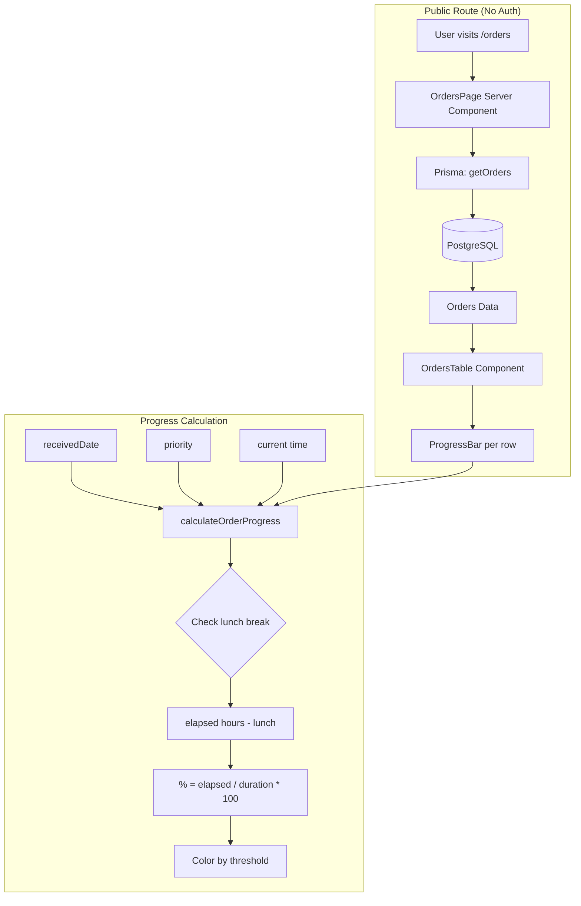
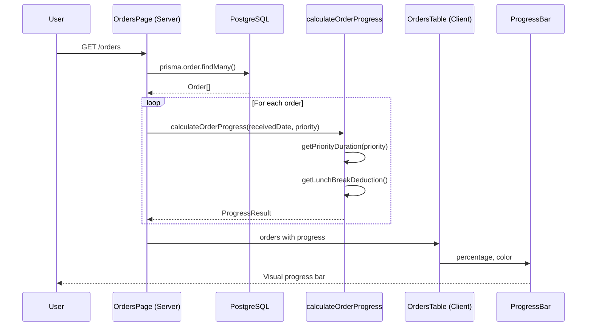

# Analysis & Solution Design — Display Orders List + Progress Bar
<!-- Template Version: 1.0 | Contract: v1.0 | Last Updated: 2026-02-07 -->
<!-- 🇻🇳 Vietnamese first, 🇬🇧 English follows — for easy scanning -->

---

## TL;DR

| Aspect | Value |
|--------|-------|
| Feature | US-1.2.1: Display Orders List + Progress Bar (Public Dashboard) |
| Status | Draft |
| Affected Roots | `sgs-cs-helper` |
| Complexity | Medium |
| Estimated Effort | 1-2 days |

---

## 1. Problem Statement

### Current Behavior

🇻🇳 Hiện tại, sau khi upload Excel và lưu orders vào database, không có cách nào để xem danh sách orders. Dashboard hiện chỉ hiển thị thông tin user đã đăng nhập và các quick actions.

🇬🇧 Currently, after uploading Excel and storing orders in the database, there is no way to view the orders list. The dashboard only shows logged-in user info and quick actions.

### Desired Behavior

🇻🇳 Một trang public dashboard hiển thị tất cả orders dạng bảng với progress bar thời gian. Không cần đăng nhập để xem (read-only), nhưng các actions như đánh dấu hoàn thành vẫn yêu cầu auth.

🇬🇧 A public dashboard page displaying all orders in table format with time progress bars. No login required to view (read-only), but actions like marking complete still require auth.

### Gap Analysis

🇻🇳 
- Thiếu: Trang hiển thị danh sách orders
- Thiếu: Progress bar component với mã màu
- Thiếu: Utility tính progress có xử lý giờ nghỉ trưa
- Thiếu: Public route không yêu cầu auth

🇬🇧
- Missing: Page displaying orders list
- Missing: Progress bar component with color coding
- Missing: Progress calculation utility with lunch break handling
- Missing: Public route not requiring auth

---

## 2. Clarifying Questions

| # | Question | Answer | Status |
|---|----------|--------|--------|
| 1 | Which route for public dashboard? | `/orders` (public) - separate from `/dashboard` (auth) | ✅ Resolved |
| 2 | receivedDate field exists? | ✅ Yes, in Order model | ✅ Resolved |
| 3 | Priority field range? | 0-N (integer), 0 is most urgent | ✅ Resolved |
| 4 | Color scheme confirmed? | ⬜ 0-40%, 🟢 41-65%, 🟡 66-80%, 🔴 >80% | ✅ Resolved |
| 5 | Duration by priority confirmed? | P0=15min, P1=1h, P2=2.5h, P3+=3h | ✅ Resolved |
| 6 | Lunch break rule confirmed? | 12:00-13:00 excluded if started before 12:00 | ✅ Resolved |

---

## 3. Assumptions & Constraints

### Assumptions

🇻🇳
- Orders đã tồn tại trong database từ US-1.1.2/US-1.1.3
- Order model có các fields: jobNumber, registeredDate, receivedDate, requiredDate, priority, status
- Priority là số nguyên, 0 là khẩn cấp nhất
- Timezone là server timezone (Vietnam Time)

🇬🇧
- Orders already exist in database from US-1.1.2/US-1.1.3
- Order model has fields: jobNumber, registeredDate, receivedDate, requiredDate, priority, status
- Priority is integer, 0 is most urgent
- Timezone is server timezone (Vietnam Time)

### Constraints

🇻🇳
- Sử dụng Next.js Server Components cho initial data fetch
- Sử dụng Prisma ORM cho database queries
- Không có authentication middleware trên route này (public access)
- Hiệu suất: < 2 giây cho 100 orders

🇬🇧
- Use Next.js Server Components for initial data fetch
- Use Prisma ORM for database queries
- No authentication middleware on this route (public access)
- Performance: < 2 seconds for 100 orders

---

## 4. Existing Patterns Found

| Location | Pattern | Reusable |
|----------|---------|----------|
| `src/app/(dashboard)/page.tsx` | Server Component with layout | Partial (need public version) |
| `src/components/orders/order-preview.tsx` | List item with expand/collapse | Partial (table instead) |
| `src/lib/actions/order.ts` | Prisma order queries | Yes (add findMany) |
| `src/lib/db/index.ts` | Prisma client singleton | Yes |
| `components.json` | shadcn/ui config | Yes (add Table, Progress) |

---

## 5. Solution Options

### Option A: Server Components Only (Chosen)

🇻🇳 Sử dụng Next.js Server Components để fetch data và render table. Progress được tính mỗi lần page load. Đơn giản, nhanh, SEO-friendly.

🇬🇧 Use Next.js Server Components to fetch data and render table. Progress calculated on each page load. Simple, fast, SEO-friendly.

**Pros:**
- No client-side JavaScript for data fetching
- Fast initial load
- SEO-friendly (public page)
- Simple architecture

**Cons:**
- Progress doesn't update in real-time (need refresh)
- No interactivity without Client Components

### Option B: Client-Side with SWR

🇻🇳 Sử dụng SWR để fetch data client-side với auto-refresh mỗi 30 giây.

🇬🇧 Use SWR to fetch data client-side with auto-refresh every 30 seconds.

**Pros:**
- Progress updates automatically
- More dynamic feel

**Cons:**
- More complex
- SEO concerns (public page needs content)
- Over-engineering for this use case

### Comparison Matrix

| Aspect | Option A | Option B |
|--------|----------|----------|
| Description | Server Components | SWR Client-side |
| Effort | Low | Medium |
| Risk | Low | Low |
| Maintainability | High | Medium |
| SEO | ✅ Excellent | ⚠️ Needs SSR |

### Chosen Solution

**Decision:** `Option A - Server Components Only`

🇻🇳 Chọn Option A vì đây là trang public cần SEO tốt, và việc progress không cập nhật real-time là chấp nhận được (user có thể refresh). Đơn giản hóa architecture trong phase đầu, có thể thêm SWR sau nếu cần.

🇬🇧 Chose Option A because this is a public page needing good SEO, and progress not updating real-time is acceptable (user can refresh). Simplify architecture in first phase, can add SWR later if needed.

---

## 6. Solution Overview

🇻🇳 
Tạo một public route `/orders` với Server Component fetch orders từ database và render dạng bảng. Mỗi row có Progress Bar component hiển thị % thời gian đã qua với mã màu. Utility function `calculateOrderProgress()` xử lý logic tính toán bao gồm priority-based duration và lunch break exclusion.

Component structure:
- **Page** (`/orders/page.tsx`): Server Component fetch data, render table
- **OrdersTable**: Table component hiển thị list orders
- **ProgressBar**: Client Component hiển thị progress với mã màu
- **Utils** (`progress.ts`): Hàm tính progress

🇬🇧
Create a public route `/orders` with Server Component fetching orders from database and rendering as table. Each row has a Progress Bar component showing % time elapsed with color coding. Utility function `calculateOrderProgress()` handles calculation logic including priority-based duration and lunch break exclusion.

Component structure:
- **Page** (`/orders/page.tsx`): Server Component to fetch data, render table
- **OrdersTable**: Table component to display orders list
- **ProgressBar**: Client Component to display progress with color coding
- **Utils** (`progress.ts`): Progress calculation function

### Architecture Diagram



---

## 7. Components

| Component | Root | Type | Description |
|-----------|------|------|-------------|
| `OrdersPage` | sgs-cs-helper | New | Server Component - Public orders list page |
| `OrdersTable` | sgs-cs-helper | New | Table component displaying orders |
| `OrderProgressBar` | sgs-cs-helper | New | Client Component - Visual progress bar |
| `calculateOrderProgress` | sgs-cs-helper | New | Utility function for progress calculation |
| `getPriorityDuration` | sgs-cs-helper | New | Helper to get duration by priority |
| `getOrders` | sgs-cs-helper | New | Prisma query function |

### Component Details

#### `OrdersPage` (`src/app/(orders)/orders/page.tsx`)

🇻🇳 Server Component làm entry point cho public orders list. Fetch orders từ DB, pass xuống OrdersTable. Không yêu cầu authentication.

🇬🇧 Server Component as entry point for public orders list. Fetches orders from DB, passes to OrdersTable. No authentication required.

**Interface:**
```typescript
// No props - fetches data internally
export default async function OrdersPage()
```

#### `OrdersTable` (`src/components/orders/orders-table.tsx`)

🇻🇳 Client Component render bảng orders với columns: Job Number, Registered Date, Required Date, Priority, Status, Progress. Sử dụng shadcn/ui Table component.

🇬🇧 Client Component rendering orders table with columns: Job Number, Registered Date, Required Date, Priority, Status, Progress. Uses shadcn/ui Table component.

**Interface:**
```typescript
interface OrdersTableProps {
  orders: OrderWithProgress[];
}

interface OrderWithProgress {
  id: string;
  jobNumber: string;
  registeredDate: Date;
  receivedDate: Date;
  requiredDate: Date;
  priority: number;
  status: OrderStatus;
  progress: ProgressInfo;
}

interface ProgressInfo {
  percentage: number;
  color: 'white' | 'green' | 'yellow' | 'red';
  isOverdue: boolean;
}
```

#### `OrderProgressBar` (`src/components/orders/order-progress-bar.tsx`)

🇻🇳 Client Component hiển thị visual progress bar. Nhận percentage và color, render bar với width và background color tương ứng.

🇬🇧 Client Component displaying visual progress bar. Receives percentage and color, renders bar with corresponding width and background color.

**Interface:**
```typescript
interface OrderProgressBarProps {
  percentage: number;
  color: 'white' | 'green' | 'yellow' | 'red';
  isOverdue: boolean;
}
```

#### `calculateOrderProgress` (`src/lib/utils/progress.ts`)

🇻🇳 Pure function tính toán progress dựa trên receivedDate, priority, và current time. Xử lý lunch break exclusion.

🇬🇧 Pure function calculating progress based on receivedDate, priority, and current time. Handles lunch break exclusion.

**Interface:**
```typescript
interface ProgressResult {
  percentage: number;
  color: 'white' | 'green' | 'yellow' | 'red';
  isOverdue: boolean;
  elapsedHours: number;
  totalHours: number;
}

function calculateOrderProgress(
  receivedDate: Date,
  priority: number,
  now?: Date
): ProgressResult

function getPriorityDuration(priority: number): number
// Returns hours: P0=0.25, P1=1, P2=2.5, P3+=3

function getLunchBreakDeduction(
  receivedDate: Date,
  now: Date
): number
// Returns 1 if lunch should be excluded, else 0
```

---

## 8. Data Flow

| Step | Action | From | To |
|------|--------|------|-----|
| 1 | User visits /orders | Browser | Next.js Server |
| 2 | Fetch orders with Prisma | OrdersPage | PostgreSQL |
| 3 | Calculate progress for each order | Server | calculateOrderProgress util |
| 4 | Render table with progress bars | OrdersTable | Browser |
| 5 | Display color-coded progress | OrderProgressBar | User |

### Sequence Diagram



---

## 9. Cross-Root Impact

| Root | Change Type | Sync Required |
|------|-------------|---------------|
| `sgs-cs-helper` | Code | N/A (single root) |
| `a-z-copilot-flow` | None | No |

### Integration Points

🇻🇳 Không có integration cross-root. Tất cả changes nằm trong sgs-cs-helper.

🇬🇧 No cross-root integration. All changes within sgs-cs-helper.

---

## 10. Dependencies

| Package | Version | Status | Notes |
|---------|---------|--------|-------|
| `@radix-ui/react-progress` | latest | New | For shadcn/ui Progress component |
| `date-fns` | existing | Existing | For date calculations |

**shadcn/ui Components needed:**
- `Table` (new)
- `Progress` (new)
- `Skeleton` (for loading state)

---

## 11. Risks & Mitigations

| Risk | Likelihood | Impact | Mitigation |
|------|------------|--------|------------|
| Timezone issues in progress calculation | Medium | Medium | Use server timezone consistently, document assumption |
| Performance with many orders | Low | Medium | Add index on status, limit to 100 orders initially |
| Progress bar not updating real-time | Low | Low | Document that refresh is needed, add refresh button |

### Risk Details

#### Risk 1: Timezone Handling

🇻🇳 
**Bối cảnh:** Progress calculation dựa trên thời gian hiện tại so với receivedDate. Timezone mismatch có thể gây tính sai.
**Giảm thiểu:** Sử dụng server timezone (UTC+7) cho tất cả calculations. Document rõ trong code.

🇬🇧
**Context:** Progress calculation based on current time vs receivedDate. Timezone mismatch could cause incorrect calculation.
**Mitigation:** Use server timezone (UTC+7) for all calculations. Document clearly in code.

---

## 12. Decision Log

| ID | Date | Decision | Rationale |
|----|------|----------|-----------|
| D-001 | 2026-02-07 | Merge US-1.2.2 into US-1.2.1 | Progress bar is integral part of orders list |
| D-002 | 2026-02-07 | Public read-only access | All users should see order progress |
| D-003 | 2026-02-07 | Color scheme: ⬜ 0-40%, 🟢 41-65%, 🟡 66-80%, 🔴 >80% | User-defined thresholds |
| D-004 | 2026-02-07 | Use receivedDate for progress start | More accurate than registeredDate |
| D-005 | 2026-02-07 | Design extensible for order types | Future admin config capability |
| D-006 | 2026-02-07 | Exclude lunch 12:00-13:00 | Staff not working during lunch |
| D-007 | 2026-02-07 | Duration by Priority: P0=15m, P1=1h, P2=2.5h, P3+=3h | Higher priority = shorter deadline |
| D-008 | 2026-02-07 | Server Components for public page | SEO-friendly, simple architecture |
| D-009 | 2026-02-07 | Route: /orders (public) | Separate from /dashboard (auth required) |

---

## 13. File Structure

```
src/
├── app/
│   └── (orders)/
│       └── orders/
│           ├── page.tsx           # Public orders list page
│           └── loading.tsx        # Loading skeleton
├── components/
│   └── orders/
│       ├── orders-table.tsx       # Table component
│       └── order-progress-bar.tsx # Progress bar component
├── lib/
│   ├── actions/
│   │   └── order.ts               # Add getOrders function
│   └── utils/
│       └── progress.ts            # Progress calculation utilities
```

---

## 14. Notes & Concerns

🇻🇳
- Cần thêm shadcn/ui Table và Progress components
- Progress calculation cần unit tests kỹ vì logic phức tạp (lunch break, priority)
- Tương lai có thể cần SWR để auto-refresh progress
- Pagination sẽ cần thiết khi có nhiều orders (out of scope cho US này)

🇬🇧
- Need to add shadcn/ui Table and Progress components
- Progress calculation needs thorough unit tests due to complex logic (lunch break, priority)
- Future may need SWR for auto-refresh progress
- Pagination will be needed with many orders (out of scope for this US)

---

## Approval

| Role | Name | Status | Date |
|------|------|--------|------|
| Author | Copilot | ✅ Done | 2026-02-07 |
| Reviewer | User | ⏳ Pending | |

---

## Next Step

🇻🇳 Sau khi phê duyệt, tiến hành **Phase 1: Specification**.

🇬🇧 After approval, proceed to **Phase 1: Specification**.

Reply: `approved` or `revise: <feedback>`
