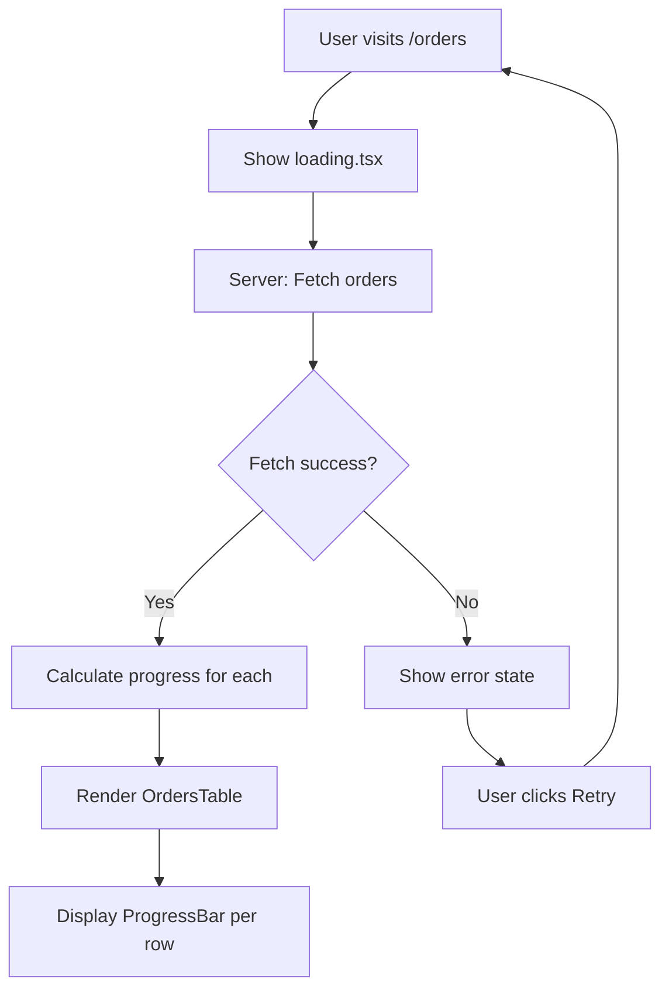

# Specification — Display Orders List + Progress Bar
<!-- Template Version: 1.0 | Contract: v1.0 | US-1.2.1 | 2026-02-07 -->
<!-- 🇻🇳 Vietnamese first, 🇬🇧 English follows — for easy scanning -->

---

## TL;DR

| Aspect | Value |
|--------|-------|
| Feature | US-1.2.1: Display Orders List + Progress Bar (Public Dashboard) |
| Status | Draft |
| Functional Requirements | 7 |
| Non-Functional Requirements | 3 |
| Affected Roots | `sgs-cs-helper` |
| Phase 0 Analysis | [Solution Design](../00_analysis/solution-design.md) |

---

## 1. Overview

🇻🇳 Tính năng này cung cấp trang dashboard công khai tại `/orders` hiển thị tất cả orders dạng bảng với progress bars. Users có thể xem trạng thái orders mà không cần đăng nhập. Progress bar hiển thị thời gian đã trôi qua với mã màu dựa trên priority của order.

🇬🇧 This feature provides a public dashboard page at `/orders` displaying all orders in table format with progress bars. Users can view order status without logging in. Progress bar shows elapsed time with color coding based on order priority.

---

## 2. Goals & Non-Goals

### Goals

🇻🇳
1. **Hiển thị orders**: Cung cấp cái nhìn tổng quan về tất cả orders trong hệ thống
2. **Progress tracking**: Hiển thị trực quan mức độ khẩn cấp của mỗi order qua progress bar
3. **Public access**: Cho phép tất cả stakeholders xem mà không cần đăng nhập
4. **Priority-aware**: Thời gian deadline tự động điều chỉnh theo priority

🇬🇧
1. **Display orders**: Provide overview of all orders in the system
2. **Progress tracking**: Visually show urgency of each order via progress bar
3. **Public access**: Allow all stakeholders to view without login
4. **Priority-aware**: Deadline duration automatically adjusts based on priority

### Non-Goals

🇻🇳
1. Mã màu theo Priority (US-1.2.3)
2. Lọc orders theo status (US-1.2.4)
3. UI sắp xếp tùy chọn (US-1.2.5)
4. Đánh dấu order hoàn thành (US-1.3.1)
5. Cập nhật real-time qua WebSocket
6. Phân trang (sẽ xem xét trong tương lai nếu cần)

🇬🇧
1. Priority color coding (US-1.2.3)
2. Filtering orders by status (US-1.2.4)
3. Sorting options UI (US-1.2.5)
4. Mark order as done (US-1.3.1)
5. Real-time WebSocket updates
6. Pagination (future consideration if needed)

---

## 3. User Stories

### US-001: View Orders List

🇻🇳 Là **một stakeholder bất kỳ**, tôi muốn **xem danh sách tất cả orders hiện tại**, để **theo dõi tiến độ xử lý**.

🇬🇧 As **any stakeholder**, I want **to view a list of all current orders**, so that **I can monitor processing progress**.

### US-002: See Progress Urgency

🇻🇳 Là **nhân viên CS**, tôi muốn **xem progress bar với mã màu cho mỗi order**, để **biết ngay order nào cần ưu tiên xử lý**.

🇬🇧 As **a CS staff member**, I want **to see color-coded progress bars for each order**, so that **I immediately know which orders need priority attention**.

### US-003: Access Without Login

🇻🇳 Là **khách hàng hoặc quản lý**, tôi muốn **xem trạng thái orders mà không cần đăng nhập**, để **theo dõi nhanh mà không cần tài khoản**.

🇬🇧 As **a customer or manager**, I want **to view order status without logging in**, so that **I can quickly check without needing an account**.

---

## 4. Requirements Matrix

| ID | Title | Priority | Type | Covered By |
|----|-------|----------|------|------------|
| FR-001 | Public Orders Page | Must | Functional | TC-001 |
| FR-002 | Orders Table Display | Must | Functional | TC-002 |
| FR-003 | Progress Bar Component | Must | Functional | TC-003 |
| FR-004 | Progress Calculation | Must | Functional | TC-004 |
| FR-005 | Priority-Based Duration | Must | Functional | TC-005 |
| FR-006 | Lunch Break Exclusion | Must | Functional | TC-006 |
| FR-007 | Loading & Error States | Should | Functional | TC-007 |
| NFR-001 | Page Load Performance | Must | Performance | TC-P01 |
| NFR-002 | SEO Accessibility | Should | Accessibility | TC-A01 |
| NFR-003 | Code Extensibility | Should | Maintainability | - |

---

## 5. Functional Requirements

### FR-001: Public Orders Page

| Aspect | Detail |
|--------|--------|
| Priority | Must |
| Affected Roots | `sgs-cs-helper` |

#### Description

🇻🇳 Tạo route `/orders` là public page (không yêu cầu authentication). Page này hiển thị danh sách tất cả orders trong hệ thống. Route này tách biệt khỏi `/dashboard` (yêu cầu auth).

🇬🇧 Create route `/orders` as a public page (no authentication required). This page displays a list of all orders in the system. This route is separate from `/dashboard` (auth required).

#### Acceptance Criteria

- [ ] AC1: Route `/orders` accessible without login
- [ ] AC2: Page renders as Server Component
- [ ] AC3: No authentication middleware applied to this route
- [ ] AC4: Page has proper meta tags for SEO

---

### FR-002: Orders Table Display

| Aspect | Detail |
|--------|--------|
| Priority | Must |
| Affected Roots | `sgs-cs-helper` |

#### Description

🇻🇳 Hiển thị orders trong bảng với các cột: Job Number, Registered Date, Required Date, Priority, Status, và Progress. Orders được sắp xếp theo Required Date (sớm nhất trước). Hiển thị empty state khi không có orders.

🇬🇧 Display orders in a table with columns: Job Number, Registered Date, Required Date, Priority, Status, and Progress. Orders sorted by Required Date (soonest first). Show empty state when no orders.

#### Acceptance Criteria

- [ ] AC1: Table displays columns: Job Number, Registered Date, Required Date, Priority, Status, Progress
- [ ] AC2: Orders sorted by Required Date ascending (soonest first)
- [ ] AC3: Empty state message shown when no orders exist
- [ ] AC4: Dates formatted in Vietnamese locale (dd/MM/yyyy HH:mm)
- [ ] AC5: Table uses shadcn/ui Table component

---

### FR-003: Progress Bar Component

| Aspect | Detail |
|--------|--------|
| Priority | Must |
| Affected Roots | `sgs-cs-helper` |

#### Description

🇻🇳 Component progress bar trực quan hiển thị phần trăm thời gian đã trôi qua. Bar có chiều rộng tương ứng với percentage và màu nền theo ngưỡng đã định. Số percentage hiển thị cạnh bar.

🇬🇧 Visual progress bar component showing percentage of time elapsed. Bar width corresponds to percentage with background color based on defined thresholds. Percentage number displayed alongside bar.

#### Acceptance Criteria

- [ ] AC1: Progress bar width = min(percentage, 100)%
- [ ] AC2: Color coding: ⬜ White 0-40%, 🟢 Green 41-65%, 🟡 Yellow 66-80%, 🔴 Red >80%
- [ ] AC3: Percentage number displayed next to bar (e.g., "75%")
- [ ] AC4: Overdue orders (>100%) show "100%+" with red indicator
- [ ] AC5: Bar has smooth appearance with rounded corners

---

### FR-004: Progress Calculation

| Aspect | Detail |
|--------|--------|
| Priority | Must |
| Affected Roots | `sgs-cs-helper` |

#### Description

🇻🇳 Hàm utility tính toán progress dựa trên `receivedDate`, `priority`, và thời gian hiện tại. Công thức: `progress = (elapsedHours / durationHours) * 100`. Cần xử lý edge cases như dates trong tương lai.

🇬🇧 Utility function calculating progress based on `receivedDate`, `priority`, and current time. Formula: `progress = (elapsedHours / durationHours) * 100`. Handle edge cases like future dates.

#### Acceptance Criteria

- [ ] AC1: Function `calculateOrderProgress(receivedDate, priority, now?)` exists
- [ ] AC2: Returns object: `{ percentage, color, isOverdue, elapsedHours, totalHours }`
- [ ] AC3: Handles future receivedDate gracefully (returns 0%)
- [ ] AC4: Pure function (no side effects, deterministic with same inputs)

---

### FR-005: Priority-Based Duration

| Aspect | Detail |
|--------|--------|
| Priority | Must |
| Affected Roots | `sgs-cs-helper` |

#### Description

🇻🇳 Duration để tính progress phụ thuộc vào priority của order:
- Priority 0: 15 phút (0.25h) - Khẩn cấp
- Priority 1: 1 tiếng - Cao
- Priority 2: 2.5 tiếng - Trung bình
- Priority >= 3: 3 tiếng - Bình thường

🇬🇧 Duration for progress calculation depends on order priority:
- Priority 0: 15 minutes (0.25h) - Urgent
- Priority 1: 1 hour - High
- Priority 2: 2.5 hours - Medium
- Priority >= 3: 3 hours - Normal

#### Acceptance Criteria

- [ ] AC1: Function `getPriorityDuration(priority)` returns correct hours
- [ ] AC2: Priority 0 → 0.25 hours (15 minutes)
- [ ] AC3: Priority 1 → 1 hour
- [ ] AC4: Priority 2 → 2.5 hours
- [ ] AC5: Priority >= 3 → 3 hours
- [ ] AC6: Negative priority treated as Priority 0

---

### FR-006: Lunch Break Exclusion

| Aspect | Detail |
|--------|--------|
| Priority | Must |
| Affected Roots | `sgs-cs-helper` |

#### Description

🇻🇳 Nếu order được nhận trước 12:00 và thời gian hiện tại sau 13:00, trừ 1 tiếng từ elapsed time (giờ nghỉ trưa 12:00-13:00). Điều này đảm bảo tính công bằng vì nhân viên không làm việc trong giờ nghỉ.

🇬🇧 If order was received before 12:00 and current time is after 13:00, deduct 1 hour from elapsed time (lunch break 12:00-13:00). This ensures fairness since staff don't work during lunch.

#### Acceptance Criteria

- [ ] AC1: Function `getLunchBreakDeduction(receivedDate, now)` returns 0 or 1
- [ ] AC2: Returns 1 hour if: receivedDate.hour < 12 AND now.hour >= 13
- [ ] AC3: Returns 0 otherwise
- [ ] AC4: Handles edge cases: receivedDate at exactly 12:00, now at exactly 13:00
- [ ] AC5: Uses server timezone consistently

---

### FR-007: Loading & Error States

| Aspect | Detail |
|--------|--------|
| Priority | Should |
| Affected Roots | `sgs-cs-helper` |

#### Description

🇻🇳 Hiển thị loading skeleton khi đang fetch data. Hiển thị error message với nút retry nếu fetch thất bại.

🇬🇧 Display loading skeleton while fetching data. Show error message with retry button if fetch fails.

#### Acceptance Criteria

- [ ] AC1: Loading skeleton shows table structure with animated placeholders
- [ ] AC2: Error state shows user-friendly message
- [ ] AC3: Retry button triggers page refresh
- [ ] AC4: Loading state uses Next.js loading.tsx convention

---

## 6. Non-Functional Requirements

### NFR-001: Page Load Performance

| Aspect | Detail |
|--------|--------|
| Category | Performance |
| Metric | Page load < 2 seconds for 100 orders |
| Target | 95% of requests |

#### Description

🇻🇳 Trang orders phải tải trong dưới 2 giây kể cả với 100 orders. Điều này đảm bảo trải nghiệm người dùng tốt và giữ staff không phải chờ đợi.

🇬🇧 Orders page must load within 2 seconds even with 100 orders. This ensures good user experience and keeps staff from waiting.

#### Measurement

- Time from request to First Contentful Paint < 1s
- Time to Interactive < 2s
- Database query optimized with proper indexes

---

### NFR-002: SEO Accessibility

| Aspect | Detail |
|--------|--------|
| Category | Accessibility / SEO |
| Metric | Page indexable by search engines |

#### Description

🇻🇳 Vì đây là public page, cần đảm bảo SEO tốt với proper meta tags, semantic HTML, và Server-side rendering.

🇬🇧 Since this is a public page, ensure good SEO with proper meta tags, semantic HTML, and Server-side rendering.

#### Requirements

- Proper `<title>` and `<meta description>`
- Semantic table markup
- Server-side rendered content (not client-only)

---

### NFR-003: Code Extensibility

| Aspect | Detail |
|--------|--------|
| Category | Maintainability |
| Metric | Easy to extend for future order type configs |

#### Description

🇻🇳 Code phải được thiết kế để dễ dàng mở rộng trong tương lai khi cần:
- Multiple order types với duration khác nhau
- Admin-configurable durations
- Additional business rules

🇬🇧 Code must be designed for easy future extension when needed:
- Multiple order types with different durations
- Admin-configurable durations
- Additional business rules

#### Requirements

- `getPriorityDuration` isolated as separate function
- Progress calculation logic modular and testable
- No hardcoded values scattered across components

---

## 7. User Flow

| Step | Action | System Response | Next Step |
|------|--------|-----------------|-----------|
| 1 | User navigates to `/orders` | Show loading skeleton | 2 |
| 2 | Server fetches orders from DB | Process data | 3 |
| 3 | Calculate progress for each order | Add progress info | 4 |
| 4 | Render table with progress bars | Display to user | End |
| Alt | Fetch fails | Show error + retry button | 1 (on retry) |

### Flow Diagram



---

## 8. Data Models

### Order (Existing - from Prisma schema)

```typescript
interface Order {
  id: string;
  jobNumber: string;
  registeredDate: Date;
  receivedDate: Date;      // Used for progress calculation
  requiredDate: Date;
  priority: number;        // 0 = urgent, higher = less urgent
  status: OrderStatus;     // IN_PROGRESS | COMPLETED | OVERDUE
  // ... other fields
}
```

### ProgressInfo (New)

```typescript
interface ProgressInfo {
  percentage: number;      // 0-100+ (can exceed 100 if overdue)
  color: 'white' | 'green' | 'yellow' | 'red';
  isOverdue: boolean;
  elapsedHours: number;    // Actual hours elapsed (minus lunch)
  totalHours: number;      // Duration based on priority
}
```

### OrderWithProgress (New)

```typescript
interface OrderWithProgress extends Order {
  progress: ProgressInfo;
}
```

---

## 9. API / Data Access

### getOrders (Server Action)

```typescript
/**
 * Fetch all orders for public display
 * No authentication required
 * 
 * @returns Order[] sorted by requiredDate ascending
 */
async function getOrders(): Promise<Order[]>
```

#### Query Specification

```typescript
prisma.order.findMany({
  orderBy: { requiredDate: 'asc' },
  select: {
    id: true,
    jobNumber: true,
    registeredDate: true,
    receivedDate: true,
    requiredDate: true,
    priority: true,
    status: true,
  }
})
```

---

## 10. Edge Cases

| ID | Scenario | Expected Behavior |
|----|----------|-------------------|
| EC-001 | No orders in database | Show empty state message: "No orders yet" |
| EC-002 | Order receivedDate in future | Progress = 0%, color = white |
| EC-003 | Priority is negative number | Treat as Priority 0 (15 min) |
| EC-004 | Order exactly at 100% | Show 100% with red color |
| EC-005 | Order at 150% (very overdue) | Show "100%+" with red indicator |
| EC-006 | Database connection fails | Show error state with retry |
| EC-007 | receivedDate exactly at 12:00 | No lunch deduction (started at lunch) |
| EC-008 | Current time exactly at 13:00 | Lunch deduction applied if started before 12 |

---

## 11. Dependencies

| Dependency | Type | Status | Purpose |
|------------|------|--------|---------|
| `@radix-ui/react-progress` | Package | New | shadcn/ui Progress component |
| `shadcn/ui Table` | Component | New | Table display |
| `shadcn/ui Skeleton` | Component | New | Loading state |
| `date-fns` | Package | Existing | Date calculations |
| Prisma | ORM | Existing | Database queries |

---

## 12. Risks & Mitigations

| Risk | Impact | Likelihood | Mitigation |
|------|--------|------------|------------|
| Timezone mismatch causing wrong progress | High | Medium | Use server timezone consistently, document assumption |
| Slow query with many orders | Medium | Low | Add database indexes, limit initial load |
| Progress not updating without refresh | Low | Certain | Document behavior, add refresh hint |
| Color accessibility issues | Low | Low | Ensure sufficient contrast ratios |

---

## 13. Test Scenarios Overview

| ID | Scenario | Type |
|----|----------|------|
| TC-001 | Access /orders without login | Integration |
| TC-002 | Table displays all order columns | Component |
| TC-003 | Progress bar shows correct color | Unit |
| TC-004 | Progress calculation accuracy | Unit |
| TC-005 | Priority duration mapping | Unit |
| TC-006 | Lunch break deduction logic | Unit |
| TC-007 | Loading skeleton appears | Component |
| TC-P01 | Page loads < 2s with 100 orders | Performance |
| TC-A01 | Page has SEO meta tags | Integration |

---

## Approval

| Role | Status | Date |
|------|--------|------|
| Spec Author | ✅ Done | 2026-02-07 |
| Reviewer | ⏳ Pending | |

---

## Next Step

🇻🇳 Sau khi spec được duyệt, tiến hành **Phase 2: Task Planning**.

🇬🇧 After spec is approved, proceed to **Phase 2: Task Planning**.
