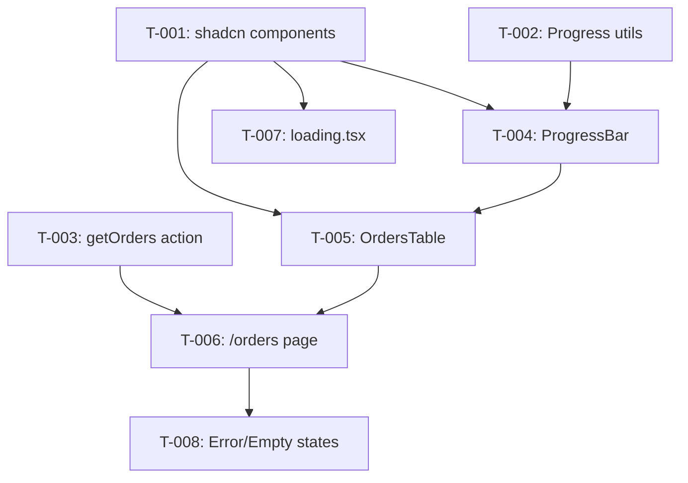

# Task Plan — Display Orders List + Progress Bar
# Kế hoạch Task — Hiển thị Danh sách Orders + Progress Bar
<!-- Template Version: 1.0 | US-1.2.1 | 2026-02-07 -->

---

## 📋 TL;DR

| Aspect | Value |
|--------|-------|
| Feature | US-1.2.1: Display Orders List + Progress Bar |
| Dev Mode | standard |
| Total Tasks | 8 |
| Estimated Effort | ~6 hours |
| Affected Roots | `sgs-cs-helper` |
| Spec Reference | [spec.md](../01_spec/spec.md) |

---

## 1. Task Overview / Tổng quan Task

| ID | Title | Root | Deps | Est | Status |
|----|-------|------|------|-----|--------|
| T-001 | Add shadcn/ui components (Table, Progress, Skeleton) | sgs-cs-helper | - | S | ⬜ |
| T-002 | Create progress calculation utilities | sgs-cs-helper | - | M | ⬜ |
| T-003 | Create getOrders server action | sgs-cs-helper | - | S | ⬜ |
| T-004 | Create OrderProgressBar component | sgs-cs-helper | T-001, T-002 | S | ⬜ |
| T-005 | Create OrdersTable component | sgs-cs-helper | T-001, T-004 | M | ⬜ |
| T-006 | Create public /orders page | sgs-cs-helper | T-003, T-005 | M | ⬜ |
| T-007 | Create loading.tsx for orders page | sgs-cs-helper | T-001 | S | ⬜ |
| T-008 | Add error handling and empty state | sgs-cs-helper | T-006 | S | ⬜ |

**Legend / Chú thích:** S = Small (<1h), M = Medium (1-2h), L = Large (2-4h)

---

## 2. Dependency Graph / Đồ thị Phụ thuộc



---

## 3. Parallel Execution Notes / Ghi chú Thực thi Song song

### 3.1 Parallel Groups / Nhóm Song song

| Group | Tasks | Reason |
|-------|-------|--------|
| A | T-001, T-002, T-003 | No dependencies, different files |
| B | T-004, T-007 | Both depend on T-001, different files |

### 3.2 Sequential Constraints / Ràng buộc Tuần tự

| Sequence | Reason |
|----------|--------|
| T-002 → T-004 | Progress utils needed for ProgressBar |
| T-005 → T-006 | Table component needed for page |
| T-006 → T-008 | Page needed before error states |

---

## 4. Tasks by Root / Task theo Root

### Root: sgs-cs-helper

---

#### T-001: Add shadcn/ui components

| Aspect | Detail |
|--------|--------|
| Root | `sgs-cs-helper` |
| Dependencies | None |
| Estimate | S (15 min) |
| Requirements | FR-002, FR-003, FR-007 |

**Description / Mô tả:**
- **EN:** Install shadcn/ui Table, Progress, and Skeleton components using the CLI
- **VI:** Cài đặt các component Table, Progress, và Skeleton từ shadcn/ui bằng CLI

**Files to Change / File Thay đổi:**
- Create: `src/components/ui/table.tsx`
- Create: `src/components/ui/progress.tsx`
- Create: `src/components/ui/skeleton.tsx`

**Done Criteria / Tiêu chí Hoàn thành:**
- [ ] Table component installed and importable
- [ ] Progress component installed and importable
- [ ] Skeleton component installed and importable
- [ ] No TypeScript errors

**Verification / Kiểm tra:**
- Run: `pnpm build` - no errors
- Check: Components exist in `src/components/ui/`

---

#### T-002: Create progress calculation utilities

| Aspect | Detail |
|--------|--------|
| Root | `sgs-cs-helper` |
| Dependencies | None |
| Estimate | M (1.5h) |
| Requirements | FR-004, FR-005, FR-006 |

**Description / Mô tả:**
- **EN:** Create utility functions for calculating order progress including priority-based duration and lunch break exclusion
- **VI:** Tạo các hàm utility để tính toán progress của order bao gồm duration theo priority và loại trừ giờ nghỉ trưa

**Files to Change / File Thay đổi:**
- Create: `src/lib/utils/progress.ts`

**Functions to Implement:**
```typescript
// Get duration in hours based on priority
function getPriorityDuration(priority: number): number

// Get lunch break deduction (0 or 1 hour)
function getLunchBreakDeduction(receivedDate: Date, now: Date): number

// Calculate progress percentage and color
function calculateOrderProgress(
  receivedDate: Date,
  priority: number,
  now?: Date
): ProgressInfo
```

**Done Criteria / Tiêu chí Hoàn thành:**
- [ ] `getPriorityDuration` returns: P0=0.25h, P1=1h, P2=2.5h, P3+=3h
- [ ] `getLunchBreakDeduction` handles lunch break logic correctly
- [ ] `calculateOrderProgress` returns { percentage, color, isOverdue, elapsedHours, totalHours }
- [ ] Color thresholds: white 0-40%, green 41-65%, yellow 66-80%, red >80%
- [ ] Pure functions with no side effects
- [ ] TypeScript types exported

**Verification / Kiểm tra:**
- Run: `pnpm build` - no errors
- Manual test with sample dates in development

---

#### T-003: Create getOrders server action

| Aspect | Detail |
|--------|--------|
| Root | `sgs-cs-helper` |
| Dependencies | None |
| Estimate | S (30 min) |
| Requirements | FR-001, FR-002 |

**Description / Mô tả:**
- **EN:** Add `getOrders()` function to fetch all orders sorted by requiredDate. No authentication required.
- **VI:** Thêm hàm `getOrders()` để fetch tất cả orders sắp xếp theo requiredDate. Không yêu cầu authentication.

**Files to Change / File Thay đổi:**
- Modify: `src/lib/actions/order.ts`

**Function to Add:**
```typescript
/**
 * Fetch all orders for public display
 * No authentication required
 */
export async function getOrders(): Promise<Order[]>
```

**Done Criteria / Tiêu chí Hoàn thành:**
- [ ] Function exported from order.ts
- [ ] Returns orders sorted by requiredDate ascending
- [ ] Selects only needed fields (id, jobNumber, dates, priority, status)
- [ ] No authentication check (public access)
- [ ] Handles empty result gracefully

**Verification / Kiểm tra:**
- Run: `pnpm build` - no errors
- Test in page component during T-006

---

#### T-004: Create OrderProgressBar component

| Aspect | Detail |
|--------|--------|
| Root | `sgs-cs-helper` |
| Dependencies | T-001, T-002 |
| Estimate | S (45 min) |
| Requirements | FR-003 |

**Description / Mô tả:**
- **EN:** Create a visual progress bar component that shows percentage with color coding
- **VI:** Tạo component progress bar trực quan hiển thị percentage với mã màu

**Files to Change / File Thay đổi:**
- Create: `src/components/orders/order-progress-bar.tsx`

**Props Interface:**
```typescript
interface OrderProgressBarProps {
  percentage: number;
  color: 'white' | 'green' | 'yellow' | 'red';
  isOverdue: boolean;
}
```

**Done Criteria / Tiêu chí Hoàn thành:**
- [ ] Component renders progress bar with correct width
- [ ] Bar color matches the `color` prop (white/green/yellow/red)
- [ ] Percentage text displayed next to bar
- [ ] Overdue shows "100%+" text with red indicator
- [ ] Accessible (proper aria labels)

**Verification / Kiểm tra:**
- Run: `pnpm build` - no errors
- Visual check in Storybook or dev page

---

#### T-005: Create OrdersTable component

| Aspect | Detail |
|--------|--------|
| Root | `sgs-cs-helper` |
| Dependencies | T-001, T-004 |
| Estimate | M (1h) |
| Requirements | FR-002 |

**Description / Mô tả:**
- **EN:** Create table component displaying orders with all required columns including progress bar
- **VI:** Tạo component bảng hiển thị orders với tất cả cột yêu cầu bao gồm progress bar

**Files to Change / File Thay đổi:**
- Create: `src/components/orders/orders-table.tsx`

**Props Interface:**
```typescript
interface OrderWithProgress {
  id: string;
  jobNumber: string;
  registeredDate: Date;
  receivedDate: Date;
  requiredDate: Date;
  priority: number;
  status: OrderStatus;
  progress: ProgressInfo;
}

interface OrdersTableProps {
  orders: OrderWithProgress[];
}
```

**Done Criteria / Tiêu chí Hoàn thành:**
- [ ] Table displays columns: Job Number, Registered Date, Required Date, Priority, Status, Progress
- [ ] Uses shadcn/ui Table component
- [ ] Dates formatted in Vietnamese locale (dd/MM/yyyy HH:mm)
- [ ] Progress column shows OrderProgressBar
- [ ] Responsive design (horizontal scroll on mobile)

**Verification / Kiểm tra:**
- Run: `pnpm build` - no errors
- Visual check with sample data

---

#### T-006: Create public /orders page

| Aspect | Detail |
|--------|--------|
| Root | `sgs-cs-helper` |
| Dependencies | T-003, T-005 |
| Estimate | M (1h) |
| Requirements | FR-001, FR-004, NFR-001, NFR-002 |

**Description / Mô tả:**
- **EN:** Create the main /orders page as a Server Component. Fetches orders, calculates progress, and renders table.
- **VI:** Tạo trang /orders chính dưới dạng Server Component. Fetch orders, tính progress, và render table.

**Files to Change / File Thay đổi:**
- Create: `src/app/(orders)/orders/page.tsx`
- Create: `src/app/(orders)/orders/layout.tsx` (optional, for consistent styling)

**Done Criteria / Tiêu chí Hoàn thành:**
- [ ] Route `/orders` accessible without login
- [ ] Page is Server Component (no "use client")
- [ ] Fetches orders using getOrders()
- [ ] Calculates progress for each order using calculateOrderProgress()
- [ ] Renders OrdersTable with data
- [ ] Has proper meta tags (title, description)
- [ ] No authentication middleware

**Verification / Kiểm tra:**
- Run: `pnpm dev` and visit `/orders`
- Verify accessible without login
- Check page source for SSR content

---

#### T-007: Create loading.tsx for orders page

| Aspect | Detail |
|--------|--------|
| Root | `sgs-cs-helper` |
| Dependencies | T-001 |
| Estimate | S (20 min) |
| Requirements | FR-007 |

**Description / Mô tả:**
- **EN:** Create loading skeleton using Next.js loading.tsx convention with shadcn Skeleton
- **VI:** Tạo loading skeleton sử dụng quy ước loading.tsx của Next.js với shadcn Skeleton

**Files to Change / File Thay đổi:**
- Create: `src/app/(orders)/orders/loading.tsx`

**Done Criteria / Tiêu chí Hoàn thành:**
- [ ] Loading skeleton shows table structure
- [ ] Uses Skeleton component for rows
- [ ] Matches table column layout
- [ ] Animates (pulse effect)

**Verification / Kiểm tra:**
- Add artificial delay in getOrders() temporarily
- Verify skeleton appears during loading

---

#### T-008: Add error handling and empty state

| Aspect | Detail |
|--------|--------|
| Root | `sgs-cs-helper` |
| Dependencies | T-006 |
| Estimate | S (30 min) |
| Requirements | FR-007, EC-001, EC-006 |

**Description / Mô tả:**
- **EN:** Add error boundary and empty state handling to the orders page
- **VI:** Thêm xử lý error boundary và empty state cho trang orders

**Files to Change / File Thay đổi:**
- Create: `src/app/(orders)/orders/error.tsx`
- Modify: `src/app/(orders)/orders/page.tsx` (add empty state check)

**Done Criteria / Tiêu chí Hoàn thành:**
- [ ] Empty state shows "No orders yet" message
- [ ] Error boundary catches fetch errors
- [ ] Error page shows user-friendly message
- [ ] Retry button refreshes page

**Verification / Kiểm tra:**
- Test with empty database
- Test by simulating network error

---

## 5. Sync Points / Điểm Đồng bộ

| After Task | Action | Before Task |
|------------|--------|-------------|
| T-001 | Components available | T-004, T-005, T-007 |
| T-002 | Utils available | T-004 |
| T-003 | Action available | T-006 |

> Note: Single root (sgs-cs-helper), no cross-root sync needed.

---

## 6. Requirements Coverage / Độ phủ Yêu cầu

| Requirement | Tasks | Status |
|-------------|-------|--------|
| FR-001: Public Orders Page | T-003, T-006 | ✅ Covered |
| FR-002: Orders Table Display | T-001, T-005 | ✅ Covered |
| FR-003: Progress Bar Component | T-001, T-004 | ✅ Covered |
| FR-004: Progress Calculation | T-002, T-006 | ✅ Covered |
| FR-005: Priority-Based Duration | T-002 | ✅ Covered |
| FR-006: Lunch Break Exclusion | T-002 | ✅ Covered |
| FR-007: Loading & Error States | T-001, T-007, T-008 | ✅ Covered |
| NFR-001: Performance | T-003, T-006 | ✅ Covered |
| NFR-002: SEO | T-006 | ✅ Covered |
| NFR-003: Extensibility | T-002 | ✅ Covered |

**All requirements covered ✅**

---

## 7. Test Plan / Kế hoạch Test

### 7.1 Test Strategy / Chiến lược Test

| Type | Coverage Target | Focus Areas |
|------|-----------------|-------------|
| Unit | 90% | Progress calculation utils (T-002) |
| Component | 80% | ProgressBar, Table components |
| Integration | 70% | Page rendering, data flow |

### 7.2 Test Cases by Task / Test Cases theo Task

| TC ID | Task | Test Description | Type | Expected Result |
|-------|------|------------------|------|-----------------|
| TC-001 | T-002 | getPriorityDuration returns 0.25 for P0 | Unit | 0.25 |
| TC-002 | T-002 | getPriorityDuration returns 1 for P1 | Unit | 1 |
| TC-003 | T-002 | getPriorityDuration returns 2.5 for P2 | Unit | 2.5 |
| TC-004 | T-002 | getPriorityDuration returns 3 for P3+ | Unit | 3 |
| TC-005 | T-002 | getLunchBreakDeduction returns 1 when applicable | Unit | 1 |
| TC-006 | T-002 | getLunchBreakDeduction returns 0 when not applicable | Unit | 0 |
| TC-007 | T-002 | calculateOrderProgress returns white for 0-40% | Unit | color: 'white' |
| TC-008 | T-002 | calculateOrderProgress returns green for 41-65% | Unit | color: 'green' |
| TC-009 | T-002 | calculateOrderProgress returns yellow for 66-80% | Unit | color: 'yellow' |
| TC-010 | T-002 | calculateOrderProgress returns red for >80% | Unit | color: 'red' |
| TC-011 | T-002 | calculateOrderProgress handles future date | Unit | percentage: 0 |
| TC-012 | T-003 | getOrders returns sorted orders | Integration | Sorted by requiredDate |
| TC-013 | T-003 | getOrders returns empty array when no orders | Integration | [] |
| TC-014 | T-004 | ProgressBar renders correct color | Component | Correct bg color |
| TC-015 | T-004 | ProgressBar shows percentage text | Component | Text visible |
| TC-016 | T-005 | OrdersTable renders all columns | Component | 6 columns visible |
| TC-017 | T-005 | OrdersTable formats dates correctly | Component | Vietnamese format |
| TC-018 | T-006 | /orders accessible without auth | Integration | 200 OK |
| TC-019 | T-006 | Page renders as Server Component | Integration | No hydration |
| TC-020 | T-008 | Empty state shown when no orders | Integration | Message visible |
| TC-021 | T-008 | Error state has retry button | Component | Button exists |

### 7.3 Edge Cases / Trường hợp Biên

| EC ID | Scenario | Test Approach |
|-------|----------|---------------|
| EC-001 | No orders in DB | Integration test with empty DB |
| EC-002 | Future receivedDate | Unit test with future date |
| EC-003 | Negative priority | Unit test getPriorityDuration(-1) |
| EC-004 | Exactly 100% | Unit test edge of color threshold |
| EC-005 | Very overdue (150%) | Unit test >100% handling |
| EC-007 | receivedDate at 12:00 | Unit test lunch break edge |
| EC-008 | Current time at 13:00 | Unit test lunch break edge |

### 7.4 Test Data / Dữ liệu Test

```typescript
// Sample orders for testing
const mockOrders = [
  {
    id: '1',
    jobNumber: 'JOB-001',
    registeredDate: new Date('2026-02-07T08:00:00'),
    receivedDate: new Date('2026-02-07T09:00:00'),
    requiredDate: new Date('2026-02-07T17:00:00'),
    priority: 2,
    status: 'IN_PROGRESS',
  },
  // Add more test cases...
];

// Progress calculation test fixtures
const progressTestCases = [
  { receivedDate: '09:00', now: '10:30', priority: 2, expected: { percentage: 60, color: 'green' } },
  { receivedDate: '11:00', now: '14:00', priority: 1, expected: { percentage: 200, color: 'red' } },
  // With lunch break
  { receivedDate: '10:00', now: '14:00', priority: 3, expected: { percentage: 100, color: 'red' } }, // 3h elapsed - 1h lunch = 2h, but 3h duration
];
```

---

## 8. Risk Assessment / Đánh giá Rủi ro

| Task | Risk | Impact | Mitigation |
|------|------|--------|------------|
| T-002 | Complex lunch break logic | High | Thorough unit tests |
| T-002 | Timezone issues | Medium | Use server timezone consistently |
| T-006 | SSR performance | Low | Optimize Prisma query |

---

## Approval / Phê duyệt

| Role | Status | Date |
|------|--------|------|
| Task Planner | ✅ Done | 2026-02-07 |
| Reviewer | ⏳ Pending | |

---

## Next Step

🇻🇳 Sau khi task plan được duyệt, bắt đầu **Phase 3: Implementation** với task đầu tiên.

🇬🇧 After task plan is approved, start **Phase 3: Implementation** with the first task.
