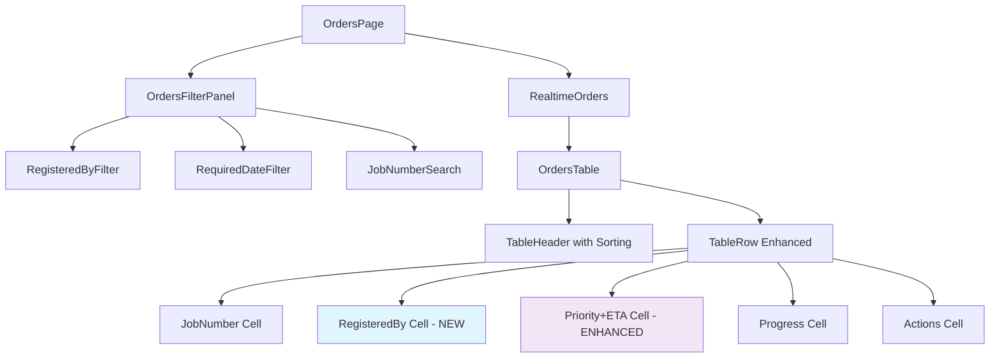
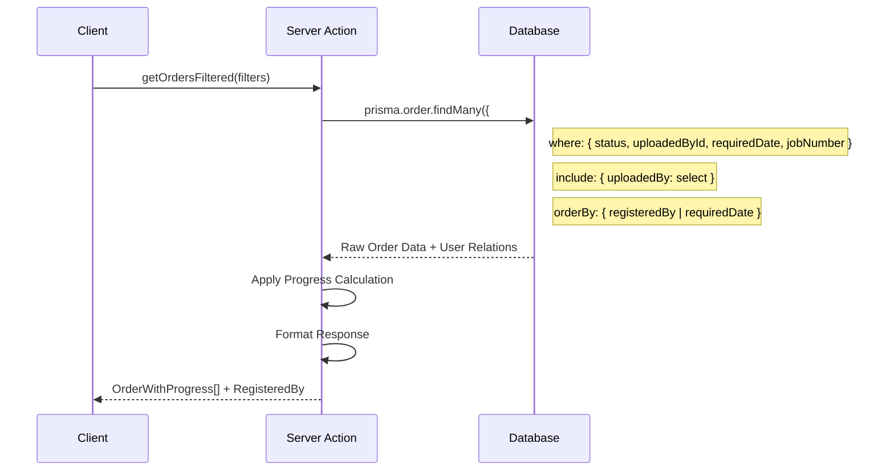

# Analysis & Solution Design — US-1.2.6: Show Registered By, Filter/Sort, Priority ETA

> **Created:** 2026-02-07  
> **Author:** GitHub Copilot  
> **Status:** 🔄 In Progress  

---

## 0.1 Request Analysis / Phân tích Yêu cầu

### Problem Statement / Phát biểu Vấn đề

🇻🇳 Hiện tại bảng orders trong tab **"In Progress"** hiển thị đầy đủ thông tin nhưng thiếu 3 tính năng quan trọng:
1. Không hiển thị **Registered By** (người đăng ký order)
2. Không có khả năng **lọc và sắp xếp** theo Registered By và Required Date (client-side)
3. Không hiển thị **Priority ETA** (ước tính thời gian hoàn thành theo priority)

🇬🇧 Currently the orders table in the **"In Progress"** tab shows complete information but lacks 3 important features:
1. Does not show **Registered By** (who registered the order)
2. Cannot **filter and sort** by Registered By and Required Date (client-side)
3. Does not display **Priority ETA** (estimated time to complete based on priority)

### User Story Requirements / Yêu cầu từ User Story

**US-1.2.6 Acceptance Criteria:**

- [ ] **AC1:** Orders table includes a `Registered By` column showing uploader name or identifier
- [ ] **AC2:** UI provides filters for `Registered By` and `Required Date` (date range)
- [ ] **AC3:** UI allows sorting by `Registered By` and `Required Date` (asc/desc)
- [ ] **AC4:** UI provides a search box to search orders by `Job Number` (supports exact and partial matches)
- [ ] **AC5:** `Priority` column displays both priority level and an estimated time-to-complete (ETA) for that priority. ETA values are read from a `priority_to_eta` config/mapping; if missing, sensible hardcoded defaults are used (e.g., Priority 1 -> 2h).
- [ ] **AC6:** Filtering and sorting work together with existing status/priority filters (combinable)
- [ ] **AC7:** Empty state and loading states handled correctly when filters return no results

### Current Architecture Assessment / Đánh giá Kiến trúc Hiện tại

#### Existing Components Analysis / Phân tích Components Hiện có

##### OrdersTable Component
| Aspect | Current State | Required Changes |
|--------|---------------|------------------|
| **Location** | `src/components/orders/orders-table.tsx` | Extend existing component |
| **Current Columns** | Job Number, Registered Date, Received Date, Required Date, Priority, Progress, Remaining Time | Add Registered By column |
| **Data Interface** | `OrderWithProgress` | Extend to include uploadedBy relation |
| **Filtering** | activeTab only (in-progress/completed) | Add **client-side** Registered By & Required Date filters |
| **Sorting** | None (server-side by requiredDate) | Add **client-side** sorting |
| **Search** | None | Add **client-side** Job Number search |
| **Scope** | All orders | **In-progress orders only** |

##### Database Schema Analysis
```typescript
// Current OrderWithProgress interface (needs extension)
export interface OrderWithProgress {
  id: string;
  jobNumber: string;
  registeredDate: Date;
  receivedDate: Date;
  requiredDate: Date;
  priority: number;
  status: OrderStatus;
  progress: ProgressInfo;
  // Missing: uploadedBy relation (only for in-progress orders)
}

// Existing Prisma schema (already supports uploadedBy)
model Order {
  id               String      @id @default(cuid())
  uploadedById     String      // Foreign key to User
  uploadedBy       User        @relation("UploadedBy", fields: [uploadedById], references: [id])
  // ... other fields
}
```

##### Existing Priority System / Hệ thống Priority Hiện có
```typescript
// From src/lib/utils/progress.ts - Duration mapping exists
const PRIORITY_DURATION_MAP: Record<number, number> = {
  0: 0.25, // P0: 15 minutes
  1: 1,    // P1: 1 hour  
  2: 2.5,  // P2: 2.5 hours
  // P3+: 3 hours (DEFAULT_DURATION)
};

// Priority display labels exist in OrdersTable
function getPriorityLabel(priority: number): string {
  switch (priority) {
    case 0: return "P0 - Emergency";
    case 1: return "P1 - Urgent";  
    case 2: return "P2 - Normal";
    default: return `P${priority} - Low`;
  }
}
```

#### Table Technology Options Analysis / Phân tích Tùy chọn Công nghệ Table

Based on research and user suggestion to "consider datatable", here are the options:

##### Option A: Extend Current shadcn/ui Table ⭐ **RECOMMENDED**
| Aspect | Assessment |
|--------|------------|
| **Pros** | ✅ Consistent with existing UI, minimal dependencies, full control, ✅ **Simple client-side implementation** |
| **Cons** | ❌ Manual implementation of sorting/filtering logic (but simpler for client-side) |
| **Implementation** | Add state management + **client-side** filter/sort components |
| **Existing Pattern** | Used in AdminList, AuditLogs, StaffList successfully |

##### Option B: TanStack Table (React Table)
| Aspect | Assessment |
|--------|------------|
| **Pros** | ✅ Full-featured, excellent TypeScript support, headless |
| **Cons** | ❌ Additional dependency, learning curve, overkill for requirements |
| **Implementation** | Replace OrdersTable with TanStack table |
| **Complexity** | High - significant refactor required |

##### Option C: Third-party Datatable Component
| Aspect | Assessment |
|--------|------------|
| **Pros** | ✅ Feature-rich out of box |
| **Cons** | ❌ External dependency, theming complexity, potential conflicts |
| **Implementation** | Replace current table entirely |
| **Risk** | High - may not match existing design system |

---

## 0.2 Solution Research / Nghiên cứu Giải pháp

### Research Findings / Kết quả Nghiên cứu

#### Existing Patterns in Codebase / Patterns Hiện có trong Codebase

**Filtering Patterns:**
1. **AuditLogsPage** - Advanced filtering with dropdowns + date ranges
2. **RealtimeOrders** - Simple tab-based filtering (activeTab)
3. **AdminList/StaffList** - Static table display

**Sorting Patterns:**
- Most tables use **server-side sorting** (Prisma orderBy)
- No existing **client-side sorting** implementations found

**Search Patterns:**
- **AuditLogsPage** has filter dropdowns but no text search
- No existing **Job Number search** pattern

#### Priority ETA Implementation Options / Tùy chọn Triển khai Priority ETA

##### Option A: Use Existing Progress Duration ⭐ **RECOMMENDED**
```typescript
// Reuse existing getPriorityDuration() from progress.ts
import { getPriorityDuration } from "@/lib/utils/progress";

function formatPriorityETA(priority: number): string {
  const durationHours = getPriorityDuration(priority);
  const label = getPriorityLabel(priority);
  
  if (durationHours < 1) {
    const minutes = Math.round(durationHours * 60);
    return `${label} (${minutes}m)`;
  } else {
    return `${label} (${durationHours}h)`;
  }
}
```

##### Option B: Config-Based ETA System
```typescript
// New implementation with Config table lookup
const ETA_CONFIG_KEY = "priority_eta_mapping";

// Fallback to hardcoded defaults if config missing
const DEFAULT_ETA_MAP = {
  0: "15m", 1: "1h", 2: "2.5h", 3: "3h"
};
```

**Analysis:** Option A is preferred because:
- ✅ Consistent with existing progress calculation
- ✅ No additional database queries needed  
- ✅ Already tested and working
- ✅ Simpler implementation

---

## 0.3 Solution Design / Thiết kế Giải pháp

### High-Level Architecture / Kiến trúc Tổng quan

```
┌─────────────────────────────────────────────────────────────┐
│ ORDERS PAGE (/orders)                                       │
├─────────────────────────────────────────────────────────────┤
│ ┌─────────────────┐ ┌─────────────────┐ ┌─────────────────┐ │
│ │   Filter Panel  │ │   Search Box    │ │  Sort Controls  │ │
│ │                 │ │                 │ │                 │ │
│ │ • Registered By │ │ • Job Number    │ │ • Registered By │ │
│ │ • Required Date │ │   Search        │ │ • Required Date │ │
│ │   Range         │ │                 │ │   (Asc/Desc)    │ │
│ └─────────────────┘ └─────────────────┘ └─────────────────┘ │
├─────────────────────────────────────────────────────────────┤
│ ┌─────────────────────────────────────────────────────────┐ │
│ │ ENHANCED ORDERS TABLE                                   │ │
│ │                                                         │ │
│ │ Columns:                                                │ │
│ │ • Job Number                                            │ │
│ │ • Registered Date                                       │ │
│ │ • Registered By    ← NEW                                │ │
│ │ • Received Date                                         │ │
│ │ • Required Date                                         │ │
│ │ • Priority + ETA   ← ENHANCED                           │ │
│ │ • Progress                                              │ │
│ │ • Remaining Time                                        │ │
│ │ • Actions                                               │ │
│ └─────────────────────────────────────────────────────────┘ │
└─────────────────────────────────────────────────────────────┘
```

### Component Architecture / Kiến trúc Component

#### Component Hierarchy / Cấu trúc Component
```
OrdersPage (Server Component)
├── OrdersFilterPanel (Client Component) ← NEW
│   ├── RegisteredByFilter
│   ├── RequiredDateFilter  
│   └── JobNumberSearch
├── OrdersSortControls (Client Component) ← NEW
└── RealtimeOrders (Client Component) ← EXTEND
    └── OrdersTable (Client Component) ← EXTEND
        ├── OrdersTableHeader ← ENHANCED (sortable)
        └── OrdersTableRow ← ENHANCED (Registered By + Priority ETA)
```

#### Data Flow / Luồng Dữ liệu

```
┌─────────────┐    ┌──────────────────────┐    ┌─────────────────┐
│   Client    │    │    Server Action     │    │    Database     │
│  Filters    │    │     getOrders()      │────│  Query Builder  │
│  & Search   │    │   (unchanged base)   │    │   (Prisma)      │
└─────────────┘    └──────────────────────┘    └─────────────────┘
       │                       │                        │
       │ CLIENT-SIDE           │ Data Processing        │ Include Relations
       │ State Management      │ (no filtering)         │ + uploadedBy  
       │ + Filtering           │                        │
       │ + Sorting             │                        │
       │ + Search              │                        │
       ▼                       ▼                        ▼
┌─────────────┐    ┌──────────────────────┐    ┌─────────────────┐
│   Filter    │    │   OrderWithProgress  │    │     Prisma      │
│ Components  │◄───│   + RegisteredBy     │    │   findMany()    │
│             │    │   Interface          │    │   with include  │
└─────────────┘    └──────────────────────┘    └─────────────────┘
```

### Technical Implementation Plan / Kế hoạch Triển khai Kỹ thuật

#### Phase 1: Data Layer Enhancement / Tầng Dữ liệu

**1.1 Extend OrderWithProgress Interface**
```typescript
// src/components/orders/orders-table.tsx
export interface OrderWithProgress {
  id: string;
  jobNumber: string;
  registeredDate: Date;
  receivedDate: Date; 
  requiredDate: Date;
  priority: number;
  status: OrderStatus;
  progress: ProgressInfo;
  // NEW: Add registered by information
  uploadedBy: {
    id: string;
    email: string | null;
    name: string | null;
    staffCode?: string | null; // For STAFF users
  };
}
```

**1.2 Enhance Server Action (Minimal Changes)**
```typescript
// src/lib/actions/order.ts  
export async function getOrders() {
  const orders = await prisma.order.findMany({
    where: {
      // Existing status filter (unchanged)
      status: { not: "COMPLETED" },
    },
    // NEW: Add uploadedBy include for in-progress orders
    include: {
      uploadedBy: {
        select: {
          id: true,
          email: true,
          name: true,
          staffCode: true,
        },
      },
    },
    // Existing orderBy (unchanged)
    orderBy: { requiredDate: 'asc' },
  });
  
  // Apply progress calculation (unchanged)
  return orders.map(order => ({
    ...order,
    progress: calculateOrderProgress(order.receivedDate, order.priority),
  }));
}
```

#### Phase 2: UI Components Enhancement / Cải tiến UI Components

**2.1 OrdersFilterPanel Component (Client-Side)**
```typescript
// src/components/orders/orders-filter-panel.tsx
interface OrdersFilterPanelProps {
  orders: OrderWithProgress[]; // All in-progress orders
  onFilteredOrdersChange: (filteredOrders: OrderWithProgress[]) => void;
}

export function OrdersFilterPanel({ orders, onFilteredOrdersChange }: OrdersFilterPanelProps) {
  // CLIENT-SIDE filtering logic
  // State management for filter values
  // UI: Select dropdown for Registered By (from orders.uploadedBy)
  // UI: Date range picker for Required Date  
  // UI: Text input for Job Number search
  // Apply filters to orders array and call onFilteredOrdersChange
}
```

**2.2 Enhanced Priority Display**
```typescript
// Enhanced priority cell in OrdersTable
<TableCell>
  <div className="space-y-1">
    <span className={`inline-flex items-center rounded-full px-2 py-1 text-xs font-medium ${getPriorityClass(order.priority)}`}>
      {getPriorityLabel(order.priority)}
    </span>
    <div className="text-xs text-gray-500">
      ETA: {formatPriorityETA(order.priority)}
    </div>
  </div>
</TableCell>
```

**2.3 Registered By Column**
```typescript
// New column in OrdersTable
<TableHead className="w-[140px]">Registered By</TableHead>

// In table row
<TableCell>
  <div className="text-sm">
    <div className="font-medium text-gray-900">
      {order.uploadedBy.name || 'Unknown'}
    </div>
    {order.uploadedBy.email && (
      <div className="text-gray-500 text-xs">{order.uploadedBy.email}</div>
    )}
    {order.uploadedBy.staffCode && (
      <div className="text-gray-400 text-xs">Staff: {order.uploadedBy.staffCode}</div>
    )}
  </div>
</TableCell>
```

#### Phase 3: Integration & State Management / Tích hợp & Quản lý State

**3.1 Client-Side Filter State Management**
```typescript
// In RealtimeOrders component
interface ClientFilters {
  registeredBy?: string;
  requiredDateFrom?: Date;
  requiredDateTo?: Date;  
  jobNumberSearch?: string;
  sortBy?: 'registeredBy' | 'requiredDate';
  sortOrder?: 'asc' | 'desc';
}

// Client-side filtering logic
const [filters, setFilters] = useState<ClientFilters>({});
const [baseOrders, setBaseOrders] = useState<OrderWithProgress[]>([]); // From SSE
const [filteredOrders, setFilteredOrders] = useState<OrderWithProgress[]>([]);

// Apply filters whenever baseOrders or filters change
useEffect(() => {
  let result = baseOrders.filter(order => {
    // Apply registeredBy filter
    if (filters.registeredBy && order.uploadedBy.id !== filters.registeredBy) return false;
    // Apply date range filter  
    if (filters.requiredDateFrom && order.requiredDate < filters.requiredDateFrom) return false;
    if (filters.requiredDateTo && order.requiredDate > filters.requiredDateTo) return false;
    // Apply job number search
    if (filters.jobNumberSearch && !order.jobNumber.includes(filters.jobNumberSearch)) return false;
    return true;
  });
  
  // Apply sorting
  if (filters.sortBy) {
    result.sort((a, b) => {
      // Client-side sorting logic
    });
  }
  
  setFilteredOrders(result);
}, [baseOrders, filters]);
```

**3.2 Real-time Compatibility**
- Filter/sort operations work with SSE updates
- New orders appear in correct sorted position
- Filter state persists during real-time updates

---

## 0.4 Diagrams / Biểu đồ

### Data Flow Diagram / Biểu đồ Luồng Dữ liệu

```mermaid
flowchart TD
    A[User Interaction] --> B{Filter/Search/Sort?}
    
    B -->|Filter Change| C[Update Filter State]
    B -->|Search Input| D[Update Search State]  
    B -->|Sort Click| E[Update Sort State]
    
    C --> F[Call getOrdersFiltered]
    D --> F
    E --> F
    
    F --> G[Prisma Query with Filters]
    G --> H[Include uploadedBy relation]
    H --> I[Apply Progress Calculation]
    I --> J[Return OrderWithProgress[]]
    
    J --> K[Update Orders State]
    K --> L[Re-render OrdersTable]
    
    L --> M[Display Enhanced Table]
    M --> N[Registered By Column]
    M --> O[Priority + ETA Column]
    M --> P[Sortable Headers]
```

### Component Structure Diagram / Biểu đồ Cấu trúc Component



### Database Query Enhancement / Cải tiến Truy vấn Database



---

## Implementation Approach / Phương pháp Triển khai

### Recommended Implementation Strategy / Chiến lược Triển khai Khuyến nghị

**✅ Client-Side Enhancement Approach**

1. **Extend Current shadcn/ui Table** (not replace)
2. **Client-side filtering/sorting** for in-progress orders (small dataset)
3. **Reuse existing progress duration logic** for ETA
4. **Maintain real-time compatibility**

### Reasoning / Lý do

| Factor | Decision | Rationale |
|--------|----------|-----------|
| **Table Technology** | Extend shadcn/ui | ✅ Consistent UI, ✅ Proven patterns, ✅ Minimal dependencies |
| **ETA Source** | Reuse progress duration | ✅ Already tested, ✅ Consistent logic, ✅ No config needed |
| **Filter/Sort Location** | **Client-side** | ✅ **Simple for small dataset**, ✅ **No server changes needed**, ✅ **Instant filtering** |
| **Scope** | **In-progress orders only** | ✅ **Smaller dataset**, ✅ **Simpler implementation** |
| **Implementation Style** | Incremental enhancement | ✅ Lower risk, ✅ Maintains existing functionality |

---

## Dependencies & Integration Points / Phụ thuộc & Điểm Tích hợp

### Required Changes / Thay đổi Yêu cầu

| Component | Change Type | Impact Level |
|-----------|-------------|--------------|
| `OrderWithProgress` interface | Extend | Low |
| `getOrders()` server action | **Add include only** | **Low** |
| `OrdersTable` component | Extend | Medium |  
| `RealtimeOrders` component | **Client-side filtering state** | **Medium** |
| Database queries | Add includes | Low |

### Integration Considerations / Cân nhắc Tích hợp

**✅ Compatible with:**
- Existing real-time updates (SSE)
- Current role-based permissions
- activeTab filtering (in-progress/completed)
- Mark Done functionality

**⚠️ Considerations:**
- Filter state management complexity
- Server-side vs client-side sorting trade-offs
- Performance with large datasets

---

## Next Steps / Bước tiếp theo

1. **Complete Phase 0 Analysis** ← Current
2. **Phase 1: Specification** - Detailed requirements + edge cases
3. **Phase 2: Task Planning** - Break into implementable tasks
4. **Phase 3: Implementation** - Code changes
5. **Phase 4: Testing** - Verify all acceptance criteria
6. **Phase 5: Done Check** - Final validation

---

**Status:** 🔄 Phase 0.3 Complete - Solution Design Ready  
**Next:** Await user approval for Phase 0 completion  
**Last Updated:** 2026-02-07