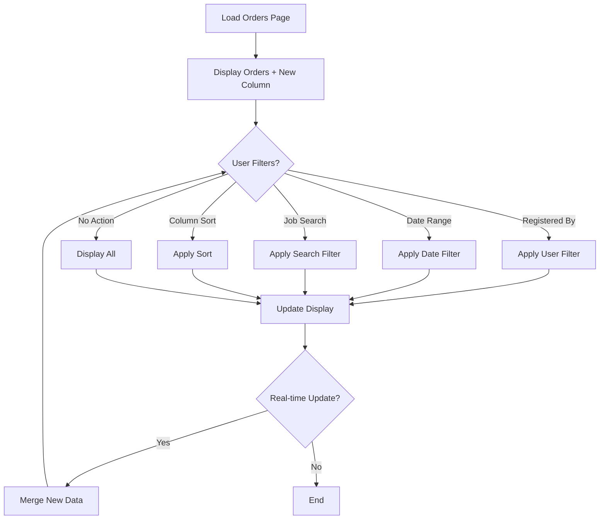

# Specification — Show Registered By, Filter/Sort, Priority ETA
# Đặc tả — Hiển thị Registered By, Lọc/Sắp xếp, Priority ETA
<!-- Template Version: 1.0 | Contract: v1.0 | Generated: 2026-02-08 -->
<!-- 🇻🇳 Vietnamese first, 🇬🇧 English follows — for easy scanning -->

---

## TL;DR

| Aspect | Value |
|--------|-------|
| Feature | Show Registered By, Filter/Sort, Priority ETA |
| Status | Draft |
| Phase 0 Analysis | [Solution Design](../00_analysis/solution-design.md) |
| Functional Requirements | 5 |
| Non-Functional Requirements | 3 |
| Affected Roots | sgs-cs-helper |

---

## 1. Overview

🇻🇳 Tính năng này mở rộng bảng đơn hàng "In Progress" hiện có để hiển thị người đăng ký từng order, cho phép lọc và sắp xếp theo nhiều tiêu chí, và hiển thị ETA (ước tính thời gian hoàn thành) dựa trên priority. Việc triển khai sử dụng client-side filtering vì dataset nhỏ (chỉ in-progress orders).

🇬🇧 This feature extends the existing "In Progress" orders table to show who registered each order, enable filtering and sorting by multiple criteria, and display ETA (estimated time to complete) based on priority. Implementation uses client-side filtering since the dataset is small (in-progress orders only).

---

## 2. Goals & Non-Goals

### Goals

🇻🇳
1. **Truy vết nguồn gốc:** Hiển thị rõ ai đã đăng ký từng order để dễ truy vết và liên lạc
2. **Tăng khả năng lọc/sắp xếp:** Cho phép lọc theo người đăng ký và khoảng thời gian, sắp xếp linh hoạt
3. **Hiển thị ETA:** Tính toán và hiển thị thời gian ước tính hoàn thành dựa trên priority để hỗ trợ phân bổ công việc
4. **Trải nghiệm mượt mã:** Client-side filtering cho phản hồi tức thì, không cần server round trips

🇬🇧
1. **Order traceability:** Show clearly who registered each order for easy tracking and communication
2. **Enhanced filtering/sorting:** Allow filtering by registrant and date range, flexible sorting
3. **ETA visibility:** Calculate and display estimated completion time based on priority to support workload allocation
4. **Smooth experience:** Client-side filtering for instant response without server round trips

### Non-Goals

🇻🇳
1. Áp dụng cho orders đã hoàn thành (chỉ in-progress)
2. Server-side pagination hoặc filtering
3. Real-time collaborative filtering (multi-user)
4. Export filtered results
5. Thay đổi major layout của dashboard

🇬🇧
1. Apply to completed orders (in-progress only)
2. Server-side pagination or filtering
3. Real-time collaborative filtering (multi-user) 
4. Export filtered results
5. Major dashboard layout changes

---

## 3. User Stories

### US-1.2.6: Enhanced Order List Visibility

🇻🇳 Là nhân viên CS, tôi muốn xem ai đã đăng ký từng order, có thể lọc và sắp xếp danh sách, và thấy ước tính thời gian hoàn thành cho từng priority, để tôi có thể phân công và ưu tiên công việc hiệu quả hơn.

🇬🇧 As a CS staff member, I want to see who registered each order, be able to filter and sort the list, and see estimated completion time for each priority, so that I can assign and prioritize work more effectively.

---

## 4. Requirements Matrix

| ID | Title | Priority | Type | Covered By |
|----|-------|----------|------|------------|
| FR-001 | Registered By Column Display | Must | Functional | TC-001 |
| FR-002 | Client-side Filtering Controls | Must | Functional | TC-002 |
| FR-003 | Client-side Sorting Controls | Must | Functional | TC-003 |
| FR-004 | Job Number Search | Must | Functional | TC-004 |
| FR-005 | Priority ETA Display | Must | Functional | TC-005 |
| NFR-001 | Response Time Performance | Must | Performance | TC-P01 |
| NFR-002 | Real-time Compatibility | Must | Integration | TC-I01 |
| NFR-003 | UI Consistency | Should | Usability | TC-U01 |

---

## 5. Functional Requirements

### FR-001: Registered By Column Display

| Aspect | Detail |
|--------|--------|
| Priority | Must |
| Affected Roots | sgs-cs-helper |

#### Description

🇻🇳 Bảng orders phải hiển thị cột "Registered By" mới cho biết ai đã upload/đăng ký order đó. Cột này hiển thị thông tin của người upload theo định dạng multi-line: tên (chính), email (phụ), mã staff (nếu có).

🇬🇧 The orders table must display a new "Registered By" column showing who uploaded/registered that order. This column displays uploader information in multi-line format: name (primary), email (secondary), staff code (if available).

#### Acceptance Criteria

- [ ] AC1.1: New "Registered By" column added to orders table in correct position (after Registered Date)
- [ ] AC1.2: Column displays uploader name as primary text (or "Unknown" if null)
- [ ] AC1.3: Column displays uploader email as secondary text in gray color (if available)
- [ ] AC1.4: Column displays staff code as tertiary text "Staff: {code}" in gray color (if STAFF user)
- [ ] AC1.5: Column width is appropriately sized (~140px) and responsive
- [ ] AC1.6: Text truncation and overflow handled properly for long names/emails

---

### FR-002: Client-side Filtering Controls

| Aspect | Detail |
|--------|--------|
| Priority | Must |
| Affected Roots | sgs-cs-helper |

#### Description

🇻🇳 Cung cấp bộ điều khiển lọc phía client cho phép lọc in-progress orders theo Registered By và Required Date range. Filtering được thực hiện trên dữ liệu đã load, không cần gọi server.

🇬🇧 Provide client-side filtering controls that allow filtering in-progress orders by Registered By and Required Date range. Filtering is performed on already-loaded data without server calls.

#### Acceptance Criteria

- [ ] AC2.1: Registered By filter dropdown populated with unique uploaders from current in-progress orders
- [ ] AC2.2: Required Date filter with "From Date" and "To Date" inputs (date pickers or input fields)
- [ ] AC2.3: Filters work independently and in combination (AND logic)
- [ ] AC2.4: Filter changes apply instantly without page reload
- [ ] AC2.5: "Clear All Filters" button to reset all filter values
- [ ] AC2.6: Filter state persists during real-time SSE updates
- [ ] AC2.7: Empty state displayed when filters return no results

---

### FR-003: Client-side Sorting Controls

| Aspect | Detail |
|--------|--------|
| Priority | Must |
| Affected Roots | sgs-cs-helper |

#### Description

🇻🇳 Cho phép sắp xếp orders theo Registered By và Required Date với cả ascending và descending. Sorting được thực hiện client-side trên dữ liệu filtered.

🇬🇧 Allow sorting orders by Registered By and Required Date in both ascending and descending order. Sorting is performed client-side on filtered data.

#### Acceptance Criteria

- [ ] AC3.1: Clickable column headers for "Registered By" and "Required Date" columns
- [ ] AC3.2: Sort indicator (arrow) shows current sort direction and field
- [ ] AC3.3: Toggle between ascending/descending on repeated header clicks
- [ ] AC3.4: Default sort remains "Required Date ascending" (unchanged from current)
- [ ] AC3.5: Sort persists during filtering operations
- [ ] AC3.6: Sort indicator visually clear and accessible

---

### FR-004: Job Number Search

| Aspect | Detail |
|--------|--------|
| Priority | Must |
| Affected Roots | sgs-cs-helper |

#### Description

🇻🇳 Cung cấp search box cho phép tìm kiếm orders theo Job Number với hỗ trợ exact match và partial match. Search hoạt động client-side và kết hợp với filters.

🇬🇧 Provide search box that allows searching orders by Job Number with support for exact and partial matches. Search operates client-side and combines with filters.

#### Acceptance Criteria

- [ ] AC4.1: Job Number search box with clear placeholder text
- [ ] AC4.2: Search supports both exact matches (full job number) and partial matches
- [ ] AC4.3: Search is case-insensitive
- [ ] AC4.4: Search results update in real-time as user types (debounced)
- [ ] AC4.5: Search combines with other filters using AND logic
- [ ] AC4.6: Clear search button (X) to reset search input

---

### FR-005: Priority ETA Display

| Aspect | Detail |
|--------|--------|
| Priority | Must |
| Affected Roots | sgs-cs-helper |

#### Description

🇻🇳 Cột Priority hiển thị cả priority level và estimated time-to-complete (ETA) cho priority đó. ETA được tính từ existing progress duration logic (P0=15m, P1=1h, P2=2.5h, P3+=3h).

🇬🇧 The Priority column displays both priority level and estimated time-to-complete (ETA) for that priority. ETA is calculated from existing progress duration logic (P0=15m, P1=1h, P2=2.5h, P3+=3h).

#### Acceptance Criteria

- [ ] AC5.1: Priority column shows existing priority badge (unchanged styling)
- [ ] AC5.2: ETA display added below priority badge in smaller gray text
- [ ] AC5.3: ETA format: "ETA: {duration}" (e.g., "ETA: 1h", "ETA: 15m")
- [ ] AC5.4: ETA uses existing getPriorityDuration() logic for consistency
- [ ] AC5.5: ETA formatting handles minutes (<1h) vs hours (≥1h) appropriately
- [ ] AC5.6: Column width accommodates both priority badge and ETA text

---

## 6. Non-Functional Requirements

### NFR-001: Response Time Performance

| Aspect | Detail |
|--------|--------|
| Category | Performance |
| Metric | Filter/sort operations < 100ms for 95th percentile |
| Target | Up to 200 in-progress orders |

#### Description

🇻🇳 Các thao tác lọc và sắp xếp phải phản hồi nhanh vì được thực hiện client-side. Với dataset nhỏ (in-progress orders), performance phải mượt mà và responsive.

🇬🇧 Filtering and sorting operations must respond quickly since they're performed client-side. With small dataset (in-progress orders), performance must be smooth and responsive.

---

### NFR-002: Real-time Compatibility

| Aspect | Detail |
|--------|--------|
| Category | Integration |
| Metric | SSE updates maintain filter/sort state |

#### Description

🇻🇳 Tính năng phải tương thích với SSE real-time updates hiện có. Khi có orders mới từ SSE, chúng phải xuất hiện ở đúng vị trí theo filter/sort hiện tại.

🇬🇧 Feature must be compatible with existing SSE real-time updates. When new orders arrive via SSE, they must appear in correct position according to current filter/sort.

---

### NFR-003: UI Consistency

| Aspect | Detail |
|--------|--------|
| Category | Usability |
| Metric | Follows existing shadcn/ui design patterns |

#### Description

🇻🇳 UI components phải tuân thủ design system hiện có, sử dụng shadcn/ui components và patterns đã thiết lập trong codebase.

🇬🇧 UI components must follow existing design system, using established shadcn/ui components and patterns from the codebase.

---

## 7. User Flow

| Step | Action | System Response | Next Step |
|------|--------|-----------------|-----------|
| 1 | User opens Orders page | Load in-progress orders with Registered By data | 2 |
| 2 | User selects Registered By filter | Filter orders client-side, update display | 3 or End |
| 3 | User sets date range filter | Apply additional filter, update display | 4 or End |
| 4 | User searches job number | Apply search filter, update display | 5 or End |
| 5 | User clicks sort header | Sort filtered results, update sort indicator | End |

### Flow Diagram



---

## 8. Data Models

```typescript
// Extended OrderWithProgress interface
interface OrderWithProgress {
  id: string;
  jobNumber: string;
  registeredDate: Date;
  receivedDate: Date;
  requiredDate: Date;
  priority: number;
  status: OrderStatus;
  progress: ProgressInfo;
  // NEW: Registered By information
  uploadedBy: {
    id: string;
    email: string | null;
    name: string | null;
    staffCode?: string | null; // For STAFF users
  };
}

// Client-side filter state
interface ClientFilters {
  registeredBy?: string;           // uploadedBy.id
  requiredDateFrom?: Date;
  requiredDateTo?: Date;
  jobNumberSearch?: string;
  sortBy?: 'registeredBy' | 'requiredDate';
  sortOrder?: 'asc' | 'desc';
}

// ETA display helper
interface PriorityETA {
  priority: number;
  label: string;           // "P1 - Urgent"
  eta: string;            // "1h"
}
```

---

## 9. API Contracts

### Enhanced GET /api/orders (Server Action: getOrders)

```typescript
// Request (unchanged - no filtering parameters needed)
// Uses existing getOrders() with minimal changes

// Response (enhanced with uploadedBy)
interface GetOrdersResponse {
  orders: OrderWithProgress[]; // Now includes uploadedBy relation
}

// Server Action changes
export async function getOrders() {
  const orders = await prisma.order.findMany({
    where: {
      status: { not: "COMPLETED" }, // Existing filter
    },
    // NEW: Add uploadedBy include
    include: {
      uploadedBy: {
        select: {
          id: true,
          email: true,
          name: true,
          staffCode: true,
        },
      },
    },
    orderBy: { requiredDate: 'asc' }, // Existing sort
  });
}
```

---

## 10. Edge Cases

| ID | Scenario | Expected Behavior | Priority |
|----|----------|-------------------|----------|
| EC-001 | Missing uploadedBy data | Display "Unknown" in Registered By column | Must handle |
| EC-002 | Empty filter results | Show empty state message | Must handle |
| EC-003 | SSE update during filtering | New order appears if matches current filters | Must handle |
| EC-004 | Very long names/emails | Truncate with ellipsis, show tooltip on hover | Should handle |
| EC-005 | Filter state during page refresh | Reset to default (no persistence across sessions) | Accept |

### EC-001: Missing Uploader Data

🇻🇳
**Khi:** Order có uploadedById null hoặc user đã bị xóa
**Thì:** Hiển thị "Unknown" ở cột Registered By, không hiện email/staff code
**Lý do:** Đảm bảo UI luôn hiển thị consistent, không bị lỗi

🇬🇧
**When:** Order has null uploadedById or user has been deleted
**Then:** Display "Unknown" in Registered By column, no email/staff code shown
**Rationale:** Ensure UI always displays consistently without errors

### EC-002: No Filter Results

🇻🇳
**Khi:** Filters không trả về order nào
**Thì:** Hiển thị empty state message "No orders match current filters" với button clear filters
**Lý do:** User feedback rõ ràng và cách khắc phục

🇬🇧  
**When:** Filters return no orders
**Then:** Display empty state message "No orders match current filters" with clear filters button
**Rationale:** Clear user feedback and recovery path

### EC-003: Real-time Updates with Filters

🇻🇳
**Khi:** SSE update arrives while filters active
**Thì:** Đánh giá order mới với filters hiện tại, chỉ hiển thị nếu match
**Lý do:** Duy trì tính nhất quán của filtered view

🇬🇧
**When:** SSE update arrives while filters are active  
**Then:** Evaluate new order against current filters, only display if it matches
**Rationale:** Maintain consistency of filtered view

---

## 11. Error Handling

| Error Condition | User Message | System Action |
|-----------------|--------------|---------------|
| Failed to load uploadedBy data | "Some order details unavailable" | Show "Unknown" for missing data, log error |
| Invalid date filter input | "Please enter valid dates" | Reset invalid input, show validation |
| Client-side filter error | "Error applying filters" | Reset filters to default, log error |

---

## 12. Cross-Root Impact

| Root | Changes | Sync Required |
|------|---------|---------------|
| sgs-cs-helper | Enhanced OrdersTable, new filter components, client-side logic | No |

### Integration Points

🇻🇳 Chỉ có một root (sgs-cs-helper) bị ảnh hưởng. Không có cross-root dependencies hoặc sync requirements. Tất cả changes được contained trong ứng dụng này.

🇬🇧 Only one root (sgs-cs-helper) is affected. No cross-root dependencies or sync requirements. All changes are contained within this application.

---

## 13. Dependencies

| Dependency | Type | Status |
|------------|------|--------|
| `@/lib/utils/progress` | Internal Module | Existing (getPriorityDuration) |
| `shadcn/ui` Table components | Package | Existing |
| `React` useState, useEffect | Package | Existing |
| Prisma uploadedBy relation | Database Schema | Existing |

---

## 14. Risks & Assumptions

### Risks

| Risk | Impact | Mitigation |
|------|--------|------------|
| Client memory usage with large datasets | Medium | Limit to in-progress orders only (~50-200 typical) |
| Filter performance degradation | Low | Client-side filtering optimal for small datasets |
| SSE integration complexity | Medium | Thorough testing of filter state during updates |

### Assumptions

| # | Assumption | Validated |
|---|------------|-----------|
| 1 | In-progress orders dataset < 200 orders typical | Yes (user confirmed small dataset) |
| 2 | uploadedBy relation exists in database | Yes (verified in schema) |
| 3 | Client-side filtering is acceptable for performance | Yes (user requested client-side) |
| 4 | Existing progress duration logic should be reused for ETA | Yes (decided in Phase 0) |

---

## 15. Open Questions

| # | Question | Status | Answer |
|---|----------|--------|--------|
| 1 | Should filters persist across browser sessions? | Resolved | No - reset on page reload for simplicity |
| 2 | Date range picker vs text input for dates? | Open | TBD in implementation |
| 3 | Should ETA consider current time vs just show duration? | Open | TBD - likely just show expected duration |

---

## 16. Notes

🇻🇳
- Triển khai client-side filtering cho phép UX nhanh với dataset nhỏ
- Tái sử dụng maximum existing components và logic để giảm risk
- Priority ETA sử dụng existing progress calculation để consistency
- Real-time compatibility là requirement quan trọng - cần test kỹ

🇬🇧  
- Client-side filtering implementation enables fast UX with small dataset
- Reuse maximum existing components and logic to reduce risk
- Priority ETA uses existing progress calculation for consistency
- Real-time compatibility is critical requirement - needs thorough testing

---

## Approval

| Role | Name | Status | Date |
|------|------|--------|------|
| Spec Author | GitHub Copilot | ✅ Done | 2026-02-08 |
| Tech Reviewer | ... | ⏳ Pending | ... |
| Product Owner | ... | ⏳ Pending | ... |

---

## Next Step

🇻🇳 Sau khi phê duyệt, tiến hành **Phase 2: Task Planning**.

🇬🇧 After approval, proceed to **Phase 2: Task Planning**.

Reply: `approved` or `revise: <feedback>`