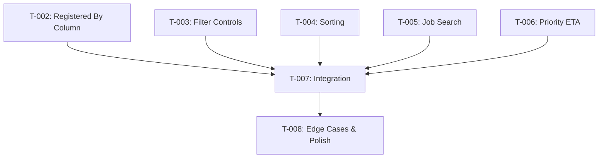

# Task Plan — Show Registered By, Filter/Sort, Priority ETA
# Kế hoạch Task — Hiển thị Registered By, Lọc/Sắp xếp, Priority ETA
<!-- Template Version: 1.0 | Contract: v1.0 | Generated: 2026-02-08 -->
<!-- 🇻🇳 Vietnamese first, 🇬🇧 English follows — for easy scanning -->

---

## TL;DR

| Aspect | Value |
|--------|-------|
| Feature | Show Registered By, Filter/Sort, Priority ETA |
| Total Tasks | 7 |
| Estimated Effort | 11-13 hours |
| Affected Roots | sgs-cs-helper |
| Spec Reference | [spec.md](../01_spec/spec.md) |

---

## 1. Goal

🇻🇳 Khi hoàn thành, bảng "In Progress" orders sẽ có cột "Registered By", khả năng lọc/sắp xếp client-side theo người đăng ký và ngày yêu cầu, tìm kiếm theo job number, và hiển thị ETA cho từng priority. Tất cả tính năng hoạt động client-side với performance tối ưu và tương thích với real-time SSE updates.

🇬🇧 When complete, the "In Progress" orders table will have a "Registered By" column, client-side filtering/sorting by registrant and required date, job number search, and ETA display for each priority. All features operate client-side with optimal performance and compatibility with real-time SSE updates.

---

## 2. Task Overview

| ID | Title | Root | Type | Est. | Deps | Status |
|----|-------|------|------|------|------|--------|
| T-002 | Add Registered By Column | sgs-cs-helper | Modify | 1.5h | - | ⏳ |
| T-003 | Create Client-side Filter Controls | sgs-cs-helper | New | 3h | - | ⏳ |
| T-004 | Implement Client-side Sorting | sgs-cs-helper | Modify | 2h | - | ⏳ |
| T-005 | Add Job Number Search | sgs-cs-helper | New | 2h | - | ⏳ |
| T-006 | Add Priority ETA Display | sgs-cs-helper | Modify | 1.5h | - | ⏳ |
| T-007 | Integrate All Features | sgs-cs-helper | Modify | 2h | T-002,T-003,T-004,T-005,T-006 | ⏳ |
| T-008 | Handle Edge Cases & Polish | sgs-cs-helper | Modify | 1.5h | T-007 | ⏳ |

**Legend:**
- Type: `New` = Create new, `Modify` = Change existing, `Delete` = Remove
- Status: ⏳ Pending, 🔄 In Progress, ✅ Done, ❌ Blocked

---

## 3. Execution Flow



---

## 3.5 Parallel Execution Notes

### Parallel Groups

🇻🇳 Các tasks T-002 đến T-006 có thể chạy song song vì chúng modify khác aspects của cùng một component và không depend lẫn nhau.

🇬🇧 Tasks T-002 to T-006 can run in parallel since they modify different aspects of the same component and have no inter-dependencies.

| Group | Tasks | Reason |
|-------|-------|--------|
| A | T-002, T-003, T-004, T-005, T-006 | No dependencies, different aspects of same component |

### Sequential Constraints

🇻🇳 Các tasks phải chạy tuần tự vì lý do kỹ thuật.

🇬🇧 Tasks that must run sequentially due to technical reasons.

| Sequence | Reason |
|----------|--------|
| (T-002 to T-006) → T-007 | T-007 integrates all individual features |
| T-007 → T-008 | T-008 polishes the integrated solution |

### Execution Hint

🇻🇳 T-002 đến T-006 có thể develop parallel vì chúng modify khác aspects của cùng một component và registeredBy field đã có sẵn trong Order schema.

🇬🇧 T-002 to T-006 can be developed in parallel since they modify different aspects of the same component and the registeredBy field already exists in the Order schema.

---

## 4. Task Details

### T-002 — Add Registered By Column

| Aspect | Detail |
|--------|--------|
| Root | sgs-cs-helper |
| Type | Modify |
| Estimated | 1.5h |
| Dependencies | None |
| FR Covered | FR-001 |

#### Description

🇻🇳 Thêm cột "Registered By" vào bảng orders sử dụng existing `registeredBy` field từ Order schema. Field này đã chứa tên người đăng ký được parse từ Excel. Column positioning sau "Registered Date" với responsive design.

🇬🇧 Add "Registered By" column to orders table using the existing `registeredBy` field from Order schema. This field already contains the registrant name parsed from Excel. Column positioned after "Registered Date" with responsive design.

#### Files

| Action | Path |
|--------|------|
| Modify | `src/components/orders/orders-table.tsx` |

#### Implementation

🇻🇳 
- Add OrderWithProgress interface để include registeredBy field
- Thêm TableHead và TableCell cho "Registered By" 
- Display registeredBy value hoặc "Unknown" nếu null
- Responsive width (~140px) với text truncation
- Tooltip on hover cho long names
- Consistent styling với existing columns

🇬🇧
- Add OrderWithProgress interface to include registeredBy field
- Add TableHead and TableCell for "Registered By"
- Display registeredBy value or "Unknown" if null
- Responsive width (~140px) with text truncation
- Tooltip on hover for long names
- Consistent styling with existing columns

```typescript
// Interface update
export interface OrderWithProgress {
  id: string;
  jobNumber: string;
  registeredDate: Date;
  registeredBy: string | null; // Add this field
  receivedDate: Date;
  requiredDate: Date;
  priority: number;
  status: OrderStatus;
  progress: ProgressInfo;
}

// Column structure
<TableCell className="min-w-[140px]">
  <div className="font-medium">
    {order.registeredBy || 'Unknown'}
  </div>
</TableCell>
```

#### Done Criteria

- [ ] "Registered By" column added in correct position
- [ ] Displays registeredBy field value or "Unknown" if null
- [ ] OrderWithProgress interface includes registeredBy field
- [ ] Responsive width with text overflow handling
- [ ] Consistent styling with existing columns
- [ ] Tooltip for long text (if needed)

#### Verification

```bash
pnpm dev
# Visual check: Column appears with correct data
# Test null uploader case
# Check responsive behavior
```

---

### T-003 — Create Client-side Filter Controls

| Aspect | Detail |
|--------|--------|
| Root | sgs-cs-helper |
| Type | New |
| Estimated | 3h |
| Dependencies | None |
| FR Covered | FR-002 |

#### Description

🇻🇳 Tạo UI controls cho client-side filtering theo Registered By và Required Date range. Filters hoạt động independent và combination với AND logic. Includes "Clear All Filters" button và empty state handling.

🇬🇧 Create UI controls for client-side filtering by Registered By and Required Date range. Filters work independently and in combination with AND logic. Includes "Clear All Filters" button and empty state handling.

#### Files

| Action | Path |
|--------|------|
| New | `src/components/orders/order-filters.tsx` |
| Modify | `src/components/orders/orders-table.tsx` |

#### Implementation

🇻🇳 
- FilterControls component với shadcn/ui Select và DatePicker
- Registered By dropdown populated từ unique uploaders
- Date range inputs (from/to) với validation
- useState cho filter state management
- useEffect để apply filters trên orders data
- Clear filters functionality
- Empty state khi no results

🇬🇧
- FilterControls component with shadcn/ui Select and DatePicker
- Registered By dropdown populated from unique uploaders  
- Date range inputs (from/to) with validation
- useState for filter state management
- useEffect to apply filters on orders data
- Clear filters functionality
- Empty state when no results

```typescript
// Filter state interface
interface OrderFilters {
  registeredBy?: string;
  requiredDateFrom?: Date;
  requiredDateTo?: Date;
}

// Filter logic
const filteredOrders = orders.filter(order => {
  if (filters.registeredBy && order.uploadedBy?.id !== filters.registeredBy) return false;
  if (filters.requiredDateFrom && order.requiredDate < filters.requiredDateFrom) return false;
  if (filters.requiredDateTo && order.requiredDate > filters.requiredDateTo) return false;
  return true;
});
```

#### Done Criteria

- [ ] OrderFilters component created with shadcn/ui
- [ ] Registered By dropdown with unique uploaders
- [ ] Date range inputs (from/to) with validation
- [ ] Filters apply instantly without page reload
- [ ] Clear All Filters button works
- [ ] Empty state shows when no results
- [ ] Filter state preserved during SSE updates

#### Verification

```bash
pnpm dev
# Test each filter individually
# Test filter combinations
# Test clear filters
# Test empty state
# Test with real-time updates
```

---

### T-004 — Implement Client-side Sorting

| Aspect | Detail |
|--------|--------|
| Root | sgs-cs-helper |
| Type | Modify |
| Estimated | 2h |
| Dependencies | None |
| FR Covered | FR-003 |

#### Description

🇻🇳 Thêm client-side sorting cho "Registered By" và "Required Date" columns với clickable headers, sort indicators (arrows), và toggle ascending/descending. Sorting works với filtered data và preserves state.

🇬🇧 Add client-side sorting for "Registered By" and "Required Date" columns with clickable headers, sort indicators (arrows), and toggle ascending/descending. Sorting works with filtered data and preserves state.

#### Files

| Action | Path |
|--------|------|
| Modify | `src/components/orders/orders-table.tsx` |
| New | `src/components/orders/sortable-header.tsx` |

#### Implementation

🇻🇳 
- SortableHeader component với click handlers
- Sort state management (field, direction)
- Sort indicators (arrows) hiển thị current state
- Sort logic cho string (name) và date fields
- Default sort remains "requiredDate asc" 
- Integration với filtered data

🇬🇧
- SortableHeader component with click handlers
- Sort state management (field, direction)
- Sort indicators (arrows) showing current state  
- Sort logic for string (name) and date fields
- Default sort remains "requiredDate asc"
- Integration with filtered data

```typescript
// Sort state
interface SortConfig {
  field: 'registeredBy' | 'requiredDate' | null;
  direction: 'asc' | 'desc';
}

// Sort function
const sortedOrders = [...filteredOrders].sort((a, b) => {
  if (!sortConfig.field) return 0;
  
  if (sortConfig.field === 'registeredBy') {
    const aName = a.uploadedBy?.name || 'Unknown';
    const bName = b.uploadedBy?.name || 'Unknown';
    return sortConfig.direction === 'asc' 
      ? aName.localeCompare(bName)
      : bName.localeCompare(aName);
  }
  
  if (sortConfig.field === 'requiredDate') {
    const aDate = new Date(a.requiredDate).getTime();
    const bDate = new Date(b.requiredDate).getTime();
    return sortConfig.direction === 'asc' ? aDate - bDate : bDate - aDate;
  }
  
  return 0;
});
```

#### Done Criteria

- [ ] Clickable headers for Registered By and Required Date
- [ ] Sort indicators (arrows) show current state
- [ ] Toggle asc/desc on repeated clicks
- [ ] Sorting works with filtered data
- [ ] Default sort preserved ("Required Date ascending")
- [ ] Visual feedback is clear and accessible

#### Verification

```bash
pnpm dev
# Click Registered By header - check sort
# Click Required Date header - check sort
# Toggle directions multiple times
# Test sorting with active filters
# Check visual indicators
```

---

### T-005 — Add Job Number Search

| Aspect | Detail |
|--------|--------|
| Root | sgs-cs-helper |
| Type | New |
| Estimated | 2h |
| Dependencies | None |
| FR Covered | FR-004 |

#### Description

🇻🇳 Thêm search box cho Job Number với support exact và partial matches, case-insensitive, real-time search với debouncing. Search kết hợp với filters sử dụng AND logic và có clear search button.

🇬🇧 Add search box for Job Number with support for exact and partial matches, case-insensitive, real-time search with debouncing. Search combines with filters using AND logic and has clear search button.

#### Files

| Action | Path |
|--------|------|
| New | `src/components/orders/job-search.tsx` |
| Modify | `src/components/orders/orders-table.tsx` |

#### Implementation

🇻🇳 
- JobSearch component với shadcn/ui Input
- useState cho search query
- useDebounce hook (300ms delay)
- Case-insensitive string matching (includes)
- Clear search button (X icon)
- Integration với filter logic

🇬🇧
- JobSearch component with shadcn/ui Input
- useState for search query  
- useDebounce hook (300ms delay)
- Case-insensitive string matching (includes)
- Clear search button (X icon)
- Integration with filter logic

```typescript
// Search logic
const searchFilteredOrders = filteredOrders.filter(order => {
  if (!searchQuery) return true;
  return order.jobNumber.toLowerCase().includes(searchQuery.toLowerCase());
});
```

#### Done Criteria

- [ ] Job Number search box with clear placeholder
- [ ] Supports exact and partial matches
- [ ] Case-insensitive search
- [ ] Real-time search with debouncing (300ms)
- [ ] Clear search button (X) works
- [ ] Combines with filters using AND logic

#### Verification

```bash
pnpm dev
# Test exact job number match
# Test partial matches
# Test case sensitivity
# Test debouncing behavior  
# Test clear button
# Test with active filters
```

---

### T-006 — Add Priority ETA Display

| Aspect | Detail |
|--------|--------|
| Root | sgs-cs-helper |
| Type | Modify |
| Estimated | 1.5h |
| Dependencies | None |
| FR Covered | FR-005 |

#### Description

🇻🇳 Modify cột Priority để hiển thị cả priority badge (unchanged) và ETA text dưới dạng "ETA: 1h", "ETA: 15m". Sử dụng existing `getPriorityDuration()` logic và format appropriately.

🇬🇧 Modify Priority column to display both priority badge (unchanged) and ETA text as "ETA: 1h", "ETA: 15m". Use existing `getPriorityDuration()` logic and format appropriately.

#### Files

| Action | Path |
|--------|------|
| Modify | `src/components/orders/orders-table.tsx` |
| New | `src/lib/utils/eta-format.ts` |

#### Implementation

🇻🇳 
- ETA formatting utility để convert duration to "1h", "15m", "2.5h"
- Modify Priority column cell structure
- Add ETA text dưới priority badge
- Use existing getPriorityDuration() function
- Style ETA as secondary text (smaller, gray)
- Ensure column width accommodates both elements

🇬🇧
- ETA formatting utility to convert duration to "1h", "15m", "2.5h"
- Modify Priority column cell structure
- Add ETA text below priority badge  
- Use existing getPriorityDuration() function
- Style ETA as secondary text (smaller, gray)
- Ensure column width accommodates both elements

```typescript
// ETA formatting
function formatETA(priority: number): string {
  const duration = getPriorityDuration(priority);
  if (duration < 1) {
    return `ETA: ${Math.round(duration * 60)}m`;
  }
  return `ETA: ${duration}h`;
}

// Priority cell structure
<TableCell>
  <div className="space-y-1">
    <Badge variant={priorityVariant}>{priorityLabel}</Badge>
    <div className="text-xs text-muted-foreground">
      {formatETA(order.priority)}
    </div>
  </div>
</TableCell>
```

#### Done Criteria

- [ ] Priority column shows existing badge (unchanged)
- [ ] ETA text added below badge in gray
- [ ] ETA format: "ETA: 1h", "ETA: 15m"
- [ ] Uses getPriorityDuration() for consistency
- [ ] Handles minutes vs hours appropriately
- [ ] Column width accommodates both elements

#### Verification

```bash
pnpm dev
# Check each priority level shows correct ETA
# Verify ETA format (1h, 15m, etc.)
# Test column layout and spacing
# Verify existing priority styling unchanged
```

---

### T-007 — Integrate All Features

| Aspect | Detail |
|--------|--------|
| Root | sgs-cs-helper |
| Type | Modify |
| Estimated | 2h |
| Dependencies | T-002, T-003, T-004, T-005, T-006 |
| FR Covered | All FRs |

#### Description

🇻🇳 Tích hợp tất cả individual features thành một solution cohesive. Đảm bảo filters, sorting, search hoạt động together correctly, state management consistent, và UI/UX smooth.

🇬🇧 Integrate all individual features into one cohesive solution. Ensure filters, sorting, search work together correctly, state management is consistent, and UI/UX is smooth.

#### Files

| Action | Path |
|--------|------|
| Modify | `src/components/orders/orders-table.tsx` |
| New | `src/hooks/use-order-controls.tsx` |

#### Implementation

🇻🇳 
- Custom hook để manage all state (filters, sort, search)
- Unified data processing pipeline: orders → filter → search → sort → display
- State consistency across all features
- Performance optimization với useMemo
- Layout integration của all control components
- SSE compatibility testing

🇬🇧
- Custom hook to manage all state (filters, sort, search)
- Unified data processing pipeline: orders → filter → search → sort → display
- State consistency across all features  
- Performance optimization with useMemo
- Layout integration of all control components
- SSE compatibility testing

```typescript
// Unified processing pipeline
const processedOrders = useMemo(() => {
  let result = orders;
  
  // Apply filters
  result = applyFilters(result, filters);
  
  // Apply search
  result = applySearch(result, searchQuery);
  
  // Apply sorting
  result = applySorting(result, sortConfig);
  
  return result;
}, [orders, filters, searchQuery, sortConfig]);
```

#### Done Criteria

- [ ] All features work together correctly
- [ ] Unified state management via custom hook
- [ ] Data processing pipeline optimized
- [ ] SSE updates maintain filter/sort state
- [ ] UI layout clean and intuitive
- [ ] Performance acceptable for target dataset size

#### Verification

```bash
pnpm dev
# Test all features together
# Test complex scenarios (filter + sort + search)
# Test SSE updates with active filters
# Performance check with large-ish dataset
```

---

### T-008 — Handle Edge Cases & Polish

| Aspect | Detail |
|--------|--------|
| Root | sgs-cs-helper |
| Type | Modify |
| Estimated | 1.5h |
| Dependencies | T-007 |
| FR Covered | All FRs + Edge Cases |

#### Description

🇻🇳 Xử lý tất cả edge cases từ spec, polish UI/UX, add loading states, error handling, và accessibility improvements. Final verification trước completion.

🇬🇧 Handle all edge cases from spec, polish UI/UX, add loading states, error handling, and accessibility improvements. Final verification before completion.

#### Files

| Action | Path |
|--------|------|
| Modify | `src/components/orders/orders-table.tsx` |
| Modify | `src/components/orders/order-filters.tsx` |
| Modify | `src/components/orders/job-search.tsx` |

#### Implementation

🇻🇳 
- Handle EC-001: Missing uploadedBy data ("Unknown" display)
- Handle EC-002: Empty filter results (empty state message)
- Handle EC-003: SSE updates during filtering (maintain state)
- Handle EC-004: Long names/emails (truncation + tooltip)
- Loading states during initial data fetch
- Accessibility: keyboard navigation, ARIA labels
- Error boundaries và graceful degradation

🇬🇧
- Handle EC-001: Missing uploadedBy data ("Unknown" display)
- Handle EC-002: Empty filter results (empty state message)
- Handle EC-003: SSE updates during filtering (maintain state)
- Handle EC-004: Long names/emails (truncation + tooltip)
- Loading states during initial data fetch
- Accessibility: keyboard navigation, ARIA labels
- Error boundaries and graceful degradation

```typescript
// Empty state component
const EmptyState = () => (
  <div className="text-center py-8">
    <p className="text-muted-foreground">No orders match current filters</p>
    <Button variant="outline" onClick={clearAllFilters} className="mt-2">
      Clear All Filters
    </Button>
  </div>
);
```

#### Done Criteria

- [ ] All edge cases from spec handled
- [ ] Loading states during data fetch
- [ ] Error handling and graceful degradation
- [ ] Accessibility features (keyboard, ARIA)
- [ ] Text truncation with tooltips
- [ ] Empty state messaging
- [ ] Performance verified with realistic data

#### Verification

```bash
pnpm dev
# Test missing uploader data
# Test empty filter results
# Test with very long names/emails
# Test keyboard navigation
# Test with slow network
pnpm build  # Verify production build
```

---

## 5. Requirements Coverage

| Requirement | Tasks | Status |
|-------------|-------|--------|
| FR-001: Registered By Column | T-002 | ⬜ |
| FR-002: Client-side Filtering | T-003, T-007 | ⬜ |
| FR-003: Client-side Sorting | T-004, T-007 | ⬜ |
| FR-004: Job Number Search | T-005, T-007 | ⬜ |
| FR-005: Priority ETA Display | T-006 | ⬜ |
| NFR-001: Performance | T-007 | ⬜ |
| NFR-002: Real-time Compatibility | T-007 | ⬜ |
| NFR-003: UI Consistency | All tasks | ⬜ |

---

## 6. Test Plan
<!-- REQUIRED for all modes - Plan tests before implementation -->
<!-- Standard mode: Test code written in Phase 4 -->
<!-- TDD mode: Test code written in Phase 3 (before implementation) -->

### 6.1 Test Strategy

🇻🇳 Chiến lược testing tập trung vào client-side functionality, integration với SSE, và user experience. Unit tests cho utilities, integration tests cho data flow, và e2e tests cho user journeys.

🇬🇧 Testing strategy focuses on client-side functionality, SSE integration, and user experience. Unit tests for utilities, integration tests for data flow, and e2e tests for user journeys.

| Type | Scope | Coverage Target |
|------|-------|-----------------|
| Unit | Filter/sort logic, ETA formatting, utils | 90% |
| Integration | Component integration, SSE compatibility | Key scenarios |
| E2E | User flows with filtering/sorting | Happy paths + edge cases |

### 6.2 Test Cases by Task

| TC ID | Task | Test Description | Type | Expected Result |
|-------|------|------------------|------|-----------------|
| TC-001 | T-001 | getOrders includes uploadedBy | Integration | Returns uploadedBy relation data |
| TC-002 | T-001 | Handle missing uploadedBy gracefully | Unit | No errors, returns null safely |
| TC-003 | T-002 | Registered By column displays name | Unit | Shows uploader name or "Unknown" |
| TC-004 | T-002 | Multi-line cell layout correct | Unit | Name, email, staff code in correct format |
| TC-005 | T-003 | Filter by registered user | Integration | Filters orders correctly |
| TC-006 | T-003 | Filter by date range | Integration | Date filtering works |
| TC-007 | T-003 | Clear all filters | Unit | Resets all filter values |
| TC-008 | T-004 | Sort by registered by ascending | Unit | Orders sorted by uploader name A-Z |
| TC-009 | T-004 | Sort by required date descending | Unit | Orders sorted by date newest first |
| TC-010 | T-005 | Job number exact search | Unit | Finds exact job number match |
| TC-011 | T-005 | Job number partial search | Unit | Finds orders containing search term |
| TC-012 | T-006 | ETA display format correct | Unit | Shows "ETA: 1h", "ETA: 15m" correctly |
| TC-013 | T-007 | Combined filters + sort + search | Integration | All features work together |
| TC-014 | T-007 | SSE update maintains filters | Integration | New order appears if matches filters |
| TC-015 | T-008 | Empty filter results state | E2E | Shows "No orders match" message |

### 6.3 Edge Cases & Error Scenarios

🇻🇳 Test cases cho các trường hợp đặc biệt và error scenarios.

🇬🇧 Test cases for edge cases and error scenarios.

| TC ID | Scenario | Input | Expected Behavior |
|-------|----------|-------|-------------------|
| TC-E01 | Missing registeredBy data | Order with null registeredBy | Shows "Unknown", no crash |
| TC-E02 | Empty filter results | Filters that match no orders | Shows empty state with clear button |
| TC-E03 | Very long registrant names | Name > 50 characters | Truncates with ellipsis, tooltip |
| TC-E04 | Invalid date range | From date > To date | Shows validation error |
| TC-E05 | SSE during filtering | New order + active filters | Order appears only if matches |
| TC-E06 | Rapid filter changes | Multiple quick filter changes | Debounced correctly, no race conditions |

### 6.4 Test Data Requirements

🇻🇳 Dữ liệu test cần chuẩn bị để cover all scenarios.

🇬🇧 Test data to prepare to cover all scenarios.

```typescript
// Test fixtures
const testOrders = [
  {
    id: '1',
    jobNumber: 'JOB001',
    registeredBy: 'John Doe',
    priority: 0,
    requiredDate: new Date('2026-02-10'),
    registeredDate: new Date('2026-02-08'),
    // ... other fields
  },
  {
    id: '2', 
    jobNumber: 'JOB002',
    registeredBy: null, // Test missing registrant
    priority: 1,
    requiredDate: new Date('2026-02-12'),
    registeredDate: new Date('2026-02-09'),
    // ... other fields
  },
  {
    id: '3',
    jobNumber: 'TEST123',
    registeredBy: 'Very Long Registrant Name That Should Be Truncated',
    priority: 2,
    requiredDate: new Date('2026-02-08'),
    registeredDate: new Date('2026-02-07'),
    // ... other fields
  }
];
```

---

## 7. Risk per Task

| Task | Risk | Mitigation |
|------|------|------------|
| T-003 | Complex filter state management | Use proven patterns, extensive testing |
| T-007 | Integration complexity | Step-by-step integration, test each combination |
| T-008 | SSE compatibility issues | Test SSE updates with various filter states |

---

## 8. Rollback Plan

| Task | Rollback Action |
|------|-----------------|

| T-002 | Remove "Registered By" column, restore original table structure |
| T-003 | Remove filter components, restore original orders display |
| T-004 | Remove sort functionality, restore default sorting |
| T-005 | Remove search components |
| T-006 | Restore original Priority column display |
| T-007 | Revert to individual working components |
| T-008 | Address specific regressions as needed |

---

## 9. Environment Requirements

🇻🇳 Không có requirements đặc biệt. Sử dụng existing development environment.

🇬🇧 No special requirements. Use existing development environment.

```env
# Standard development setup
DATABASE_URL=...
NEXTAUTH_SECRET=...
NEXTAUTH_URL=...
```

---

## 10. Open Questions

🇻🇳
- Question 1: Date range picker vs text input cho date filters? → TBD trong implementation
- Question 2: Should ETA consider current time hoặc chỉ show expected duration? → Likely just duration
- Question 3: Filter state persistence across browser sessions? → No (decided: reset on reload)

🇬🇧
- Question 1: Date range picker vs text input for date filters? → TBD during implementation  
- Question 2: Should ETA consider current time or just show expected duration? → Likely just duration
- Question 3: Filter state persistence across browser sessions? → No (decided: reset on reload)

---

## Approval

| Role | Name | Status | Date |
|------|------|--------|------|
| Author | GitHub Copilot | ✅ Done | 2026-02-08 |
| Reviewer | ... | ⏳ Pending | ... |

---

## Next Step

🇻🇳 Sau khi phê duyệt, tiến hành **Phase 3: Implementation**.

🇬🇧 After approval, proceed to **Phase 3: Implementation**.

Reply: `approved` or `revise: <feedback>`