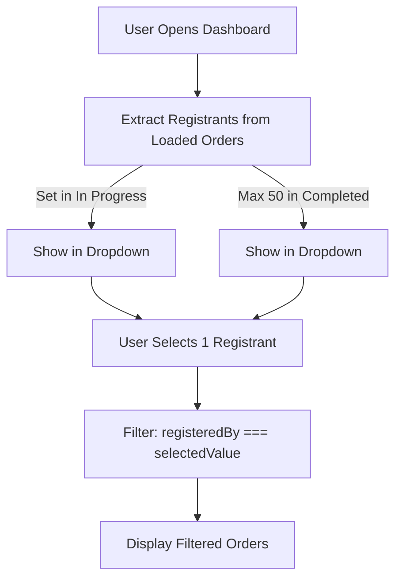
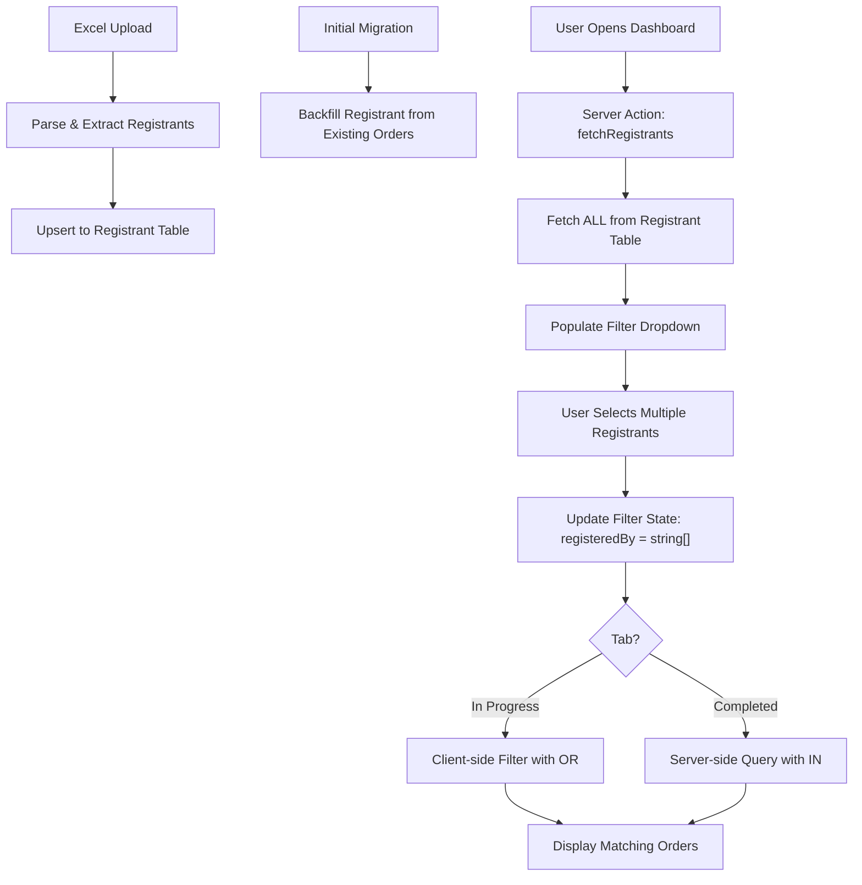
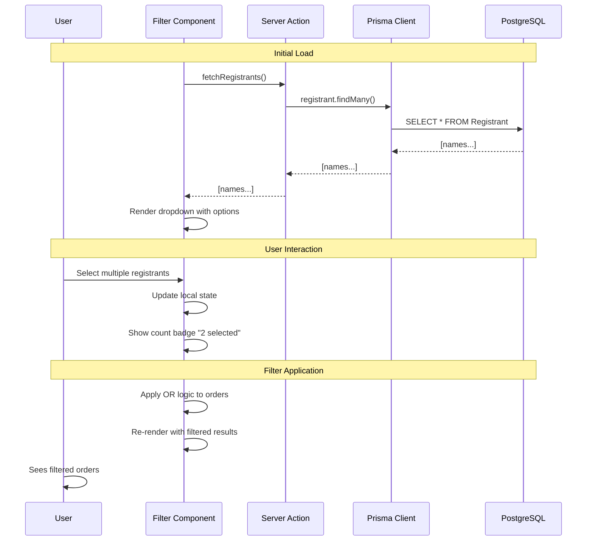
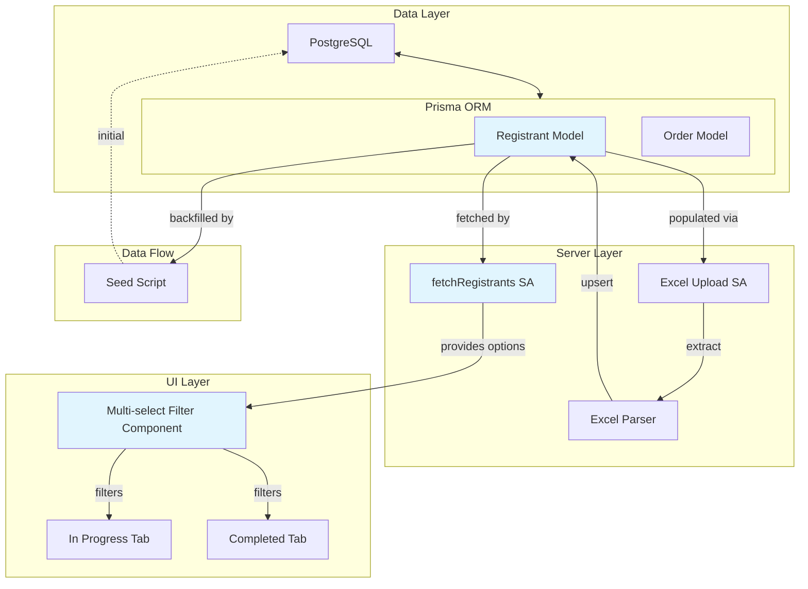

# Phase 0: Analysis & Design — US-1.2.7

**Multi-Select Registered By Filter with Dedicated Lookup Table**

**Status**: Analysis Complete | **Branch**: feature/sgs-cs-helper-us-1.2.7

---

## 0.1 Request Analysis / Phân tích Yêu cầu

### Problem Statement / Vấn đề

**EN:** The Order Dashboard's "Registered By" filter currently supports only single-select. The filter datasource is extracted from loaded orders on each tab, creating gaps:
- Users cannot filter by multiple registrants at once
- Registrants appearing only on other pages are never discovered (In Progress uses `Set` extraction; Completed limited to 50 per page)
- Inconsistent data availability between tabs

**VI:** Bộ lọc "Registered By" của Order Dashboard hiện chỉ hỗ trợ single-select. Nguồn dữ liệu được trích xuất từ các đơn đã tải trên mỗi tab, tạo ra khoảng trống:
- Người dùng không thể lọc theo nhiều người đăng ký cùng lúc
- Người đăng ký chỉ xuất hiện ở các trang khác không bao giờ được phát hiện
- Dữ liệu có sẵn không nhất quán giữa các tab

### Context / Ngữ cảnh

| Aspect / Khía cạnh | Current / Hiện tại | Desired / Mong muốn |
|--------|-------------|---------------------|
| **Filter Type** | Single-select (Select dropdown) | Multi-select (Popover + Command combobox) |
| **Datasource** | Client-side `Set` extraction from loaded orders | Dedicated `Registrant` lookup table |
| **Data Completeness** | Incomplete (pagination gaps) | Complete (all registrants available) |
| **Filter UI** | One choice at a time | Multiple choices with count badge |
| **Filter Logic** | Single value match | OR logic (match ANY selected) |

### Gap Analysis / Phân tích Khoảng cách

- **Missing Feature**: Multi-select capability on "Registered By" filter
- **Data Gap**: No authoritative registrant datasource — extracted ad-hoc from orders
- **UX Gap**: Users can't see all available registrants due to pagination limits
- **Consistency Gap**: In Progress and Completed tabs have different extraction approaches

### Affected Areas / Vùng Ảnh hưởng

| Root | Component | Impact / Ảnh hưởng |
|------|-----------|--------|
| **sgs-cs-helper** | Database Schema (Prisma) | Add `Registrant` model with `name @unique` |
| **sgs-cs-helper** | Excel Upload Logic | Extract & upsert registrants during upload |
| **sgs-cs-helper** | Seed Script | Backfill `Registrant` from existing orders |
| **sgs-cs-helper** | API / Server Action | Fetch all registrants for filter dropdown |
| **sgs-cs-helper** | In Progress Tab UI | Change single-select to multi-select |
| **sgs-cs-helper** | Completed Tab UI | Change single-select to multi-select |
| **sgs-cs-helper** | Types | Update `OrderFilters`: `registeredBy: string` → `string[]` |
| **sgs-cs-helper** | Filter Logic | Implement OR logic for multiple selections |

### Open Questions / Câu hỏi Mở

> ✅ No open questions — all requirements captured from US-1.2.7 specification and product checklist.

### Assumptions / Giả định

1. **Excel Upload Logic is Extensible**
   - EN: Current Excel upload upsert flow can be extended to populate `Registrant` table without major refactoring.
   - VI: Luồng upsert Excel hiện tại có thể mở rộng để điền bảng `Registrant`.

2. **Prisma Migration Available**
   - EN: Can use `pnpm prisma migrate` to create `Registrant` table schema safely.
   - VI: Có thể dùng Prisma migrate để tạo schema bảng `Registrant`.

3. **UI Component Reuse**
   - EN: Using same multi-select component for both tabs simplifies maintenance.
   - VI: Tái sử dụng cùng một thành phần multi-select cho cả hai tab.

4. **OrderFilters Type is Central**
   - EN: `OrderFilters` type is the single source of truth for filter shape across UI and queries.
   - VI: Loại `OrderFilters` là nguồn thực của sự thật cho hình dạng bộ lọc.

---

## 0.2 Solution Research / Nghiên cứu Giải pháp

### Existing Filter Patterns Found / Pattern Hiện có

| Location | Pattern | Applicable | Notes |
|----------|---------|------------|-------|
| **`src/components/orders/order-filters.tsx`** | Single-select Filter Component | ✅ Yes (migrate to multi-select) | shadcn Select + Input for date range. Handles `registeredBy` as `string`, `requiredDateFrom`/To as `string`. Clear filters button. |
| **`src/hooks/use-order-controls.ts`** | Client-side Filter & Sort Hook | ✅ Yes (extend type) | Manages filter state, applies filters with AND logic, handles sort and search. Currently filters by `registeredBy === value`. Will need to support array. |
| **`src/components/orders/realtime-orders.tsx`** | In Progress Tab + Order Extraction | ✅ Yes (replace Set extraction) | Uses `useMemo` with `new Set<string>()` to extract unique registrants from loaded orders. Will call Server Action instead. |
| **`src/components/orders/completed-orders.tsx`** | Completed Tab + Order Extraction | ✅ Yes (replace Set extraction) | Similar pattern to In Progress. Extracts registrants from current page only (max 50). Will call Server Action instead. |
| **`src/lib/actions/order.ts`** | Server Actions for Order Operations | ✅ Yes (extend for registrants fetch) | Contains `createOrders` (batch), handles Prisma upsert. Will add `fetchRegistrants` Server Action here. |
| **`src/lib/excel/parser.ts`** | Excel Parsing Logic | ✅ Yes (integrate registrant extraction) | Parses Excel file, extracts unique registrants. Can be extended to call upsert during upload. |
| **`prisma/schema.prisma`** | Database Schema | ✅ Yes (add Registrant model) | Defines User, Order, Config models. Will add `Registrant` model with `name String @unique`. |
| **`prisma/seed.ts`** | Database Seed Script | ✅ Yes (add registrant seed) | Seeds super admin and initial config. Will add registrant backfill from existing orders. |

### Similar Implementations / Triển khai Tương tự

| Location | What it does | Learnings |
|----------|--------------|-----------|
| **`src/components/orders/order-filters.tsx`** | Single-select filter using shadcn `Select` component | Can reuse structure, swap component to support multi-select via Popover + Command pattern |
| **`src/hooks/use-order-controls.ts`** | Filter logic with `useMemo` + `filter()` | When `registeredBy` becomes array, update from `order.registeredBy === filters.registeredBy` to `filters.registeredBy.includes(order.registeredBy)` |
| **`src/components/orders/realtime-orders.tsx`** | Using `useMemo` with `new Set()` to extract unique values | Replace this client-side extraction with Server Action call to fetch from dedicated `Registrant` table |
| **`src/lib/actions/upload.ts`** | Server Action pattern for file operations | Use similar pattern for `fetchRegistrants` Server Action |
| **`src/lib/actions/order.ts`** | Using Prisma `.upsert()` for batch operations | When inserting registrants during upload, use same `.upsert()` pattern with `where: { name }, update: {}, create: { name }` |

### Dependencies / Phụ thuộc

| Dependency | Purpose | Status |
|------------|---------|--------|
| **shadcn/ui** (Popover, Command) | Multi-select UI component | ✅ Existing (used elsewhere) |
| **Prisma ORM** | Database schema + queries | ✅ Existing (already in use) |
| **NextAuth.js** | Server Action authentication | ✅ Existing (auth system in place) |
| **Next.js Server Components** | Data fetching for filter dropdown | ✅ Existing (used in app router) |
| **React hooks** (`useState`, `useMemo`, `useCallback`) | Client-side state management | ✅ Existing |
| **xlsx library** | Excel parsing (registrant extraction) | ✅ Existing (already parsing Excel) |

### Reusable Components / Component Tái sử dụng

- ✅ **`OrderFiltersComponent`** — Adapt from single-select to multi-select (same file)
- ✅ **`useOrderControls` hook** — Extend filter type and logic
- ✅ **Prisma Upsert Pattern** — Use for registrant insertion
- ✅ **Server Action Pattern** — Already established, reuse for registrants fetch

### New Components Needed / Component Cần tạo Mới

| Component | Location | Purpose |
|-----------|----------|---------|
| **Multi-select Filter UI** | `src/components/orders/order-filters.tsx` (modify) | Replace Select with Popover + Command pattern for multi-select |
| **`fetchRegistrants` Server Action** | `src/lib/actions/order.ts` (add) | Fetch all registrants from `Registrant` table |
| **`Registrant` Prisma Model** | `prisma/schema.prisma` (add) | New lookup table |
| **Seed/Migration Script** | `prisma/seed.ts` (enhance) | Backfill `Registrant` from existing orders |
| **Registrant Extraction Logic** | `src/lib/excel/parser.ts` (enhance) | Extract unique registrants during parsing |

### Cross-Root Dependencies / Phụ thuộc Đa Root

> ✅ **None** — This work is entirely within **sgs-cs-helper** root. No cross-root dependencies.

---

## 0.3 Solution Design / Thiết kế Giải pháp

### Solution Overview / Tổng quan Giải pháp

**EN:** Create a dedicated `Registrant` lookup table populated during Excel upload and backfilled from existing orders. Update "Registered By" filters on both tabs to multi-select using Popover + Command (combobox) pattern, backed by Server Action fetching from `Registrant` table. This ensures all registrants are discoverable and filters work consistently across tabs.

**VI:** Tạo bảng tra cứu `Registrant` được điền trong quá trình tải lên Excel và backfill từ các đơn hiện có. Cập nhật bộ lọc "Registered By" trên cả hai tab thành multi-select sử dụng mẫu Popover + Command, được hỗ trợ bởi Server Action lấy từ bảng `Registrant`. Điều này đảm bảo tất cả người đăng ký có thể khám phá được và các bộ lọc hoạt động nhất quán trên các tab.

### Approach Comparison / So sánh Phương pháp

| Approach | Pros | Cons | Verdict |
|----------|------|------|---------|
| **✅ Selected: Dedicated `Registrant` Table** | Complete datasource, always up-to-date, consistent across tabs, supports pagination | Requires migration, seed script, extra model | ✅ Selected — ensures data integrity |
| **Alternative 1: Fetch from Order.registeredBy DISTINCT** | Lightweight, no extra table | Still depends on loaded orders, pagination gaps remain | ❌ Rejected — doesn't solve pagination gap |
| **Alternative 2: Client-side Multi-select with Set** | Quick implementation | Pagination gaps remain, incomplete data | ❌ Rejected — doesn't solve core problem |

### Components / Các Component

| # | Name | Root | Purpose / Mục đích |
|---|------|------|---------|
| 1 | **`Registrant` Model** | sgs-cs-helper | EN: Database table for all known registrant names / VI: Bảng cơ sở dữ liệu cho tất cả tên người đăng ký |
| 2 | **Seed/Migration Script** | sgs-cs-helper | EN: Backfill `Registrant` from existing orders / VI: Backfill `Registrant` từ các đơn hiện có |
| 3 | **`fetchRegistrants` Server Action** | sgs-cs-helper | EN: Fetch all registrants for filter dropdown / VI: Lấy tất cả người đăng ký cho bộ lọc |
| 4 | **Multi-select Filter Component** | sgs-cs-helper | EN: Popover + Command UI for selecting multiple registrants / VI: UI để chọn nhiều người đăng ký |
| 5 | **Filter Logic Update** | sgs-cs-helper | EN: Client & server-side filtering with array support & OR logic / VI: Logic lọc client & server-side |
| 6 | **Type Updates** | sgs-cs-helper | EN: Update `OrderFilters` type from string to string[] / VI: Cập nhật loại `OrderFilters` |

### Component Details / Chi tiết Component

#### Component 1: `Registrant` Prisma Model

| Aspect | Detail |
|--------|--------|
| **Root** | sgs-cs-helper |
| **Location** | `prisma/schema.prisma` |
| **Purpose** | EN: Authoritative lookup table for all known registrant names / VI: Bảng tra cứu có thẩm quyền cho tất cả tên người đăng ký |
| **Inputs** | None (populated via upsert during upload + seed) |
| **Outputs** | `Registrant` records with `id` (cuid) and `name` (unique) |
| **Dependencies** | None |

**Schema:**
```prisma
model Registrant {
  id        String   @id @default(cuid())
  name      String   @unique
  createdAt DateTime @default(now())
  
  @@index([name])
}
```

---

#### Component 2: Seed/Migration Script

| Aspect | Detail |
|--------|--------|
| **Root** | sgs-cs-helper |
| **Location** | `prisma/seed.ts` (enhance existing) |
| **Purpose** | EN: Backfill `Registrant` table from existing Order.registeredBy values / VI: Backfill bảng `Registrant` từ giá trị Order.registeredBy hiện có |
| **Inputs** | Existing database with orders |
| **Outputs** | `Registrant` records created in database |
| **Triggers** | Initial migration, can be re-run safely |

**Logic:**
```prisma
SELECT DISTINCT registeredBy 
FROM "Order" 
WHERE registeredBy IS NOT NULL 
ORDER BY registeredBy
```

Then for each registrant:
```typescript
await prisma.registrant.upsert({
  where: { name: registeredBy },
  update: {},
  create: { name: registeredBy }
})
```

---

#### Component 3: `fetchRegistrants` Server Action

| Aspect | Detail |
|--------|--------|
| **Root** | sgs-cs-helper |
| **Location** | `src/lib/actions/order.ts` (add function) |
| **Purpose** | EN: Fetch all registrants from `Registrant` table for filter dropdown / VI: Lấy tất cả người đăng ký từ bảng `Registrant` cho bộ lọc |
| **Inputs** | None (or optional userId for auth check) |
| **Outputs** | `string[]` array of registrant names, sorted |
| **Dependencies** | Prisma client, NextAuth session |

**Implementation:**
```typescript
export async function fetchRegistrants(): Promise<string[]> {
  const registrants = await prisma.registrant.findMany({
    select: { name: true },
    orderBy: { name: 'asc' },
  });
  return registrants.map(r => r.name);
}
```

---

#### Component 4: Multi-select Filter Component

| Aspect | Detail |
|--------|--------|
| **Root** | sgs-cs-helper |
| **Location** | `src/components/orders/order-filters.tsx` (modify) |
| **Purpose** | EN: UI for selecting multiple registrants with count badge / VI: UI cho chọn nhiều người đăng ký |
| **Inputs** | `filters: { registeredBy: string[] }`, `registrants: string[]`, `onFiltersChange` callback |
| **Outputs** | Updated filter state on selection change |
| **Dependencies** | shadcn/ui (Popover, Command, Button, Badge), React hooks |

**UI Pattern:**
- Popover button showing selected count ("2 selected" or "Registered By")
- Command component for searchable dropdown
- Checkboxes for multi-select
- Clear individual or all options
- Close on escape

---

#### Component 5: Filter Logic Update

| Aspect | Detail |
|--------|--------|
| **Root** | sgs-cs-helper |
| **Location** | `src/hooks/use-order-controls.ts` (modify) + `src/components/orders/completed-orders.tsx` (modify) |
| **Purpose** | EN: Apply multi-select filter with OR logic / VI: Áp dụng bộ lọc multi-select với logic OR |
| **Client-side** (In Progress Tab) | `filters.registeredBy.includes(order.registeredBy)` |
| **Server-side** (Completed Tab) | Prisma: `where: { registeredBy: { in: filters.registeredBy } }` |

**Client Logic:**
```typescript
// Old: filters.registeredBy && order.registeredBy === filters.registeredBy
// New:
if (filters.registeredBy.length > 0) {
  result = result.filter(order => 
    filters.registeredBy.includes(order.registeredBy)
  );
}
```

**Server Logic:**
```typescript
const orders = await prisma.order.findMany({
  where: {
    ...(filters.registeredBy.length > 0 && {
      registeredBy: { in: filters.registeredBy }
    })
  }
});
```

---

#### Component 6: Type Updates

| Aspect | Detail |
|--------|--------|
| **Root** | sgs-cs-helper |
| **Location** | `src/types/orders.ts` or `src/components/orders/order-filters.tsx` |
| **Purpose** | EN: Update `OrderFilters` type to support array / VI: Cập nhật loại `OrderFilters` để hỗ trợ mảng |
| **Old** | `registeredBy: string` |
| **New** | `registeredBy: string[]` |

---

### Data Flow / Luồng Dữ liệu

| Step | From | To | Data | Action |
|------|------|----|------|--------|
| **1** | Excel Upload | Parser | registeredBy values | Extract unique registrants |
| **2** | Parser | `Registrant` table | `{ name }` | Upsert registrant if not exists |
| **3** | Component Mount | `fetchRegistrants` SA | None | Fetch all registrants |
| **4** | Server Action | Component | `string[]` | Populate filter dropdown |
| **5** | User | Filter UI | Selected registrants | Update filter state |
| **6** | Filter State | Order List (In Progress) | `string[]` | Client-side filter with OR logic |
| **6b** | Filter State | Completed Endpoint | `{ registeredBy: { in: [...] } }` | Server-side query |
| **7** | Filtered Orders | Table | Display | Show matching orders |

### Error Handling / Xử lý Lỗi

| Scenario | Handling | User Impact |
|----------|----------|-------------|
| **Fetch registrants fails** | EN: Show empty dropdown, disable filter / VI: Hiển thị dropdown trống, vô hiệu hóa bộ lọc | Filter unavailable, can still view all orders |
| **Registrant extraction during upload fails** | EN: Log error, skip registrant upsert, continue with order creation / VI: Ghi nhật ký lỗi, bỏ qua upsert, tiếp tục tạo đơn | Orders still created, registrant list may be incomplete |
| **Registrant name is NULL** | EN: Ignore in extraction, don't add to table / VI: Bỏ qua trong trích xuất | Only non-NULL registrants in filter |
| **Server-side query fails** | EN: Show error toast, fallback to empty list / VI: Hiển thị lỗi, fallback danh sách trống | User informed, can retry |

### Rollback Plan / Kế hoạch Rollback

**EN:**
1. Drop `Registrant` table via Prisma migration
2. Revert `OrderFilters` type to `registeredBy: string`
3. Restore filter component to single-select (UI commit)
4. Restore filter logic to single-value match
5. Run migration rollback: `pnpm prisma migrate resolve --rolled-back <migration-name>`

**VI:**
1. Xóa bảng `Registrant` qua Prisma migration
2. Hoàn nguyên loại `OrderFilters` thành `registeredBy: string`
3. Khôi phục thành phần bộ lọc thành single-select
4. Khôi phục logic bộ lọc thành khớp giá trị đơn
5. Chạy rollback migration

---

## 0.4 Diagrams / Biểu đồ

### Flow Overview / Tổng quan Luồng

**Current Flow (Single-Select):**



**Proposed Flow (Multi-Select with Lookup Table):**



---

### Sequence Diagram / Sơ đồ Tuần tự



---

### Architecture Diagram / Sơ đồ Kiến trúc



---

## Key Decisions / Quyết định Chính

| ID | Decision | Rationale / Lý do | Status |
|----|----------|---------|--------|
| **D-001** | Create dedicated `Registrant` lookup table | Ensures complete, authoritative datasource independent of pagination | ✅ Approved |
| **D-002** | Populate `Registrant` during Excel upload (upsert) | Integrates seamlessly into existing upload flow, keeps registrants up-to-date | ✅ Approved |
| **D-003** | Backfill from existing orders in seed script | Handles legacy data, ensures all registrants discoverable from day 1 | ✅ Approved |
| **D-004** | Use Server Action to fetch registrants | Type-safe, follows project patterns, single source of truth | ✅ Approved |
| **D-005** | Use Popover + Command for multi-select UI | Matches shadcn/ui conventions used in project, excellent UX for multi-select | ✅ Approved |
| **D-006** | OR logic for multiple selections | Matches user expectation (show orders from ANY selected registrant), more flexible than AND | ✅ Approved |
| **D-007** | Update `OrderFilters` type to `string[]` | Clean, explicit API for filter state, easier to test | ✅ Approved |

---

## Risks & Mitigations / Rủi ro & Giảm thiểu

| Risk | Impact | Probability | Mitigation |
|------|--------|-------------|-----------|
| **Seed script slow with large dataset** | Deploy time > threshold | Medium | Batch inserts, use `createMany` instead of loops |
| **Registrant table not synced if upload fails** | Incomplete registrant list | Low | Wrap upload + upsert in transaction |
| **Breaking change to `OrderFilters` type** | TypeScript errors in other components | High | Update all consuming components in same PR |
| **NULL registeredBy values** | Filters include NULL as option | Low | Filter out NULLs in seed + extraction logic |
| **Registrants table grows large** | Query performance degrades | Very Low | Add index on `name`, it's already indexed |
| **API change in mid-project** | Refactoring required | Very Low | All requirements from user story, stable |

---

## ⏸️ Phase 0 Complete / Hoàn thành Phase 0

### Summary / Tóm tắt

| Aspect | Value |
|--------|-------|
| **Problem** | Single-select "Registered By" filter with incomplete datasource due to pagination |
| **Solution** | Dedicated `Registrant` lookup table + multi-select UI with Server Action |
| **Components** | 6 components (model, seed, SA, UI, logic, types) |
| **Diagrams** | 3 diagrams (flow, sequence, architecture) |
| **Affected Roots** | 1 root (sgs-cs-helper) — no cross-root dependencies |
| **Complexity** | Medium (schema change + UI update + data flow) |

### Artifacts Created / Artifact Đã tạo

✅ **Solution Design Document** (this file)  
✅ **Flow Overview Diagram** — Current vs Proposed  
✅ **Sequence Diagram** — User interactions & data flow  
✅ **Architecture Diagram** — Component relationships  
✅ **Decision Log** — Key decisions with rationale  
✅ **Risk Analysis** — Mitigation strategies  

### Next Steps (EXPLICIT PROMPTS REQUIRED)

**To approve and proceed to Phase 1 Specification:**

```
approved
```

Or run explicitly:

```
/phase-1-spec
```

---

**Ready for Phase 1: Specification & Requirements.**

Do NOT use generic commands like `go` or `continue`.  
KHÔNG dùng lệnh chung như `go` hoặc `continue`.

---

**Phase**: Analysis & Design | **Status**: Complete  
**Generated**: 2026-02-10 | **Branch**: feature/sgs-cs-helper-us-1.2.7
