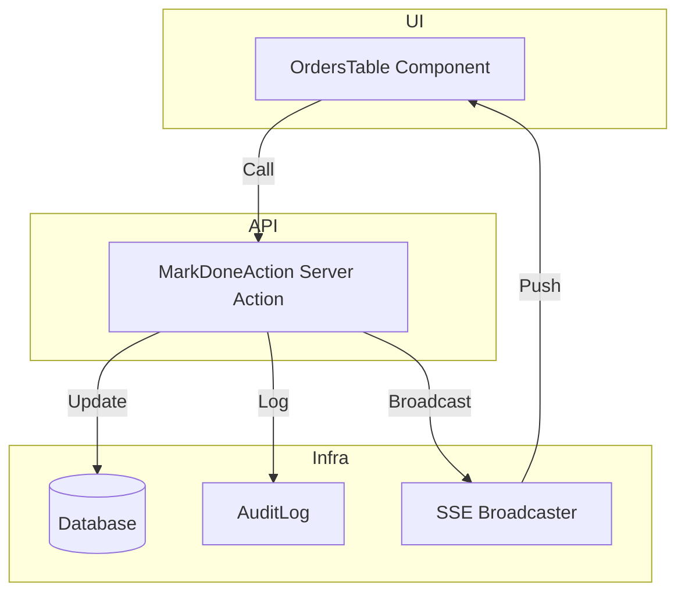

# Architecture Change: Mark Order as Done

## System Changes Visualization

## Notes
- UI: orders-table.tsx gets new button and modal
- API: New/updated server action for marking done
- Infra: SSE and AuditLog utilities used
