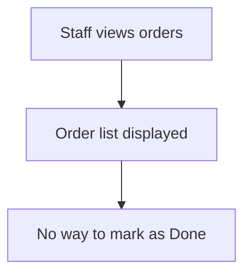
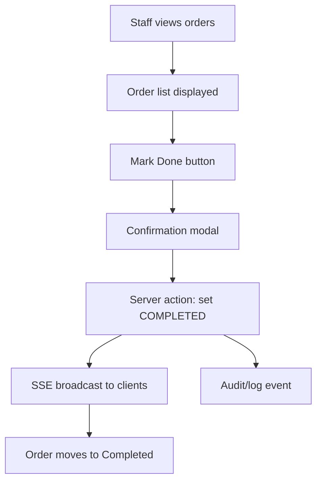

# Flow Overview / Tổng quan Luồng

## Current Flow / Luồng Hiện tại

## Proposed Flow / Luồng Đề xuất

## Changes Highlighted / Thay đổi Nổi bật
- Added: Mark Done button, confirmation modal, server action, SSE update, audit/log util
- Modified: OrderRow, API, SSE broadcaster
- Removed: N/A
