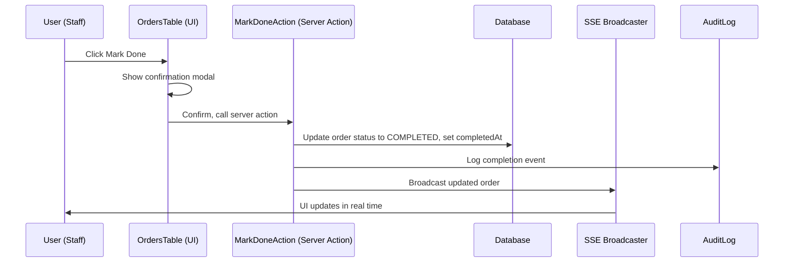

# Sequence: Mark Order as Done

## Notes / Ghi chú
- Step 1: User clicks button, modal shown
- Step 2: On confirm, server action updates DB, logs event, broadcasts SSE
- Step 3: UI updates for all clients
