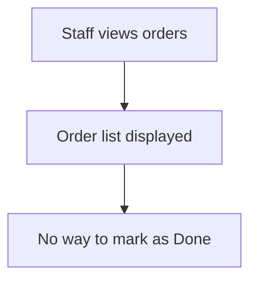
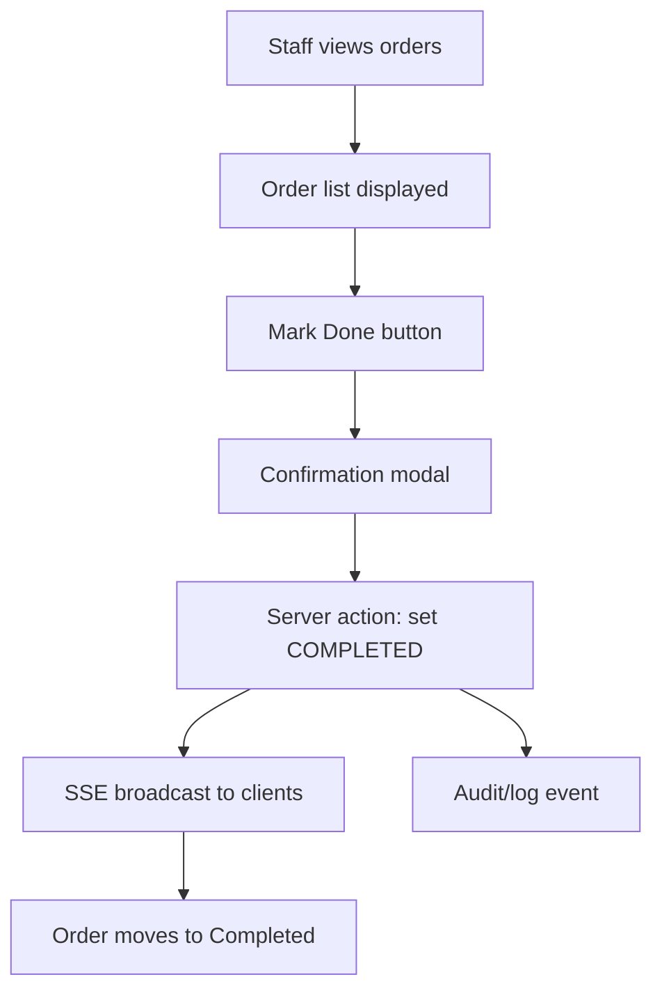

# 00_analysis/solution-design.md

## 0.1 Request Analysis / Phân tích Yêu cầu

### Problem Statement / Vấn đề
**EN:** Staff need to be able to mark an order as Done so that completed work is tracked, visible to all users in real time, and auditable for manual testing. The current system does not allow marking orders as completed from the UI.
**VI:** Nhân viên cần có thể đánh dấu đơn là Hoàn thành để công việc đã xong được theo dõi, hiển thị realtime cho tất cả người dùng, và có thể kiểm tra thủ công. Hệ thống hiện tại chưa cho phép đánh dấu hoàn thành từ UI.

### Context / Ngữ cảnh

| Aspect           | Current / Hiện tại                                 | Desired / Mong muốn                                      |
|------------------|---------------------------------------------------|----------------------------------------------------------|
| Behavior         | Orders can be viewed and filtered by status.       | Orders can be marked as Done (COMPLETED) from the UI.    |
| Data flow        | Status changes only via backend or import.         | Status can be changed to COMPLETED by staff action.      |
| User experience  | No way to mark as Done; no confirmation.           | "Mark Done" button with confirmation modal, real-time UI update, audit/log for test. |

### Gap Analysis / Phân tích Khoảng cách
- EN: No UI for marking orders as Done; no confirmation or audit for completion. / VI: Chưa có UI để đánh dấu hoàn thành; chưa có xác nhận hoặc log khi hoàn thành.
- EN: Need to add button, confirmation, server-side status change, SSE update, and audit/log. / VI: Cần thêm nút, xác nhận, cập nhật trạng thái phía server, SSE, và log/audit.

### Affected Areas / Vùng Ảnh hưởng

| Root         | Component/Module                | Impact                                      |
|--------------|---------------------------------|---------------------------------------------|
| sgs-cs-helper| Orders List, Order Row, API     | Add button, modal, server action, SSE, log  |
| sgs-cs-helper| SSE Broadcaster                 | Ensure real-time update on status change    |
| sgs-cs-helper| Audit/Log (for manual test)     | Record completion event (minimal UI impact) |

### Open Questions / Câu hỏi Mở
1. EN: None (all clarified with user) / VI: Không còn (đã xác nhận với user)

### Assumptions / Giả định
1. EN: SSE infra is working; user has permission to update status. / VI: SSE hoạt động; user có quyền cập nhật trạng thái
2. EN: Audit/log is for manual test, not for end-user UI. / VI: Log/audit chỉ phục vụ test thủ công, không ảnh hưởng UI

---

## 0.2 Solution Research / Nghiên cứu Giải pháp

### Existing Patterns Found / Pattern Có sẵn

| Location                                   | Pattern                                  | Applicable | Notes |
|---------------------------------------------|------------------------------------------|------------|-------|
| src/app/(orders)/page.tsx                   | Orders list, status display              | Yes        | Main UI for orders, can add button here |
| src/app/api/orders/                        | API routes for order mutation            | Yes        | Server action for status change         |
| src/lib/sse/broadcaster.ts                  | SSE broadcast utility                    | Yes        | Used for real-time updates              |
| src/components/orders/orders-table.tsx      | Orders table UI                          | Yes        | Add button/modal here                   |
| src/lib/audit/ (if exists, else new)        | Audit/log utility                        | No         | May need to create minimal log util     |

### Similar Implementations / Triển khai Tương tự

| Location                        | What it does                        | Learnings |
|----------------------------------|-------------------------------------|-----------|
| src/app/(orders)/upload.tsx      | Handles order upload, status change | EN: Server action pattern for mutation / VI: Pattern cập nhật trạng thái |
| src/lib/sse/broadcaster.ts       | Broadcasts order changes            | EN: Use after mutation / VI: Dùng sau khi cập nhật |

### Dependencies / Phụ thuộc

| Dependency      | Purpose                        | Status     |
|-----------------|-------------------------------|------------|
| next.js         | App framework                  | Existing   |
| prisma          | DB access                      | Existing   |
| zod             | Validation                     | Existing   |
| SSE             | Real-time updates              | Existing   |
| audit/log util  | Manual test logging            | To add     |

### Cross-Root Dependencies / Phụ thuộc Đa Root

| From         | To           | Type           | Impact |
|--------------|--------------|----------------|--------|
| N/A          | N/A          | N/A            | None   |

### Reusable Components / Component Tái sử dụng
- src/lib/sse/broadcaster.ts: EN: SSE broadcast utility / VI: Tiện ích SSE
- src/app/api/orders/: EN: API route pattern / VI: Pattern API

### New Components Needed / Component Cần tạo Mới
- EN: Minimal audit/log util for manual test / VI: Tiện ích log/audit đơn giản cho test thủ công
- EN: Confirmation modal for "Mark Done" / VI: Modal xác nhận cho "Đánh dấu Hoàn thành"

---

## 0.3 Solution Design / Thiết kế Giải pháp

### Solution Overview / Tổng quan Giải pháp
**EN:** Add a "Mark Done" button to each in-progress order row. When clicked, show a confirmation modal. On confirm, call a server action to update the order status to COMPLETED and set completedAt (server time, Vietnam timezone). After mutation, broadcast the update via SSE to all clients. Log the completion event for manual test (minimal UI impact). Button is disabled for completed orders.
**VI:** Thêm nút "Đánh dấu Hoàn thành" cho mỗi đơn đang xử lý. Khi click, hiển thị modal xác nhận. Xác nhận sẽ gọi server action cập nhật trạng thái đơn sang COMPLETED và set completedAt (giờ server, múi giờ Việt Nam). Sau khi cập nhật, broadcast qua SSE cho tất cả client. Ghi log sự kiện hoàn thành để test thủ công (không ảnh hưởng UI). Nút bị vô hiệu hóa cho đơn đã hoàn thành.

### Approach Comparison / So sánh Phương pháp

| Approach                | Pros                                         | Cons                        | Verdict |
|-------------------------|----------------------------------------------|-----------------------------|---------|
| **Chosen: Button+Modal**| Clear UX, explicit confirmation, safe update | Slightly more UI work       | ✅ Selected |
| Inline toggle           | Fast, minimal UI                            | Risk of accidental changes  | ❌ Rejected: No confirmation |
| API-only (no UI)        | Simple, backend only                        | Not user-friendly           | ❌ Rejected: Not usable for staff |

### Components / Các Component

| # | Name                | Root         | Purpose |
|---|---------------------|--------------|---------|
| 1 | OrdersTable         | sgs-cs-helper| EN: Orders table UI, add button+modal / VI: UI bảng đơn, thêm nút+modal |
| 2 | MarkDoneAction      | sgs-cs-helper| EN: Server action to update status / VI: Server action cập nhật trạng thái |
| 3 | SSE Broadcaster     | sgs-cs-helper| EN: Push real-time updates / VI: Đẩy cập nhật realtime |
| 4 | AuditLog (new util) | sgs-cs-helper| EN: Log completion for manual test / VI: Log hoàn thành cho test thủ công |

### Component Details / Chi tiết Component

#### Component 1: OrdersTable
| Aspect      | Detail |
|-------------|--------|
| Root        | sgs-cs-helper |
| Location    | src/components/orders/orders-table.tsx |
| Purpose     | EN: Display orders table, add Mark Done button+modal / VI: Hiển thị bảng đơn, thêm nút+modal |
| Inputs      | order, user session |
| Outputs     | UI events |
| Dependencies| MarkDoneAction, SSE Broadcaster |

#### Component 2: MarkDoneAction
| Aspect      | Detail |
|-------------|--------|
| Root        | sgs-cs-helper |
| Location    | src/app/api/orders/mark-done.ts (or similar) |
| Purpose     | EN: Server action to set status+completedAt / VI: Server action cập nhật trạng thái+completedAt |
| Inputs      | orderId, user session |
| Outputs     | updated order |
| Dependencies| prisma, SSE Broadcaster, AuditLog |

#### Component 3: SSE Broadcaster
| Aspect      | Detail |
|-------------|--------|
| Root        | sgs-cs-helper |
| Location    | src/lib/sse/broadcaster.ts |
| Purpose     | EN: Broadcast order update / VI: Broadcast cập nhật đơn |
| Inputs      | updated order |
| Outputs     | SSE event |
| Dependencies| - |

#### Component 4: AuditLog
| Aspect      | Detail |
|-------------|--------|
| Root        | sgs-cs-helper |
| Location    | src/lib/audit/log.ts (new) |
| Purpose     | EN: Log completion for manual test / VI: Log hoàn thành cho test thủ công |
| Inputs      | orderId, userId, timestamp |
| Outputs     | log entry |
| Dependencies| - |

### Data Flow / Luồng Dữ liệu

| Step | From         | To              | Data                | Action |
|------|--------------|-----------------|---------------------|--------|
| 1    | User         | OrdersTable     | Click event         | Show modal |
| 2    | OrdersTable  | MarkDoneAction  | orderId             | Call server action |
| 3    | MarkDoneAction| prisma, AuditLog| order update, log   | Update DB, log event |
| 4    | MarkDoneAction| SSE Broadcaster | updated order       | Broadcast update |
| 5    | SSE Broadcaster| All clients    | SSE event           | UI updates |

### Error Handling / Xử lý Lỗi

| Scenario                        | Handling                                         | User Impact |
|----------------------------------|--------------------------------------------------|-------------|
| Server error on update           | Show error toast, do not change UI               | User sees error |
| SSE fails                        | UI may not update in real time, manual refresh   | User may need to refresh |
| Audit/log write fails            | Log warning, do not block main flow              | No user impact |
| User tries to mark already done  | Button disabled, no action                       | No effect |

### Rollback Plan / Kế hoạch Rollback
**EN:** If issues arise, revert UI and server action changes, remove audit/log util, and restore previous order status logic.
**VI:** Nếu có vấn đề, hoàn tác thay đổi UI và server action, xóa tiện ích log/audit, khôi phục logic trạng thái đơn trước đó.

---

# 0.4 Diagrams

## Flow Overview / Tổng quan Luồng

### Current Flow / Luồng Hiện tại

### Proposed Flow / Luồng Đề xuất

## Changes Highlighted / Thay đổi Nổi bật
- Added: Mark Done button, confirmation modal, server action, SSE update, audit/log util
- Modified: orders-table.tsx, API, SSE broadcaster
- Removed: N/A

---
