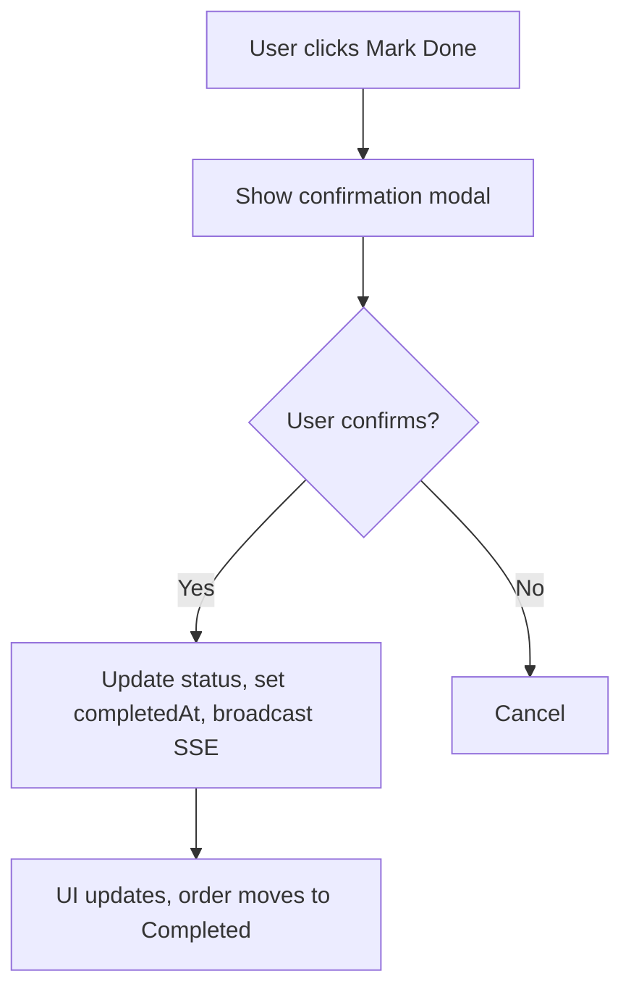

# Specification — Mark Order as Done
<!-- Template Version: 1.0 | Contract: v1.0 | Last Updated: 2026-02-01 -->
<!-- 🇻🇳 Vietnamese first, 🇬🇧 English follows — for easy scanning -->

---

## TL;DR

| Aspect | Value |
|--------|-------|
| Feature | Mark Order as Done |
| Status | Draft |
| Functional Requirements | 5 |
| Non-Functional Requirements | 4 |
| Affected Roots | sgs-cs-helper |

---

## 1. Overview

🇻🇳 Tính năng cho phép nhân viên đánh dấu đơn hàng là Hoàn thành từ giao diện, cập nhật trạng thái, thời gian hoàn thành, và hiển thị realtime cho tất cả người dùng. Đáp ứng yêu cầu kiểm thử thủ công qua log/audit.

🇬🇧 This feature allows staff to mark an order as Done from the UI, updating status, completion time, and reflecting changes in real time for all users. Supports manual test audit/logging.

---

## 2. Goals & Non-Goals

### Goals

🇻🇳
1. Cho phép đánh dấu đơn hàng là Hoàn thành từ UI.
2. Cập nhật trạng thái, completedAt, và hiển thị realtime.
3. Ghi log/audit cho kiểm thử thủ công.

🇬🇧
1. Allow marking orders as Done from the UI.
2. Update status, completedAt, and show real-time updates.
3. Log/audit for manual test.

### Non-Goals

🇻🇳
1. Không hoàn tác hoàn thành (US-1.3.3).
2. Không thay đổi giao diện phân biệt đơn hoàn thành (US-1.3.2).
3. Không thay đổi chức năng tạo/upload đơn.

🇬🇧
1. No undo of completion (US-1.3.3).
2. No visual distinction for completed orders (US-1.3.2).
3. No changes to order creation/upload.

---

## 3. User Stories

### US-1.3.1: Mark Order as Done

🇻🇳 Là nhân viên, tôi muốn đánh dấu đơn hàng là Hoàn thành từ giao diện, để công việc đã xong được ghi nhận và hiển thị realtime cho mọi người.

🇬🇧 As a staff member, I want to mark an order as Done from the UI, so that completed work is tracked and visible in real time to all users.

---

## 4. Requirements Matrix

| ID | Title | Priority | Type | Covered By |
|----|-------|----------|------|------------|
| FR-001 | Mark order as Done from UI | Must | Functional | TC-001 |
| FR-002 | Update order status and completedAt | Must | Functional | TC-002 |
| FR-003 | Real-time update via SSE | Must | Functional | TC-003 |
| FR-004 | Move to Completed filter | Should | Functional | TC-004 |
| FR-005 | Audit/log for manual test | Should | Functional | TC-005 |
| NFR-001 | Response time < 200ms | Must | Performance | TC-P01 |
| NFR-002 | Auth required for mutation | Must | Security | TC-S01 |
| NFR-003 | SSE reliability | Should | Scalability | TC-SC01 |
| NFR-004 | Maintainability | Should | Maintainability | TC-M01 |

---

## 5. Functional Requirements

### FR-001: Mark order as Done from UI

| Aspect | Detail |
|--------|--------|
| Priority | Must |
| Affected Roots | sgs-cs-helper |

#### Description

🇻🇳 Nhân viên có thể nhấn nút "Đánh dấu Hoàn thành" trên bảng đơn hàng cho các đơn đang xử lý. Có xác nhận trước khi thực hiện.

🇬🇧 Staff can click a "Mark Done" button in the orders table for in-progress orders. Confirmation required before action.

#### Acceptance Criteria

- [ ] AC1: Button only appears for in-progress orders.
- [ ] AC2: Confirmation modal shown before marking as Done.
- [ ] AC3: Action triggers server mutation and UI update.

---

### FR-002: Update order status and completedAt

| Aspect | Detail |
|--------|--------|
| Priority | Must |
| Affected Roots | sgs-cs-helper |

#### Description

🇻🇳 Khi xác nhận, trạng thái đơn chuyển sang COMPLETED, trường completedAt được ghi nhận thời gian hiện tại.

🇬🇧 On confirmation, order status changes to COMPLETED, and completedAt is set to current time.

#### Acceptance Criteria

- [ ] AC1: Status changes to COMPLETED in DB.
- [ ] AC2: completedAt is set in DB.
- [ ] AC3: Cannot mark again if already completed.

---

### FR-003: Real-time update via SSE

| Aspect | Detail |
|--------|--------|
| Priority | Must |
| Affected Roots | sgs-cs-helper |

#### Description

🇻🇳 Khi đơn được đánh dấu hoàn thành, tất cả client nhận được cập nhật realtime qua SSE.

🇬🇧 When an order is marked as Done, all clients receive a real-time update via SSE.

#### Acceptance Criteria

- [ ] AC1: SSE event is broadcast on completion.
- [ ] AC2: All connected clients update UI in real time.

---

### FR-004: Move to Completed filter

| Aspect | Detail |
|--------|--------|
| Priority | Should |
| Affected Roots | sgs-cs-helper |

#### Description

🇻🇳 Đơn hoàn thành tự động chuyển sang bộ lọc "Hoàn thành" trên UI.

🇬🇧 Completed orders automatically move to the "Completed" filter in the UI.

#### Acceptance Criteria

- [ ] AC1: Order appears in Completed filter after marking as Done.
- [ ] AC2: Order no longer appears in In Progress filter.

---

### FR-005: Audit/log for manual test

| Aspect | Detail |
|--------|--------|
| Priority | Should |
| Affected Roots | sgs-cs-helper |

#### Description

🇻🇳 Mỗi lần đánh dấu hoàn thành, ghi log/audit để kiểm thử thủ công. Không hiển thị cho end-user.

🇬🇧 Each completion event is logged/audited for manual test. Not shown to end-users.

#### Acceptance Criteria

- [ ] AC1: Log entry created for each completion.
- [ ] AC2: Log is accessible for manual test/audit.

---

## 6. Non-Functional Requirements

### NFR-001: Response time < 200ms

| Aspect | Detail |
|--------|--------|
| Category | Performance |
| Metric | 95% of requests < 200ms |
| Target | 95% |

#### Description

🇻🇳 Hệ thống phải phản hồi thao tác đánh dấu hoàn thành trong vòng 200ms với 95% trường hợp.

🇬🇧 The system must respond to mark-done actions within 200ms for 95% of cases.

---

### NFR-002: Auth required for mutation

| Aspect | Detail |
|--------|--------|
| Category | Security |
| Metric | Only authenticated staff can mark as Done |

#### Description

🇻🇳 Chỉ nhân viên đã đăng nhập mới được phép đánh dấu hoàn thành.

🇬🇧 Only authenticated staff may mark orders as Done.

---

### NFR-003: SSE reliability

| Aspect | Detail |
|--------|--------|
| Category | Scalability |
| Metric | 99% SSE delivery success |

#### Description

🇻🇳 Đảm bảo sự kiện SSE gửi thành công đến tất cả client đang kết nối.

🇬🇧 Ensure SSE events are delivered successfully to all connected clients.

---

### NFR-004: Maintainability

| Aspect | Detail |
|--------|--------|
| Category | Maintainability |
| Metric | Code follows project conventions |

#### Description

🇻🇳 Code tuân thủ chuẩn dự án, dễ bảo trì.

🇬🇧 Code follows project conventions and is maintainable.

---

## 7. User Flow

| Step | Action | System Response | Next Step |
|------|--------|-----------------|-----------|
| 1 | User clicks Mark Done | Show confirmation modal | 2 |
| 2 | User confirms | Update status, set completedAt, broadcast SSE | 3 |
| 3 | UI updates | Order moves to Completed filter | End |

### Flow Diagram



---

## 8. Data Models

```typescript
// Order entity (simplified)
interface Order {
  id: string;
  status: 'IN_PROGRESS' | 'COMPLETED' | ...;
  completedAt?: Date;
  // ...other fields
}
```

---

## 9. API Contracts

### POST /api/orders/[id]/mark-done

```typescript
// Request
interface MarkDoneRequest {
  id: string;
}

// Response (200)
interface MarkDoneResponse {
  status: 'success';
  data: { id: string; status: 'COMPLETED'; completedAt: string };
}

// Error Response
interface ErrorResponse {
  status: 'error';
  message: string;
  code: string;
}
```

---

## 10. Edge Cases

| ID | Scenario | Expected Behavior | Priority |
|----|----------|-------------------|----------|
| EC-001 | Order already completed | Cannot mark again, show message | Must handle |
| EC-002 | SSE delivery fails | Retry or log error, UI fallback | Should handle |
| EC-003 | DB update fails | Show error, no status change | Must handle |

### EC-001: Order already completed

🇻🇳
**Khi:** Đơn đã ở trạng thái COMPLETED
**Thì:** Không cho phép đánh dấu lại, hiển thị thông báo
**Lý do:** Tránh thao tác lặp, đảm bảo tính nhất quán

🇬🇧
**When:** Order is already COMPLETED
**Then:** Cannot mark again, show message
**Rationale:** Prevent duplicate actions, ensure consistency

---

## 11. Error Handling

| Error Condition | User Message | System Action |
|-----------------|--------------|---------------|
| Already completed | "Order is already completed" | No action |
| Not authorized | "You are not authorized" | Return 403 |
| Server error | "Something went wrong" | Log error, return 500 |

---

## 12. Cross-Root Impact

| Root | Changes | Sync Required |
|------|---------|---------------|
| sgs-cs-helper | UI, API, SSE, audit/log | No |

### Integration Points

🇻🇳 Tất cả thay đổi nằm trong root sgs-cs-helper. Không ảnh hưởng cross-root.

🇬🇧 All changes are within sgs-cs-helper root. No cross-root impact.

---

## 13. Dependencies

| Dependency | Type | Status |
|------------|------|--------|
| SSE infra | Internal | Existing |
| Auth system | Internal | Existing |
| Audit/log util | Internal | New (if not present) |

---

## 14. Risks & Assumptions

### Risks

| Risk | Impact | Mitigation |
|------|--------|------------|
| SSE not reliable | Medium | Retry, log errors |
| Staff misclick | Low | Confirmation modal |

### Assumptions

| # | Assumption | Validated |
|---|------------|-----------|
| 1 | SSE infra is working | Yes |
| 2 | User has permission | Yes |
| 3 | Audit/log is for manual test | Yes |

---

## 15. Open Questions

| # | Question | Status | Answer |
|---|----------|--------|--------|
| 1 | None (all clarified) | Resolved | N/A |

---

## 16. Notes

🇻🇳
- Đảm bảo code tuân thủ chuẩn dự án.
- Log/audit không ảnh hưởng UI end-user.

🇬🇧
- Ensure code follows project conventions.
- Log/audit does not affect end-user UI.

---

## Approval

| Role | Name | Status | Date |
|------|------|--------|------|
| Author | Copilot | ✅ Done | 2026-02-07 |
| Tech Reviewer |  | ⏳ Pending | |
| Product Owner |  | ⏳ Pending | |

---

## Next Step

🇻🇳 Sau khi phê duyệt, tiến hành **Phase 2: Task Planning**.

🇬🇧 After approval, proceed to **Phase 2: Task Planning**.

Reply: `approved` or `revise: <feedback>`
