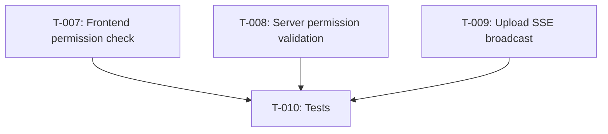

# Task Plan: Mark Order as Done (Update 1)
# Kế hoạch Task: Đánh dấu Hoàn thành (Cập nhật 1)

## 📋 TL;DR

| Aspect | Value |
|--------|-------|
| Feature | Permission checks + Upload SSE broadcast |
| Total Tasks | 4 |
| Estimated Effort | 3 hours |
| Affected Roots | sgs-cs-helper |
| Spec Reference | [spec-update-1.md](../01_spec/spec-update-1.md) |

---

## Task Overview / Tổng quan Task

| ID | Title | Root | Deps | Est | Status |
|----|-------|------|------|-----|--------|
| T-007 | Add permission check to Mark Done button (frontend) | sgs-cs-helper | - | S | ⬜ |
| T-008 | Add permission validation to mark-done endpoint | sgs-cs-helper | - | S | ⬜ |
| T-009 | Add SSE broadcast to upload endpoint | sgs-cs-helper | - | M | ⬜ |
| T-010 | Add tests for permissions and SSE | sgs-cs-helper | T-007, T-008, T-009 | M | ⬜ |

---

## Dependency Graph / Đồ thị Phụ thuộc



---

## Tasks by Root / Task theo Root

### Root: sgs-cs-helper

#### T-007: Add permission check to Mark Done button (frontend)

| Aspect | Detail |
|--------|--------|
| Root | sgs-cs-helper |
| Dependencies | None |
| Estimate | S (30 min) |
| Requirements | FR-001 |

**Description / Mô tả:**
- **EN:** Update the "Mark Done" button rendering logic in `OrdersTable` to check user permissions. Only show the button if user is SUPER_ADMIN, ADMIN, or STAFF with `canUpdateStatus=true`.
- **VI:** Cập nhật logic hiển thị nút "Đánh dấu Hoàn thành" trong `OrdersTable` để kiểm tra quyền. Chỉ hiển thị nếu user là SUPER_ADMIN, ADMIN hoặc STAFF có `canUpdateStatus=true`.

**Files to Change / File Thay đổi:**
- Modify: `src/components/orders/orders-table.tsx`

**Done Criteria / Tiêu chí Hoàn thành:**
- [ ] Button visible only for SUPER_ADMIN and ADMIN
- [ ] Button visible for STAFF with `canUpdateStatus=true`
- [ ] Button hidden for STAFF without `canUpdateStatus`
- [ ] TypeScript type checks pass

**Verification / Kiểm tra:**
```bash
pnpm typecheck
pnpm lint
```
- Manual test: Login as different user roles and verify button visibility

---

#### T-008: Add permission validation to mark-done endpoint

| Aspect | Detail |
|--------|--------|
| Root | sgs-cs-helper |
| Dependencies | None |
| Estimate | S (30 min) |
| Requirements | FR-002 |

**Description / Mô tả:**
- **EN:** Add server-side permission check in `POST /api/orders/[id]/mark-done` endpoint. Return 403 if user is not authorized (not SUPER_ADMIN/ADMIN and not STAFF with `canUpdateStatus=true`).
- **VI:** Thêm kiểm tra quyền ở server trong endpoint `mark-done`. Trả về 403 nếu không có quyền.

**Files to Change / File Thay đổi:**
- Modify: `src/app/api/orders/[id]/mark-done/route.ts`

**Done Criteria / Tiêu chí Hoàn thành:**
- [ ] Unauthorized users receive HTTP 403
- [ ] Authorized users can mark orders as done
- [ ] No database changes for unauthorized attempts
- [ ] TypeScript type checks pass

**Verification / Kiểm tra:**
```bash
pnpm typecheck
pnpm lint
```
- API test: curl with different user roles
- Verify 403 response for unauthorized users

---

#### T-009: Add SSE broadcast to upload endpoint

| Aspect | Detail |
|--------|--------|
| Root | sgs-cs-helper |
| Dependencies | None |
| Estimate | M (1-2h) |
| Requirements | FR-004, NFR-005 |

**Description / Mô tả:**
- **EN:** Add SSE broadcast call in the upload orders endpoint (likely `POST /api/orders/upload`). After successfully creating orders in DB, call `broadcastOrderUpdate` for each new order so all connected clients receive real-time updates.
- **VI:** Thêm SSE broadcast trong endpoint upload orders. Sau khi tạo đơn thành công, gọi `broadcastOrderUpdate` để clients nhận cập nhật.

**Files to Change / File Thay đổi:**
- Modify: `src/app/api/orders/upload/route.ts` (or existing upload handler)
- Reference: `src/lib/sse/broadcaster.ts` (reuse existing broadcaster)

**Done Criteria / Tiêu chí Hoàn thành:**
- [ ] SSE events emitted after successful upload
- [ ] Broadcaster errors logged but don't fail request
- [ ] TypeScript type checks pass
- [ ] All required order fields included in SSE payload

**Verification / Kiểm tra:**
```bash
pnpm typecheck
pnpm lint
pnpm build
```
- Manual test: Upload orders, verify clients receive SSE events
- Check SSE event payload structure

**Notes:**
- Reuse existing `broadcastOrderUpdate` from `src/lib/sse/broadcaster.ts`
- Handle batch uploads efficiently (may emit multiple events)
- Wrap broadcast in try-catch to avoid failing upload on SSE errors

---

#### T-010: Add tests for permissions and SSE

| Aspect | Detail |
|--------|--------|
| Root | sgs-cs-helper |
| Dependencies | T-007, T-008, T-009 |
| Estimate | M (1-2h) |
| Requirements | All FRs |

**Description / Mô tả:**
- **EN:** Add unit and integration tests for permission checks (frontend and backend) and SSE broadcast for upload. Cover happy path and error scenarios.
- **VI:** Thêm unit và integration tests cho kiểm tra quyền (frontend + backend) và SSE broadcast cho upload.

**Files to Change / File Thay đổi:**
- Create: `src/components/orders/__tests__/orders-table.test.tsx` (or extend existing)
- Create: `src/app/api/orders/[id]/mark-done/__tests__/route.test.ts`
- Create: `src/app/api/orders/upload/__tests__/route.test.ts`

**Done Criteria / Tiêu chí Hoàn thành:**
- [ ] Unit tests for button visibility logic (different roles)
- [ ] API tests for 403 unauthorized responses
- [ ] API tests for SSE broadcast after upload
- [ ] All tests passing
- [ ] Coverage ≥70% for new code

**Verification / Kiểm tra:**
```bash
pnpm test
pnpm test:coverage
```

---

## Sync Points / Điểm Đồng bộ

| After Task | Action | Before Task |
|------------|--------|-------------|
| T-009 | Verify SSE integration | T-010 |

---

## Risk Assessment / Đánh giá Rủi ro

| Task | Risk | Mitigation |
|------|------|------------|
| T-007 | Session data missing canUpdateStatus | Add fallback check, log warning |
| T-008 | Permission bypass | Add comprehensive API tests |
| T-009 | Upload endpoint path unclear | Confirm exact path before implementation |
| T-010 | Test coverage gaps | Review test cases in Test Plan section |

---

## Requirements Coverage / Độ phủ Yêu cầu

| Requirement | Tasks |
|-------------|-------|
| FR-001 | T-007 |
| FR-002 | T-008 |
| FR-003 | (Already implemented in T-004 from original workflow) |
| FR-004 | T-009 |
| NFR-001 | T-008 |
| NFR-002 | T-009 |
| NFR-005 | T-009, T-010 |

---

## 7. Test Plan / Kế hoạch Test

### 7.1 Test Strategy / Chiến lược Test

- **Unit Tests:** Component logic for button visibility, permission checks
- **Integration Tests:** API endpoints with auth scenarios, SSE broadcast
- **Manual Tests:** End-to-end workflow with different user roles
- **Coverage Target:** ≥70% for new code, 100% for permission logic

### 7.2 Test Cases by Task / Test Cases theo Task

| TC ID | Task | Test Description | Type | Expected Result |
|-------|------|------------------|------|-----------------|
| TC-007-1 | T-007 | Button visible for SUPER_ADMIN | Unit | Button renders |
| TC-007-2 | T-007 | Button visible for ADMIN | Unit | Button renders |
| TC-007-3 | T-007 | Button visible for STAFF with canUpdateStatus=true | Unit | Button renders |
| TC-007-4 | T-007 | Button hidden for STAFF with canUpdateStatus=false | Unit | Button not rendered |
| TC-007-5 | T-007 | Button hidden for unauthenticated user | Unit | Button not rendered |
| TC-008-1 | T-008 | Unauthorized STAFF receives 403 | Integration | HTTP 403, no DB change |
| TC-008-2 | T-008 | Authorized SUPER_ADMIN can mark done | Integration | HTTP 200, status=COMPLETED |
| TC-008-3 | T-008 | Authorized STAFF with permission can mark done | Integration | HTTP 200, status=COMPLETED |
| TC-008-4 | T-008 | Unauthenticated request receives 401 | Integration | HTTP 401 |
| TC-009-1 | T-009 | SSE event sent after upload | Integration | SSE event received by clients |
| TC-009-2 | T-009 | SSE payload contains order data | Integration | Payload has id, status, dates |
| TC-009-3 | T-009 | SSE failure doesn't block upload | Integration | Upload succeeds, error logged |
| TC-009-4 | T-009 | Batch upload emits multiple events | Integration | N events for N orders |

### 7.3 Edge Cases / Trường hợp Biên

- User session missing `canUpdateStatus` field (default to false)
- Upload endpoint receives empty file or malformed data (already handled, verify SSE not called)
- SSE broadcaster service down (log error, continue)
- Concurrent uploads from multiple users (verify all events delivered)

### 7.4 Test Data / Dữ liệu Test

**Mock Users:**
```typescript
const mockSuperAdmin = { role: 'SUPER_ADMIN', canUpdateStatus: true };
const mockAdmin = { role: 'ADMIN', canUpdateStatus: true };
const mockStaffWithPerm = { role: 'STAFF', canUpdateStatus: true };
const mockStaffNoPerm = { role: 'STAFF', canUpdateStatus: false };
```

**Mock Orders:**
```typescript
const mockInProgressOrder = { id: 'ord-1', status: 'IN_PROGRESS', ... };
const mockCompletedOrder = { id: 'ord-2', status: 'COMPLETED', ... };
```

**Setup/Teardown:**
- Reset test database before each test
- Clear SSE event listeners after each test
- Mock NextAuth session in API tests

---

## Approval / Phê duyệt

| Role | Status | Date |
|------|--------|------|
| Task Plan Author | ✅ Done | 2026-02-07 |
| Reviewer | ⏳ Pending | |

---

## Next Steps / Bước tiếp theo

Run task plan review (recommended):
```
/task-plan-review
```

Or if you reviewed manually and want to proceed directly:
Say `approved` then run `/phase-3-impl T-007`
