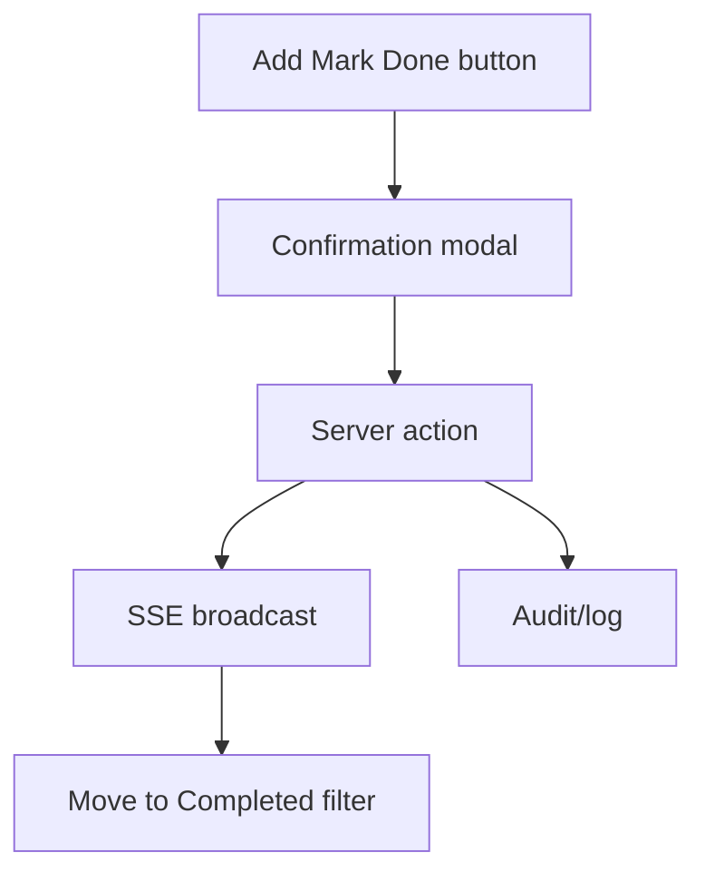

# Task Plan: Mark Order as Done
# Kế hoạch Task: Đánh dấu Đơn Hoàn thành

## 📋 TL;DR

| Aspect | Value |
|--------|-------|
| Feature | Mark Order as Done |
| Total Tasks | 6 |
| Estimated Effort | 6 hours |
| Affected Roots | sgs-cs-helper |
| Spec Reference | [spec.md](../01_spec/spec.md) |

---

## Task Overview / Tổng quan Task

| ID | Title | Root | Deps | Est | Status |
|----|-------|------|------|-----|--------|
| T-001 | Add "Mark Done" button to OrdersTable | sgs-cs-helper | - | S | ⬜ |
| T-002 | Implement confirmation modal | sgs-cs-helper | T-001 | S | ⬜ |
| T-003 | Server action: mark order as Done | sgs-cs-helper | T-002 | M | ⬜ |
| T-004 | Broadcast SSE on completion | sgs-cs-helper | T-003 | S | ⬜ |
| T-005 | Move order to Completed filter | sgs-cs-helper | T-004 | S | ⬜ |
| T-006 | Add audit/log for manual test | sgs-cs-helper | T-003 | S | ⬜ |

---

## Dependency Graph / Đồ thị Phụ thuộc

---

## Tasks by Root / Task theo Root

### Root: sgs-cs-helper

#### T-001: Add "Mark Done" button to OrdersTable

| Aspect | Detail |
|--------|--------|
| Root | sgs-cs-helper |
| Dependencies | None |
| Estimate | S (30 min) |
| Requirements | FR-001 |

**Description / Mô tả:**
- **EN:** Add a "Mark Done" button to each in-progress order row in OrdersTable. Button is only visible for in-progress orders.
- **VI:** Thêm nút "Đánh dấu Hoàn thành" cho mỗi đơn đang xử lý trong OrdersTable. Chỉ hiển thị cho đơn đang xử lý.

**Files to Change / File Thay đổi:**
- Modify: src/components/orders/orders-table.tsx

**Done Criteria / Tiêu chí Hoàn thành:**
- [ ] Button appears for in-progress orders
- [ ] Button hidden/disabled for completed orders

**Verification / Kiểm tra:**
- UI shows button as expected
- Code review for conditional rendering

---

#### T-002: Implement confirmation modal

| Aspect | Detail |
|--------|--------|
| Root | sgs-cs-helper |
| Dependencies | T-001 |
| Estimate | S (30 min) |
| Requirements | FR-001 |

**Description / Mô tả:**
- **EN:** Show a confirmation modal when "Mark Done" is clicked. Only proceed if user confirms.
- **VI:** Hiển thị modal xác nhận khi nhấn "Đánh dấu Hoàn thành". Chỉ thực hiện nếu xác nhận.

**Files to Change / File Thay đổi:**
- Modify: src/components/orders/orders-table.tsx
- Create: src/components/orders/MarkDoneModal.tsx

**Done Criteria / Tiêu chí Hoàn thành:**
- [ ] Modal appears on button click
- [ ] Action only proceeds on confirm

**Verification / Kiểm tra:**
- UI shows modal
- Confirm/cancel works as expected

---

#### T-003: Server action: mark order as Done

| Aspect | Detail |
|--------|--------|
| Root | sgs-cs-helper |
| Dependencies | T-002 |
| Estimate | M (1-2h) |
| Requirements | FR-002, NFR-002 |

**Description / Mô tả:**
- **EN:** Implement server action to update order status to COMPLETED and set completedAt. Only allow for in-progress orders and authenticated staff.
- **VI:** Tạo server action cập nhật trạng thái đơn sang COMPLETED và set completedAt. Chỉ cho phép với đơn đang xử lý và nhân viên đã đăng nhập.

**Files to Change / File Thay đổi:**
- Modify: src/app/api/orders/[id]/mark-done.ts
- Modify: prisma/schema.prisma (if needed)

**Done Criteria / Tiêu chí Hoàn thành:**
- [ ] Status changes to COMPLETED in DB
- [ ] completedAt is set
- [ ] Auth enforced

**Verification / Kiểm tra:**
- API test: only staff can mark as Done
- DB check for status/completedAt

---

#### T-004: Broadcast SSE on completion

| Aspect | Detail |
|--------|--------|
| Root | sgs-cs-helper |
| Dependencies | T-003 |
| Estimate | S (30 min) |
| Requirements | FR-003, NFR-003 |

**Description / Mô tả:**
- **EN:** After marking as Done, broadcast SSE event to all clients so UI updates in real time.
- **VI:** Sau khi đánh dấu hoàn thành, broadcast sự kiện SSE cho tất cả client để UI cập nhật realtime.

**Files to Change / File Thay đổi:**
- Modify: src/lib/sse/broadcaster.ts
- Modify: src/app/api/orders/[id]/mark-done.ts

**Done Criteria / Tiêu chí Hoàn thành:**
- [ ] SSE event sent on completion
- [ ] All clients update UI

**Verification / Kiểm tra:**
- Multiple clients receive update
- UI updates in real time

---

#### T-005: Move order to Completed filter

| Aspect | Detail |
|--------|--------|
| Root | sgs-cs-helper |
| Dependencies | T-004 |
| Estimate | S (30 min) |
| Requirements | FR-004 |

**Description / Mô tả:**
- **EN:** Ensure completed orders move to the Completed filter and disappear from In Progress.
- **VI:** Đảm bảo đơn hoàn thành chuyển sang bộ lọc Hoàn thành và không còn ở Đang xử lý.

**Files to Change / File Thay đổi:**
- Modify: src/components/orders/orders-table.tsx

**Done Criteria / Tiêu chí Hoàn thành:**
- [ ] Order appears in Completed filter
- [ ] Order removed from In Progress

**Verification / Kiểm tra:**
- UI filter works as expected

---

#### T-006: Add audit/log for manual test

| Aspect | Detail |
|--------|--------|
| Root | sgs-cs-helper |
| Dependencies | T-003 |
| Estimate | S (30 min) |
| Requirements | FR-005 |

**Description / Mô tả:**
- **EN:** Log each completion event for manual test/audit. Not shown to end-users.
- **VI:** Ghi log mỗi lần hoàn thành để kiểm thử thủ công. Không hiển thị cho end-user.

**Files to Change / File Thay đổi:**
- Create: src/lib/audit/mark-done-log.ts (if not exists)
- Modify: src/app/api/orders/[id]/mark-done.ts

**Done Criteria / Tiêu chí Hoàn thành:**
- [ ] Log entry created for each completion
- [ ] Log accessible for manual test

**Verification / Kiểm tra:**
- Log file/DB entry exists
- Manual test can verify log

---

## Sync Points / Điểm Đồng bộ

| After Task | Action | Before Task |
|------------|--------|-------------|
| T-003 | Log/audit, SSE broadcast | T-004, T-006 |

---

## Risk Assessment / Đánh giá Rủi ro

| Task | Risk | Mitigation |
|------|------|------------|
| T-003 | Incorrect status update | Add API tests, code review |
| T-004 | SSE not delivered | Retry, log errors |
| T-006 | Log not accessible | Manual test, fallback to console |

---

## Requirements Coverage / Độ phủ Yêu cầu

| Requirement | Tasks |
|-------------|-------|
| FR-001 | T-001, T-002 |
| FR-002 | T-003 |
| FR-003 | T-004 |
| FR-004 | T-005 |
| FR-005 | T-006 |
| NFR-001 | T-003, T-004 |
| NFR-002 | T-003 |
| NFR-003 | T-004 |
| NFR-004 | All |

---

## 7. Test Plan / Kế hoạch Test

### 7.1 Test Strategy
- Unit tests for server action, audit/log util
- Integration tests for UI + API + SSE
- Manual test for log/audit
- Target: 100% happy path, 80% edge/error cases

### 7.2 Test Cases by Task

| TC ID | Task | Test Description | Type | Expected Result |
|-------|------|------------------|------|-----------------|
| TC-001 | T-001 | Button appears for in-progress orders | Unit | Button visible only for in-progress |
| TC-002 | T-002 | Modal appears on button click | Unit | Modal shown |
| TC-003 | T-003 | Only staff can mark as Done | Integration | 403 for unauthorized |
| TC-004 | T-003 | Status changes to COMPLETED | Integration | DB updated |
| TC-005 | T-004 | SSE event sent on completion | Integration | All clients receive update |
| TC-006 | T-005 | Order moves to Completed filter | Unit | Order in correct filter |
| TC-007 | T-006 | Log entry created on completion | Unit | Log exists |
| TC-008 | T-006 | Log not shown to end-user | Unit | No UI impact |

### 7.3 Edge Cases
- Marking already completed order (should not allow)
- SSE delivery fails (retry/log)
- DB update fails (show error)
- Unauthorized user (403)

### 7.4 Test Data
- Mock orders: in-progress, completed
- Mock staff user, unauthorized user
- Setup/teardown: reset DB, clear logs

---

