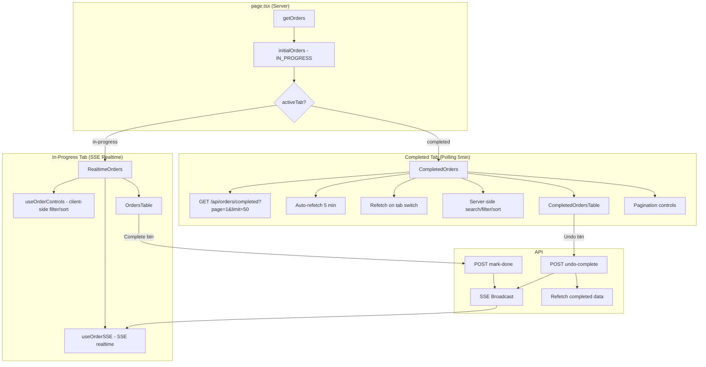
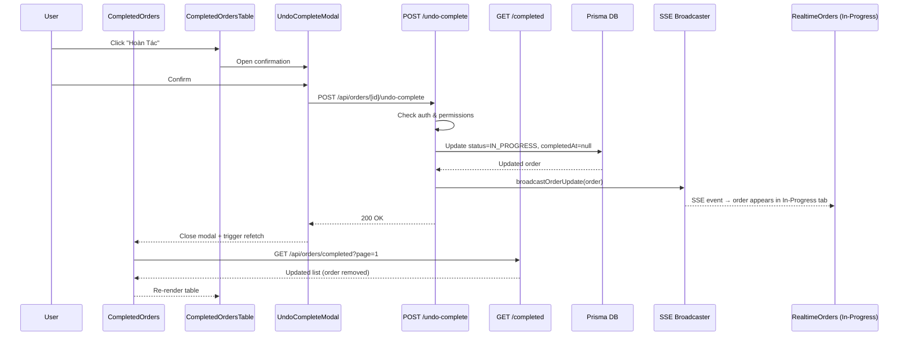

# Analysis & Solution Design — Completed Tab & Undo
<!-- Template Version: 1.0 | Contract: v1.0 | Last Updated: 2026-02-09 -->

---

## TL;DR

| Aspect | Value |
|--------|-------|
| Feature | Completed Orders Tab & Undo |
| Status | Draft |
| Affected Roots | `sgs-cs-hepper` |
| Complexity | Medium |
| Estimated Effort | ~6-8 tasks |
| User Story | US-1.3.2 (also covers US-1.3.3) |

---

## 1. Problem Statement

### Current Behavior

🇻🇳 Tab Completed hiện tại không hoạt động đúng:
- `getOrders()` chỉ fetch orders `IN_PROGRESS` → tab Completed luôn trống
- Không có search/filter/sort cho tab Completed
- Không có nút "Hoàn Tác" (Undo) để revert completed orders
- Progress bar vẫn hiển thị (không cần cho completed orders)
- `completedAt` không được truyền xuống client

🇬🇧 The Completed tab is non-functional:
- `getOrders()` only fetches `IN_PROGRESS` orders → Completed tab is always empty
- No search/filter/sort controls for Completed tab
- No "Undo" button to revert completed orders back to IN_PROGRESS
- Progress bar still renders (irrelevant for completed orders)
- `completedAt` is not passed to the client

### Desired Behavior

🇻🇳 Tab Completed đầy đủ chức năng:
- **Server-side pagination**: 50 orders/trang, sắp xếp theo completedAt mới nhất
- Hiển thị completedAt, badge, không có progress bar
- **Server-side** search/filter/sort (vì dữ liệu nhiều)
- Nút "Hoàn Tác" với permission gating và confirmation modal
- **Không dùng SSE** — refetch khi chuyển tab + auto-refetch mỗi 5 phút
- Sau undo thành công: refetch lại data (không cần SSE broadcast cho completed tab)

🇬🇧 Fully functional Completed tab:
- **Server-side pagination**: 50 orders/page, sorted by completedAt newest first
- Display completedAt, badge, no progress bar
- **Server-side** search/filter/sort (data volume too large for client-side)
- "Undo" button with permission gating and confirmation modal
- **No SSE** — refetch on tab switch + auto-refetch every 5 minutes
- After successful undo: refetch data (no SSE broadcast needed for completed tab)

### Gap Analysis

🇻🇳 Khoảng cách chính:
1. **Data gap**: Server không fetch completed orders → cần API mới với pagination + server-side filtering
2. **UI gap**: Completed tab dùng chung `OrdersTable` → cần bảng riêng cho completed
3. **Action gap**: Không có undo API → cần tạo endpoint mới
4. **Controls gap**: Search/filter/sort bị tắt → cần server-side search/filter/sort
5. **Architecture gap**: Completed tab không cần SSE realtime → cần data fetching pattern khác (polling 5 phút + refetch on tab switch)

🇬🇧 Key gaps:
1. **Data gap**: Server doesn't fetch completed orders → need new API with pagination + server-side filtering
2. **UI gap**: Completed tab shares `OrdersTable` → need separate table layout
3. **Action gap**: No undo API → need new endpoint
4. **Controls gap**: Search/filter/sort disabled → need server-side search/filter/sort
5. **Architecture gap**: Completed tab doesn't need SSE realtime → need different data fetching pattern (5-min polling + refetch on tab switch)

---

## 2. Clarifying Questions

| # | Question | Answer | Status |
|---|----------|--------|--------|
| 1 | Should completed orders use server-side or client-side filtering? | **Server-side** — data sẽ rất nhiều, client-side không scale | Resolved |
| 2 | Should completed tab use SSE realtime? | **Không** — polling 5 phút + refetch on tab switch là đủ | Resolved |
| 3 | Does US-1.3.2 fully cover US-1.3.3 (Undo)? | Yes — AC4/AC5/AC9 implement full undo | Resolved |
| 4 | Pagination: how many orders per page? | **50 orders/trang**, sorted by completedAt desc | Resolved |
| 5 | Should undo broadcast SSE? | **Yes** — in-progress tab cần nhận order mới realtime | Resolved |

---

## 3. Assumptions & Constraints

### Assumptions

🇻🇳
- completedAt luôn có giá trị khi status = COMPLETED (enforced bởi mark-done API)
- Completed orders sẽ rất nhiều → cần server-side pagination (50/trang)
- Completed tab **không cần SSE** — polling 5 phút + refetch khi chuyển tab là đủ
- Undo action sẽ refetch lại data thay vì dựa vào SSE
- In-progress tab **vẫn giữ SSE** realtime như hiện tại

🇬🇧
- completedAt always has a value when status = COMPLETED (enforced by mark-done API)
- Completed orders will grow large → need server-side pagination (50/page)
- Completed tab **does not need SSE** — 5-min polling + refetch on tab switch is sufficient
- Undo action will refetch data instead of relying on SSE
- In-progress tab **keeps SSE** realtime as-is

### Constraints

🇻🇳
- Không thay đổi Prisma schema (completedAt đã tồn tại)
- Phải tương thích với SSE broadcaster hiện tại
- Permission model giữ nguyên: canUpdateStatus / ADMIN / SUPER_ADMIN

🇬🇧
- No Prisma schema changes (completedAt already exists)
- Must be compatible with current SSE broadcaster
- Permission model unchanged: canUpdateStatus / ADMIN / SUPER_ADMIN

---

## 4. Existing Patterns Found

| Location | Pattern | Reusable |
|----------|---------|----------|
| `src/app/api/orders/[id]/mark-done/route.ts` | Auth + permission check + status update + SSE broadcast | Yes — mirror for undo |
| `src/components/orders/MarkDoneModal.tsx` | Confirmation dialog wrapper | Yes — create UndoCompleteModal |
| `src/components/orders/orders-table.tsx` | Table with sortable headers | Partial — need separate completed table |
| `src/hooks/use-order-controls.ts` | Filter/sort/search state management | Yes — reuse for completed tab |
| `src/components/orders/order-filters.tsx` | Filter UI (Registered By + Date range) | Yes — reuse directly |
| `src/components/orders/job-search.tsx` | Job search with debounce | Yes — reuse directly |
| `src/components/orders/sortable-header.tsx` | Clickable sort headers | Yes — reuse directly |
| `src/lib/sse/broadcaster.ts` | `broadcastOrderUpdate()` | Yes — reuse for undo |
| `src/hooks/use-realtime-progress.ts` | SSE + progress + data management | Partial — completed don't need progress |

---

## 5. Solution Options

### Option A: Enhance Existing Components (In-Place)

🇻🇳 Sửa `OrdersTable` và `RealtimeOrders` bằng conditional rendering dựa trên `activeTab`. Thêm completedAt column, undo button, và search/filter/sort cho completed tab vào cùng component.

🇬🇧 Modify `OrdersTable` and `RealtimeOrders` with conditional rendering based on `activeTab`. Add completedAt column, undo button, and search/filter/sort for completed tab within the same components.

**Pros**: Less code duplication, fewer files  
**Cons**: Components become complex with many conditionals, harder to maintain

### Option B: Separate Completed Container + Server-Side Pagination (Chosen)

🇻🇳 Tạo `CompletedOrders` container riêng (tách hoàn toàn khỏi `RealtimeOrders`) với:
- **Server-side pagination**: API trả 50 orders/trang + total count
- **Server-side search/filter/sort**: Query params gửi lên API
- **Polling 5 phút** thay vì SSE (completed orders không cần realtime)
- **Refetch on tab switch**: Khi user chuyển sang completed tab → fetch mới
- `CompletedOrdersTable` riêng (không progress bar, có completedAt, có nút Undo)

🇬🇧 Create separate `CompletedOrders` container (fully decoupled from `RealtimeOrders`) with:
- **Server-side pagination**: API returns 50 orders/page + total count
- **Server-side search/filter/sort**: Query params sent to API
- **5-min polling** instead of SSE (completed orders don't need realtime)
- **Refetch on tab switch**: When user switches to completed tab → fresh fetch
- Separate `CompletedOrdersTable` (no progress bar, shows completedAt, has Undo button)

**Pros**: Clean separation, scalable for large datasets, lighter client load, independent data lifecycle  
**Cons**: More backend work (API with pagination/filtering)

### Comparison Matrix

| Aspect | Option A (In-Place) | Option B (Separate + Server-Side) |
|--------|----------|----------|
| Description | Conditional rendering, client-side filtering | Separate container, server-side pagination |
| Effort | Medium | Medium-High |
| Risk | High (won't scale) | Low (built for scale) |
| Maintainability | Low (tangled logic) | High (clear SRP) |
| Scalability | Poor (all data on client) | Good (50/page server-side) |
| Testability | Medium | High |

### Chosen Solution

**Decision:** `Option B — Separate Completed Container + Server-Side Pagination`

🇻🇳 Chọn Option B vì completed orders sẽ rất nhiều → client-side filtering không scale được. Server-side pagination + filtering + polling 5 phút là kiến trúc đúng. Tách hoàn toàn khỏi RealtimeOrders vì data lifecycle khác nhau (SSE vs polling).

🇬🇧 Option B chosen because completed orders will grow large → client-side filtering won't scale. Server-side pagination + filtering + 5-min polling is the right architecture. Fully decoupled from RealtimeOrders because data lifecycles differ (SSE vs polling).

---

## 6. Solution Overview

🇻🇳 Giải pháp gồm 5 phần chính:

1. **API Layer**: Tạo `GET /api/orders/completed` với server-side pagination, search, filter, sort (query params: `page`, `limit`, `search`, `registeredBy`, `dateFrom`, `dateTo`, `sortField`, `sortDir`). Trả về `{ orders, total, page, totalPages }`
2. **Undo API**: Tạo `POST /api/orders/[id]/undo-complete` — COMPLETED → IN_PROGRESS, clear completedAt, broadcast SSE (để in-progress tab nhận order mới)
3. **Client Container**: Tạo `CompletedOrders` container client component — fetch data từ API, polling 5 phút, refetch on tab switch, quản lý search/filter/sort/pagination state
4. **UI Components**: Tạo `CompletedOrdersTable` (không progress bar, có completedAt, có Undo) và `UndoCompleteModal`
5. **Page Integration**: `page.tsx` render `CompletedOrders` khi `activeTab === "completed"`, `RealtimeOrders` chỉ cho in-progress

🇬🇧 Solution has 5 main parts:

1. **API Layer**: Create `GET /api/orders/completed` with server-side pagination, search, filter, sort (query params: `page`, `limit`, `search`, `registeredBy`, `dateFrom`, `dateTo`, `sortField`, `sortDir`). Returns `{ orders, total, page, totalPages }`
2. **Undo API**: Create `POST /api/orders/[id]/undo-complete` — COMPLETED → IN_PROGRESS, clear completedAt, broadcast SSE (so in-progress tab receives the new order)
3. **Client Container**: Create `CompletedOrders` container client component — fetches data from API, 5-min polling, refetch on tab switch, manages search/filter/sort/pagination state
4. **UI Components**: Create `CompletedOrdersTable` (no progress bar, shows completedAt, has Undo) and `UndoCompleteModal`
5. **Page Integration**: `page.tsx` renders `CompletedOrders` when `activeTab === "completed"`, `RealtimeOrders` only for in-progress

### Architecture Diagram

---

## 7. Components

| Component | Root | Type | Description |
|-----------|------|------|-------------|
| `GET /api/orders/completed` | sgs-cs-hepper | **New** | API: paginated completed orders with search/filter/sort |
| `POST /api/orders/[id]/undo-complete` | sgs-cs-hepper | **New** | API: COMPLETED → IN_PROGRESS |
| `CompletedOrders` | sgs-cs-hepper | **New** | Client container: data fetching, polling 5min, state management |
| `CompletedOrdersTable` | sgs-cs-hepper | **New** | Table for completed orders (no progress bar) |
| `UndoCompleteModal` | sgs-cs-hepper | **New** | Confirmation modal for undo action |
| `useCompletedOrders` | sgs-cs-hepper | **New** | Hook: fetch, polling, pagination, refetch |
| `page.tsx` | sgs-cs-hepper | Modify | Render CompletedOrders for completed tab |

### Component Details

#### `GET /api/orders/completed`

🇻🇳 API endpoint trả về completed orders với server-side pagination, search, filter, sort.

🇬🇧 API endpoint returning completed orders with server-side pagination, search, filter, sort.

**Query params**: `page` (default 1), `limit` (default 50), `search` (job number), `registeredBy`, `dateFrom`, `dateTo`, `sortField` (completedAt/registeredDate/requiredDate), `sortDir` (asc/desc)

**Response**: `{ orders: CompletedOrder[], total: number, page: number, totalPages: number }`

#### `CompletedOrders` (Client Container)

🇻🇳 Container component quản lý toàn bộ completed tab: fetch data từ API, polling 5 phút, refetch khi chuyển tab, quản lý search/filter/sort/pagination state.

🇬🇧 Container component managing the entire completed tab: fetches data from API, 5-min polling, refetch on tab switch, manages search/filter/sort/pagination state.

**Props**: `canUndo`, `activeTab`

**Behavior**:
- Fetch data on mount + when tab becomes active
- Auto-refetch every 5 minutes
- After undo success → refetch current page
- Debounced search (300ms)

#### `CompletedOrdersTable`

🇻🇳 Bảng hiển thị completed orders. Không có progress bar, không có Time Left. Có nút Undo per-row.

🇬🇧 Table displaying completed orders. No progress bar, no Time Left. Has Undo button per-row.

**Columns**: Job Number, Registered Date, Registered By, Required Date, Priority, Completed At, Action (Undo)

**Props**: `orders`, `canUndo`, `sortConfig`, `onSort`, `isLoading`

#### `POST /api/orders/[id]/undo-complete`

🇻🇳 API endpoint để revert order từ COMPLETED về IN_PROGRESS. Kiểm tra auth + permission. Clear completedAt. Broadcast SSE update (để in-progress tab nhận order mới). Trả về updated order.

🇬🇧 API endpoint to revert order from COMPLETED to IN_PROGRESS. Checks auth + permission. Clears completedAt. Broadcasts SSE update (so in-progress tab receives the new order). Returns updated order.

#### `useCompletedOrders` Hook

🇻🇳 Custom hook quản lý data fetching cho completed orders: fetch, pagination, polling 5 phút, refetch.

🇬🇧 Custom hook managing data fetching for completed orders: fetch, pagination, 5-min polling, refetch.

**Returns**: `{ orders, total, page, totalPages, isLoading, setPage, refetch }`

---

## 8. Data Flow

### Undo Flow

| Step | Action | From | To |
|------|--------|------|-----|
| 1 | Click "Hoàn Tác" | User | CompletedOrdersTable |
| 2 | Show confirmation modal | CompletedOrdersTable | UndoCompleteModal |
| 3 | Confirm undo | User | UndoCompleteModal |
| 4 | POST /api/orders/[id]/undo-complete | Client | API Route |
| 5 | Auth + permission check | API Route | Session |
| 6 | Update: COMPLETED → IN_PROGRESS, clear completedAt | API Route | Prisma/DB |
| 7 | broadcastOrderUpdate(updatedOrder) | API Route | SSE Broadcaster |
| 8 | SSE event → In-Progress tab receives new order | SSE Broadcaster | RealtimeOrders (In-Progress) |
| 9 | Refetch completed data → order disappears from Completed tab | CompletedOrders | API |

**Key**: Undo broadcasts SSE so the **In-Progress tab** gets the order in realtime. The **Completed tab** simply refetches its data after undo success.

### Sequence Diagram

---

## 9. Cross-Root Impact

| Root | Change Type | Sync Required |
|------|-------------|---------------|
| `sgs-cs-hepper` | Code | N/A (single root) |
| `a-z-copilot-flow` | None | No |

No cross-root dependencies. All changes are within `sgs-cs-hepper`.

---

## 10. Dependencies

| Package | Version | Status | Notes |
|---------|---------|--------|-------|
| `next` | existing | Existing | App Router, API routes |
| `prisma` | existing | Existing | DB queries |
| `next-auth` | existing | Existing | Auth + permissions |
| `lucide-react` | existing | Existing | Icons (Undo2) |
| `shadcn/ui` | existing | Existing | Table, Button, Badge |

No new dependencies needed.

---

## 11. Risks & Mitigations

| Risk | Likelihood | Impact | Mitigation |
|------|------------|--------|------------|
| Stale completed data between polls | Low | Low | 5-min polling + refetch on tab switch + refetch after undo |
| Race condition on undo | Low | Low | DB constraint prevents double-undo; refetch shows current state |
| API N+1 query performance | Low | Medium | Single Prisma query with WHERE + ORDER BY + SKIP/TAKE |
| Pagination edge case after undo | Low | Low | Refetch current page; if empty, go to page 1 |

---

## 12. Decision Log

| ID | Date | Decision | Rationale |
|----|------|----------|-----------|
| D1 | 2026-02-09 | Separate CompletedOrders container + CompletedOrdersTable | Different data lifecycle (polling vs SSE), different layouts |
| D2 | 2026-02-09 | Server-side pagination (50/page) | Completed orders will grow large, client-side filtering won't scale |
| D3 | 2026-02-09 | No SSE for completed tab — polling 5min + refetch on tab switch | Completed data is not time-critical; reduces SSE complexity |
| D4 | 2026-02-09 | Server-side search/filter/sort via API query params | Data too large for client-side processing |
| D5 | 2026-02-09 | Undo still broadcasts SSE (for in-progress tab) | In-progress tab needs realtime update when order returns |
| D6 | 2026-02-09 | US-1.3.2 covers US-1.3.3 fully | AC4/AC5/AC9 implement complete undo functionality |

---

## 13. Notes & Concerns

🇻🇳
- `CompletedOrders` hoàn toàn tách biệt khỏi `RealtimeOrders` — khác data lifecycle (polling vs SSE)
- `RealtimeOrders` và `OrdersTable` **không cần thay đổi** — chỉ cho in-progress tab
- `page.tsx` cần render conditional: `RealtimeOrders` cho in-progress, `CompletedOrders` cho completed
- API `GET /api/orders/completed` cần Prisma query hiệu quả: single query với WHERE + ORDER BY + SKIP/TAKE + COUNT
- Sau khi hoàn thành US-1.3.2, nên mark US-1.3.3 là DONE trong checklist

🇬🇧
- `CompletedOrders` is fully decoupled from `RealtimeOrders` — different data lifecycles (polling vs SSE)
- `RealtimeOrders` and `OrdersTable` **need no changes** — only for in-progress tab
- `page.tsx` needs conditional rendering: `RealtimeOrders` for in-progress, `CompletedOrders` for completed
- API `GET /api/orders/completed` needs efficient Prisma query: single query with WHERE + ORDER BY + SKIP/TAKE + COUNT
- After completing US-1.3.2, US-1.3.3 should be marked DONE in checklist

---

## Files Changed Summary

| File | Action | Purpose |
|------|--------|---------|
| `src/app/api/orders/completed/route.ts` | **New** | GET API: paginated completed orders with search/filter/sort |
| `src/app/api/orders/[id]/undo-complete/route.ts` | **New** | POST API: undo completion |
| `src/components/orders/completed-orders.tsx` | **New** | Client container: data fetching, polling, state management |
| `src/components/orders/completed-orders-table.tsx` | **New** | Completed orders table (no progress bar, with Undo) |
| `src/components/orders/UndoCompleteModal.tsx` | **New** | Undo confirmation modal |
| `src/hooks/use-completed-orders.ts` | **New** | Hook: fetch, pagination, polling 5min, refetch |
| `src/app/(orders)/orders/page.tsx` | Modify | Conditional render: RealtimeOrders vs CompletedOrders |

---

## Approval

| Role | Name | Status | Date |
|------|------|--------|------|
| Author | Copilot | ✅ Done | 2026-02-09 |
| Reviewer | User | ⏳ Pending | — |

---

## Next Step

🇻🇳 Sau khi phê duyệt, tiến hành **Phase 1: Specification**.

🇬🇧 After approval, proceed to **Phase 1: Specification**.

Reply: `approved` or `revise: <feedback>`
