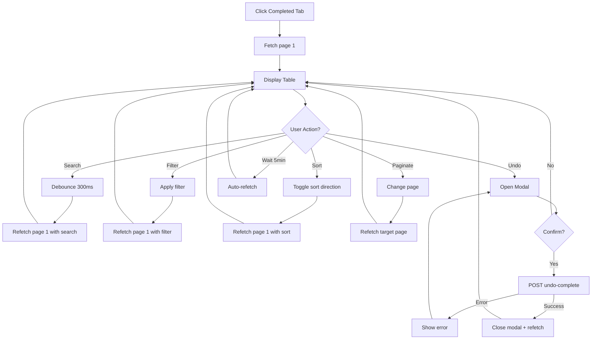

# Specification — Completed Orders Tab & Undo
<!-- Template Version: 1.0 | Contract: v1.0 | Last Updated: 2026-02-09 -->
<!-- 🇻🇳 Vietnamese first, 🇬🇧 English follows — for easy scanning -->

---

## TL;DR

| Aspect | Value |
|--------|-------|
| Feature | Completed Orders Tab & Undo |
| Status | Draft |
| Functional Requirements | 7 |
| Non-Functional Requirements | 4 |
| Affected Roots | `sgs-cs-hepper` |
| Phase 0 Analysis | [solution-design.md](../00_analysis/solution-design.md) |
| User Story | US-1.3.2 (also covers US-1.3.3) |

---

## 1. Overview

🇻🇳 Spec này định nghĩa yêu cầu chi tiết cho tab Completed — hiển thị danh sách orders đã hoàn thành với server-side pagination (50/trang), search/filter/sort phía server, nút "Hoàn Tác" (Undo) với permission gating, và auto-refresh mỗi 5 phút. Tab này hoàn toàn tách biệt khỏi In-Progress tab (không dùng SSE).

🇬🇧 This spec defines detailed requirements for the Completed tab — displaying completed orders with server-side pagination (50/page), server-side search/filter/sort, "Undo" button with permission gating, and auto-refresh every 5 minutes. This tab is fully decoupled from the In-Progress tab (no SSE).

---

## 2. Goals & Non-Goals

### Goals

🇻🇳
1. **Hiển thị completed orders** với server-side pagination (50/trang, sorted by completedAt desc)
2. **Search/filter/sort phía server** — job number search, registered by filter, date range filter, multi-column sort
3. **Undo (Hoàn Tác)** — revert COMPLETED → IN_PROGRESS với confirmation modal + permission check
4. **Data freshness** — auto-refetch mỗi 5 phút + refetch khi chuyển tab
5. **UI phân biệt rõ** — không progress bar, có completedAt, có Completed badge

🇬🇧
1. **Display completed orders** with server-side pagination (50/page, sorted by completedAt desc)
2. **Server-side search/filter/sort** — job number search, registered by filter, date range filter, multi-column sort
3. **Undo** — revert COMPLETED → IN_PROGRESS with confirmation modal + permission check
4. **Data freshness** — auto-refetch every 5 min + refetch on tab switch
5. **Clear UI distinction** — no progress bar, shows completedAt, Completed badge

### Non-Goals

🇻🇳
1. ❌ Client-side filtering (dữ liệu quá lớn)
2. ❌ SSE realtime cho completed tab (không cần thiết)
3. ❌ Prisma schema changes (completedAt đã tồn tại)
4. ❌ Thay đổi In-Progress tab hoặc RealtimeOrders
5. ❌ Bulk undo (chỉ undo từng order)
6. ❌ Localization i18n framework (hardcoded strings OK)

🇬🇧
1. ❌ Client-side filtering (data too large)
2. ❌ SSE realtime for completed tab (not needed)
3. ❌ Prisma schema changes (completedAt already exists)
4. ❌ Changes to In-Progress tab or RealtimeOrders
5. ❌ Bulk undo (single order undo only)
6. ❌ Localization i18n framework (hardcoded strings OK)

---

## 3. User Stories

### US-1.3.2: Completed Orders Tab & Completed-Tab UI

🇻🇳 Là nhân viên CS, tôi muốn xem danh sách orders đã hoàn thành trong tab riêng, tìm kiếm/lọc/sắp xếp chúng, và có thể hoàn tác (undo) nếu đánh dấu nhầm, để quản lý orders hiệu quả hơn.

🇬🇧 As a CS staff member, I want to view completed orders in a dedicated tab, search/filter/sort them, and undo if marked by mistake, so I can manage orders more effectively.

### US-1.3.3: Undo Order Completion (Covered by US-1.3.2)

🇻🇳 Là nhân viên CS, tôi muốn hoàn tác order đã complete nhầm, để order quay lại In Progress.

🇬🇧 As a CS staff member, I want to undo a mistakenly completed order, so it returns to In Progress.

---

## 4. Requirements Matrix

| ID | Title | Priority | Type | Covers AC |
|----|-------|----------|------|-----------|
| FR-001 | Paginated Completed Orders API | Must | Functional | AC1 |
| FR-002 | Completed Orders Table UI | Must | Functional | AC2, AC3, AC10 |
| FR-003 | Undo API | Must | Functional | AC4, AC9 |
| FR-004 | Undo UI (Permission + Modal) | Must | Functional | AC4, AC5 |
| FR-005 | Server-Side Search | Must | Functional | AC6 |
| FR-006 | Server-Side Filters | Must | Functional | AC7 |
| FR-007 | Server-Side Sorting | Must | Functional | AC8 |
| NFR-001 | API Response Performance | Must | Performance | — |
| NFR-002 | Permission Security | Must | Security | AC5 |
| NFR-003 | Data Freshness | Should | Reliability | — |
| NFR-004 | Testability | Should | Maintainability | AC11 |

---

## 5. Functional Requirements

### FR-001: Paginated Completed Orders API

| Aspect | Detail |
|--------|--------|
| Priority | Must |
| Affected Roots | `sgs-cs-hepper` |

#### Description

🇻🇳 Tạo API endpoint `GET /api/orders/completed` trả về completed orders với server-side pagination. API nhận query params cho pagination, search, filter, sort. Trả về danh sách orders + metadata phân trang.

🇬🇧 Create API endpoint `GET /api/orders/completed` returning completed orders with server-side pagination. API accepts query params for pagination, search, filter, sort. Returns order list + pagination metadata.

#### Acceptance Criteria

- [ ] AC1: API returns only orders with `status === "COMPLETED"`
- [ ] AC2: Default pagination: page 1, limit 50, sorted by `completedAt` desc
- [ ] AC3: Response shape: `{ orders: CompletedOrder[], total: number, page: number, totalPages: number }`
- [ ] AC4: API requires authentication (returns 403 if no session)
- [ ] AC5: Supports query params: `page`, `limit`, `search`, `registeredBy`, `dateFrom`, `dateTo`, `sortField`, `sortDir`
- [ ] AC6: Empty result returns `{ orders: [], total: 0, page: 1, totalPages: 0 }`

---

### FR-002: Completed Orders Table UI

| Aspect | Detail |
|--------|--------|
| Priority | Must |
| Affected Roots | `sgs-cs-hepper` |

#### Description

🇻🇳 Tạo `CompletedOrdersTable` hiển thị completed orders trong bảng riêng. Không có progress bar, không có Time Left. Hiển thị completedAt timestamp và Completed badge. Có pagination controls (prev/next, page indicator). Hỗ trợ loading state và empty state.

🇬🇧 Create `CompletedOrdersTable` displaying completed orders in a separate table. No progress bar, no Time Left. Shows completedAt timestamp and Completed badge. Has pagination controls (prev/next, page indicator). Supports loading state and empty state.

#### Acceptance Criteria

- [ ] AC1: Table columns: Job Number, Registered Date, Required Date, Priority, Registered By, Completed At, Action
- [ ] AC2: No progress bar column, no Time Left column
- [ ] AC3: "Completed" badge displayed per row (consistent with existing badge pattern)
- [ ] AC4: `completedAt` formatted as readable timestamp (e.g., "09/02/2026 14:30")
- [ ] AC5: Pagination controls: Previous / Next buttons + "Page X of Y" indicator
- [ ] AC6: Previous button disabled on page 1; Next button disabled on last page
- [ ] AC7: Loading state: skeleton or loading spinner while fetching
- [ ] AC8: Empty state: message "No completed orders found" when no results

---

### FR-003: Undo API

| Aspect | Detail |
|--------|--------|
| Priority | Must |
| Affected Roots | `sgs-cs-hepper` |

#### Description

🇻🇳 Tạo API endpoint `POST /api/orders/[id]/undo-complete` để revert order từ COMPLETED về IN_PROGRESS. Clear `completedAt`. Broadcast SSE update để In-Progress tab nhận order mới. Kiểm tra auth và permission.

🇬🇧 Create API endpoint `POST /api/orders/[id]/undo-complete` to revert order from COMPLETED to IN_PROGRESS. Clear `completedAt`. Broadcast SSE update so In-Progress tab receives the new order. Check auth and permission.

#### Acceptance Criteria

- [ ] AC1: Updates order: `status: "IN_PROGRESS"`, `completedAt: null`
- [ ] AC2: Returns 403 if not authenticated
- [ ] AC3: Returns 403 if user lacks permission (`canUpdateStatus` / ADMIN / SUPER_ADMIN)
- [ ] AC4: Returns 404 if order not found
- [ ] AC5: Returns 400 if order is not COMPLETED (prevent undo of non-completed order)
- [ ] AC6: Broadcasts SSE event via `broadcastOrderUpdate()` after successful undo
- [ ] AC7: Returns updated order data on success: `{ success: true, data: updatedOrder }`

---

### FR-004: Undo UI (Permission Gating + Confirmation Modal)

| Aspect | Detail |
|--------|--------|
| Priority | Must |
| Affected Roots | `sgs-cs-hepper` |

#### Description

🇻🇳 Hiển thị nút "Hoàn Tác" (Undo) trên mỗi row trong CompletedOrdersTable. Nút chỉ visible khi user có permission. Click nút → hiển thị confirmation modal. Xác nhận → gọi undo API → refetch data.

🇬🇧 Display "Hoàn Tác" (Undo) button on each row in CompletedOrdersTable. Button only visible when user has permission. Click button → show confirmation modal. Confirm → call undo API → refetch data.

#### Acceptance Criteria

- [ ] AC1: "Hoàn Tác" button rendered per row when `canUndo === true`
- [ ] AC2: Button hidden (column not shown) when `canUndo === false`
- [ ] AC3: Click opens `UndoCompleteModal` with order's job number
- [ ] AC4: Modal shows confirmation message: "Bạn có chắc muốn hoàn tác order {jobNumber}?"
- [ ] AC5: Confirm calls `POST /api/orders/[id]/undo-complete`
- [ ] AC6: On success: close modal, show success feedback, refetch current page
- [ ] AC7: On error: show error message, keep modal open
- [ ] AC8: Loading state on confirm button while API call in progress

---

### FR-005: Server-Side Search

| Aspect | Detail |
|--------|--------|
| Priority | Must |
| Affected Roots | `sgs-cs-hepper` |

#### Description

🇻🇳 Search box tìm kiếm theo Job Number. Input gửi query param `search` lên API (debounced 300ms). API thực hiện partial match (contains) trên `jobNumber`. Search resets về trang 1.

🇬🇧 Search box for Job Number lookup. Input sends `search` query param to API (debounced 300ms). API performs partial match (contains) on `jobNumber`. Search resets to page 1.

#### Acceptance Criteria

- [ ] AC1: Search input with placeholder "Search Job Number..."
- [ ] AC2: Debounced at 300ms — API call fires 300ms after last keystroke
- [ ] AC3: Partial match: searching "SGS-" matches "SGS-001", "SGS-002", etc.
- [ ] AC4: Case-insensitive search
- [ ] AC5: Search resets pagination to page 1
- [ ] AC6: Clear search button (X icon) restores full list
- [ ] AC7: Reuses existing `JobSearch` component pattern

---

### FR-006: Server-Side Filters

| Aspect | Detail |
|--------|--------|
| Priority | Must |
| Affected Roots | `sgs-cs-hepper` |

#### Description

🇻🇳 Filters cho Registered By (select/autocomplete từ danh sách unique values) và Required Date (date range: from/to). Filters gửi query params lên API. Combinable với search. Filter changes reset về trang 1.

🇬🇧 Filters for Registered By (select/autocomplete from unique values list) and Required Date (date range: from/to). Filters send query params to API. Combinable with search. Filter changes reset to page 1.

#### Acceptance Criteria

- [ ] AC1: Registered By filter — select dropdown with unique registeredBy values
- [ ] AC2: Required Date filter — date range picker (from/to)
- [ ] AC3: Filters are combinable with each other AND with search
- [ ] AC4: Applying a filter resets pagination to page 1
- [ ] AC5: Clear/reset option for each filter
- [ ] AC6: Reuses existing `OrderFiltersComponent` pattern (same layout as in-progress tab)

---

### FR-007: Server-Side Sorting

| Aspect | Detail |
|--------|--------|
| Priority | Must |
| Affected Roots | `sgs-cs-hepper` |

#### Description

🇻🇳 Sortable columns: completedAt, Registered Date, Required Date. Click header toggles asc/desc. Default: completedAt desc (mới nhất trước). Sort gửi `sortField` + `sortDir` lên API. Reuses SortableHeader component.

🇬🇧 Sortable columns: completedAt, Registered Date, Required Date. Click header toggles asc/desc. Default: completedAt desc (newest first). Sort sends `sortField` + `sortDir` to API. Reuses SortableHeader component.

#### Acceptance Criteria

- [ ] AC1: Sortable columns: `completedAt`, `registeredDate`, `requiredDate`
- [ ] AC2: Click column header toggles between asc → desc → asc
- [ ] AC3: Default sort: `completedAt` desc
- [ ] AC4: Sort indicator (arrow icon) shows current sort direction
- [ ] AC5: Sorting preserves current search and filter state
- [ ] AC6: Sorting resets to page 1
- [ ] AC7: Reuses existing `SortableHeader` component

---

## 6. Non-Functional Requirements

### NFR-001: API Response Performance

| Aspect | Detail |
|--------|--------|
| Category | Performance |
| Metric | API response time < 500ms for p95 |

#### Description

🇻🇳 API `GET /api/orders/completed` phải trả kết quả trong 500ms (p95) với bất kỳ tổ hợp pagination + filter + sort nào. Sử dụng single Prisma query với WHERE + ORDER BY + SKIP/TAKE. COUNT query chạy song song với data query.

🇬🇧 API `GET /api/orders/completed` must return results within 500ms (p95) for any combination of pagination + filter + sort. Uses single Prisma query with WHERE + ORDER BY + SKIP/TAKE. COUNT query runs in parallel with data query.

---

### NFR-002: Permission Security

| Aspect | Detail |
|--------|--------|
| Category | Security |
| Metric | Zero unauthorized undo operations |

#### Description

🇻🇳 Undo API phải enforce permission check ở **cả server lẫn client**. Server: kiểm tra session + role/canUpdateStatus. Client: ẩn nút Undo khi không có permission. Không bao giờ trust client-only check.

🇬🇧 Undo API must enforce permission check on **both server and client**. Server: check session + role/canUpdateStatus. Client: hide Undo button when no permission. Never trust client-only check.

---

### NFR-003: Data Freshness

| Aspect | Detail |
|--------|--------|
| Category | Reliability |
| Metric | Data staleness ≤ 5 minutes |

#### Description

🇻🇳 Completed tab auto-refetch mỗi 5 phút khi user đang ở tab này. Refetch ngay lập tức khi chuyển từ tab khác sang. Sau undo thành công cũng refetch ngay.

🇬🇧 Completed tab auto-refetches every 5 minutes while user is on this tab. Immediate refetch when switching from another tab. Also refetches immediately after successful undo.

---

### NFR-004: Testability

| Aspect | Detail |
|--------|--------|
| Category | Maintainability |
| Metric | Unit tests for search/filter/undo permission gating |

#### Description

🇻🇳 Các component và hook phải testable: permission gating logic, search debounce, filter application, pagination state management. API route handler testable độc lập.

🇬🇧 Components and hooks must be testable: permission gating logic, search debounce, filter application, pagination state management. API route handler testable independently.

---

## 7. User Flow

### Flow 1: View Completed Orders

| Step | Action | System Response | Next |
|------|--------|-----------------|------|
| 1 | User clicks "Completed" tab | Navigate to `/orders?tab=completed` | 2 |
| 2 | CompletedOrders mounts | Fetch `GET /api/orders/completed?page=1&limit=50` | 3 |
| 3 | Data loads | Display CompletedOrdersTable with pagination | End |

### Flow 2: Search + Filter + Sort

| Step | Action | System Response | Next |
|------|--------|-----------------|------|
| 1 | User types in search box | Debounce 300ms → refetch with `search` param, page reset to 1 | 2 |
| 2 | User selects Registered By filter | Refetch with `registeredBy` param, page reset to 1 | 3 |
| 3 | User clicks column header | Refetch with `sortField` + `sortDir`, page reset to 1 | End |

### Flow 3: Undo

| Step | Action | System Response | Next |
|------|--------|-----------------|------|
| 1 | User clicks "Hoàn Tác" on a row | Open UndoCompleteModal | 2 |
| 2 | User clicks "Confirm" | POST /api/orders/[id]/undo-complete | 3 |
| 3 | API success | Close modal, refetch completed page, SSE → In-Progress tab updates | End |
| 3a | API error | Show error toast, keep modal open | 2 |

### Flow 4: Pagination

| Step | Action | System Response | Next |
|------|--------|-----------------|------|
| 1 | User clicks "Next" | Fetch page N+1 with current search/filter/sort | 2 |
| 2 | Data loads | Update table, update page indicator | End |

### Flow Diagram



---

## 8. Data Models

### CompletedOrder (API Response Type)

```typescript
interface CompletedOrder {
  id: string;
  jobNumber: string;
  registeredDate: Date; // ISO string from API
  registeredBy: string | null;
  receivedDate: Date;
  requiredDate: Date;
  priority: number;
  status: "COMPLETED";
  completedAt: Date; // Always present for COMPLETED orders
}
```

### PaginatedResponse

```typescript
interface PaginatedCompletedOrdersResponse {
  orders: CompletedOrder[];
  total: number;
  page: number;
  totalPages: number;
}
```

### UndoResponse

```typescript
interface UndoCompleteResponse {
  success: true;
  data: {
    id: string;
    jobNumber: string;
    status: "IN_PROGRESS";
    completedAt: null;
    // ... other order fields
  };
}

interface UndoCompleteErrorResponse {
  success: false;
  error: string;
}
```

---

## 9. API Contracts

### GET /api/orders/completed

```typescript
// Request — Query Parameters
interface CompletedOrdersQuery {
  page?: string;          // Default: "1"
  limit?: string;         // Default: "50"
  search?: string;        // Partial match on jobNumber
  registeredBy?: string;  // Exact match filter
  dateFrom?: string;      // ISO date string, requiredDate >= dateFrom
  dateTo?: string;        // ISO date string, requiredDate <= dateTo
  sortField?: "completedAt" | "registeredDate" | "requiredDate"; // Default: "completedAt"
  sortDir?: "asc" | "desc"; // Default: "desc"
}

// Response 200
interface CompletedOrdersResponse {
  orders: CompletedOrder[];
  total: number;        // Total matching records
  page: number;         // Current page (1-based)
  totalPages: number;   // ceil(total / limit)
}

// Response 403
{ success: false, error: "Unauthorized" }
```

**Prisma Query Pattern:**

```typescript
// Run data + count in parallel
const [orders, total] = await Promise.all([
  prisma.order.findMany({
    where: { status: "COMPLETED", ...filters },
    orderBy: { [sortField]: sortDir },
    skip: (page - 1) * limit,
    take: limit,
    select: { /* fields */ },
  }),
  prisma.order.count({
    where: { status: "COMPLETED", ...filters },
  }),
]);
```

### POST /api/orders/[id]/undo-complete

```typescript
// Request — No body needed (order ID from URL param)

// Response 200
{
  success: true,
  data: {
    id: string,
    jobNumber: string,
    registeredDate: Date,
    registeredBy: string | null,
    receivedDate: Date,
    requiredDate: Date,
    priority: number,
    status: "IN_PROGRESS",
    completedAt: null
  }
}

// Response 400
{ success: false, error: "Order is not completed" }

// Response 403
{ success: false, error: "Unauthorized" }
{ success: false, error: "You do not have permission to update order status" }

// Response 404
{ success: false, error: "Order not found" }

// Response 500
{ success: false, error: "Internal server error" }
```

---

## 10. Edge Cases

| ID | Scenario | Expected Behavior | Priority |
|----|----------|-------------------|----------|
| EC-001 | Undo the same order twice (race condition) | Second request returns 400 "Order is not completed" | Must handle |
| EC-002 | Current page becomes empty after undo | Redirect to page 1 (or previous page) | Must handle |
| EC-003 | Search returns zero results | Show empty state: "No completed orders found" | Must handle |
| EC-004 | Page number exceeds totalPages | Clamp to last valid page | Should handle |
| EC-005 | User switches tab during API call | Abort ongoing fetch, start new fetch | Should handle |
| EC-006 | Network error during fetch | Show error state with retry button | Must handle |
| EC-007 | Polling fires while user is typing in search | Polling respects current search/filter/sort params | Must handle |
| EC-008 | No completed orders exist at all | Show empty state on first load | Must handle |

### EC-001: Double Undo (Race Condition)

🇻🇳
**Khi:** Hai user click Undo cùng order cùng lúc
**Thì:** Request đầu thành công, request sau trả 400 "Order is not completed"
**Lý do:** DB state check trong API ngăn double-undo

🇬🇧
**When:** Two users click Undo on the same order simultaneously
**Then:** First request succeeds, second returns 400 "Order is not completed"
**Rationale:** DB state check in API prevents double-undo

### EC-002: Empty Page After Undo

🇻🇳
**Khi:** Undo order cuối cùng trên trang hiện tại (ví dụ: trang 3 chỉ còn 1 order)
**Thì:** Sau refetch, nếu trang hiện tại trống → tự động quay về trang 1
**Lý do:** UX không nên hiển thị trang trống

🇬🇧
**When:** Undo the last order on current page (e.g., page 3 has only 1 order)
**Then:** After refetch, if current page is empty → auto-navigate to page 1
**Rationale:** UX should not display an empty page

---

## 11. Error Handling

| Error Condition | User Message | System Action |
|-----------------|--------------|---------------|
| Not authenticated | Redirect to login | Return 403 from API |
| No undo permission | Button hidden (client) | Return 403 from API |
| Order not found | "Order not found" toast | Return 404, refetch list |
| Order already in-progress | "Order is not completed" toast | Return 400, refetch list |
| Network failure on fetch | "Failed to load orders. Retry?" | Show retry button |
| Network failure on undo | "Failed to undo. Please try again." | Keep modal open |
| Server error (500) | "Something went wrong. Please try again." | Log error, show toast |

---

## 12. Cross-Root Impact

| Root | Changes | Sync Required |
|------|---------|---------------|
| `sgs-cs-hepper` | All code changes | N/A (single root) |
| `a-z-copilot-flow` | None | No |

### Integration Points

🇻🇳 Tất cả thay đổi nằm trong `sgs-cs-hepper`. Không có cross-root dependencies. Undo API broadcast SSE → In-Progress tab (cùng root) nhận event.

🇬🇧 All changes are within `sgs-cs-hepper`. No cross-root dependencies. Undo API broadcasts SSE → In-Progress tab (same root) receives event.

---

## 13. Dependencies

| Dependency | Type | Status |
|------------|------|--------|
| `next` (16.x) | Framework | Existing |
| `@prisma/client` | ORM | Existing |
| `next-auth` (5.x) | Auth | Existing |
| `lucide-react` | Icons (Undo2) | Existing |
| `shadcn/ui` (Table, Button, Badge, Select) | UI Components | Existing |

No new dependencies required.

---

## 14. Risks & Assumptions

### Risks

| Risk | Impact | Mitigation |
|------|--------|------------|
| Stale data between 5-min polls | Low | Acceptable for completed orders; refetch on tab switch + after undo |
| Large dataset slows API | Medium | Prisma index on `status` already exists; pagination limits to 50 |
| Concurrent undo race condition | Low | DB state check prevents double-undo; refetch shows current state |
| Page becomes empty after undo | Low | Auto-redirect to page 1 when current page is empty |

### Assumptions

| # | Assumption | Validated |
|---|------------|-----------|
| 1 | `completedAt` is always set when `status === COMPLETED` | Yes (enforced by mark-done API) |
| 2 | `status` column has DB index | Yes (schema: `@@index([status])`) |
| 3 | SSE broadcaster works for undo (same as mark-done) | Yes (reuses `broadcastOrderUpdate`) |
| 4 | Permission model is same for undo as for mark-done | Yes (user confirmed) |
| 5 | 50 orders per page is sufficient | Yes (user specified) |

---

## 15. Open Questions

| # | Question | Status | Answer |
|---|----------|--------|--------|
| 1 | Should Registered By filter fetch unique values from API? | Resolved | Reuse existing pattern from in-progress tab |
| 2 | Should undo show success toast? | Resolved | Yes, brief success feedback |
| 3 | Should polling pause when browser tab is hidden? | Open | Recommended but not required for MVP |

---

## 16. Notes

🇻🇳
- `CompletedOrders` hoàn toàn độc lập với `RealtimeOrders` — khác data lifecycle
- `useCompletedOrders` hook quản lý: fetch, pagination state, polling interval, search/filter/sort params
- Khi search/filter thay đổi → reset page về 1 trước khi fetch
- Polling interval (5 phút) sử dụng `setInterval` với cleanup trong `useEffect`
- Undo broadcasts SSE cho in-progress tab, nhưng completed tab chỉ cần refetch
- `canUndo` prop tính từ server-side (giống `canMarkDone`) — truyền từ `page.tsx`

🇬🇧
- `CompletedOrders` is fully independent of `RealtimeOrders` — different data lifecycle
- `useCompletedOrders` hook manages: fetch, pagination state, polling interval, search/filter/sort params
- When search/filter changes → reset page to 1 before fetching
- Polling interval (5 min) uses `setInterval` with cleanup in `useEffect`
- Undo broadcasts SSE for in-progress tab, but completed tab only needs refetch
- `canUndo` prop computed server-side (same as `canMarkDone`) — passed from `page.tsx`

---

## Approval

| Role | Name | Status | Date |
|------|------|--------|------|
| Spec Author | Copilot | ✅ Done | 2026-02-09 |
| Reviewer | User | ⏳ Pending | — |

---

## Next Step

🇻🇳 Sau khi phê duyệt, tiến hành **Phase 2: Task Planning**.

🇬🇧 After approval, proceed to **Phase 2: Task Planning**.

Reply: `approved` or `revise: <feedback>`
