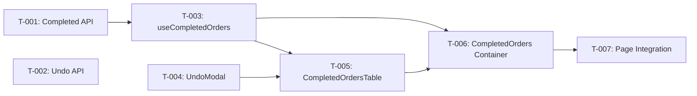

# Task Plan — Completed Orders Tab & Undo
<!-- Template Version: 1.0 | Contract: v1.0 | Last Updated: 2026-02-09 -->
<!-- 🇻🇳 Vietnamese first, 🇬🇧 English follows — for easy scanning -->

---

## TL;DR

| Aspect | Value |
|--------|-------|
| Feature | Completed Orders Tab & Undo |
| Total Tasks | 7 |
| Estimated Effort | ~8 hours |
| Affected Roots | `sgs-cs-hepper` |
| Dev Mode | Standard |
| Spec Reference | [spec.md](../01_spec/spec.md) |

---

## 1. Goal

🇻🇳 Hoàn thành tab Completed với server-side pagination, search/filter/sort, nút Undo có permission gating, và auto-refresh 5 phút. Tách hoàn toàn khỏi In-Progress tab.

🇬🇧 Complete the Completed tab with server-side pagination, search/filter/sort, Undo button with permission gating, and 5-min auto-refresh. Fully decoupled from In-Progress tab.

---

## 2. Task Overview

| ID | Title | Root | Type | Est. | Deps | Status |
|----|-------|------|------|------|------|--------|
| T-001 | Paginated Completed Orders API | `sgs-cs-hepper` | New | 1.5h | - | ⏳ |
| T-002 | Undo Complete API | `sgs-cs-hepper` | New | 1h | - | ⏳ |
| T-003 | useCompletedOrders Hook | `sgs-cs-hepper` | New | 1.5h | T-001 | ⏳ |
| T-004 | UndoCompleteModal | `sgs-cs-hepper` | New | 30m | - | ⏳ |
| T-005 | CompletedOrdersTable | `sgs-cs-hepper` | New | 1.5h | T-003, T-004 | ⏳ |
| T-006 | CompletedOrders Container | `sgs-cs-hepper` | New | 1.5h | T-003, T-005 | ⏳ |
| T-007 | Page Integration | `sgs-cs-hepper` | Modify | 30m | T-006 | ⏳ |

---

## 3. Execution Flow



---

## 3.5 Parallel Execution Notes

### Parallel Groups

🇻🇳 Các tasks trong cùng group có thể chạy song song (khác file, không depend lẫn nhau).

🇬🇧 Tasks in the same group can run in parallel (different files, no inter-dependencies).

| Group | Tasks | Reason |
|-------|-------|--------|
| A | T-001, T-002, T-004 | No inter-dependencies, different files |
| B | T-003 | Depends on T-001 only |
| C | T-005 | Depends on T-003, T-004 |
| D | T-006 | Depends on T-003, T-005 |

### Sequential Constraints

| Sequence | Reason |
|----------|--------|
| T-001 → T-003 | Hook calls API from T-001 |
| T-003 → T-005 | Table uses hook's data/state |
| T-004 → T-005 | Table renders modal from T-004 |
| T-005 → T-006 | Container renders table |
| T-006 → T-007 | Page renders container |

---

## 4. Task Details

### T-001 — Paginated Completed Orders API

| Aspect | Detail |
|--------|--------|
| Root | `sgs-cs-hepper` |
| Type | New |
| Estimated | 1.5h |
| Dependencies | None |
| FR Covered | FR-001, FR-005, FR-006, FR-007 |

#### Description

🇻🇳 Tạo API route `GET /api/orders/completed` trả về completed orders với server-side pagination, search, filter, sort. Sử dụng Prisma `findMany` + `count` chạy song song (`Promise.all`). Query params: `page`, `limit`, `search`, `registeredBy`, `dateFrom`, `dateTo`, `sortField`, `sortDir`.

🇬🇧 Create API route `GET /api/orders/completed` returning completed orders with server-side pagination, search, filter, sort. Uses Prisma `findMany` + `count` in parallel (`Promise.all`). Query params: `page`, `limit`, `search`, `registeredBy`, `dateFrom`, `dateTo`, `sortField`, `sortDir`.

#### Files

| Action | Path |
|--------|------|
| Create | `src/app/api/orders/completed/route.ts` |

#### Implementation

🇻🇳
- Auth check: `const session = await auth()` → 403 nếu không có session
- Parse + validate query params (defaults: page=1, limit=50, sortField=completedAt, sortDir=desc)
- Build Prisma `where` clause: `status: "COMPLETED"` + optional `jobNumber contains search` + `registeredBy` + `requiredDate gte/lte`
- `Promise.all([findMany({where, orderBy, skip, take, select}), count({where})])`
- Return: `{ orders, total, page, totalPages: Math.ceil(total / limit) }`

🇬🇧
- Auth check: `const session = await auth()` → 403 if no session
- Parse + validate query params (defaults: page=1, limit=50, sortField=completedAt, sortDir=desc)
- Build Prisma `where` clause: `status: "COMPLETED"` + optional `jobNumber contains search` + `registeredBy` + `requiredDate gte/lte`
- `Promise.all([findMany({where, orderBy, skip, take, select}), count({where})])`
- Return: `{ orders, total, page, totalPages: Math.ceil(total / limit) }`

```typescript
// Key interface
interface CompletedOrdersResponse {
  orders: CompletedOrder[];
  total: number;
  page: number;
  totalPages: number;
}

// Prisma select shape
const select = {
  id: true,
  jobNumber: true,
  registeredDate: true,
  registeredBy: true,
  receivedDate: true,
  requiredDate: true,
  priority: true,
  status: true,
  completedAt: true,
};
```

#### Done Criteria

- [ ] API returns only COMPLETED orders
- [ ] Pagination works: skip/take based on page/limit
- [ ] Search: partial match on jobNumber (case-insensitive)
- [ ] Filter: registeredBy exact match, requiredDate range
- [ ] Sort: completedAt/registeredDate/requiredDate, asc/desc
- [ ] Default: page 1, limit 50, completedAt desc
- [ ] Empty result returns `{ orders: [], total: 0, page: 1, totalPages: 0 }`
- [ ] 403 when not authenticated

#### Verification

```bash
# Start dev server, then test with curl:
curl "http://localhost:3000/api/orders/completed" # Auth required
curl "http://localhost:3000/api/orders/completed?page=1&limit=10&search=SGS"
curl "http://localhost:3000/api/orders/completed?sortField=registeredDate&sortDir=asc"
```

---

### T-002 — Undo Complete API

| Aspect | Detail |
|--------|--------|
| Root | `sgs-cs-hepper` |
| Type | New |
| Estimated | 1h |
| Dependencies | None |
| FR Covered | FR-003 |

#### Description

🇻🇳 Tạo API route `POST /api/orders/[id]/undo-complete` — mirror pattern từ `mark-done/route.ts`. Auth check → permission check (canUpdateStatus / ADMIN / SUPER_ADMIN) → verify order is COMPLETED → update status=IN_PROGRESS + completedAt=null → broadcast SSE → return updated order.

🇬🇧 Create API route `POST /api/orders/[id]/undo-complete` — mirrors pattern from `mark-done/route.ts`. Auth check → permission check (canUpdateStatus / ADMIN / SUPER_ADMIN) → verify order is COMPLETED → update status=IN_PROGRESS + completedAt=null → broadcast SSE → return updated order.

#### Files

| Action | Path |
|--------|------|
| Create | `src/app/api/orders/[id]/undo-complete/route.ts` |

#### Implementation

🇻🇳
- Copy structure từ `mark-done/route.ts`
- Thay đổi: status check `!== "COMPLETED"` (thay vì `!== "IN_PROGRESS"`)
- Update data: `{ status: "IN_PROGRESS", completedAt: null }`
- Giữ nguyên: auth check, permission check, SSE broadcast, error handling

🇬🇧
- Copy structure from `mark-done/route.ts`
- Change: status check `!== "COMPLETED"` (instead of `!== "IN_PROGRESS"`)
- Update data: `{ status: "IN_PROGRESS", completedAt: null }`
- Keep: auth check, permission check, SSE broadcast, error handling

```typescript
// Key differences from mark-done:
// 1. Check status is COMPLETED (not IN_PROGRESS)
if (order.status !== "COMPLETED") {
  return NextResponse.json(
    { success: false, error: "Order is not completed" },
    { status: 400 }
  );
}

// 2. Revert status + clear completedAt
const updatedOrder = await prisma.order.update({
  where: { id: orderId },
  data: { status: "IN_PROGRESS", completedAt: null },
  select: { /* same fields as mark-done */ },
});
```

#### Done Criteria

- [ ] Reverts COMPLETED → IN_PROGRESS + clears completedAt
- [ ] 403 if not authenticated
- [ ] 403 if no permission (STAFF without canUpdateStatus)
- [ ] 404 if order not found
- [ ] 400 if order is not COMPLETED
- [ ] Broadcasts SSE event after success
- [ ] Returns `{ success: true, data: updatedOrder }`

#### Verification

```bash
# Test with authenticated session:
# 1. Mark an order as done first
# 2. POST /api/orders/{id}/undo-complete
# 3. Verify order status reverted in DB
# 4. Verify SSE event received by in-progress tab
```

---

### T-003 — useCompletedOrders Hook

| Aspect | Detail |
|--------|--------|
| Root | `sgs-cs-hepper` |
| Type | New |
| Estimated | 1.5h |
| Dependencies | T-001 |
| FR Covered | FR-001 (client-side), FR-005, FR-006, FR-007, NFR-003 |

#### Description

🇻🇳 Tạo custom hook `useCompletedOrders` quản lý toàn bộ data fetching cho completed tab: fetch từ API, pagination state, search/filter/sort state (gửi lên server), polling 5 phút, refetch on tab switch, refetch after undo.

🇬🇧 Create custom hook `useCompletedOrders` managing all data fetching for completed tab: fetch from API, pagination state, search/filter/sort state (sent to server), 5-min polling, refetch on tab switch, refetch after undo.

#### Files

| Action | Path |
|--------|------|
| Create | `src/hooks/use-completed-orders.ts` |

#### Implementation

🇻🇳
- State: `page`, `search`, `registeredBy`, `dateFrom`, `dateTo`, `sortField`, `sortDir`, `orders`, `total`, `totalPages`, `isLoading`
- `fetchOrders()`: build query string từ state → `fetch(/api/orders/completed?...)` → update state
- Search debounce: `useRef` + `setTimeout` 300ms → reset page to 1 → fetch
- Filter/sort changes: reset page to 1 → fetch
- Pagination: change page → fetch
- Polling: `useEffect` + `setInterval(fetchOrders, 5 * 60 * 1000)` với cleanup
- Tab switch: `useEffect` watching `activeTab` prop → refetch khi chuyển sang completed
- Expose: `{ orders, total, page, totalPages, isLoading, setPage, setSearch, setRegisteredBy, setDateRange, setSortConfig, refetch }`

🇬🇧
- State: `page`, `search`, `registeredBy`, `dateFrom`, `dateTo`, `sortField`, `sortDir`, `orders`, `total`, `totalPages`, `isLoading`
- `fetchOrders()`: build query string from state → `fetch(/api/orders/completed?...)` → update state
- Search debounce: `useRef` + `setTimeout` 300ms → reset page to 1 → fetch
- Filter/sort changes: reset page to 1 → fetch
- Pagination: change page → fetch
- Polling: `useEffect` + `setInterval(fetchOrders, 5 * 60 * 1000)` with cleanup
- Tab switch: `useEffect` watching `activeTab` prop → refetch when switching to completed
- Expose: `{ orders, total, page, totalPages, isLoading, setPage, setSearch, setRegisteredBy, setDateRange, setSortConfig, refetch }`

```typescript
// Hook signature
export function useCompletedOrders(activeTab: string) {
  // Returns:
  return {
    orders,         // CompletedOrder[]
    total,          // number
    page,           // number
    totalPages,     // number
    isLoading,      // boolean
    search,         // string
    registeredBy,   // string
    dateFrom,       // string
    dateTo,         // string
    sortField,      // string
    sortDir,        // string
    setPage,        // (page: number) => void
    setSearch,      // (search: string) => void
    setRegisteredBy,// (value: string) => void
    setDateRange,   // (from: string, to: string) => void
    setSortConfig,  // (field: string, dir: string) => void
    refetch,        // () => void
  };
}
```

#### Done Criteria

- [ ] Fetches from `GET /api/orders/completed` with correct query params
- [ ] Debounced search (300ms) resets to page 1
- [ ] Filter changes reset to page 1
- [ ] Sort changes reset to page 1
- [ ] Pagination updates page and refetches
- [ ] Auto-polling every 5 minutes with cleanup
- [ ] Refetches when `activeTab` changes to "completed"
- [ ] `refetch()` function for manual refetch (after undo)
- [ ] Loading state managed correctly

#### Verification

```bash
# Manual testing in browser:
# 1. Switch to Completed tab → data loads
# 2. Type in search → debounce 300ms → results update
# 3. Change filter → page resets to 1
# 4. Click page 2 → data updates
# 5. Wait 5 min → auto-refresh fires
```

---

### T-004 — UndoCompleteModal

| Aspect | Detail |
|--------|--------|
| Root | `sgs-cs-hepper` |
| Type | New |
| Estimated | 30m |
| Dependencies | None |
| FR Covered | FR-004 |

#### Description

🇻🇳 Tạo `UndoCompleteModal` — mirror pattern từ `MarkDoneModal`. Wraps `ConfirmDialog` với title/message/confirmText phù hợp cho undo action.

🇬🇧 Create `UndoCompleteModal` — mirrors pattern from `MarkDoneModal`. Wraps `ConfirmDialog` with appropriate title/message/confirmText for undo action.

#### Files

| Action | Path |
|--------|------|
| Create | `src/components/orders/UndoCompleteModal.tsx` |

#### Implementation

🇻🇳
- Copy pattern từ `MarkDoneModal.tsx`
- Props: `isOpen`, `jobNumber`, `isLoading`, `onConfirm`, `onCancel`
- Title: "Xác nhận Hoàn Tác" / "Confirm Undo"
- Message: `Bạn có chắc muốn hoàn tác order ${jobNumber}?`
- Confirm text: `isLoading ? "Đang xử lý..." : "Hoàn Tác"`
- `danger={false}` (undo không phải destructive action)

🇬🇧
- Copy pattern from `MarkDoneModal.tsx`
- Props: `isOpen`, `jobNumber`, `isLoading`, `onConfirm`, `onCancel`
- Title: "Xác nhận Hoàn Tác" / "Confirm Undo"
- Message: `Bạn có chắc muốn hoàn tác order ${jobNumber}?`
- Confirm text: `isLoading ? "Đang xử lý..." : "Hoàn Tác"`
- `danger={false}` (undo is not a destructive action)

```typescript
// Same interface as MarkDoneModal
interface UndoCompleteModalProps {
  isOpen: boolean;
  jobNumber: string;
  isLoading?: boolean;
  onConfirm: () => void;
  onCancel: () => void;
}
```

#### Done Criteria

- [ ] Renders `ConfirmDialog` with correct undo messaging
- [ ] Shows loading state on confirm button
- [ ] Calls `onConfirm` and `onCancel` correctly
- [ ] Matches visual style of `MarkDoneModal`

#### Verification

```bash
# Visual check: open modal, verify text, confirm/cancel actions
```

---

### T-005 — CompletedOrdersTable

| Aspect | Detail |
|--------|--------|
| Root | `sgs-cs-hepper` |
| Type | New |
| Estimated | 1.5h |
| Dependencies | T-003, T-004 |
| FR Covered | FR-002, FR-004, FR-007 |

#### Description

🇻🇳 Tạo `CompletedOrdersTable` — bảng hiển thị completed orders. Columns: Job Number, Registered Date, Registered By, Required Date, Priority, Completed At, Action (Undo). Không có progress bar. Sortable headers cho completedAt/registeredDate/requiredDate. Pagination controls (prev/next + page indicator). Loading skeleton. Empty state. Undo button per-row (conditional on `canUndo`).

🇬🇧 Create `CompletedOrdersTable` — table displaying completed orders. Columns: Job Number, Registered Date, Registered By, Required Date, Priority, Completed At, Action (Undo). No progress bar. Sortable headers for completedAt/registeredDate/requiredDate. Pagination controls (prev/next + page indicator). Loading skeleton. Empty state. Undo button per-row (conditional on `canUndo`).

#### Files

| Action | Path |
|--------|------|
| Create | `src/components/orders/completed-orders-table.tsx` |

#### Implementation

🇻🇳
- Reuse `SortableHeader` component cho sortable columns
- Reuse `Badge` cho "Completed" badge
- Reuse shadcn `Table`, `TableHead`, `TableBody`, `TableRow`, `TableCell`
- Undo button: `lucide-react` `Undo2` icon + "Hoàn Tác" text
- Undo flow: click → open `UndoCompleteModal` → confirm → POST undo API → `onUndoSuccess()` callback
- Pagination: Previous/Next buttons + "Trang X / Y" text
- Loading: skeleton rows hoặc spinner overlay
- Empty: centered message "Không có đơn hàng hoàn thành"

🇬🇧
- Reuse `SortableHeader` component for sortable columns
- Reuse `Badge` for "Completed" badge
- Reuse shadcn `Table`, `TableHead`, `TableBody`, `TableRow`, `TableCell`
- Undo button: `lucide-react` `Undo2` icon + "Hoàn Tác" text
- Undo flow: click → open `UndoCompleteModal` → confirm → POST undo API → `onUndoSuccess()` callback
- Pagination: Previous/Next buttons + "Trang X / Y" text
- Loading: skeleton rows or spinner overlay
- Empty: centered message "Không có đơn hàng hoàn thành"

```typescript
interface CompletedOrdersTableProps {
  orders: CompletedOrder[];
  canUndo: boolean;
  isLoading: boolean;
  // Sort
  sortField: string;
  sortDir: string;
  onSort: (field: string, dir: string) => void;
  // Pagination
  page: number;
  totalPages: number;
  onPageChange: (page: number) => void;
  // Undo
  onUndoSuccess: () => void;
}
```

#### Done Criteria

- [ ] Displays all required columns (no progress bar, no time left)
- [ ] Shows completedAt as formatted timestamp
- [ ] Shows "Completed" badge per row
- [ ] Sortable headers for completedAt, registeredDate, requiredDate
- [ ] Sort indicator (arrow) on active sort column
- [ ] Pagination: Previous/Next + page indicator
- [ ] Previous disabled on page 1, Next disabled on last page
- [ ] Undo button visible only when `canUndo === true`
- [ ] Undo flow: click → modal → API → refetch
- [ ] Loading skeleton while fetching
- [ ] Empty state when no orders

#### Verification

```bash
# Visual testing:
# 1. Verify columns match spec
# 2. Click sort headers → verify toggle
# 3. Click pagination → verify page change
# 4. Click Undo (with permission) → verify modal + API call
# 5. Verify empty state with no completed orders
# 6. Verify loading skeleton on fetch
```

---

### T-006 — CompletedOrders Container

| Aspect | Detail |
|--------|--------|
| Root | `sgs-cs-hepper` |
| Type | New |
| Estimated | 1.5h |
| Dependencies | T-003, T-005 |
| FR Covered | FR-005, FR-006, NFR-003 |

#### Description

🇻🇳 Tạo `CompletedOrders` client container — orchestrates toàn bộ completed tab. Sử dụng `useCompletedOrders` hook. Render search bar (reuse `JobSearch`), filters (reuse `OrderFiltersComponent`), và `CompletedOrdersTable`. Quản lý undo flow + refetch.

🇬🇧 Create `CompletedOrders` client container — orchestrates entire completed tab. Uses `useCompletedOrders` hook. Renders search bar (reuse `JobSearch`), filters (reuse `OrderFiltersComponent`), and `CompletedOrdersTable`. Manages undo flow + refetch.

#### Files

| Action | Path |
|--------|------|
| Create | `src/components/orders/completed-orders.tsx` |

#### Implementation

🇻🇳
- `"use client"` component
- Props: `canUndo: boolean`, `activeTab: string`
- Sử dụng `useCompletedOrders(activeTab)` hook
- Layout: search + filters (same row) → table → pagination (trong table component)
- Reuse `JobSearch` component → `setSearch()`
- Reuse `OrderFiltersComponent` → `setRegisteredBy()`, `setDateRange()`
- Pass sort/pagination/undo callbacks xuống `CompletedOrdersTable`
- Undo success callback: `refetch()` current page; nếu trang trống → `setPage(1)`

🇬🇧
- `"use client"` component
- Props: `canUndo: boolean`, `activeTab: string`
- Uses `useCompletedOrders(activeTab)` hook
- Layout: search + filters (same row) → table → pagination (in table component)
- Reuse `JobSearch` component → `setSearch()`
- Reuse `OrderFiltersComponent` → `setRegisteredBy()`, `setDateRange()`
- Pass sort/pagination/undo callbacks down to `CompletedOrdersTable`
- Undo success callback: `refetch()` current page; if page empty → `setPage(1)`

```typescript
interface CompletedOrdersProps {
  canUndo: boolean;
  activeTab: string;
}
```

#### Done Criteria

- [ ] Uses `useCompletedOrders` hook for all data management
- [ ] Renders search bar + filters on same row (matching in-progress tab layout)
- [ ] Renders `CompletedOrdersTable` with correct props
- [ ] Search input triggers debounced server-side search
- [ ] Filters trigger server-side filtering
- [ ] Undo success triggers refetch
- [ ] Empty page after undo → fallback to page 1

#### Verification

```bash
# Full integration test in browser:
# 1. Switch to Completed tab → see controls + table
# 2. Search → results filter server-side
# 3. Apply filter → results update
# 4. Undo → order disappears, in-progress tab shows it
```

---

### T-007 — Page Integration

| Aspect | Detail |
|--------|--------|
| Root | `sgs-cs-hepper` |
| Type | Modify |
| Estimated | 30m |
| Dependencies | T-006 |
| FR Covered | FR-002 (integration), NFR-002 |

#### Description

🇻🇳 Modify `page.tsx` để render `CompletedOrders` khi `activeTab === "completed"` và `RealtimeOrders` khi `activeTab === "in-progress"`. Tính `canUndo` (same logic as `canMarkDone`). Completed count sẽ không chính xác từ server vì `getOrders()` chỉ fetch IN_PROGRESS — dùng placeholder hoặc remove count cho completed tab.

🇬🇧 Modify `page.tsx` to render `CompletedOrders` when `activeTab === "completed"` and `RealtimeOrders` when `activeTab === "in-progress"`. Compute `canUndo` (same logic as `canMarkDone`). Completed count won't be accurate from server since `getOrders()` only fetches IN_PROGRESS — use placeholder or remove count for completed tab.

#### Files

| Action | Path |
|--------|------|
| Modify | `src/app/(orders)/orders/page.tsx` |

#### Implementation

🇻🇳
- Import `CompletedOrders` component
- Thêm `canUndo` variable (same logic as `canMarkDone`)
- Conditional render: `activeTab === "completed" ? <CompletedOrders /> : <RealtimeOrders />`
- Chỉ fetch `getOrders()` (IN_PROGRESS) khi `activeTab === "in-progress"` → giảm server load
- Completed tab count: remove hardcoded count, hoặc fetch count riêng (lightweight)

🇬🇧
- Import `CompletedOrders` component
- Add `canUndo` variable (same logic as `canMarkDone`)
- Conditional render: `activeTab === "completed" ? <CompletedOrders /> : <RealtimeOrders />`
- Only fetch `getOrders()` (IN_PROGRESS) when `activeTab === "in-progress"` → reduce server load
- Completed tab count: remove hardcoded count, or fetch count separately (lightweight)

```typescript
// Key changes in page.tsx
const canUndo = canMarkDone; // Same permission logic

// Conditional rendering
{activeTab === "in-progress" ? (
  <RealtimeOrders
    initialOrders={initialOrders}
    activeTab={activeTab}
    canMarkDone={canMarkDone}
  />
) : (
  <CompletedOrders
    canUndo={canUndo}
    activeTab={activeTab}
  />
)}
```

#### Done Criteria

- [ ] `CompletedOrders` renders when `activeTab === "completed"`
- [ ] `RealtimeOrders` renders when `activeTab === "in-progress"`
- [ ] `canUndo` computed correctly from session
- [ ] Tab switching works via URL params (`?tab=completed`)
- [ ] No unnecessary data fetching (IN_PROGRESS orders not fetched on completed tab)

#### Verification

```bash
# Browser testing:
# 1. Navigate to /orders → In-Progress tab renders
# 2. Click "Completed" → Completed tab renders
# 3. URL shows ?tab=completed
# 4. Back to In-Progress → RealtimeOrders renders
# 5. Test with different user roles → verify canUndo permission
```

---

## 5. Cross-Root Integration Tasks

N/A — All changes within `sgs-cs-hepper`. No cross-root dependencies.

---

## 6. Requirements Coverage

| Requirement | Tasks | Status |
|-------------|-------|--------|
| FR-001 (Paginated API) | T-001, T-003 | ⬜ |
| FR-002 (Table UI) | T-005, T-007 | ⬜ |
| FR-003 (Undo API) | T-002 | ⬜ |
| FR-004 (Undo UI) | T-004, T-005 | ⬜ |
| FR-005 (Search) | T-001, T-003, T-006 | ⬜ |
| FR-006 (Filters) | T-001, T-003, T-006 | ⬜ |
| FR-007 (Sorting) | T-001, T-003, T-005 | ⬜ |
| NFR-001 (Performance) | T-001 | ⬜ |
| NFR-002 (Permission Security) | T-002, T-005, T-007 | ⬜ |
| NFR-003 (Data Freshness) | T-003, T-006 | ⬜ |
| NFR-004 (Testability) | All tasks | ⬜ |

All **7 FR** and **4 NFR** covered. ✅

---

## 7. Test Plan

### 7.1 Test Strategy

🇻🇳 Standard mode — tests viết trong Phase 4 (sau implementation). Focus vào unit tests cho API routes, hooks, và permission logic. Integration tests cho end-to-end flows.

🇬🇧 Standard mode — tests written in Phase 4 (after implementation). Focus on unit tests for API routes, hooks, and permission logic. Integration tests for end-to-end flows.

| Type | Scope | Coverage Target |
|------|-------|-----------------|
| Unit | API route handlers, hook logic, permission gating | 80% |
| Integration | API → DB, hook → API, undo flow | Key paths |
| Component | Table rendering, modal, pagination | Render + interaction |

### 7.2 Test Cases by Task

| TC ID | Task | Test Description | Type | Expected Result |
|-------|------|------------------|------|-----------------|
| TC-001 | T-001 | GET /completed returns only COMPLETED orders | Unit | status filter works |
| TC-002 | T-001 | GET /completed pagination (page, limit) | Unit | skip/take correct |
| TC-003 | T-001 | GET /completed search by jobNumber (partial, case-insensitive) | Unit | contains filter works |
| TC-004 | T-001 | GET /completed filter by registeredBy | Unit | exact match filter |
| TC-005 | T-001 | GET /completed filter by date range | Unit | gte/lte filter works |
| TC-006 | T-001 | GET /completed sort by completedAt desc (default) | Unit | orderBy correct |
| TC-007 | T-001 | GET /completed returns 403 without auth | Unit | Unauthorized |
| TC-008 | T-001 | GET /completed empty result returns correct shape | Unit | { orders: [], total: 0, ... } |
| TC-009 | T-002 | POST /undo-complete reverts COMPLETED → IN_PROGRESS | Unit | status + completedAt updated |
| TC-010 | T-002 | POST /undo-complete returns 403 without auth | Unit | Unauthorized |
| TC-011 | T-002 | POST /undo-complete returns 403 without permission | Unit | Permission denied |
| TC-012 | T-002 | POST /undo-complete returns 404 for missing order | Unit | Not found |
| TC-013 | T-002 | POST /undo-complete returns 400 for non-COMPLETED order | Unit | Status check |
| TC-014 | T-002 | POST /undo-complete broadcasts SSE event | Unit | broadcastOrderUpdate called |
| TC-015 | T-004 | UndoCompleteModal renders correct text | Component | Title/message correct |
| TC-016 | T-004 | UndoCompleteModal calls onConfirm/onCancel | Component | Callbacks fire |
| TC-017 | T-004 | UndoCompleteModal shows loading state | Component | Button text changes |
| TC-018 | T-005 | CompletedOrdersTable renders all columns | Component | 7 columns visible |
| TC-019 | T-005 | CompletedOrdersTable hides Undo when canUndo=false | Component | Action column hidden |
| TC-020 | T-005 | CompletedOrdersTable shows empty state | Component | Empty message shown |
| TC-021 | T-005 | CompletedOrdersTable pagination prev/next | Component | Buttons enable/disable |
| TC-022 | T-005 | CompletedOrdersTable sort header toggles | Component | onSort called correctly |

### 7.3 Edge Cases & Error Scenarios

| TC ID | Scenario | Input | Expected Behavior |
|-------|----------|-------|-------------------|
| TC-E01 | Double undo (race condition) | POST undo × 2 on same order | First succeeds, second returns 400 |
| TC-E02 | Page becomes empty after undo | Undo last order on page 3 | Auto-redirect to page 1 |
| TC-E03 | Search returns no results | search="NONEXISTENT" | Empty state shown |
| TC-E04 | Page exceeds totalPages | page=999 | Returns empty orders, clamped |
| TC-E05 | Network error on fetch | API unreachable | Error state with retry |
| TC-E06 | Invalid sortField param | sortField="invalid" | Defaults to completedAt |

### 7.4 Test Data Requirements

🇻🇳 Cần test fixtures với orders ở trạng thái khác nhau.

🇬🇧 Need test fixtures with orders in different states.

```typescript
// Test fixtures
const completedOrder = {
  id: "test-completed-1",
  jobNumber: "SGS-TEST-001",
  registeredDate: new Date("2026-01-15"),
  registeredBy: "staff_a",
  receivedDate: new Date("2026-01-15"),
  requiredDate: new Date("2026-01-20"),
  priority: 1,
  status: "COMPLETED" as const,
  completedAt: new Date("2026-01-18"),
};

const inProgressOrder = {
  id: "test-inprogress-1",
  jobNumber: "SGS-TEST-002",
  status: "IN_PROGRESS" as const,
  completedAt: null,
};

// Mock session with permission
const adminSession = {
  user: { id: "admin-1", role: "ADMIN", canUpdateStatus: true },
};

// Mock session without permission
const staffNoPermission = {
  user: { id: "staff-1", role: "STAFF", canUpdateStatus: false },
};
```

---

## 8. Risk per Task

| Task | Risk | Mitigation |
|------|------|------------|
| T-001 | Complex Prisma query with many filters | Test each filter combination independently |
| T-003 | Polling + debounce + state management complexity | Clear separation of concerns in hook |
| T-005 | Large component with many features | Compose from smaller reusable sub-components |
| T-007 | Conditional data fetching may break tab counts | Accept inaccurate count or fetch count separately |

---

## 9. Rollback Plan

| Task | Rollback Action |
|------|-----------------|
| T-001 | Delete `src/app/api/orders/completed/route.ts` |
| T-002 | Delete `src/app/api/orders/[id]/undo-complete/route.ts` |
| T-003 | Delete `src/hooks/use-completed-orders.ts` |
| T-004 | Delete `src/components/orders/UndoCompleteModal.tsx` |
| T-005 | Delete `src/components/orders/completed-orders-table.tsx` |
| T-006 | Delete `src/components/orders/completed-orders.tsx` |
| T-007 | `git checkout -- src/app/(orders)/orders/page.tsx` |

---

## 10. Environment Requirements

🇻🇳 Không cần biến môi trường mới. Database phải có orders với status COMPLETED (chạy `pnpm db:seed` nếu cần).

🇬🇧 No new environment variables needed. Database must have orders with status COMPLETED (run `pnpm db:seed` if needed).

---

## 11. Open Questions

🇻🇳
- Completed tab count trên tab header: fetch riêng count hay remove count? → Quyết định trong implementation.

🇬🇧
- Completed tab count on tab header: fetch count separately or remove count? → Decide during implementation.

---

## Approval

| Role | Name | Status | Date |
|------|------|--------|------|
| Author | Copilot | ✅ Done | 2026-02-09 |
| Reviewer | User | ⏳ Pending | — |

---

## Next Step

🇻🇳 Sau khi phê duyệt, tiến hành **Phase 3: Implementation** bắt đầu với T-001.

🇬🇧 After approval, proceed to **Phase 3: Implementation** starting with T-001.

Reply: `approved` or `revise: <feedback>`
