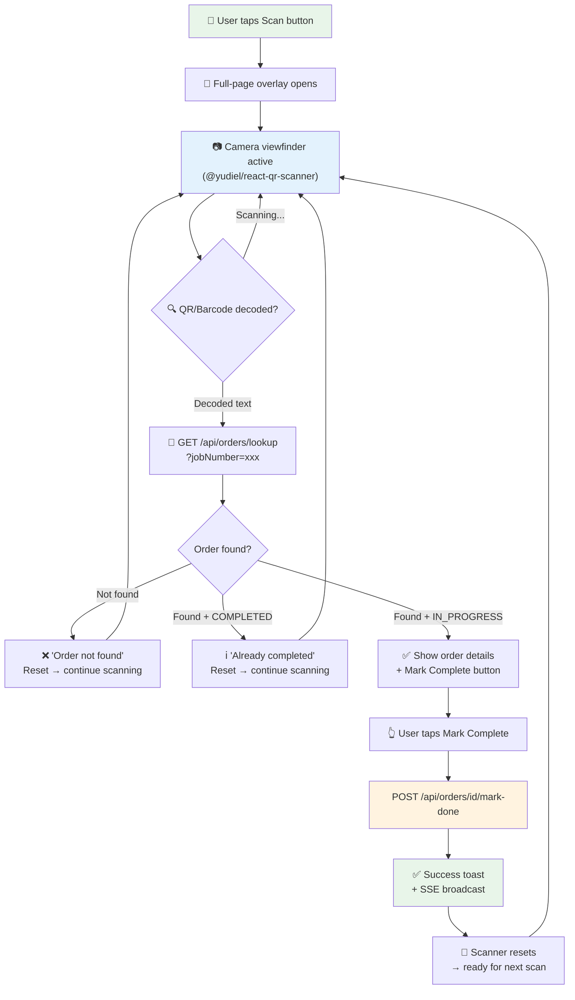
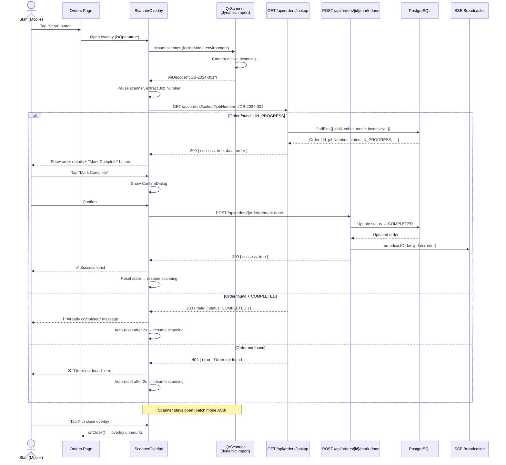

# Analysis & Solution Design — US-1.3.4: Scan QR/Barcode to Mark Order Complete
<!-- Template Version: 1.0 | Contract: v1.0 | Created: 2026-02-10 -->
<!-- 🇻🇳 Vietnamese first, 🇬🇧 English follows — for easy scanning -->

---

## TL;DR

| Aspect | Value |
|--------|-------|
| Feature | US-1.3.4: Scan QR/Barcode to Mark Order Complete |
| Status | In Review |
| Affected Roots | `sgs-cs-hepper` |
| Complexity | Medium |
| Estimated Effort | 2–3 days |

---

## 1. Problem Statement

### Current Behavior

🇻🇳 Nhân viên phải cuộn danh sách đơn hàng hoặc dùng ô tìm kiếm để tìm đơn theo Job Number, rồi nhấn nút "Mark Complete" trên từng dòng. Quy trình này chậm khi xử lý hàng loạt tài liệu vật lý đã có in mã QR/barcode.

🇬🇧 Staff must scroll the orders list or use the search box to find an order by Job Number, then click the per-row "Mark Complete" button. This is slow when batch-processing physical documents that already have QR/barcode printed on them.

### Desired Behavior

🇻🇳 Nhân viên nhấn nút "Scan" trên trang đơn hàng → mở camera → quét mã QR/barcode → hệ thống tự tìm đơn theo Job Number → hiển thị thông tin đơn + nút "Mark Complete" → sau khi hoàn thành, scanner giữ mở để quét tiếp.

🇬🇧 Staff tap "Scan" on the orders page → camera opens → scan QR/barcode → system auto-finds order by Job Number → shows order info + "Mark Complete" button → after completion, scanner stays open for continuous batch scanning.

### Gap Analysis

🇻🇳 Khoảng cách chính:
1. **Không có scanner component** — chưa có component quét QR/barcode nào trong codebase
2. **Không có `next/dynamic`** — chưa từng dùng dynamic import (scanner cần client-only vì sử dụng camera API)
3. **Không có API tìm đơn theo Job Number** — mark-done route nhận `orderId` (UUID), không nhận `jobNumber`
4. **Không có thư viện scanner** — `@yudiel/react-qr-scanner` chưa được cài đặt

🇬🇧 Key gaps:
1. **No scanner component** — no QR/barcode scanner component exists in codebase
2. **No `next/dynamic` usage** — never used dynamic import before (scanner needs client-only due to camera API)
3. **No API to find order by Job Number** — mark-done route takes `orderId` (UUID), not `jobNumber`
4. **No scanner library** — `@yudiel/react-qr-scanner` not yet installed

---

## 2. Clarifying Questions

| # | Question | Answer | Status |
|---|----------|--------|--------|
| 1 | Can QR code contain extra text besides Job Number? | Yes — scanner should extract/match Job Number from decoded text | Resolved |
| 2 | Should scanner work on desktop? | No — out of scope per work-description | Resolved |
| 3 | Which dialog component for scan confirm? | Reuse existing `ConfirmDialog` (custom, not shadcn) | Resolved |
| 4 | Where does the Scan button go? | Orders page header, next to title, visible only when `canMarkDone` | Resolved |
| 5 | Should mark-complete use route handler or server action? | Reuse existing `POST /api/orders/[id]/mark-done` route handler | Resolved |
| 6 | What if scanned text doesn't exactly match Job Number? | Case-insensitive match + trim whitespace; if no match → "not found" | Resolved |

---

## 3. Assumptions & Constraints

### Assumptions

🇻🇳
- Tài liệu vật lý đã có QR/barcode chứa Job Number (hoặc text chứa Job Number)
- Người dùng chủ yếu sử dụng trên mobile (iOS Safari 14.5+, Android Chrome 88+)
- `localhost` hoạt động không cần HTTPS khi dev (camera API cho phép localhost)
- Mỗi `jobNumber` là duy nhất trong DB (đã xác nhận: `@unique` trong Prisma schema)

🇬🇧
- Physical documents already have QR/barcode containing Job Number (or text containing it)
- Users primarily use mobile devices (iOS Safari 14.5+, Android Chrome 88+)
- `localhost` works without HTTPS during development (camera API permits localhost)
- Each `jobNumber` is unique in DB (confirmed: `@unique` in Prisma schema)

### Constraints

🇻🇳
- Phải dùng `@yudiel/react-qr-scanner` v2.5.1 (đã chọn từ backlog planning)
- Phải dùng `next/dynamic` với `{ ssr: false }` (camera API không có trên server)
- Phải dùng HTTPS trên production (Vercel tự đáp ứng)
- Phải reuse SSE broadcaster hiện có cho realtime update
- Phải tuân thủ permission check `canUpdateStatus` như flow mark-done hiện tại

🇬🇧
- Must use `@yudiel/react-qr-scanner` v2.5.1 (chosen during backlog planning)
- Must use `next/dynamic` with `{ ssr: false }` (camera API not available on server)
- Must use HTTPS in production (Vercel satisfies this)
- Must reuse existing SSE broadcaster for realtime updates
- Must follow `canUpdateStatus` permission check matching current mark-done flow

---

## 4. Existing Patterns Found

| Location | Pattern | Reusable |
|----------|---------|----------|
| `src/app/api/orders/[id]/mark-done/route.ts` | POST route handler: auth → permission check → Prisma update → SSE broadcast | Yes — reuse entire endpoint |
| `src/components/orders/MarkDoneModal.tsx` | Wrapper around ConfirmDialog for mark-done confirmation | Partial — reuse pattern, different context text |
| `src/components/admin/confirm-dialog.tsx` | Custom modal: isOpen/title/message/onConfirm/onCancel/isLoading | Yes — reuse for scan confirm |
| `src/app/(orders)/orders/page.tsx` | Permission computation: `canMarkDone` from session | Yes — same permission gates scan button |
| `src/components/orders/realtime-orders.tsx` | Client component receiving `canMarkDone` prop | Yes — scan button can be added here or page header |
| `src/components/orders/orders-table.tsx` | `fetch('/api/orders/${id}/mark-done', { method: 'POST' })` pattern | Yes — reuse same API call pattern |
| `prisma/schema.prisma` | `jobNumber String @unique` | Yes — enables efficient lookup |
| `src/lib/sse/broadcaster.ts` | `broadcastOrderUpdate(order)` | Yes — already called by mark-done route |

---

## 5. Solution Options

### Option A: Scanner as Full-Page Overlay

🇻🇳 Scanner mở dưới dạng overlay full-screen phủ lên toàn bộ orders page. Kết quả quét hiện bên dưới viewfinder. Nhấn X để đóng overlay.

🇬🇧 Scanner opens as a full-screen overlay covering the entire orders page. Scan results display below the viewfinder. Press X to close overlay.

**Ưu điểm / Pros:**
- Maximizes camera viewfinder area (important on mobile)
- Clear UX — scanner is the focused task
- No routing changes needed

**Nhược điểm / Cons:**
- Covers order list (can't see list while scanning)
- Needs careful z-index management

### Option B: Scanner as Modal Dialog

🇻🇳 Scanner mở trong một modal dialog (dùng ConfirmDialog pattern). Kết quả quét hiện trong modal.

🇬🇧 Scanner opens inside a modal dialog (using ConfirmDialog pattern). Scan results appear within the modal.

**Ưu điểm / Pros:**
- Familiar pattern (matches existing ConfirmDialog UX)
- Easy to dismiss
- Less invasive than full-page overlay

**Nhược điểm / Cons:**
- Modal constrains viewfinder size on mobile
- Modal backdrop + camera = complex layering
- Harder to do continuous scanning in a modal

### Option C: Scanner as Dedicated Route

🇻🇳 Tạo route riêng `/orders/scan` với layout tối ưu cho mobile scanning.

🇬🇧 Create a dedicated `/orders/scan` route with a mobile-optimized scanning layout.

**Ưu điểm / Pros:**
- Clean separation of concerns
- Full page for scanner
- Can have own loading state

**Nhược điểm / Cons:**
- Navigation overhead (back to orders)
- SSE reconnection on page change
- More files to maintain

### Comparison Matrix

| Aspect | Option A: Full-Page Overlay | Option B: Modal | Option C: Dedicated Route |
|--------|---------------------------|-----------------|--------------------------|
| Description | Full-screen overlay on orders page | Scanner inside modal dialog | Separate `/orders/scan` route |
| Mobile UX | ⭐ Best — max viewfinder | Fair — constrained | Good — full page |
| Batch Scanning | ⭐ Best — stays open naturally | Awkward in modal | Good but loses order list context |
| Implementation Effort | Medium | Low | High |
| Risk | Low | Medium (layering issues) | Medium (SSE reconnect) |
| Maintainability | Medium | High (reuses dialog) | Low (more files) |

### Chosen Solution

**Decision: Option A — Scanner as Full-Page Overlay**

🇻🇳 Chọn Option A vì tối ưu nhất cho trải nghiệm mobile scanning. Batch scanning (AC8) quan trọng — overlay cho phép scanner giữ mở tự nhiên sau mỗi lần mark complete. Viewfinder lớn nhất giúp quét nhanh hơn. Không cần thay đổi routing, không lo SSE reconnect.

🇬🇧 Chose Option A because it provides the best mobile scanning experience. Batch scanning (AC8) is important — overlay naturally keeps scanner open after each mark complete. Largest viewfinder enables faster scanning. No routing changes needed, no SSE reconnection concerns.

---

## 6. Solution Overview

🇻🇳 Giải pháp thêm nút "Scan" vào header trang orders (chỉ hiển thị khi `canMarkDone`). Khi nhấn, một overlay full-page mở lên chứa camera viewfinder (dùng `@yudiel/react-qr-scanner` được load qua `next/dynamic` với `ssr: false`). Khi quét được mã, hệ thống gọi API mới `GET /api/orders/lookup?jobNumber=xxx` để tìm đơn theo Job Number. Nếu tìm thấy đơn đang `IN_PROGRESS`, hiển thị thông tin đơn + nút "Mark Complete". Khi nhấn Mark Complete, gọi endpoint hiện có `POST /api/orders/[id]/mark-done` — endpoint này tự broadcast SSE event. Sau khi hoàn thành, scanner reset trạng thái và sẵn sàng quét tiếp (batch mode).

🇬🇧 The solution adds a "Scan" button to the orders page header (visible only when `canMarkDone`). When tapped, a full-page overlay opens containing the camera viewfinder (using `@yudiel/react-qr-scanner` loaded via `next/dynamic` with `ssr: false`). When a code is scanned, the system calls a new `GET /api/orders/lookup?jobNumber=xxx` API to find the order by Job Number. If an `IN_PROGRESS` order is found, it shows order details + "Mark Complete" button. Tapping Mark Complete calls the existing `POST /api/orders/[id]/mark-done` endpoint — which already broadcasts the SSE event. After completion, the scanner resets state and is ready for the next scan (batch mode).

### Architecture Diagram

---

## 7. Components

| Component | Root | Type | Description |
|-----------|------|------|-------------|
| `ScanButton` | sgs-cs-hepper | New | Button in orders page header that opens scanner overlay |
| `ScannerOverlay` | sgs-cs-hepper | New | Full-page overlay containing scanner + result display |
| `QrScanner` (dynamic) | sgs-cs-hepper | New | Dynamic-imported wrapper around `@yudiel/react-qr-scanner` |
| `ScanResult` | sgs-cs-hepper | New | Displays scanned order info + Mark Complete action |
| `GET /api/orders/lookup` | sgs-cs-hepper | New | API route to find order by Job Number |
| `POST /api/orders/[id]/mark-done` | sgs-cs-hepper | Existing | Reuse — mark order complete + SSE broadcast |
| `ConfirmDialog` | sgs-cs-hepper | Existing | Reuse — confirm mark-complete action |

### Component Details

#### `ScanButton`

🇻🇳 Nút nhỏ với icon `ScanLine` (lucide-react) đặt cạnh tiêu đề "Orders" trong page header. Chỉ render khi `canMarkDone === true`. Nhấn vào mở `ScannerOverlay`.

🇬🇧 Small button with `ScanLine` icon (lucide-react) placed next to "Orders" title in page header. Only renders when `canMarkDone === true`. Click opens `ScannerOverlay`.

- **Location:** `src/components/orders/scan-button.tsx`
- **Props:** `onOpenScanner: () => void`
- **Dependencies:** lucide-react (`ScanLine` icon)

#### `ScannerOverlay`

🇻🇳 Component client-only chứa toàn bộ logic scan: camera viewfinder, kết quả quét, nút mark complete, trạng thái lỗi. Overlay full-screen với nền đen semi-transparent, nút đóng ở góc trên. Quản lý state machine: `idle → scanning → found → marking → done → scanning`.

🇬🇧 Client-only component containing all scan logic: camera viewfinder, scan results, mark complete button, error states. Full-screen overlay with semi-transparent black background, close button in top corner. Manages state machine: `idle → scanning → found → marking → done → scanning`.

- **Location:** `src/components/orders/scanner-overlay.tsx`
- **Props:** `isOpen: boolean`, `onClose: () => void`
- **State Machine:**
  - `scanning` — camera active, waiting for decode
  - `looking-up` — decoded text found, calling lookup API
  - `found` — order found, showing details + Mark Complete
  - `already-completed` — order already completed, show message
  - `not-found` — no matching order, show error
  - `marking` — calling mark-done API
  - `done` — mark complete success, auto-reset to scanning

#### `QrScanner` (Dynamic Import Wrapper)

🇻🇳 Wrapper component load `@yudiel/react-qr-scanner` qua `next/dynamic` với `{ ssr: false }`. Cung cấp `onDecode` callback, cấu hình `facingMode: 'environment'` (camera sau), loading fallback.

🇬🇧 Wrapper component loading `@yudiel/react-qr-scanner` via `next/dynamic` with `{ ssr: false }`. Provides `onDecode` callback, configures `facingMode: 'environment'` (rear camera), loading fallback.

- **Location:** `src/components/orders/qr-scanner.tsx`
- **Dynamic Import:** `const Scanner = dynamic(() => import('@yudiel/react-qr-scanner').then(m => m.Scanner), { ssr: false })`
- **Props:** `onDecode: (result: string) => void`, `onError?: (error: Error) => void`, `enabled: boolean`

#### `ScanResult`

🇻🇳 Hiển thị kết quả sau khi quét: thông tin đơn hàng (Job Number, status, priority), nút "Mark Complete" hoặc thông báo trạng thái. Có thể nhúng trực tiếp trong `ScannerOverlay` hoặc tách riêng.

🇬🇧 Displays result after scanning: order info (Job Number, status, priority), "Mark Complete" button or status message. Can be embedded directly in `ScannerOverlay` or extracted separately.

- **Location:** Inline within `ScannerOverlay` (no separate file needed — keeps component tree simple)
- **States:** found (show details + button), already-completed (info message), not-found (error message)

#### `GET /api/orders/lookup`

🇻🇳 API route mới tìm order theo `jobNumber`. Trả về order data nếu tìm thấy, 404 nếu không. Case-insensitive match. Cần auth check (chỉ authenticated users).

🇬🇧 New API route finding order by `jobNumber`. Returns order data if found, 404 if not. Case-insensitive match. Requires auth check (authenticated users only).

- **Location:** `src/app/api/orders/lookup/route.ts`
- **Method:** GET
- **Query Params:** `jobNumber` (string, required)
- **Response:** `{ success: true, data: OrderData }` or `{ success: false, error: string }`
- **Auth:** Session required (any authenticated user — permission check happens at mark-done step)
- **Prisma Query:** `findFirst({ where: { jobNumber: { equals: value, mode: 'insensitive' } } })`

---

## 8. Data Flow

| Step | Action | From | To |
|------|--------|------|-----|
| 1 | User taps "Scan" button | `OrdersPage` header | `ScannerOverlay` opens |
| 2 | Camera activates, viewfinder renders | `QrScanner` | Camera stream |
| 3 | QR/Barcode decoded → `onDecode(text)` | Camera → `@yudiel/react-qr-scanner` | `ScannerOverlay` |
| 4 | Extract Job Number from decoded text | `ScannerOverlay` | Local processing (trim + normalize) |
| 5 | Lookup order: `GET /api/orders/lookup?jobNumber=xxx` | `ScannerOverlay` | API route |
| 6 | API queries Prisma (case-insensitive) | API route | PostgreSQL |
| 7 | Return order data or 404 | PostgreSQL → API | `ScannerOverlay` |
| 8 | Display result (found / already-completed / not-found) | `ScannerOverlay` | UI |
| 9 | User taps "Mark Complete" | UI button | `fetch()` |
| 10 | `POST /api/orders/[id]/mark-done` | `ScannerOverlay` | Existing route handler |
| 11 | Update DB + broadcast SSE | Route handler | PostgreSQL + SSE clients |
| 12 | Show success toast, reset scanner | `ScannerOverlay` | UI → back to scanning |

### Sequence Diagram

---

## 9. Cross-Root Impact

| Root | Change Type | Sync Required |
|------|-------------|---------------|
| `sgs-cs-hepper` | Code | N/A (single-root change) |
| `a-z-copilot-flow` | None | No |

🇻🇳 Feature này chỉ ảnh hưởng root `sgs-cs-hepper`. Không có cross-root impact.

🇬🇧 This feature only affects the `sgs-cs-hepper` root. No cross-root impact.

---

## 10. Dependencies

| Package | Version | Status | Notes |
|---------|---------|--------|-------|
| `@yudiel/react-qr-scanner` | ^2.5.1 | **New** | Core scanner library, React-first, TypeScript |
| `next` | 16.1.6 | Existing | `next/dynamic` for SSR-off import |
| `react` | 19.2.3 | Existing | |
| `lucide-react` | 0.563.0 | Existing | `ScanLine` icon for scan button |
| `zod` | 4.3.6 | Existing | Validate query params in lookup API |

---

## 11. Risks & Mitigations

| Risk | Likelihood | Impact | Mitigation |
|------|------------|--------|------------|
| Camera permission denied | Medium | High | AC12: Show clear fallback message with instructions |
| QR text doesn't match Job Number format | Low | Medium | Trim whitespace, case-insensitive match, partial match extraction |
| Scanner library bundle size | Low | Low | Dynamic import ensures it's only loaded when needed |
| iOS Safari camera quirks | Medium | Medium | Test on iOS Safari 14.5+; `@yudiel/react-qr-scanner` handles browser compat |
| Rapid successive scans overwhelm API | Low | Low | Debounce/pause scanner after each decode until result processed |

### Risk Details

#### Risk 1: Camera Permission Denied

🇻🇳 
**Bối cảnh:** Trên mobile, trình duyệt yêu cầu quyền camera. User có thể từ chối hoặc đã block trước đó.
**Giảm thiểu:** Hiển thị thông báo rõ ràng với hướng dẫn bật quyền camera trong cài đặt trình duyệt. Component `QrScanner` bắt `onError` và phân biệt lỗi permission vs lỗi khác.

🇬🇧
**Context:** On mobile, browser requests camera permission. User may deny or have previously blocked.
**Mitigation:** Display clear message with instructions to enable camera in browser settings. `QrScanner` component catches `onError` and distinguishes permission errors from other errors.

#### Risk 2: QR Text Doesn't Match Job Number

🇻🇳
**Bối cảnh:** QR code có thể chứa URL, JSON, hoặc text có thêm prefix/suffix ngoài Job Number.
**Giảm thiểu:** Bước trích xuất Job Number sẽ: (1) trim whitespace, (2) thử match trực tiếp trước, (3) nếu không khớp, tìm pattern Job Number trong text (regex).

🇬🇧
**Context:** QR code might contain URL, JSON, or text with extra prefix/suffix beyond Job Number.
**Mitigation:** Job Number extraction step will: (1) trim whitespace, (2) try direct match first, (3) if no match, search for Job Number pattern in text (regex fallback).

---

## 12. Decision Log

| ID | Date | Decision | Rationale |
|----|------|----------|-----------|
| D1 | 2026-02-10 | Use `@yudiel/react-qr-scanner` v2.5.1 | React-first, TypeScript, actively maintained, small bundle |
| D2 | 2026-02-10 | Full-page overlay (not modal or route) | Best mobile UX, natural batch scanning, no routing overhead |
| D3 | 2026-02-10 | Reuse existing `POST /api/orders/[id]/mark-done` | No new mutation logic — existing endpoint handles auth + Prisma + SSE |
| D4 | 2026-02-10 | New `GET /api/orders/lookup` API route | Need to find order by `jobNumber` (not by `id`); mark-done needs `id` |
| D5 | 2026-02-10 | Use `next/dynamic` with `ssr: false` | Camera API is browser-only; first dynamic import in codebase |
| D6 | 2026-02-10 | Reuse `ConfirmDialog` for mark-complete confirmation | Consistent UX with existing mark-done flow in orders table |
| D7 | 2026-02-10 | Scanner pauses on decode, resumes after action | Prevents rapid duplicate scans; clean state management |

### Decision D4: New Lookup API Route

🇻🇳 
**Bối cảnh:** Scanner decode ra `jobNumber` (text trên QR/barcode), nhưng mark-done route cần `orderId` (UUID).
**Các lựa chọn:** (a) Client-side search trong danh sách orders hiện có, (b) Server action, (c) Dedicated API route.
**Quyết định:** API route `GET /api/orders/lookup?jobNumber=xxx`
**Lý do:** (a) Client-side search chỉ tìm trong orders đã load — có thể miss orders chưa hiển thị. (b) Server action cũng OK nhưng API route nhất quán hơn với pattern hiện có (mark-done là route handler). (c) Dedicated route cho phép caching, logging, và dễ test hơn.

🇬🇧
**Context:** Scanner decodes `jobNumber` (text on QR/barcode), but mark-done route needs `orderId` (UUID).
**Options:** (a) Client-side search in currently loaded orders list, (b) Server action, (c) Dedicated API route.
**Decision:** API route `GET /api/orders/lookup?jobNumber=xxx`
**Rationale:** (a) Client-side search only finds orders already loaded — may miss orders not yet visible. (b) Server action also works but API route is more consistent with existing pattern (mark-done is a route handler). (c) Dedicated route allows caching, logging, and easier testing.

---

## 13. Notes & Concerns

🇻🇳
- **Ghi chú 1:** Đây là lần đầu tiên dùng `next/dynamic` trong codebase — cần document pattern rõ ràng cho team
- **Ghi chú 2:** Camera viewfinder nên có tỷ lệ 4:3 hoặc 16:9 tùy thiết bị, không stretch
- **Quan ngại 1:** `@yudiel/react-qr-scanner` v2.5.1 tương thích React 19? → Cần verify khi install (đã check: hỗ trợ React 18+, peer dep `react >= 18`)
- **Quan ngại 2:** Khi scan liên tục, cần đảm bảo không trùng lặp mark-done request cho cùng một order

🇬🇧
- **Note 1:** First-ever `next/dynamic` usage in codebase — needs clear pattern documentation for team
- **Note 2:** Camera viewfinder should maintain 4:3 or 16:9 aspect ratio per device, no stretching
- **Concern 1:** `@yudiel/react-qr-scanner` v2.5.1 compatible with React 19? → Verify on install (checked: supports React 18+, peer dep `react >= 18`)
- **Concern 2:** During continuous scanning, ensure no duplicate mark-done requests for the same order

---

## Approval

| Role | Name | Status | Date |
|------|------|--------|------|
| Author | Copilot | ✅ Done | 2026-02-10 |
| Reviewer | User | ⏳ Pending | — |

---

## Next Step

🇻🇳 Sau khi phê duyệt, tiến hành **Phase 1: Specification**.

🇬🇧 After approval, proceed to **Phase 1: Specification**.

Reply: `approved` or `revise: <feedback>`
