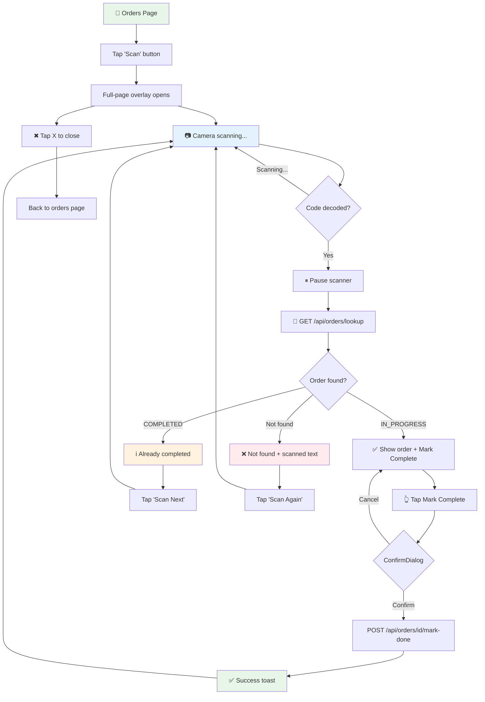

# Specification — US-1.3.4: Scan QR/Barcode to Mark Order Complete
<!-- Template Version: 1.0 | Contract: v1.0 | Created: 2026-02-10 -->
<!-- 🇻🇳 Vietnamese first, 🇬🇧 English follows — for easy scanning -->

---

## TL;DR

| Aspect | Value |
|--------|-------|
| Feature | US-1.3.4: Scan QR/Barcode to Mark Order Complete |
| Status | In Review |
| Phase 0 Analysis | [solution-design.md](../00_analysis/solution-design.md) |
| Functional Requirements | 8 |
| Non-Functional Requirements | 5 |
| Affected Roots | `sgs-cs-hepper` |

---

## 1. Overview

🇻🇳 Tính năng cho phép nhân viên quét QR code hoặc barcode trên tài liệu vật lý bằng camera điện thoại, hệ thống tự động tìm đơn hàng theo Job Number và cho phép đánh dấu hoàn thành chỉ với một chạm. Scanner giữ mở cho phép quét hàng loạt liên tục. Spec này định nghĩa các yêu cầu chi tiết để triển khai tính năng, dựa trên Phase 0 solution design đã được duyệt.

🇬🇧 This feature allows staff to scan QR codes or barcodes on physical documents using their phone's camera, automatically find the matching order by Job Number, and mark it complete with a single tap. The scanner stays open for continuous batch scanning. This spec defines the detailed requirements for implementation, based on the approved Phase 0 solution design.

---

## 2. Goals & Non-Goals

### Goals

🇻🇳
1. **Tăng tốc batch processing:** Giảm thời gian xử lý từ tìm kiếm thủ công → quét 1 bước
2. **Giảm lỗi:** Loại bỏ sai sót khi tìm đơn bằng tay (nhầm Job Number)
3. **Trải nghiệm mobile-first:** Tối ưu cho nhân viên dùng điện thoại tại phòng lab

🇬🇧
1. **Accelerate batch processing:** Reduce time from manual search → one-step scan
2. **Reduce errors:** Eliminate mistakes from manual order lookup (wrong Job Number)
3. **Mobile-first experience:** Optimized for staff using phones at the lab

### Non-Goals

🇻🇳
1. Không hỗ trợ quét offline (cần kết nối mạng)
2. Không tạo QR/barcode (chỉ đọc)
3. Không cho phép chỉnh sửa đơn từ màn hình quét
4. Không ghi nhận `completedById` (thuộc US-1.3.5)
5. Không hỗ trợ webcam desktop
6. Không bắt buộc haptic/sound feedback

🇬🇧
1. No offline scanning support (requires network connection)
2. No QR/barcode generation (read-only)
3. No order editing from scan view
4. No `completedById` tracking (belongs to US-1.3.5)
5. No desktop webcam support
6. No mandatory haptic/sound feedback

---

## 3. User Stories

### US-001: Scan to Find Order

🇻🇳 Là nhân viên có quyền `canUpdateStatus`, tôi muốn quét mã QR/barcode trên tài liệu bằng camera, để hệ thống tự động tìm đơn hàng tương ứng mà không cần tìm kiếm thủ công.

🇬🇧 As a staff member with `canUpdateStatus` permission, I want to scan a QR/barcode on a document using my camera, so the system automatically finds the corresponding order without manual searching.

### US-002: One-Tap Mark Complete from Scan

🇻🇳 Là nhân viên, sau khi quét tìm thấy đơn đang xử lý, tôi muốn nhấn một nút để đánh dấu hoàn thành, để quy trình nhanh nhất có thể.

🇬🇧 As a staff member, after scanning and finding an in-progress order, I want to tap one button to mark it complete, so the workflow is as fast as possible.

### US-003: Batch Scanning

🇻🇳 Là nhân viên xử lý nhiều tài liệu, tôi muốn scanner giữ mở sau mỗi lần đánh dấu hoàn thành, để tôi có thể quét liên tục mà không cần mở lại scanner.

🇬🇧 As a staff member processing multiple documents, I want the scanner to stay open after each mark complete, so I can scan continuously without re-opening the scanner.

---

## 4. Requirements Matrix

| ID | Title | Priority | Type | Maps to AC |
|----|-------|----------|------|------------|
| FR-001 | Scan Button Visibility | Must | Functional | AC1, AC11 |
| FR-002 | Camera Scanner Activation | Must | Functional | AC2, AC3 |
| FR-003 | QR/Barcode Decode & Lookup | Must | Functional | AC4 |
| FR-004 | In-Progress Order → Mark Complete | Must | Functional | AC5 |
| FR-005 | Already Completed Order Feedback | Must | Functional | AC6 |
| FR-006 | Order Not Found Feedback | Must | Functional | AC7 |
| FR-007 | Batch Scanning (Continuous Mode) | Must | Functional | AC8 |
| FR-008 | Scanner Dismissal | Must | Functional | AC9 |
| NFR-001 | Mobile Browser Compatibility | Must | Non-Functional | AC10 |
| NFR-002 | Permission Security | Must | Non-Functional | AC11 |
| NFR-003 | Lookup API Performance | Should | Non-Functional | — |
| NFR-004 | Camera Permission Handling | Must | Non-Functional | AC12 |
| NFR-005 | Dynamic Import (SSR Safety) | Must | Non-Functional | — |

---

## 5. Functional Requirements

### FR-001: Scan Button Visibility

| Aspect | Detail |
|--------|--------|
| Priority | Must |
| Affected Roots | `sgs-cs-hepper` |

#### Description

🇻🇳 Nút "Scan" (icon `ScanLine` từ lucide-react) hiển thị trong header trang orders, cạnh tiêu đề "Orders". Nút chỉ xuất hiện khi user có quyền `canMarkDone` (tính từ session: SUPER_ADMIN/ADMIN luôn có, STAFF nếu `canUpdateStatus === true`). Nút không hiển thị cho user không có quyền hoặc chưa đăng nhập.

🇬🇧 A "Scan" button (using `ScanLine` icon from lucide-react) displays in the orders page header, next to the "Orders" title. The button only appears when the user has `canMarkDone` permission (computed from session: SUPER_ADMIN/ADMIN always, STAFF if `canUpdateStatus === true`). The button is not rendered for unauthorized or unauthenticated users.

#### Acceptance Criteria

- [ ] AC1: "Scan" button with `ScanLine` icon visible in orders page header when `canMarkDone === true`
- [ ] AC2: Button NOT rendered when `canMarkDone === false` (DOM element absent, not just hidden)
- [ ] AC3: Button appears on both "In Progress" and "Completed" tabs (always in header)

---

### FR-002: Camera Scanner Activation

| Aspect | Detail |
|--------|--------|
| Priority | Must |
| Affected Roots | `sgs-cs-hepper` |

#### Description

🇻🇳 Khi nhấn nút "Scan", overlay full-page mở lên chứa camera viewfinder. Scanner sử dụng `@yudiel/react-qr-scanner` được load qua `next/dynamic({ ssr: false })`. Camera mặc định là camera sau (rear) trên mobile (`facingMode: 'environment'`). Viewfinder hiển thị trung tâm overlay, duy trì tỷ lệ aspect ratio phù hợp.

🇬🇧 When the "Scan" button is tapped, a full-page overlay opens containing the camera viewfinder. The scanner uses `@yudiel/react-qr-scanner` loaded via `next/dynamic({ ssr: false })`. The default camera is rear-facing on mobile (`facingMode: 'environment'`). The viewfinder displays centered in the overlay, maintaining appropriate aspect ratio.

#### Acceptance Criteria

- [ ] AC1: Tapping "Scan" opens a full-page overlay with camera viewfinder
- [ ] AC2: Scanner uses `@yudiel/react-qr-scanner` loaded via `next/dynamic` with `{ ssr: false }`
- [ ] AC3: Default camera is rear-facing (`facingMode: 'environment'`)
- [ ] AC4: Overlay has semi-transparent dark background behind the scanner area
- [ ] AC5: Loading fallback shown while scanner component loads (dynamic import chunk)

---

### FR-003: QR/Barcode Decode & Lookup

| Aspect | Detail |
|--------|--------|
| Priority | Must |
| Affected Roots | `sgs-cs-hepper` |

#### Description

🇻🇳 Khi scanner decode được text từ QR code hoặc barcode, hệ thống: (1) pause scanner để tránh quét trùng, (2) trim whitespace từ decoded text, (3) gọi `GET /api/orders/lookup?jobNumber=<text>` để tìm đơn theo Job Number. API thực hiện case-insensitive match qua Prisma `findFirst` với `mode: 'insensitive'`. Nếu decoded text chứa nội dung thêm ngoài Job Number (vd: URL), hệ thống vẫn thử match trực tiếp trước.

🇬🇧 When the scanner decodes text from a QR code or barcode, the system: (1) pauses the scanner to prevent duplicate scans, (2) trims whitespace from decoded text, (3) calls `GET /api/orders/lookup?jobNumber=<text>` to find the order by Job Number. The API performs a case-insensitive match via Prisma `findFirst` with `mode: 'insensitive'`. If decoded text contains extra content beyond the Job Number (e.g., URL), the system still tries a direct match first.

#### Acceptance Criteria

- [ ] AC1: Scanner pauses immediately after successful decode (no duplicate triggers)
- [ ] AC2: Decoded text is trimmed of leading/trailing whitespace before lookup
- [ ] AC3: Lookup API called with decoded text as `jobNumber` query parameter
- [ ] AC4: Match is case-insensitive (e.g., "job-001" matches "JOB-001")
- [ ] AC5: Loading indicator shown during lookup API call

---

### FR-004: In-Progress Order → Mark Complete

| Aspect | Detail |
|--------|--------|
| Priority | Must |
| Affected Roots | `sgs-cs-hepper` |

#### Description

🇻🇳 Khi lookup tìm thấy đơn có `status: IN_PROGRESS`, hiển thị: thông tin đơn (Job Number, registered date, priority) + nút "Mark Complete". Khi nhấn nút, hiển thị ConfirmDialog xác nhận. Sau khi user xác nhận, gọi `POST /api/orders/[id]/mark-done` (endpoint hiện có). Thành công → hiện toast success + reset scanner để quét tiếp.

🇬🇧 When lookup finds an order with `status: IN_PROGRESS`, display: order info (Job Number, registered date, priority) + "Mark Complete" button. When button is tapped, show ConfirmDialog for confirmation. After user confirms, call `POST /api/orders/[id]/mark-done` (existing endpoint). On success → show success toast + reset scanner for next scan.

#### Acceptance Criteria

- [ ] AC1: Found IN_PROGRESS order shows Job Number, registered date, and priority
- [ ] AC2: "Mark Complete" button displayed alongside order info
- [ ] AC3: Tapping "Mark Complete" shows ConfirmDialog with order's Job Number in message
- [ ] AC4: After confirmation, calls `POST /api/orders/[id]/mark-done` with the order's `id`
- [ ] AC5: Success response → success toast notification
- [ ] AC6: After success, scanner resets and resumes scanning (batch mode)
- [ ] AC7: Loading state shown on confirm button during API call (`isLoading` prop)

---

### FR-005: Already Completed Order Feedback

| Aspect | Detail |
|--------|--------|
| Priority | Must |
| Affected Roots | `sgs-cs-hepper` |

#### Description

🇻🇳 Khi lookup tìm thấy đơn có `status: COMPLETED`, hiển thị thông báo "Order already completed" với Job Number. Không có nút hành động. Sau khoảng 2–3 giây (hoặc nhấn nút "Scan Next"), scanner tự động reset để quét tiếp.

🇬🇧 When lookup finds an order with `status: COMPLETED`, display "Order already completed" message with Job Number. No action button. After ~2–3 seconds (or tapping "Scan Next" button), scanner auto-resets to continue scanning.

#### Acceptance Criteria

- [ ] AC1: Completed order shows info message: "Order `{jobNumber}` already completed"
- [ ] AC2: No "Mark Complete" button shown for completed orders
- [ ] AC3: "Scan Next" button available to manually reset and continue scanning
- [ ] AC4: Visual differentiation from success state (info/neutral color, not green)

---

### FR-006: Order Not Found Feedback

| Aspect | Detail |
|--------|--------|
| Priority | Must |
| Affected Roots | `sgs-cs-hepper` |

#### Description

🇻🇳 Khi lookup không tìm thấy đơn nào khớp với decoded text, hiển thị thông báo lỗi "Order not found" kèm text đã quét. Có nút "Scan Again" để reset scanner và thử lại.

🇬🇧 When lookup finds no order matching the decoded text, display error message "Order not found" with the scanned text. Includes "Scan Again" button to reset scanner and try again.

#### Acceptance Criteria

- [ ] AC1: Not-found state shows error message: "Order not found"
- [ ] AC2: Scanned text displayed so user can verify what was decoded
- [ ] AC3: "Scan Again" button available to reset and resume scanning
- [ ] AC4: Visual differentiation as error state (red/warning color)

---

### FR-007: Batch Scanning (Continuous Mode)

| Aspect | Detail |
|--------|--------|
| Priority | Must |
| Affected Roots | `sgs-cs-hepper` |

#### Description

🇻🇳 Scanner overlay giữ mở sau tất cả các kết quả (mark complete thành công, đã hoàn thành, không tìm thấy). Sau mỗi action, scanner reset về trạng thái scanning và sẵn sàng quét tiếp. User phải chủ động nhấn nút đóng (X) để đóng overlay.

🇬🇧 The scanner overlay stays open after all outcomes (mark complete success, already completed, not found). After each action, scanner resets to scanning state and is ready for the next scan. User must explicitly tap the close button (X) to dismiss the overlay.

#### Acceptance Criteria

- [ ] AC1: After mark-complete success → scanner resets to scanning state
- [ ] AC2: After "already completed" → scanner resets to scanning state
- [ ] AC3: After "not found" → scanner resets to scanning state
- [ ] AC4: Overlay does NOT auto-close after any outcome
- [ ] AC5: Scanner camera stream stays active between scans (no restart)

---

### FR-008: Scanner Dismissal

| Aspect | Detail |
|--------|--------|
| Priority | Must |
| Affected Roots | `sgs-cs-hepper` |

#### Description

🇻🇳 User có thể đóng scanner overlay bất cứ lúc nào bằng nút X ở góc trên phải. Khi đóng, camera stream dừng lại, overlay unmount, user trở về trang orders bình thường.

🇬🇧 User can close the scanner overlay at any time via the X button in the top-right corner. On close, camera stream stops, overlay unmounts, user returns to the normal orders page.

#### Acceptance Criteria

- [ ] AC1: X/Close button always visible in top-right corner of overlay
- [ ] AC2: Tapping X closes overlay and stops camera stream
- [ ] AC3: After closing, orders page is fully interactive (no leftover z-index or scroll locks)
- [ ] AC4: Closing during any state (scanning, found, marking) works without errors

---

## 6. Non-Functional Requirements

### NFR-001: Mobile Browser Compatibility

| Aspect | Detail |
|--------|--------|
| Category | Compatibility |
| Metric | Works on iOS Safari 14.5+ and Android Chrome 88+ |

#### Description

🇻🇳 Camera scanner phải hoạt động trên iOS Safari 14.5+ và Android Chrome 88+ qua HTTPS. Trên localhost (dev), camera API phải hoạt động không cần HTTPS. Viewfinder và overlay phải responsive, hiển thị đúng trên các kích thước màn hình mobile thông dụng (320px – 428px width).

🇬🇧 Camera scanner must work on iOS Safari 14.5+ and Android Chrome 88+ over HTTPS. On localhost (dev), camera API must work without HTTPS. Viewfinder and overlay must be responsive, displaying correctly on common mobile screen sizes (320px – 428px width).

---

### NFR-002: Permission Security

| Aspect | Detail |
|--------|--------|
| Category | Security |
| Metric | Zero unauthorized access to scan+mark-complete flow |

#### Description

🇻🇳 Scan button chỉ render khi `canMarkDone`. Lookup API yêu cầu authenticated session (bất kỳ role). Mark-done API giữ nguyên permission check hiện có (SUPER_ADMIN/ADMIN luôn, STAFF nếu `canUpdateStatus`). Không có con đường nào để user không có quyền thực hiện mark complete qua scan flow.

🇬🇧 Scan button only renders when `canMarkDone`. Lookup API requires authenticated session (any role). Mark-done API retains existing permission check (SUPER_ADMIN/ADMIN always, STAFF if `canUpdateStatus`). No path exists for unauthorized users to mark complete via scan flow.

---

### NFR-003: Lookup API Performance

| Aspect | Detail |
|--------|--------|
| Category | Performance |
| Metric | Response time < 300ms (p95) |

#### Description

🇻🇳 `GET /api/orders/lookup` phải phản hồi nhanh vì user đang chờ kết quả ngay sau khi quét. `jobNumber` đã có index `@unique` nên Prisma query nhanh. Target: < 300ms p95.

🇬🇧 `GET /api/orders/lookup` must respond quickly since user is waiting for results immediately after scanning. `jobNumber` already has `@unique` index so Prisma query is fast. Target: < 300ms p95.

---

### NFR-004: Camera Permission Handling

| Aspect | Detail |
|--------|--------|
| Category | UX / Error Handling |
| Metric | Clear fallback message when camera denied |

#### Description

🇻🇳 Khi user từ chối quyền camera hoặc camera không khả dụng, hiển thị thông báo rõ ràng hướng dẫn user bật quyền camera trong cài đặt trình duyệt. Không crash hoặc hiện blank screen.

🇬🇧 When user denies camera permission or camera is unavailable, display a clear message guiding user to enable camera permission in browser settings. Must not crash or show a blank screen.

---

### NFR-005: Dynamic Import (SSR Safety)

| Aspect | Detail |
|--------|--------|
| Category | Maintainability / Correctness |
| Metric | Zero SSR errors from scanner component |

#### Description

🇻🇳 Scanner component phải được load qua `next/dynamic` với `{ ssr: false }` để tránh lỗi SSR (camera API chỉ có trên browser). Loading fallback phải hiển thị trong khi chunk đang download. Đây là dynamic import đầu tiên trong codebase — cần pattern rõ ràng.

🇬🇧 Scanner component must be loaded via `next/dynamic` with `{ ssr: false }` to prevent SSR errors (camera API is browser-only). Loading fallback must display while chunk downloads. This is the first dynamic import in the codebase — needs clear pattern.

---

## 7. User Flow

| Step | Action | System Response | Next Step |
|------|--------|-----------------|-----------|
| 1 | User views orders page | Scan button visible in header (if permitted) | 2 |
| 2 | User taps "Scan" button | Full-page overlay opens, camera activates | 3 |
| 3 | User points camera at QR/barcode | Viewfinder active, scanning... | 4 |
| 4 | Code decoded successfully | Scanner pauses, lookup API called | 5a / 5b / 5c |
| 5a | Order found (IN_PROGRESS) | Show order info + "Mark Complete" button | 6 |
| 5b | Order found (COMPLETED) | Show "Already completed" info message | 7 |
| 5c | Order not found | Show "Not found" error with scanned text | 7 |
| 6 | User taps "Mark Complete" | ConfirmDialog shown | 6a / 6b |
| 6a | User confirms | API call → success toast → reset scanner | 3 |
| 6b | User cancels | Return to result view | 5a |
| 7 | User taps "Scan Next" / "Scan Again" | Scanner resets to scanning state | 3 |
| 8 | User taps X (close) at any time | Overlay closes, camera stops | End |

### Flow Diagram



---

## 8. Data Models

### Existing: Order (no schema changes)

```typescript
// Prisma schema — NO CHANGES required
model Order {
  id              String      @id @default(cuid())
  jobNumber       String      @unique   // ← Lookup key for scanner
  registeredDate  DateTime
  receivedDate    DateTime
  requiredDate    DateTime
  priority        Int         @default(0)
  status          OrderStatus @default(IN_PROGRESS) // IN_PROGRESS | COMPLETED
  registeredBy    String?
  completedAt     DateTime?
  // ... other fields unchanged
}
```

### Scanner State (Component-level)

```typescript
/** Scanner overlay states — managed via useState in ScannerOverlay */
type ScannerState =
  | { phase: "scanning" }
  | { phase: "looking-up"; scannedText: string }
  | { phase: "found"; order: LookupOrder }
  | { phase: "already-completed"; order: LookupOrder }
  | { phase: "not-found"; scannedText: string }
  | { phase: "marking"; order: LookupOrder }
  | { phase: "done"; order: LookupOrder };

/** Order data returned by lookup API */
interface LookupOrder {
  id: string;
  jobNumber: string;
  registeredDate: string;    // ISO string
  priority: number;
  status: "IN_PROGRESS" | "COMPLETED";
  registeredBy: string | null;
}
```

---

## 9. API Contracts

### GET /api/orders/lookup

**Purpose:** Find order by Job Number (bridge between scanned text → order ID for mark-done).

```typescript
// Request
// GET /api/orders/lookup?jobNumber=JOB-2024-001

// Query Params (validated via Zod)
interface LookupQueryParams {
  jobNumber: string; // Required, non-empty, trimmed
}

// Success Response (200)
interface LookupSuccessResponse {
  success: true;
  data: {
    id: string;
    jobNumber: string;
    registeredDate: string;   // ISO 8601
    registeredBy: string | null;
    receivedDate: string;     // ISO 8601
    requiredDate: string;     // ISO 8601
    priority: number;
    status: "IN_PROGRESS" | "COMPLETED";
    completedAt: string | null; // ISO 8601 or null
  };
}

// Not Found Response (404)
interface LookupNotFoundResponse {
  success: false;
  error: "Order not found";
}

// Validation Error Response (400)
interface LookupValidationErrorResponse {
  success: false;
  error: "jobNumber query parameter is required";
}

// Auth Error Response (403)
interface LookupAuthErrorResponse {
  success: false;
  error: "Unauthorized";
}

// Server Error Response (500)
interface LookupServerErrorResponse {
  success: false;
  error: "Internal server error";
}
```

**Auth:** Requires authenticated session (any role). Permission check deferred to mark-done step.

**Prisma Query:**
```typescript
prisma.order.findFirst({
  where: {
    jobNumber: {
      equals: jobNumber.trim(),
      mode: "insensitive",
    },
  },
  select: {
    id: true,
    jobNumber: true,
    registeredDate: true,
    registeredBy: true,
    receivedDate: true,
    requiredDate: true,
    priority: true,
    status: true,
    completedAt: true,
  },
});
```

### POST /api/orders/[id]/mark-done (Existing — No Changes)

```typescript
// Existing endpoint — reused as-is
// Request: POST /api/orders/{orderId}/mark-done (no body)
// Success (200): { success: true, data: OrderData }
// Not Found (404): { success: false, error: "Order not found" }
// Wrong Status (400): { success: false, error: "Order is not in progress" }
// Unauthorized (403): { success: false, error: "..." }
// Server Error (500): { success: false, error: "Internal server error" }
//
// Side effects: Updates DB + calls broadcastOrderUpdate(order)
```

---

## 10. Edge Cases

| ID | Scenario | Expected Behavior | Priority |
|----|----------|-------------------|----------|
| EC-001 | QR contains URL with Job Number embedded | Try direct match first; show "not found" if no match | Must handle |
| EC-002 | Same QR scanned twice rapidly | Scanner pauses after first decode; second scan ignored | Must handle |
| EC-003 | Network error during lookup | Show error message with "Retry" option | Must handle |
| EC-004 | Network error during mark-done | Show error message; order stays IN_PROGRESS; user can retry | Must handle |
| EC-005 | Order marked done by another user between scan and confirm | mark-done API returns 400 ("Order is not in progress"); show info message | Must handle |
| EC-006 | User closes overlay while mark-done API is in-flight | Request completes silently; SSE broadcasts update; no error | Should handle |
| EC-007 | Camera stream fails mid-scan | Show error with "Retry" to restart camera | Must handle |
| EC-008 | Very long decoded text (> 500 chars) | Truncate display; still send full text to API | Should handle |
| EC-009 | Empty QR code / unreadable barcode | Scanner continues scanning (no decode event fires) | Must handle |
| EC-010 | Multiple QR codes visible simultaneously | Library decodes first detected; only one lookup triggered | Should handle |

### EC-001: QR Contains URL with Embedded Job Number

🇻🇳
**Khi:** QR code chứa URL như `https://example.com/job/JOB-2024-001` thay vì chỉ "JOB-2024-001"
**Thì:** API thử match toàn bộ text trước. Nếu không tìm thấy → hiện "Order not found" kèm text đã quét. Không parse URL tự động (phức tạp và không cần thiết trong v1).
**Lý do:** Giả định QR code chứa Job Number thuần. Nếu thực tế khác, sẽ handle trong phiên bản sau.

🇬🇧
**When:** QR code contains a URL like `https://example.com/job/JOB-2024-001` instead of plain "JOB-2024-001"
**Then:** API tries matching the full text first. If not found → show "Order not found" with scanned text. No automatic URL parsing (complex and unnecessary for v1).
**Rationale:** Assumption is QR codes contain plain Job Number. If reality differs, handle in a future iteration.

### EC-005: Race Condition — Order Completed Between Scan and Confirm

🇻🇳
**Khi:** User A quét đơn, nhìn thấy IN_PROGRESS. Trong lúc đó User B mark complete cùng đơn. User A nhấn confirm.
**Thì:** mark-done API trả về 400 "Order is not in progress". Scanner hiển thị thông báo "This order was already completed" và reset để quét tiếp.
**Lý do:** Endpoint hiện có đã handle race condition này. Client chỉ cần xử lý 400 response.

🇬🇧
**When:** User A scans order, sees IN_PROGRESS. Meanwhile User B marks the same order complete. User A taps confirm.
**Then:** mark-done API returns 400 "Order is not in progress". Scanner shows message "This order was already completed" and resets for next scan.
**Rationale:** Existing endpoint already handles this race condition. Client only needs to handle the 400 response.

---

## 11. Error Handling

| Error Condition | User Message | System Action |
|-----------------|--------------|---------------|
| Camera permission denied | "Camera access is required. Please enable camera permission in your browser settings." | Show fallback UI with instructions; log warning |
| Camera not available | "No camera detected on this device." | Show fallback message; close scanner gracefully |
| Network error (lookup) | "Failed to look up order. Please check your connection." | Show error + "Retry" button; log error |
| Network error (mark-done) | "Failed to mark order as complete. Please try again." | Show error + "Retry" button; order unchanged |
| Lookup 403 (unauthenticated) | "Your session has expired. Please log in again." | Redirect to login page |
| Mark-done 403 (unauthorized) | "You do not have permission to update order status." | Show error; this should not happen if UI gates correctly |
| Mark-done 400 (not in progress) | "This order was already completed." | Show info message; reset scanner |
| Mark-done 404 (order deleted) | "Order not found. It may have been removed." | Show error; reset scanner |
| Scanner library load failure | "Scanner failed to load. Please refresh the page." | Show error in overlay; log error |

---

## 12. Cross-Root Impact

| Root | Changes | Sync Required |
|------|---------|---------------|
| `sgs-cs-hepper` | New components, new API route, new dependency | N/A (single root) |
| `a-z-copilot-flow` | No changes | No |

### Integration Points

🇻🇳 Feature này hoàn toàn nằm trong root `sgs-cs-hepper`. Không có cross-root impact. Tooling root `a-z-copilot-flow` chỉ cung cấp workflow templates.

🇬🇧 This feature is entirely within the `sgs-cs-hepper` root. No cross-root impact. Tooling root `a-z-copilot-flow` only provides workflow templates.

---

## 13. Dependencies

| Dependency | Type | Status |
|------------|------|--------|
| `@yudiel/react-qr-scanner` ^2.5.1 | npm Package | **New** — must install |
| `next/dynamic` | Framework API | Existing (Next.js 16.1.6) |
| `lucide-react` (ScanLine icon) | npm Package | Existing (0.563.0) |
| `zod` (query param validation) | npm Package | Existing (4.3.6) |
| `POST /api/orders/[id]/mark-done` | Internal API | Existing — reused |
| `ConfirmDialog` component | Internal Component | Existing — reused |
| `broadcastOrderUpdate()` SSE | Internal Utility | Existing — called by mark-done |

---

## 14. Risks & Assumptions

### Risks

| Risk | Impact | Mitigation |
|------|--------|------------|
| `@yudiel/react-qr-scanner` incompatible with React 19 | High | Peer dep says `react >= 18`; verify during install; fallback to `html5-qrcode` wrapper |
| iOS Safari camera quirks (auto-pause, rotation) | Medium | Test on real iOS devices; library handles browser compat |
| Large scanner chunk hurts initial load | Low | Dynamic import isolates scanner to separate chunk; only loaded on demand |
| Camera permission UX confusing for users | Medium | Clear instructional fallback message (NFR-004) |
| Rapid successive scans of same order | Low | Scanner pauses after decode (D7); ConfirmDialog prevents accidental double-submit |

### Assumptions

| # | Assumption | Validated |
|---|------------|-----------|
| 1 | Physical documents have QR/barcode with plain Job Number text | Pending (user confirmed in work-description) |
| 2 | `jobNumber` is unique in DB | Yes — `@unique` in Prisma schema |
| 3 | Users primarily use mobile devices for scanning | Yes — confirmed in work-description |
| 4 | `localhost` allows camera without HTTPS | Yes — standard browser behavior |
| 5 | Existing mark-done endpoint handles all edge cases (race conditions, auth) | Yes — verified in code review |

---

## 15. Open Questions

| # | Question | Status | Answer |
|---|----------|--------|--------|
| 1 | Should scanner support landscape orientation? | Resolved | Not explicitly required; overlay should be responsive to both orientations |
| 2 | Should there be a scan count/history in the overlay? | Resolved | Not in scope for v1; nice-to-have for future |
| 3 | What if QR text is a URL, not a plain Job Number? | Resolved | Try direct match; if not found → show "not found" (see EC-001) |

---

## 16. Notes

🇻🇳
- Đây là lần đầu tiên dùng `next/dynamic` trong codebase — pattern cần rõ ràng để team nắm
- `ScannerOverlay` là component phức tạp nhất (state machine 7 phases) — cần test kỹ
- Overlay phải lock body scroll khi mở để tránh scroll trang bên dưới trên mobile
- Cân nhắc `will-change: transform` hoặc `transform: translateZ(0)` cho overlay performance trên mobile

🇬🇧
- First `next/dynamic` usage in codebase — pattern needs to be clear for team reference
- `ScannerOverlay` is the most complex component (7-phase state machine) — needs thorough testing
- Overlay must lock body scroll when open to prevent underlying page scroll on mobile
- Consider `will-change: transform` or `transform: translateZ(0)` for overlay performance on mobile

---

## Approval

| Role | Name | Status | Date |
|------|------|--------|------|
| Spec Author | Copilot | ✅ Done | 2026-02-10 |
| Reviewer | User | ⏳ Pending | — |

---

## Next Step

🇻🇳 Sau khi phê duyệt, tiến hành **Phase 2: Task Planning**.

🇬🇧 After approval, proceed to **Phase 2: Task Planning**.

Reply: `approved` or `revise: <feedback>`
