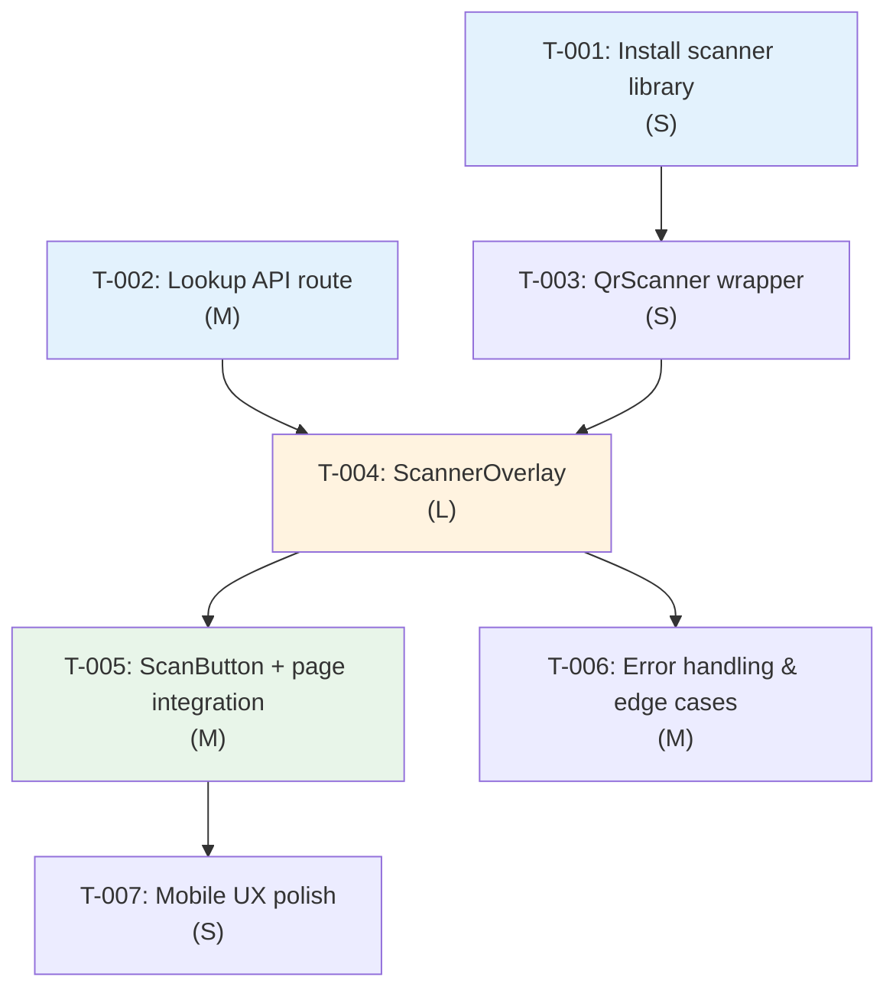

# Task Plan — US-1.3.4: Scan QR/Barcode to Mark Order Complete
# Kế hoạch Task — US-1.3.4: Quét QR/Barcode để Đánh dấu Đơn Hoàn thành
<!-- Template Version: 1.0 | Contract: v1.0 | Created: 2026-02-10 -->
<!-- Dev Mode: standard -->

---

## 📋 TL;DR

| Aspect | Value |
|--------|-------|
| Feature | US-1.3.4: Scan QR/Barcode to Mark Order Complete |
| Total Tasks | 7 |
| Estimated Effort | ~8 hours |
| Affected Roots | `sgs-cs-hepper` |
| Dev Mode | Standard |
| Spec Reference | [spec.md](../01_spec/spec.md) |

---

## Task Overview / Tổng quan Task

| ID | Title | Root | Deps | Est | Status |
|----|-------|------|------|-----|--------|
| T-001 | Install `@yudiel/react-qr-scanner` | sgs-cs-hepper | — | S | ⬜ |
| T-002 | Create `GET /api/orders/lookup` API route | sgs-cs-hepper | — | M | ⬜ |
| T-003 | Create `QrScanner` dynamic-import wrapper | sgs-cs-hepper | T-001 | S | ⬜ |
| T-004 | Create `ScannerOverlay` component (state machine + UI) | sgs-cs-hepper | T-002, T-003 | L | ⬜ |
| T-005 | Create `ScanButton` and integrate into orders page | sgs-cs-hepper | T-004 | M | ⬜ |
| T-006 | Error handling, edge cases & camera permission fallback | sgs-cs-hepper | T-004 | M | ⬜ |
| T-007 | Mobile UX polish (scroll lock, responsive, a11y) | sgs-cs-hepper | T-005 | S | ⬜ |

---

## Dependency Graph / Đồ thị Phụ thuộc



---

## 3.5. Parallel Execution Notes / Ghi chú Thực thi Song song

```yaml
parallel_groups:
  - group: A
    tasks: [T-001, T-002]
    reason: "No dependency between them. T-001 installs package, T-002 creates API route — different files."

  - group: B
    tasks: [T-006, T-005]
    reason: "Both depend on T-004 but modify different files. T-005 modifies page.tsx, T-006 modifies scanner-overlay.tsx."

sequential_constraints:
  - sequence: "T-001 → T-003 → T-004"
    reason: "T-003 imports from package installed in T-001; T-004 imports T-003"
  - sequence: "T-002 → T-004"
    reason: "T-004 calls the lookup API created in T-002"
  - sequence: "T-005 → T-007"
    reason: "T-007 polishes UX of components created in T-005"
```

---

## Tasks by Root / Task theo Root

### Root: sgs-cs-hepper

---

#### T-001: Install `@yudiel/react-qr-scanner`

| Aspect | Detail |
|--------|--------|
| Root | `sgs-cs-hepper` |
| Dependencies | None |
| Estimate | S (15 min) |
| Requirements | FR-002, NFR-005 |

**Description / Mô tả:**
- **EN:** Install `@yudiel/react-qr-scanner` v2.5.1 via pnpm. Verify React 19 compatibility (peer dep `react >= 18`). Confirm package resolves correctly and TypeScript types are available.
- **VI:** Cài đặt `@yudiel/react-qr-scanner` v2.5.1 qua pnpm. Xác nhận tương thích React 19 (peer dep `react >= 18`). Kiểm tra package resolve đúng và có TypeScript types.

**Files to Change / File Thay đổi:**
- Modify: `package.json`
- Modify: `pnpm-lock.yaml`

**Done Criteria / Tiêu chí Hoàn thành:**
- [ ] Package installed: `pnpm add @yudiel/react-qr-scanner@^2.5.1`
- [ ] No peer dependency warnings for React 19
- [ ] `import { Scanner } from '@yudiel/react-qr-scanner'` resolves in TypeScript

**Verification / Kiểm tra:**
- `pnpm ls @yudiel/react-qr-scanner` — shows installed version
- `pnpm tsc --noEmit` — no type errors

---

#### T-002: Create `GET /api/orders/lookup` API Route

| Aspect | Detail |
|--------|--------|
| Root | `sgs-cs-hepper` |
| Dependencies | None |
| Estimate | M (1.5 hours) |
| Requirements | FR-003, NFR-002, NFR-003 |

**Description / Mô tả:**
- **EN:** Create a new API route `GET /api/orders/lookup` that finds an order by `jobNumber` query parameter. Uses Zod for query param validation, Prisma `findFirst` with case-insensitive mode, auth check via `auth()`. Returns full order data or 404. Follows existing route handler patterns (see `mark-done/route.ts`).
- **VI:** Tạo API route mới `GET /api/orders/lookup` tìm đơn theo query param `jobNumber`. Dùng Zod validate query params, Prisma `findFirst` với case-insensitive mode, kiểm tra auth qua `auth()`. Trả về order data hoặc 404. Theo pattern route handler hiện có (xem `mark-done/route.ts`).

**Files to Change / File Thay đổi:**
- Create: `src/app/api/orders/lookup/route.ts`

**Done Criteria / Tiêu chí Hoàn thành:**
- [ ] Route responds to `GET /api/orders/lookup?jobNumber=xxx`
- [ ] Returns 200 with order data when found
- [ ] Returns 404 `{ success: false, error: "Order not found" }` when not found
- [ ] Returns 400 when `jobNumber` query param missing or empty
- [ ] Returns 403 when not authenticated
- [ ] Case-insensitive match (e.g., "job-001" matches "JOB-001")
- [ ] Zod validates `jobNumber` query parameter

**Verification / Kiểm tra:**
- Manual test via `curl` or browser dev tools
- `pnpm tsc --noEmit` — no type errors

---

#### T-003: Create `QrScanner` Dynamic-Import Wrapper

| Aspect | Detail |
|--------|--------|
| Root | `sgs-cs-hepper` |
| Dependencies | T-001 |
| Estimate | S (30 min) |
| Requirements | FR-002, NFR-004, NFR-005 |

**Description / Mô tả:**
- **EN:** Create a client component `QrScanner` that wraps `@yudiel/react-qr-scanner`'s `Scanner` via `next/dynamic` with `{ ssr: false }`. Component exposes `onDecode(text: string)` callback, `onError(error: Error)` callback, `enabled: boolean` prop to pause/resume scanning, and configures `facingMode: 'environment'`. Includes a loading fallback skeleton. This is the first `next/dynamic` usage in the codebase.
- **VI:** Tạo client component `QrScanner` wrap `Scanner` của `@yudiel/react-qr-scanner` qua `next/dynamic` với `{ ssr: false }`. Component expose `onDecode(text: string)`, `onError(error: Error)`, prop `enabled: boolean` để pause/resume, và cấu hình `facingMode: 'environment'`. Có loading fallback skeleton. Đây là lần đầu dùng `next/dynamic` trong codebase.

**Files to Change / File Thay đổi:**
- Create: `src/components/orders/qr-scanner.tsx`

**Done Criteria / Tiêu chí Hoàn thành:**
- [ ] Component uses `next/dynamic` with `{ ssr: false }` — zero SSR errors
- [ ] `facingMode: 'environment'` configured (rear camera default)
- [ ] `onDecode` callback fires with decoded text string
- [ ] `onError` callback fires on camera/scanner errors
- [ ] `enabled` prop controls scanning (pauses when false)
- [ ] Loading fallback (skeleton/spinner) shows while chunk loads
- [ ] TypeScript types fully defined

**Verification / Kiểm tra:**
- `pnpm tsc --noEmit` — no type errors
- Page loads without SSR errors
- Camera activates on mobile browser (manual test)

---

#### T-004: Create `ScannerOverlay` Component (State Machine + UI)

| Aspect | Detail |
|--------|--------|
| Root | `sgs-cs-hepper` |
| Dependencies | T-002, T-003 |
| Estimate | L (3 hours) |
| Requirements | FR-003, FR-004, FR-005, FR-006, FR-007, FR-008 |

**Description / Mô tả:**
- **EN:** Create the main `ScannerOverlay` client component — the core of the scan feature. Implements a 7-phase state machine (`scanning → looking-up → found → already-completed → not-found → marking → done`). Contains: (1) full-page overlay with dark backdrop, (2) `QrScanner` viewfinder, (3) result display for each state, (4) "Mark Complete" button with `ConfirmDialog`, (5) "Scan Next"/"Scan Again" reset buttons, (6) X close button. Calls lookup API on decode, calls mark-done API on confirm, shows success toast, resets for batch scanning.
- **VI:** Tạo client component chính `ScannerOverlay` — core của tính năng quét. Implement state machine 7 phase (`scanning → looking-up → found → already-completed → not-found → marking → done`). Chứa: (1) overlay full-page với backdrop tối, (2) `QrScanner` viewfinder, (3) hiển thị kết quả cho mỗi state, (4) nút "Mark Complete" với `ConfirmDialog`, (5) nút "Scan Next"/"Scan Again" để reset, (6) nút X đóng. Gọi lookup API khi decode, gọi mark-done API khi confirm, hiện success toast, reset cho batch scanning.

**Files to Change / File Thay đổi:**
- Create: `src/components/orders/scanner-overlay.tsx`

**Done Criteria / Tiêu chí Hoàn thành:**
- [ ] Full-page overlay renders with dark semi-transparent backdrop
- [ ] QrScanner viewfinder centered in overlay
- [ ] X close button in top-right corner, always visible
- [ ] On decode: scanner pauses, loading indicator shown, lookup API called
- [ ] Found IN_PROGRESS → shows order info (jobNumber, registeredDate, priority) + "Mark Complete" button
- [ ] Tapping Mark Complete → ConfirmDialog shown with jobNumber in message
- [ ] After confirm → `POST /api/orders/[id]/mark-done` called → success toast → scanner resets
- [ ] Found COMPLETED → shows "Already completed" info message + "Scan Next" button
- [ ] Not found → shows "Order not found" error + scanned text + "Scan Again" button
- [ ] After any outcome, scanner resets to scanning state (batch mode)
- [ ] Overlay does NOT auto-close after any outcome
- [ ] Close button works from any state without errors
- [ ] `ScannerState` TypeScript type properly discriminated

**Verification / Kiểm tra:**
- `pnpm tsc --noEmit` — no type errors
- Manual test: scan QR → see result → mark complete → scanner resets
- Manual test: close overlay from each state

---


#### T-005: Create `ScanButton` and Integrate into Orders Page (with Tooltip/Description)

| Aspect | Detail |
|--------|--------|
| Root | `sgs-cs-hepper` |
| Dependencies | T-004 |
| Estimate | M (1 hour) |
| Requirements | FR-001, NFR-002 |

**Description / Mô tả:**
- **EN:** Create `ScanButton` component (small button with `ScanLine` icon from lucide-react) that opens `ScannerOverlay`. **Add a tooltip, aria-label, or visible description so users understand the button's purpose (e.g., "Scan QR/Barcode to mark order complete").** Integrate into the orders page header: the `ScanButton` renders next to the "Orders" title, only when `canMarkDone === true`. Since `page.tsx` is a Server Component and scan button needs client interactivity, create a wrapper client component `OrdersHeader` that receives `canMarkDone` prop and manages overlay open/close state.
- **VI:** Tạo component `ScanButton` (nút nhỏ với icon `ScanLine` từ lucide-react) mở `ScannerOverlay`. **Thêm tooltip, aria-label, hoặc mô tả rõ ràng để user hiểu chức năng nút (ví dụ: "Quét QR/Barcode để đánh dấu hoàn thành đơn").** Tích hợp vào header trang orders: `ScanButton` render cạnh tiêu đề "Orders", chỉ khi `canMarkDone === true`. Do `page.tsx` là Server Component và scan button cần client interactivity, tạo wrapper client component `OrdersHeader` nhận prop `canMarkDone` và quản lý state mở/đóng overlay.

**Files to Change / File Thay đổi:**
- Create: `src/components/orders/scan-button.tsx`
- Create: `src/components/orders/orders-header.tsx`
- Modify: `src/app/(orders)/orders/page.tsx`

**Done Criteria / Tiêu chí Hoàn thành:**
- [ ] `ScanButton` renders `ScanLine` icon with accessible label
- [ ] **ScanButton includes a tooltip, aria-label, or visible description explaining its function (e.g., "Scan QR/Barcode to mark order complete")**
- [ ] `OrdersHeader` manages `isScannerOpen` state
- [ ] Scan button visible when `canMarkDone === true`
- [ ] Scan button NOT rendered (absent from DOM) when `canMarkDone === false`
- [ ] Scan button appears on both tabs (In Progress + Completed)
- [ ] Tapping scan button opens `ScannerOverlay`
- [ ] Closing overlay returns to normal orders page

**Verification / Kiểm tra:**
- `pnpm tsc --noEmit` — no type errors
- Login as ADMIN → scan button visible
- Login as STAFF without `canUpdateStatus` → scan button NOT visible
- Tap scan button → overlay opens
- Close overlay → page fully interactive

---

#### T-006: Error Handling, Edge Cases & Camera Permission Fallback

| Aspect | Detail |
|--------|--------|
| Root | `sgs-cs-hepper` |
| Dependencies | T-004 |
| Estimate | M (1.5 hours) |
| Requirements | NFR-004, EC-001 through EC-010 |

**Description / Mô tả:**
- **EN:** Add comprehensive error handling to `ScannerOverlay` and `QrScanner`: (1) Camera permission denied → clear fallback UI with instructions, (2) Network errors (lookup/mark-done) → error message + "Retry" button, (3) mark-done 400 race condition → "Already completed" message, (4) scanner library load failure → error in overlay, (5) session expired (403) → redirect to login. Also handle edge cases: duplicate rapid scans (scanner pauses), long decoded text (truncate display), close during in-flight API (no error).
- **VI:** Thêm xử lý lỗi toàn diện cho `ScannerOverlay` và `QrScanner`: (1) Camera bị từ chối → UI fallback rõ ràng với hướng dẫn, (2) Lỗi mạng (lookup/mark-done) → thông báo lỗi + nút "Retry", (3) mark-done 400 race condition → thông báo "Already completed", (4) Scanner library load fail → lỗi trong overlay, (5) Session hết hạn (403) → redirect login. Xử lý edge cases: quét trùng nhanh (scanner pause), text dài (truncate), đóng khi API đang gọi (không lỗi).

**Files to Change / File Thay đổi:**
- Modify: `src/components/orders/scanner-overlay.tsx`
- Modify: `src/components/orders/qr-scanner.tsx`

**Done Criteria / Tiêu chí Hoàn thành:**
- [ ] Camera permission denied → shows instructional fallback (not blank screen)
- [ ] Camera not available → shows "No camera detected" message
- [ ] Network error on lookup → shows error + "Retry" button
- [ ] Network error on mark-done → shows error + "Retry" button, order unchanged
- [ ] Mark-done 400 (race condition) → shows "Already completed" info message
- [ ] Lookup 403 (session expired) → redirects to login
- [ ] Scanner library load failure → shows error in overlay
- [ ] Close during in-flight API → no crash/error
- [ ] Long decoded text (>100 chars) → truncated in display

**Verification / Kiểm tra:**
- Block camera permission → verify fallback message
- Disconnect network → verify error + retry works
- `pnpm tsc --noEmit` — no type errors

---

#### T-007: Mobile UX Polish (Scroll Lock, Responsive, a11y)

| Aspect | Detail |
|--------|--------|
| Root | `sgs-cs-hepper` |
| Dependencies | T-005 |
| Estimate | S (45 min) |
| Requirements | NFR-001 |

**Description / Mô tả:**
- **EN:** Polish the mobile UX: (1) Lock body scroll when overlay is open (prevent underlying page scroll on mobile), (2) Ensure overlay and scanner viewfinder are responsive across mobile screen sizes (320px–428px), (3) Add ARIA attributes for accessibility (role="dialog", aria-modal, aria-label), (4) Ensure focus trap in overlay. (5) Test both portrait and landscape orientations.
- **VI:** Polish UX mobile: (1) Lock body scroll khi overlay mở (tránh scroll trang bên dưới trên mobile), (2) Đảm bảo overlay và viewfinder responsive trên các kích thước mobile (320px–428px), (3) Thêm ARIA attributes cho a11y (role="dialog", aria-modal, aria-label), (4) Đảm bảo focus trap trong overlay. (5) Test cả portrait và landscape.

**Files to Change / File Thay đổi:**
- Modify: `src/components/orders/scanner-overlay.tsx`
- Modify: `src/components/orders/orders-header.tsx` (if scroll lock logic needed)

**Done Criteria / Tiêu chí Hoàn thành:**
- [ ] Body scroll locked when overlay is open
- [ ] Body scroll restored when overlay closes
- [ ] Overlay fills viewport on mobile (responsive)
- [ ] Scanner viewfinder visible and usable on 320px width
- [ ] ARIA attributes: `role="dialog"`, `aria-modal="true"`, `aria-label`
- [ ] Focus moves to overlay on open, returns to trigger on close

**Verification / Kiểm tra:**
- Mobile viewport in Chrome DevTools → scroll locked
- Resize to 320px → no layout overflow
- Lighthouse accessibility audit → no critical issues

---

## Requirements Coverage / Độ phủ Yêu cầu

| Requirement | Tasks | Status |
|-------------|-------|--------|
| FR-001: Scan Button Visibility | T-005 | ✅ |
| FR-002: Camera Scanner Activation | T-001, T-003 | ✅ |
| FR-003: QR/Barcode Decode & Lookup | T-002, T-004 | ✅ |
| FR-004: In-Progress Order → Mark Complete | T-004 | ✅ |
| FR-005: Already Completed Feedback | T-004 | ✅ |
| FR-006: Order Not Found Feedback | T-004 | ✅ |
| FR-007: Batch Scanning | T-004 | ✅ |
| FR-008: Scanner Dismissal | T-004, T-005 | ✅ |
| NFR-001: Mobile Browser Compat | T-007 | ✅ |
| NFR-002: Permission Security | T-002, T-005 | ✅ |
| NFR-003: Lookup API Performance | T-002 | ✅ |
| NFR-004: Camera Permission Handling | T-003, T-006 | ✅ |
| NFR-005: Dynamic Import (SSR Safety) | T-001, T-003 | ✅ |

All 13 requirements covered ✅

---

## Risk Assessment / Đánh giá Rủi ro

| Task | Risk | Mitigation |
|------|------|------------|
| T-001 | React 19 incompatibility | Check peer deps on install; fallback to `html5-qrcode` |
| T-003 | First `next/dynamic` usage — unfamiliar pattern | Well-documented Next.js API; simple wrapper |
| T-004 | Complex state machine (7 phases) | Build incrementally; test each phase transition |
| T-006 | Camera permission edge cases vary by browser | Test on Safari + Chrome; library handles most |

---

## 7. Test Plan / Kế hoạch Test

### 7.1 Test Strategy / Chiến lược Test

| Type | Scope | Coverage Target |
|------|-------|-----------------|
| Unit | Lookup API route, ScannerState transitions | 80%+ |
| Integration | ScannerOverlay → API → state transitions | Key flows |
| Manual | Camera scan on real mobile device | All ACs |

**Mocking Boundaries:**
- Prisma → mocked via `vi.mock('@/lib/db')`
- `auth()` → mocked via `vi.mock('@/lib/auth')`
- `fetch()` → mocked for mark-done API calls
- `@yudiel/react-qr-scanner` → mocked for unit tests (no camera in test env)

### 7.2 Test Cases by Task / Test Case theo Task

| TC ID | Task | Test Description | Type | Expected Result |
|-------|------|------------------|------|-----------------|
| TC-001 | T-002 | Lookup returns order for valid jobNumber | Unit | 200 + order data |
| TC-002 | T-002 | Lookup returns 404 for unknown jobNumber | Unit | 404 + error |
| TC-003 | T-002 | Lookup returns 400 for missing jobNumber param | Unit | 400 + error |
| TC-004 | T-002 | Lookup returns 403 for unauthenticated request | Unit | 403 + error |
| TC-005 | T-002 | Lookup matches case-insensitively | Unit | 200 + order data |
| TC-006 | T-002 | Lookup trims whitespace from jobNumber | Unit | 200 + order data |
| TC-007 | T-003 | QrScanner renders without SSR errors | Unit | No errors |
| TC-008 | T-003 | QrScanner shows loading fallback initially | Unit | Skeleton visible |
| TC-009 | T-004 | State: scanning → looking-up on decode | Unit | State transition |
| TC-010 | T-004 | State: looking-up → found when IN_PROGRESS | Unit | Shows order info |
| TC-011 | T-004 | State: looking-up → already-completed when COMPLETED | Unit | Shows info message |
| TC-012 | T-004 | State: looking-up → not-found when 404 | Unit | Shows error |
| TC-013 | T-004 | State: found → marking → done on confirm | Unit | API called, toast shown |
| TC-014 | T-004 | State: done → scanning (batch reset) | Unit | Scanner resumes |
| TC-015 | T-004 | ConfirmDialog shows with correct jobNumber | Unit | Dialog content correct |
| TC-016 | T-005 | ScanButton renders when canMarkDone=true | Unit | Button in DOM |
| TC-017 | T-005 | ScanButton NOT rendered when canMarkDone=false | Unit | Button absent |
| TC-018 | T-005 | ScanButton appears on both tabs | Unit | Button visible on both |
| TC-019 | T-006 | Camera permission denied → fallback message | Unit | Fallback UI shown |
| TC-020 | T-006 | Network error on lookup → error + retry | Unit | Error + retry button |
| TC-021 | T-006 | Network error on mark-done → error + retry | Unit | Error + retry button |
| TC-022 | T-006 | Mark-done 400 race condition → info message | Unit | "Already completed" |
| TC-023 | T-006 | Close overlay during in-flight API → no crash | Unit | Clean unmount |

### 7.3 Edge Case Tests / Test Trường hợp Biên

| TC ID | Edge Case | Test Description | Expected |
|-------|-----------|------------------|----------|
| TC-EC-001 | EC-002 | Rapid duplicate scans | Only one lookup triggered |
| TC-EC-002 | EC-005 | Race condition (concurrent mark-done) | Shows "already completed" |
| TC-EC-003 | EC-008 | Very long decoded text (>500 chars) | Truncated display, full text to API |
| TC-EC-004 | EC-006 | Close during mark-done in-flight | No error, request completes silently |

### 7.4 Test Data / Dữ liệu Test

```typescript
// Mock order data for tests
const mockInProgressOrder = {
  id: "cuid_test_001",
  jobNumber: "JOB-2024-001",
  registeredDate: "2024-01-15T00:00:00.000Z",
  registeredBy: "John Doe",
  receivedDate: "2024-01-15T08:00:00.000Z",
  requiredDate: "2024-01-20T00:00:00.000Z",
  priority: 1,
  status: "IN_PROGRESS" as const,
  completedAt: null,
};

const mockCompletedOrder = {
  ...mockInProgressOrder,
  id: "cuid_test_002",
  jobNumber: "JOB-2024-002",
  status: "COMPLETED" as const,
  completedAt: "2024-01-18T14:30:00.000Z",
};

// Mock auth session
const mockAdminSession = {
  user: {
    id: "user_001",
    role: "ADMIN" as const,
    canUpdateStatus: true,
  },
};

const mockUnauthorizedSession = null;
```

---

## Approval

| Role | Name | Status | Date |
|------|------|--------|------|
| Task Planner | Copilot | ✅ Done | 2026-02-10 |
| Reviewer | User | ⏳ Pending | — |

---

## Next Step

🇻🇳 Sau khi phê duyệt, bắt đầu **Phase 3: Implementation** với task đầu tiên.

🇬🇧 After approval, start **Phase 3: Implementation** with the first task.

Reply: `approved` or `revise: <feedback>`
