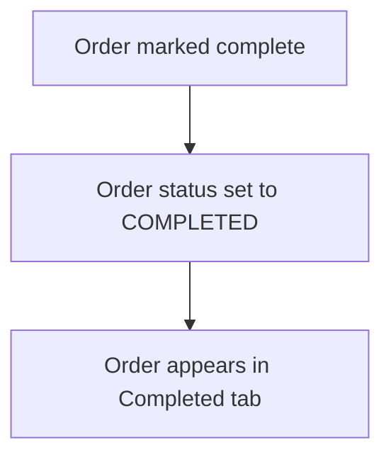

# Flow Overview / Tổng quan Luồng

## Current Flow / Luồng Hiện tại



## Proposed Flow / Luồng Đề xuất

```mermaid
flowchart TD
    A[Order marked complete] --> B[Record completedById, completedAt]
    B --> C[Order status set to COMPLETED]
    C --> D[Order appears in Completed tab]
    D --> E[Show Name (email), Actual Duration, Indicator]
    E --> F[Sortable/filterable by Completed By]
    F --> G[Undo: Clear completedById]
```

## Changes Highlighted / Thay đổi Nổi bật

- Added: completedById, completedBy relation, duration calculation
- Modified: Completed tab UI, server logic for completion/undo
- Removed: n/a
