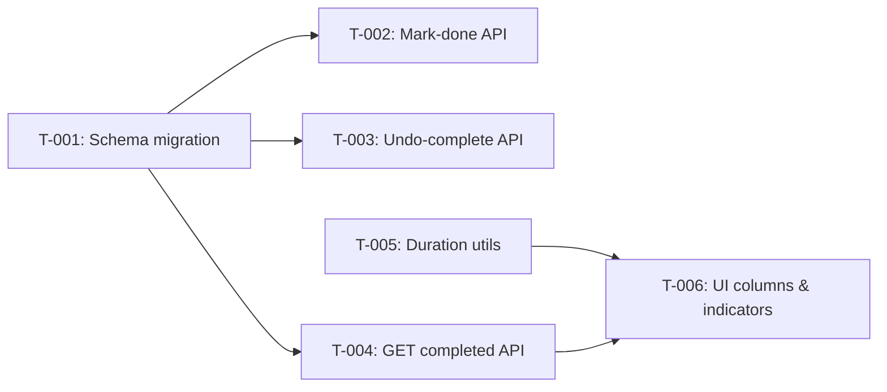

# Task Plan — Completion Tracking: Log Completed By & Show Actual Duration

<!-- Template Version: 1.0 | Contract: v1.0 | Created: 2026-02-10 -->
<!-- 🇻🇳 Vietnamese first, 🇬🇧 English follows — for easy scanning -->

---

## TL;DR

| Aspect           | Value                                                         |
| ---------------- | ------------------------------------------------------------- |
| Feature          | Completion Tracking — Log Completed By & Show Actual Duration |
| Total Tasks      | 6                                                             |
| Estimated Effort | ~6.5 hours                                                    |
| Affected Roots   | sgs-cs-helper                                                 |
| Dev Mode         | standard                                                      |
| Spec Reference   | [spec.md](../01_spec/spec.md)                                 |

---

## 1. Goal

🇻🇳 Ghi nhận người hoàn thành đơn hàng (completedById), hiển thị "Người hoàn thành" (Tên email) và "Thời gian thực tế" (giờ-phút) trong tab Completed, kèm chỉ báo màu đúng/trễ hạn. Hỗ trợ sắp xếp/lọc, hoàn tác, và QR scan.

🇬🇧 Record who completed each order (completedById), display "Completed By" (Name email) and "Actual Duration" (hours-minutes) in the Completed tab, with on-time/overdue color indicators. Support sorting/filtering, undo, and QR scan completion.

---

## 2. Task Overview

| ID    | Title                                                        | Root          | Type   | Est. | Deps         | Status |
| ----- | ------------------------------------------------------------ | ------------- | ------ | ---- | ------------ | ------ |
| T-001 | Add completedById to Order schema + migration                | sgs-cs-helper | Modify | 30m  | -            | ⏳     |
| T-002 | Update mark-done API to record completedById                 | sgs-cs-helper | Modify | 30m  | T-001        | ⏳     |
| T-003 | Update undo-complete API to clear completedById              | sgs-cs-helper | Modify | 20m  | T-001        | ⏳     |
| T-004 | Update GET /api/orders/completed to include completedBy data | sgs-cs-helper | Modify | 30m  | T-001        | ⏳     |
| T-005 | Add duration utilities (formatDuration, calcOverdue)         | sgs-cs-helper | New    | 1h   | -            | ⏳     |
| T-006 | Update CompletedOrdersTable UI — new columns & indicators    | sgs-cs-helper | Modify | 3.5h | T-004, T-005 | ⏳     |

---

## 3. Execution Flow



---

## 3.5 Parallel Execution Notes

### Parallel Groups

🇻🇳 Các tasks trong cùng group có thể chạy song song (khác file, không depend lẫn nhau).

🇬🇧 Tasks in the same group can run in parallel (different files, no inter-dependencies).

| Group | Tasks               | Reason                                                     |
| ----- | ------------------- | ---------------------------------------------------------- |
| A     | T-002, T-003, T-004 | All depend only on T-001, modify different route files     |
| B     | T-005               | Independent of all others (pure utility, no DB dependency) |

### Sequential Constraints

| Sequence      | Reason                                                      |
| ------------- | ----------------------------------------------------------- |
| T-001 → T-002 | Schema must exist before mark-done uses completedById       |
| T-001 → T-003 | Schema must exist before undo-complete clears completedById |
| T-001 → T-004 | Schema must exist before GET includes completedBy relation  |
| T-004 → T-006 | API must return completedBy data before UI can render it    |
| T-005 → T-006 | Duration utilities must exist before UI calls them          |

### Execution Hint

🇻🇳 T-005 có thể chạy bất cứ lúc nào (pure utility). T-001 phải đi trước nhóm A. T-006 là task cuối cùng.

🇬🇧 T-005 can run anytime (pure utility). T-001 must precede Group A. T-006 is the final task.

---

## 4. Task Details

### T-001 — Add completedById to Order schema + migration

| Aspect       | Detail        |
| ------------ | ------------- |
| Root         | sgs-cs-helper |
| Type         | Modify        |
| Estimated    | 30 min        |
| Dependencies | None          |
| FR Covered   | FR-001        |

#### Description

🇻🇳 Thêm `completedById` (String?, FK → User) và relation `completedBy` vào model Order trong `prisma/schema.prisma`. Chạy migration. Tạo Prisma Client.

🇬🇧 Add `completedById` (String?, FK → User) and `completedBy` relation to Order model in `prisma/schema.prisma`. Run migration. Generate Prisma Client.

#### Files

| Action | Path                   |
| ------ | ---------------------- |
| Modify | `prisma/schema.prisma` |

#### Implementation

🇻🇳

- Thêm field `completedById String?` vào model Order
- Thêm relation `completedBy User? @relation("CompletedBy", fields: [completedById], references: [id])`
- Thêm relation ngược `completedOrders Order[] @relation("CompletedBy")` vào model User
- Giữ nguyên `orders Order[] @relation("UploadedBy")` hiện có trên User
- Migration name: `add_completed_by`

🇬🇧

- Add field `completedById String?` to Order model
- Add relation `completedBy User? @relation("CompletedBy", fields: [completedById], references: [id])`
- Add reverse relation `completedOrders Order[] @relation("CompletedBy")` to User model
- Keep existing `orders Order[] @relation("UploadedBy")` on User
- Migration name: `add_completed_by`

```prisma
// In Order model:
completedById   String?
completedBy     User?       @relation("CompletedBy", fields: [completedById], references: [id])

// In User model (add alongside existing 'orders' relation):
completedOrders Order[]     @relation("CompletedBy")
```

#### Done Criteria

- [ ] `completedById` field exists on Order model
- [ ] `completedBy` relation established (Order → User)
- [ ] Reverse relation `completedOrders` on User model
- [ ] Migration runs without errors
- [ ] Prisma Client regenerated successfully
- [ ] Existing data unaffected (nullable field)

#### Verification

```bash
pnpm db:migrate
pnpm db:generate
pnpm build  # Ensure no type errors
```

---

### T-002 — Update mark-done API to record completedById

| Aspect       | Detail                                 |
| ------------ | -------------------------------------- |
| Root         | sgs-cs-helper                          |
| Type         | Modify                                 |
| Estimated    | 30 min                                 |
| Dependencies | T-001                                  |
| FR Covered   | FR-001, FR-004 (QR scan uses same API) |

#### Description

🇻🇳 Cập nhật `POST /api/orders/[id]/mark-done/route.ts` để set `completedById` = ID của user hiện tại khi đánh dấu hoàn thành. Thêm `completedById` vào select trả về. API này cũng được QR scan gọi, nên FR-004 (QR scan logs completedById) tự động được đáp ứng.

🇬🇧 Update `POST /api/orders/[id]/mark-done/route.ts` to set `completedById` = current user's ID when marking complete. Add `completedById` to select in response. This API is also called by QR scan, so FR-004 (QR scan logs completedById) is automatically satisfied.

#### Files

| Action | Path                                         |
| ------ | -------------------------------------------- |
| Modify | `src/app/api/orders/[id]/mark-done/route.ts` |

#### Implementation

🇻🇳

- Trong `prisma.order.update()` data block, thêm `completedById: session.user.id`
- Trong `select` block, thêm `completedById: true`
- Không cần thay đổi auth/permission logic (đã có sẵn)
- SSE broadcast sẽ tự bao gồm `completedById` vì nó nằm trong select

🇬🇧

- In `prisma.order.update()` data block, add `completedById: session.user.id`
- In `select` block, add `completedById: true`
- No changes needed to auth/permission logic (already exists)
- SSE broadcast will automatically include `completedById` since it's in select

```typescript
// In data block:
data: {
  status: "COMPLETED",
  completedAt: new Date(),
  completedById: session.user.id,  // NEW
},

// In select block:
select: {
  // ...existing fields
  completedById: true,  // NEW
},
```

#### Done Criteria

- [ ] `completedById` is set to current user ID on mark-done
- [ ] `completedById` included in API response
- [ ] SSE broadcast includes `completedById`
- [ ] Existing auth/permission logic preserved
- [ ] No type errors

#### Verification

```bash
pnpm build
# Manual: Mark an order done, check DB has completedById set
```

---

### T-003 — Update undo-complete API to clear completedById

| Aspect       | Detail        |
| ------------ | ------------- |
| Root         | sgs-cs-helper |
| Type         | Modify        |
| Estimated    | 20 min        |
| Dependencies | T-001         |
| FR Covered   | FR-004        |

#### Description

🇻🇳 Cập nhật `POST /api/orders/[id]/undo-complete/route.ts` để clear `completedById` (set null) khi hoàn tác. Thêm `completedById` vào select.

🇬🇧 Update `POST /api/orders/[id]/undo-complete/route.ts` to clear `completedById` (set null) on undo. Add `completedById` to select.

#### Files

| Action | Path                                             |
| ------ | ------------------------------------------------ |
| Modify | `src/app/api/orders/[id]/undo-complete/route.ts` |

#### Implementation

🇻🇳

- Trong `prisma.order.update()` data block, thêm `completedById: null`
- Trong `select` block, thêm `completedById: true`
- Giống pattern đã có: `completedAt: null` → thêm `completedById: null`

🇬🇧

- In `prisma.order.update()` data block, add `completedById: null`
- In `select` block, add `completedById: true`
- Same pattern as existing: `completedAt: null` → add `completedById: null`

```typescript
// In data block:
data: {
  status: "IN_PROGRESS",
  completedAt: null,
  completedById: null,  // NEW
},

// In select block:
select: {
  // ...existing fields
  completedById: true,  // NEW
},
```

#### Done Criteria

- [ ] `completedById` is set to `null` on undo
- [ ] `completedById` included in API response
- [ ] SSE broadcast includes `completedById`
- [ ] No type errors

#### Verification

```bash
pnpm build
# Manual: Undo a completed order, check DB has completedById = null
```

---

### T-004 — Update GET /api/orders/completed to include completedBy data

| Aspect       | Detail        |
| ------------ | ------------- |
| Root         | sgs-cs-helper |
| Type         | Modify        |
| Estimated    | 30 min        |
| Dependencies | T-001         |
| FR Covered   | FR-002        |

#### Description

🇻🇳 Cập nhật `GET /api/orders/completed` để include relation `completedBy` (name, email) trong response. Thêm `completedBy` vào allowed sort fields. Thêm optional filter `completedById`.

🇬🇧 Update `GET /api/orders/completed` to include `completedBy` relation (name, email) in response. Add `completedBy` to allowed sort fields. Add optional filter `completedById`.

#### Files

| Action | Path                                    |
| ------ | --------------------------------------- |
| Modify | `src/app/api/orders/completed/route.ts` |

#### Implementation

🇻🇳

- Thêm `completedBy: { select: { id: true, name: true, email: true } }` vào Prisma select/include
- Thêm `completedById: true` vào select
- Thêm `completedBy` vào ALLOWED_SORT_FIELDS (sort by `completedBy.name`)
- Thêm optional query param `completedById` cho filtering
- Cập nhật `CompletedOrder` type trong `useCompletedOrders` hook

🇬🇧

- Add `completedBy: { select: { id: true, name: true, email: true } }` to Prisma select/include
- Add `completedById: true` to select
- Add `completedBy` to ALLOWED_SORT_FIELDS (sort by `completedBy.name`)
- Add optional query param `completedById` for filtering
- Update `CompletedOrder` type in `useCompletedOrders` hook

```typescript
// In Prisma findMany:
select: {
  // ...existing fields
  completedById: true,
  completedBy: {
    select: { id: true, name: true, email: true },
  },
},
```

#### Done Criteria

- [ ] API response includes `completedBy` object with `name` and `email`
- [ ] Sorting by completedBy name works
- [ ] Optional filtering by `completedById` works
- [ ] No performance regression (single query with include)
- [ ] No type errors

#### Verification

```bash
pnpm build
# Manual: GET /api/orders/completed — verify completedBy in JSON response
# Manual: GET /api/orders/completed?sortField=completedBy&sortDir=asc
```

---

### T-005 — Add duration utilities (formatDuration, calcOverdue)

| Aspect       | Detail         |
| ------------ | -------------- |
| Root         | sgs-cs-helper  |
| Type         | New            |
| Estimated    | 1 hour         |
| Dependencies | None           |
| FR Covered   | FR-002, FR-003 |

#### Description

🇻🇳 Tạo utility functions để tính thời gian xử lý thực tế (receivedDate → completedAt) và thời gian quá hạn (requiredDate → completedAt). Format theo giờ-phút.

🇬🇧 Create utility functions to calculate actual processing duration (receivedDate → completedAt) and overdue time (requiredDate → completedAt). Format in hours-minutes.

#### Files

| Action | Path                        |
| ------ | --------------------------- |
| Create | `src/lib/utils/duration.ts` |

#### Implementation

🇻🇳

- `formatDuration(ms: number): string` — Format milliseconds thành "Xh Ym" (ví dụ "2h 15m", "0h 30m", "48h 0m")
- `calcActualDuration(receivedDate: Date, completedAt: Date): number` — Trả về milliseconds
- `calcOverdueDuration(requiredDate: Date, completedAt: Date): number | null` — Trả về ms nếu overdue, null nếu on-time
- `isOverdue(requiredDate: Date, completedAt: Date): boolean` — completedAt > requiredDate
- Edge case: completedAt === requiredDate → on-time (EC-004 từ spec)

🇬🇧

- `formatDuration(ms: number): string` — Format milliseconds to "Xh Ym" (e.g. "2h 15m", "0h 30m", "48h 0m")
- `calcActualDuration(receivedDate: Date, completedAt: Date): number` — Returns milliseconds
- `calcOverdueDuration(requiredDate: Date, completedAt: Date): number | null` — Returns ms if overdue, null if on-time
- `isOverdue(requiredDate: Date, completedAt: Date): boolean` — completedAt > requiredDate
- Edge case: completedAt === requiredDate → on-time (EC-004 from spec)

```typescript
export function formatDuration(ms: number): string {
  const totalMinutes = Math.floor(ms / (1000 * 60));
  const hours = Math.floor(totalMinutes / 60);
  const minutes = totalMinutes % 60;
  return `${hours}h ${minutes}m`;
}

export function calcActualDuration(
  receivedDate: Date,
  completedAt: Date
): number {
  return completedAt.getTime() - receivedDate.getTime();
}

export function calcOverdueDuration(
  requiredDate: Date,
  completedAt: Date
): number | null {
  const diff = completedAt.getTime() - requiredDate.getTime();
  return diff > 0 ? diff : null; // null = on-time or early
}

export function isOverdue(requiredDate: Date, completedAt: Date): boolean {
  return completedAt.getTime() > requiredDate.getTime();
}
```

#### Done Criteria

- [ ] All 4 functions exported and type-safe
- [ ] `formatDuration` returns "Xh Ym" format
- [ ] `isOverdue` returns false when completedAt === requiredDate (EC-004)
- [ ] No external dependencies (pure utility)
- [ ] No type errors

#### Verification

```bash
pnpm build
# Unit tests will be written in Phase 4
```

---

### T-006 — Update CompletedOrdersTable UI — new columns & indicators

| Aspect       | Detail         |
| ------------ | -------------- |
| Root         | sgs-cs-helper  |
| Type         | Modify         |
| Estimated    | 3.5 hours      |
| Dependencies | T-004, T-005   |
| FR Covered   | FR-002, FR-003 |

#### Description

🇻🇳 Cập nhật `CompletedOrdersTable` và `useCompletedOrders` hook:

1. Thêm cột "Completed By" (hiển thị `Name (email)`)
2. Thêm cột "Actual Duration" (hiển thị `Xh Ym`)
3. Thêm chỉ báo màu overdue/on-time: on-time dùng màu giống In Progress tab, overdue dùng màu tím
4. Hỗ trợ sort/filter theo Completed By
5. Cập nhật `CompletedOrder` type trong hook

🇬🇧 Update `CompletedOrdersTable` and `useCompletedOrders` hook:

1. Add "Completed By" column (display `Name (email)`)
2. Add "Actual Duration" column (display `Xh Ym`)
3. Add overdue/on-time color indicators: on-time uses color consistent with In Progress tab, overdue uses purple
4. Support sort/filter by Completed By
5. Update `CompletedOrder` type in hook

#### Files

| Action | Path                                             |
| ------ | ------------------------------------------------ |
| Modify | `src/components/orders/CompletedOrdersTable.tsx` |
| Modify | `src/hooks/useCompletedOrders.ts`                |
| Modify | `src/components/orders/CompletedOrders.tsx`      |

#### Implementation

🇻🇳

**useCompletedOrders.ts:**

- Cập nhật `CompletedOrder` type thêm `completedById`, `completedBy: { id, name, email }`
- Thêm `completedBy` vào sortable fields

**CompletedOrdersTable.tsx:**

- Thêm cột "Completed By" sau cột "Completed At": hiển thị `{name} ({email})`
  - Nếu `completedBy` null (legacy data trước migration): hiển thị "—"
  - Cột sortable
- Thêm cột "Actual Duration": hiển thị `formatDuration(calcActualDuration(receivedDate, completedAt))`
  - Nếu overdue: text màu tím (ví dụ `text-purple-600`), thêm dòng "Overdue: Xh Ym"
  - Nếu on-time: text màu xanh/mặc định (consistent with In Progress tab)
- Cập nhật Tailwind classes cho indicator colors

**CompletedOrders.tsx:**

- Thêm filter dropdown cho "Completed By" (nếu API hỗ trợ)

🇬🇧

**useCompletedOrders.ts:**

- Update `CompletedOrder` type to add `completedById`, `completedBy: { id, name, email }`
- Add `completedBy` to sortable fields

**CompletedOrdersTable.tsx:**

- Add "Completed By" column after "Completed At": display `{name} ({email})`
  - If `completedBy` is null (legacy data before migration): display "—"
  - Column is sortable
- Add "Actual Duration" column: display `formatDuration(calcActualDuration(receivedDate, completedAt))`
  - If overdue: purple text (e.g. `text-purple-600`), append "Overdue: Xh Ym" line
  - If on-time: green/default text (consistent with In Progress tab)
- Update Tailwind classes for indicator colors

**CompletedOrders.tsx:**

- Add filter dropdown for "Completed By" (if API supports)

```typescript
// Example: Completed By cell
<TableCell>
  {order.completedBy
    ? `${order.completedBy.name} (${order.completedBy.email})`
    : "—"}
</TableCell>

// Example: Actual Duration cell with indicator
<TableCell>
  {order.completedAt && (
    <div className={isOverdue(order.requiredDate, order.completedAt)
      ? "text-purple-600" : "text-green-600"}>
      {formatDuration(calcActualDuration(order.receivedDate, order.completedAt))}
      {calcOverdueDuration(order.requiredDate, order.completedAt) && (
        <span className="block text-xs text-purple-500">
          Overdue: {formatDuration(calcOverdueDuration(order.requiredDate, order.completedAt)!)}
        </span>
      )}
    </div>
  )}
</TableCell>
```

#### Done Criteria

- [ ] "Completed By" column shows `Name (email)` format
- [ ] "Completed By" column shows "—" for legacy orders without completedById
- [ ] "Actual Duration" column shows `Xh Ym` format
- [ ] Overdue orders show purple text with overdue duration
- [ ] On-time orders show green/default text
- [ ] "Completed By" is sortable
- [ ] No layout breakage on mobile
- [ ] WCAG AA color contrast met for purple/green indicators
- [ ] No type errors

#### Verification

```bash
pnpm build
pnpm lint
# Manual: View Completed tab with mix of overdue + on-time orders
# Manual: Verify sort by Completed By works
# Manual: Verify legacy orders (no completedById) show "—"
```

---

## 5. Cross-Root Integration Tasks

N/A — Single root (sgs-cs-helper).

---

## 6. Requirements Coverage

| Requirement                                    | Tasks                   | Status |
| ---------------------------------------------- | ----------------------- | ------ |
| FR-001: Record Completed By                    | T-001, T-002            | ⬜     |
| FR-002: Display Completed By + Actual Duration | T-004, T-005, T-006     | ⬜     |
| FR-003: Overdue/On-Time Indicators             | T-005, T-006            | ⬜     |
| FR-004: Undo + QR Scan                         | T-002, T-003            | ⬜     |
| NFR-001: Performance (<500ms)                  | T-004, T-006            | ⬜     |
| NFR-002: Security (auth required)              | T-002, T-003 (existing) | ⬜     |
| NFR-003: Maintainability                       | All tasks               | ⬜     |
| NFR-004: Compatibility                         | T-006                   | ⬜     |
| NFR-005: Accessibility (WCAG AA)               | T-006                   | ⬜     |

---

## 7. Test Plan

### 7.1 Test Strategy

🇻🇳 Tập trung unit test cho utility functions (T-005) và integration test cho API routes (T-002, T-003, T-004). UI test bằng manual testing + component tests nếu thời gian cho phép.

🇬🇧 Focus unit tests on utility functions (T-005) and integration tests on API routes (T-002, T-003, T-004). UI tested via manual testing + component tests if time permits.

| Type        | Scope                                       | Coverage Target         |
| ----------- | ------------------------------------------- | ----------------------- |
| Unit        | Duration utilities (T-005)                  | 100%                    |
| Integration | API routes (T-002, T-003, T-004)            | Key paths + error cases |
| Manual      | UI columns, indicators, sort/filter (T-006) | All ACs                 |

### 7.2 Test Cases by Task

| TC ID  | Task  | Test Description                              | Type        | Expected Result                             |
| ------ | ----- | --------------------------------------------- | ----------- | ------------------------------------------- |
| TC-001 | T-001 | Migration creates completedById column        | Integration | Column exists, nullable, FK to User         |
| TC-002 | T-002 | Mark-done sets completedById to current user  | Integration | completedById = session.user.id             |
| TC-003 | T-002 | Mark-done response includes completedById     | Integration | Response JSON has completedById field       |
| TC-004 | T-003 | Undo-complete clears completedById            | Integration | completedById = null after undo             |
| TC-005 | T-003 | Undo-complete response includes completedById | Integration | Response JSON has completedById: null       |
| TC-006 | T-004 | GET completed returns completedBy object      | Integration | Response has completedBy: { name, email }   |
| TC-007 | T-004 | Sort by completedBy name works                | Integration | Orders sorted by completedBy.name           |
| TC-008 | T-005 | formatDuration formats correctly              | Unit        | "2h 15m", "0h 30m", "48h 0m"                |
| TC-009 | T-005 | calcActualDuration returns correct ms         | Unit        | Correct diff between dates                  |
| TC-010 | T-005 | calcOverdueDuration returns null for on-time  | Unit        | null when completedAt <= requiredDate       |
| TC-011 | T-005 | calcOverdueDuration returns ms for overdue    | Unit        | Positive ms when completedAt > requiredDate |
| TC-012 | T-005 | isOverdue returns false when equal (EC-004)   | Unit        | false when completedAt === requiredDate     |
| TC-013 | T-006 | Completed By column shows Name (email)        | Manual      | "John Doe (john@example.com)"               |
| TC-014 | T-006 | Legacy orders show "—" for Completed By       | Manual      | "—" when completedBy is null                |
| TC-015 | T-006 | Actual Duration shows Xh Ym format            | Manual      | e.g. "2h 15m"                               |
| TC-016 | T-006 | Overdue orders show purple indicator          | Manual      | Purple text + "Overdue: Xh Ym"              |
| TC-017 | T-006 | On-time orders show green indicator           | Manual      | Green text, no overdue line                 |

### 7.3 Edge Cases & Error Scenarios

| TC ID  | Scenario                                | Input                       | Expected Behavior                     |
| ------ | --------------------------------------- | --------------------------- | ------------------------------------- |
| TC-E01 | completedBy is null (legacy order)      | Order without completedById | "—" in UI, no crash                   |
| TC-E02 | completedAt equals requiredDate exactly | Same timestamp              | On-time (green), not overdue (EC-004) |
| TC-E03 | Very long duration (weeks)              | Order received 2+ weeks ago | Correctly shows "336h 0m" etc.        |
| TC-E04 | User without name                       | User.name = null            | Show "(email)" only                   |
| TC-E05 | Mark-done without session               | No auth session             | 403 Unauthorized                      |
| TC-E06 | Undo when DB fails                      | Simulated DB error          | Error response, no state change       |

### 7.4 Test Data Requirements

🇻🇳 Dữ liệu test cần chuẩn bị trước.

🇬🇧 Test data to prepare in advance.

```typescript
// Duration utility test fixtures
const fixtures = {
  twoHoursFifteenMin: 2 * 60 * 60 * 1000 + 15 * 60 * 1000, // 8,100,000 ms
  thirtyMin: 30 * 60 * 1000,
  fortyEightHours: 48 * 60 * 60 * 1000,
  zeroMs: 0,
};

// Order test fixtures
const mockCompletedOrder = {
  id: "order-1",
  jobNumber: "JOB-001",
  receivedDate: new Date("2026-02-08T08:00:00Z"),
  requiredDate: new Date("2026-02-10T17:00:00Z"),
  completedAt: new Date("2026-02-10T10:15:00Z"), // On-time
  completedById: "user-1",
  completedBy: { id: "user-1", name: "John Doe", email: "john@example.com" },
};

const mockOverdueOrder = {
  ...mockCompletedOrder,
  id: "order-2",
  completedAt: new Date("2026-02-11T09:00:00Z"), // Overdue by 16h
};

const mockLegacyOrder = {
  ...mockCompletedOrder,
  id: "order-3",
  completedById: null,
  completedBy: null, // Legacy, before migration
};
```

---

## 8. Risk per Task

| Task  | Risk                                            | Mitigation                                                                    |
| ----- | ----------------------------------------------- | ----------------------------------------------------------------------------- |
| T-001 | Migration fails or conflicts with existing data | Test migration on dev DB first; field is nullable so existing rows unaffected |
| T-002 | `session.user.id` not available                 | Already used by existing auth logic; verify in tests                          |
| T-004 | Performance regression from JOIN                | Use `select` instead of `include` to limit fields; single query with Prisma   |
| T-006 | Overdue color fails WCAG AA contrast            | Test purple-600 contrast ratio; adjust if needed                              |
| T-006 | Mobile layout breaks with 2 new columns         | Test responsive behavior; consider hiding columns on small screens            |

---

## 9. Rollback Plan

| Task  | Rollback Action                                                           |
| ----- | ------------------------------------------------------------------------- |
| T-001 | Revert migration: `prisma migrate reset` on dev                           |
| T-002 | `git revert` mark-done changes; completedById becomes unused but harmless |
| T-003 | `git revert` undo-complete changes                                        |
| T-004 | `git revert` GET route changes; UI falls back to no completedBy data      |
| T-005 | Delete `src/lib/utils/duration.ts`                                        |
| T-006 | `git revert` UI changes; table returns to previous columns                |

---

## 10. Environment Requirements

🇻🇳 Không cần biến môi trường mới. DB phải chạy (Docker).

🇬🇧 No new environment variables needed. DB must be running (Docker).

```bash
# Ensure DB is running
docker compose up -d
# Ensure latest migrations applied
pnpm db:migrate
```

---

## 11. Open Questions

🇻🇳 Không còn câu hỏi mở — tất cả đã được làm rõ trong Phase 0 + Phase 1.

🇬🇧 No open questions — all clarified in Phase 0 + Phase 1.

---

## Approval

| Role     | Name    | Status     | Date       |
| -------- | ------- | ---------- | ---------- |
| Author   | Copilot | ✅ Done    | 2026-02-10 |
| Reviewer | User    | ⏳ Pending |            |

---

## Next Step

🇻🇳 Sau khi phê duyệt, tiến hành **Phase 3: Implementation** bắt đầu từ T-001.

🇬🇧 After approval, proceed to **Phase 3: Implementation** starting with T-001.

Reply: `approved` or `revise: <feedback>`
