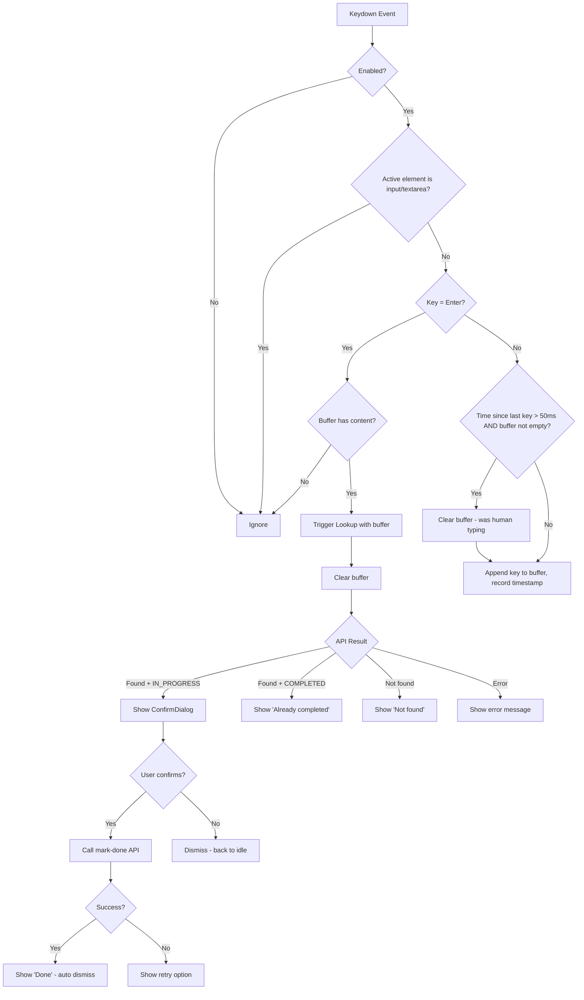
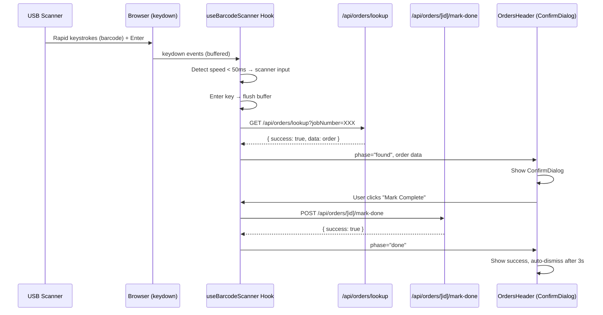

# Solution Design — US-1.3.6: Barcode Scanner Device Support (USB/Bluetooth)
<!-- Phase 0 | Created: 2026-02-10 -->

---

## 0.1 Request Analysis / Phân tích Yêu cầu

### Problem Statement / Vấn đề

**EN:** Staff using desktop/laptop workstations with USB or Bluetooth barcode scanner devices cannot use the existing camera-based scan feature (US-1.3.4). These scanners act as HID keyboard devices — they "type" the barcode string rapidly (<50ms between keystrokes) and press Enter. The orders page needs a passive keyboard listener to detect this input pattern and trigger the same lookup + mark-done flow.

**VI:** Nhân viên dùng máy tính bàn với máy quét barcode USB/Bluetooth không thể dùng camera scan (US-1.3.4). Các máy quét hoạt động như bàn phím HID — "gõ" chuỗi barcode rất nhanh (<50ms) rồi nhấn Enter. Trang orders cần keyboard listener ngầm để phát hiện pattern này và kích hoạt flow lookup + mark-done.

### Context / Ngữ cảnh

| Aspect | Current / Hiện tại | Desired / Mong muốn |
|--------|-------------------|---------------------|
| Scan method | Camera only (mobile) | Camera + USB/Bluetooth scanner (desktop) |
| UI interaction | Click "Camera Scan" button → overlay | No button needed — passive detection |
| Desktop support | None — camera scan is mobile-focused | Full desktop scanner support |
| APIs | `GET /api/orders/lookup` + `POST /api/orders/[id]/mark-done` exist | Reuse same APIs |

### Gap Analysis / Phân tích Khoảng cách

- EN: No mechanism to detect barcode scanner keyboard input / VI: Chưa có cơ chế phát hiện input từ máy quét bàn phím
- EN: No passive listener on the orders page / VI: Chưa có listener ngầm trên trang orders
- EN: Need confirmation dialog without camera overlay / VI: Cần dialog xác nhận mà không cần camera overlay

### Affected Areas / Vùng Ảnh hưởng

| Root | Component | Impact |
|------|-----------|--------|
| sgs-cs-hepper | `src/hooks/` (new) | New `useBarcodeScanner` hook |
| sgs-cs-hepper | `src/components/orders/orders-header.tsx` | Integrate hook + result UI |
| sgs-cs-hepper | (none) | No API changes, no schema changes |

### Open Questions / Câu hỏi Mở

None — all requirements are clear from User Story + existing codebase patterns.

### Assumptions / Giả định

1. EN: All USB/Bluetooth scanners end input with Enter key / VI: Tất cả máy quét USB/Bluetooth kết thúc bằng Enter
2. EN: Scanner input speed is consistently < 50ms between keystrokes / VI: Tốc độ input máy quét < 50ms giữa các phím
3. EN: Orders page is the only page needing scanner support / VI: Chỉ trang orders cần hỗ trợ máy quét
4. EN: Barcode text from scanner = jobNumber (same as camera QR decode) / VI: Text barcode = jobNumber (giống camera decode)

---

## 0.2 Solution Research / Nghiên cứu Giải pháp

### Existing Patterns Found / Pattern Có sẵn

| Location | Pattern | Applicable | Notes |
|----------|---------|------------|-------|
| `src/components/orders/scanner-overlay.tsx` | Lookup + mark-done flow (phases, ConfirmDialog, result display) | ✅ Reuse logic pattern | Same API calls, same result handling |
| `src/components/admin/confirm-dialog.tsx` | ConfirmDialog component | ✅ Reuse directly | Props: isOpen, title, message, onConfirm, onCancel, isLoading |
| `src/app/api/orders/lookup/route.ts` | `GET /api/orders/lookup?jobNumber=...` | ✅ Reuse as-is | Auth + permission check built in |
| `src/app/api/orders/[id]/mark-done/route.ts` | `POST /api/orders/[id]/mark-done` | ✅ Reuse as-is | No changes needed |

### Similar Implementations / Triển khai Tương tự

| Location | What it does | Learnings |
|----------|--------------|-----------|
| `scanner-overlay.tsx` `handleDecode` | Receives decoded barcode → calls lookup API → shows result | EN: Same flow but triggered by camera. Hook version triggers by keyboard buffer / VI: Cùng flow nhưng trigger bởi camera. Hook sẽ trigger bởi bàn phím |
| `scanner-overlay.tsx` `handleConfirmMarkDone` | Calls mark-done → handles success/error | EN: Exact same logic needed. Extract into shared pattern / VI: Cần logic giống hệt. Tái sử dụng pattern |

### Dependencies / Phụ thuộc

| Dependency | Purpose | Status |
|------------|---------|--------|
| React 19 hooks | `useEffect`, `useCallback`, `useRef` | ✅ Existing |
| `ConfirmDialog` | Confirmation modal | ✅ Existing |
| Lookup API | `GET /api/orders/lookup` | ✅ Existing |
| Mark-done API | `POST /api/orders/[id]/mark-done` | ✅ Existing |

No new dependencies needed.

### Reusable Components / Component Tái sử dụng

- `src/components/admin/confirm-dialog.tsx`: ConfirmDialog — reuse directly for mark-done confirmation
- `src/app/api/orders/lookup/route.ts`: Lookup API — no changes needed
- `src/app/api/orders/[id]/mark-done/route.ts`: Mark-done API — no changes needed

### New Components Needed / Component Cần tạo Mới

- `src/hooks/use-barcode-scanner.ts` — Custom hook: keyboard listener + buffer + speed detection + lookup + mark-done flow

---

## 0.3 Solution Design / Thiết kế Giải pháp

### Solution Overview / Tổng quan Giải pháp

**EN:** Create a single custom hook `useBarcodeScanner` that encapsulates the entire feature: keyboard event listening, keystroke speed detection, barcode buffer management, API lookup, result state, and mark-done flow. The hook is consumed by `OrdersHeader` which already manages the camera scanner state — this is the natural place to also manage the USB scanner state. The hook renders no UI itself; it returns state + handlers that `OrdersHeader` uses to show a ConfirmDialog and result feedback inline (toast/alert-style). No new visible buttons or UI elements are needed.

**VI:** Tạo một custom hook `useBarcodeScanner` đóng gói toàn bộ tính năng: lắng nghe keyboard event, phát hiện tốc độ gõ phím, quản lý buffer barcode, gọi API lookup, state kết quả, và flow mark-done. Hook được dùng trong `OrdersHeader` — component đã quản lý camera scanner, là nơi tự nhiên để quản lý USB scanner. Hook không render UI; trả về state + handlers để `OrdersHeader` hiển thị ConfirmDialog và phản hồi kết quả inline.

### Approach Comparison / So sánh Phương pháp

| Approach | Pros | Cons | Verdict |
|----------|------|------|---------|
| **D1: Custom hook in OrdersHeader** | Simple, contained, reuses existing ConfirmDialog, co-located with camera scanner | Adds logic to one component | ✅ Selected |
| D2: Separate BarcodeListenerOverlay component | Mirrors camera scanner pattern | Unnecessary complexity — no overlay/camera needed, just a listener | ❌ Over-engineered |
| D3: Global listener at layout level | Always active across all pages | Too broad scope, harder to manage permissions, conflicts with other pages | ❌ Too broad |

### Decision Log

| ID | Decision | Rationale |
|----|----------|-----------|
| D1 | Custom hook `useBarcodeScanner` | Encapsulates all scanner logic — detection, lookup, state, mark-done — as a single reusable hook |
| D2 | Integrate in `OrdersHeader` | Already manages `isScannerOpen` state; natural place to add USB scanner + ConfirmDialog |
| D3 | Speed threshold: 50ms between keystrokes | Industry standard for HID scanners. Human typing typically >100ms. Configurable constant. |
| D4 | Disable when input focused | `document.activeElement` check — prevents capturing text typed into search/filter inputs |
| D5 | Disable when camera overlay open | Use `isScannerOpen` flag from `OrdersHeader` to suppress keyboard listener |
| D6 | No new UI elements | Scanner works passively — only shows ConfirmDialog when barcode detected + order found |

### Components / Các Component

| # | Name | Root | Purpose |
|---|------|------|---------|
| 1 | `useBarcodeScanner` | sgs-cs-hepper | EN: Custom hook — keyboard listener, buffer, speed detection, lookup, mark-done flow / VI: Hook — keyboard listener, buffer, phát hiện tốc độ, lookup, mark-done |
| 2 | `OrdersHeader` (modify) | sgs-cs-hepper | EN: Consume hook, render ConfirmDialog + result feedback / VI: Dùng hook, render ConfirmDialog + phản hồi kết quả |

### Component Details / Chi tiết Component

#### Component 1: `useBarcodeScanner`

| Aspect | Detail |
|--------|--------|
| Root | `sgs-cs-hepper` |
| Location | `src/hooks/use-barcode-scanner.ts` |
| Purpose | EN: Detect HID barcode scanner input, lookup order, manage mark-done flow / VI: Phát hiện input máy quét HID, lookup đơn, quản lý flow mark-done |
| Inputs | `enabled: boolean` (permission + overlay guard), `onOrderMarked?: () => void` (optional callback for list refresh) |
| Outputs | `{ phase, order, errorMessage, showConfirm, isMarkingDone, handleConfirmMarkDone, handleCancelConfirm, handleRetryMarkDone, handleDismissResult }` |
| Dependencies | None (only React + fetch) |

**Hook State Machine:**
```
idle → looking-up → found / already-completed / not-found / error
                     │
                found → (user confirms) → marking → done / mark-error
```

**Key Implementation Details:**
- `keydown` listener on `document`
- Buffer: `useRef<string>("")` — accumulates keystrokes
- Timestamps: `useRef<number>(0)` — tracks time between keystrokes
- On each keydown:
  - If `> 50ms` since last keystroke AND buffer has content → clear buffer (was human typing)
  - If `Enter` key AND buffer has content → trigger lookup
  - Otherwise → append to buffer, record timestamp
- Guard checks: `enabled` flag, `document.activeElement` is not an input/textarea/select

#### Component 2: `OrdersHeader` (modify)

| Aspect | Detail |
|--------|--------|
| Root | `sgs-cs-hepper` |
| Location | `src/components/orders/orders-header.tsx` |
| Purpose | EN: Integrate `useBarcodeScanner` hook, render ConfirmDialog for USB scanner / VI: Tích hợp hook, render ConfirmDialog cho USB scanner |
| Changes | Add hook call, add ConfirmDialog for scanner result, add result feedback (inline toast) |

### Data Flow / Luồng Dữ liệu

| Step | From | To | Data | Action |
|------|------|----|------|--------|
| 1 | USB Scanner | Browser | Rapid keystrokes + Enter | HID keyboard events |
| 2 | Browser | `useBarcodeScanner` hook | `keydown` events | Buffer keystrokes, detect speed |
| 3 | Hook | `GET /api/orders/lookup` | `?jobNumber=<buffer>` | Lookup order |
| 4 | API | Hook | Order data or error | Update phase state |
| 5 | Hook | `OrdersHeader` | `{ phase, order, showConfirm, ... }` | Render ConfirmDialog |
| 6 | User | ConfirmDialog | Click "Mark Complete" | Trigger mark-done |
| 7 | Hook | `POST /api/orders/[id]/mark-done` | Order ID | Mark order done |
| 8 | API | Hook | Success/error | Update phase → done/mark-error |

### Error Handling / Xử lý Lỗi

| Scenario | Handling | User Impact |
|----------|----------|-------------|
| Scanner input while input focused | Ignored (guard check) | None — user types normally |
| Scanner input while camera overlay open | Ignored (`enabled=false`) | None — camera scan takes priority |
| Lookup returns 404 | Phase → `not-found`, show inline message | Sees "Order not found" briefly |
| Lookup returns 401 | Phase → `error`, show session expired message | Sees "Session expired" message |
| Mark-done fails | Phase → `mark-error`, show retry option | Can retry via ConfirmDialog |
| Empty barcode (Enter only) | Buffer empty → ignored | None |
| Very long barcode (>50 chars) | API validates with Zod (max 50) → 400 error | Sees error message |

### Rollback Plan / Kế hoạch Rollback

**EN:** Remove the `useBarcodeScanner` hook call from `OrdersHeader` and delete `src/hooks/use-barcode-scanner.ts`. No API or schema changes to revert. Single git revert.

**VI:** Xóa hook call khỏi `OrdersHeader` và xóa file hook. Không có thay đổi API hay schema cần hoàn tác. Một lệnh git revert.

---

## 0.4 Diagrams

### Scanner Detection Flow



### Sequence: USB Scanner Mark-Done Flow


