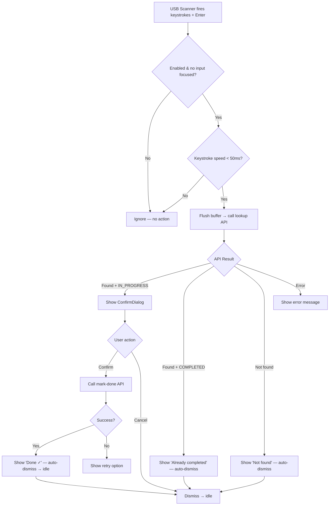

# Specification — US-1.3.6: Barcode Scanner Device Support (USB/Bluetooth)
# Đặc tả — US-1.3.6: Hỗ trợ Máy quét Barcode (USB/Bluetooth)
<!-- Phase 1 | Created: 2026-02-10 -->

---

## TL;DR

| Aspect | Value |
|--------|-------|
| Feature | Barcode Scanner Device Support (USB/Bluetooth Keyboard Input) |
| Status | In Review |
| Phase 0 Analysis | [solution-design.md](../00_analysis/solution-design.md) |
| Functional Requirements | 6 |
| Non-Functional Requirements | 4 |
| Affected Roots | sgs-cs-hepper |
| Edge Cases | 10 |

---

## 1. Overview

🇻🇳 Tính năng này cho phép nhân viên dùng máy quét barcode USB hoặc Bluetooth (thiết bị HID bàn phím) để quét hồ sơ đơn hàng trên trang Orders và đánh dấu hoàn thành — không cần camera hay tương tác nút bấm. Hệ thống phát hiện input nhanh từ máy quét, gọi API lookup hiện có, hiển thị ConfirmDialog, và thực hiện mark-done. Spec này định nghĩa các yêu cầu chi tiết cho custom hook `useBarcodeScanner` và tích hợp vào `OrdersHeader`.

🇬🇧 This feature enables staff to use USB or Bluetooth barcode scanner devices (HID keyboard devices) to scan job documents on the Orders page and mark orders complete — without needing a camera or button interaction. The system detects rapid scanner input, calls the existing lookup API, shows a ConfirmDialog, and performs mark-done. This spec defines the detailed requirements for the `useBarcodeScanner` custom hook and its integration into `OrdersHeader`.

---

## 2. Goals & Non-Goals

### Goals

🇻🇳
1. **Hỗ trợ máy quét desktop:** Phát hiện input nhanh từ máy quét barcode USB/Bluetooth trên trang Orders
2. **Tái sử dụng hạ tầng hiện có:** Dùng lại API `lookup` + `mark-done` và ConfirmDialog từ US-1.3.4
3. **Hoạt động ngầm:** Không cần nút bấm hay UI mới — máy quét chỉ cần quét là hoạt động
4. **Batch workflow:** Sau khi mark-done xong, listener vẫn active để quét tiếp

🇬🇧
1. **Desktop scanner support:** Detect rapid input from USB/Bluetooth barcode scanners on the Orders page
2. **Reuse existing infrastructure:** Reuse lookup + mark-done APIs and ConfirmDialog from US-1.3.4
3. **Passive operation:** No button click or new UI needed — scanner just works
4. **Batch workflow:** After mark-done, listener stays active for continuous scanning

### Non-Goals

🇻🇳
1. Thay đổi tính năng camera scan (US-1.3.4) — giữ nguyên
2. Tạo API endpoint mới — chỉ tái sử dụng hiện có
3. Hỗ trợ mobile-specific — tính năng này dành cho desktop
4. Phản hồi âm thanh/rung (sound/haptic feedback)
5. Hiển thị indicator "Scanner Connected" — không cần thiết

🇬🇧
1. Modify camera scan feature (US-1.3.4) — unchanged
2. Create new API endpoints — reuse only
3. Mobile-specific support — this is desktop-focused
4. Sound/haptic feedback
5. "Scanner Connected" indicator — unnecessary complexity

---

## 3. User Stories

### US-1.3.6: Barcode Scanner Device Support

🇻🇳 Là Nhân viên (Staff), tôi muốn dùng máy quét barcode USB/Bluetooth trên máy tính bàn để quét hồ sơ đơn hàng và đánh dấu hoàn thành, để tôi làm việc nhanh hơn tại workstation mà không cần camera điện thoại.

🇬🇧 As a Staff member, I want to use a USB or Bluetooth barcode scanner device connected to a desktop/laptop to scan job documents and mark orders as complete, so that I can work faster at a workstation without needing a mobile phone camera.

---

## 4. Requirements Matrix

| ID | Title | Priority | Type | AC Coverage |
|----|-------|----------|------|-------------|
| FR-001 | Barcode Scanner Input Detection | Must | Functional | AC1, AC2 |
| FR-002 | Order Lookup on Barcode Capture | Must | Functional | AC3 |
| FR-003 | Order Result Display & Confirmation | Must | Functional | AC4, AC5, AC6 |
| FR-004 | Mark-Done & Continuous Scanning | Must | Functional | AC7 |
| FR-005 | Conflict Avoidance | Must | Functional | AC8, AC12 |
| FR-006 | Permission Gating | Must | Functional | AC9 |
| NFR-001 | Response Time | Must | Performance | — |
| NFR-002 | Browser Compatibility | Must | Compatibility | AC10 |
| NFR-003 | Zero UI Footprint | Must | UX | AC11 |
| NFR-004 | Code Quality | Must | Maintainability | — |

---

## 5. Functional Requirements

### FR-001: Barcode Scanner Input Detection

| Aspect | Detail |
|--------|--------|
| Priority | Must |
| Affected Roots | sgs-cs-hepper |

#### Description

🇻🇳 Hệ thống phải lắng nghe sự kiện `keydown` trên trang Orders để phát hiện input từ máy quét barcode HID. Máy quét gõ ký tự rất nhanh (<50ms giữa các phím) rồi kết thúc bằng Enter. Hệ thống phải phân biệt input máy quét với gõ tay của người dùng dựa trên tốc độ gõ phím.

🇬🇧 The system must listen to `keydown` events on the Orders page to detect input from HID barcode scanners. Scanners type characters rapidly (<50ms between keystrokes) and end with Enter. The system must distinguish scanner input from human typing based on keystroke speed.

#### Acceptance Criteria

- [ ] AC1: Global `keydown` listener on the Orders page detects rapid keystrokes (<50ms apart) ending with Enter key
- [ ] AC2: Scanner input is distinguished from normal human typing by keystroke speed threshold (50ms constant, configurable)

#### Technical Notes

- Buffer accumulates printable characters via `useRef<string>`
- Timestamp of last keystroke tracked via `useRef<number>`
- On each `keydown`: if gap > 50ms AND buffer non-empty → clear buffer (human typing)
- On Enter + non-empty buffer → trigger lookup
- Only printable characters (single char, `event.key.length === 1`) are buffered

---

### FR-002: Order Lookup on Barcode Capture

| Aspect | Detail |
|--------|--------|
| Priority | Must |
| Affected Roots | sgs-cs-hepper |

#### Description

🇻🇳 Khi chuỗi barcode được capture (buffer + Enter), hệ thống gọi `GET /api/orders/lookup?jobNumber=<barcode>` (tái sử dụng từ US-1.3.4). Buffer được dùng trực tiếp làm `jobNumber`. API xử lý validation (Zod: min 1, max 50, trimmed) và tìm kiếm case-insensitive.

🇬🇧 When a barcode string is captured (buffer + Enter), the system calls `GET /api/orders/lookup?jobNumber=<barcode>` (reused from US-1.3.4). The buffer is used directly as the `jobNumber`. The API handles validation (Zod: min 1, max 50, trimmed) and case-insensitive lookup.

#### Acceptance Criteria

- [ ] AC3: Captured barcode triggers `GET /api/orders/lookup?jobNumber=<buffer>` — same API as camera scan

#### Technical Notes

- `event.preventDefault()` on Enter to avoid form submissions
- Race condition guard: ignore lookup result if a newer scan has started (use ref counter or abort controller)
- Phase transitions: `idle` → `looking-up` → result phase

---

### FR-003: Order Result Display & Confirmation

| Aspect | Detail |
|--------|--------|
| Priority | Must |
| Affected Roots | sgs-cs-hepper |

#### Description

🇻🇳 Dựa trên kết quả lookup, hệ thống hiển thị phản hồi phù hợp:
- **Tìm thấy + IN_PROGRESS**: Hiện ConfirmDialog với thông tin đơn (Job Number, Priority, ngày nhận) và nút "Mark Complete"
- **Tìm thấy + COMPLETED**: Hiện thông báo "Order already completed" inline (tự biến mất sau vài giây)
- **Không tìm thấy (404)**: Hiện thông báo "Order not found"

🇬🇧 Based on the lookup result, the system displays appropriate feedback:
- **Found + IN_PROGRESS**: Show ConfirmDialog with order details (Job Number, Priority, received date) and "Mark Complete" button
- **Found + COMPLETED**: Show inline message "Order already completed" (auto-dismiss after a few seconds)
- **Not found (404)**: Show inline message "Order not found"

#### Acceptance Criteria

- [ ] AC4: If order found + `IN_PROGRESS`: show ConfirmDialog with order details and "Mark Complete" button (reuse `ConfirmDialog` component)
- [ ] AC5: If order found + `COMPLETED`: show info message "Order already completed"
- [ ] AC6: If order not found: show error message "Order not found"

#### Technical Notes

- ConfirmDialog: `isOpen`, `title`, `message`, `onConfirm`, `onCancel`, `isLoading` props
- Result messages (AC5, AC6) displayed as inline feedback in `OrdersHeader` — auto-dismiss after ~3s
- Phase state machine drives which UI is shown

---

### FR-004: Mark-Done & Continuous Scanning

| Aspect | Detail |
|--------|--------|
| Priority | Must |
| Affected Roots | sgs-cs-hepper |

#### Description

🇻🇳 Khi người dùng xác nhận "Mark Complete" trong ConfirmDialog, hệ thống gọi `POST /api/orders/[id]/mark-done`. Sau khi thành công, hiển thị thông báo "Done" (tự biến mất sau ~3s) và listener quay về trạng thái `idle` để sẵn sàng quét tiếp — hỗ trợ batch workflow (quét liên tục nhiều đơn).

🇬🇧 When the user confirms "Mark Complete" in the ConfirmDialog, the system calls `POST /api/orders/[id]/mark-done`. After success, shows "Done" message (auto-dismiss ~3s) and the listener returns to `idle` state, ready for the next scan — supporting batch workflow (continuous scanning of multiple orders).

#### Acceptance Criteria

- [ ] AC7: After successful mark-done, listener remains active for continuous scanning (batch workflow) — state resets to `idle`

#### Technical Notes

- On mark-done failure: phase → `mark-error`, show retry option via ConfirmDialog
- `onOrderMarked` callback invoked on success (allows parent to refresh order list if needed)
- Cooldown: brief delay (~500ms) after success before accepting next scan to prevent double-processing

---

### FR-005: Conflict Avoidance

| Aspect | Detail |
|--------|--------|
| Priority | Must |
| Affected Roots | sgs-cs-hepper |

#### Description

🇻🇳 Keyboard listener phải bị vô hiệu hóa trong hai trường hợp:
1. **Camera overlay đang mở** (AC8): Khi `isScannerOpen === true`, USB scanner listener không xử lý keystrokes — tránh xung đột giữa camera scan và USB scan
2. **Input element đang focused** (AC12): Khi `document.activeElement` là `INPUT`, `TEXTAREA`, hoặc `SELECT`, listener bỏ qua keystroke — cho phép người dùng gõ vào ô tìm kiếm/lọc bình thường

🇬🇧 The keyboard listener must be disabled in two scenarios:
1. **Camera overlay is open** (AC8): When `isScannerOpen === true`, the USB scanner listener does not process keystrokes — avoids conflict between camera scan and USB scan
2. **Input element is focused** (AC12): When `document.activeElement` is `INPUT`, `TEXTAREA`, or `SELECT`, the listener ignores keystrokes — allows normal typing in search/filter inputs

#### Acceptance Criteria

- [ ] AC8: Keyboard listener only active when scanner overlay is NOT open (no conflict with camera scan)
- [ ] AC12: Keyboard listener ignores keystrokes when an input, textarea, or select element is focused

#### Technical Notes

- `enabled` parameter passed to hook: `canScan && !isScannerOpen`
- Guard inside `keydown` handler: check `document.activeElement?.tagName` against `INPUT`, `TEXTAREA`, `SELECT`
- Also check `contentEditable` attribute on active element

---

### FR-006: Permission Gating

| Aspect | Detail |
|--------|--------|
| Priority | Must |
| Affected Roots | sgs-cs-hepper |

#### Description

🇻🇳 USB scanner listener chỉ hoạt động khi người dùng có quyền `canUpdateStatus`. Quyền này đã được kiểm tra phía server trong `OrdersHeader` (prop `canScan` từ `page.tsx`). Hook nhận `enabled` flag dựa trên `canScan`.

🇬🇧 The USB scanner listener only activates when the user has `canUpdateStatus` permission. This permission is already checked server-side and passed to `OrdersHeader` as the `canScan` prop from `page.tsx`. The hook receives an `enabled` flag based on `canScan`.

#### Acceptance Criteria

- [ ] AC9: Scanner listener is permission-gated — only active for users with `canUpdateStatus` (via `canScan` prop)

#### Technical Notes

- No additional API calls for permission — reuses existing `canScan` prop
- `enabled = canScan && !isScannerOpen`

---

## 6. Non-Functional Requirements

### NFR-001: Response Time

| Aspect | Detail |
|--------|--------|
| Category | Performance |
| Metric | Scanner input detection to ConfirmDialog display < 1s (including API call) |

#### Description

🇻🇳 Từ lúc máy quét gửi Enter đến khi ConfirmDialog hiện phải < 1 giây (bao gồm thời gian gọi API lookup). Người dùng tại workstation cần phản hồi nhanh để quét hàng loạt.

🇬🇧 From scanner Enter to ConfirmDialog display must be < 1 second (including API lookup call). Workstation users need fast feedback for batch scanning.

---

### NFR-002: Browser Compatibility

| Aspect | Detail |
|--------|--------|
| Category | Compatibility |
| Metric | Works on Chrome, Edge, Firefox (latest 2 versions) |

#### Description

🇻🇳 Tính năng phải hoạt động trên các trình duyệt desktop chính. Không yêu cầu HTTPS cho USB input (khác camera scan cần HTTPS). `keydown` event là API chuẩn, hỗ trợ rộng rãi.

🇬🇧 The feature must work on major desktop browsers. No HTTPS requirement for USB input (unlike camera scan which needs HTTPS). `keydown` event is a standard API with broad support.

#### Acceptance Criteria

- [ ] AC10: Works on desktop browsers (Chrome, Edge, Firefox) — no HTTPS requirement for USB input

---

### NFR-003: Zero UI Footprint

| Aspect | Detail |
|--------|--------|
| Category | UX |
| Metric | No new visible elements when scanner is idle |

#### Description

🇻🇳 Khi máy quét không hoạt động (idle), trang Orders trông hoàn toàn giống như trước. Không có nút, icon, hay indicator mới. UI chỉ xuất hiện khi có kết quả scan (ConfirmDialog hoặc thông báo inline).

🇬🇧 When the scanner is idle, the Orders page looks exactly the same as before. No new buttons, icons, or indicators. UI only appears when a scan result occurs (ConfirmDialog or inline message).

#### Acceptance Criteria

- [ ] AC11: No visible UI change — scanner works passively on the orders page

---

### NFR-004: Code Quality

| Aspect | Detail |
|--------|--------|
| Category | Maintainability |
| Metric | TypeScript strict, no lint errors, hook is self-contained |

#### Description

🇻🇳 Hook `useBarcodeScanner` phải tự chứa, type-safe, không lint error. Tuân thủ TypeScript strict mode, `@/` alias imports, và conventions của dự án. Hook có thể test độc lập.

🇬🇧 The `useBarcodeScanner` hook must be self-contained, type-safe, and lint-error-free. Must follow TypeScript strict mode, `@/` alias imports, and project conventions. Hook should be independently testable.

---

## 7. User Flow

| Step | Action | System Response | Next Step |
|------|--------|-----------------|-----------|
| 1 | User scans barcode with USB scanner | Rapid keystrokes buffered + Enter detected | 2 |
| 2 | — | System calls `GET /api/orders/lookup` | 3 |
| 3a | — (order found, IN_PROGRESS) | ConfirmDialog appears with order details | 4 |
| 3b | — (order found, COMPLETED) | "Already completed" message (auto-dismiss) | Back to 1 |
| 3c | — (order not found) | "Not found" message (auto-dismiss) | Back to 1 |
| 3d | — (API error) | Error message displayed | Back to 1 |
| 4 | User clicks "Mark Complete" | System calls `POST /api/orders/[id]/mark-done` | 5 |
| 4b | User clicks "Cancel" | ConfirmDialog closes | Back to 1 |
| 5a | — (success) | "Done ✓" message (auto-dismiss ~3s) | Back to 1 |
| 5b | — (failure) | Error with retry option | 4 (retry) |

### Flow Diagram



---

## 8. Data Models

### Hook State Machine

```typescript
// Phase type for useBarcodeScanner
type BarcodeScanPhase =
  | "idle"
  | "looking-up"
  | "found"
  | "already-completed"
  | "not-found"
  | "error"
  | "marking"
  | "done"
  | "mark-error";

// Order result shape (from lookup API)
interface LookupOrder {
  id: string;
  jobNumber: string;
  status: string;
  registeredDate: string | null;
  registeredBy: string | null;
  receivedDate: string | null;
  requiredDate: string | null;
  priority: string | null;
  completedAt: string | null;
}
```

### Hook Interface

```typescript
interface UseBarcodeScanner {
  /** Current phase of the scanner state machine */
  phase: BarcodeScanPhase;
  /** Looked-up order data (when phase is found/done/etc.) */
  order: LookupOrder | null;
  /** Error message for display */
  errorMessage: string | null;
  /** Whether to show the confirmation dialog */
  showConfirm: boolean;
  /** Whether mark-done API is in-flight */
  isMarkingDone: boolean;
  /** Confirm mark-done action */
  handleConfirmMarkDone: () => void;
  /** Cancel/dismiss confirmation */
  handleCancelConfirm: () => void;
  /** Retry after mark-done failure */
  handleRetryMarkDone: () => void;
  /** Dismiss result message (manual close) */
  handleDismissResult: () => void;
}

function useBarcodeScanner(options: {
  enabled: boolean;
  onOrderMarked?: () => void;
}): UseBarcodeScanner;
```

---

## 9. API Contracts

### GET /api/orders/lookup (EXISTING — no changes)

```typescript
// Request
// Query: ?jobNumber=<string> (min 1, max 50, trimmed)

// Response 200
interface LookupSuccessResponse {
  success: true;
  data: {
    id: string;
    jobNumber: string;
    status: string; // "IN_PROGRESS" | "COMPLETED" | etc.
    registeredDate: string | null;
    registeredBy: string | null;
    receivedDate: string | null;
    requiredDate: string | null;
    priority: string | null;
    completedAt: string | null;
  };
}

// Response 401
{ success: false, error: "Unauthorized" }

// Response 403
{ success: false, error: "You do not have permission to look up orders" }

// Response 404
{ success: false, error: "Order not found" }

// Response 400
{ success: false, error: "<Zod validation message>" }
```

### POST /api/orders/[id]/mark-done (EXISTING — no changes)

```typescript
// Request
// Path: /api/orders/<orderId>/mark-done
// Body: none

// Response 200
{ success: true, message: "Order marked as done" }

// Response 4xx/5xx
{ success: false, error: "<error message>" }
```

---

## 10. Edge Cases

| ID | Scenario | Expected Behavior | Priority |
|----|----------|-------------------|----------|
| EC-001 | Enter pressed with empty buffer | Ignored — no lookup triggered | Must handle |
| EC-002 | Very fast human typing (gamer/programmer) | Speed threshold (50ms) with buffer length check — short buffers (<3 chars) ignored | Should handle |
| EC-003 | Scanner fires while ConfirmDialog is already open | Buffer clears but lookup not triggered while `phase !== idle` — prevent double dialogs | Must handle |
| EC-004 | Scanner input >50 chars (exceeds Zod max) | API returns 400 — show "Invalid barcode" error message | Must handle |
| EC-005 | Network failure during lookup | Phase → `error`, show "Network error" message with auto-dismiss | Must handle |
| EC-006 | User navigates away during lookup/mark-done | AbortController cancels in-flight request on hook cleanup | Must handle |
| EC-007 | Two rapid scans in quick succession | Cooldown after result (~500ms idle delay) prevents double-processing | Should handle |
| EC-008 | Scanner with different suffix (no Enter) | Buffer accumulates but never flushes — clears on timeout/speed gap | Should handle |
| EC-009 | Special characters in barcode (-, /, .) | Accepted — Zod trims whitespace, special chars pass through | Must handle |
| EC-010 | Session expired mid-scan | API returns 401 — show "Session expired" message | Must handle |

### EC-001: Empty Buffer on Enter

🇻🇳
**Khi:** Người dùng nhấn Enter mà buffer rỗng (gõ Enter bình thường)
**Thì:** Không gọi API, không hiển thị gì
**Lý do:** Tránh API call không cần thiết

🇬🇧
**When:** User presses Enter with empty buffer (normal Enter press)
**Then:** No API call, no display
**Rationale:** Avoid unnecessary API calls

### EC-003: Scan While Dialog Open

🇻🇳
**Khi:** Máy quét gửi barcode mới trong khi ConfirmDialog đang hiện
**Thì:** Buffer ghi nhận nhưng không gọi lookup — chỉ xử lý khi phase = `idle`
**Lý do:** Tránh nhiều dialog chồng chéo, gây nhầm lẫn

🇬🇧
**When:** Scanner sends new barcode while ConfirmDialog is already showing
**Then:** Buffer records input but does not trigger lookup — only processes when phase = `idle`
**Rationale:** Prevent stacking multiple dialogs, causing confusion

### EC-006: Navigation During In-Flight Request

🇻🇳
**Khi:** Người dùng chuyển trang trong khi API đang gọi
**Thì:** AbortController hủy request, hook cleanup ngăn setState trên unmounted component
**Lý do:** Tránh memory leak và React warning

🇬🇧
**When:** User navigates away while API call is in-flight
**Then:** AbortController cancels request, hook cleanup prevents setState on unmounted component
**Rationale:** Prevent memory leaks and React warnings

---

## 11. Error Handling

| Error Condition | User Message | System Action |
|-----------------|--------------|---------------|
| Lookup returns 401 | "Session expired — please log in again" | Phase → `error`, auto-dismiss after 3s |
| Lookup returns 403 | "You don't have permission" | Phase → `error`, auto-dismiss after 3s |
| Lookup returns 404 | "Order not found" | Phase → `not-found`, auto-dismiss after 3s |
| Lookup returns 400 | "Invalid barcode" | Phase → `error`, auto-dismiss after 3s |
| Lookup network error | "Network error — please check connection" | Phase → `error`, auto-dismiss after 3s |
| Mark-done returns error | "Failed to mark done — tap to retry" | Phase → `mark-error`, show retry in dialog |
| Mark-done network error | "Network error — tap to retry" | Phase → `mark-error`, show retry in dialog |

---

## 12. Cross-Root Impact

| Root | Changes | Sync Required |
|------|---------|---------------|
| sgs-cs-hepper | New hook + modify OrdersHeader | No (single root) |

### Integration Points

🇻🇳 Không có cross-root impact. Tất cả thay đổi nằm trong `sgs-cs-hepper`. Không cần đồng bộ với root khác.

🇬🇧 No cross-root impact. All changes are within `sgs-cs-hepper`. No synchronization with other roots needed.

---

## 13. Dependencies

| Dependency | Type | Status |
|------------|------|--------|
| React 19 (`useEffect`, `useCallback`, `useRef`, `useState`) | Framework | Existing |
| `ConfirmDialog` component | Internal component | Existing |
| `GET /api/orders/lookup` | Internal API | Existing |
| `POST /api/orders/[id]/mark-done` | Internal API | Existing |
| `canScan` prop (from `page.tsx`) | Data flow | Existing |

**No new external dependencies required.**

---

## 14. Risks & Assumptions

### Risks

| Risk | Impact | Mitigation |
|------|--------|------------|
| Scanner speed varies by model | Med — some scanners may be slower | Expose threshold as configurable constant (`SCANNER_KEYSTROKE_THRESHOLD_MS = 50`) |
| Fast typists trigger false positives | Low — 50ms threshold is well below human speed | Buffer length minimum check (≥3 chars) as additional guard |
| Browser focus events inconsistent | Low | Use `document.activeElement` (standard, well-supported) |

### Assumptions

| # | Assumption | Validated |
|---|------------|-----------|
| 1 | All USB/Bluetooth scanners end input with Enter key | Yes — industry standard for HID scanners |
| 2 | Scanner keystroke speed consistently < 50ms | Yes — HID protocol sends at USB polling rate |
| 3 | Barcode text from scanner = jobNumber (same as camera decode) | Yes — both output the printed barcode string |
| 4 | Orders page is the only page needing scanner support | Yes — per product scope |

---

## 15. Open Questions

| # | Question | Status | Answer |
|---|----------|--------|--------|
| — | No open questions | Resolved | All requirements clear from US-1.3.6 |

---

## 16. Notes

🇻🇳
- Hook `useBarcodeScanner` phải cleanup listener khi component unmount (trong `useEffect` return)
- Dùng `AbortController` cho fetch requests để tránh race condition
- ConfirmDialog dùng chung component từ `@/components/admin/confirm-dialog` — không tạo mới
- Inline result messages (found, not-found, error) hiện tạm thời trong `OrdersHeader` area — không dùng toast library

🇬🇧
- Hook `useBarcodeScanner` must clean up listener on component unmount (in `useEffect` cleanup)
- Use `AbortController` for fetch requests to avoid race conditions
- ConfirmDialog reuses shared component from `@/components/admin/confirm-dialog` — no new component
- Inline result messages (found, not-found, error) display temporarily in the `OrdersHeader` area — no toast library

---

## Approval

| Role | Name | Status | Date |
|------|------|--------|------|
| Spec Author | Copilot | ✅ Done | 2026-02-10 |
| Reviewer | User | ⏳ Pending | |

---

## Next Step

🇻🇳 Sau khi phê duyệt, tiến hành **Phase 2: Task Planning**.

🇬🇧 After approval, proceed to **Phase 2: Task Planning**.

Reply: `approved` or `revise: <feedback>`
