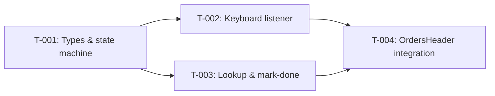

# Task Plan — US-1.3.6: Barcode Scanner Device Support (USB/Bluetooth)
# Kế hoạch Task — US-1.3.6: Hỗ trợ Máy quét Barcode (USB/Bluetooth)
<!-- Phase 2 | Created: 2026-02-10 | Dev Mode: standard -->

---

## TL;DR

| Aspect | Value |
|--------|-------|
| Feature | Barcode Scanner Device Support (USB/Bluetooth Keyboard Input) |
| Total Tasks | 4 |
| Estimated Effort | ~4.5 hours |
| Affected Roots | sgs-cs-hepper |
| Spec Reference | [spec.md](../01_spec/spec.md) |

---

## 1. Goal

🇻🇳 Khi tất cả task hoàn thành, trang Orders sẽ tự động phát hiện input từ máy quét barcode USB/Bluetooth, lookup đơn hàng, hiện ConfirmDialog xác nhận, và mark-done — hoạt động ngầm không cần tương tác UI, đồng thời không xung đột với camera scan hiện có.

🇬🇧 When all tasks are complete, the Orders page will automatically detect USB/Bluetooth barcode scanner input, look up orders, show a ConfirmDialog for confirmation, and mark-done — working passively without UI interaction, while coexisting with the existing camera scan feature.

---

## 2. Task Overview

| ID | Title | Root | Type | Est. | Deps | Status |
|----|-------|------|------|------|------|--------|
| T-001 | Create `useBarcodeScanner` hook — types & state machine | sgs-cs-hepper | New | 1h | - | ⏳ |
| T-002 | Implement keyboard listener & barcode detection logic | sgs-cs-hepper | Modify | 1.5h | T-001 | ⏳ |
| T-003 | Implement lookup & mark-done API flow | sgs-cs-hepper | Modify | 1h | T-001 | ⏳ |
| T-004 | Integrate hook into `OrdersHeader` with ConfirmDialog & result feedback | sgs-cs-hepper | Modify | 1h | T-002, T-003 | ⏳ |

---

## 3. Execution Flow



---

## 3.5 Parallel Execution Notes

### Parallel Groups

🇻🇳 Các tasks trong cùng group có thể chạy song song (khác phần logic, không depend lẫn nhau).

🇬🇧 Tasks in the same group can run in parallel (different logic sections, no inter-dependencies).

| Group | Tasks | Reason |
|-------|-------|--------|
| A | T-002, T-003 | Same dependency (T-001), different concerns (detection vs API flow) — both modify same file but different functions |

### Sequential Constraints

| Sequence | Reason |
|----------|--------|
| T-001 → T-002 | T-002 builds on types/state from T-001 |
| T-001 → T-003 | T-003 builds on types/state from T-001 |
| T-002, T-003 → T-004 | T-004 consumes hook output, needs both detection + API flow complete |

### Execution Hint

🇻🇳 T-002 và T-003 cùng modify `use-barcode-scanner.ts` nhưng ở phần logic khác nhau. Trong thực tế, chạy tuần tự sẽ đơn giản hơn vì cùng file.

🇬🇧 T-002 and T-003 both modify `use-barcode-scanner.ts` but in different logic sections. In practice, running sequentially is simpler since they're in the same file.

---

## 4. Task Details

### T-001 — Create `useBarcodeScanner` hook — types & state machine

| Aspect | Detail |
|--------|--------|
| Root | sgs-cs-hepper |
| Type | New |
| Estimated | 1h |
| Dependencies | None |
| FR Covered | FR-001 (partial), FR-003 (partial), FR-004 (partial) |

#### Description

🇻🇳 Tạo file hook `src/hooks/use-barcode-scanner.ts` với các type definitions (`BarcodeScanPhase`, `LookupOrder`, hook options interface, hook return interface), constants (`SCANNER_KEYSTROKE_THRESHOLD_MS`, `AUTO_DISMISS_MS`, `COOLDOWN_MS`), và skeleton hook function với state management cơ bản (`phase`, `order`, `errorMessage`). Hook trả về tất cả state + handlers (stub implementations).

🇬🇧 Create hook file `src/hooks/use-barcode-scanner.ts` with type definitions (`BarcodeScanPhase`, `LookupOrder`, hook options interface, hook return interface), constants (`SCANNER_KEYSTROKE_THRESHOLD_MS`, `AUTO_DISMISS_MS`, `COOLDOWN_MS`), and skeleton hook function with basic state management (`phase`, `order`, `errorMessage`). Hook returns all state + handlers (stub implementations initially).

#### Files

| Action | Path |
|--------|------|
| Create | `src/hooks/use-barcode-scanner.ts` |

#### Implementation

🇻🇳 Định nghĩa types theo spec Section 8 (Data Models). Tạo constants cho threshold values. Skeleton hook với `useState` cho phase/order/errorMessage, `useRef` cho buffer/timestamp/abortController. Export hook + types.

🇬🇧 Define types per spec Section 8 (Data Models). Create constants for threshold values. Skeleton hook with `useState` for phase/order/errorMessage, `useRef` for buffer/timestamp/abortController. Export hook + types.

```typescript
// Types to define
type BarcodeScanPhase =
  | "idle" | "looking-up" | "found" | "already-completed"
  | "not-found" | "error" | "marking" | "done" | "mark-error";

interface LookupOrder {
  id: string;
  jobNumber: string;
  status: string;
  // ... (per spec Section 8)
}

// Constants
const SCANNER_KEYSTROKE_THRESHOLD_MS = 50;
const AUTO_DISMISS_MS = 3000;
const COOLDOWN_MS = 500;
const MIN_BARCODE_LENGTH = 3;
```

#### Done Criteria

- [ ] File `src/hooks/use-barcode-scanner.ts` exists
- [ ] `BarcodeScanPhase` type exported with all 9 phases
- [ ] `LookupOrder` interface exported matching API response
- [ ] Hook function `useBarcodeScanner` exported with correct signature
- [ ] Hook returns all properties per spec: `phase`, `order`, `errorMessage`, `showConfirm`, `isMarkingDone`, handlers
- [ ] Constants defined: `SCANNER_KEYSTROKE_THRESHOLD_MS`, `AUTO_DISMISS_MS`, `COOLDOWN_MS`, `MIN_BARCODE_LENGTH`
- [ ] TypeScript compiles with no errors

#### Verification

```bash
pnpm tsc --noEmit
pnpm lint
```

---

### T-002 — Implement keyboard listener & barcode detection logic

| Aspect | Detail |
|--------|--------|
| Root | sgs-cs-hepper |
| Type | Modify |
| Estimated | 1.5h |
| Dependencies | T-001 |
| FR Covered | FR-001 (AC1, AC2), FR-005 (AC8, AC12), FR-006 (AC9) |

#### Description

🇻🇳 Implement `useEffect` với `keydown` listener trên `document`. Logic bao gồm:
1. Guard checks: `enabled` flag, `document.activeElement` không phải input/textarea/select/contentEditable
2. Guard check: `phase === "idle"` (không xử lý khi dialog đang hiện — EC-003)
3. Speed detection: so sánh timestamp giữa các keystroke vs threshold 50ms
4. Buffer management: tích lũy printable chars, clear khi gap > threshold
5. Enter key: flush buffer nếu length ≥ `MIN_BARCODE_LENGTH`, gọi `processBarcode(buffer)`
6. Cleanup: remove listener khi unmount hoặc `enabled` thay đổi

🇬🇧 Implement `useEffect` with `keydown` listener on `document`. Logic includes:
1. Guard checks: `enabled` flag, `document.activeElement` is not input/textarea/select/contentEditable
2. Guard check: `phase === "idle"` (skip processing while dialog is showing — EC-003)
3. Speed detection: compare timestamp between keystrokes vs 50ms threshold
4. Buffer management: accumulate printable chars, clear when gap > threshold
5. Enter key: flush buffer if length ≥ `MIN_BARCODE_LENGTH`, call `processBarcode(buffer)`
6. Cleanup: remove listener on unmount or `enabled` change

#### Files

| Action | Path |
|--------|------|
| Modify | `src/hooks/use-barcode-scanner.ts` |

#### Implementation

🇻🇳 `useEffect` dependency array: `[enabled, phase]`. Bên trong handler:
- Early return nếu `!enabled`
- Early return nếu `phase !== "idle"` (EC-003: scan while dialog open)
- Check `document.activeElement?.tagName` — skip INPUT/TEXTAREA/SELECT
- Check `(document.activeElement as HTMLElement)?.isContentEditable`
- Nếu `event.key === "Enter"`: preventDefault, check buffer length ≥ 3, flush → processBarcode
- Nếu `event.key.length === 1` (printable): check speed, buffer hoặc clear
- `processBarcode` là placeholder gọi ở T-003

🇬🇧 `useEffect` dependency array: `[enabled, phase]`. Inside handler:
- Early return if `!enabled`
- Early return if `phase !== "idle"` (EC-003: scan while dialog open)
- Check `document.activeElement?.tagName` — skip INPUT/TEXTAREA/SELECT
- Check `(document.activeElement as HTMLElement)?.isContentEditable`
- If `event.key === "Enter"`: preventDefault, check buffer length ≥ 3, flush → processBarcode
- If `event.key.length === 1` (printable): check speed, buffer or clear
- `processBarcode` is a placeholder called from T-003

```typescript
// Key refs
const bufferRef = useRef("");
const lastKeystrokeRef = useRef(0);

// Guard check pattern
const isInputFocused = (): boolean => {
  const tag = document.activeElement?.tagName;
  if (tag === "INPUT" || tag === "TEXTAREA" || tag === "SELECT") return true;
  if ((document.activeElement as HTMLElement)?.isContentEditable) return true;
  return false;
};
```

#### Done Criteria

- [ ] `keydown` listener registered on `document` via `useEffect`
- [ ] Listener cleaned up on unmount (useEffect cleanup)
- [ ] Guard: ignores events when `enabled === false` (AC8, AC9)
- [ ] Guard: ignores events when `phase !== "idle"` (EC-003)
- [ ] Guard: ignores events when input/textarea/select/contentEditable is focused (AC12)
- [ ] Buffer accumulates printable characters (`event.key.length === 1`)
- [ ] Buffer clears when keystroke gap > 50ms (AC2)
- [ ] Enter key with buffer length ≥ 3 triggers `processBarcode` (AC1)
- [ ] Enter key with empty/short buffer is ignored (EC-001, EC-002)
- [ ] `event.preventDefault()` called on Enter when buffer has content
- [ ] No TypeScript errors, no lint errors

#### Verification

```bash
pnpm tsc --noEmit
pnpm lint
```

---

### T-003 — Implement lookup & mark-done API flow

| Aspect | Detail |
|--------|--------|
| Root | sgs-cs-hepper |
| Type | Modify |
| Estimated | 1h |
| Dependencies | T-001 |
| FR Covered | FR-002 (AC3), FR-003 (AC4, AC5, AC6), FR-004 (AC7) |

#### Description

🇻🇳 Implement các async functions bên trong hook:
1. `processBarcode(barcode: string)`: gọi lookup API, xử lý response, cập nhật phase/order/errorMessage
2. `handleConfirmMarkDone()`: gọi mark-done API, xử lý success/error
3. `handleCancelConfirm()`: reset phase về idle
4. `handleRetryMarkDone()`: retry mark-done (phase mark-error → marking)
5. `handleDismissResult()`: dismiss result message, reset về idle
6. Auto-dismiss `useEffect`: tự động dismiss result messages sau `AUTO_DISMISS_MS` (3s)
7. AbortController cho fetch requests, cleanup khi unmount (EC-006)

🇬🇧 Implement async functions inside the hook:
1. `processBarcode(barcode: string)`: call lookup API, handle response, update phase/order/errorMessage
2. `handleConfirmMarkDone()`: call mark-done API, handle success/error
3. `handleCancelConfirm()`: reset phase to idle
4. `handleRetryMarkDone()`: retry mark-done (phase mark-error → marking)
5. `handleDismissResult()`: dismiss result message, reset to idle
6. Auto-dismiss `useEffect`: auto-dismiss result messages after `AUTO_DISMISS_MS` (3s)
7. AbortController for fetch requests, cleanup on unmount (EC-006)

#### Files

| Action | Path |
|--------|------|
| Modify | `src/hooks/use-barcode-scanner.ts` |

#### Implementation

🇻🇳 
- `processBarcode`: set phase → `looking-up`, fetch `/api/orders/lookup?jobNumber=...`, parse JSON, handle status codes (200 → check order.status, 404 → not-found, 401 → error "Session expired", 400 → error "Invalid barcode", other → error)
- `handleConfirmMarkDone`: set phase → `marking`, set `isMarkingDone` → true, fetch `POST /api/orders/${order.id}/mark-done`, on success → phase `done` + call `onOrderMarked`, on error → phase `mark-error`
- Auto-dismiss: `useEffect` watching `phase` — if phase is `done`/`already-completed`/`not-found`/`error`, setTimeout → idle after 3s. Clear timeout on phase change. Add cooldown delay for `done` phase.
- AbortController: create on each processBarcode call, abort previous, cleanup in useEffect return

🇬🇧
- `processBarcode`: set phase → `looking-up`, fetch `/api/orders/lookup?jobNumber=...`, parse JSON, handle status codes (200 → check order.status, 404 → not-found, 401 → error "Session expired", 400 → error "Invalid barcode", other → error)
- `handleConfirmMarkDone`: set phase → `marking`, set `isMarkingDone` → true, fetch `POST /api/orders/${order.id}/mark-done`, on success → phase `done` + call `onOrderMarked`, on error → phase `mark-error`
- Auto-dismiss: `useEffect` watching `phase` — if phase is `done`/`already-completed`/`not-found`/`error`, setTimeout → idle after 3s. Clear timeout on phase change. Add cooldown delay for `done` phase.
- AbortController: create on each processBarcode call, abort previous, cleanup in useEffect return

```typescript
// processBarcode pattern
const processBarcode = useCallback(async (barcode: string) => {
  setPhase("looking-up");
  try {
    const res = await fetch(`/api/orders/lookup?jobNumber=${encodeURIComponent(barcode)}`, {
      signal: abortControllerRef.current?.signal,
    });
    const data = await res.json();
    if (!res.ok) { /* handle error codes */ }
    // Check order.status → set phase accordingly
  } catch (err) {
    if (err instanceof DOMException && err.name === "AbortError") return;
    setPhase("error");
    setErrorMessage("Network error — please check connection");
  }
}, []);
```

#### Done Criteria

- [ ] `processBarcode` calls `GET /api/orders/lookup` with barcode as jobNumber (AC3)
- [ ] Found + IN_PROGRESS → phase `found`, order set, showConfirm true (AC4)
- [ ] Found + COMPLETED → phase `already-completed`, message shown (AC5)
- [ ] Not found (404) → phase `not-found` (AC6)
- [ ] Error responses (401, 400, 500) → phase `error` with appropriate message
- [ ] `handleConfirmMarkDone` calls `POST /api/orders/[id]/mark-done`
- [ ] Mark-done success → phase `done`, `onOrderMarked` callback called (AC7)
- [ ] Mark-done failure → phase `mark-error` with retry option
- [ ] `handleCancelConfirm` resets to idle
- [ ] `handleRetryMarkDone` retries mark-done from mark-error phase
- [ ] `handleDismissResult` resets to idle
- [ ] Auto-dismiss for transient phases (done, already-completed, not-found, error) after 3s
- [ ] AbortController cancels in-flight requests on unmount (EC-006)
- [ ] Network errors caught and displayed (EC-005)
- [ ] No TypeScript errors, no lint errors

#### Verification

```bash
pnpm tsc --noEmit
pnpm lint
```

---

### T-004 — Integrate hook into `OrdersHeader` with ConfirmDialog & result feedback

| Aspect | Detail |
|--------|--------|
| Root | sgs-cs-hepper |
| Type | Modify |
| Estimated | 1h |
| Dependencies | T-002, T-003 |
| FR Covered | FR-003 (AC4, AC5, AC6), FR-005 (AC8), FR-006 (AC9), NFR-003 (AC11) |

#### Description

🇻🇳 Modify `src/components/orders/orders-header.tsx` để:
1. Import và gọi `useBarcodeScanner` hook với `enabled: canScan && !isScannerOpen`
2. Render `ConfirmDialog` cho USB scanner (khi `showConfirm === true`)
3. Render inline result feedback cho transient states (already-completed, not-found, error, done)
4. Kiểm tra: khi idle, không có UI mới hiển thị (AC11 — zero footprint)

🇬🇧 Modify `src/components/orders/orders-header.tsx` to:
1. Import and call `useBarcodeScanner` hook with `enabled: canScan && !isScannerOpen`
2. Render `ConfirmDialog` for USB scanner (when `showConfirm === true`)
3. Render inline result feedback for transient states (already-completed, not-found, error, done)
4. Verify: when idle, no new UI is visible (AC11 — zero footprint)

#### Files

| Action | Path |
|--------|------|
| Modify | `src/components/orders/orders-header.tsx` |

#### Implementation

🇻🇳
- Import `useBarcodeScanner` từ `@/hooks/use-barcode-scanner`
- Import `ConfirmDialog` từ `@/components/admin/confirm-dialog`
- Gọi hook: `const scanner = useBarcodeScanner({ enabled: canScan && !isScannerOpen })`
- ConfirmDialog: `isOpen={scanner.showConfirm}`, title "Mark Order Complete?", message chứa order details (jobNumber, priority), `onConfirm={scanner.handleConfirmMarkDone}`, `onCancel={scanner.handleCancelConfirm}`, `isLoading={scanner.isMarkingDone}`
- Inline result: conditional render dựa trên `scanner.phase` — small banner/toast-style element hiện dưới header, với icon + message + auto-dismiss animation
- Phase-specific UI: `done` → green checkmark, `already-completed` → blue info, `not-found` → yellow warning, `error` → red error, `mark-error` → red with retry

🇬🇧
- Import `useBarcodeScanner` from `@/hooks/use-barcode-scanner`
- Import `ConfirmDialog` from `@/components/admin/confirm-dialog`
- Call hook: `const scanner = useBarcodeScanner({ enabled: canScan && !isScannerOpen })`
- ConfirmDialog: `isOpen={scanner.showConfirm}`, title "Mark Order Complete?", message with order details (jobNumber, priority), `onConfirm={scanner.handleConfirmMarkDone}`, `onCancel={scanner.handleCancelConfirm}`, `isLoading={scanner.isMarkingDone}`
- Inline result: conditional render based on `scanner.phase` — small banner/toast-style element below header, with icon + message + auto-dismiss animation
- Phase-specific UI: `done` → green checkmark, `already-completed` → blue info, `not-found` → yellow warning, `error` → red error, `mark-error` → red with retry

```typescript
// Hook call
const scanner = useBarcodeScanner({
  enabled: canScan && !isScannerOpen,
});

// ConfirmDialog for USB scanner
<ConfirmDialog
  isOpen={scanner.showConfirm}
  title="Mark Order Complete?"
  message={`Job: ${scanner.order?.jobNumber}\nPriority: ${scanner.order?.priority ?? "N/A"}`}
  confirmText="Mark Complete"
  onConfirm={scanner.handleConfirmMarkDone}
  onCancel={scanner.handleCancelConfirm}
  isLoading={scanner.isMarkingDone}
  danger={false}
/>
```

#### Done Criteria

- [ ] `useBarcodeScanner` hook called with `enabled: canScan && !isScannerOpen` (AC8, AC9)
- [ ] ConfirmDialog renders when `showConfirm === true` with order details (AC4)
- [ ] ConfirmDialog passes `isLoading` for mark-done in-flight state
- [ ] Inline result feedback renders for transient phases (AC5, AC6)
- [ ] When `phase === "idle"`, no new UI elements visible (AC11)
- [ ] Result messages auto-dismiss (driven by hook auto-dismiss)
- [ ] No TypeScript errors, no lint errors
- [ ] Build succeeds: `pnpm build`

#### Verification

```bash
pnpm tsc --noEmit
pnpm lint
pnpm build
```

Manual verification:
- Open Orders page in browser
- Verify no new UI when idle
- Simulate rapid keystrokes + Enter in console (or use scanner)
- Verify ConfirmDialog appears for valid orders
- Verify inline messages for not-found / already-completed

---

## 5. Cross-Root Integration Tasks

🇻🇳 Không áp dụng — tất cả thay đổi trong một root duy nhất (`sgs-cs-hepper`).

🇬🇧 Not applicable — all changes are within a single root (`sgs-cs-hepper`).

---

## 6. Requirements Coverage

| Requirement | Tasks | Status |
|-------------|-------|--------|
| FR-001 (Scanner Input Detection, AC1, AC2) | T-001, T-002 | ⬜ |
| FR-002 (Order Lookup, AC3) | T-003 | ⬜ |
| FR-003 (Result Display & Confirmation, AC4, AC5, AC6) | T-001, T-003, T-004 | ⬜ |
| FR-004 (Mark-Done & Continuous Scanning, AC7) | T-003 | ⬜ |
| FR-005 (Conflict Avoidance, AC8, AC12) | T-002, T-004 | ⬜ |
| FR-006 (Permission Gating, AC9) | T-002, T-004 | ⬜ |
| NFR-001 (Response Time <1s) | T-003 | ⬜ |
| NFR-002 (Browser Compatibility, AC10) | T-002 | ⬜ |
| NFR-003 (Zero UI Footprint, AC11) | T-004 | ⬜ |
| NFR-004 (Code Quality) | T-001, T-002, T-003, T-004 | ⬜ |

All 12 ACs covered. ✅

---

## 7. Test Plan

### 7.1 Test Strategy

🇻🇳 Vì dev_mode = standard, test code sẽ được viết trong Phase 4. Plan này định nghĩa test cases trước để guide implementation. Focus chính: unit tests cho hook logic (detection + API flow), manual testing cho integration.

🇬🇧 Since dev_mode = standard, test code will be written in Phase 4. This plan defines test cases upfront to guide implementation. Main focus: unit tests for hook logic (detection + API flow), manual testing for integration.

| Type | Scope | Coverage Target |
|------|-------|-----------------|
| Unit | `useBarcodeScanner` hook logic | Key paths — detection, lookup, mark-done, guards |
| Integration | Hook + OrdersHeader | Manual verification |
| E2E | Full scan flow | Manual verification with USB scanner |

### 7.2 Test Cases by Task

| TC ID | Task | Test Description | Type | Expected Result |
|-------|------|------------------|------|-----------------|
| TC-001 | T-001 | Hook returns correct initial state (idle, null order, no error) | Unit | `phase="idle"`, `order=null`, `errorMessage=null`, `showConfirm=false` |
| TC-002 | T-002 | Rapid keystrokes (<50ms) + Enter triggers processBarcode | Unit | `processBarcode` called with buffered string |
| TC-003 | T-002 | Slow keystrokes (>50ms) + Enter does NOT trigger processBarcode | Unit | Buffer cleared between keystrokes, no call |
| TC-004 | T-002 | Enter with empty buffer is ignored | Unit | No processBarcode call |
| TC-005 | T-002 | Enter with short buffer (<3 chars) is ignored | Unit | No processBarcode call (EC-002) |
| TC-006 | T-002 | Listener ignores events when `enabled=false` | Unit | No buffer accumulation |
| TC-007 | T-002 | Listener ignores events when input is focused | Unit | No buffer accumulation |
| TC-008 | T-002 | Listener ignores events when phase ≠ idle | Unit | No buffer accumulation (EC-003) |
| TC-009 | T-003 | Lookup returns found + IN_PROGRESS → phase `found` | Unit | `phase="found"`, `order` set, `showConfirm=true` |
| TC-010 | T-003 | Lookup returns found + COMPLETED → phase `already-completed` | Unit | `phase="already-completed"`, message shown |
| TC-011 | T-003 | Lookup returns 404 → phase `not-found` | Unit | `phase="not-found"` |
| TC-012 | T-003 | Lookup returns 401 → phase `error` with "Session expired" | Unit | `phase="error"`, `errorMessage` set |
| TC-013 | T-003 | Mark-done success → phase `done`, `onOrderMarked` called | Unit | `phase="done"`, callback invoked |
| TC-014 | T-003 | Mark-done failure → phase `mark-error` | Unit | `phase="mark-error"`, retry available |
| TC-015 | T-003 | Auto-dismiss resets phase to idle after 3s | Unit | `phase="idle"` after timeout |
| TC-016 | T-003 | Network error during lookup → phase `error` | Unit | `phase="error"`, `errorMessage="Network error..."` |
| TC-017 | T-004 | ConfirmDialog renders when `showConfirm=true` | Integration | Dialog visible with order details |
| TC-018 | T-004 | No new UI when phase is idle | Integration | Page looks unchanged (AC11) |

### 7.3 Edge Cases & Error Scenarios

| TC ID | Scenario | Input | Expected Behavior |
|-------|----------|-------|-------------------|
| TC-E01 | Empty buffer on Enter (EC-001) | Enter key only | No API call, no UI change |
| TC-E02 | Fast human typing (EC-002) | 2-char input <50ms + Enter | Ignored (buffer too short) |
| TC-E03 | Scan while dialog open (EC-003) | Scanner fires during ConfirmDialog | Buffer ignored, no new dialog |
| TC-E04 | Barcode >50 chars (EC-004) | Long barcode + Enter | API 400, "Invalid barcode" error |
| TC-E05 | Network failure (EC-005) | Offline + scan | "Network error" message |
| TC-E06 | Navigate away mid-request (EC-006) | Scan then navigate | AbortController cancels, no error |
| TC-E07 | Double scan (EC-007) | Two scans <500ms apart | Second scan ignored during cooldown |
| TC-E08 | Special chars in barcode (EC-009) | Barcode with `-`, `/`, `.` | Accepted, lookup works |
| TC-E09 | Session expired (EC-010) | Scan after session timeout | "Session expired" message |

### 7.4 Test Data Requirements

🇻🇳 Mock data cho unit tests:

🇬🇧 Mock data for unit tests:

```typescript
// Mock order — IN_PROGRESS
const mockOrderInProgress = {
  id: "order-1",
  jobNumber: "JOB-2024-001",
  status: "IN_PROGRESS",
  registeredDate: "2026-01-15T00:00:00.000Z",
  registeredBy: "admin",
  receivedDate: "2026-01-16T00:00:00.000Z",
  requiredDate: "2026-01-20T00:00:00.000Z",
  priority: "HIGH",
  completedAt: null,
};

// Mock order — COMPLETED
const mockOrderCompleted = {
  ...mockOrderInProgress,
  id: "order-2",
  jobNumber: "JOB-2024-002",
  status: "COMPLETED",
  completedAt: "2026-01-18T10:00:00.000Z",
};

// Mock API responses
const mockLookupSuccess = { success: true, data: mockOrderInProgress };
const mockLookupCompleted = { success: true, data: mockOrderCompleted };
const mockLookupNotFound = { success: false, error: "Order not found" };
const mockMarkDoneSuccess = { success: true, message: "Order marked as done" };
```

---

## 8. Risk per Task

| Task | Risk | Mitigation |
|------|------|------------|
| T-002 | Speed threshold may not work for all scanners | Expose as constant; easy to adjust post-deployment |
| T-002 | `isContentEditable` check edge cases | Test with rich text editors if applicable (unlikely in this app) |
| T-003 | Race condition between rapid scans | AbortController + phase guard prevents stale results |
| T-004 | ConfirmDialog z-index conflict with camera overlay | Camera overlay is z-40, ConfirmDialog is z-50 — no conflict when not overlapping |

---

## 8b. Rollback Plan

| Task | Rollback Action |
|------|-----------------|
| T-001 | Delete `src/hooks/use-barcode-scanner.ts` |
| T-002 | Same as T-001 (same file) |
| T-003 | Same as T-001 (same file) |
| T-004 | Revert `orders-header.tsx` to pre-modification state (`git checkout main -- src/components/orders/orders-header.tsx`) |

---

## 9. Environment Requirements

🇻🇳 Không cần biến môi trường mới. Tất cả APIs và dependencies đã tồn tại.

🇬🇧 No new environment variables needed. All APIs and dependencies already exist.

---

## 10. Open Questions

🇻🇳 Không có câu hỏi mở.

🇬🇧 No open questions.

---

## Approval

| Role | Name | Status | Date |
|------|------|--------|------|
| Author | Copilot | ✅ Done | 2026-02-10 |
| Reviewer | User | ⏳ Pending | |

---

## Next Step

🇻🇳 Sau khi phê duyệt, tiến hành **Phase 3: Implementation** bắt đầu với task T-001.

🇬🇧 After approval, proceed to **Phase 3: Implementation** starting with task T-001.

Reply: `approved` or `revise: <feedback>`
