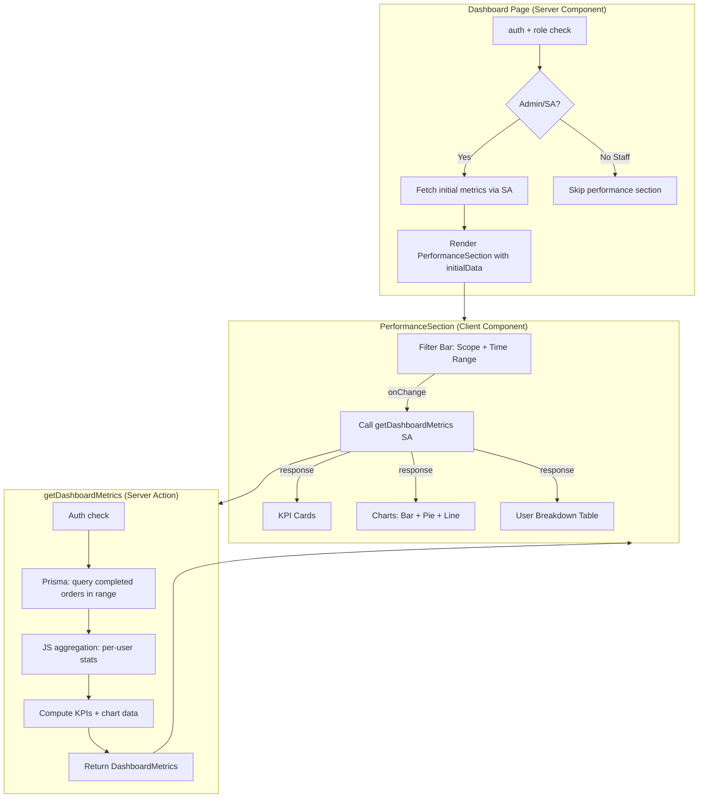
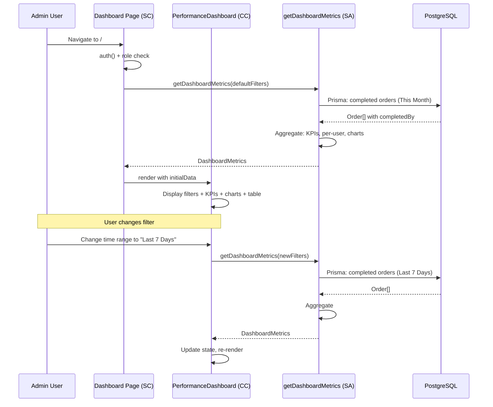

# Analysis & Solution Design — Performance Dashboard with Chart Visualization

<!-- Template Version: 1.0 | Contract: v1.0 | US-2.1.1 -->

---

## TL;DR

| Aspect           | Value                                          |
| ---------------- | ---------------------------------------------- |
| Feature          | Performance Dashboard with Chart Visualization |
| Status           | In Review                                      |
| Affected Roots   | `sgs-cs-helper`                                |
| Complexity       | High                                           |
| Estimated Effort | 4–6 days                                       |

---

## 1. Problem Statement

### Current Behavior

🇻🇳 Trang dashboard (`/`) hiện chỉ hiển thị thông tin tài khoản, badge vai trò, và các nút liên kết nhanh (View Orders, Upload Excel, Manage Staff, Manage Admin Users). Không có bất kỳ chỉ số hiệu suất, biểu đồ, hay dữ liệu phân tích nào.

🇬🇧 The dashboard page (`/`) currently only displays account info, role badge, and quick action links (View Orders, Upload Excel, Manage Staff, Manage Admin Users). There are no performance metrics, charts, or analytical data.

### Desired Behavior

🇻🇳 Admin/Super Admin nhìn thấy phần hiệu suất bên dưới quick actions với: thẻ KPI (tổng hoàn thành, tỷ lệ đúng hạn, TG xử lý TB, số trễ), biểu đồ cột (hoàn thành theo user), biểu đồ tròn (đúng hạn vs trễ), biểu đồ đường (xu hướng), bảng phân tích theo user. Có thể lọc theo phạm vi (Toàn team/Nhóm/Cá nhân) và khoảng thời gian. Staff view không đổi.

🇬🇧 Admin/Super Admin see a performance section below quick actions with: KPI cards (total completed, on-time rate, avg processing time, overdue count), bar chart (completions per user), pie/donut chart (on-time vs overdue ratio), line chart (trend), per-user breakdown table. Filterable by scope (All Team/Group/Individual) and time range. Staff view unchanged.

### Gap Analysis

🇻🇳

- Không có aggregation logic phía server — tất cả tính toán hiện tại chỉ ở client (completed-orders-table)
- Không có charting library — cần cài `recharts`
- Không có component Card, Calendar trong shadcn/ui — cần thêm
- Không có Server Action nào cho metrics/aggregation
- Dashboard page là placeholder, chưa có data fetching

🇬🇧

- No server-side aggregation logic — all calculations currently client-only (completed-orders-table)
- No charting library installed — need `recharts`
- No Card or Calendar shadcn/ui components — need to add
- No Server Action for metrics/aggregation
- Dashboard page is a placeholder with no data fetching

---

## 2. Clarifying Questions

| #   | Question                           | Answer                                                     | Status      |
| --- | ---------------------------------- | ---------------------------------------------------------- | ----------- |
| 1   | What is "Group" in scope selector? | Multi-select users (UI filter only, no DB group entity)    | ✅ Resolved |
| 2   | P1 duration: 1h or 2h?             | Using 2h (current codebase value in `getPriorityDuration`) | ✅ Resolved |
| 3   | Should aggregation be real-time?   | No — computed on request via Server Action                 | ✅ Resolved |

---

## 3. Assumptions & Constraints

### Assumptions

🇻🇳

- "Đúng hạn" = `calcActualDuration(receivedDate, completedAt) <= getPriorityDuration(priority) * MS_PER_HOUR` (tái sử dụng logic hiện có)
- Đơn "Hoàn thành" = `status = COMPLETED` và `completedAt != null`
- TG xử lý TB = trung bình `calcActualDuration` cho tất cả đơn đã hoàn thành trong range
- Team size nhỏ (<50 users) — không cần pagination cho breakdown table
- Dashboard page sẽ mở rộng, không thay thế

🇬🇧

- "On-time" = `calcActualDuration(receivedDate, completedAt) <= getPriorityDuration(priority) * MS_PER_HOUR` (reuses existing logic)
- "Completed" = `status = COMPLETED` AND `completedAt != null`
- Avg Processing Time = mean of `calcActualDuration` for all completed orders in range
- Team size small (<50 users) — no pagination needed for breakdown table
- Dashboard page will be extended, not replaced

### Constraints

🇻🇳

- Chart library: `recharts` (bắt buộc theo AC9)
- Charts phải dùng `dynamic(() => import(...), { ssr: false })` cho Next.js SSR
- Data aggregation qua Server Action — client nhận pre-computed metrics
- Chỉ Admin/Super Admin thấy performance section
- Staff view không đổi

🇬🇧

- Chart library: `recharts` (mandated by AC9)
- Charts must use `dynamic(() => import(...), { ssr: false })` for Next.js SSR
- Data aggregation via Server Action — client receives pre-computed metrics
- Only Admin/Super Admin see performance section
- Staff view unchanged

---

## 4. Existing Patterns Found

| Location                                           | Pattern                                                                                        | Reusable                                           |
| -------------------------------------------------- | ---------------------------------------------------------------------------------------------- | -------------------------------------------------- |
| `src/app/actions/`                                 | Server Action pattern: `"use server"`, Zod validation, discriminated union returns, auth check | Yes                                                |
| `src/lib/utils/duration.ts`                        | `calcActualDuration`, `formatDuration`, `calcOverdueDuration`                                  | Yes                                                |
| `src/lib/utils/progress.ts`                        | `getPriorityDuration`, `calculateProgress`, `getProgressColor`                                 | Yes                                                |
| `src/components/orders/completed-orders-table.tsx` | On-time/overdue calculation: `actualMs > priorityDurationMs`                                   | Partial — logic reused, but needs server-side port |
| `src/app/api/orders/completed/route.ts`            | Prisma query for completed orders with pagination                                              | Partial — filter pattern reusable                  |
| `src/lib/auth.ts`                                  | Auth helpers: `requireAdminRole()`                                                             | Yes                                                |
| `src/components/ui/select.tsx`                     | shadcn Select component                                                                        | Yes                                                |
| `src/components/ui/popover.tsx` + `command.tsx`    | Combobox pattern for multi-select                                                              | Yes                                                |

---

## 5. Solution Options

### Option A: Server Action with Client Charts (Chosen)

🇻🇳 Server Action tổng hợp dữ liệu (Prisma query + JS aggregation phía server), trả về pre-computed metrics. Client component nhận data và render charts bằng `recharts` (dynamic import, ssr: false). Filters (scope, time range) gửi lên Server Action → recompute → trả lại. Dùng `useTransition` hoặc SWR cho UX mượt.

🇬🇧 Server Action aggregates data (Prisma query + JS aggregation server-side), returns pre-computed metrics. Client component receives data and renders charts with `recharts` (dynamic import, ssr: false). Filters (scope, time range) sent to Server Action → recompute → return. Use `useTransition` or SWR for smooth UX.

### Option B: API Route with SWR

🇻🇳 Tạo API route `/api/dashboard/metrics` trả JSON metrics. Client dùng SWR poll. Giống pattern hiện tại của completed orders.

🇬🇧 Create API route `/api/dashboard/metrics` returning JSON metrics. Client uses SWR polling. Similar to existing completed orders pattern.

### Comparison Matrix

| Aspect              | Option A: Server Action           | Option B: API Route                |
| ------------------- | --------------------------------- | ---------------------------------- |
| Description         | Server Action + client charts     | API Route + SWR                    |
| Effort              | Medium                            | Medium                             |
| Risk                | Low                               | Low                                |
| Caching             | Next.js built-in (revalidate)     | Manual cache headers               |
| Pattern consistency | ✅ Follows new SA pattern         | ⚠️ Follows older API route pattern |
| Type safety         | ✅ End-to-end via SA return type  | ⚠️ Manual response typing          |
| Filter UX           | `useTransition` for pending state | SWR mutation/revalidation          |

### Chosen Solution

**Decision:** `Option A — Server Action with Client Charts`

🇻🇳 Chọn Option A vì: nhất quán với pattern Server Action đang dùng trong project, type safety tốt hơn (discriminated union return), tích hợp tự nhiên với `useTransition` cho filter thay đổi, không cần quản lý API route riêng.

🇬🇧 Chose Option A because: consistent with Server Action pattern used throughout project, better type safety (discriminated union return), natural integration with `useTransition` for filter changes, no separate API route management needed.

---

## 6. Solution Overview

🇻🇳 Giải pháp gồm 3 lớp chính: (1) **Server Action** `getDashboardMetrics` nhận filters (scope, time range, selected users) và trả về pre-computed metrics object chứa KPI values, per-user breakdown, chart data series; (2) **Dashboard Performance Section** — client component wrapper dùng `useTransition` + `useState` để gọi Server Action khi filter thay đổi, hiển thị filter bar + KPI cards + charts + table; (3) **Chart Components** — các recharts wrapper (BarChart, PieChart, LineChart) được dynamic import với `{ ssr: false }`. Dashboard page (Server Component) kiểm tra role, nếu Admin/Super Admin thì render PerformanceSection (client component) với initial data từ server, nếu Staff thì bỏ qua.

🇬🇧 Solution has 3 layers: (1) **Server Action** `getDashboardMetrics` receives filters (scope, time range, selected users) and returns pre-computed metrics object with KPI values, per-user breakdown, chart data series; (2) **Dashboard Performance Section** — client component wrapper using `useTransition` + `useState` to call Server Action when filters change, rendering filter bar + KPI cards + charts + table; (3) **Chart Components** — recharts wrappers (BarChart, PieChart, LineChart) dynamically imported with `{ ssr: false }`. Dashboard page (Server Component) checks role, if Admin/Super Admin renders PerformanceSection (client component) with initial data from server, if Staff skips it.

### Architecture Diagram



---

## 7. Components

| Component              | Root          | Type   | Description                                                      |
| ---------------------- | ------------- | ------ | ---------------------------------------------------------------- |
| `getDashboardMetrics`  | sgs-cs-helper | New    | Server Action: aggregate completed orders into metrics           |
| `PerformanceDashboard` | sgs-cs-helper | New    | Client wrapper: filters, state, calls SA, renders sub-components |
| `DashboardFilters`     | sgs-cs-helper | New    | Filter bar: scope selector + time range picker                   |
| `KpiCards`             | sgs-cs-helper | New    | 4 KPI summary cards                                              |
| `CompletionBarChart`   | sgs-cs-helper | New    | Horizontal bar chart: orders per user                            |
| `OnTimeRatioPieChart`  | sgs-cs-helper | New    | Donut chart: on-time vs overdue                                  |
| `CompletionTrendChart` | sgs-cs-helper | New    | Line chart: trend over time (optional)                           |
| `UserBreakdownTable`   | sgs-cs-helper | New    | Per-user stats table                                             |
| `Dashboard page.tsx`   | sgs-cs-helper | Modify | Add role-gated PerformanceDashboard section                      |

### Component Details

#### `getDashboardMetrics` — Server Action

🇻🇳 Server Action nhận filter params (scope, userIds, dateFrom, dateTo), query Prisma cho completed orders trong range, tính toán metrics phía server (tái sử dụng `calcActualDuration` + `getPriorityDuration`), trả về `DashboardMetrics` object.

🇬🇧 Server Action receiving filter params (scope, userIds, dateFrom, dateTo), queries Prisma for completed orders in range, computes metrics server-side (reusing `calcActualDuration` + `getPriorityDuration`), returns `DashboardMetrics` object.

**Return type:**

```typescript
type DashboardMetrics = {
  kpi: {
    totalCompleted: number;
    onTimeRate: number; // 0–100 percentage
    avgProcessingTime: number; // milliseconds
    overdueCount: number;
  };
  perUser: Array<{
    userId: string;
    userName: string;
    completedCount: number;
    onTimePercent: number;
    avgDuration: number; // milliseconds
    overdueCount: number;
  }>;
  onTimeVsOverdue: {
    onTime: number;
    overdue: number;
  };
  trend: Array<{
    date: string; // ISO date string
    completed: number;
    onTime: number;
    overdue: number;
  }>;
};
```

#### `PerformanceDashboard` — Client Component

🇻🇳 Component wrapper quản lý state cho filters và metrics data. Dùng `useTransition` để gọi `getDashboardMetrics` khi filter thay đổi, hiển thị loading state. Nhận `initialData` từ Server Component để tránh loading flash lần đầu.

🇬🇧 Wrapper component managing state for filters and metrics data. Uses `useTransition` to call `getDashboardMetrics` when filters change, shows loading state. Receives `initialData` from Server Component to avoid initial loading flash.

#### `DashboardFilters` — Filter Bar

🇻🇳 Chứa: (1) Scope selector — select với 3 options: All Team / Group / Individual; (2) User picker — hiện khi scope = Group (multi-select) hoặc Individual (single select), dùng Combobox pattern (Popover + Command); (3) Time range — select với presets + custom date range picker.

🇬🇧 Contains: (1) Scope selector — select with 3 options: All Team / Group / Individual; (2) User picker — visible when scope = Group (multi-select) or Individual (single select), uses Combobox pattern (Popover + Command); (3) Time range — select with presets + custom date range picker.

#### Chart Components (3x)

🇻🇳 Mỗi chart là một wrapper nhỏ quanh recharts component tương ứng. Tất cả đều dynamic imported với `{ ssr: false }`. Nhận data trực tiếp qua props.

🇬🇧 Each chart is a thin wrapper around the corresponding recharts component. All dynamic imported with `{ ssr: false }`. Receive data directly via props.

---

## 8. Data Flow

| Step | Action                                                        | From                   | To                       |
| ---- | ------------------------------------------------------------- | ---------------------- | ------------------------ |
| 1    | Page load, auth + role check                                  | `page.tsx`             | Auth                     |
| 2    | Fetch initial metrics (default filters: All Team, This Month) | `page.tsx`             | `getDashboardMetrics` SA |
| 3    | Pass initial data as prop                                     | `page.tsx`             | `PerformanceDashboard`   |
| 4    | Render filters, KPI, charts, table                            | `PerformanceDashboard` | Sub-components           |
| 5    | User changes filter                                           | `DashboardFilters`     | `PerformanceDashboard`   |
| 6    | Re-fetch metrics via SA (useTransition)                       | `PerformanceDashboard` | `getDashboardMetrics` SA |
| 7    | SA queries DB, aggregates, returns                            | `getDashboardMetrics`  | Prisma → JS              |
| 8    | Update state, re-render charts + table                        | `PerformanceDashboard` | Sub-components           |

### Sequence Diagram



---

## 9. Cross-Root Impact

| Root               | Change Type | Sync Required    |
| ------------------ | ----------- | ---------------- |
| `sgs-cs-helper`    | Code        | No (single root) |
| `a-z-copilot-flow` | None        | No               |

🇻🇳 Tất cả thay đổi nằm trong `sgs-cs-helper`. Không có cross-root impact.

🇬🇧 All changes within `sgs-cs-helper`. No cross-root impact.

---

## 10. Dependencies

| Package              | Version | Status            | Notes                                              |
| -------------------- | ------- | ----------------- | -------------------------------------------------- |
| `recharts`           | ^2.x    | **New**           | Charting library (AC9)                             |
| `date-fns`           | ^4.1.0  | Existing          | Date manipulation for filters                      |
| `react-day-picker`   | ^9.x    | **New**           | Calendar for custom date range (shadcn DatePicker) |
| shadcn/ui `card`     | —       | **New component** | KPI card containers                                |
| shadcn/ui `calendar` | —       | **New component** | Date range picker                                  |

---

## 11. Risks & Mitigations

| Risk                                    | Likelihood | Impact | Mitigation                                                               |
| --------------------------------------- | ---------- | ------ | ------------------------------------------------------------------------ |
| Large dataset slows SA                  | Low        | Medium | Query only completed orders in time range; add DB index on `completedAt` |
| recharts bundle size                    | Low        | Low    | Dynamic import with `{ ssr: false }` + tree-shaking                      |
| Scope "Group" multi-select UX confusion | Low        | Low    | Clear label: "Select Users" when Group mode active                       |
| No data in range → empty charts         | Medium     | Low    | Empty state component with helpful message                               |

### Risk Detail: Large Dataset

🇻🇳 Nếu số đơn hoàn thành rất lớn (>10K trong 1 range), Server Action có thể chậm. Giảm thiểu: thêm index trên `completedAt`, giới hạn range tối đa 1 năm, và tính toán aggregation bằng Prisma `groupBy` khi có thể thay vì load tất cả records.

🇬🇧 If completed orders are very large (>10K in one range), Server Action may be slow. Mitigate: add index on `completedAt`, limit max range to 1 year, and use Prisma `groupBy` where possible instead of loading all records.

---

## 12. Decision Log

| ID    | Date       | Decision                                       | Rationale                                                                |
| ----- | ---------- | ---------------------------------------------- | ------------------------------------------------------------------------ |
| D-001 | 2026-02-10 | Server Action over API route                   | Consistent with project pattern, better type safety                      |
| D-002 | 2026-02-10 | "Group" = multi-select users (no DB entity)    | User clarified: no separate Group model needed                           |
| D-003 | 2026-02-10 | `recharts` for charts                          | Mandated by AC9, React-native, composable, SSR-friendly                  |
| D-004 | 2026-02-10 | Server-side aggregation with JS (not pure SQL) | Need `calcActualDuration` logic (lunch break deduction) which is JS-only |
| D-005 | 2026-02-10 | Initial data fetched in Server Component       | Avoids loading flash on first render                                     |

---

## 13. Notes & Concerns

🇻🇳

- On-time/overdue logic PHẢI tái sử dụng `calcActualDuration` + `getPriorityDuration` — không duplicate logic
- `calcActualDuration` trừ giờ ăn trưa (12:00–13:00) — aggregation phía server cần import cùng utility
- Line chart (AC7) được đánh dấu "optional" — implement nếu còn thời gian
- Cần thêm DB index trên `completedAt` để optimize query
- Custom date range picker cần cài `react-day-picker` + shadcn Calendar component

🇬🇧

- On-time/overdue logic MUST reuse `calcActualDuration` + `getPriorityDuration` — no duplicate logic
- `calcActualDuration` deducts lunch break (12:00–13:00) — server aggregation must import same utility
- Line chart (AC7) marked "optional" — implement if time permits
- Need DB index on `completedAt` to optimize query
- Custom date range picker needs `react-day-picker` + shadcn Calendar component

---

## Approval

| Role     | Name    | Status     | Date       |
| -------- | ------- | ---------- | ---------- |
| Author   | Copilot | ✅ Done    | 2026-02-10 |
| Reviewer | User    | ⏳ Pending | —          |
