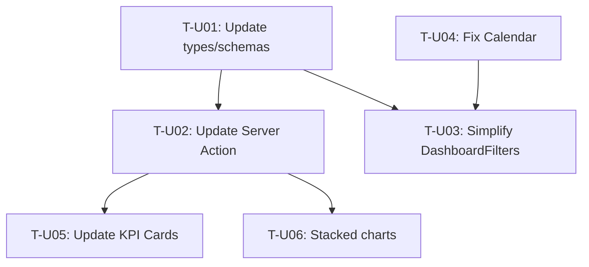

# Task Plan — Performance Dashboard UI/UX Improvements (Update #1)

<!-- Template Version: 1.0 | Contract: v1.0 | US-2.1.1 | Update: 1 -->

---

## TL;DR

| Aspect           | Value                                            |
| ---------------- | ------------------------------------------------ |
| Feature          | Performance Dashboard UI/UX Improvements         |
| Total Tasks      | 6                                                |
| Estimated Effort | ~6-8 hours                                       |
| Affected Roots   | `sgs-cs-helper`                                  |
| Dev Mode         | Standard                                         |
| Spec Reference   | [spec-update-1.md](../01_spec/spec-update-1.md)  |
| Previous Tasks   | [tasks.md](./tasks.md) (original implementation) |

---

## 1. Update Context

🇻🇳 **Update #1** tập trung vào cải thiện UI/UX dựa trên feedback sau implementation ban đầu:

- Đơn giản hóa scope filtering (bỏ "Group")
- Cải thiện chart visualization (stacked columns thay vì line charts)
- Fix date picker bugs
- Hiển thị KPI dưới dạng ratio thay vì absolute numbers

🇬🇧 **Update #1** focuses on UI/UX improvements based on post-implementation feedback:

- Simplify scope filtering (remove "Group")
- Improve chart visualization (stacked columns instead of line charts)
- Fix date picker bugs
- Show KPIs as ratios instead of absolute numbers

---

## 2. Task Overview

| ID    | Title                                        | Root            | Type   | Est.       | Deps  | Status |
| ----- | -------------------------------------------- | --------------- | ------ | ---------- | ----- | ------ |
| T-U01 | Update types & schemas (remove group scope)  | `sgs-cs-helper` | Modify | S (30m)    | -     | ⏳     |
| T-U02 | Update Server Action for ratio-based metrics | `sgs-cs-helper` | Modify | M (1-1.5h) | T-U01 | ⏳     |
| T-U03 | Simplify DashboardFilters (remove Group)     | `sgs-cs-helper` | Modify | S (30m)    | T-U01 | ⏳     |
| T-U04 | Fix Calendar component (auto-select & range) | `sgs-cs-helper` | Modify | M (1h)     | -     | ⏳     |
| T-U05 | Update KPI Cards (ratio display)             | `sgs-cs-helper` | Modify | M (1-1.5h) | T-U02 | ⏳     |
| T-U06 | Convert charts to stacked columns            | `sgs-cs-helper` | Modify | L (2-3h)   | T-U02 | ⏳     |

**Legend:**

- Type: `Modify` = Change existing component
- Estimate: S (<1h), M (1-2h), L (2-4h)
- Status: ⏳ Pending, 🔄 In Progress, ✅ Done, ❌ Blocked
- ID Prefix: `T-U` = Update task (distinguishes from original T-XXX)

---

## 3. Execution Flow



---

## 3.5 Parallel Execution Notes

### Parallel Groups

| Group | Tasks               | Reason                                     |
| ----- | ------------------- | ------------------------------------------ |
| A     | T-U01, T-U04        | Independent: types vs calendar fix         |
| B     | T-U03, T-U05, T-U06 | All depend on T-U01/T-U02, different files |

### Sequential Constraints

| Sequence      | Reason                                  |
| ------------- | --------------------------------------- |
| T-U01 → T-U02 | Server Action needs updated types       |
| T-U02 → T-U05 | KPI cards need new ratio data structure |
| T-U02 → T-U06 | Charts need new stacked data structure  |

---

## 4. Task Details

### T-U01 — Update Types & Schemas (Remove Group Scope)

| Aspect       | Detail                    |
| ------------ | ------------------------- |
| Root         | `sgs-cs-helper`           |
| Type         | Modify                    |
| Estimated    | S (30 min)                |
| Dependencies | None                      |
| FR Covered   | FR-002 (simplified scope) |

#### Description

🇻🇳 Cập nhật types và Zod schemas để:

- Bỏ `"group"` khỏi scope type (chỉ giữ `"all-team" | "individual"`)
- Bỏ `userIds?: string[]` array (thay bằng `userId?: number` single)
- Thêm types mới cho ratio-based KPIs và stacked chart data

🇬🇧 Update types and Zod schemas to:

- Remove `"group"` from scope type (keep only `"all-team" | "individual"`)
- Remove `userIds?: string[]` array (replace with `userId?: number` single)
- Add new types for ratio-based KPIs and stacked chart data

#### Files

| Action | Path                     |
| ------ | ------------------------ |
| Modify | `src/types/dashboard.ts` |

#### Implementation

```typescript
// BEFORE
export type DashboardScope = "all" | "group" | "individual";
export interface DashboardFilters {
  scope: DashboardScope;
  userIds?: string[]; // Multiple users for group
  dateFrom: string;
  dateTo: string;
}

// AFTER
export type DashboardScope = "all-team" | "individual";
export interface DashboardFilters {
  scope: DashboardScope;
  userId?: number; // Single user for individual scope
  startDate: Date;
  endDate: Date;
}

// NEW: Ratio-based KPI types
export interface KpiRatio {
  completed: number;
  total: number;
  percentage: number;
}

export interface KpiTrend {
  rate: number;
  trend: "up" | "down" | "stable";
  previousRate: number;
}

export interface KpiProcessing {
  days: number;
  target: number;
  comparison: "above" | "below" | "on-target";
}

// NEW: Stacked chart data types
export interface StackedUserData {
  userName: string;
  userId: number;
  onTimeCount: number;
  overdueCount: number;
  totalCompleted: number;
  onTimePercentage: number;
}

export interface StackedTrendData {
  date: string;
  onTimeCount: number;
  overdueCount: number;
  totalCompleted: number;
  onTimePercentage: number;
}
```

#### Done Criteria

- [ ] `DashboardScope` type only has `"all-team" | "individual"`
- [ ] `DashboardFilters.userIds` removed, `userId` added (single number)
- [ ] New KPI ratio types defined (`KpiRatio`, `KpiTrend`, `KpiProcessing`)
- [ ] New stacked chart types defined (`StackedUserData`, `StackedTrendData`)
- [ ] Zod schemas updated to match new types
- [ ] TypeScript compiles with no errors

#### Verification

```bash
pnpm tsc --noEmit
grep -r "group" src/types/dashboard.ts  # Should return nothing
```

---

### T-U02 — Update Server Action for Ratio-based Metrics

| Aspect       | Detail                         |
| ------------ | ------------------------------ |
| Root         | `sgs-cs-helper`                |
| Type         | Modify                         |
| Estimated    | M (1-1.5h)                     |
| Dependencies | T-U01                          |
| FR Covered   | FR-002, FR-004, FR-005, FR-007 |

#### Description

🇻🇳 Cập nhật `getDashboardMetrics` Server Action để:

- Bỏ logic xử lý "group" scope
- Return ratio-based KPI data (completed/total, percentages)
- Return stacked chart data với on-time/overdue breakdown
- Tính trend so với previous period

🇬🇧 Update `getDashboardMetrics` Server Action to:

- Remove "group" scope handling logic
- Return ratio-based KPI data (completed/total, percentages)
- Return stacked chart data with on-time/overdue breakdown
- Calculate trend compared to previous period

#### Files

| Action | Path                           |
| ------ | ------------------------------ |
| Modify | `src/lib/actions/dashboard.ts` |

#### Implementation

```typescript
// Updated return type
interface DashboardMetricsResult {
  kpis: {
    totalCompleted: { completed: number; total: number; percentage: number };
    onTimeRate: {
      rate: number;
      trend: "up" | "down" | "stable";
      previousRate: number;
    };
    avgProcessingTime: {
      days: number;
      target: number;
      comparison: "above" | "below" | "on-target";
    };
    overdueCount: { overdue: number; total: number; percentage: number };
  };

  completionPerUser: StackedUserData[];
  completionTrend: StackedTrendData[];
  onTimeRatio: { onTime: number; overdue: number; totalCompleted: number };
  userBreakdown: UserMetrics[];
}

// Key changes:
// 1. Remove group scope case from switch statement
// 2. Add percentage calculations for all metrics
// 3. Calculate previous period for trend comparison
// 4. Group chart data by on-time vs overdue
```

#### Done Criteria

- [ ] Server Action accepts only `"all-team" | "individual"` scope
- [ ] KPIs return both absolute numbers and percentages
- [ ] Trend calculation compares with previous equivalent period
- [ ] Chart data includes on-time/overdue breakdown
- [ ] All existing tests pass
- [ ] `pnpm build` passes

#### Verification

```bash
pnpm build
# Test with different scopes via dashboard UI
```

---

### T-U03 — Simplify DashboardFilters (Remove Group)

| Aspect       | Detail          |
| ------------ | --------------- |
| Root         | `sgs-cs-helper` |
| Type         | Modify          |
| Estimated    | S (30 min)      |
| Dependencies | T-U01, T-U04    |
| FR Covered   | FR-002          |

#### Description

🇻🇳 Cập nhật DashboardFilters component để:

- Bỏ "Group" option khỏi scope selector
- Bỏ multi-select user logic
- Khi chọn "Individual", show single user dropdown
- Đảm bảo "All Team" là default

🇬🇧 Update DashboardFilters component to:

- Remove "Group" option from scope selector
- Remove multi-select user logic
- When selecting "Individual", show single user dropdown
- Ensure "All Team" is default

#### Files

| Action | Path                                             |
| ------ | ------------------------------------------------ |
| Modify | `src/components/dashboard/dashboard-filters.tsx` |

#### Implementation

```typescript
// BEFORE: 3 scope options
const scopeOptions = [
  { value: "all", label: "All Team" },
  { value: "group", label: "Group" },
  { value: "individual", label: "Individual" },
];

// AFTER: 2 scope options only
const scopeOptions = [
  { value: "all-team", label: "All Team" },
  { value: "individual", label: "Individual" },
];

// Remove multi-select Combobox for users
// Replace with simple Select for single user when scope === 'individual'
```

#### Done Criteria

- [ ] Only "All Team" and "Individual" options in scope selector
- [ ] "All Team" selected by default
- [ ] User dropdown only shows when scope is "Individual"
- [ ] No multi-select functionality
- [ ] Filter changes trigger data refresh
- [ ] TypeScript compiles with no errors

#### Verification

```bash
pnpm build
# Visual test: open dashboard, verify only 2 scope options
```

---

### T-U04 — Fix Calendar Component (Auto-select & Range)

| Aspect       | Detail          |
| ------------ | --------------- |
| Root         | `sgs-cs-helper` |
| Type         | Modify          |
| Estimated    | M (1h)          |
| Dependencies | None            |
| FR Covered   | FR-003          |

#### Description

🇻🇳 Sửa bugs trong custom date picker:

- Auto-select today's date khi popover mở
- Hỗ trợ range selection (từ ngày - đến ngày)
- Validate start ≤ end date
- Max range: 1 year

🇬🇧 Fix bugs in custom date picker:

- Auto-select today's date when popover opens
- Support range selection (from date - to date)
- Validate start ≤ end date
- Max range: 1 year

#### Files

| Action | Path                                             |
| ------ | ------------------------------------------------ |
| Modify | `src/components/dashboard/dashboard-filters.tsx` |

#### Implementation

```typescript
// Use react-day-picker's DateRange mode
import { DateRange } from "react-day-picker";

// Auto-select today when opening
const [dateRange, setDateRange] = useState<DateRange>({
  from: new Date(),
  to: new Date(),
});

// Validation
const handleDateChange = (range: DateRange | undefined) => {
  if (!range) return;

  // Validate start <= end
  if (range.from && range.to && range.from > range.to) {
    toast.error("Start date must be before end date");
    return;
  }

  // Validate max 1 year range
  if (range.from && range.to) {
    const diffDays = differenceInDays(range.to, range.from);
    if (diffDays > 365) {
      toast.warning("Maximum range is 1 year");
      return;
    }
  }

  setDateRange(range);
};
```

#### Done Criteria

- [ ] Calendar opens with today's date highlighted
- [ ] Can select date range (from-to)
- [ ] Invalid range (start > end) shows error
- [ ] Range > 1 year shows warning
- [ ] Selected dates update filter state correctly

#### Verification

```bash
pnpm build
# Visual test: open custom date picker, verify auto-select and range selection
```

---

### T-U05 — Update KPI Cards (Ratio Display)

| Aspect       | Detail          |
| ------------ | --------------- |
| Root         | `sgs-cs-helper` |
| Type         | Modify          |
| Estimated    | M (1-1.5h)      |
| Dependencies | T-U02           |
| FR Covered   | FR-004          |

#### Description

🇻🇳 Cập nhật KPI Cards để hiển thị ratio thay vì absolute numbers:

- **Total Completed:** "X completed / Y total (Z%)" với progress bar
- **On-time Rate:** "X% on-time" với trend arrow (↑/↓)
- **Avg Processing Time:** "X days" với comparison "vs Y target"
- **Overdue Count:** "X overdue / Y total (Z%)" với severity color

🇬🇧 Update KPI Cards to show ratios instead of absolute numbers:

- **Total Completed:** "X completed / Y total (Z%)" with progress bar
- **On-time Rate:** "X% on-time" with trend arrow (↑/↓)
- **Avg Processing Time:** "X days" with comparison "vs Y target"
- **Overdue Count:** "X overdue / Y total (Z%)" with severity color

#### Files

| Action | Path                                     |
| ------ | ---------------------------------------- |
| Modify | `src/components/dashboard/kpi-cards.tsx` |

#### Implementation

```tsx
// Total Completed Card
<Card>
  <CardHeader>
    <CardTitle>Total Completed</CardTitle>
  </CardHeader>
  <CardContent>
    <div className="text-2xl font-bold">
      {kpi.totalCompleted.completed} / {kpi.totalCompleted.total}
    </div>
    <div className="text-sm text-muted-foreground">
      ({kpi.totalCompleted.percentage}%)
    </div>
    <Progress value={kpi.totalCompleted.percentage} className="mt-2" />
  </CardContent>
</Card>

// On-time Rate Card with trend arrow
<Card>
  <CardHeader>
    <CardTitle>On-time Rate</CardTitle>
  </CardHeader>
  <CardContent>
    <div className="flex items-center gap-2">
      <span className="text-2xl font-bold">{kpi.onTimeRate.rate}%</span>
      {kpi.onTimeRate.trend === 'up' && <ArrowUpIcon className="text-green-500" />}
      {kpi.onTimeRate.trend === 'down' && <ArrowDownIcon className="text-red-500" />}
    </div>
    <div className="text-sm text-muted-foreground">
      vs {kpi.onTimeRate.previousRate}% previous period
    </div>
  </CardContent>
</Card>

// Overdue with severity color
const overdueColor = kpi.overdueCount.percentage > 20
  ? 'text-red-500'
  : kpi.overdueCount.percentage > 10
    ? 'text-orange-500'
    : 'text-green-500';
```

#### Done Criteria

- [ ] Total Completed shows "X / Y (Z%)" with progress bar
- [ ] On-time Rate shows percentage with trend arrow
- [ ] Avg Processing shows days with target comparison
- [ ] Overdue shows "X / Y (Z%)" with severity color
- [ ] TypeScript compiles with no errors
- [ ] Visual appearance matches design

#### Verification

```bash
pnpm build
# Visual test: verify KPI cards show ratios and trend indicators
```

---

### T-U06 — Convert Charts to Stacked Columns

| Aspect       | Detail          |
| ------------ | --------------- |
| Root         | `sgs-cs-helper` |
| Type         | Modify          |
| Estimated    | L (2-3h)        |
| Dependencies | T-U02           |
| FR Covered   | FR-005, FR-007  |

#### Description

🇻🇳 Chuyển đổi charts sang dạng stacked columns:

- **Completion per User Chart:** Stacked bars với on-time (green) và overdue (red) segments
- **Completion Trend Chart:** Thay LineChart bằng stacked BarChart theo ngày/tuần
- Hover tooltips hiển thị breakdown với percentages
- Legend rõ ràng cho on-time/overdue

🇬🇧 Convert charts to stacked columns:

- **Completion per User Chart:** Stacked bars with on-time (green) and overdue (red) segments
- **Completion Trend Chart:** Replace LineChart with stacked BarChart by day/week
- Hover tooltips show breakdown with percentages
- Clear legend for on-time/overdue

#### Files

| Action | Path                                                  |
| ------ | ----------------------------------------------------- |
| Modify | `src/components/dashboard/completion-bar-chart.tsx`   |
| Modify | `src/components/dashboard/completion-trend-chart.tsx` |

#### Implementation

```tsx
// Completion per User - Stacked Bar Chart
<BarChart data={completionPerUser} layout="vertical">
  <CartesianGrid strokeDasharray="3 3" />
  <XAxis type="number" />
  <YAxis dataKey="userName" type="category" />
  <Tooltip content={<CustomTooltip />} />
  <Legend />
  <Bar dataKey="onTimeCount" stackId="a" fill="#22c55e" name="On-time" />
  <Bar dataKey="overdueCount" stackId="a" fill="#ef4444" name="Overdue" />
</BarChart>;

// Custom Tooltip with percentages
const CustomTooltip = ({ active, payload }: TooltipProps) => {
  if (!active || !payload?.length) return null;
  const data = payload[0].payload as StackedUserData;
  return (
    <div className="bg-background border rounded p-2 shadow">
      <p className="font-bold">{data.userName}</p>
      <p>
        On-time: {data.onTimeCount} ({data.onTimePercentage}%)
      </p>
      <p>
        Overdue: {data.overdueCount} ({100 - data.onTimePercentage}%)
      </p>
      <p>Total: {data.totalCompleted}</p>
    </div>
  );
};

// Completion Trend - Stacked Column Chart (was LineChart)
<BarChart data={completionTrend}>
  <CartesianGrid strokeDasharray="3 3" />
  <XAxis dataKey="date" />
  <YAxis />
  <Tooltip content={<TrendTooltip />} />
  <Legend />
  <Bar dataKey="onTimeCount" stackId="a" fill="#22c55e" name="On-time" />
  <Bar dataKey="overdueCount" stackId="a" fill="#ef4444" name="Overdue" />
</BarChart>;
```

#### Done Criteria

- [ ] Completion per User shows stacked horizontal bars
- [ ] Each bar has on-time (green) and overdue (red) segments
- [ ] Completion Trend is a stacked column chart (not line)
- [ ] Hover tooltips show breakdown numbers and percentages
- [ ] Legend clearly indicates on-time vs overdue colors
- [ ] Charts are responsive
- [ ] TypeScript compiles with no errors

#### Verification

```bash
pnpm build
# Visual test: verify stacked charts render correctly with breakdown
```

---

## 5. Requirements Coverage

| Requirement | Tasks               | Status |
| ----------- | ------------------- | ------ |
| FR-002      | T-U01, T-U02, T-U03 | ⏳     |
| FR-003      | T-U04               | ⏳     |
| FR-004      | T-U02, T-U05        | ⏳     |
| FR-005      | T-U02, T-U06        | ⏳     |
| FR-007      | T-U02, T-U06        | ⏳     |

---

## 6. Risk Assessment

| Task  | Risk                    | Mitigation                                |
| ----- | ----------------------- | ----------------------------------------- |
| T-U02 | Data structure breaking | Keep backward compatible if possible      |
| T-U06 | Chart rendering issues  | Test with edge cases (0 data, many users) |
| T-U04 | Calendar library quirks | Check react-day-picker docs carefully     |

---

## 7. Test Plan

### 7.1 Test Strategy

| Type        | Focus                                      | Target |
| ----------- | ------------------------------------------ | ------ |
| Unit        | Type validation, utility functions         | 80%    |
| Integration | Server Action with DB, component rendering | 70%    |
| Visual      | Chart rendering, layout responsiveness     | Manual |

### 7.2 Test Cases by Task

| TC ID   | Task  | Test Description                                | Type        | Expected Result                  |
| ------- | ----- | ----------------------------------------------- | ----------- | -------------------------------- |
| TC-U001 | T-U01 | Validate scope only accepts all-team/individual | Unit        | Type error if "group" passed     |
| TC-U002 | T-U01 | Zod schema rejects invalid scope                | Unit        | Validation error                 |
| TC-U003 | T-U02 | Server Action returns ratio-based KPIs          | Integration | Percentages calculated correctly |
| TC-U004 | T-U02 | Trend calculation compares with prev period     | Integration | Correct up/down/stable indicator |
| TC-U005 | T-U02 | Chart data includes on-time/overdue breakdown   | Integration | Both counts in response          |
| TC-U006 | T-U03 | Scope selector only shows 2 options             | Visual      | No "Group" option visible        |
| TC-U007 | T-U03 | User dropdown appears only for Individual       | Visual      | Conditional rendering works      |
| TC-U008 | T-U04 | Calendar auto-selects today on open             | Visual      | Today highlighted                |
| TC-U009 | T-U04 | Date range selection works                      | Visual      | Can select from-to dates         |
| TC-U010 | T-U04 | Invalid range shows error                       | Visual      | Error toast appears              |
| TC-U011 | T-U05 | KPI card shows X/Y (Z%) format                  | Visual      | Ratio display correct            |
| TC-U012 | T-U05 | Trend arrow shows for on-time rate              | Visual      | Arrow icon visible               |
| TC-U013 | T-U06 | Stacked bars show 2 segments                    | Visual      | Green + red segments visible     |
| TC-U014 | T-U06 | Tooltip shows breakdown percentages             | Visual      | Percentages in tooltip           |
| TC-U015 | T-U06 | Trend chart is columns not line                 | Visual      | BarChart rendered, not LineChart |

### 7.3 Edge Cases

| Edge Case               | Task  | Expected Behavior                    |
| ----------------------- | ----- | ------------------------------------ |
| No orders in range      | T-U02 | Return zeros, show "No data" message |
| Division by zero        | T-U02 | Return "N/A" or 0, not crash         |
| All orders on-time      | T-U06 | Only green segment, no red           |
| All orders overdue      | T-U06 | Only red segment, no green           |
| User with 0 completions | T-U06 | Empty bar with tooltip               |
| Date range > 1 year     | T-U04 | Warning toast, prevent selection     |
| Single day range        | T-U04 | Should work (from = to)              |

### 7.4 Test Data

```typescript
// Mock data for stacked charts
const mockStackedUserData: StackedUserData[] = [
  {
    userName: "Alice",
    userId: 1,
    onTimeCount: 8,
    overdueCount: 2,
    totalCompleted: 10,
    onTimePercentage: 80,
  },
  {
    userName: "Bob",
    userId: 2,
    onTimeCount: 5,
    overdueCount: 5,
    totalCompleted: 10,
    onTimePercentage: 50,
  },
  {
    userName: "Charlie",
    userId: 3,
    onTimeCount: 0,
    overdueCount: 3,
    totalCompleted: 3,
    onTimePercentage: 0,
  },
];

// Mock data for ratio KPIs
const mockKpis = {
  totalCompleted: { completed: 45, total: 60, percentage: 75 },
  onTimeRate: { rate: 82, trend: "up" as const, previousRate: 78 },
  avgProcessingTime: { days: 3.2, target: 3.0, comparison: "above" as const },
  overdueCount: { overdue: 8, total: 60, percentage: 13 },
};
```

---

## 8. Artifact Summary

| Artifact            | Path                         | Status               |
| ------------------- | ---------------------------- | -------------------- |
| Original Task Plan  | `02_tasks/tasks.md`          | Complete (preserved) |
| Update #1 Task Plan | `02_tasks/tasks-update-1.md` | This document        |

---

**Document Status:** Draft  
**Last Updated:** 2026-02-11  
**Previous Version:** [tasks.md](./tasks.md)
