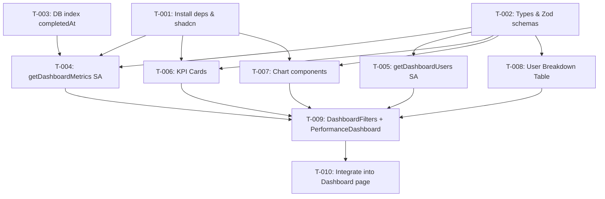

# Task Plan — Performance Dashboard with Chart Visualization

<!-- Template Version: 1.0 | Contract: v1.0 | US-2.1.1 -->

---

## TL;DR

| Aspect           | Value                                          |
| ---------------- | ---------------------------------------------- |
| Feature          | Performance Dashboard with Chart Visualization |
| Total Tasks      | 10                                             |
| Estimated Effort | ~14–17 hours                                   |
| Affected Roots   | `sgs-cs-helper`                                |
| Dev Mode         | Standard                                       |
| Spec Reference   | [spec.md](../01_spec/spec.md)                  |

---

## 1. Goal

🇻🇳 Hoàn thành tất cả task sẽ tạo ra trang dashboard có phần hiệu suất cho Admin/Super Admin: KPI cards, biểu đồ (cột, tròn, đường), bảng phân tích user, bộ lọc phạm vi + thời gian, aggregation phía server.

🇬🇧 Completing all tasks will produce a dashboard page with a performance section for Admin/Super Admin: KPI cards, charts (bar, pie, line), user breakdown table, scope + time range filters, server-side aggregation.

---

## 2. Task Overview

| ID    | Title                                              | Root            | Type   | Est.       | Deps                              | Status |
| ----- | -------------------------------------------------- | --------------- | ------ | ---------- | --------------------------------- | ------ |
| T-001 | Install dependencies & add shadcn components       | `sgs-cs-helper` | New    | S (30m)    | -                                 | ⏳     |
| T-002 | Define TypeScript types & Zod schemas              | `sgs-cs-helper` | New    | S (30m)    | -                                 | ⏳     |
| T-003 | Add DB index on completedAt                        | `sgs-cs-helper` | Modify | S (15m)    | -                                 | ⏳     |
| T-004 | Create `getDashboardMetrics` Server Action         | `sgs-cs-helper` | New    | L (3–4h)   | T-001, T-002, T-003               | ⏳     |
| T-005 | Create `getDashboardUsers` Server Action           | `sgs-cs-helper` | New    | S (30m)    | T-002                             | ⏳     |
| T-006 | Create KPI Cards component                         | `sgs-cs-helper` | New    | M (1–1.5h) | T-001, T-002                      | ⏳     |
| T-007 | Create Chart components (Bar, Pie, Line)           | `sgs-cs-helper` | New    | L (2.5–3h) | T-001, T-002                      | ⏳     |
| T-008 | Create User Breakdown Table component              | `sgs-cs-helper` | New    | M (1–1.5h) | T-002                             | ⏳     |
| T-009 | Create DashboardFilters & PerformanceDashboard     | `sgs-cs-helper` | New    | L (3–4h)   | T-004, T-005, T-006, T-007, T-008 | ⏳     |
| T-010 | Integrate PerformanceDashboard into Dashboard page | `sgs-cs-helper` | Modify | M (1–1.5h) | T-009                             | ⏳     |

**Legend:**

- Type: `New` = Create new, `Modify` = Change existing
- Estimate: S (<1h), M (1–2h), L (2–4h)
- Status: ⏳ Pending, 🔄 In Progress, ✅ Done, ❌ Blocked

---

## 3. Execution Flow



---

## 3.5 Parallel Execution Notes

### Parallel Groups

🇻🇳 Các tasks trong cùng group có thể chạy song song (khác file, không depend lẫn nhau).

🇬🇧 Tasks in the same group can run in parallel (different files, no inter-dependencies).

| Group | Tasks               | Reason                                                   |
| ----- | ------------------- | -------------------------------------------------------- |
| A     | T-001, T-002, T-003 | No inter-dependencies, all are setup/infra tasks         |
| B     | T-004, T-005        | Both depend on Group A, different files (server actions) |
| C     | T-006, T-007, T-008 | All depend on T-001/T-002, different component files     |

### Sequential Constraints

🇻🇳 Các tasks phải chạy tuần tự vì lý do kỹ thuật.

🇬🇧 Tasks that must run sequentially due to technical reasons.

| Sequence            | Reason                                      |
| ------------------- | ------------------------------------------- |
| Group A → T-004     | SA needs packages, types, index             |
| Group A → Group C   | Components need packages and types          |
| Group B + C → T-009 | Wrapper integrates all sub-components + SAs |
| T-009 → T-010       | Page integrates the wrapper component       |

### Execution Hint

🇻🇳 Đây chỉ là gợi ý. Copilot-Flow vẫn thực thi one-task-at-a-time.

🇬🇧 This is a hint only. Copilot-Flow execution is still one-task-at-a-time.

---

## 4. Task Details

### T-001 — Install Dependencies & Add shadcn Components

| Aspect       | Detail                                                            |
| ------------ | ----------------------------------------------------------------- |
| Root         | `sgs-cs-helper`                                                   |
| Type         | New                                                               |
| Estimated    | S (30 min)                                                        |
| Dependencies | None                                                              |
| FR Covered   | FR-005, FR-006, FR-007 (charts), FR-003 (calendar), FR-004 (card) |

#### Description

🇻🇳 Cài đặt `recharts` package. Thêm shadcn/ui components: `card` (cho KPI cards) và `calendar` (cho date range picker). Cần `react-day-picker` sẽ được tự động cài khi thêm calendar.

🇬🇧 Install `recharts` package. Add shadcn/ui components: `card` (for KPI cards) and `calendar` (for date range picker). `react-day-picker` will be auto-installed with calendar.

#### Files

| Action | Path                                          |
| ------ | --------------------------------------------- |
| Modify | `package.json` (via pnpm add)                 |
| Create | `src/components/ui/card.tsx` (via shadcn)     |
| Create | `src/components/ui/calendar.tsx` (via shadcn) |

#### Implementation

🇻🇳 Chạy `pnpm add recharts`, sau đó `pnpm dlx shadcn@latest add card calendar`. Verify components được tạo đúng trong `src/components/ui/`.

🇬🇧 Run `pnpm add recharts`, then `pnpm dlx shadcn@latest add card calendar`. Verify components are created in `src/components/ui/`.

#### Done Criteria

- [ ] `recharts` installed in `package.json`
- [ ] `src/components/ui/card.tsx` exists
- [ ] `src/components/ui/calendar.tsx` exists
- [ ] `react-day-picker` installed (transitive via calendar)
- [ ] `pnpm build` passes with no errors

#### Verification

```bash
pnpm list recharts react-day-picker
ls src/components/ui/card.tsx src/components/ui/calendar.tsx
pnpm build
```

---

### T-002 — Define TypeScript Types & Zod Schemas

| Aspect       | Detail             |
| ------------ | ------------------ |
| Root         | `sgs-cs-helper`    |
| Type         | New                |
| Estimated    | S (30 min)         |
| Dependencies | None               |
| FR Covered   | All (shared types) |

#### Description

🇻🇳 Tạo file types cho dashboard metrics. Bao gồm: interfaces `DashboardFilters`, `DashboardMetrics`, `UserMetrics`, `TrendPoint`, và Zod schemas tương ứng (`dashboardFiltersSchema`). Types được dùng xuyên suốt cả server action và client components.

🇬🇧 Create types file for dashboard metrics. Includes: interfaces `DashboardFilters`, `DashboardMetrics`, `UserMetrics`, `TrendPoint`, and corresponding Zod schemas (`dashboardFiltersSchema`). Types used across server action and client components.

#### Files

| Action | Path                     |
| ------ | ------------------------ |
| Create | `src/types/dashboard.ts` |

#### Implementation

🇻🇳 Tạo types theo Section 8 "Data Models" của spec. Zod schema validate input cho Server Action (scope phải là `"all" | "group" | "individual"`, userIds optional array, dateFrom/dateTo ISO strings). Export cả types và schemas.

🇬🇧 Create types per Section 8 "Data Models" of spec. Zod schema validates Server Action input (scope must be `"all" | "group" | "individual"`, userIds optional array, dateFrom/dateTo ISO strings). Export both types and schemas.

```typescript
// Key interfaces from spec
interface DashboardFilters {
  scope: "all" | "group" | "individual";
  userIds?: string[];
  dateFrom: string; // ISO date
  dateTo: string; // ISO date
}

interface DashboardMetrics {
  kpi: {
    totalCompleted: number;
    onTimeRate: number;
    avgProcessingTime: number;
    overdueCount: number;
  };
  perUser: UserMetrics[];
  onTimeVsOverdue: { onTime: number; overdue: number };
  trend: TrendPoint[];
}

interface UserMetrics {
  userId: string;
  userName: string;
  completedCount: number;
  onTimePercent: number;
  avgDuration: number;
  overdueCount: number;
}

interface TrendPoint {
  date: string;
  completed: number;
  onTime: number;
  overdue: number;
}
```

#### Done Criteria

- [ ] `src/types/dashboard.ts` exports all 4 interfaces
- [ ] `dashboardFiltersSchema` Zod schema validates correctly
- [ ] TypeScript compiles without errors

#### Verification

```bash
pnpm tsc --noEmit
```

---

### T-003 — Add DB Index on `completedAt`

| Aspect       | Detail                |
| ------------ | --------------------- |
| Root         | `sgs-cs-helper`       |
| Type         | Modify                |
| Estimated    | S (15 min)            |
| Dependencies | None                  |
| FR Covered   | NFR-001 (performance) |

#### Description

🇻🇳 Thêm index trên `Order.completedAt` trong Prisma schema để optimize query performance cho dashboard aggregation. Chạy migration.

🇬🇧 Add index on `Order.completedAt` in Prisma schema to optimize query performance for dashboard aggregation. Run migration.

#### Files

| Action | Path                                                           |
| ------ | -------------------------------------------------------------- |
| Modify | `prisma/schema.prisma`                                         |
| Create | `prisma/migrations/<timestamp>_add_completed_at_index/` (auto) |

#### Implementation

🇻🇳 Thêm `@@index([completedAt])` vào model Order trong `prisma/schema.prisma`. Chạy `pnpm db:migrate` để tạo migration.

🇬🇧 Add `@@index([completedAt])` to Order model in `prisma/schema.prisma`. Run `pnpm db:migrate` to create migration.

```prisma
model Order {
  // ... existing fields
  @@index([completedAt])  // ADD THIS
}
```

#### Done Criteria

- [ ] `@@index([completedAt])` added to Order model
- [ ] Migration created and applied successfully
- [ ] `pnpm db:generate` passes

#### Verification

```bash
pnpm db:migrate
pnpm db:generate
```

---

### T-004 — Create `getDashboardMetrics` Server Action

| Aspect       | Detail                                          |
| ------------ | ----------------------------------------------- |
| Root         | `sgs-cs-helper`                                 |
| Type         | New                                             |
| Estimated    | L (3–4h)                                        |
| Dependencies | T-001, T-002, T-003                             |
| FR Covered   | FR-004, FR-005, FR-006, FR-007, FR-008, NFR-001 |

#### Description

🇻🇳 Tạo Server Action `getDashboardMetrics` nhận filters (scope, userIds, dateFrom, dateTo), query completed orders từ DB, tính toán metrics phía server. Logic chính: (1) Auth check (ADMIN/SUPER_ADMIN), (2) Zod validate input, (3) Prisma query completed orders trong range, (4) JS aggregation: tính KPI, per-user breakdown, on-time vs overdue, trend data. Tái sử dụng `calcActualDuration` + `getPriorityDuration`. Xử lý EC-008 (orders without completedBy).

🇬🇧 Create Server Action `getDashboardMetrics` receiving filters (scope, userIds, dateFrom, dateTo), querying completed orders from DB, computing metrics server-side. Core logic: (1) Auth check (ADMIN/SUPER_ADMIN), (2) Zod validate input, (3) Prisma query completed orders in range, (4) JS aggregation: compute KPI, per-user breakdown, on-time vs overdue, trend data. Reuse `calcActualDuration` + `getPriorityDuration`. Handle EC-008 (orders without completedBy).

#### Files

| Action | Path                           |
| ------ | ------------------------------ |
| Create | `src/app/actions/dashboard.ts` |

#### Implementation

🇻🇳 Theo pattern Server Action hiện có:

- `"use server"` directive
- Zod schema validate input (`dashboardFiltersSchema`)
- Auth via `auth()` → check role ADMIN/SUPER_ADMIN
- Prisma query: `findMany` where `status = COMPLETED`, `completedAt` in range, filtered by scope/userIds
- JS aggregation loop: for each order, compute `calcActualDuration(receivedDate, completedAt)`, compare with `getPriorityDuration(priority) * MS_PER_HOUR`
- KPI: totalCompleted, onTimeRate, avgProcessingTime, overdueCount
- perUser: group by `completedById`, compute per-user stats (skip orders with null completedById)
- onTimeVsOverdue: counts
- trend: group by date/week (daily ≤30 days, weekly >30 days)
- Return `{ success: true, data: DashboardMetrics }` or `{ success: false, error: string }`

🇬🇧 Follow existing Server Action pattern:

- `"use server"` directive
- Zod schema validate input (`dashboardFiltersSchema`)
- Auth via `auth()` → check role ADMIN/SUPER_ADMIN
- Prisma query: `findMany` where `status = COMPLETED`, `completedAt` in range, filtered by scope/userIds
- JS aggregation loop: for each order, compute `calcActualDuration(receivedDate, completedAt)`, compare with `getPriorityDuration(priority) * MS_PER_HOUR`
- KPI: totalCompleted, onTimeRate, avgProcessingTime, overdueCount
- perUser: group by `completedById`, compute per-user stats (skip orders with null completedById)
- onTimeVsOverdue: counts
- trend: group by date/week (daily ≤30 days, weekly >30 days)
- Return `{ success: true, data: DashboardMetrics }` or `{ success: false, error: string }`

```typescript
// Key structure
export async function getDashboardMetrics(filters: DashboardFilters): Promise<
  | { success: true; data: DashboardMetrics }
  | { success: false; error: string }
> { ... }
```

#### Done Criteria

- [ ] `getDashboardMetrics` exported from `src/app/actions/dashboard.ts`
- [ ] Auth check rejects non-admin roles
- [ ] Zod validates input filters
- [ ] Queries only COMPLETED orders in date range
- [ ] Correctly applies scope filter (all/group/individual)
- [ ] Reuses `calcActualDuration` + `getPriorityDuration` (no duplication)
- [ ] Returns correct KPI values (totalCompleted, onTimeRate, avgProcessingTime, overdueCount)
- [ ] Returns per-user breakdown (excludes orders with null completedById)
- [ ] Returns onTimeVsOverdue counts
- [ ] Returns trend data (daily for ≤30 days, weekly for >30 days)
- [ ] Empty result returns zeros/empty arrays (not errors)
- [ ] TypeScript compiles without errors

#### Verification

```bash
pnpm tsc --noEmit
# Manual: Test via calling from a temporary page or script
```

---

### T-005 — Create `getDashboardUsers` Server Action

| Aspect       | Detail                                  |
| ------------ | --------------------------------------- |
| Root         | `sgs-cs-helper`                         |
| Type         | New                                     |
| Estimated    | S (30 min)                              |
| Dependencies | T-002                                   |
| FR Covered   | FR-002 (scope selector needs user list) |

#### Description

🇻🇳 Tạo Server Action `getDashboardUsers` trả về danh sách users active (STAFF + ADMIN) cho scope selector dropdown. Auth check ADMIN/SUPER_ADMIN.

🇬🇧 Create Server Action `getDashboardUsers` returning list of active users (STAFF + ADMIN) for scope selector dropdown. Auth check ADMIN/SUPER_ADMIN.

#### Files

| Action | Path                                                       |
| ------ | ---------------------------------------------------------- |
| Modify | `src/app/actions/dashboard.ts` (add to same file as T-004) |

#### Implementation

🇻🇳 Thêm function `getDashboardUsers` vào `dashboard.ts`. Query `prisma.user.findMany` where `status = ACTIVE`, `role in [STAFF, ADMIN]`, select `id, name, role`, orderBy `name asc`.

🇬🇧 Add function `getDashboardUsers` to `dashboard.ts`. Query `prisma.user.findMany` where `status = ACTIVE`, `role in [STAFF, ADMIN]`, select `id, name, role`, orderBy `name asc`.

```typescript
export async function getDashboardUsers(): Promise<
  | { success: true; data: Array<{ id: string; name: string; role: string }> }
  | { success: false; error: string }
> { ... }
```

#### Done Criteria

- [ ] `getDashboardUsers` exported from `src/app/actions/dashboard.ts`
- [ ] Auth check rejects non-admin roles
- [ ] Returns only ACTIVE users with role STAFF or ADMIN
- [ ] Returns id, name, role fields
- [ ] Ordered by name ascending

#### Verification

```bash
pnpm tsc --noEmit
```

---

### T-006 — Create KPI Cards Component

| Aspect       | Detail                                |
| ------------ | ------------------------------------- |
| Root         | `sgs-cs-helper`                       |
| Type         | New                                   |
| Estimated    | M (1–1.5h)                            |
| Dependencies | T-001 (card component), T-002 (types) |
| FR Covered   | FR-004                                |

#### Description

🇻🇳 Tạo component `KpiCards` hiển thị 4 thẻ KPI: Total Completed, On-Time Rate, Average Processing Time, Overdue Count. Dùng shadcn Card. Hiển thị icon, label, value. Có loading skeleton state.

🇬🇧 Create `KpiCards` component displaying 4 KPI cards: Total Completed, On-Time Rate, Average Processing Time, Overdue Count. Uses shadcn Card. Shows icon, label, value. Has loading skeleton state.

#### Files

| Action | Path                                     |
| ------ | ---------------------------------------- |
| Create | `src/components/dashboard/kpi-cards.tsx` |

#### Implementation

🇻🇳 Client component (`"use client"`). Nhận props `kpi: DashboardMetrics["kpi"]` và `isLoading: boolean`. Format values: totalCompleted → integer, onTimeRate → "XX.X%", avgProcessingTime → `formatDuration(ms)`, overdueCount → integer. Loading state: hiển thị Skeleton. Responsive: grid-cols-2 md:grid-cols-4.

🇬🇧 Client component (`"use client"`). Receives props `kpi: DashboardMetrics["kpi"]` and `isLoading: boolean`. Format values: totalCompleted → integer, onTimeRate → "XX.X%", avgProcessingTime → `formatDuration(ms)`, overdueCount → integer. Loading state: show Skeleton. Responsive: grid-cols-2 md:grid-cols-4.

#### Done Criteria

- [ ] Component renders 4 cards with correct labels and icons
- [ ] Values formatted correctly (integer, %, duration, integer)
- [ ] Loading skeleton renders when `isLoading = true`
- [ ] Grid: 2 columns on mobile, 4 on desktop
- [ ] On-time rate of 0 completed shows "—"
- [ ] Avg processing time of 0 shows "—"

#### Verification

```bash
pnpm tsc --noEmit
pnpm lint
```

---

### T-007 — Create Chart Components (Bar, Pie, Line)

| Aspect       | Detail                          |
| ------------ | ------------------------------- |
| Root         | `sgs-cs-helper`                 |
| Type         | New                             |
| Estimated    | L (2.5–3h)                      |
| Dependencies | T-001 (recharts), T-002 (types) |
| FR Covered   | FR-005, FR-006, FR-007          |

#### Description

🇻🇳 Tạo 3 chart components dùng `recharts`, tất cả dynamic imported với `{ ssr: false }`: (1) `CompletionBarChart` — horizontal bar chart, orders per user; (2) `OnTimeRatioPieChart` — donut chart, on-time vs overdue; (3) `CompletionTrendChart` — line chart, trend over time (optional/Could). Mỗi component là thin wrapper quanh recharts, nhận data qua props. Có empty state khi không có data.

🇬🇧 Create 3 chart components using `recharts`, all dynamically imported with `{ ssr: false }`: (1) `CompletionBarChart` — horizontal bar chart, orders per user; (2) `OnTimeRatioPieChart` — donut chart, on-time vs overdue; (3) `CompletionTrendChart` — line chart, trend over time (optional/Could). Each is a thin wrapper around recharts, receives data via props. Has empty state when no data.

#### Files

| Action | Path                                                                            |
| ------ | ------------------------------------------------------------------------------- |
| Create | `src/components/dashboard/charts/completion-bar-chart.tsx`                      |
| Create | `src/components/dashboard/charts/on-time-ratio-pie-chart.tsx`                   |
| Create | `src/components/dashboard/charts/completion-trend-chart.tsx`                    |
| Create | `src/components/dashboard/charts/index.ts` (barrel export with dynamic imports) |

#### Implementation

🇻🇳

- **CompletionBarChart:** `"use client"`, recharts `BarChart` + `Bar` + `XAxis` + `YAxis` + `Tooltip` + `ResponsiveContainer`. Data = `perUser` array. Y-axis = userName, X-axis = completedCount. Sorted descending. Empty state: "No data to display".
- **OnTimeRatioPieChart:** `"use client"`, recharts `PieChart` + `Pie` + `Cell` + `Tooltip`. Data = `onTimeVsOverdue`. Green = on-time, Red = overdue. Center label = on-time percentage. Empty state for 0 total.
- **CompletionTrendChart:** `"use client"`, recharts `LineChart` + `Line` + `XAxis` + `YAxis` + `Tooltip` + `ResponsiveContainer`. Data = `trend` array. Two lines: completed (blue), on-time (green).
- **index.ts:** barrel exports using `dynamic(() => import(...), { ssr: false })` for each chart.

🇬🇧 (Same as above in English)

#### Done Criteria

- [ ] `CompletionBarChart` renders horizontal bars sorted descending
- [ ] `OnTimeRatioPieChart` renders donut with green/red segments and center label
- [ ] `CompletionTrendChart` renders line chart with two lines
- [ ] All charts use `ResponsiveContainer` for responsive sizing
- [ ] All charts have tooltips on hover
- [ ] All charts show empty state message when no data
- [ ] `index.ts` exports dynamic imports with `{ ssr: false }`
- [ ] No SSR hydration errors (verified by dynamic import)

#### Verification

```bash
pnpm tsc --noEmit
pnpm lint
```

---

### T-008 — Create User Breakdown Table Component

| Aspect       | Detail          |
| ------------ | --------------- |
| Root         | `sgs-cs-helper` |
| Type         | New             |
| Estimated    | M (1–1.5h)      |
| Dependencies | T-002 (types)   |
| FR Covered   | FR-008          |

#### Description

🇻🇳 Tạo component `UserBreakdownTable` hiển thị bảng phân tích theo user. 5 cột: User Name, Completed Count, On-Time %, Avg Duration, Overdue Count. Sort mặc định theo Completed Count giảm dần. Empty state khi không có data.

🇬🇧 Create `UserBreakdownTable` component showing per-user breakdown table. 5 columns: User Name, Completed Count, On-Time %, Avg Duration, Overdue Count. Default sort by Completed Count descending. Empty state when no data.

#### Files

| Action | Path                                                |
| ------ | --------------------------------------------------- |
| Create | `src/components/dashboard/user-breakdown-table.tsx` |

#### Implementation

🇻🇳 Client component. Dùng shadcn `Table` component (đã có). Nhận props `data: UserMetrics[]` và `isLoading: boolean`. Format: On-Time % → "XX.X%", Avg Duration → `formatDuration(ms)`. Loading: Skeleton rows. Empty: "No completed orders in this period" row.

🇬🇧 Client component. Uses shadcn `Table` component (already exists). Receives props `data: UserMetrics[]` and `isLoading: boolean`. Format: On-Time % → "XX.X%", Avg Duration → `formatDuration(ms)`. Loading: Skeleton rows. Empty: "No completed orders in this period" row.

#### Done Criteria

- [ ] Table renders 5 columns with correct headers
- [ ] Data sorted by Completed Count descending
- [ ] On-Time % formatted as "XX.X%"
- [ ] Avg Duration formatted via `formatDuration`
- [ ] Empty state row when no data
- [ ] Loading skeleton rows when `isLoading = true`

#### Verification

```bash
pnpm tsc --noEmit
pnpm lint
```

---

### T-009 — Create DashboardFilters & PerformanceDashboard

| Aspect       | Detail                                            |
| ------------ | ------------------------------------------------- |
| Root         | `sgs-cs-helper`                                   |
| Type         | New                                               |
| Estimated    | L (3–4h)                                          |
| Dependencies | T-004, T-005, T-006, T-007, T-008                 |
| FR Covered   | FR-001, FR-002, FR-003, NFR-002, NFR-003, NFR-004 |

#### Description

🇻🇳 Tạo 2 components: (1) `DashboardFilters` — filter bar với scope selector (All Team / Group / Individual) + user picker (multi/single select) + time range selector (presets + custom date range). (2) `PerformanceDashboard` — client wrapper component quản lý state (filters, metrics data), gọi `getDashboardMetrics` SA via `useTransition` khi filter thay đổi, render DashboardFilters + KpiCards + Charts + UserBreakdownTable. Nhận `initialData` và `initialUsers` từ server component.

🇬🇧 Create 2 components: (1) `DashboardFilters` — filter bar with scope selector (All Team / Group / Individual) + user picker (multi/single select) + time range selector (presets + custom date range). (2) `PerformanceDashboard` — client wrapper component managing state (filters, metrics data), calling `getDashboardMetrics` SA via `useTransition` when filters change, rendering DashboardFilters + KpiCards + Charts + UserBreakdownTable. Receives `initialData` and `initialUsers` from server component.

#### Files

| Action | Path                                                 |
| ------ | ---------------------------------------------------- |
| Create | `src/components/dashboard/dashboard-filters.tsx`     |
| Create | `src/components/dashboard/performance-dashboard.tsx` |

#### Implementation

🇻🇳
**DashboardFilters:**

- `"use client"` component
- Scope selector: shadcn `Select` with 3 options (All Team, Group, Individual)
- User picker: when scope = "group" → multi-select using Popover + Command (combobox pattern already in codebase); when scope = "individual" → single select
- Time range: shadcn `Select` with 6 presets (Today, Last 7 Days, This Month, Last Month, Last 3 Months, Custom)
- Custom: show shadcn `Calendar` in Popover for from/to date selection
- Emits `onFilterChange(filters: DashboardFilters)` callback
- Validates custom date range: from ≤ to
- Responsive: stack on mobile, inline on desktop

**PerformanceDashboard:**

- `"use client"` component
- Props: `initialData: DashboardMetrics`, `initialUsers: Array<{id, name, role}>`
- State: `metrics` (initialized from initialData), `filters` (default: All Team, This Month)
- `useTransition` for `isPending` state during SA calls
- On filter change: `startTransition(() => getDashboardMetrics(newFilters))` → update metrics state
- Render: `DashboardFilters` → `KpiCards` → Charts grid (bar + pie; trend below) → `UserBreakdownTable`
- Pass `isPending` as `isLoading` to sub-components
- Responsive: charts grid-cols-1 md:grid-cols-2
- Error handling: catch SA errors, show "Failed to load metrics. Please try again." with retry button

🇬🇧 (Same as above in English)

#### Done Criteria

- [ ] `DashboardFilters` renders scope selector, user picker, time range selector
- [ ] Scope "Group" shows multi-select user picker; "Individual" shows single-select
- [ ] Time range presets work correctly; Custom shows date range picker
- [ ] Custom date validation: from ≤ to
- [ ] `PerformanceDashboard` manages state with `useTransition`
- [ ] Filter changes trigger SA call and update all sub-components
- [ ] Loading state (isPending) propagated to sub-components
- [ ] Error state shows message with retry button
- [ ] Responsive layout: stack on mobile, grid on desktop
- [ ] Initial render uses `initialData` (no loading flash)

#### Verification

```bash
pnpm tsc --noEmit
pnpm lint
pnpm dev  # Manual: navigate to / as admin, test filters
```

---

### T-010 — Integrate PerformanceDashboard into Dashboard Page

| Aspect       | Detail                   |
| ------------ | ------------------------ |
| Root         | `sgs-cs-helper`          |
| Type         | Modify                   |
| Estimated    | M (1–1.5h)               |
| Dependencies | T-009                    |
| FR Covered   | FR-001, NFR-002, NFR-004 |

#### Description

🇻🇳 Sửa `src/app/(dashboard)/page.tsx` (Server Component) để: (1) kiểm tra role — nếu ADMIN/SUPER_ADMIN thì fetch initial metrics + users via Server Actions, render `PerformanceDashboard` bên dưới quick actions; (2) Staff view không đổi. Initial data fetch trong Server Component để tránh loading flash.

🇬🇧 Modify `src/app/(dashboard)/page.tsx` (Server Component) to: (1) check role — if ADMIN/SUPER_ADMIN, fetch initial metrics + users via Server Actions, render `PerformanceDashboard` below quick actions; (2) Staff view unchanged. Initial data fetch in Server Component to avoid loading flash.

#### Files

| Action | Path                           |
| ------ | ------------------------------ |
| Modify | `src/app/(dashboard)/page.tsx` |

#### Implementation

🇻🇳

- Import `getDashboardMetrics`, `getDashboardUsers` từ `@/app/actions/dashboard`
- Import `PerformanceDashboard` từ `@/components/dashboard/performance-dashboard`
- Trong component: check `session.user.role` — nếu ADMIN hoặc SUPER_ADMIN:
  - Tính default filters: scope = "all", dateFrom/dateTo = this month (start/end)
  - Gọi `getDashboardMetrics(defaultFilters)` và `getDashboardUsers()` (parallel với `Promise.all`)
  - Render `<PerformanceDashboard initialData={...} initialUsers={...} />`
- Staff: không render gì thêm, view hiện tại giữ nguyên
- Performance section nằm bên dưới quick action links

🇬🇧

- Import `getDashboardMetrics`, `getDashboardUsers` from `@/app/actions/dashboard`
- Import `PerformanceDashboard` from `@/components/dashboard/performance-dashboard`
- In component: check `session.user.role` — if ADMIN or SUPER_ADMIN:
  - Compute default filters: scope = "all", dateFrom/dateTo = this month (start/end)
  - Call `getDashboardMetrics(defaultFilters)` and `getDashboardUsers()` (parallel with `Promise.all`)
  - Render `<PerformanceDashboard initialData={...} initialUsers={...} />`
- Staff: don't render anything extra, current view unchanged
- Performance section below quick action links

#### Done Criteria

- [ ] Admin user sees performance section below quick actions
- [ ] Super Admin user sees performance section
- [ ] Staff user does NOT see performance section
- [ ] Initial data loaded server-side (no loading flash)
- [ ] Performance section renders all sub-components (KPIs, charts, table)
- [ ] No SSR hydration errors
- [ ] Responsive layout works on mobile and desktop
- [ ] `pnpm build` passes

#### Verification

```bash
pnpm build
pnpm dev
# Manual verification:
# 1. Login as Admin → / → see performance section with data
# 2. Login as Staff → / → see only quick action links (no performance)
# 3. Change filters → data updates
# 4. Test on mobile viewport
```

---

## 5. Cross-Root Integration Tasks

N/A — All changes within `sgs-cs-helper`. No cross-root integration needed.

---

## 6. Requirements Coverage

| Requirement                            | Tasks                             | Status |
| -------------------------------------- | --------------------------------- | ------ |
| FR-001: Role-Gated Performance Section | T-010                             | ⬜     |
| FR-002: Scope Selector                 | T-005, T-009                      | ⬜     |
| FR-003: Time Range Filter              | T-001, T-009                      | ⬜     |
| FR-004: KPI Summary Cards              | T-001, T-002, T-004, T-006        | ⬜     |
| FR-005: Completion Bar Chart           | T-001, T-002, T-004, T-007        | ⬜     |
| FR-006: On-Time Ratio Pie Chart        | T-001, T-002, T-004, T-007        | ⬜     |
| FR-007: Completion Trend Line Chart    | T-001, T-002, T-004, T-007        | ⬜     |
| FR-008: User Breakdown Table           | T-002, T-004, T-008               | ⬜     |
| NFR-001: Server-Side Aggregation       | T-003, T-004                      | ⬜     |
| NFR-002: SSR Compatibility             | T-007, T-009, T-010               | ⬜     |
| NFR-003: Empty State                   | T-006, T-007, T-008, T-009        | ⬜     |
| NFR-004: Responsive Layout             | T-006, T-007, T-008, T-009, T-010 | ⬜     |

All 8 FRs and 4 NFRs covered ✅

---

## 7. Test Plan

### 7.1 Test Strategy

🇻🇳 Testing tập trung vào Server Action (logic nặng nhất), types validation, và component rendering. Unit tests cho aggregation logic và Zod schemas. Integration tests cho Server Action end-to-end. Component tests cho rendering + props.

🇬🇧 Testing focuses on Server Action (heaviest logic), type validation, and component rendering. Unit tests for aggregation logic and Zod schemas. Integration tests for Server Action end-to-end. Component tests for rendering + props.

| Type        | Scope                                                | Coverage Target |
| ----------- | ---------------------------------------------------- | --------------- |
| Unit        | Zod schemas, aggregation helpers, formatting         | 80%             |
| Integration | Server Action (getDashboardMetrics)                  | Key paths       |
| Component   | KPI Cards, Charts, Table, Filters, Dashboard wrapper | Render + props  |

### 7.2 Test Cases by Task

| TC ID  | Task  | Test Description                                                       | Type        | Expected Result                                                     |
| ------ | ----- | ---------------------------------------------------------------------- | ----------- | ------------------------------------------------------------------- |
| TC-001 | T-002 | `dashboardFiltersSchema` validates valid input                         | Unit        | Parse succeeds                                                      |
| TC-002 | T-002 | `dashboardFiltersSchema` rejects invalid scope                         | Unit        | Parse fails with error                                              |
| TC-003 | T-002 | `dashboardFiltersSchema` rejects missing dateFrom                      | Unit        | Parse fails with error                                              |
| TC-004 | T-002 | `dashboardFiltersSchema` requires userIds when scope = "group"         | Unit        | Parse fails if missing                                              |
| TC-005 | T-004 | `getDashboardMetrics` returns correct KPI for mixed orders             | Integration | Correct totalCompleted, onTimeRate, avgProcessingTime, overdueCount |
| TC-006 | T-004 | `getDashboardMetrics` with scope "individual" filters by userId        | Integration | Only selected user's orders counted                                 |
| TC-007 | T-004 | `getDashboardMetrics` with scope "group" filters by userIds            | Integration | Only selected users' orders counted                                 |
| TC-008 | T-004 | `getDashboardMetrics` excludes orders without completedBy from perUser | Integration | perUser array excludes null completedById orders                    |
| TC-009 | T-004 | `getDashboardMetrics` returns daily trend for ≤30 day range            | Integration | Trend points are daily                                              |
| TC-010 | T-004 | `getDashboardMetrics` returns weekly trend for >30 day range           | Integration | Trend points are weekly                                             |
| TC-011 | T-004 | `getDashboardMetrics` with no completed orders returns zeros           | Integration | KPI all zeros, empty arrays                                         |
| TC-012 | T-004 | `getDashboardMetrics` rejects unauthorized (Staff)                     | Integration | Returns error                                                       |
| TC-013 | T-005 | `getDashboardUsers` returns active STAFF + ADMIN users                 | Integration | Correct user list, sorted by name                                   |
| TC-014 | T-006 | KpiCards renders 4 cards with correct values                           | Component   | All 4 cards visible with formatted values                           |
| TC-015 | T-006 | KpiCards renders skeleton when loading                                 | Component   | Skeleton elements visible                                           |
| TC-016 | T-006 | KpiCards shows "—" for zero completed                                  | Component   | avgProcessingTime and onTimeRate show "—"                           |
| TC-017 | T-007 | CompletionBarChart renders bars sorted descending                      | Component   | Bars in correct order                                               |
| TC-018 | T-007 | OnTimeRatioPieChart renders two segments                               | Component   | Green and red segments visible                                      |
| TC-019 | T-007 | Charts show empty state when no data                                   | Component   | Empty message visible                                               |
| TC-020 | T-008 | UserBreakdownTable renders 5 columns                                   | Component   | All column headers present                                          |
| TC-021 | T-008 | UserBreakdownTable shows "No completed orders" when empty              | Component   | Empty state row visible                                             |
| TC-022 | T-009 | DashboardFilters defaults to All Team + This Month                     | Component   | Correct default selections                                          |
| TC-023 | T-009 | DashboardFilters shows multi-select when scope = Group                 | Component   | Multi-select picker visible                                         |
| TC-024 | T-009 | DashboardFilters validates custom date range from ≤ to                 | Component   | Error shown when from > to                                          |
| TC-025 | T-009 | PerformanceDashboard calls SA on filter change                         | Component   | getDashboardMetrics called with new filters                         |
| TC-026 | T-009 | PerformanceDashboard shows error message on SA failure                 | Component   | Error message and retry button visible                              |
| TC-027 | T-010 | Dashboard page shows performance for Admin                             | Integration | Performance section rendered                                        |
| TC-028 | T-010 | Dashboard page hides performance for Staff                             | Integration | Performance section NOT rendered                                    |

### 7.3 Edge Cases & Error Scenarios

| TC ID  | Scenario                                      | Input               | Expected Behavior                            |
| ------ | --------------------------------------------- | ------------------- | -------------------------------------------- |
| TC-E01 | No completed orders in range                  | Empty date range    | KPIs show 0/0%/—, charts show empty state    |
| TC-E02 | Only 1 user has completions                   | Single user data    | Bar chart single bar, table single row       |
| TC-E03 | Custom date range: from > to                  | Invalid range       | Validation error, prevent submission         |
| TC-E04 | Division by zero (0 completed → on-time rate) | 0 orders            | Show "—" or "0%"                             |
| TC-E05 | Orders without completedBy (EC-008)           | Pre-US-1.3.5 orders | Include in KPI totals, exclude from per-user |
| TC-E06 | User with null name                           | name = null         | Display "Unknown User"                       |
| TC-E07 | Server Action failure                         | Network/DB error    | Show error message with retry button         |
| TC-E08 | Very large dataset (>5K orders)               | Performance test    | Response < 2s                                |

### 7.4 Test Data Requirements

🇻🇳 Dữ liệu test cần chuẩn bị: mock users (admin, staff), mock orders (mix of on-time, overdue, with/without completedBy), various date ranges.

🇬🇧 Test data to prepare: mock users (admin, staff), mock orders (mix of on-time, overdue, with/without completedBy), various date ranges.

```typescript
// Test fixtures
const mockAdminUser = {
  id: "admin-1",
  name: "Admin User",
  role: "ADMIN",
  status: "ACTIVE",
};
const mockStaffUser = {
  id: "staff-1",
  name: "Staff User",
  role: "STAFF",
  status: "ACTIVE",
};

const mockOrders = [
  {
    id: "order-1",
    receivedDate: new Date("2026-02-01T08:00:00Z"),
    completedAt: new Date("2026-02-01T09:00:00Z"), // 1h — on-time for P1 (2h)
    priority: 1,
    status: "COMPLETED",
    completedById: "staff-1",
    completedBy: { id: "staff-1", name: "Staff User" },
  },
  {
    id: "order-2",
    receivedDate: new Date("2026-02-01T08:00:00Z"),
    completedAt: new Date("2026-02-01T11:00:00Z"), // 3h — overdue for P1 (2h)
    priority: 1,
    status: "COMPLETED",
    completedById: "staff-1",
    completedBy: { id: "staff-1", name: "Staff User" },
  },
  {
    id: "order-3",
    receivedDate: new Date("2026-02-01T08:00:00Z"),
    completedAt: new Date("2026-02-01T09:30:00Z"),
    priority: 2,
    status: "COMPLETED",
    completedById: null, // EC-008: no completedBy
    completedBy: null,
  },
];

const mockDashboardMetrics: DashboardMetrics = {
  kpi: {
    totalCompleted: 3,
    onTimeRate: 66.7,
    avgProcessingTime: 5400000,
    overdueCount: 1,
  },
  perUser: [
    {
      userId: "staff-1",
      userName: "Staff User",
      completedCount: 2,
      onTimePercent: 50,
      avgDuration: 7200000,
      overdueCount: 1,
    },
  ],
  onTimeVsOverdue: { onTime: 2, overdue: 1 },
  trend: [{ date: "2026-02-01", completed: 3, onTime: 2, overdue: 1 }],
};
```

---

## 8. Risk per Task

| Task  | Risk                                                   | Mitigation                                         |
| ----- | ------------------------------------------------------ | -------------------------------------------------- |
| T-004 | Most complex task — aggregation logic, many edge cases | Thorough unit testing, reuse existing utils        |
| T-007 | recharts SSR issues                                    | Dynamic import `{ ssr: false }`, test in dev mode  |
| T-009 | Complex state management with filters + transitions    | Break into DashboardFilters + PerformanceDashboard |
| T-010 | Server Component → Client Component data passing       | Use props pattern, verify no hydration errors      |

---

## 8b. Rollback Plan

| Task        | Rollback Action                                  |
| ----------- | ------------------------------------------------ |
| T-001       | `pnpm remove recharts`, delete shadcn components |
| T-002       | Delete `src/types/dashboard.ts`                  |
| T-003       | `pnpm db:migrate` rollback (revert migration)    |
| T-004–T-008 | Delete created files                             |
| T-009       | Delete created files                             |
| T-010       | `git checkout -- src/app/(dashboard)/page.tsx`   |

---

## 9. Environment Requirements

🇻🇳 Không cần biến môi trường mới. DATABASE_URL đã có.

🇬🇧 No new environment variables needed. DATABASE_URL already exists.

---

## 10. Open Questions

🇻🇳 Không còn câu hỏi mở. Tất cả đã được giải quyết trong Phase 0 và Phase 1.

🇬🇧 No open questions remain. All resolved in Phase 0 and Phase 1.

---

## Approval

| Role     | Name    | Status     | Date       |
| -------- | ------- | ---------- | ---------- |
| Author   | Copilot | ✅ Done    | 2026-02-10 |
| Reviewer | User    | ⏳ Pending | —          |

---

## Next Step

🇻🇳 Sau khi phê duyệt, tiến hành **Phase 3: Implementation** bắt đầu với T-001.

🇬🇧 After approval, proceed to **Phase 3: Implementation** starting with T-001.

Reply: `approved` or `revise: <feedback>`
