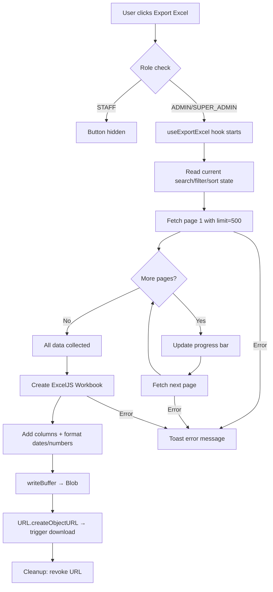
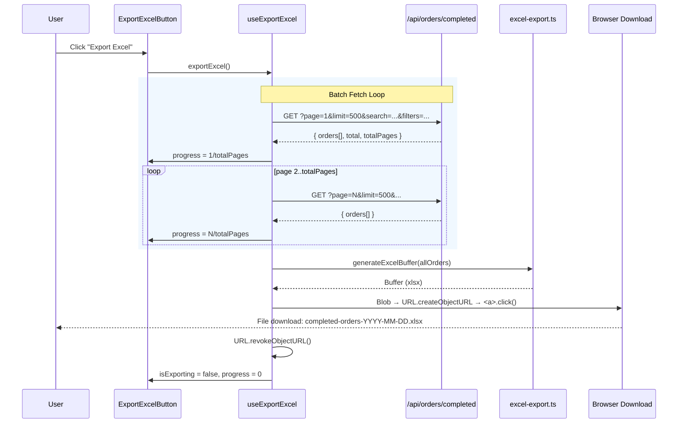

# Analysis & Solution Design — Export Completed Orders to Excel

<!-- Template Version: 1.0 | Contract: v1.0 | Last Updated: 2026-02-11 -->

---

## TL;DR

| Aspect           | Value                                     |
| ---------------- | ----------------------------------------- |
| Feature          | US-2.1.2 Export Completed Orders to Excel |
| Status           | In Review                                 |
| Affected Roots   | `sgs-cs-helper`                           |
| Complexity       | Medium                                    |
| Estimated Effort | 1–2 days                                  |

---

## 1. Problem Statement

### Current Behavior

🇻🇳 Tab Completed Orders hiện cho phép xem, tìm kiếm, lọc và sắp xếp đơn hàng đã hoàn thành qua giao diện web. Tuy nhiên không có cách nào xuất dữ liệu này ra file để báo cáo, lưu trữ hay phân tích offline.

🇬🇧 The Completed Orders tab currently allows viewing, searching, filtering and sorting completed orders via the web UI. However, there is no way to export this data to a file for reporting, archiving, or offline analysis.

### Desired Behavior

🇻🇳 Admin và Super Admin có thể nhấn nút "Export Excel" trên tab Completed Orders. Hệ thống fetch tất cả đơn hàng phù hợp (theo search/filter hiện tại) theo batch, tạo file `.xlsx` ở client bằng ExcelJS, và trigger download trên trình duyệt. Thanh tiến trình hiển thị trong quá trình fetch batch.

🇬🇧 Admin and Super Admin users can click an "Export Excel" button on the Completed Orders tab. The system fetches all matching orders (respecting current search/filter) in batches, builds an `.xlsx` file client-side using ExcelJS, and triggers a browser download. A progress indicator shows during batch fetching.

### Gap Analysis

🇻🇳 Chức năng xuất dữ liệu hoàn toàn chưa tồn tại. Cần thêm: (1) nút Export với kiểm tra quyền, (2) logic batch-fetch tất cả dữ liệu qua API hiện có, (3) tạo file Excel phía client, (4) kích hoạt download, (5) hiển thị tiến trình.

🇬🇧 Export functionality does not exist at all. Need to add: (1) Export button with role check, (2) batch-fetch logic to collect all data via existing API, (3) client-side Excel file generation, (4) trigger browser download, (5) progress indicator.

---

## 2. Clarifying Questions

| #   | Question                                | Answer                                                                                                                       | Status      |
| --- | --------------------------------------- | ---------------------------------------------------------------------------------------------------------------------------- | ----------- |
| 1   | Which library for Excel generation?     | ExcelJS — MIT, 4.4M weekly downloads, built-in TypeScript, browser `writeBuffer()`                                           | ✅ Resolved |
| 2   | Server-side or client-side generation?  | Client-side — avoids server memory pressure, simpler deployment                                                              | ✅ Resolved |
| 3   | Which roles can export?                 | Admin and Super Admin only                                                                                                   | ✅ Resolved |
| 4   | Export from which tab?                  | Completed Orders only                                                                                                        | ✅ Resolved |
| 5   | Should export respect current filters?  | Yes — search, registeredBy, date range, sort                                                                                 | ✅ Resolved |
| 6   | Which columns in the Excel?             | Job Number, Registered Date, Registered By, Received Date, Required Date, Priority, Sample Count, Completed At, Completed By | ✅ Resolved |
| 7   | Is Sonner `<Toaster>` mounted globally? | No — needs to be added to root layout or orders layout for error toasts                                                      | ✅ Resolved |

---

## 3. Assumptions & Constraints

### Assumptions

🇻🇳

- ExcelJS hoạt động tốt trên browser cho ~10,000 đơn hàng
- API hiện tại xử lý được page size 500 mỗi batch cho export
- Dữ liệu `completedBy` (tên, email) nên bao gồm trong Excel
- File được đặt tên `completed-orders-YYYY-MM-DD.xlsx`
- `xlsx` package (devDependency hiện có) **không** được dùng — dùng `exceljs` thay thế

🇬🇧

- ExcelJS works well in browser for up to ~10,000 orders
- Existing API handles page size 500 per batch for export
- `completedBy` relation data (name, email) should be included in Excel
- File named `completed-orders-YYYY-MM-DD.xlsx`
- Existing `xlsx` devDependency is **not** used — `exceljs` is used instead

### Constraints

🇻🇳

- Phải tạo Excel hoàn toàn ở client — KHÔNG phải server-side
- Chỉ Admin và Super Admin mới thấy/dùng được nút Export
- Phải hiển thị tiến trình khi đang fetch batch
- Nút Export bị vô hiệu khi đang export

🇬🇧

- Must generate Excel entirely client-side — NOT server-side
- Only Admin and Super Admin can see/use the Export button
- Must show progress indicator during batch fetching
- Export button disabled while export is in progress

---

## 4. Existing Patterns Found

| Location                                           | Pattern                                                             | Reusable                                                   |
| -------------------------------------------------- | ------------------------------------------------------------------- | ---------------------------------------------------------- |
| `src/hooks/use-completed-orders.ts`                | Paginated API fetch with abort controller, filter/search/sort state | Partial — reuse filter state reading, API URL construction |
| `src/app/api/orders/completed/route.ts`            | Paginated API with `page`, `limit`, search, filter, sort params     | Yes — use as-is with larger page size                      |
| `src/lib/upload/batch-upload.ts`                   | `chunkArray()` utility, batch progress callback pattern             | Partial — progress callback pattern applicable             |
| `src/components/orders/completed-orders.tsx`       | Container component wiring hook + controls + table                  | Yes — export button integrates here                        |
| `src/components/ui/button.tsx`                     | shadcn Button with variants, disabled state                         | Yes                                                        |
| `src/components/ui/progress.tsx`                   | Radix Progress bar                                                  | Yes — for export progress display                          |
| `src/components/dashboard/dashboard-filters.tsx`   | Sonner `toast` for error messages                                   | Yes — same pattern for export errors                       |
| `src/components/orders/completed-orders-table.tsx` | `formatDate()` using `Intl.DateTimeFormat` vi-VN                    | Partial — reuse pattern for Excel date formatting          |

---

## 5. Solution Options

### Option A: Client-side Batch Fetch + ExcelJS ⭐

🇻🇳 Client fetch tất cả dữ liệu theo batch qua API phân trang hiện có (500/batch), hiển thị tiến trình, rồi tạo file Excel bằng ExcelJS `writeBuffer()` trên browser. Trigger download bằng `Blob` + `URL.createObjectURL()`.

🇬🇧 Client fetches all data in batches via existing paginated API (500/batch), shows progress, then builds Excel using ExcelJS `writeBuffer()` in browser. Triggers download via `Blob` + `URL.createObjectURL()`.

**Pros:** No server changes needed for generation, no server memory pressure, simple deployment, ExcelJS has MIT license + built-in TypeScript.

**Cons:** Large datasets (>10K) may be slow on weak clients.

### Option B: Server-side API Route with Streaming

🇻🇳 Tạo API route mới trên server để query tất cả dữ liệu và trả về stream Excel file.

🇬🇧 Create a new server API route to query all data and return a streamed Excel file.

**Pros:** Faster for large datasets, no client memory concern.

**Cons:** Server memory pressure, more complex deployment, needs new API route, server-side ExcelJS configuration needed.

### Option C: Server Action with File Response

🇻🇳 Dùng Next.js Server Action để tạo file Excel rồi trả về client.

🇬🇧 Use Next.js Server Action to generate the Excel file and return to client.

**Pros:** Co-located with app logic.

**Cons:** Server Actions aren't designed for large binary responses, 4.5MB body limit in some deployments.

### Comparison Matrix

| Aspect          | Option A (Client ExcelJS)    | Option B (Server Stream) | Option C (Server Action) |
| --------------- | ---------------------------- | ------------------------ | ------------------------ |
| Description     | Client batch fetch + ExcelJS | Server query + stream    | Server Action + return   |
| Effort          | Low                          | High                     | Medium                   |
| Risk            | Low                          | Medium                   | Medium                   |
| Maintainability | High                         | Medium                   | Low                      |
| Server Load     | Low (only API queries)       | High (generation)        | High (generation)        |

### Chosen Solution

**Decision:** `Option A — Client-side Batch Fetch + ExcelJS`

🇻🇳 Option A được chọn vì: (1) không cần thay đổi server/API — tái sử dụng API phân trang hiện có, (2) không tạo áp lực bộ nhớ server, (3) effort thấp nhất, (4) ExcelJS có hỗ trợ browser tốt với `writeBuffer()`, (5) phù hợp cho quy mô dữ liệu hiện tại (~vài nghìn đơn).

🇬🇧 Option A is chosen because: (1) no server/API changes needed — reuses existing paginated API, (2) no server memory pressure, (3) lowest effort, (4) ExcelJS has excellent browser support with `writeBuffer()`, (5) suitable for current data scale (~few thousand orders).

---

## 6. Solution Overview

🇻🇳 Giải pháp thêm nút "Export Excel" vào tab Completed Orders (chỉ Admin/Super Admin). Khi nhấn, hook `useExportExcel` thực hiện: (1) đọc trạng thái search/filter/sort hiện tại từ `useCompletedOrders`, (2) fetch tất cả dữ liệu theo batch 500 qua `GET /api/orders/completed?page=N&limit=500`, (3) cập nhật tiến trình sau mỗi batch, (4) khi có đủ dữ liệu, tạo workbook ExcelJS với cột được định dạng, (5) gọi `writeBuffer()` → `Blob` → `URL.createObjectURL()` → trigger download `<a>` ẩn. Xử lý lỗi bằng Sonner toast.

🇬🇧 The solution adds an "Export Excel" button to the Completed Orders tab (Admin/Super Admin only). When clicked, the `useExportExcel` hook: (1) reads current search/filter/sort state from `useCompletedOrders`, (2) fetches all data in batches of 500 via `GET /api/orders/completed?page=N&limit=500`, (3) updates progress after each batch, (4) once all data collected, creates an ExcelJS workbook with formatted columns, (5) calls `writeBuffer()` → `Blob` → `URL.createObjectURL()` → triggers download via hidden `<a>` element. Errors handled via Sonner toast.

### Architecture Diagram

---

## 7. Components

| Component              | Root            | Type   | Description                                                |
| ---------------------- | --------------- | ------ | ---------------------------------------------------------- |
| `useExportExcel`       | `sgs-cs-helper` | New    | Hook: batch fetch + ExcelJS generation + download trigger  |
| `ExportExcelButton`    | `sgs-cs-helper` | New    | UI button with progress indicator                          |
| `excel-export.ts`      | `sgs-cs-helper` | New    | Utility: ExcelJS workbook creation with column definitions |
| `completed-orders.tsx` | `sgs-cs-helper` | Modify | Add ExportExcelButton to controls area                     |
| `page.tsx` (orders)    | `sgs-cs-helper` | Modify | Pass `canExport` prop to CompletedOrders                   |
| Root `layout.tsx`      | `sgs-cs-helper` | Modify | Add Sonner `<Toaster />` for toast notifications           |

### Component Details

#### `useExportExcel` hook

🇻🇳 Hook quản lý toàn bộ luồng export: nhận params filter/search/sort từ ngoài, fetch batch dữ liệu với progress tracking, gọi utility tạo Excel, và trigger download. Trả về `{ exportExcel, isExporting, progress }`.

🇬🇧 Hook managing the entire export flow: receives filter/search/sort params from outside, batch-fetches data with progress tracking, calls Excel generation utility, and triggers download. Returns `{ exportExcel, isExporting, progress }`.

| Aspect       | Detail                                                                   |
| ------------ | ------------------------------------------------------------------------ |
| Root         | `sgs-cs-helper`                                                          |
| Location     | `src/hooks/use-export-excel.ts`                                          |
| Inputs       | `search`, `registeredBy[]`, `dateFrom`, `dateTo`, `sortField`, `sortDir` |
| Outputs      | `{ exportExcel: () => void, isExporting: boolean, progress: number }`    |
| Dependencies | `fetch`, ExcelJS (dynamic import), Sonner `toast`                        |

#### `ExportExcelButton` component

🇻🇳 Nút "Export Excel" với icon Download. Hiển thị thanh tiến trình bên dưới khi đang export. Bị vô hiệu khi `isExporting === true`. Chỉ render khi `canExport === true`.

🇬🇧 "Export Excel" button with Download icon. Shows progress bar underneath when exporting. Disabled when `isExporting === true`. Only renders when `canExport === true`.

| Aspect       | Detail                                                                                 |
| ------------ | -------------------------------------------------------------------------------------- |
| Root         | `sgs-cs-helper`                                                                        |
| Location     | `src/components/orders/export-excel-button.tsx`                                        |
| Inputs       | `canExport`, `search`, `registeredBy[]`, `dateFrom`, `dateTo`, `sortField`, `sortDir`  |
| Outputs      | Rendered button with optional progress bar                                             |
| Dependencies | `useExportExcel`, `Button` (shadcn), `Progress` (shadcn), `lucide-react` Download icon |

#### `excel-export.ts` utility

🇻🇳 Utility tạo ExcelJS workbook từ mảng completed orders. Định nghĩa cột, format ngày bằng `Intl.DateTimeFormat` vi-VN, và trả về `Buffer` qua `writeBuffer()`.

🇬🇧 Utility creating an ExcelJS workbook from an array of completed orders. Defines columns, formats dates with `Intl.DateTimeFormat` vi-VN, and returns `Buffer` via `writeBuffer()`.

| Aspect       | Detail                                        |
| ------------ | --------------------------------------------- |
| Root         | `sgs-cs-helper`                               |
| Location     | `src/lib/excel/export.ts`                     |
| Inputs       | `CompletedOrder[]`                            |
| Outputs      | `Buffer` (from `workbook.xlsx.writeBuffer()`) |
| Dependencies | `exceljs`                                     |

---

## 8. Data Flow

| Step | Action                                             | From                   | To                               |
| ---- | -------------------------------------------------- | ---------------------- | -------------------------------- |
| 1    | User clicks "Export Excel"                         | UI (ExportExcelButton) | useExportExcel hook              |
| 2    | Hook reads current filter/search/sort              | CompletedOrders state  | useExportExcel                   |
| 3    | Hook fetches page 1 (limit=500)                    | useExportExcel         | GET /api/orders/completed        |
| 4    | API returns page data + totalPages                 | API                    | useExportExcel                   |
| 5    | Hook updates progress (page/totalPages)            | useExportExcel         | ExportExcelButton (progress bar) |
| 6    | Hook fetches remaining pages sequentially          | useExportExcel         | API (loop)                       |
| 7    | All data collected → call `generateExcelBuffer()`  | useExportExcel         | excel-export.ts                  |
| 8    | ExcelJS creates workbook + formats columns         | excel-export.ts        | Buffer                           |
| 9    | Hook creates Blob → objectURL → hidden `<a>` click | useExportExcel         | Browser download                 |
| 10   | Cleanup: revoke objectURL                          | useExportExcel         | —                                |

### Sequence Diagram

---

## 9. Cross-Root Impact

| Root               | Change Type | Sync Required    |
| ------------------ | ----------- | ---------------- |
| `sgs-cs-helper`    | Code        | No (single root) |
| `a-z-copilot-flow` | None        | No               |

🇻🇳 Không có tác động xuyên root. Tất cả thay đổi chỉ nằm trong `sgs-cs-helper`.

🇬🇧 No cross-root impact. All changes are within `sgs-cs-helper` only.

---

## 10. Dependencies

| Package        | Version  | Status   | Notes                                                           |
| -------------- | -------- | -------- | --------------------------------------------------------------- |
| `exceljs`      | ^4.4.0   | **New**  | Client-side Excel generation with `writeBuffer()`               |
| `sonner`       | ^2.0.7   | Existing | Toast notifications — already in dependencies                   |
| `lucide-react` | ^0.563.0 | Existing | Download icon for Export button                                 |
| `date-fns`     | ^4.1.0   | Existing | Date formatting for filename `format(new Date(), 'yyyy-MM-dd')` |
| `radix-ui`     | ^1.4.3   | Existing | Progress bar component                                          |

### Note on Sonner `<Toaster />`

🇻🇳 Package `sonner` đã có trong dependencies nhưng `<Toaster />` chưa được mount trong bất kỳ layout nào. Cần thêm `<Toaster />` vào root layout (`src/app/layout.tsx`) để toast hoạt động trên toàn ứng dụng.

🇬🇧 The `sonner` package is already a dependency but `<Toaster />` is not mounted in any layout. Need to add `<Toaster />` to the root layout (`src/app/layout.tsx`) so toasts work app-wide.

---

## 11. Risks & Mitigations

| Risk                                       | Likelihood | Impact | Mitigation                                                                  |
| ------------------------------------------ | ---------- | ------ | --------------------------------------------------------------------------- |
| Large dataset (>10K orders) slows client   | Low        | Medium | Batch fetch with progress + dynamic import ExcelJS to reduce initial bundle |
| API timeout on large page size             | Low        | Medium | Use 500/batch (not too large), sequential fetch with abort support          |
| ExcelJS bundle size increases initial load | Low        | Low    | Dynamic `import("exceljs")` — loaded only when export triggered             |
| Mid-export network failure                 | Medium     | Low    | Try-catch per batch, toast error with order count exported so far           |
| Browser memory for very large exports      | Low        | Medium | Documented assumption: up to ~10K orders is acceptable                      |

### Risk Details

#### Risk 1: ExcelJS Bundle Size

🇻🇳 ExcelJS là thư viện khá lớn (~500KB minified). Sử dụng dynamic import `const ExcelJS = await import("exceljs")` đảm bảo nó chỉ được load khi user thực sự nhấn Export, không ảnh hưởng initial page load.

🇬🇧 ExcelJS is a fairly large library (~500KB minified). Using dynamic import `const ExcelJS = await import("exceljs")` ensures it's only loaded when the user actually clicks Export, not affecting initial page load.

---

## 12. Decision Log

| ID  | Date       | Decision                              | Rationale                                                                                                                               |
| --- | ---------- | ------------------------------------- | --------------------------------------------------------------------------------------------------------------------------------------- |
| D1  | 2026-02-11 | ExcelJS over SheetJS                  | ExcelJS is actively maintained (1yr vs 4yr since last release), MIT license, built-in TypeScript types, browser `writeBuffer()` support |
| D2  | 2026-02-11 | Client-side generation                | Avoids server memory pressure, reuses existing paginated API, simpler deployment                                                        |
| D3  | 2026-02-11 | Batch size 500 per page               | Balance between number of API calls and per-request payload; existing API already supports `limit` param                                |
| D4  | 2026-02-11 | Dynamic import for ExcelJS            | Prevents ~500KB from being included in initial bundle; only loaded on export                                                            |
| D5  | 2026-02-11 | Add `<Toaster />` to root layout      | Sonner package exists but Toaster not mounted — needed for error notifications                                                          |
| D6  | 2026-02-11 | Sequential batch fetch (not parallel) | Avoids overwhelming server, allows clean progress tracking, easier abort handling                                                       |

---

## 13. Notes & Concerns

🇻🇳

- `xlsx` package có trong devDependencies (dùng cho scripts/read-excel.js) — KHÔNG dùng cho export. Dùng `exceljs` thay thế
- Sonner `<Toaster />` chưa được mount — cần thêm vào layout trước khi toast error hoạt động
- Existing `CompletedOrder` interface trong `use-completed-orders.ts` có thể tái sử dụng trực tiếp cho export utility
- `date-fns` `format()` dùng cho tên file; `Intl.DateTimeFormat` vi-VN cho nội dung cột ngày trong Excel (nhất quán với bảng hiện tại)

🇬🇧

- `xlsx` package in devDependencies (used by scripts/read-excel.js) — NOT used for export. Using `exceljs` instead
- Sonner `<Toaster />` not mounted — need to add to layout before error toasts work
- Existing `CompletedOrder` interface in `use-completed-orders.ts` can be directly reused for export utility
- `date-fns` `format()` for filename; `Intl.DateTimeFormat` vi-VN for date column content in Excel (consistent with current table)

---

## Approval

| Role     | Name    | Status     | Date       |
| -------- | ------- | ---------- | ---------- |
| Author   | Copilot | ✅ Done    | 2026-02-11 |
| Reviewer | User    | ⏳ Pending | —          |

---

## Next Step

🇻🇳 Sau khi phê duyệt, tiến hành **Phase 1: Specification**.

🇬🇧 After approval, proceed to **Phase 1: Specification**.

Reply: `approved` or `revise: <feedback>`
