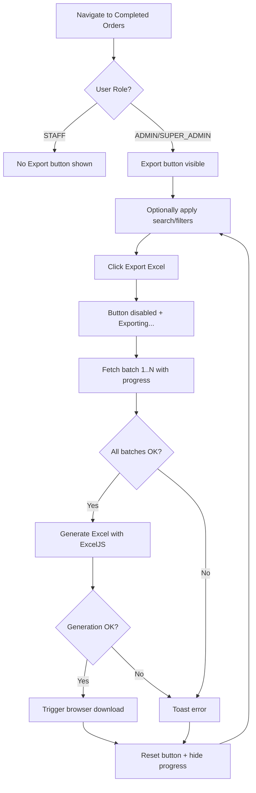

# Specification — Export Completed Orders to Excel

<!-- Template Version: 1.0 | Contract: v1.0 | Last Updated: 2026-02-11 -->

---

## TL;DR

| Aspect                      | Value                                                   |
| --------------------------- | ------------------------------------------------------- |
| Feature                     | US-2.1.2 Export Completed Orders to Excel               |
| Status                      | In Review                                               |
| Phase 0 Analysis            | [solution-design.md](../00_analysis/solution-design.md) |
| Functional Requirements     | 7                                                       |
| Non-Functional Requirements | 4                                                       |
| Affected Roots              | `sgs-cs-helper`                                         |

---

## 1. Overview

🇻🇳 Tính năng cho phép Admin và Super Admin xuất danh sách đơn hàng đã hoàn thành ra file Excel (`.xlsx`). Dữ liệu được fetch theo batch từ API phân trang hiện có, tạo file Excel ở phía client bằng ExcelJS, và trigger download trên trình duyệt. Hỗ trợ giữ nguyên trạng thái search/filter/sort hiện tại khi xuất.

🇬🇧 This feature allows Admin and Super Admin users to export completed orders to an Excel file (`.xlsx`). Data is batch-fetched from the existing paginated API, the Excel file is generated client-side using ExcelJS, and a browser download is triggered. The current search/filter/sort state is respected during export.

---

## 2. Goals & Non-Goals

### Goals

🇻🇳

1. **Xuất dữ liệu:** Cho phép export danh sách completed orders ra file `.xlsx`
2. **Kiểm soát quyền:** Chỉ Admin và Super Admin mới thấy/sử dụng được nút export
3. **Trải nghiệm người dùng:** Hiển thị tiến trình export, disable nút khi đang xử lý
4. **Tôn trọng bộ lọc:** Export đúng theo search/filter/sort hiện tại trên UI

🇬🇧

1. **Data export:** Allow exporting completed orders to `.xlsx` file
2. **Access control:** Only Admin and Super Admin can see/use the export button
3. **User experience:** Show export progress, disable button during processing
4. **Respect filters:** Export matches current search/filter/sort state on UI

### Non-Goals

🇻🇳

1. Không tạo Excel phía server (server-side generation)
2. Không export từ tab In-Progress
3. Không cho phép STAFF export
4. Không export báo cáo tổng hợp hiệu suất
5. Không hỗ trợ CSV format
6. Không styling phức tạp cho Excel (colors, borders, logos)

🇬🇧

1. No server-side Excel generation
2. No export from In-Progress tab
3. No export access for STAFF role
4. No performance summary report export
5. No CSV format support
6. No complex Excel styling (colors, borders, logos)

---

## 3. User Stories

### US-001: Export Completed Orders

🇻🇳 Là **Admin/Super Admin**, tôi muốn **nhấn nút Export Excel trên tab Completed Orders**, để **tải về file `.xlsx` chứa tất cả đơn hàng đã hoàn thành phù hợp với bộ lọc hiện tại**.

🇬🇧 As an **Admin/Super Admin**, I want to **click an Export Excel button on the Completed Orders tab**, so that **I can download an `.xlsx` file containing all completed orders matching current filters**.

### US-002: See Export Progress

🇻🇳 Là **Admin/Super Admin**, tôi muốn **thấy thanh tiến trình khi đang export**, để **biết hệ thống đang xử lý và chờ đến khi hoàn thành**.

🇬🇧 As an **Admin/Super Admin**, I want to **see a progress bar during export**, so that **I know the system is processing and can wait for completion**.

### US-003: Role-Based Visibility

🇻🇳 Là **STAFF**, tôi **không nên thấy nút Export Excel**, để **giao diện không bị rối với chức năng không dành cho tôi**.

🇬🇧 As a **STAFF** user, I **should not see the Export Excel button**, so that **the interface is not cluttered with functions not meant for me**.

---

## 4. Requirements Matrix

| ID      | Title                               | Priority | Type          | Covered By     |
| ------- | ----------------------------------- | -------- | ------------- | -------------- |
| FR-001  | Role-based Export button visibility | Must     | Functional    | AC-001         |
| FR-002  | Batch data fetching                 | Must     | Functional    | AC-002         |
| FR-003  | Client-side Excel generation        | Must     | Functional    | AC-003, AC-004 |
| FR-004  | Browser download trigger            | Must     | Functional    | AC-005         |
| FR-005  | Progress indicator                  | Must     | Functional    | AC-006, AC-007 |
| FR-006  | Error handling with toast           | Must     | Functional    | AC-008, AC-009 |
| FR-007  | Sonner Toaster mount                | Must     | Functional    | AC-010         |
| NFR-001 | Export performance                  | Should   | Performance   | —              |
| NFR-002 | Bundle size                         | Should   | Performance   | —              |
| NFR-003 | Browser compatibility               | Must     | Compatibility | —              |
| NFR-004 | Accessibility                       | Should   | Accessibility | —              |

---

## 5. Functional Requirements

### FR-001: Role-Based Export Button Visibility

| Aspect         | Detail          |
| -------------- | --------------- |
| Priority       | Must            |
| Affected Roots | `sgs-cs-helper` |

#### Description

🇻🇳 Nút "Export Excel" chỉ hiển thị cho người dùng có role `ADMIN` hoặc `SUPER_ADMIN`. Kiểm tra quyền được thực hiện ở Server Component (`page.tsx`) và truyền prop `canExport` xuống `CompletedOrders` container. STAFF users không thấy nút này.

🇬🇧 The "Export Excel" button is only visible to users with role `ADMIN` or `SUPER_ADMIN`. Permission check happens in the Server Component (`page.tsx`) and passes a `canExport` prop down to the `CompletedOrders` container. STAFF users do not see this button.

#### Acceptance Criteria

- [ ] AC-001a: Export button renders only when `canExport === true` (ADMIN or SUPER_ADMIN)
- [ ] AC-001b: STAFF users see no export button in the Completed Orders tab
- [ ] AC-001c: Permission derived from `session.user.role` in server component, passed as prop

---

### FR-002: Batch Data Fetching

| Aspect         | Detail          |
| -------------- | --------------- |
| Priority       | Must            |
| Affected Roots | `sgs-cs-helper` |

#### Description

🇻🇳 Khi nhấn Export, hook `useExportExcel` fetch tất cả completed orders phù hợp bằng cách gọi `GET /api/orders/completed` lặp lại với `limit=500` cho mỗi trang. Fetch tuần tự (page 1, 2, 3...) cho đến khi `page >= totalPages`. Các params `search`, `registeredBy`, `dateFrom`, `dateTo`, `sortField`, `sortDir` hiện tại được truyền vào mỗi request.

🇬🇧 When Export is clicked, the `useExportExcel` hook fetches all matching completed orders by calling `GET /api/orders/completed` repeatedly with `limit=500` per page. Fetches sequentially (page 1, 2, 3...) until `page >= totalPages`. Current `search`, `registeredBy`, `dateFrom`, `dateTo`, `sortField`, `sortDir` params are passed on each request.

#### Acceptance Criteria

- [ ] AC-002a: Hook fetches all pages with `limit=500` using existing API
- [ ] AC-002b: Current search/filter/sort state is respected in every batch request
- [ ] AC-002c: All fetched orders are accumulated into a single array
- [ ] AC-002d: Fetch stops when `page >= totalPages`

---

### FR-003: Client-Side Excel Generation

| Aspect         | Detail          |
| -------------- | --------------- |
| Priority       | Must            |
| Affected Roots | `sgs-cs-helper` |

#### Description

🇻🇳 Sau khi có đủ dữ liệu, utility `generateExcelBuffer()` tạo workbook ExcelJS với một worksheet chứa các cột: Job Number, Registered Date, Registered By, Received Date, Required Date, Priority, Sample Count, Completed At, Completed By (name). Ngày được format bằng `Intl.DateTimeFormat` vi-VN (DD/MM/YYYY HH:mm). ExcelJS được dynamic import để tránh ảnh hưởng bundle.

🇬🇧 After all data is collected, the `generateExcelBuffer()` utility creates an ExcelJS workbook with a single worksheet containing columns: Job Number, Registered Date, Registered By, Received Date, Required Date, Priority, Sample Count, Completed At, Completed By (name). Dates formatted with `Intl.DateTimeFormat` vi-VN (DD/MM/YYYY HH:mm). ExcelJS is dynamically imported to avoid bundle impact.

#### Excel Column Definition

| #   | Header          | Source Field       | Format                                 |
| --- | --------------- | ------------------ | -------------------------------------- |
| 1   | Job Number      | `jobNumber`        | String                                 |
| 2   | Registered Date | `registeredDate`   | DD/MM/YYYY HH:mm (vi-VN)               |
| 3   | Registered By   | `registeredBy`     | String (null → empty)                  |
| 4   | Received Date   | `receivedDate`     | DD/MM/YYYY HH:mm (vi-VN)               |
| 5   | Required Date   | `requiredDate`     | DD/MM/YYYY HH:mm (vi-VN)               |
| 6   | Priority        | `priority`         | Number                                 |
| 7   | Sample Count    | `sampleCount`      | Number                                 |
| 8   | Completed At    | `completedAt`      | DD/MM/YYYY HH:mm (vi-VN, null → empty) |
| 9   | Completed By    | `completedBy.name` | String (null → empty)                  |

#### Acceptance Criteria

- [ ] AC-003a: Excel workbook has exactly the 9 columns listed above with correct headers
- [ ] AC-003b: All dates formatted as DD/MM/YYYY HH:mm in Asia/Ho_Chi_Minh timezone
- [ ] AC-003c: Null values render as empty cells (not "null" string)
- [ ] AC-004a: ExcelJS is dynamically imported (`await import("exceljs")`)
- [ ] AC-004b: Generated buffer produces a valid `.xlsx` file openable in Excel/Google Sheets

---

### FR-004: Browser Download Trigger

| Aspect         | Detail          |
| -------------- | --------------- |
| Priority       | Must            |
| Affected Roots | `sgs-cs-helper` |

#### Description

🇻🇳 Sau khi tạo buffer xong, hook tạo `Blob` với MIME type `application/vnd.openxmlformats-officedocument.spreadsheetml.sheet`, tạo object URL, gắn vào element `<a>` ẩn với attribute `download`, trigger click, và cleanup URL bằng `URL.revokeObjectURL()`. Tên file theo format `completed-orders-YYYY-MM-DD.xlsx` (ngày hiện tại).

🇬🇧 After buffer creation, the hook creates a `Blob` with MIME type `application/vnd.openxmlformats-officedocument.spreadsheetml.sheet`, creates an object URL, attaches it to a hidden `<a>` element with `download` attribute, triggers a click, and cleans up with `URL.revokeObjectURL()`. Filename follows `completed-orders-YYYY-MM-DD.xlsx` (current date).

#### Acceptance Criteria

- [ ] AC-005a: Download triggers automatically after Excel generation completes
- [ ] AC-005b: Filename is `completed-orders-YYYY-MM-DD.xlsx` using current date
- [ ] AC-005c: Object URL is revoked after download trigger (no memory leak)

---

### FR-005: Progress Indicator

| Aspect         | Detail          |
| -------------- | --------------- |
| Priority       | Must            |
| Affected Roots | `sgs-cs-helper` |

#### Description

🇻🇳 Trong quá trình batch fetch, ExportExcelButton hiển thị thanh tiến trình (Progress component) bên dưới nút. Tiến trình = `(currentPage / totalPages) * 100`. Nút bị disabled và text đổi thành "Exporting..." khi đang xử lý.

🇬🇧 During batch fetching, the ExportExcelButton shows a progress bar (Progress component) below the button. Progress = `(currentPage / totalPages) * 100`. Button is disabled and text changes to "Exporting..." while processing.

#### Acceptance Criteria

- [ ] AC-006a: Progress bar visible during export, hidden when idle
- [ ] AC-006b: Progress percentage reflects `currentPage / totalPages`
- [ ] AC-007a: Export button disabled while `isExporting === true`
- [ ] AC-007b: Button text changes to "Exporting..." during export

---

### FR-006: Error Handling

| Aspect         | Detail          |
| -------------- | --------------- |
| Priority       | Must            |
| Affected Roots | `sgs-cs-helper` |

#### Description

🇻🇳 Nếu bất kỳ batch fetch nào thất bại (network error, API error), hook dừng export, reset trạng thái, và hiển thị toast error bằng Sonner. Nếu ExcelJS generation thất bại, cũng hiển thị toast error. Toast hiển thị thông điệp rõ ràng bằng tiếng Anh.

🇬🇧 If any batch fetch fails (network error, API error), the hook stops the export, resets state, and shows an error toast via Sonner. If ExcelJS generation fails, also show an error toast. Toast displays a clear message in English.

#### Acceptance Criteria

- [ ] AC-008a: Network error during fetch → toast "Export failed. Please try again."
- [ ] AC-008b: ExcelJS generation error → toast "Failed to generate Excel file."
- [ ] AC-009a: After error, `isExporting` resets to `false` and progress resets to 0
- [ ] AC-009b: User can retry export after error

---

### FR-007: Sonner Toaster Mount

| Aspect         | Detail          |
| -------------- | --------------- |
| Priority       | Must            |
| Affected Roots | `sgs-cs-helper` |

#### Description

🇻🇳 Package `sonner` đã có trong dependencies nhưng component `<Toaster />` chưa được mount trong bất kỳ layout nào. Cần thêm `<Toaster />` vào root layout (`src/app/layout.tsx`) để toast hoạt động trên toàn ứng dụng — bao gồm cả toast error cho export và toast hiện có trong `dashboard-filters.tsx`.

🇬🇧 The `sonner` package exists in dependencies but the `<Toaster />` component is not mounted in any layout. Need to add `<Toaster />` to root layout (`src/app/layout.tsx`) so toasts work app-wide — including export error toasts and existing toasts in `dashboard-filters.tsx`.

#### Acceptance Criteria

- [ ] AC-010a: `<Toaster />` from `sonner` is mounted in root layout
- [ ] AC-010b: Toasts are visible from any page (orders, dashboard, etc.)

---

## 6. Non-Functional Requirements

### NFR-001: Export Performance

| Aspect   | Detail                                             |
| -------- | -------------------------------------------------- |
| Category | Performance                                        |
| Metric   | Export of 1,000 orders completes within 10 seconds |
| Target   | 95% of export operations                           |

#### Description

🇻🇳 Export 1,000 đơn hàng (2 batches × 500) cần hoàn thành trong 10 giây. Bao gồm thời gian fetch + tạo Excel + trigger download. Đối với 5,000 đơn (10 batches), cho phép tối đa 30 giây.

🇬🇧 Export of 1,000 orders (2 batches × 500) should complete within 10 seconds. Includes fetch time + Excel generation + download trigger. For 5,000 orders (10 batches), allow up to 30 seconds.

---

### NFR-002: Bundle Size Impact

| Aspect   | Detail                                  |
| -------- | --------------------------------------- |
| Category | Performance                             |
| Metric   | Zero impact on initial page load bundle |

#### Description

🇻🇳 ExcelJS (~500KB minified) phải được dynamic import — không ảnh hưởng bundle ban đầu. Library chỉ load khi user thực sự nhấn Export.

🇬🇧 ExcelJS (~500KB minified) must be dynamically imported — zero impact on initial bundle. Library only loads when user actually clicks Export.

---

### NFR-003: Browser Compatibility

| Aspect   | Detail                                                 |
| -------- | ------------------------------------------------------ |
| Category | Compatibility                                          |
| Metric   | Works on Chrome 90+, Firefox 90+, Edge 90+, Safari 15+ |

#### Description

🇻🇳 Export phải hoạt động trên các browser hiện đại. Sử dụng `Blob`, `URL.createObjectURL()`, và dynamic `import()` — tất cả đều được hỗ trợ rộng rãi.

🇬🇧 Export must work on modern browsers. Uses `Blob`, `URL.createObjectURL()`, and dynamic `import()` — all widely supported.

---

### NFR-004: Accessibility

| Aspect   | Detail                                                                        |
| -------- | ----------------------------------------------------------------------------- |
| Category | Accessibility                                                                 |
| Metric   | Button has proper `aria-label`, disabled state communicated to screen readers |

#### Description

🇻🇳 Nút Export cần có `aria-label` mô tả chức năng. Khi disabled, screen reader cần nhận biết. Thanh tiến trình cần có `aria-valuenow`.

🇬🇧 Export button needs descriptive `aria-label`. When disabled, screen readers must detect it. Progress bar needs `aria-valuenow`.

---

## 7. User Flow

| Step | Action                                 | System Response                                                                  | Next Step               |
| ---- | -------------------------------------- | -------------------------------------------------------------------------------- | ----------------------- |
| 1    | User navigates to Completed Orders tab | Show tab with orders, search, filters. If ADMIN/SUPER_ADMIN → show Export button | 2                       |
| 2    | User optionally applies search/filters | Table updates with filtered results                                              | 3                       |
| 3    | User clicks "Export Excel"             | Button disabled, text → "Exporting...", progress bar appears                     | 4                       |
| 4    | System fetches batch 1/N               | Progress bar updates (1/N %)                                                     | 5                       |
| 5    | System fetches remaining batches       | Progress bar updates incrementally                                               | 6                       |
| 6    | All data fetched                       | Progress = 100%, Excel generation starts                                         | 7                       |
| 7    | Excel generated + download triggered   | Browser shows file download. Button re-enabled, progress hidden                  | End                     |
| Alt  | Error during fetch/generation          | Toast error message. Button re-enabled, progress hidden                          | User can retry (Step 3) |

### Flow Diagram



---

## 8. Data Models

### CompletedOrder (Existing — Reused)

```typescript
/** Already defined in src/hooks/use-completed-orders.ts */
interface CompletedOrder {
  id: string;
  jobNumber: string;
  registeredDate: string;
  registeredBy: string | null;
  receivedDate: string;
  requiredDate: string;
  priority: number;
  sampleCount: number;
  status: string;
  completedAt: string | null;
  completedById: string | null;
  completedBy: {
    id: string;
    name: string;
    email: string;
  } | null;
}
```

### ExportExcelParams (New)

```typescript
/** Parameters for the export hook */
interface ExportExcelParams {
  search: string;
  registeredBy: string[];
  dateFrom: string;
  dateTo: string;
  sortField: string;
  sortDir: "asc" | "desc";
}
```

### UseExportExcelReturn (New)

```typescript
/** Return type of useExportExcel hook */
interface UseExportExcelReturn {
  exportExcel: () => void;
  isExporting: boolean;
  progress: number; // 0-100
}
```

---

## 9. API Contracts

### GET /api/orders/completed (Existing — No Changes)

```typescript
// Request (query params)
interface CompletedOrdersRequest {
  page?: number; // default: 1
  limit?: number; // default: 50, export uses 500
  search?: string; // partial match on jobNumber
  registeredBy?: string; // comma-separated names
  dateFrom?: string; // ISO date, requiredDate >= dateFrom
  dateTo?: string; // ISO date, requiredDate <= dateTo
  sortField?: string; // completedAt | registeredDate | requiredDate | completedBy
  sortDir?: string; // asc | desc
}

// Response (200)
interface CompletedOrdersResponse {
  orders: CompletedOrder[];
  total: number;
  page: number;
  totalPages: number;
}
```

> ⚠️ No API changes required. Export uses same endpoint with `limit=500`.

---

## 10. Edge Cases

| ID     | Scenario                          | Expected Behavior                                                   | Priority      |
| ------ | --------------------------------- | ------------------------------------------------------------------- | ------------- |
| EC-001 | No completed orders match filters | Export button still visible; on click → toast "No orders to export" | Must handle   |
| EC-002 | Only 1 page of data (≤500 orders) | Single fetch, progress jumps 0→100, download triggers               | Must handle   |
| EC-003 | User navigates away during export | Abort in-flight requests, reset state                               | Should handle |
| EC-004 | Double-click on Export button     | Button disabled after first click prevents double action            | Must handle   |
| EC-005 | Very large export (>5000 orders)  | Export proceeds with progress; may take 15-30s                      | Must handle   |
| EC-006 | Network disconnects mid-export    | Catch error, toast "Export failed", reset state                     | Must handle   |
| EC-007 | Browser blocks popup/download     | Download via `<a>` element (not `window.open`) — not blocked        | Must handle   |

### EC-001: No Orders to Export

🇻🇳
**Khi:** User nhấn Export nhưng không có completed orders phù hợp (total = 0)
**Thì:** Hiển thị toast info "No orders to export" — không tạo file trống
**Lý do:** Tránh file Excel trống gây nhầm lẫn

🇬🇧
**When:** User clicks Export but no completed orders match (total = 0)
**Then:** Show info toast "No orders to export" — do not generate empty file
**Rationale:** Avoid confusing empty Excel file

### EC-003: Navigation During Export

🇻🇳
**Khi:** User chuyển trang hoặc đổi tab trong khi export đang chạy
**Thì:** Abort tất cả requests đang chờ, reset isExporting và progress
**Lý do:** Tránh orphaned requests và memory leak

🇬🇧
**When:** User navigates away or switches tabs during export
**Then:** Abort all pending requests, reset isExporting and progress
**Rationale:** Prevent orphaned requests and memory leaks

---

## 11. Error Handling

| Error Condition                  | User Message                       | System Action                                   |
| -------------------------------- | ---------------------------------- | ----------------------------------------------- |
| Network error during batch fetch | "Export failed. Please try again." | Abort remaining batches, reset state, log error |
| API returns non-200 status       | "Export failed. Please try again." | Abort remaining batches, reset state, log error |
| ExcelJS dynamic import fails     | "Failed to load export module."    | Reset state, log error                          |
| ExcelJS `writeBuffer()` fails    | "Failed to generate Excel file."   | Reset state, log error                          |
| Zero orders to export            | "No orders to export."             | No file generated, info toast (not error)       |

---

## 12. Cross-Root Impact

| Root               | Changes                     | Sync Required    |
| ------------------ | --------------------------- | ---------------- |
| `sgs-cs-helper`    | New files + modify existing | No (single root) |
| `a-z-copilot-flow` | None                        | No               |

🇻🇳 Không có tác động xuyên root. Tất cả thay đổi chỉ nằm trong `sgs-cs-helper`.

🇬🇧 No cross-root impact. All changes are within `sgs-cs-helper` only.

---

## 13. Dependencies

| Dependency                  | Type    | Status   | Notes                                                    |
| --------------------------- | ------- | -------- | -------------------------------------------------------- |
| `exceljs`                   | Package | **New**  | Client-side Excel generation via `writeBuffer()`         |
| `sonner`                    | Package | Existing | Toast notifications — mount `<Toaster />` in root layout |
| `lucide-react`              | Package | Existing | `Download` icon for export button                        |
| `date-fns`                  | Package | Existing | `format(new Date(), "yyyy-MM-dd")` for filename          |
| `GET /api/orders/completed` | API     | Existing | Paginated API — no changes needed                        |

---

## 14. Risks & Assumptions

### Risks

| Risk                            | Impact | Mitigation                                                  |
| ------------------------------- | ------ | ----------------------------------------------------------- |
| ExcelJS ~500KB bundle           | Low    | Dynamic import — loaded only on export click                |
| Client memory for >10K orders   | Medium | Documented scale assumption; server-side can be added later |
| API timeout for large page size | Low    | Use limit=500 (proven safe); sequential with abort          |
| Mid-export network failure      | Low    | Try-catch per batch, toast error, allow retry               |

### Assumptions

| #   | Assumption                                                            | Validated                        |
| --- | --------------------------------------------------------------------- | -------------------------------- |
| 1   | ExcelJS browser `writeBuffer()` works for ~10K rows                   | Pending (verify during impl)     |
| 2   | Existing API handles `limit=500` without timeout                      | Pending (verify during impl)     |
| 3   | `completedBy` relation always populated for completed orders          | Yes (enforced in mark-done flow) |
| 4   | Filename pattern `completed-orders-YYYY-MM-DD.xlsx` is acceptable     | Yes (user confirmed)             |
| 5   | Sonner `<Toaster />` can be added to root layout without side effects | Yes (standard Next.js pattern)   |

---

## 15. Open Questions

| #   | Question                          | Status      | Answer |
| --- | --------------------------------- | ----------- | ------ |
| —   | All questions resolved in Phase 0 | ✅ Resolved | —      |

---

## 16. Notes

🇻🇳

- `xlsx` package trong devDependencies (dùng cho `scripts/read-excel.js`) — KHÔNG dùng cho export, dùng `exceljs`
- Existing `CompletedOrder` interface tái sử dụng trực tiếp — không cần type mới cho data
- `formatDate()` pattern trong `completed-orders-table.tsx` dùng `Intl.DateTimeFormat` vi-VN — sẽ tái sử dụng pattern tương tự cho Excel dates
- Sonner `toast()` đã được dùng trong `dashboard-filters.tsx` — mount `<Toaster />` sẽ kích hoạt cả toast cũ và mới

🇬🇧

- `xlsx` package in devDependencies (used by `scripts/read-excel.js`) — NOT used for export, using `exceljs`
- Existing `CompletedOrder` interface reused directly — no new data type needed
- `formatDate()` pattern in `completed-orders-table.tsx` uses `Intl.DateTimeFormat` vi-VN — will reuse same pattern for Excel dates
- Sonner `toast()` already called in `dashboard-filters.tsx` — mounting `<Toaster />` will activate both existing and new toasts

---

## Approval

| Role     | Name    | Status     | Date       |
| -------- | ------- | ---------- | ---------- |
| Author   | Copilot | ✅ Done    | 2026-02-11 |
| Reviewer | User    | ⏳ Pending | —          |

---

## Next Step

🇻🇳 Sau khi phê duyệt, tiến hành **Phase 2: Task Planning**.

🇬🇧 After approval, proceed to **Phase 2: Task Planning**.

Reply: `approved` or `revise: <feedback>`
