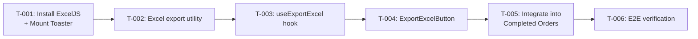

# Task Plan — Export Completed Orders to Excel

# Kế hoạch Task — Xuất Đơn Hàng Đã Hoàn Thành ra Excel

<!-- Template Version: 1.0 | Contract: v1.0 | Last Updated: 2026-02-11 -->

---

## TL;DR

| Aspect           | Value                                     |
| ---------------- | ----------------------------------------- |
| Feature          | US-2.1.2 Export Completed Orders to Excel |
| Total Tasks      | 6                                         |
| Estimated Effort | ~5.5 hours                                |
| Affected Roots   | `sgs-cs-helper`                           |
| Dev Mode         | Standard                                  |
| Spec Reference   | [spec.md](../01_spec/spec.md)             |

---

## 1. Goal

🇻🇳 Khi tất cả task hoàn thành, Admin/Super Admin có thể nhấn nút "Export Excel" trên tab Completed Orders để tải về file `.xlsx` chứa tất cả đơn hàng phù hợp với bộ lọc hiện tại. Thanh tiến trình hiển thị trong quá trình fetch, lỗi được thông báo qua toast Sonner. STAFF không thấy nút export.

🇬🇧 When all tasks are complete, Admin/Super Admin users can click "Export Excel" on the Completed Orders tab to download an `.xlsx` file containing all orders matching current filters. A progress bar shows during fetch, errors are reported via Sonner toast. STAFF users do not see the export button.

---

## 2. Task Overview

| ID    | Title                                   | Root            | Type   | Est. | Deps  | Status |
| ----- | --------------------------------------- | --------------- | ------ | ---- | ----- | ------ |
| T-001 | Install ExcelJS + Mount Sonner Toaster  | `sgs-cs-helper` | Modify | 30m  | -     | ⏳     |
| T-002 | Create Excel export utility             | `sgs-cs-helper` | New    | 1h   | T-001 | ⏳     |
| T-003 | Create `useExportExcel` hook            | `sgs-cs-helper` | New    | 1.5h | T-002 | ⏳     |
| T-004 | Create `ExportExcelButton` component    | `sgs-cs-helper` | New    | 1h   | T-003 | ⏳     |
| T-005 | Integrate export into Completed Orders  | `sgs-cs-helper` | Modify | 1h   | T-004 | ⏳     |
| T-006 | E2E verification & edge case validation | `sgs-cs-helper` | Verify | 30m  | T-005 | ⏳     |

**Legend:**

- Type: `New` = Create new, `Modify` = Change existing, `Verify` = Manual verification
- Status: ⏳ Pending, 🔄 In Progress, ✅ Done, ❌ Blocked

---

## 3. Execution Flow



---

## 3.5 Parallel Execution Notes

### Sequential Constraints

🇻🇳 Tất cả tasks phải chạy tuần tự vì mỗi task phụ thuộc vào task trước đó theo chuỗi tuyến tính.

🇬🇧 All tasks must run sequentially as each task depends on the previous one in a linear chain.

| Sequence      | Reason                                           |
| ------------- | ------------------------------------------------ |
| T-001 → T-002 | T-002 needs `exceljs` package installed by T-001 |
| T-002 → T-003 | T-003 imports `generateExcelBuffer` from T-002   |
| T-003 → T-004 | T-004 uses `useExportExcel` hook from T-003      |
| T-004 → T-005 | T-005 integrates `ExportExcelButton` from T-004  |
| T-005 → T-006 | T-006 verifies the full integration from T-005   |

### Execution Hint

🇻🇳 Chuỗi hoàn toàn tuyến tính — không có cơ hội chạy parallel. Mỗi task tạo nền tảng cho task tiếp theo.

🇬🇧 Purely linear chain — no parallelization opportunity. Each task builds the foundation for the next.

---

## 4. Task Details

### T-001 — Install ExcelJS + Mount Sonner Toaster

| Aspect       | Detail          |
| ------------ | --------------- |
| Root         | `sgs-cs-helper` |
| Type         | Modify          |
| Estimated    | 30 min (S)      |
| Dependencies | None            |
| FR Covered   | FR-007          |

#### Description

🇻🇳 Cài đặt package `exceljs` (dependency) và mount `<Toaster />` từ Sonner vào root layout. Package `sonner` đã có trong dependencies nhưng `<Toaster />` chưa được mount — điều này cũng sẽ kích hoạt các toast đang có trong `dashboard-filters.tsx`.

🇬🇧 Install `exceljs` package (dependency) and mount `<Toaster />` from Sonner in the root layout. The `sonner` package already exists in dependencies but `<Toaster />` is not mounted — this will also activate existing toasts in `dashboard-filters.tsx`.

#### Files

| Action | Path                                    |
| ------ | --------------------------------------- |
| Modify | `package.json` (via `pnpm add exceljs`) |
| Modify | `src/app/layout.tsx`                    |

#### Implementation

🇻🇳

1. Chạy `pnpm add exceljs`
2. Trong `src/app/layout.tsx`, import `Toaster` từ `sonner`
3. Đặt `<Toaster />` vào trong `<body>`, sau `{children}`

🇬🇧

1. Run `pnpm add exceljs`
2. In `src/app/layout.tsx`, import `Toaster` from `sonner`
3. Place `<Toaster />` inside `<body>`, after `{children}`

```tsx
// src/app/layout.tsx — addition
import { Toaster } from "sonner";

// Inside <body>:
{
  children;
}
<Toaster />;
```

#### Done Criteria

- [ ] `exceljs` appears in `dependencies` in `package.json`
- [ ] `<Toaster />` is mounted in root layout
- [ ] App compiles without errors (`pnpm build` or `pnpm dev`)
- [ ] Existing toasts in `dashboard-filters.tsx` now visually appear

#### Verification

```bash
pnpm dev
# Check: No build errors
# Navigate to dashboard, trigger a toast via dashboard-filters — should be visible now
```

---

### T-002 — Create Excel Export Utility

| Aspect       | Detail          |
| ------------ | --------------- |
| Root         | `sgs-cs-helper` |
| Type         | New             |
| Estimated    | 1h (M)          |
| Dependencies | T-001           |
| FR Covered   | FR-003          |

#### Description

🇻🇳 Tạo utility `generateExcelBuffer()` tại `src/lib/excel/export.ts`. Function nhận mảng `CompletedOrder[]`, tạo ExcelJS workbook với worksheet "Completed Orders", 9 cột theo spec, format ngày bằng `Intl.DateTimeFormat` vi-VN (Asia/Ho_Chi_Minh timezone), và trả về `Buffer` qua `writeBuffer()`. ExcelJS được dynamic import.

🇬🇧 Create `generateExcelBuffer()` utility at `src/lib/excel/export.ts`. Function takes `CompletedOrder[]` array, creates an ExcelJS workbook with "Completed Orders" worksheet, 9 columns per spec, dates formatted via `Intl.DateTimeFormat` vi-VN (Asia/Ho_Chi_Minh timezone), and returns `Buffer` via `writeBuffer()`. ExcelJS is dynamically imported.

#### Files

| Action | Path                      |
| ------ | ------------------------- |
| Create | `src/lib/excel/export.ts` |

#### Implementation

🇻🇳

1. Tạo `src/lib/excel/export.ts`
2. Import type `CompletedOrder` từ `@/hooks/use-completed-orders`
3. Tạo hàm `formatDate()` dùng `Intl.DateTimeFormat("vi-VN", { ... timeZone: "Asia/Ho_Chi_Minh" })` — pattern từ `completed-orders-table.tsx`
4. Tạo hàm `generateExcelBuffer(orders: CompletedOrder[])`:
   - Dynamic import: `const ExcelJS = await import("exceljs")`
   - Tạo workbook + worksheet "Completed Orders"
   - Định nghĩa 9 cột (see spec FR-003)
   - Duyệt orders, thêm rows với dates formatted, null → empty string
   - Auto-fit column widths (set minWidth cho mỗi cột)
   - Bold header row
   - Return `workbook.xlsx.writeBuffer()`

🇬🇧

1. Create `src/lib/excel/export.ts`
2. Import `CompletedOrder` type from `@/hooks/use-completed-orders`
3. Create `formatDate()` using `Intl.DateTimeFormat("vi-VN", { ... timeZone: "Asia/Ho_Chi_Minh" })` — pattern from `completed-orders-table.tsx`
4. Create `generateExcelBuffer(orders: CompletedOrder[])`:
   - Dynamic import: `const ExcelJS = await import("exceljs")`
   - Create workbook + worksheet "Completed Orders"
   - Define 9 columns (see spec FR-003)
   - Iterate orders, add rows with formatted dates, null → empty string
   - Auto-fit column widths (set minWidth per column)
   - Bold header row
   - Return `workbook.xlsx.writeBuffer()`

```typescript
// Key interface
interface ExcelColumn {
  header: string;
  key: string;
  width: number;
}

const COLUMNS: ExcelColumn[] = [
  { header: "Job Number", key: "jobNumber", width: 18 },
  { header: "Registered Date", key: "registeredDate", width: 20 },
  { header: "Registered By", key: "registeredBy", width: 18 },
  { header: "Received Date", key: "receivedDate", width: 20 },
  { header: "Required Date", key: "requiredDate", width: 20 },
  { header: "Priority", key: "priority", width: 10 },
  { header: "Sample Count", key: "sampleCount", width: 14 },
  { header: "Completed At", key: "completedAt", width: 20 },
  { header: "Completed By", key: "completedBy", width: 18 },
];
```

#### Done Criteria

- [ ] `src/lib/excel/export.ts` exists with exported `generateExcelBuffer()` function
- [ ] Function dynamically imports `exceljs` (not top-level import)
- [ ] 9 columns match spec FR-003 column definitions exactly
- [ ] Dates formatted as DD/MM/YYYY HH:mm (vi-VN, Asia/Ho_Chi_Minh)
- [ ] Null values become empty strings (not "null")
- [ ] Header row is bold
- [ ] TypeScript compiles without errors

#### Verification

```bash
pnpm tsc --noEmit
# Verify: No type errors
```

---

### T-003 — Create `useExportExcel` Hook

| Aspect       | Detail                         |
| ------------ | ------------------------------ |
| Root         | `sgs-cs-helper`                |
| Type         | New                            |
| Estimated    | 1.5h (L)                       |
| Dependencies | T-002                          |
| FR Covered   | FR-002, FR-004, FR-005, FR-006 |

#### Description

🇻🇳 Tạo custom hook `useExportExcel` tại `src/hooks/use-export-excel.ts`. Hook quản lý toàn bộ luồng export: (1) batch fetch dữ liệu qua API hiện có với progress tracking, (2) gọi `generateExcelBuffer()`, (3) trigger download bằng Blob + URL.createObjectURL + hidden `<a>`, (4) cleanup URL, (5) xử lý lỗi bằng Sonner toast, (6) hỗ trợ abort khi component unmount.

🇬🇧 Create custom hook `useExportExcel` at `src/hooks/use-export-excel.ts`. Hook manages the entire export flow: (1) batch fetch data via existing API with progress tracking, (2) call `generateExcelBuffer()`, (3) trigger download via Blob + URL.createObjectURL + hidden `<a>`, (4) cleanup URL, (5) error handling via Sonner toast, (6) abort support on unmount.

#### Files

| Action | Path                            |
| ------ | ------------------------------- |
| Create | `src/hooks/use-export-excel.ts` |

#### Implementation

🇻🇳

1. Tạo `src/hooks/use-export-excel.ts`
2. Định nghĩa interface `ExportExcelParams` (search, registeredBy, dateFrom, dateTo, sortField, sortDir)
3. Tạo hook `useExportExcel(params: ExportExcelParams)`:
   - State: `isExporting` (boolean), `progress` (0-100)
   - `useRef` cho `AbortController` (abort khi unmount hoặc navigate)
   - `useEffect` cleanup: abort controller on unmount
   - Hàm `exportExcel()`:
     a. Set `isExporting = true`, `progress = 0`
     b. Tạo `AbortController`
     c. Fetch page 1: `GET /api/orders/completed?page=1&limit=500&search=...&...`
     d. Kiểm tra `total === 0` → toast info "No orders to export", return
     e. Loop page 2..totalPages, accumulate orders, update progress
     f. Gọi `generateExcelBuffer(allOrders)`
     g. Tạo `Blob`, `URL.createObjectURL()`, hidden `<a>` element, click, revoke URL
     h. Filename: `completed-orders-YYYY-MM-DD.xlsx` (dùng `format()` từ `date-fns`)
     i. Catch: `toast.error("Export failed. Please try again.")` hoặc message cụ thể
     j. Finally: reset `isExporting = false`, `progress = 0`
4. Return `{ exportExcel, isExporting, progress }`

🇬🇧

1. Create `src/hooks/use-export-excel.ts`
2. Define `ExportExcelParams` interface (search, registeredBy, dateFrom, dateTo, sortField, sortDir)
3. Create `useExportExcel(params: ExportExcelParams)`:
   - State: `isExporting` (boolean), `progress` (0-100)
   - `useRef` for `AbortController` (abort on unmount or navigate)
   - `useEffect` cleanup: abort controller on unmount
   - Function `exportExcel()`:
     a. Set `isExporting = true`, `progress = 0`
     b. Create `AbortController`
     c. Fetch page 1: `GET /api/orders/completed?page=1&limit=500&search=...&...`
     d. Check `total === 0` → toast info "No orders to export", return
     e. Loop page 2..totalPages, accumulate orders, update progress
     f. Call `generateExcelBuffer(allOrders)`
     g. Create `Blob`, `URL.createObjectURL()`, hidden `<a>` element, click, revoke URL
     h. Filename: `completed-orders-YYYY-MM-DD.xlsx` (using `format()` from `date-fns`)
     i. Catch: `toast.error("Export failed. Please try again.")` or specific message
     j. Finally: reset `isExporting = false`, `progress = 0`
4. Return `{ exportExcel, isExporting, progress }`

```typescript
// Key interface
interface ExportExcelParams {
  search: string;
  registeredBy: string[];
  dateFrom: string;
  dateTo: string;
  sortField: string;
  sortDir: "asc" | "desc";
}

interface UseExportExcelReturn {
  exportExcel: () => void;
  isExporting: boolean;
  progress: number; // 0-100
}
```

#### Done Criteria

- [ ] `src/hooks/use-export-excel.ts` exists with exported `useExportExcel` hook
- [ ] Batch fetch uses `limit=500`, sequential page-by-page
- [ ] Progress updates as `(currentPage / totalPages) * 100`
- [ ] Handles EC-001 (zero orders → info toast, no file)
- [ ] Handles EC-003 (abort on unmount via AbortController cleanup)
- [ ] Handles EC-006 (network error → error toast)
- [ ] Download filename follows `completed-orders-YYYY-MM-DD.xlsx` pattern
- [ ] Object URL revoked after download (no memory leak)
- [ ] State resets on error and success
- [ ] TypeScript compiles without errors

#### Verification

```bash
pnpm tsc --noEmit
# Verify: No type errors
```

---

### T-004 — Create `ExportExcelButton` Component

| Aspect       | Detail          |
| ------------ | --------------- |
| Root         | `sgs-cs-helper` |
| Type         | New             |
| Estimated    | 1h (M)          |
| Dependencies | T-003           |
| FR Covered   | FR-001, FR-005  |

#### Description

🇻🇳 Tạo component `ExportExcelButton` tại `src/components/orders/export-excel-button.tsx`. Component nhận `canExport` và filter/sort params, sử dụng `useExportExcel` hook, render Button với icon Download, hiển thị Progress bar bên dưới khi đang export. Chỉ render khi `canExport === true`.

🇬🇧 Create `ExportExcelButton` component at `src/components/orders/export-excel-button.tsx`. Takes `canExport` and filter/sort params, uses `useExportExcel` hook, renders Button with Download icon, shows Progress bar underneath when exporting. Only renders when `canExport === true`.

#### Files

| Action | Path                                            |
| ------ | ----------------------------------------------- |
| Create | `src/components/orders/export-excel-button.tsx` |

#### Implementation

🇻🇳

1. Tạo `src/components/orders/export-excel-button.tsx` — `"use client"`
2. Nhận props: `canExport`, `search`, `registeredBy`, `dateFrom`, `dateTo`, `sortField`, `sortDir`
3. Early return `null` nếu `canExport === false`
4. Gọi `useExportExcel({ search, registeredBy, dateFrom, dateTo, sortField, sortDir })`
5. Render:
   - `<div>` wrapper
   - `<Button variant="outline" size="sm">` với `Download` icon từ `lucide-react`
   - Text: "Export Excel" (idle) / "Exporting..." (isExporting)
   - `disabled={isExporting}`
   - `aria-label="Export completed orders to Excel"`
   - Nếu `isExporting`: `<Progress value={progress} className="h-2 mt-2" />`

🇬🇧

1. Create `src/components/orders/export-excel-button.tsx` — `"use client"`
2. Accept props: `canExport`, `search`, `registeredBy`, `dateFrom`, `dateTo`, `sortField`, `sortDir`
3. Early return `null` if `canExport === false`
4. Call `useExportExcel({ search, registeredBy, dateFrom, dateTo, sortField, sortDir })`
5. Render:
   - `<div>` wrapper
   - `<Button variant="outline" size="sm">` with `Download` icon from `lucide-react`
   - Text: "Export Excel" (idle) / "Exporting..." (isExporting)
   - `disabled={isExporting}`
   - `aria-label="Export completed orders to Excel"`
   - If `isExporting`: `<Progress value={progress} className="h-2 mt-2" />`

```tsx
// Component structure
<div>
  <Button
    variant="outline"
    size="sm"
    disabled={isExporting}
    onClick={exportExcel}
    aria-label="Export completed orders to Excel"
  >
    <Download className="mr-2 h-4 w-4" />
    {isExporting ? "Exporting..." : "Export Excel"}
  </Button>
  {isExporting && <Progress value={progress} className="h-2 mt-2" />}
</div>
```

#### Done Criteria

- [ ] `src/components/orders/export-excel-button.tsx` exists with `"use client"` directive
- [ ] Component returns `null` when `canExport === false`
- [ ] Button disabled during export
- [ ] Text changes to "Exporting..." during export
- [ ] Progress bar visible only during export
- [ ] Download icon from `lucide-react`
- [ ] Proper `aria-label` on button
- [ ] TypeScript compiles without errors

#### Verification

```bash
pnpm tsc --noEmit
# Verify: No type errors
```

---

### T-005 — Integrate Export into Completed Orders

| Aspect       | Detail          |
| ------------ | --------------- |
| Root         | `sgs-cs-helper` |
| Type         | Modify          |
| Estimated    | 1h (M)          |
| Dependencies | T-004           |
| FR Covered   | FR-001          |

#### Description

🇻🇳 Tích hợp `ExportExcelButton` vào luồng hiện có: (1) Thêm `canExport` prop vào `CompletedOrders` component, (2) đặt `ExportExcelButton` trong controls area, truyền search/filter/sort state hiện tại, (3) trong `page.tsx` server component, tính `canExport` từ `session.user.role` (chỉ ADMIN và SUPER_ADMIN), truyền xuống `CompletedOrders`.

🇬🇧 Integrate `ExportExcelButton` into existing flow: (1) Add `canExport` prop to `CompletedOrders` component, (2) place `ExportExcelButton` in controls area, passing current search/filter/sort state, (3) in `page.tsx` server component, compute `canExport` from `session.user.role` (ADMIN and SUPER_ADMIN only), pass down to `CompletedOrders`.

#### Files

| Action | Path                                         |
| ------ | -------------------------------------------- |
| Modify | `src/components/orders/completed-orders.tsx` |
| Modify | `src/app/(orders)/orders/page.tsx`           |

#### Implementation

🇻🇳

1. **`src/app/(orders)/orders/page.tsx`**:
   - Thêm biến `canExport`:
     ```tsx
     const canExport = session?.user
       ? session.user.role === "SUPER_ADMIN" || session.user.role === "ADMIN"
       : false;
     ```
   - Truyền `canExport` vào `<CompletedOrders>`:
     ```tsx
     <CompletedOrders
       canUndo={canUndo}
       canExport={canExport}
       activeTab={activeTab}
     />
     ```

2. **`src/components/orders/completed-orders.tsx`**:
   - Thêm `canExport: boolean` vào `CompletedOrdersProps`
   - Import `ExportExcelButton` từ `./export-excel-button`
   - Đặt `<ExportExcelButton>` sau `<OrderFiltersComponent>` trong controls `<div>`, truyền:
     - `canExport`
     - `search`, `registeredBy`, `dateFrom`, `dateTo`, `sortField`, `sortDir` (từ hook)

🇬🇧

1. **`src/app/(orders)/orders/page.tsx`**:
   - Add `canExport` variable:
     ```tsx
     const canExport = session?.user
       ? session.user.role === "SUPER_ADMIN" || session.user.role === "ADMIN"
       : false;
     ```
   - Pass `canExport` to `<CompletedOrders>`:
     ```tsx
     <CompletedOrders
       canUndo={canUndo}
       canExport={canExport}
       activeTab={activeTab}
     />
     ```

2. **`src/components/orders/completed-orders.tsx`**:
   - Add `canExport: boolean` to `CompletedOrdersProps`
   - Import `ExportExcelButton` from `./export-excel-button`
   - Place `<ExportExcelButton>` after `<OrderFiltersComponent>` in controls `<div>`, passing:
     - `canExport`
     - `search`, `registeredBy`, `dateFrom`, `dateTo`, `sortField`, `sortDir` (from hook)

#### Done Criteria

- [ ] `canExport` computed in `page.tsx` — `true` for ADMIN/SUPER_ADMIN only
- [ ] `canExport` prop added to `CompletedOrdersProps` interface
- [ ] `ExportExcelButton` rendered in controls area with correct props
- [ ] STAFF user does NOT see the export button
- [ ] All search/filter/sort state passes correctly to export button
- [ ] TypeScript compiles without errors
- [ ] App renders correctly on both tabs

#### Verification

```bash
pnpm dev
# 1. Login as ADMIN → navigate to /orders?tab=completed → Export button visible
# 2. Login as STAFF → navigate to /orders?tab=completed → No Export button
# 3. No console errors
```

---

### T-006 — E2E Verification & Edge Case Validation

| Aspect       | Detail                                        |
| ------------ | --------------------------------------------- |
| Root         | `sgs-cs-helper`                               |
| Type         | Verify                                        |
| Estimated    | 30 min (S)                                    |
| Dependencies | T-005                                         |
| FR Covered   | All (FR-001 through FR-007), NFR-001, NFR-002 |

#### Description

🇻🇳 Kiểm tra thủ công toàn bộ luồng export end-to-end bao gồm các edge cases. Đây là bước verification cuối trước khi chuyển sang Phase 4 (automated tests).

🇬🇧 Manual end-to-end verification of the entire export flow including edge cases. This is the final verification step before moving to Phase 4 (automated tests).

#### Files

| Action | Path                     |
| ------ | ------------------------ |
| None   | Manual verification only |

#### Verification Checklist

- [ ] **Happy path**: Login as ADMIN, go to Completed tab, click Export → file downloads with correct name and data
- [ ] **Filtered export**: Apply search/filter, export → only filtered data in Excel
- [ ] **Progress bar**: Export shows progress bar that fills from 0 to 100%
- [ ] **Button state**: Button disabled during export, text says "Exporting..."
- [ ] **Role check**: STAFF user does NOT see the export button
- [ ] **EC-001**: No matching orders → toast "No orders to export", no file downloaded
- [ ] **EC-004**: Double-click prevented by disabled state
- [ ] **Excel content**: Open downloaded file — 9 columns, dates in DD/MM/YYYY HH:mm, no "null" strings
- [ ] **Toast visible**: Error toasts and dashboard toasts both display correctly
- [ ] **Bundle size**: ExcelJS not in initial bundle (check Network tab — loaded only on Export click)

#### Done Criteria

- [ ] All verification checklist items pass
- [ ] No console errors during any scenario
- [ ] Feature works as specified in all scenarios

---

## 5. Cross-Root Integration Tasks

🇻🇳 Không có task cross-root. Tất cả thay đổi chỉ nằm trong `sgs-cs-helper`.

🇬🇧 No cross-root tasks. All changes are within `sgs-cs-helper` only.

---

## 6. Requirements Coverage

| Requirement | Tasks        | Status |
| ----------- | ------------ | ------ |
| FR-001      | T-004, T-005 | ⬜     |
| FR-002      | T-003        | ⬜     |
| FR-003      | T-002        | ⬜     |
| FR-004      | T-003        | ⬜     |
| FR-005      | T-003, T-004 | ⬜     |
| FR-006      | T-003        | ⬜     |
| FR-007      | T-001        | ⬜     |
| NFR-001     | T-003, T-006 | ⬜     |
| NFR-002     | T-002, T-003 | ⬜     |
| NFR-003     | T-003, T-006 | ⬜     |
| NFR-004     | T-004        | ⬜     |

✅ All 7 functional + 4 non-functional requirements covered.

---

## 7. Test Plan

### 7.1 Test Strategy

🇻🇳 Standard mode — test code sẽ được viết trong Phase 4 (sau khi implementation hoàn thành). Unit test cho utility và hook, component test cho button.

🇬🇧 Standard mode — test code will be written in Phase 4 (after implementation). Unit tests for utility and hook, component tests for button.

| Type        | Scope                           | Coverage Target         | Tool                     |
| ----------- | ------------------------------- | ----------------------- | ------------------------ |
| Unit        | `generateExcelBuffer()` utility | 90%+                    | Vitest                   |
| Unit        | `useExportExcel` hook           | 80%+                    | Vitest + renderHook      |
| Component   | `ExportExcelButton` rendering   | Key states              | Vitest + Testing Library |
| Integration | Full export flow (manual)       | Happy path + edge cases | Manual (T-006)           |

### 7.2 Test Cases by Task

| TC ID  | Task  | Test Description                          | Type        | Expected Result                               |
| ------ | ----- | ----------------------------------------- | ----------- | --------------------------------------------- |
| TC-001 | T-001 | Toaster renders in root layout            | Component   | `<Toaster />` present in DOM                  |
| TC-002 | T-002 | `generateExcelBuffer()` with valid orders | Unit        | Returns buffer, 9 columns, correct headers    |
| TC-003 | T-002 | `generateExcelBuffer()` with null fields  | Unit        | Null → empty string, no "null" text           |
| TC-004 | T-002 | `generateExcelBuffer()` date formatting   | Unit        | Dates in DD/MM/YYYY HH:mm vi-VN format        |
| TC-005 | T-002 | `generateExcelBuffer()` with empty array  | Unit        | Returns buffer with headers only              |
| TC-006 | T-003 | `useExportExcel` happy path               | Unit        | Fetches all pages, triggers download          |
| TC-007 | T-003 | `useExportExcel` zero results             | Unit        | Toast info "No orders to export", no download |
| TC-008 | T-003 | `useExportExcel` network error            | Unit        | Toast error, state resets                     |
| TC-009 | T-003 | `useExportExcel` abort on unmount         | Unit        | AbortController.abort() called                |
| TC-010 | T-003 | `useExportExcel` progress tracking        | Unit        | Progress = currentPage/totalPages \* 100      |
| TC-011 | T-004 | Button hidden for `canExport=false`       | Component   | Returns null, nothing rendered                |
| TC-012 | T-004 | Button renders for `canExport=true`       | Component   | Button with "Export Excel" text               |
| TC-013 | T-004 | Button disabled while exporting           | Component   | `disabled` attribute present                  |
| TC-014 | T-004 | Progress bar shown while exporting        | Component   | Progress element visible                      |
| TC-015 | T-005 | `canExport` passed correctly from page    | Integration | ADMIN sees button, STAFF does not             |

### 7.3 Edge Cases & Error Scenarios

| TC ID  | Scenario                        | Input                        | Expected Behavior                            |
| ------ | ------------------------------- | ---------------------------- | -------------------------------------------- |
| TC-E01 | Empty result set                | No matching orders (total=0) | Info toast, no file generated                |
| TC-E02 | Single page of data (≤500)      | 200 orders                   | 1 fetch, progress 0→100, download            |
| TC-E03 | Network failure mid-export      | Fetch fails on page 3/5      | Error toast, state reset, no file            |
| TC-E04 | ExcelJS import failure          | Module load fails            | Error toast "Failed to load export module."  |
| TC-E05 | Double-click prevention         | Two rapid clicks             | Button disabled after first click            |
| TC-E06 | Component unmount during export | Navigate away                | Abort controller fires, no orphaned requests |

### 7.4 Test Data Requirements

🇻🇳 Dữ liệu test cần chuẩn bị trước.

🇬🇧 Test data to prepare in advance.

```typescript
// Mock CompletedOrder for tests
const mockOrder: CompletedOrder = {
  id: "test-001",
  jobNumber: "JOB-2026-001",
  registeredDate: "2026-01-15T08:30:00.000Z",
  registeredBy: "Nguyen Van A",
  receivedDate: "2026-01-15T10:00:00.000Z",
  requiredDate: "2026-01-20T17:00:00.000Z",
  priority: 1,
  sampleCount: 5,
  status: "COMPLETED",
  completedAt: "2026-01-18T14:30:00.000Z",
  completedById: "user-001",
  completedBy: {
    id: "user-001",
    name: "Tran Thi B",
    email: "tranthib@example.com",
  },
};

// Mock order with null fields
const mockOrderNulls: CompletedOrder = {
  ...mockOrder,
  id: "test-002",
  registeredBy: null,
  completedAt: null,
  completedById: null,
  completedBy: null,
};

// Mock API response
const mockApiResponse = {
  orders: [mockOrder],
  total: 1,
  page: 1,
  totalPages: 1,
};

// Mock multi-page response
const mockMultiPageResponse = {
  orders: Array.from({ length: 500 }, (_, i) => ({
    ...mockOrder,
    id: `test-${i}`,
    jobNumber: `JOB-2026-${String(i).padStart(3, "0")}`,
  })),
  total: 1200,
  page: 1,
  totalPages: 3,
};
```

---

## 8. Risk per Task

| Task  | Risk                                      | Mitigation                                                  |
| ----- | ----------------------------------------- | ----------------------------------------------------------- |
| T-001 | Sonner Toaster conflicts with existing UI | Test existing toast flows after mounting                    |
| T-002 | ExcelJS browser API differs from Node API | Use `writeBuffer()` (browser-compatible), test in browser   |
| T-003 | Large dataset memory pressure             | Batch size 500 is manageable; document limit in assumptions |
| T-003 | AbortController edge cases                | Test unmount during active fetch                            |
| T-005 | Props threading complexity                | Keep props explicit, avoid deep prop drilling               |

---

## 8b. Rollback Plan

| Task  | Rollback Action                                         |
| ----- | ------------------------------------------------------- |
| T-001 | `pnpm remove exceljs`, revert `layout.tsx` changes      |
| T-002 | Delete `src/lib/excel/export.ts`                        |
| T-003 | Delete `src/hooks/use-export-excel.ts`                  |
| T-004 | Delete `src/components/orders/export-excel-button.tsx`  |
| T-005 | Revert changes in `completed-orders.tsx` and `page.tsx` |
| T-006 | No code changes — nothing to rollback                   |

---

## 9. Environment Requirements

🇻🇳 Không cần biến môi trường mới. Tất cả đều sử dụng infrastructure hiện có.

🇬🇧 No new environment variables needed. All work uses existing infrastructure.

```
# No new env vars required
# Existing DATABASE_URL, NEXTAUTH_SECRET, etc. are sufficient
```

---

## 10. Open Questions

🇻🇳 Không có câu hỏi mở. Tất cả đã được giải quyết trong Phase 0 và Phase 1.

🇬🇧 No open questions. All resolved in Phase 0 and Phase 1.

---

## Approval

| Role     | Name    | Status     | Date       |
| -------- | ------- | ---------- | ---------- |
| Author   | Copilot | ✅ Done    | 2026-02-11 |
| Reviewer | User    | ⏳ Pending | —          |

---

## Next Step

🇻🇳 Sau khi phê duyệt, tiến hành **Phase 3: Implementation** bắt đầu với T-001.

🇬🇧 After approval, proceed to **Phase 3: Implementation** starting with T-001.

Reply: `approved` or `revise: <feedback>`
