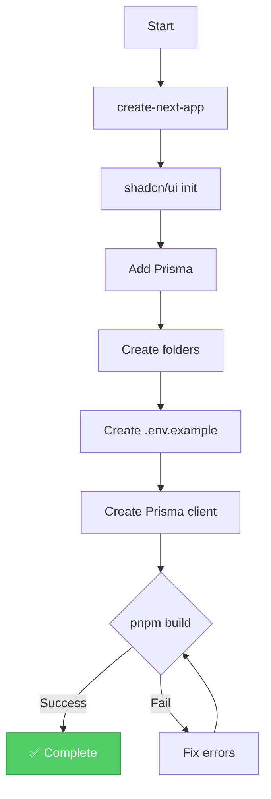

# Specification — US-0.1.1 Initialize Project Structure
# Đặc tả — US-0.1.1 Khởi tạo Cấu trúc Dự án
<!-- Generated: 2026-02-05 | Branch: feature/sgs-cs-helper-us-0.1.1 -->

---

## TL;DR

| Aspect | Value |
|--------|-------|
| Feature | Initialize Next.js 16.0.10 Project Structure |
| Status | Draft |
| Functional Requirements | 7 |
| Non-Functional Requirements | 4 |
| Affected Roots | sgs-cs-hepper |
| Phase 0 Analysis | [solution-design.md](../00_analysis/solution-design.md) |

---

## 1. Overview

🇻🇳 User Story US-0.1.1 yêu cầu khởi tạo một dự án Next.js 16.0.10 với cấu trúc đúng, dependencies cần thiết, và các cấu hình để làm nền tảng cho toàn bộ sản phẩm SGS CS Order Tracker. Đây là story nền tảng - tất cả các story khác phụ thuộc vào nó.

🇬🇧 User Story US-0.1.1 requires initializing a Next.js 16.0.10 project with the correct structure, required dependencies, and configurations to serve as the foundation for the entire SGS CS Order Tracker product. This is the foundation story - all other stories depend on it.

---

## 2. Goals & Non-Goals

### Goals / Mục tiêu

🇻🇳
1. **Tạo dự án Next.js 16.0.10** với App Router, TypeScript, Tailwind CSS
2. **Cài đặt và cấu hình** shadcn/ui component library
3. **Thiết lập Prisma ORM** với schema placeholder cho database
4. **Tạo cấu trúc thư mục** theo hướng dẫn tech stack
5. **Tạo template biến môi trường** (.env.example)
6. **Xác nhận build thành công** - `pnpm build` passes

🇬🇧
1. **Create Next.js 16.0.10 project** with App Router, TypeScript, Tailwind CSS
2. **Install and configure** shadcn/ui component library
3. **Set up Prisma ORM** with placeholder schema for database
4. **Create folder structure** per tech stack instructions
5. **Create environment template** (.env.example)
6. **Verify build succeeds** - `pnpm build` passes

### Non-Goals / Ngoài phạm vi

🇻🇳
1. **KHÔNG** triển khai authentication (US-1.1.x)
2. **KHÔNG** triển khai upload file (US-1.2.x)
3. **KHÔNG** kết nối database thực (US-0.3.1)
4. **KHÔNG** cấu hình CI/CD
5. **KHÔNG** deploy lên production

🇬🇧
1. **NOT** implementing authentication (US-1.1.x)
2. **NOT** implementing file upload (US-1.2.x)
3. **NOT** connecting to actual database (US-0.3.1)
4. **NOT** configuring CI/CD
5. **NOT** deploying to production

---

## 3. User Stories

### US-0.1.1: Initialize Project Structure

🇻🇳 Là **developer**, tôi muốn **có một dự án Next.js được thiết lập đúng cách với tất cả dependencies cần thiết**, để **tôi có thể bắt đầu xây dựng các tính năng trên nền tảng vững chắc**.

🇬🇧 As a **developer**, I want **a properly set up Next.js project with all required dependencies**, so that **I can start building features on a solid foundation**.

---

## 4. Requirements Matrix

| ID | Title | Priority | Type | Covered By |
|----|-------|----------|------|------------|
| FR-001 | Next.js 16.0.10 with App Router | Must | Functional | TC-001 |
| FR-002 | TypeScript Strict Mode | Must | Functional | TC-002 |
| FR-003 | Tailwind CSS + shadcn/ui | Must | Functional | TC-003 |
| FR-004 | Prisma ORM Setup | Must | Functional | TC-004 |
| FR-005 | Environment Template | Must | Functional | TC-005 |
| FR-006 | Folder Structure | Must | Functional | TC-006 |
| FR-007 | Build Verification | Must | Functional | TC-007 |
| NFR-001 | Node.js 20+ Compatibility | Must | Compatibility | TC-C01 |
| NFR-002 | pnpm Package Manager | Must | Tooling | TC-T01 |
| NFR-003 | Vercel Deployment Ready | Should | Deployment | TC-D01 |
| NFR-004 | Clean Code Structure | Should | Maintainability | TC-M01 |

---

## 5. Functional Requirements

### FR-001: Next.js 16.0.10 with App Router

| Aspect | Detail |
|--------|--------|
| Priority | Must |
| Affected Roots | sgs-cs-hepper |

#### Description

🇻🇳 Dự án phải được tạo bằng `create-next-app` với Next.js phiên bản 16.0.10, sử dụng App Router (không phải Pages Router). Cấu hình mặc định phải bao gồm TypeScript và Tailwind CSS.

🇬🇧 The project must be created using `create-next-app` with Next.js version 16.0.10, using the App Router (not Pages Router). Default configuration must include TypeScript and Tailwind CSS.

#### Acceptance Criteria

- [ ] AC1: `package.json` contains `"next": "16.0.10"` or compatible version
- [ ] AC2: `src/app/` directory exists (App Router structure)
- [ ] AC3: `src/app/layout.tsx` exists as root layout
- [ ] AC4: `src/app/page.tsx` exists as home page

---

### FR-002: TypeScript Strict Mode

| Aspect | Detail |
|--------|--------|
| Priority | Must |
| Affected Roots | sgs-cs-hepper |

#### Description

🇻🇳 TypeScript phải được cấu hình ở chế độ strict với các settings được khuyến nghị cho dự án Next.js. Điều này đảm bảo type safety trong toàn bộ codebase.

🇬🇧 TypeScript must be configured in strict mode with recommended settings for Next.js projects. This ensures type safety throughout the codebase.

#### Acceptance Criteria

- [ ] AC1: `tsconfig.json` exists with `"strict": true`
- [ ] AC2: No TypeScript errors on initial build
- [ ] AC3: Path alias `@/*` maps to `src/*`

---

### FR-003: Tailwind CSS + shadcn/ui

| Aspect | Detail |
|--------|--------|
| Priority | Must |
| Affected Roots | sgs-cs-hepper |

#### Description

🇻🇳 Tailwind CSS phải được cài đặt và cấu hình. shadcn/ui phải được khởi tạo với cấu hình mặc định (New York style, CSS variables). Các component cơ bản sẽ được cài đặt sau khi cần.

🇬🇧 Tailwind CSS must be installed and configured. shadcn/ui must be initialized with default configuration (New York style, CSS variables). Base components will be installed as needed later.

#### Acceptance Criteria

- [ ] AC1: `tailwind.config.ts` exists with proper content paths
- [ ] AC2: `components.json` exists (shadcn/ui config)
- [ ] AC3: `src/components/ui/` directory exists
- [ ] AC4: CSS variables are configured in `globals.css`

---

### FR-004: Prisma ORM Setup

| Aspect | Detail |
|--------|--------|
| Priority | Must |
| Affected Roots | sgs-cs-hepper |

#### Description

🇻🇳 Prisma ORM phải được cài đặt với schema placeholder. Schema phải định nghĩa các model cơ bản (User, Order, Config) nhưng chưa cần migrations. Prisma client singleton phải được tạo để tránh connection exhaustion.

🇬🇧 Prisma ORM must be installed with a placeholder schema. Schema must define basic models (User, Order, Config) but migrations are not required yet. Prisma client singleton must be created to prevent connection exhaustion.

#### Acceptance Criteria

- [ ] AC1: `prisma/schema.prisma` exists with PostgreSQL provider
- [ ] AC2: Schema includes User, Order, Config models (placeholder)
- [ ] AC3: `src/lib/db/index.ts` exists with Prisma singleton pattern
- [ ] AC4: `@prisma/client` is in dependencies

---

### FR-005: Environment Template

| Aspect | Detail |
|--------|--------|
| Priority | Must |
| Affected Roots | sgs-cs-hepper |

#### Description

🇻🇳 File `.env.example` phải được tạo để documentation các biến môi trường cần thiết. File này sẽ giúp developers mới nhanh chóng setup môi trường local.

🇬🇧 File `.env.example` must be created to document required environment variables. This file will help new developers quickly set up their local environment.

#### Acceptance Criteria

- [ ] AC1: `.env.example` exists in project root
- [ ] AC2: Contains `DATABASE_URL` placeholder
- [ ] AC3: Contains `NEXTAUTH_SECRET` placeholder
- [ ] AC4: Contains `NEXTAUTH_URL` placeholder
- [ ] AC5: Contains Google OAuth placeholders (`GOOGLE_CLIENT_ID`, `GOOGLE_CLIENT_SECRET`)

---

### FR-006: Folder Structure

| Aspect | Detail |
|--------|--------|
| Priority | Must |
| Affected Roots | sgs-cs-hepper |

#### Description

🇻🇳 Cấu trúc thư mục phải tuân theo hướng dẫn tech stack. Các thư mục placeholder phải được tạo với file `.gitkeep` để maintain structure trong git.

🇬🇧 Folder structure must follow tech stack instructions. Placeholder directories must be created with `.gitkeep` files to maintain structure in git.

#### Acceptance Criteria

- [ ] AC1: `src/app/(auth)/` directory exists (route group)
- [ ] AC2: `src/app/(dashboard)/` directory exists (route group)
- [ ] AC3: `src/app/api/` directory exists
- [ ] AC4: `src/components/` directory exists
- [ ] AC5: `src/lib/` directory exists with subdirectories (db, auth, excel, utils)
- [ ] AC6: `src/types/` directory exists
- [ ] AC7: `src/hooks/` directory exists

---

### FR-007: Build Verification

| Aspect | Detail |
|--------|--------|
| Priority | Must |
| Affected Roots | sgs-cs-hepper |

#### Description

🇻🇳 Dự án phải build thành công với `pnpm build`. Không được có TypeScript errors hoặc ESLint errors blocking build.

🇬🇧 The project must build successfully with `pnpm build`. There must be no TypeScript errors or ESLint errors blocking the build.

#### Acceptance Criteria

- [ ] AC1: `pnpm build` completes without errors
- [ ] AC2: `.next/` directory is created after build
- [ ] AC3: No TypeScript errors during build
- [ ] AC4: No ESLint errors during build

---

## 6. Non-Functional Requirements

### NFR-001: Node.js 20+ Compatibility

| Aspect | Detail |
|--------|--------|
| Category | Compatibility |
| Metric | Node.js version ≥ 20.0.0 |

#### Description

🇻🇳 Dự án phải tương thích với Node.js 20 trở lên, đây là yêu cầu của Next.js 16.

🇬🇧 The project must be compatible with Node.js 20 or higher, which is required by Next.js 16.

---

### NFR-002: pnpm Package Manager

| Aspect | Detail |
|--------|--------|
| Category | Tooling |
| Metric | All commands use pnpm |

#### Description

🇻🇳 pnpm phải được sử dụng làm package manager. `pnpm-lock.yaml` phải được commit vào git.

🇬🇧 pnpm must be used as the package manager. `pnpm-lock.yaml` must be committed to git.

---

### NFR-003: Vercel Deployment Ready

| Aspect | Detail |
|--------|--------|
| Category | Deployment |
| Metric | Vercel auto-detection works |

#### Description

🇻🇳 Cấu hình dự án phải tương thích với auto-detection của Vercel. Không cần cấu hình đặc biệt khi deploy.

🇬🇧 Project configuration must be compatible with Vercel's auto-detection. No special configuration needed when deploying.

---

### NFR-004: Clean Code Structure

| Aspect | Detail |
|--------|--------|
| Category | Maintainability |
| Metric | Follows tech stack conventions |

#### Description

🇻🇳 Code phải tuân theo conventions được định nghĩa trong tech stack instructions: absolute imports với `@/` alias, proper file organization.

🇬🇧 Code must follow conventions defined in tech stack instructions: absolute imports with `@/` alias, proper file organization.

---

## 7. User Flow

| Step | Action | System Response | Next Step |
|------|--------|-----------------|-----------|
| 1 | Run create-next-app | Project scaffolded | 2 |
| 2 | Initialize shadcn/ui | Config created | 3 |
| 3 | Add Prisma | Schema created | 4 |
| 4 | Create folders | Structure ready | 5 |
| 5 | Create .env.example | Template ready | 6 |
| 6 | Run pnpm build | Build succeeds | End |

### Flow Diagram



---

## 8. Data Models

```prisma
// prisma/schema.prisma (placeholder)

generator client {
  provider = "prisma-client-js"
}

datasource db {
  provider = "postgresql"
  url      = env("DATABASE_URL")
}

// Placeholder models - will be detailed in US-0.3.1

model User {
  id        String   @id @default(cuid())
  email     String?  @unique
  name      String?
  role      Role     @default(STAFF)
  createdAt DateTime @default(now())
  updatedAt DateTime @updatedAt
}

model Order {
  id             String   @id @default(cuid())
  jobNumber      String   @unique
  status         String   @default("pending")
  registeredDate DateTime
  requiredDate   DateTime
  createdAt      DateTime @default(now())
  updatedAt      DateTime @updatedAt
}

model Config {
  id    String @id @default(cuid())
  key   String @unique
  value String
}

enum Role {
  SUPER_ADMIN
  ADMIN
  STAFF
}
```

---

## 9. API Contracts

Not applicable for this story. API routes will be added in subsequent stories.

---

## 10. Edge Cases

| ID | Scenario | Expected Behavior | Priority |
|----|----------|-------------------|----------|
| EC-001 | pnpm not installed | Show install command | Must handle |
| EC-002 | Node.js < 20 | Show upgrade instructions | Must handle |
| EC-003 | Port 3000 in use | Next.js auto-selects next port | Auto-handled |
| EC-004 | Git not initialized | create-next-app handles it | Auto-handled |

### EC-001: pnpm Not Installed

🇻🇳
**Khi:** Developer chưa cài đặt pnpm
**Thì:** Hiển thị hướng dẫn: `npm install -g pnpm`
**Lý do:** pnpm là package manager bắt buộc

🇬🇧
**When:** Developer doesn't have pnpm installed
**Then:** Show instructions: `npm install -g pnpm`
**Rationale:** pnpm is the required package manager

### EC-002: Node.js Version Too Old

🇻🇳
**Khi:** Node.js version < 20
**Thì:** create-next-app sẽ fail với error message rõ ràng
**Lý do:** Next.js 16 yêu cầu Node.js 20+

🇬🇧
**When:** Node.js version < 20
**Then:** create-next-app will fail with clear error message
**Rationale:** Next.js 16 requires Node.js 20+

---

## 11. Error Handling

| Error Condition | User Message | System Action |
|-----------------|--------------|---------------|
| pnpm not found | "Please install pnpm first" | Provide install command |
| Node too old | "Node.js 20+ required" | Provide upgrade instructions |
| Build fails | "Check TypeScript errors" | Show error details |

---

## 12. Cross-Root Impact

| Root | Changes | Sync Required |
|------|---------|---------------|
| sgs-cs-hepper | New Next.js project created | No |
| a-z-copilot-flow | No changes (tooling only) | No |

### Integration Points

🇻🇳 Không có integration points vì đây là story foundation. Các story sau sẽ build trên foundation này.

🇬🇧 No integration points as this is a foundation story. Subsequent stories will build on this foundation.

---

## 13. Dependencies

| Dependency | Type | Status |
|------------|------|--------|
| next@16.0.10 | Package | New |
| react@19 | Package | New |
| react-dom@19 | Package | New |
| typescript@5 | Package | New |
| tailwindcss | Package | New |
| prisma | Package | New |
| @prisma/client | Package | New |
| shadcn/ui | Component Library | New |

---

## 14. Risks & Assumptions

### Risks

| Risk | Impact | Mitigation |
|------|--------|------------|
| Next.js 16 breaking changes | Medium | Follow official migration guide |
| shadcn/ui compatibility | Low | Use latest stable version |
| Prisma version conflicts | Low | Use recommended version |

### Assumptions

| # | Assumption | Validated |
|---|------------|-----------|
| 1 | pnpm is available globally | Pending |
| 2 | Node.js 20+ is installed | Pending |
| 3 | Git is installed | Pending |
| 4 | Internet connection for downloads | Assumed |

---

## 15. Open Questions

| # | Question | Status | Answer |
|---|----------|--------|--------|
| 1 | Which shadcn/ui components to install initially? | Resolved | None - add as needed |
| 2 | Database provider (Vercel Postgres vs Supabase)? | Deferred | Document both in .env.example |

---

## 16. Notes

🇻🇳
- Story này là foundation cho toàn bộ dự án
- Không cần database connection thực tế ở giai đoạn này
- Prisma schema là placeholder, sẽ được hoàn thiện trong US-0.3.1
- Folder placeholders sẽ chứa `.gitkeep` để maintain structure

🇬🇧
- This story is the foundation for the entire project
- No actual database connection needed at this stage
- Prisma schema is placeholder, will be finalized in US-0.3.1
- Folder placeholders will contain `.gitkeep` to maintain structure

---

## Approval

| Role | Name | Status | Date |
|------|------|--------|------|
| Spec Author | Copilot | ✅ Done | 2026-02-05 |
| Tech Reviewer | ... | ⏳ Pending | ... |

---

## Next Step

🇻🇳 Sau khi phê duyệt, tiến hành **Phase 2: Task Planning**.

🇬🇧 After approval, proceed to **Phase 2: Task Planning**.

Reply: `approved` or `revise: <feedback>`
